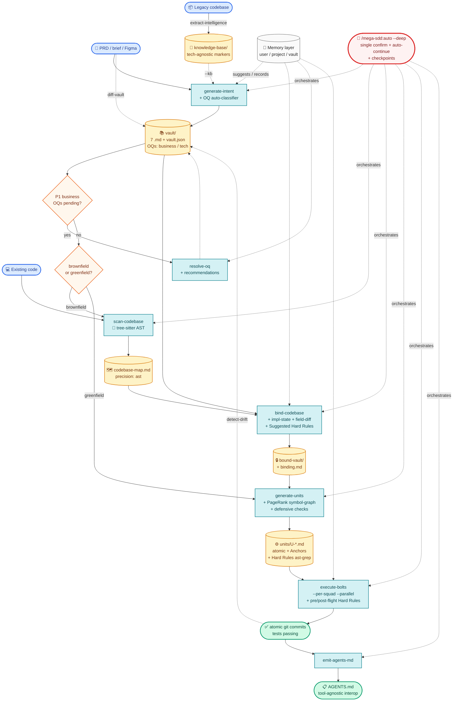

<div align="center">

# mega-sdd

### Spec-driven AI development pipeline. One command. Working code.

*PRD or idea → vault → atomic units → tested commits. With anti-hallucination at every handoff, persistent memory across sessions, and AST-precise grounding.*

**Plugin:** `mega-sdd` · **Version:** 3.13.0 · **License:** MIT

</div>

---

## 30-second pitch

```bash
/mega-sdd:auto ./prd.md
```

That's it. Mega-sdd runs the full pipeline: parse PRD → scan codebase → bind claims → generate atomic units → execute bolts via TDD → commit code. Single upfront confirmation; auto-continues unless something needs human input.

**For the new user**: skip to [Quick start](#quick-start) below.
**For the technical reader**: see [Architecture deep dive](#architecture-deep-dive) collapsed below.

---

## Quick start (5 minutes)

### 1. Install

```bash
# In Claude Code:
/plugin marketplace add https://gitlab.com/airnd1/grand-design-spec.git
/plugin install mega-sdd
/plugin install superpowers   # recommended companion (TDD discipline)
```

For higher precision (recommended, optional):

```bash
# macOS:
brew install tree-sitter ast-grep ripgrep jd

# Cross-platform:
cargo install tree-sitter-cli ast-grep ripgrep
go install github.com/josephburnett/jd@latest
```

Mega-sdd works WITHOUT these native binaries (graceful fallbacks). Install for AST-precise extraction + faster diff + structured analysis. Full install matrix: [`plugins/mega-sdd/references/tooling-install.md`](plugins/mega-sdd/references/tooling-install.md).

### 2. Try a guided scenario

Step-by-step walkthroughs in [`tests/scenarios/`](tests/scenarios/):

| Your situation | Start here |
|---|---|
| Brand new — want minimum viable demo | [Scenario 1 — Greenfield from idea](tests/scenarios/scenario-1-greenfield-from-idea.md) (15 min) |
| Have a PRD; existing project | [Scenario 2 — PRD-driven feature](tests/scenarios/scenario-2-prd-driven-feature.md) (30 min) |
| Field-level gap (PRD says X, code has Y) | [Scenario 3 — Field-level extension](tests/scenarios/scenario-3-field-extension.md) (20 min) |
| Legacy codebase → modern rebuild | [Scenario 4 — Legacy rebuild](tests/scenarios/scenario-4-legacy-rebuild.md) (4 hours) |
| Multi-team coordination | [Scenario 5 — Multi-squad parallel](tests/scenarios/scenario-5-multi-squad-parallel.md) (45 min) |
| Something halted; need to recover | [Scenario 6 — Recovery from halt](tests/scenarios/scenario-6-recovery-from-halt.md) (15 min) |

Each scenario:
- Concrete copy-paste inputs
- Expected outputs at each phase
- Common pitfalls + recovery
- Sample PRD included ([`tests/scenarios/sample-prd-clinic.md`](tests/scenarios/sample-prd-clinic.md))

### 3. Common invocations

```bash
/mega-sdd:auto ./prd.md                   # PRD → working code (5 phases)
/mega-sdd:auto ./legacy-php/ --out=./new/ # Legacy KB → vault → code (6 phases)
/mega-sdd:auto "build a clinic system"    # Free-text brief → code (3 phases)
/mega-sdd:auto                            # CWD-driven (inspect state, propose chain)
/mega-sdd:auto --resume                   # Continue paused/halted chain
```

Single confirmation. Auto-continues clean phases. Halts surface YAML blockers with `next_action` field — exactly what to run to recover.

---

## Why mega-sdd

> **Without it**: PRD → "build this" handoff → AI agent invents entities/files/patterns → drift cascades → expensive rework.
> **With it**: PRD → intent vault (cited claims) → bound to live codebase (AST precise) → atomic units shaped as polished prompts → bolts via TDD with pre/post-flight Hard Rule validation → memory accumulates across runs → drift detected early.

**13-layer anti-hallucination defense** (v3.13.0):

1. Intent layer — uncertain claims promote to Open Questions; never guess
2. OQ classification — business vs tech; tech auto-resolves via codebase scan
3. Binding gate — vault claims validated; CONFLICTs BLOCK pipeline
4. Implementation-state — IMPLEMENTED / NEW / PARTIAL_FIELDS_MISSING / UNKNOWN per claim
5. Unit grounding — `target_files` whitelist + mandatory `acceptance_test` + Anchors citing patterns
6. Hard Rule pre/post-flight — ast-grep validates constraints at bolt time
7. AST-precise extraction — tree-sitter (Aider pattern)
8. Memory layer — suggestions only; mandatory audit log + rollback
9. Drift detection — code vs vault + constitution reconciliation
10. Interface lock — cross-squad consumed interfaces must be `status: locked`
11. **Constitution layer** (v3.10+) — project-facing rules in 8th vault file; clauses inject into bolt Hard Rules
12. **Property-Based Testing** (v3.11+) — invariants over input space; counterexamples preserved on violation
13. **Convergence loops** (v3.12+) — auto-recovery on cycle-eligible halts via memory recommendations; max-cycles limit

---

## Pipeline overview



**Legend**:
- 🟦 inputs (PRD, code, legacy) · 🟨 artifacts produced · 🟩 outputs · 🟧 decisions · 🟫 cross-cutting (memory) · 🟥 orchestrator
- **Solid arrows** = pipeline flow · **Dotted arrows** = orchestration + cross-cutting

All phases auto-chained via `/mega-sdd:auto`. Each phase produces typed handoff YAML for the orchestrator to continue. Halts on real issues (CONFLICT, business OQ P1, Hard Rule violation, dedup ambiguity, etc.); auto-continues otherwise.

---

## Other commands (when you need manual control)

Most users only need `/mega-sdd:auto`. These exist for power users + edge cases:

| Category | Commands | When |
|---|---|---|
| **Primary** ⭐ | `auto` | Always start here |
| **Phase commands** (manual control) | `generate-intent`, `extract-intelligence`, `scan-codebase`, `bind-codebase`, `generate-units`, `execute-bolts`, `orchestrate-flow` | When you want phase-by-phase control |
| **Event-driven** | `resolve-oq`, `diff-vault`, `detect-drift` | Triggered by halts, PRD revisions, periodic checks |
| **Maintenance** | `memory`, `migrate-rules`, `migrate-paths`, `update-plugin` | Rare/one-off configuration |
| **Diagnostic (auto-invoked)** | `lint-units`, `analyze-parallelism`, `list-modules`, `emit-agents-md` | Run automatically by `auto`; available standalone for debugging |

`/mega-sdd:auto` is the dominant path. Other commands exist for advanced use + most users never type them.

---

<details>
<summary><b>🏗️ Architecture deep dive</b></summary>

### Who · What · When · Where · Why · How

| | |
|---|---|
| **What** | Multi-phase pipeline mapping to superpowers' `read → scan → writing-plans → executing-plans`. 11 skills + 1 anchor + 20 slash commands (1 primary + 19 advanced/auto-invoked). |
| **Who** | **Architects** produce intent without repo access. **Devs / AI** scan + bind with read-only repo access. **AI agents** ship bolts with write access via superpowers. |
| **When** | After PRD signed off, brief captured, OR legacy codebase available. Replaces ad-hoc "build this" handoff with a structured contract surviving all the way to working code. |
| **Where** | All outputs under `<project>/.mega-sdd/` (Iter 10 consolidation). User memory at `~/.mega-sdd/`. Project source unchanged. |
| **Why** | The architect/dev hallucination boundary is the #1 source of AI-dev rework. Mega-sdd inserts mandatory binding gate + per-claim implementation-state classification + AST-validated Hard Rules + memory-driven suggestions that learn from past patterns without auto-applying them. |
| **How** | 10-layer anti-hallucination defense, TDD discipline via vendored superpowers, halt-on-blocker protocol, deterministic tech (tree-sitter + ast-grep + ripgrep + jd), markdown-driven memory with mandatory audit log + rollback. |

### Folder layout (v3.4+)

```
<project>/
├── .mega-sdd/                              # ALL mega-sdd outputs
│   ├── config.yaml                          # project-level config
│   ├── vaults/<slug>/                       # vault per project
│   │   ├── 00-index.md ... 06-constraints.md, vault.json
│   │   ├── binding.md, bound/, units/, bolts/
│   │   ├── _meta/squads.yaml, modules.yaml  # multi-squad + modules
│   │   ├── interfaces/                      # cross-squad contracts
│   │   ├── .memory/                         # vault-scope memory
│   │   └── .internal/                       # checkpoints + symbol-graph
│   ├── knowledge-base/                      # legacy KB (extract-intelligence)
│   ├── codebase/codebase-map.md             # scan output
│   ├── memory/                              # project memory
│   │   ├── decisions.md, conventions.md, outcomes.md
│   │   └── archived-vaults/<slug>/
│   └── exports/                             # future tool-agnostic exports
├── AGENTS.md                                 # tool-agnostic interop (root)
├── CLAUDE.md                                 # project AI context (optional)
└── (project source: app/, routes/, src/, etc.)
```

User-scope: `~/.mega-sdd/memory/` (cross-project preferences + patterns).

### Halt protocol

Mega-sdd halts on real issues; never silent failures. Common halt types:

- `bind_conflict` — vault claim contradicts code
- `dedup_ambiguous` — create unit targets existing files
- `hard_rule_violated` — bolt modified locked code
- `hard_rule_unparseable` — Hard Rule grammar invalid
- `cross_squad_interface_draft` — consumer waiting for producer to lock interface
- `module_blocked_by` — prerequisite module incomplete
- `quality_gate_failed` — extract-intelligence wave failed twice
- `oq_recommend_underspecified` — recommendation missing required fields
- `memory_schema_mismatch` — memory file version differs

Each halt emits a YAML `blocker` with `next_action` field. Resume via `/mega-sdd:auto --resume`.

Full halt protocol + recovery: [Scenario 6](tests/scenarios/scenario-6-recovery-from-halt.md).

### Versioning

- **Plugin**: SemVer. Major bump for breaking renames, rails changes, marketplace incompatibility, or new top-level entrypoints. v3.0 = ast-grep grammar migration. Currently 3.8.0.
- **Skills**: Per-skill `version:` in frontmatter. Bump on any content change.
- **Vault**: Internal `version` in `vault.json`, increments on `diff-vault` and `resolve-oq` events.
- **Unit IDs**: Zero-padded (`U-001`), stable across regenerations.
- **Memory schema**: `memory_schema: N` stamped per file; auto-migrate via memory skill.

</details>

<details>
<summary><b>⚡ Tech upgrades (v3.0+)</b></summary>

5 production-grade swaps from Iter 6 + Iter 14, all with graceful fallback:

| Subsystem | Native tool | Fallback |
|---|---|---|
| scan-codebase symbol extraction | tree-sitter (Aider pattern, 45k ⭐) | regex (v1.2 behavior) |
| Hard Rules grammar | ast-grep YAML v2 (5-10× expressivity) | bespoke v1 grammar preserved |
| Internal grep operations | ripgrep `--json` (structured records) | GNU grep |
| Vault JSON/YAML diff | jd (RFC-6902 patches; replay-able) | manual Read+compare |
| Vault prose lint | markdownlint-cli2 (optional) | skill-internal heuristics |

All adoptions OPTIONAL. Detection via `command -v`. Install once via your package manager — see [`plugins/mega-sdd/references/tooling-install.md`](plugins/mega-sdd/references/tooling-install.md).

</details>

<details>
<summary><b>🤖 Autonomy Layer (v2.0+)</b></summary>

Single-confirm pipeline-end execution with auto-continue, progress indication, CWD + mid-skill-checkpoint resume.

```bash
/mega-sdd:auto ./prd.md                    # detect → propose chain → confirm once → run
/mega-sdd:auto --resume                    # continue paused chain (CWD + checkpoint driven)
/mega-sdd:auto --step-after=bind-codebase  # manual handoff after binding
/mega-sdd:auto --shallow                   # opt-out of --deep (cap-3 default)
/mega-sdd:auto --manual                    # disable autonomy entirely
/mega-sdd:auto --memory-off                # disable memory layer
/mega-sdd:auto --no-lint                   # skip auto lint-units pass
/mega-sdd:auto --no-analyze                # skip auto analyze-parallelism
/mega-sdd:auto --no-agents-md              # skip auto AGENTS.md emit
```

ONE upfront confirmation. Halts may re-engage user mid-chain (test failures, conflict resolutions, hard-rule violations). Otherwise silent + auto-progresses.

</details>

<details>
<summary><b>🧠 Memory + Self-Learning (v2.1+)</b></summary>

Three scopes of markdown + JSON memory persist context across sessions. Self-learning via threshold-based suggestions (NEVER auto-applied without ACCEPT).

```bash
/mega-sdd:memory list                          # see what mega-sdd remembers
/mega-sdd:memory show decisions                # inspect specific topic
/mega-sdd:memory review                        # walk pending learning suggestions
/mega-sdd:memory prune --older-than=180d       # cleanup old entries
/mega-sdd:memory export ~/backup.tar.gz        # backup memory
```

10 anti-halu invariants from Iter 5: suggestion-only, audit log mandatory, rollback path, citation required, current-evidence wins, cross-project promotion explicit, `--memory-off` honored, memory does NOT affect halt-protocol.

</details>

<details>
<summary><b>📦 Repository structure</b></summary>

```
.
├── .claude-plugin/marketplace.json         # marketplace manifest
├── plugins/mega-sdd/                       # the plugin itself (v3.8.0)
│   ├── README.md                           # plugin folder shortform
│   ├── skills/                             # 11 skills + _vendored/
│   │   ├── using-mega-sdd/                 # anchor skill (auto-injected)
│   │   ├── memory/                         # memory + self-learning
│   │   ├── emit-agents-md/                 # AGENTS.md flatten
│   │   ├── extract-intelligence/           # legacy → KB
│   │   ├── generate-intent/                # PRD/brief/KB → vault
│   │   ├── scan-codebase/                  # tree-sitter AST scan
│   │   ├── bind-codebase/                  # validation gate
│   │   ├── generate-units/                 # atomic unit decomposition
│   │   ├── execute-bolts/                  # superpowers TDD
│   │   ├── orchestrate-flow/               # lifecycle router
│   │   ├── resolve-oq/                     # OQ resolver
│   │   ├── detect-drift/                   # code vs vault
│   │   ├── diff-vault/                     # PRD revision handler
│   │   └── _vendored/                      # superpowers fallback
│   ├── commands/                           # 20 slash commands
│   ├── references/                         # plugin-level conventions
│   │   ├── paths.md                        # canonical layout
│   │   └── tooling-install.md              # install matrix
│   ├── hooks/                              # SessionStart hook
│   ├── scripts/                            # sync-superpowers + migrations
│   └── CLAUDE.md                           # AI-agent contributor guidelines
├── docs/
│   ├── superpowers/specs/                  # design specs (14 iters)
│   ├── superpowers/audits/                 # honest audits (sprawl + quality)
│   ├── knowledge-base/                     # legacy default output
│   └── mega-sdd/                           # legacy vault output
├── tests/
│   ├── scenarios/                          # USER-FACING walkthroughs (NEW)
│   │   ├── README.md                       # scenario chooser
│   │   ├── sample-prd-clinic.md            # copy-paste sample PRD
│   │   └── scenario-1 ... scenario-6.md
│   ├── skill-triggering/                   # 14 manual trigger fixtures
│   ├── integration/                        # 7 E2E pipeline tests
│   └── vendoring/
├── CHANGELOG.md                            # 14 iterations documented
├── CONTRIBUTING.md
└── LICENSE
```

</details>

<details>
<summary><b>📝 Procedure cheat-sheet</b></summary>

| Scenario | Commands |
|---|---|
| **One-shot end-to-end** (recommended) | `/mega-sdd:auto ./prd.md` · `/mega-sdd:auto ./legacy/ --out=./new/` · `/mega-sdd:auto "brief"` |
| Phase-by-phase greenfield | `/mega-sdd:generate-intent "your idea"` then `/mega-sdd:orchestrate-flow` |
| Phase-by-phase brownfield | `/mega-sdd:generate-intent ./prd.md` then `/mega-sdd:orchestrate-flow` |
| Legacy rebuild | `/mega-sdd:auto ./legacy/ --out=./rebuild/` |
| Unresolved P1 business OQs | `/mega-sdd:resolve-oq` |
| Bolt halted on Hard Rule | Review `<vault>/bolts/U-XXX/postflight.json`; revert OR edit unit's Hard rules; re-run unit |
| Resume after halt | `/mega-sdd:auto --resume` |
| Module-filtered execution | `/mega-sdd:execute-bolts --module=M-auth` |
| Squad-filtered execution | `/mega-sdd:execute-bolts --squad=squad-be` (multi-squad mode) |
| Per-squad parallel | `/mega-sdd:execute-bolts --per-squad --parallel` |
| Inspect memory | `/mega-sdd:memory show <topic>` |
| Review pending learning suggestions | `/mega-sdd:memory review` |
| Generate AGENTS.md manually | `/mega-sdd:emit-agents-md` (auto-runs at chain end by default) |
| Migrate vault layout (one-time) | `/mega-sdd:migrate-paths --dry-run` then `/mega-sdd:migrate-paths` |
| Migrate Hard Rules grammar (one-time) | `/mega-sdd:migrate-rules ./vault` |
| Privacy-sensitive run | `/mega-sdd:auto ./prd.md --memory-off` |
| Disable auto-diagnostic flags | `/mega-sdd:auto ./prd.md --no-lint --no-analyze --no-modules-summary --no-agents-md` |
| PRD revision arrived | `/mega-sdd:diff-vault ./new-prd.md` |
| Code drift periodic check | `/mega-sdd:detect-drift` |

</details>

---

## Contributing

See [`plugins/mega-sdd/CLAUDE.md`](plugins/mega-sdd/CLAUDE.md) for AI-agent contributor protocol — anti-slop PR requirements, anti-hallucination rail enforcement, skill edit policy, release process.

For human contributors: [`CONTRIBUTING.md`](CONTRIBUTING.md) — SDD invariants, testing guidelines, repository layout.

## License

MIT — see [`LICENSE`](LICENSE).

Vendored superpowers skills retain their original MIT license; see [`plugins/mega-sdd/skills/_vendored/ATTRIBUTION.md`](plugins/mega-sdd/skills/_vendored/ATTRIBUTION.md). Acknowledges [superpowers](https://github.com/obra/superpowers) by Jesse Vincent for plugin pattern inspiration. Tree-sitter `.scm` query patterns adapted from [Aider](https://github.com/Aider-AI/aider) (Apache 2.0).
