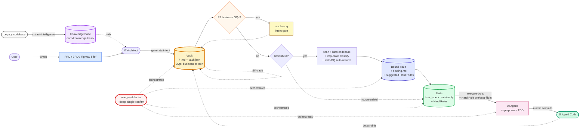

<div align="center">

# mega-sdd

### Spec-Driven Development as an autonomous agent pipeline.

*Turn a PRD, brief, or legacy codebase into working code via AI dev — with anti-hallucination at every handoff and a single-command end-to-end autonomous mode.*

**Plugin:** `mega-sdd` · **Version:** 2.0.0 · **License:** MIT
**Predecessor:** `grand-design-spec@0.15` (deprecated — see Migration below)

</div>

---

## TL;DR

A multi-phase pipeline (read → scan → writing-plans → executing-plans, in superpowers terms) wraps your AI dev tools with anti-hallucination guarantees at every handoff. **One command runs the whole thing**:

```bash
/plugin marketplace add https://gitlab.com/airnd1/grand-design-spec.git
/plugin install mega-sdd

# Then in any project:
/mega-sdd:auto ./prd.md                   # PRD → vault → units → working code (5 phases)
/mega-sdd:auto ./legacy-php/ --out=./new/ # Legacy → KB → vault → units → code (6 phases)
/mega-sdd:auto "build a clinic system"    # Brief → vault → units → code (3 phases, greenfield)
/mega-sdd:auto                            # CWD-driven (inspects state, proposes chain)
```

Single upfront confirmation. Auto-continue between phases via handoff-YAML protocol. Halts on every existing blocker (binding conflicts, business OQs, hard-rule violations, dedup ambiguity, etc.). Resume any halted chain via `/mega-sdd:auto --resume`.

**Anti-hallucination still mandatory**. Autonomy = silent through clean paths; explicit halt on issues. Never bypass safety.

## What's new in v2.0 (Iter 4 — Autonomy Layer)

- **`/mega-sdd:auto`** — one-shot autonomous pipeline. Input detection (PRD / legacy code / vault / brief) → full chain with single confirmation.
- **`--deep` mode in `orchestrate-flow`** — lifts the 3-skill cap; chains to pipeline-end with auto-continue.
- **Handoff YAML protocol** — every skill emits structured handoff records under `--auto` so the orchestrator can chain phases without user re-invocation.
- **Sharper `using-mega-sdd` auto-trigger** — strong CWD signal + intent keyword auto-proposes the chain without explicit slash command.
- **Progress indication** — one-line per phase in chat (`▶ Phase N of M: ...` / `✓ ...`).
- **CWD-driven resume** — no persisted state file; cursor derives from artifact presence.

Builds on Iters 1-3 (1.5 → 1.7) which added implementation-state classification, tech-OQ auto-resolve (scan/recommend modes), Hard Rule pre/post-flight validation, and polished AI-coding-prompt unit body shape.

## Why mega-sdd

> **Without it**: PRD → "build it" handoff → AI dev tools invent entities/files/patterns → drift cascades → expensive rework.
> **With it**: PRD → intent vault → bound to live codebase → atomic units shaped as polished AI-coding prompts → bolts via superpowers TDD with Hard Rule pre/post-flight scan → drift detected & fixed early.

For **brownfield** projects (existing repos), a **codebase binding gate** validates intent against live code before unit generation. For **legacy rebuilds** on a different stack, `extract-intelligence` produces a tech-agnostic knowledge base that feeds the vault generator. Either way: no hallucinated entities, no duplicate units for already-implemented features, no AI agent fabricating constraints.

## Pipeline (actor flow)



## Primary commands (start here)

| Command | When to use |
|---|---|
| `/mega-sdd:auto` ⭐ | "Just run the whole thing" — input-detect + full pipeline + single confirm (recommended) |
| `/mega-sdd:orchestrate-flow` | "What's next?" — phase-by-phase auto-router (cap-3 default; `--deep` for pipeline-end) |
| `/mega-sdd:generate-intent` | "I'm starting from a PRD or just an idea" |
| `/mega-sdd:extract-intelligence` | "I have a legacy codebase to rebuild on a different stack" |
| `/mega-sdd:resolve-oq` | "I need to answer open questions before going further" |

Most users only need `/mega-sdd:auto`. Advanced commands available in the section below.

## Anti-hallucination defense (8 layers)

1. **Intent layer** — uncertain claims promote to Open Questions. Architect never guesses.
2. **OQ classification** (v1.6+) — OQs tagged `business` (human-decided) vs `tech` (auto-resolvable). Tech OQs use `scan` mode (deterministic codebase probe) or `recommend` mode (AI pick with mandatory rationale + citation + fallback). Conservative default: `business / blocking / low`.
3. **Binding gate** — vault claims validated against codebase-map. CONFLICTs BLOCK pipeline. Never auto-resolved.
4. **Implementation-state classification** (v1.5+) — every CONFIRMED claim classified as IMPLEMENTED / NEW / UNKNOWN. Drives unit `task_type` so existing code doesn't get rebuilt.
5. **Unit grounding** — each unit carries `target_files` whitelist + mandatory `acceptance_test` + Anchors citing existing patterns. No invention at unit boundary.
6. **Hard Rule pre/post-flight** (v1.7+) — bolt-time scan validates `## Hard rules` (DO NOT modify X, naming, signatures, etc.). Violations halt PRE-commit; code stays in working tree for review.
7. **Drift detection** — code vs vault reconciliation suggested post-bolt; runs on demand.
8. **Interface lock gate** (multi-squad only) — cross-squad consumed interfaces must be `status: locked` before consumer execution.

Plus: KB (knowledge-base) `[VERIFIED]/[INFERRED]/[OPEN]` markers consulted by `bind-codebase` as secondary ground truth in legacy-rebuild scenarios.

---

<details>
<summary><b>📋 Advanced commands (full table)</b></summary>

| Slash command | Skill | Purpose |
|---|---|---|
| `/mega-sdd:auto` (v2.0) | _routes to_ `orchestrate-flow --deep --auto` | **One-shot autonomous pipeline.** Input detection (PRD / legacy / vault / brief). Single upfront confirmation. Auto-continue via handoff YAML. Halts preserved. |
| `/mega-sdd:orchestrate-flow` (v1.3) | **orchestrate-flow** | Lifecycle auto-router. Cap-3 default; `--deep` lifts cap to pipeline-end. `--resume` continues paused chains (CWD-driven). |
| `/mega-sdd:extract-intelligence` (v1.1) | **extract-intelligence** | Legacy-rebuild upstream. Wave-based parallel-subagent extraction (5 waves, ≤5 agents per wave). Produces tech-agnostic knowledge base with `[VERIFIED]/[INFERRED]/[OPEN]` markers. Output consumable by `generate-intent --kb=<path>` (Mode B brief). |
| `/mega-sdd:generate-intent` (v1.5) | **generate-intent** | PRD/brief → 7-file vault + `vault.json`. Auto-detect Mode A (structured PRD) vs Mode B (free-text). `--kb=<path>` consumes a knowledge-base. Auto-classifier tags OQs with `category` + `resolution_mode` + `classification_confidence`. |
| `/mega-sdd:scan-codebase` (v1.1) | **scan-codebase** | Heuristic repo mapper. Extracts public interfaces, routes, data models, naming conventions, test framework. Produces `codebase-map.md`. Required before binding. |
| `/mega-sdd:bind-codebase` (v1.5) | **bind-codebase** | **The keystone gate.** Validates vault claims vs codebase-map. Verdicts: CONFIRMED / CONFLICT / OQ. Adds Implementation State Map (IMPLEMENTED / NEW / UNKNOWN), Tech-OQ scan auto-resolve, Recommend-mode surfacing, Suggested Unit Hard Rules. **BLOCKS** unit generation on conflicts. Consults KB as secondary ground truth. |
| `/mega-sdd:generate-units` (v1.4) | **generate-units** | Decomposes bound-vault into atomic AI-executable unit specs. Reads Implementation State Map to assign `task_type: create | verify` (skips already-built code). Render pass validates polished prompt shape: Anchors mandatory + Hard rules parseable + Migration notes for extends + directive prose. Auto-pulls Anti-patterns + Hard rules from binding suggestions. |
| `/mega-sdd:execute-bolts` (v1.3) | **execute-bolts** | Executes units via superpowers (executing-plans + subagent-driven-development + test-driven-development). **Hard Rule pre-flight** snapshots state; **post-flight** re-validates BEFORE commit (DO_NOT_MODIFY / DO_NOT_ADD_DEPS / NAMING / SIGNATURE / FILE_PRESENCE). Violations halt with code preserved in working tree. `--per-squad` / `--squad=<id>` for multi-squad. |
| `/mega-sdd:resolve-oq` (v1.0) | **resolve-oq** | Interactive Open Question walker. Updates vault + bumps version. Handles `--binding` mode for post-binding-blocker resolution. |
| `/mega-sdd:diff-vault` (v1.0) | **diff-vault** | Vault evolution on PRD revisions. Computes structured diff, surfaces Resolved-OQ vs new PRD conflicts. |
| `/mega-sdd:detect-drift` (v1.0) | **detect-drift** | For `mode=existing` vaults: compares vault claims against live codebase. Flags drift (rename, type change, decision violation, code shipped without ADR). |
| `/mega-sdd:from-prompt` | _(deprecated alias)_ | Routes to `generate-intent --from-prompt`. Will be removed in v2.1. |

> **`/mega-sdd:update-plugin`**: command-only entry (no backing SKILL.md). Pulls latest plugin version, runs dep-doctor, prompts cache rebuild. Not a pipeline phase.

</details>

<details>
<summary><b>🏗️ Architecture deep dive</b></summary>

### Who · What · When · Where · Why · How

| | |
|---|---|
| **What** | Multi-phase pipeline mapping cleanly to superpowers' `read → scan → writing-plans → executing-plans (subagent-driven)`. 11 skills + 1 anchor + 1 one-shot command. |
| **Who** | **Architects** produce intent without repo access. **Devs / AI** scan + bind with read-only repo access. **AI agents** ship bolts with write access via superpowers. |
| **When** | After PRD signed off, brief captured, OR legacy codebase available. Replaces ad-hoc "build this" handoff with a structured contract that survives all the way to working code. |
| **Where** | Vaults default to `docs/mega-sdd/vaults/<slug>/`; knowledge bases to `docs/knowledge-base/`; units inside vault; bolts as atomic git commits on your branch; bolt reports in `<vault>/bolts/`. |
| **Why** | The architect/dev hallucination boundary is the #1 source of AI-dev rework. Architects assume things about code they don't see; AI tools invent things to fill the gap. Mega-SDD inserts a **mandatory codebase binding gate** between intent and unit generation, **per-claim implementation-state classification** to avoid rebuilding existing code, and **bolt-time Hard Rule enforcement** to prevent constraint violations at commit. |
| **How** | 8-layer anti-hallucination defense (intent + OQ classification + binding gate + implementation state + unit grounding + Hard Rule pre/post-flight + drift detect + interface lock), TDD discipline via vendored superpowers, halt-on-blocker protocol throughout. Autonomy Layer (v2.0) auto-chains the pipeline end-to-end via handoff YAML. |

### Pipeline (detailed, post v2.0)

```mermaid
flowchart TD
    LEG[legacy codebase<br/>different-stack rebuild] --> EX[extract-intelligence]
    EX --> KB[(knowledge-base/<br/>tech-agnostic<br/>+ markers)]
    KB -.->|--kb| B

    A[free-text brief<br/>OR PRD/BRD/Figma] --> B[generate-intent<br/>+ OQ auto-classifier]
    B --> V[(vault/<br/>7 files + vault.json<br/>OQs: business / tech)]

    V --> OQG{P1 business OQs?}
    OQG -->|yes| RO[resolve-oq] --> V
    OQG -->|no| C{brownfield?}
    C -->|no, greenfield| GU[generate-units]
    C -->|yes| S[scan-codebase]
    S --> M[(codebase-map.md)]
    M --> BI[bind-codebase<br/>+ impl-state classify<br/>+ tech-OQ scan/recommend<br/>+ Suggested Hard Rules]
    V --> BI
    BI --> BV[(bound-vault/<br/>+ binding.md)]
    BV --> GU

    GU --> U[(units/<br/>task_type create | verify<br/>+ Hard rules)]
    U --> E[execute-bolts<br/>+ Hard Rule pre/post-flight]
    E --> CO[(code commits)]

    CO --> DD[detect-drift]
    DD -.drift found.-> RO

    PRD2[new PRD revision] --> DV[diff-vault]
    DV --> B

    AUTO([/mega-sdd:auto --deep<br/>single confirm + auto-continue]) -.orchestrates.-> EX
    AUTO -.orchestrates.-> B
    AUTO -.orchestrates.-> GU
    AUTO -.orchestrates.-> E

    classDef phase fill:#d4f1f4,stroke:#0a7e8c
    classDef artifact fill:#fff4d4,stroke:#b58a00
    classDef entry fill:#e0d4f7,stroke:#5e3aa0
    classDef new fill:#fef2f2,stroke:#dc2626,stroke-width:3px
    class B,S,BI,GU,E,DD,DV,RO,OQG,EX phase
    class V,M,BV,U,CO,KB artifact
    class AUTO,A new
```

### What each phase produces

```
docs/mega-sdd/vaults/<name>/
├── 00-index.md          Navigation + Vault Lock Status + Auto-Classification Review + AI consumer notes + OQ roll-up
├── 01-overview.md       What, who, why, success metrics
├── 02-architecture.md   Components per layer, API contracts
├── 03-data-model.md     Entities (DBML), relations, constraints
├── 04-flows.md          User flows + system flows + per-flow Definition of Done
├── 05-decisions.md      ADR-lite: technical decisions with explicit source
├── 06-constraints.md    Technical, business, non-functional requirements
└── vault.json           Machine-readable manifest (OQs carry category + resolution_mode + confidence)
```

After **extract-intelligence** (legacy-rebuild path):
```
docs/knowledge-base/
├── README.md                          Master nav + critical findings + OQ roll-up
├── 00-overview/                       system-purpose, glossary, classification, actors-and-roles
├── 10-domains/                        1 file per business domain (11-section template)
├── 20-workflows/                      cross-cutting workflows (state machines)
├── 30-data-model/                     conceptual ERD + entities
├── 40-business-rules/                 regulatory + operational + hidden gotchas
├── 50-integrations/                   external contracts (conceptual, not protocol)
└── 99-rebuild-architecture/           suggested-erd / system-flow / dependency-graph / phasing
```

After **scan-codebase** (brownfield): `codebase-map.md` (public interfaces, routes, data models, conventions, pattern signatures from heuristic scan)

After **bind-codebase** (brownfield): `<vault>-bound/` (copy with inline binding annotations) + `binding.md` (verdicts + Implementation State Map + Tech-OQ Auto-Resolved + Tech-OQ Recommendations + Suggested Unit Hard Rules)

After **generate-units**: `<vault>/units/U-*.md` (atomic units with `task_type`, Anchors, Anti-patterns, Hard rules, Migration notes per task_type) + `_index.md` (dependency DAG)

After **execute-bolts**: git commits (atomic, one per unit; verify-units may skip) + `<vault>/bolts/U-XXX/bolt-report.md` (test results, files touched, retries) + `preflight.json` + `postflight.json` (Hard Rule snapshots + validation results)

**Multi-squad mode only (when ≥2 squads declared):**

```
docs/mega-sdd/vaults/<name>/
├── _meta/squads.yaml             Squad partition (id, label, ownership rules per layer/feature/hybrid model)
├── interfaces/_index.md          Cross-squad contract index
└── .obsidian/graph.json          Obsidian graph view config with per-squad color groups
```

### Trigger phrases

**English:** "spec out this feature" / "from this prompt" / "I only have an idea, not a PRD" / "scan codebase" / "bind vault to code" / "generate units" / "execute bolts" / "what's next?" / "drift detect" / "reverse engineer this legacy" / "extract domain knowledge" / "rebuild on different stack" / "auto" / "lanjut" / "next" / "proceed"

**Indonesian:** "pecah PRD ini buat dev" / "siapkan context buat AI dev" / "baku dari ide" / "spec ini" / "kontrak handoff" / "pecah vault jadi unit" / "jalanin unit" / "cek code vs vault" / "pecah legacy code jadi knowledge base" / "rebuild di stack baru" / "source of truth dari legacy" / "jalankan otomatis"

**Multi-squad:** "multi-squad mode" / "per-squad execution" / "subagent per squad" / "run for one squad" / "deliver to dev team" / "split into N squads" / "buat per tim" / "bagi ke squad" / "jalanin per squad"

### Architect/Dev separation

| Phase | Run by | Repo access |
|---|---|---|
| `extract-intelligence` | Dev / AI (wave-based subagents) | ✅ read-only (legacy code) |
| `generate-intent` | IT Architect | ❌ not required (consumes KB if `--kb` provided) |
| `scan-codebase` | Dev / AI | ✅ read-only |
| `bind-codebase` | Dev / AI | ✅ read-only (consults KB if present) |
| `generate-units` | Dev / AI | ✅ read-only |
| `execute-bolts` | AI agent | ✅ write |

Architects produce intent on a laptop with **zero new-repo access**. The binding gate enforces grounding at hand-off without ever putting code in front of the architect. For legacy rebuilds, `extract-intelligence` does the archaeology on the OLD codebase; vault generation feeds from KB without re-reading legacy code.

### Halt protocol (across all skills)

Any skill MAY emit a structured `blocker` artifact (YAML, per `vault-contract.md §halt-protocol`) and pause the pipeline. All halt-types are preserved in v2.0 — autonomy mode is silent through CLEAN paths only. Selected halt types:

**Intent/binding/units:**
- `bind_conflict` — `bind-codebase` on CONFLICT count > 0
- `diff_conflict` — `diff-vault` on new PRD vs resolved-OQ/ADR contradiction
- `drift_framework_mismatch` — `detect-drift` on vault/code framework signal mismatch
- `cycle_detected` — `generate-units` dependency DAG has a cycle
- `dedup_ambiguous` (v1.5+) — `generate-units` `create` unit's target_files all exist; binding gap suspected
- `mode_migrate` — `orchestrate-flow` CWD signals contradict vault.mode
- `quality_gate_failed` — `extract-intelligence` wave gate fails twice

**OQ classification (v1.6+):**
- `oq_tech_missing_mode` — tech OQ lacks `resolution_mode`
- `oq_recommend_underspecified` — recommend-mode OQ missing required fields
- `oq_recommend_citation_invalid` — recommend citation doesn't resolve in codebase-map/KB
- `oq_scan_missing_query` — scan-mode OQ lacks `scan_query`

**Hard Rules (v1.7+):**
- `hard_rule_unparseable` — `execute-bolts` pre-flight rule line doesn't match grammar
- `hard_rule_unanchored` — SIGNATURE_RULE references symbol not in codebase-map
- `hard_rule_violated` — `execute-bolts` post-flight detected rule violation (code preserved in working tree)
- `unit_underspecified` — `generate-units` render pass found missing Anchors/Migration notes
- `verify_unit_writable` — `task_type: verify` unit has writable target_files

**Multi-squad:**
- `cross_squad_dep_invalid` — `generate-units` rejects cross-squad direct `depends_on`
- `interface_ref_missing` — `generate-units` dangling interface reference
- `cross_squad_ambiguous` — two squads claim same artifact at same precedence
- `cross_squad_interface_draft` — consumer waits for producer to lock interface

**Execution:**
- `dep_missing` — `execute-bolts` missing superpowers + vendored fallback
- `test_fail` — `execute-bolts` acceptance test fails after max retries

### Versioning

- **Plugin:** SemVer. Major bump for breaking renames, rails changes, marketplace incompatibility, OR new top-level entrypoints (v2.0 added `/mega-sdd:auto` + cap-lift semantics).
- **Skills:** Per-skill `version:` in frontmatter. Bump on any content change.
- **Vault:** Internal `version` in `vault.json`, monotonically increments on `diff-vault` and `resolve-oq` events.
- **Unit IDs:** Zero-padded (`U-001`), stable across regenerations (preserved by content hash).

</details>

<details>
<summary><b>🤖 Autonomy Layer (v2.0+, Iter 4)</b></summary>

The v2.0 release wraps the existing pipeline in autonomous orchestration without changing any phase or any anti-halu rail.

### Single-confirm pipeline-end execution

```bash
/mega-sdd:auto ./prd.md
```

Input detection picks the starting phase, proposes the full chain (e.g., generate-intent → scan-codebase → bind-codebase → generate-units → execute-bolts — 5 phases), asks for ONE confirmation, then runs end-to-end. Each phase emits a handoff YAML (per `orchestrate-flow/references/handoff-contract.md`) and the orchestrator parses `next_action` to auto-invoke the next phase.

### Input shapes detected

| Input | Detected as | Chain start |
|---|---|---|
| `./prd.md` (or `.pdf`/`.docx`) | PRD file (Mode A) | `generate-intent <input>` |
| `./legacy-php/` (code dir, no vault) | Legacy codebase | `extract-intelligence <input> --out=<required>` |
| `./my-vault/` (has `vault.json`) | Existing vault | `bind-codebase` (or earlier if no codebase-map) |
| `"build a clinic system"` (quoted brief) | Mode B brief | `generate-intent --from-prompt <input>` |
| empty | CWD inspection | per `routing-rules.md` |

### Progress indication

Real-time chat lines per phase:

```
▶ Phase 3 of 5: invoking bind-codebase (./vault/ --auto)
... (skill output)
✓ Phase 3 of 5: bind-codebase → status: completed, items: 87 claims, blocked: 0
```

Status emoji: `✓` completed, `⏸` paused (e.g., business OQ triage needed), `⛔` halted (blocker).

### Halt behavior

Halt-protocol behavior is **identical** between `--shallow` (cap-3) and `--deep` (cap-lifted). Every blocker still fires. Chain stops; user resolves; runs `/mega-sdd:auto --resume`.

`--resume` is CWD-driven (no persisted state file). Cursor position derives from artifact presence — if `binding.md` exists with `conflict_count: 0`, the cursor skips bind-codebase and lands on the next phase.

### Manual escape hatches

| Flag | Behavior |
|---|---|
| `--shallow` | Revert to cap-3 mode (single chain of ≤3 skills) |
| `--manual` | Disable autonomy entirely; runs only the first phase; manual handoff after |
| `--step-after=<phase>` | Switch to manual handoffs after this phase |
| `--stop-after=<phase>` | Halt after this phase even if no blocker |
| `--resume` | Continue paused/halted chain (CWD-driven cursor) |

### Handoff YAML protocol

Every skill emits this at the end of its output when invoked with `--auto`:

```yaml
handoff:
  emitted_by: bind-codebase
  emitted_at: 2026-05-20T10:15:00Z
  status: completed
  artifacts:
    - /path/to/binding.md
    - /path/to/vault-bound/
  next_action:
    suggested_skill: mega-sdd:generate-units
    suggested_args: ["./vault-bound/", "--auto"]
    rationale: "Binding clean; vault ready for unit generation."
  blockers: []
  metrics:
    items_processed: 87
    items_blocked: 0
```

Orchestrator parses, auto-invokes `next_action.suggested_skill`. Status `paused`/`halted` stops the chain instead of continuing. See `plugins/mega-sdd/skills/orchestrate-flow/references/handoff-contract.md` for the full per-skill schema.

</details>

<details>
<summary><b>📦 Repository structure</b></summary>

```
.
├── .claude-plugin/marketplace.json     # marketplace manifest
├── plugins/mega-sdd/                   # the plugin itself (v2.0.0)
│   ├── README.md                       # plugin-folder shortform
│   ├── skills/                         # 11 skills (10 SDD pipeline + 1 anchor) + _vendored/
│   ├── commands/                       # 12 slash commands (11 skill + 1 command-only)
│   ├── hooks/                          # SessionStart hook for anchor injection
│   ├── scripts/                        # sync-superpowers + version bump
│   └── CLAUDE.md                       # AI-agent contributor guidelines
├── docs/
│   ├── superpowers/specs/              # design specs (incl. extract-intelligence + tech-OQ-autoresolve + autonomy-layer)
│   ├── superpowers/plans/              # implementation plans
│   ├── knowledge-base/                 # default output for /mega-sdd:extract-intelligence
│   └── mega-sdd/                       # default output dir for generated vaults
├── tests/
│   ├── skill-triggering/               # 11 manual fixtures (one per skill + auto.test.md)
│   ├── hooks/                          # automated hook tests
│   ├── vendoring/                      # vendor sync tests
│   └── integration/                    # 5 E2E pipeline tests (greenfield, brownfield, multi-squad, impl-state, autonomy-clean, autonomy-halt)
├── CHANGELOG.md
├── CONTRIBUTING.md
└── LICENSE
```

</details>

<details>
<summary><b>🔄 Migrating from grand-design-spec</b></summary>

`grand-design-spec@0.15` users:

| Old | New |
|---|---|
| `/grand-design-spec:flow` | `/mega-sdd:orchestrate-flow` (or `/mega-sdd:auto` for end-to-end) |
| `/grand-design-spec:grand-design-spec` | `/mega-sdd:generate-intent` |
| `/grand-design-spec:from-prompt` | `/mega-sdd:generate-intent --from-prompt` (or just quote the brief) |
| `/grand-design-spec:drift-detect` | `/mega-sdd:detect-drift` |
| `/grand-design-spec:vault-diff` | `/mega-sdd:diff-vault` |
| `/grand-design-spec:resolve-oq` | `/mega-sdd:resolve-oq` |
| `/grand-design-spec:update` | `/mega-sdd:update-plugin` |

**Existing vaults remain fully compatible** — `vault.json` schema extended additively across v1.x → v2.0. OQs without `category` field load as `business`. Bindings without Implementation State Map → all units default to `task_type: create`. Units without Hard rules → `execute-bolts` skips pre/post-flight. For brownfield projects, retrofit binding by running:

```bash
/mega-sdd:scan-codebase
/mega-sdd:bind-codebase ./vaults/<your-vault>
```

`grand-design-spec` will remain in the marketplace as **deprecated** for 2 release cycles, then be removed.

</details>

<details>
<summary><b>📝 Procedure cheat-sheet</b></summary>

| Scenario | Commands |
|---|---|
| **One-shot end-to-end** (recommended) | `/mega-sdd:auto ./prd.md` (PRD) · `/mega-sdd:auto ./legacy-php/ --out=./new/` (legacy) · `/mega-sdd:auto "build idea"` (brief) |
| New idea → working code (greenfield, phase-by-phase) | `/mega-sdd:generate-intent "your idea"` then `/mega-sdd:orchestrate-flow` |
| Existing PRD → working code (brownfield, phase-by-phase) | `/mega-sdd:generate-intent ./prd.md` then `/mega-sdd:orchestrate-flow` |
| Legacy rebuild on different stack | `/mega-sdd:auto ./legacy/ --out=./rebuild/` (full chain) or `/mega-sdd:extract-intelligence ./legacy/ --out=./rebuild/` (KB only) |
| Vault has unresolved P1 business OQs | `/mega-sdd:resolve-oq` (intent gate — runs before scan/bind/units) |
| Tech OQs flagged for review | inspect `00-index.md` "## Auto-Classification Review" section; `/mega-sdd:resolve-oq --accept-recommendations` (Iter 2+) |
| PRD revision arrived | `/mega-sdd:diff-vault ./new-prd.md` |
| Code drift detected | `/mega-sdd:detect-drift` then `/mega-sdd:resolve-oq` |
| Resume from interrupted phase | `/mega-sdd:auto --resume` or `/mega-sdd:orchestrate-flow --deep --resume` |
| One-shot per phase | `/mega-sdd:<phase>` (e.g., `:bind-codebase ./vaults/v1`) |
| Multi-squad project (≥2 dev teams) | `/mega-sdd:generate-intent ./prd.md` (select ≥2 squads in Q&A) → `/mega-sdd:auto --deep` → `/mega-sdd:execute-bolts --per-squad` (parallel subagents) |
| Dev team runs only their squad | `/mega-sdd:execute-bolts --squad=<squad-id>` (filters to one squad's units) |
| Bolt halted on Hard rule violation | Review `<vault>/bolts/U-XXX/postflight.json`; revert offending change OR edit unit's Hard rules; re-run `/mega-sdd:execute-bolts U-XXX` |

</details>

## Contributing

See [`plugins/mega-sdd/CLAUDE.md`](plugins/mega-sdd/CLAUDE.md) for AI-agent contributor protocol — anti-slop PR requirements, anti-hallucination rail enforcement, skill edit policy, release process.

For human contributors, see [`CONTRIBUTING.md`](CONTRIBUTING.md) — SDD invariants, testing guidelines, repository layout.

## License

MIT — see [`LICENSE`](LICENSE).

Vendored superpowers skills retain their original MIT license; see [`plugins/mega-sdd/skills/_vendored/ATTRIBUTION.md`](plugins/mega-sdd/skills/_vendored/ATTRIBUTION.md). Acknowledges [superpowers](https://github.com/obra/superpowers) by Jesse Vincent as the design inspiration for plugin patterns (anchor skill, hook injection, skill content structure).
