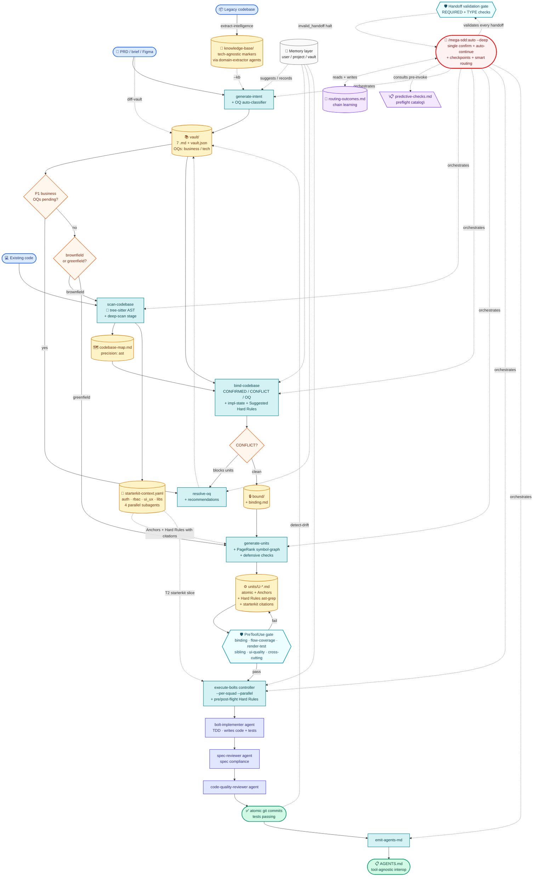

<div align="center">

# mega-sdd

### Spec-driven AI development pipeline. One command. Working code.

*PRD or idea → vault → atomic units → tested commits. With anti-hallucination at every handoff, persistent memory across sessions, and AST-precise grounding.*

**Plugin:** `mega-sdd` · **Version:** 4.2.0 · **License:** MIT

</div>

---

## 30-second pitch

```bash
/mega-sdd:auto ./prd.md
```

That's it. Mega-sdd runs the full pipeline: parse PRD → scan codebase → bind claims → generate atomic units → execute bolts via TDD → commit code. Single upfront confirmation; auto-continues unless something needs human input.

**For the new user**: skip to [Quick start](#quick-start) below.
**For the technical reader**: see [Architecture deep dive](#architecture-deep-dive) collapsed below.

---

## Quick start (5 minutes)

### 1. Install

```bash
# In Claude Code:
/plugin marketplace add https://gitlab.com/airnd1/grand-design-spec.git
/plugin install mega-sdd
/plugin install superpowers   # recommended companion (TDD discipline)
```

For higher precision (optional, recommended), let the OS-aware installer set up the native binaries for you:

```bash
/mega-sdd:install-deps
```

It detects your OS + package manager (brew / apt / dnf / winget / scoop / cargo / npm / go) and installs `tree-sitter`, `ast-grep`, `ripgrep`, `jd`, `pandoc`, `tectonic` with safety rails (never sudo-auto, never `curl|bash`, always verify). Every tool is optional — mega-sdd has a graceful fallback for each. Manual one-liners per platform (incl. Windows): [`plugins/mega-sdd/references/tooling-install.md`](plugins/mega-sdd/references/tooling-install.md).

### 2. Keep it updated

```bash
/mega-sdd:update-plugin                          # pull the latest plugin from the marketplace repo (fast-forward only)
/plugin marketplace update grand-design-spec     # rebuild the plugin cache to the new version
```

Then restart Claude Code (or reload the plugin) so new commands + skills register. `/mega-sdd:update-plugin` reports the before→after version, never touches your project, and tells you if you're already current. Your installed version shows in the header above and in `/plugin`.

### 3. Try a guided scenario

Step-by-step walkthroughs in [`tests/scenarios/`](tests/scenarios/):

| Your situation | Start here |
|---|---|
| Brand new — want minimum viable demo | [Scenario 1 — Greenfield from idea](tests/scenarios/scenario-1-greenfield-from-idea.md) (15 min) |
| Have a PRD; existing project | [Scenario 2 — PRD-driven feature](tests/scenarios/scenario-2-prd-driven-feature.md) (30 min) |
| Field-level gap (PRD says X, code has Y) | [Scenario 3 — Field-level extension](tests/scenarios/scenario-3-field-extension.md) (20 min) |
| Legacy codebase → modern rebuild | [Scenario 4 — Legacy rebuild](tests/scenarios/scenario-4-legacy-rebuild.md) (4 hours) |
| Multi-team coordination | [Scenario 5 — Multi-squad parallel](tests/scenarios/scenario-5-multi-squad-parallel.md) (45 min) |
| Something halted; need to recover | [Scenario 6 — Recovery from halt](tests/scenarios/scenario-6-recovery-from-halt.md) (15 min) |

Each scenario:
- Concrete copy-paste inputs
- Expected outputs at each phase
- Common pitfalls + recovery
- Sample PRD included ([`tests/scenarios/sample-prd-clinic.md`](tests/scenarios/sample-prd-clinic.md))

### 4. Common invocations

```bash
/mega-sdd:auto ./prd.md                   # PRD → working code (5 phases)
/mega-sdd:auto ./legacy-php/ --out=./new/ # Legacy KB → vault → code (6 phases)
/mega-sdd:auto "build a clinic system"    # Free-text brief → code (3 phases)
/mega-sdd:auto                            # CWD-driven (inspect state, propose chain)
/mega-sdd:auto --resume                   # Continue paused/halted chain
```

Single confirmation. Auto-continues clean phases. Halts surface YAML blockers with `next_action` field — exactly what to run to recover.

---

## Why mega-sdd

> **Without it**: PRD → "build this" handoff → AI agent invents entities/files/patterns → drift cascades → expensive rework.
> **With it**: PRD → intent vault (cited claims) → bound to live codebase (AST precise) → atomic units shaped as polished prompts → bolts via TDD with pre/post-flight Hard Rule validation → memory accumulates across runs → drift detected early.

**Layered anti-hallucination + delivery-quality defense.** Every handoff is contracted and grounded:

1. Intent layer — uncertain claims promote to Open Questions; never guess
2. OQ classification — business vs tech; tech auto-resolves via codebase scan
3. Binding gate — vault claims validated; CONFLICTs BLOCK pipeline
4. Implementation-state — IMPLEMENTED / NEW / PARTIAL_FIELDS_MISSING / UNKNOWN per claim
5. Unit grounding — `target_files` whitelist + mandatory `acceptance_test` + Anchors citing patterns
6. Hard Rule pre/post-flight — ast-grep validates constraints at bolt time
7. AST-precise extraction — tree-sitter (Aider pattern)
8. Memory layer — suggestions only; mandatory audit log + rollback
9. Drift detection — code vs vault + constitution reconciliation
10. Interface lock — cross-squad consumed interfaces must be `status: locked`
11. **Constitution layer** — project-facing rules in an 8th vault file; clauses inject into bolt Hard Rules
12. **Property-Based Testing** — invariants over input space; counterexamples preserved on violation
13. **Convergence loops** — auto-recovery on cycle-eligible halts via memory recommendations; max-cycles limit
14. **Schema validation gate** — every handoff YAML validated against a typed schema at emission; missing REQUIRED/CONDITIONAL fields halt at the PRODUCER side (immediate developer feedback, not a silent consumer miss)
15. **Type-checked field propagation** — handoff schema declares TYPE annotations; the orchestrator validates types at each chain step; prevents silent shape drift (e.g., `scope.id` being a string in one skill but an object in another)
16. **Code-delivery quality gates** — tech-agnostic validators targeting *delivery* quality, not just structure: flow-step→artifact coverage (missing per-stage Form Requests + dead scaffold stubs), per-view render tests, cross-unit sibling-consistency (fan-out divergence + FK→relation), cross-cutting registration (the silent cross-branch-leak class), UI scaffold-tells (raw labels / unresolved FKs / unformatted money / native dialogs), dispatch enrichment, operator-workflow-UX, fan-out parity, UI-deferral, and KB→vault staging fidelity (a multi-step wizard must not flatten into a single-form bolt). All read stack-specific signatures from the framework-convention pack — add a stack = add a pack; graceful SKIP otherwise — each fixture-verified against a real Laravel run.
17. **Hybrid enforcement** (v4) — the highest-value code-delivery gates (flow-coverage, render-test, sibling-consistency, ui-quality, cross-cutting-registration) **hard-block** `execute-bolts` via a synchronous PreToolUse hook, alongside the core invariants. The rest (dispatch-prompt, operator-UX, fan-out-parity, ui-deferral, vault-flow-staging) are **advisory** — surfaced by `/mega-sdd:analyze`, never blocking. The doctrine: deterministic hooks for what must hold; advisory for the rest; never prose pretending to enforce.
18. **Extraction-depth disciplines** — `extract-intelligence` reasons deeper automatically: writer↔reader provenance, enumerate-all-sites, behaviour-as-executed, structural file classification. An advisory `validate-extraction-scorecard` flags a hidden gap (a PARTIAL/MISSING principle with zero `[OPEN]` markers — silent drift); `bind-codebase` consults it as preflight. Framing: the KB captures business intent + flow; the rebuild owns implementation cleanliness.

---

## What makes mega-sdd special

Most AI-dev tools take a PRD → spit code in one shot. **mega-sdd inserts structured intermediate artifacts** (vault → binding → units → bolts) so every layer is auditable, every handoff is contracted, and the AI agent has explicit constraints to respect at each step.

Six differentiators:

### 1. One command, full pipeline

```bash
/mega-sdd:auto ./prd.md
```

PRD → cited-claim vault → bound to live codebase → atomic units → tested commits → AGENTS.md. **Single upfront confirmation**; auto-continues clean phases. Halts surface YAML blockers with concrete `next_action` (exact command to recover). No "what do I run next?" friction.

### 2. Smart orchestrator

The orchestrator learns and predicts:
- **Memory-driven routing** — reads `.mega-sdd/memory/routing-outcomes.md`. After 3+ successful runs of your project shape, it recommends the proven chain (overriding default routing). Fingerprint-cached via lock-file sha256 — re-scan with unchanged deps is 0sec.
- **Predictive halt detection** — runs lightweight preflight checks BEFORE invoking each skill. Instead of "scan-codebase halted on `dep_missing` 8 min in", you see *"before chain starts: tree-sitter not installed; install or use --engine=regex"* — actionable upfront.

### 3. Flawless handoffs

Every cross-skill handoff is **validated at the producer side**:
- **Schema validation gate** — handoff-contract.md declares fields as REQUIRED/CONDITIONAL/OPTIONAL. Missing required field = `invalid_handoff` halt; producer skill author gets immediate feedback. No more "field claimed in skill body prose but missing in handoff template" debt.
- **Type-checked propagation** — every field has a TYPE annotation. `scope.id` is `string (enum)`, not object. `mutability.tier_distribution` is `object {LOCKED: int, INTENT: int, ARTIFACT: int}`. Shape mismatch = `handoff_type_mismatch` halt at the moment of drift.

### 4. Starterkit-aware

mega-sdd auto-detects your stack's actual feature patterns when a framework is present (no flag needed). For Laravel: which auth lib (Sanctum/Breeze/Jetstream/Fortify/Passport), which RBAC (Spatie/permission), which UI stack (Alpine/Livewire/Inertia + Tailwind + SweetAlert2/Toastr), which DataTable, your custom layout extends, your library inventory with usage hints.

Generated units cite YOUR conventions: *"MUST extend layouts.app (Citation: starterkit-context.yaml §ui_ux.layout_extends)"*, *"MUST use SweetAlert2 for confirmations"*. Bolts produce code that matches your starterkit by default — no per-session reminders. Framework-agnostic; extend `references/lib-patterns/<framework>/` for any stack.

### 5. Memory that learns across sessions

Three scopes of markdown + JSON memory:
- **User** (`~/.mega-sdd/memory/`) — preferences, patterns, learning log (cross-project)
- **Project** (`<project>/.mega-sdd/memory/`) — decisions, conventions, outcomes, **routing-outcomes**
- **Vault** (`<vault>/.memory/`) — classifier-accuracy, bind-history, bolt-outcomes

**Suggestion-only**: every learning surfaces via `/mega-sdd:memory review` (ACCEPT/REJECT/DEFER). Mandatory audit log + rollback path. Memory NEVER affects halt protocol — your halts stay deterministic. Disable entirely via `--memory-off`.

### 6. Audit-driven evolution (honest debt accounting)

Major versions close prior audit findings. Each audit is structured markdown with severity-classified findings + a recommended closure scope — **nothing hidden, nothing inflated.** The **v4 lean-core** rebuild came out of [`research/2026-06-04-architecture-modernization-audit.md`](research/2026-06-04-architecture-modernization-audit.md) (skills −70%, Hybrid enforcement, first-class agents). The latest — **v4.2.0** — was an advisor-guided skills audit that traced the enforcement spine end-to-end and found + closed one real moat gap (the binding→units gate now enforces CONFLICT *resolution*, not just ID propagation); trail in [`plugins/mega-sdd/AUDIT.md`](plugins/mega-sdd/AUDIT.md).

The full per-release audit history lives in [`docs/superpowers/audits/`](docs/superpowers/audits/) and every version in [`CHANGELOG.md`](CHANGELOG.md) — that's how the plugin keeps technical debt visible instead of accumulating silently.

### TL;DR — why pick mega-sdd

If you've ever had an AI agent invent a function that doesn't exist, hallucinate a database column, or "implement" a feature that doesn't actually compile — mega-sdd's pipeline structure prevents those failure modes upstream. The vault forces citation of claims. The binding gate forces validation against the live codebase. Hard Rules force AST-validated constraints. Schema validation forces typed contracts. Memory accumulates context without auto-applying it. **You get an AI development workflow that's been hardened against the actual ways AI agents drift.**

---

## Pipeline overview



**Legend**:
- 🟦 inputs (PRD, code, legacy) · 🟨 artifacts produced · 🟩 outputs · 🟧 decisions · 🟫 cross-cutting (memory) · 🟥 orchestrator
- 🟪 **intelligence layer**: routing-outcomes, predictive-checks · 🟦 **validation gate** (schema + type-check)
- 📐 **starterkit-context**: auto-detected feature inventory feeding both generate-units (Anchors+Rules) + execute-bolts (T2 slice)
- **Solid arrows** = pipeline flow · **Dotted arrows** = orchestration + cross-cutting + intelligence-layer consults

All phases auto-chained via `/mega-sdd:auto`. Each phase produces typed handoff YAML for the orchestrator to validate (schema + types) + continue. Halts on real issues (CONFLICT, business OQ P1, Hard Rule violation, `invalid_handoff`, `handoff_type_mismatch`, `predictive_check_failed`, dedup ambiguity, etc.); auto-continues otherwise.

**Intelligence layer reading order:** at chain start, orchestrator (1) reads `routing-outcomes.md` to recommend past-successful chain for this project shape, (2) runs `predictive-checks.md` catalog for each skill BEFORE invoking (catches `dep_missing` upfront instead of mid-chain), (3) validates every received handoff against schema (REQUIRED/CONDITIONAL/OPTIONAL + TYPE annotations) before propagating to next skill. At chain end, writes outcome row to routing-outcomes.md so future runs benefit.

---

## Other commands (when you need manual control)

Most users only need `/mega-sdd:auto`. These exist for power users + edge cases:

| Category | Commands | When |
|---|---|---|
| **Primary** ⭐ | `auto` | Always start here |
| **Phase commands** (manual control) | `generate-intent`, `extract-intelligence`, `scan-codebase`, `bind-codebase`, `generate-units`, `execute-bolts`, `orchestrate-flow` | When you want phase-by-phase control |
| **Event-driven** | `resolve-oq`, `diff-vault`, `detect-drift` | Triggered by halts, PRD revisions, periodic checks |
| **Maintenance** | `memory`, `migrate-rules`, `migrate-paths`, `update-plugin` | Rare/one-off configuration |
| **Verify / consistency** | `analyze` | One-command cross-artifact consistency report (`CONSISTENCY-REPORT.md`) — runs the validators incl. the demoted advisory gates; auto-runs at chain boundaries, invoke anytime |
| **Diagnostic (auto-invoked)** | `lint-units`, `analyze-parallelism`, `list-modules`, `emit-agents-md`, `emit-fsd` | Run automatically by `auto`; available standalone for debugging |

`/mega-sdd:auto` is the dominant path. Other commands exist for advanced use + most users never type them.

---

<details>
<summary><b>🏗️ Architecture deep dive</b></summary>

### Who · What · When · Where · Why · How

| | |
|---|---|
| **What** | Multi-phase pipeline: extract → intent → scan → bind → units → bolts. **16 skills** (lean routers + progressive disclosure — each `SKILL.md` ≤500 lines, detail in on-demand `references/`) + **4 first-class subagents** (`agents/`: bolt-implementer, spec-reviewer, code-quality-reviewer, domain-extractor) + **25 slash commands** (your manual `/mega-sdd:` CLI entry points, one per pipeline step). |
| **Who** | **Architects** produce intent without repo access. **Devs / AI** scan + bind with read-only repo access. **AI agents** ship bolts with write access via superpowers. |
| **When** | After PRD signed off, brief captured, OR legacy codebase available. Replaces ad-hoc "build this" handoff with a structured contract surviving all the way to working code. |
| **Where** | All outputs consolidated under `<project>/.mega-sdd/`. User memory at `~/.mega-sdd/`. Project source unchanged. |
| **Why** | The architect/dev hallucination boundary is the #1 source of AI-dev rework. Mega-sdd inserts mandatory binding gate + per-claim implementation-state classification + AST-validated Hard Rules + memory-driven suggestions that learn from past patterns without auto-applying them. |
| **How** | Layered anti-hallucination defense; execution via first-class bolt agents (two-stage review: spec compliance then code quality), with superpowers TDD as optional technique; halt-on-blocker protocol; deterministic tech (tree-sitter + ast-grep + ripgrep + jd); markdown-driven memory with mandatory audit log + rollback. |

### Folder layout

```
<project>/
├── .mega-sdd/                              # ALL mega-sdd outputs
│   ├── config.yaml                          # project-level config
│   ├── vaults/<slug>/                       # vault per project
│   │   ├── 00-index.md ... 06-constraints.md, vault.json
│   │   ├── binding.md, bound/, units/, bolts/
│   │   ├── _meta/squads.yaml, modules.yaml  # multi-squad + modules
│   │   ├── interfaces/                      # cross-squad contracts
│   │   ├── .memory/                         # vault-scope memory
│   │   └── .internal/                       # checkpoints + symbol-graph
│   ├── knowledge-base/                      # legacy KB (extract-intelligence)
│   ├── codebase/codebase-map.md             # scan output
│   ├── memory/                              # project memory
│   │   ├── decisions.md, conventions.md, outcomes.md
│   │   └── archived-vaults/<slug>/
│   └── exports/                             # future tool-agnostic exports
├── AGENTS.md                                 # tool-agnostic interop (root)
├── CLAUDE.md                                 # project AI context (optional)
└── (project source: app/, routes/, src/, etc.)
```

User-scope: `~/.mega-sdd/memory/` (cross-project preferences + patterns).

### Halt protocol

Mega-sdd halts on real issues; never silent failures. Common halt types:

- `bind_conflict` — vault claim contradicts code
- `dedup_ambiguous` — create unit targets existing files
- `hard_rule_violated` — bolt modified locked code
- `hard_rule_unparseable` — Hard Rule grammar invalid
- `cross_squad_interface_draft` — consumer waiting for producer to lock interface
- `module_blocked_by` — prerequisite module incomplete
- `quality_gate_failed` — extract-intelligence wave failed twice
- `oq_recommend_underspecified` — recommendation missing required fields
- `memory_schema_mismatch` — memory file version differs

Each halt emits a YAML `blocker` with `next_action` field. Resume via `/mega-sdd:auto --resume`.

Full halt protocol + recovery: [Scenario 6](tests/scenarios/scenario-6-recovery-from-halt.md).

### Versioning

- **Plugin**: SemVer; `plugin.json` is the single source of truth (`marketplace.json` matches it). Major bump for breaking renames, rails changes, or marketplace incompatibility. Currently **4.2.0** (moat audit: binding→units gate enforces CONFLICT resolution; 4.1.0 added UI/UX design intelligence; 4.0.0 v4 lean-core).
- **Skills**: Per-skill `version:` in frontmatter. Bump on any content change.
- **Vault**: Internal `version` in `vault.json`, increments on `diff-vault` and `resolve-oq` events.
- **Unit IDs**: Zero-padded (`U-001`), stable across regenerations.
- **Memory schema**: `memory_schema: N` stamped per file; auto-migrate via memory skill.

</details>

<details>
<summary><b>⚡ Native-tool upgrades (all optional, graceful fallback)</b></summary>

8 optional native tools, each with a graceful fallback. `/mega-sdd:install-deps` installs them OS-aware (or install manually):

| Subsystem | Native tool | Fallback |
|---|---|---|
| scan-codebase symbol extraction | tree-sitter (Aider pattern) | regex engine |
| Hard Rules grammar | ast-grep YAML v2 (5–10× expressivity) | bespoke v1 grammar |
| Internal grep operations | ripgrep `--json` (structured records) | GNU grep |
| Vault JSON/YAML diff | jd (RFC-6902 patches; replay-able) | manual Read+compare |
| FSD PDF rendering | pandoc + tectonic | Markdown / HTML print-to-PDF |
| Vault prose lint | markdownlint-cli2 | skill-internal heuristics |
| PR automation | gh (GitHub CLI) | manual PR |

All OPTIONAL, detected via `command -v`. Install with `/mega-sdd:install-deps`, or per-platform (incl. Windows) — see [`plugins/mega-sdd/references/tooling-install.md`](plugins/mega-sdd/references/tooling-install.md).

</details>

<details>
<summary><b>🤖 Autonomy Layer</b></summary>

Single-confirm pipeline-end execution with auto-continue, progress indication, CWD + mid-skill-checkpoint resume.

```bash
/mega-sdd:auto ./prd.md                    # detect → propose chain → confirm once → run
/mega-sdd:auto --resume                    # continue paused chain (CWD + checkpoint driven)
/mega-sdd:auto --step-after=bind-codebase  # manual handoff after binding
/mega-sdd:auto --shallow                   # opt-out of --deep (cap-3 default)
/mega-sdd:auto --manual                    # disable autonomy entirely
/mega-sdd:auto --memory-off                # disable memory layer
/mega-sdd:auto --no-lint                   # skip auto lint-units pass
/mega-sdd:auto --no-analyze                # skip auto analyze-parallelism
/mega-sdd:auto --no-agents-md              # skip auto AGENTS.md emit
/mega-sdd:auto --no-fsd                    # skip auto FSD emit
```

ONE upfront confirmation. Halts may re-engage user mid-chain (test failures, conflict resolutions, hard-rule violations). Otherwise silent + auto-progresses.

</details>

<details>
<summary><b>🧠 Memory + Self-Learning</b></summary>

Three scopes of markdown + JSON memory persist context across sessions. Self-learning via threshold-based suggestions (NEVER auto-applied without ACCEPT).

```bash
/mega-sdd:memory list                          # see what mega-sdd remembers
/mega-sdd:memory show decisions                # inspect specific topic
/mega-sdd:memory review                        # walk pending learning suggestions
/mega-sdd:memory prune --older-than=180d       # cleanup old entries
/mega-sdd:memory export ~/backup.tar.gz        # backup memory
```

10 memory-layer invariants (complement the layered pipeline defense above): suggestion-only, audit log mandatory, rollback path, citation required, current-evidence wins, cross-project promotion explicit, `--memory-off` honored, memory does NOT affect halt-protocol.

</details>

<details>
<summary><b>📦 Repository structure</b></summary>

```
.
├── .claude-plugin/marketplace.json         # marketplace manifest
├── plugins/mega-sdd/                       # the plugin itself (v4.2.0)
│   ├── README.md                           # plugin folder shortform
│   ├── skills/                             # 16 skills (lean routers + progressive disclosure) + _vendored/
│   │   ├── using-mega-sdd/                 # anchor skill (auto-injected)
│   │   ├── extract-intelligence/           # legacy → knowledge-base
│   │   ├── generate-intent/                # PRD/brief/KB → vault
│   │   ├── scan-codebase/                  # tree-sitter AST scan
│   │   ├── bind-codebase/                  # validation gate (CONFIRMED/CONFLICT/OQ)
│   │   ├── generate-units/                 # atomic unit decomposition
│   │   ├── execute-bolts/                  # bolt execution (two-stage agent review)
│   │   ├── orchestrate-flow/  resolve-oq/  detect-drift/  diff-vault/  analyze/
│   │   ├── memory/  emit-agents-md/  emit-fsd/  install-deps/
│   │   └── _vendored/                      # superpowers fallback
│   ├── agents/                             # 4 first-class subagents (bolt-implementer · spec/code reviewers · domain-extractor)
│   ├── commands/                           # 25 slash commands (manual /mega-sdd: CLI entry points)
│   ├── references/                         # plugin-level conventions
│   │   ├── paths.md                        # canonical layout
│   │   └── tooling-install.md              # install matrix
│   ├── hooks/                              # SessionStart anchor · Hybrid PreToolUse gate · PostToolUse validators · Stop
│   ├── scripts/                            # sync-superpowers + migrations
│   └── CLAUDE.md                           # AI-agent contributor guidelines
├── docs/
│   ├── superpowers/specs/                  # design specs
│   ├── superpowers/audits/                 # honest audits (sprawl + quality)
│   ├── knowledge-base/                     # legacy default output
│   └── mega-sdd/                           # legacy vault output
├── tests/
│   ├── scenarios/                          # USER-FACING walkthroughs
│   │   ├── README.md                       # scenario chooser
│   │   ├── sample-prd-clinic.md            # copy-paste sample PRD
│   │   └── scenario-1 ... scenario-6.md
│   ├── skill-triggering/                   # per-skill trigger fixtures
│   ├── integration/                        # 7 E2E pipeline tests
│   └── vendoring/
├── CHANGELOG.md                            # version history → v4.2.0 (pre-v4 rotated to CHANGELOG-ARCHIVE.md)
├── CONTRIBUTING.md
└── LICENSE
```

</details>

<details>
<summary><b>📝 Procedure cheat-sheet</b></summary>

| Scenario | Commands |
|---|---|
| **One-shot end-to-end** (recommended) | `/mega-sdd:auto ./prd.md` · `/mega-sdd:auto ./legacy/ --out=./new/` · `/mega-sdd:auto "brief"` |
| Phase-by-phase greenfield | `/mega-sdd:generate-intent "your idea"` then `/mega-sdd:orchestrate-flow` |
| Phase-by-phase brownfield | `/mega-sdd:generate-intent ./prd.md` then `/mega-sdd:orchestrate-flow` |
| Legacy rebuild | `/mega-sdd:auto ./legacy/ --out=./rebuild/` |
| Unresolved P1 business OQs | `/mega-sdd:resolve-oq` |
| Bolt halted on Hard Rule | Review `<vault>/bolts/U-XXX/postflight.json`; revert OR edit unit's Hard rules; re-run unit |
| Resume after halt | `/mega-sdd:auto --resume` |
| Module-filtered execution | `/mega-sdd:execute-bolts --module=M-auth` |
| Squad-filtered execution | `/mega-sdd:execute-bolts --squad=squad-be` (multi-squad mode) |
| Per-squad parallel | `/mega-sdd:execute-bolts --per-squad --parallel` |
| Inspect memory | `/mega-sdd:memory show <topic>` |
| Review pending learning suggestions | `/mega-sdd:memory review` |
| Generate AGENTS.md manually | `/mega-sdd:emit-agents-md` (auto-runs at chain end by default) |
| Generate Confluence FSD manually | `/mega-sdd:emit-fsd` (auto-runs at chain end) |
| Install missing native deps (pandoc, tectonic, etc.) | `/mega-sdd:install-deps` (auto-detect OS + pkg mgr) |
| Update mega-sdd to the latest version | `/mega-sdd:update-plugin` then `/plugin marketplace update grand-design-spec` |
| Migrate vault layout (one-time) | `/mega-sdd:migrate-paths --dry-run` then `/mega-sdd:migrate-paths` |
| Migrate Hard Rules grammar (one-time) | `/mega-sdd:migrate-rules ./vault` |
| Privacy-sensitive run | `/mega-sdd:auto ./prd.md --memory-off` |
| Disable auto-diagnostic flags | `/mega-sdd:auto ./prd.md --no-lint --no-analyze --no-modules-summary --no-agents-md --no-fsd` |
| PRD revision arrived | `/mega-sdd:diff-vault ./new-prd.md` |
| Code drift periodic check | `/mega-sdd:detect-drift` |

</details>

---

## Contributing

See [`plugins/mega-sdd/CLAUDE.md`](plugins/mega-sdd/CLAUDE.md) for AI-agent contributor protocol — anti-slop PR requirements, anti-hallucination rail enforcement, skill edit policy, release process.

For human contributors: [`CONTRIBUTING.md`](CONTRIBUTING.md) — SDD invariants, testing guidelines, repository layout.

## License

MIT — see [`LICENSE`](LICENSE).

Vendored superpowers skills retain their original MIT license; see [`plugins/mega-sdd/skills/_vendored/ATTRIBUTION.md`](plugins/mega-sdd/skills/_vendored/ATTRIBUTION.md). Acknowledges [superpowers](https://github.com/obra/superpowers) by Jesse Vincent for plugin pattern inspiration. Tree-sitter `.scm` query patterns adapted from [Aider](https://github.com/Aider-AI/aider) (Apache 2.0).
