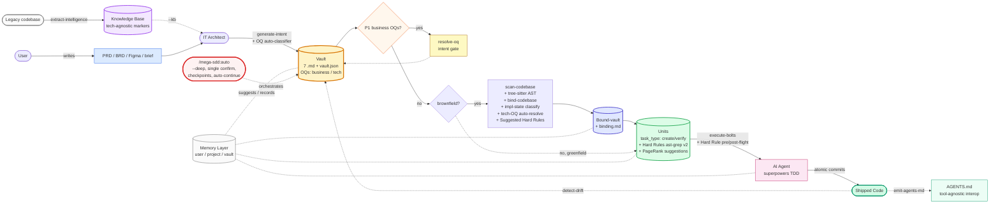
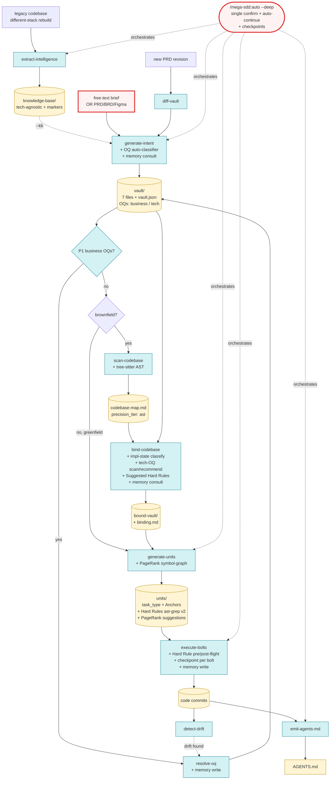

<div align="center">

# mega-sdd

### Spec-Driven Development as an autonomous agent pipeline with memory + AST-precise grounding.

*Turn a PRD, brief, or legacy codebase into working code via AI dev — anti-hallucination at every handoff, persistent memory across sessions, and tree-sitter / ast-grep validated rails.*

**Plugin:** `mega-sdd` · **Version:** 3.0.0 · **License:** MIT
**Predecessor:** `grand-design-spec@0.15` (deprecated — see Migration below)

</div>

---

## TL;DR

A multi-phase pipeline (read → scan → writing-plans → executing-plans, mirroring superpowers' shape) wraps your AI dev tools with anti-hallucination guarantees at every handoff. **One command runs the whole thing**:

```bash
/plugin marketplace add https://gitlab.com/airnd1/grand-design-spec.git
/plugin install mega-sdd

# Recommended: install tree-sitter + ast-grep for AST-precision (graceful fallback if absent)
brew install tree-sitter ast-grep      # macOS
# OR
cargo install tree-sitter-cli ast-grep # cross-platform

# Then in any project:
/mega-sdd:auto ./prd.md                   # PRD → vault → units → working code (5 phases)
/mega-sdd:auto ./legacy-php/ --out=./new/ # Legacy → KB → vault → units → code (6 phases)
/mega-sdd:auto "build a clinic system"    # Brief → vault → units → code (3 phases, greenfield)
/mega-sdd:auto                            # CWD-driven (inspects state, proposes chain)
```

Single upfront confirmation. Auto-continue between phases via handoff-YAML protocol. Halts on every existing blocker (binding conflicts, business OQs, hard-rule violations, dedup ambiguity, etc.). Resume via `/mega-sdd:auto --resume` (CWD-driven OR mid-skill checkpoint-driven).

**Anti-hallucination still mandatory**. Autonomy = silent through clean paths; explicit halt on issues. Never bypass safety.

## What's new in v3.0 (Iter 6 — Tech Upgrades)

Production-grade tech swaps with graceful fallback:

- **Tree-sitter engine** for `scan-codebase` — AST-precise symbol extraction (Aider's pattern, proven at 45k ⭐). Falls back to regex when tree-sitter absent.
- **ast-grep grammar v2** for Hard Rules — 5-10× expressivity + fix templates + single Rust binary. v1 legacy grammar preserved; explicit `/mega-sdd:migrate-rules` for opt-in upgrade.
- **PageRank symbol-graph** for `generate-units` target_files — personalized PageRank suggests related files via symbol references. Surfaced as informational `## PageRank suggestions` body section; user manually promotes (never silent rewrite).
- **AGENTS.md emitter** (new skill `mega-sdd:emit-agents-md`) — tool-agnostic interop with Continue.dev, Cursor, Aider via Linux Foundation AAIF AGENTS.md standard (60k+ repo ecosystem). Pure write-out; idempotent regen.
- **Checkpoint-graph** for `orchestrate-flow` — per-step JSONL checkpoints enable mid-skill resume (e.g., bind-codebase crashed at claim 45 of 100 → resume at claim 46). LangGraph-inspired pattern.

## What's in v2.1 (Iter 5 — Memory Layer)

- **3 memory scopes** (user / project / vault) of markdown + JSON files persist context across sessions
- **`/mega-sdd:memory`** skill — inspect / review / prune / promote / clear operations
- **Self-learning** via threshold-based suggestions — NEVER auto-applied; explicit ACCEPT via `/mega-sdd:memory review`; mandatory audit log + rollback path
- Complementary to Claude Code's `auto memory` (operational vs social)

## What's in v2.0 (Iter 4 — Autonomy Layer)

- **`/mega-sdd:auto`** — one-shot autonomous pipeline with input detection
- **`--deep` mode** lifts orchestrate-flow's 3-skill cap for pipeline-end execution
- **Handoff YAML protocol** for skill-to-skill auto-continue
- **Sharper `using-mega-sdd` auto-trigger** based on CWD + intent
- **Progress indication** per phase

## Why mega-sdd

> **Without it**: PRD → "build it" handoff → AI dev tools invent entities/files/patterns → drift cascades → expensive rework.
> **With it**: PRD → intent vault → bound to live codebase (AST-precise) → atomic units shaped as polished AI-coding prompts → bolts via superpowers TDD with Hard Rule pre/post-flight scan → memory accumulates patterns across runs → drift detected & fixed early.

For **brownfield** projects, a **codebase binding gate** validates intent against live code before unit generation. For **legacy rebuilds** on a different stack, `extract-intelligence` produces a tech-agnostic knowledge base. Either way: no hallucinated entities, no duplicate units for already-implemented features, no AI agent fabricating constraints.

## Pipeline (actor flow)



## The ONE command you need

```bash
/mega-sdd:auto ./prd.md                   # PRD → vault → units → working code
/mega-sdd:auto ./legacy-php/ --out=./new/ # Legacy KB → vault → units → code
/mega-sdd:auto "build a clinic system"    # Brief → vault → units → code (greenfield)
/mega-sdd:auto                            # CWD-driven (detect state, propose chain)
/mega-sdd:auto --resume                   # Continue paused/halted chain
```

`/mega-sdd:auto` runs the full pipeline end-to-end with single upfront confirmation. **Auto-integrates** quality lint + parallelism analysis + module status + AGENTS.md emit + memory review prompt at appropriate phases. **No additional commands needed for default flow.**

## Other commands (when you need manual control)

| Category | Commands | When |
|---|---|---|
| **Primary** ⭐ | `auto` | Always start here |
| **Phase commands (advanced manual)** | `generate-intent`, `extract-intelligence`, `scan-codebase`, `bind-codebase`, `generate-units`, `execute-bolts`, `orchestrate-flow` | When you want phase-by-phase control instead of `auto` |
| **Event-driven** | `resolve-oq`, `diff-vault`, `detect-drift` | Triggered by halts, PRD revisions, periodic checks |
| **Maintenance** | `memory`, `migrate-rules`, `migrate-paths`, `update-plugin` | Rare/one-off configuration |
| **Diagnostic (auto-invoked)** | `lint-units`, `analyze-parallelism`, `list-modules`, `emit-agents-md` | Run automatically by `auto`; available standalone for debugging |

`/mega-sdd:auto` is the dominant path. Other commands exist for power users + edge cases — most users never type them.

## Anti-hallucination defense (10 layers)

1. **Intent layer** — uncertain claims promote to Open Questions. Architect never guesses.
2. **OQ classification** (v1.6+) — OQs tagged `business` vs `tech`. Tech OQs use deterministic `scan` mode or AI `recommend` mode with mandatory rationale + citation + fallback. Conservative default: `business / blocking / low`.
3. **Binding gate** — vault claims validated against codebase-map. CONFLICTs BLOCK pipeline.
4. **Implementation-state classification** (v1.5+) — every CONFIRMED claim classified as IMPLEMENTED / NEW / UNKNOWN. Drives unit `task_type`.
5. **Unit grounding** — each unit carries `target_files` whitelist + mandatory `acceptance_test` + Anchors citing existing patterns. PageRank suggestions surface as INFORMATIONAL only.
6. **Hard Rule pre/post-flight** (v1.7+; v3.0 uses ast-grep) — bolt-time scan validates `## Hard rules`. Violations halt PRE-commit; code stays in working tree for review.
7. **AST-precise extraction** (v3.0+) — tree-sitter replaces regex; codebase-map carries `precision_tier: ast | regex` so downstream skills know confidence level.
8. **Memory suggestion-only** (v2.1+) — past patterns surface as suggestions never enforcement; mandatory audit log + rollback path.
9. **Drift detection** — code vs vault reconciliation; on-demand.
10. **Interface lock gate** (multi-squad only) — cross-squad consumed interfaces must be `status: locked`.

Plus: KB markers `[VERIFIED]/[INFERRED]/[OPEN]` consulted by `bind-codebase` as secondary ground truth in legacy-rebuild scenarios.

---

<details>
<summary><b>📋 Full command table</b></summary>

| Slash command | Skill | Version | Purpose |
|---|---|---|---|
| `/mega-sdd:auto` (v2.0) | _routes to_ `orchestrate-flow --deep --auto` | — | **One-shot autonomous pipeline.** Input detection (PRD / legacy / vault / brief). Single confirmation. Auto-continue via handoff YAML. |
| `/mega-sdd:orchestrate-flow` | **orchestrate-flow** | v2.0 | Lifecycle router. `--deep` lifts cap. `--resume` continues paused chains (CWD-driven + checkpoint-driven). Reads memory at chain start. |
| `/mega-sdd:extract-intelligence` | **extract-intelligence** | v1.1 | Legacy-rebuild upstream. Wave-based parallel-subagent extraction. Produces tech-agnostic KB with `[VERIFIED]/[INFERRED]/[OPEN]` markers. |
| `/mega-sdd:generate-intent` | **generate-intent** | v1.6 | PRD/brief → 7-file vault + `vault.json`. Mode A/B auto-detect. `--kb=<path>` consumes KB. Auto-classifier tags OQs with `category` + `resolution_mode` + `classification_confidence`. Reads user preferences from memory. |
| `/mega-sdd:scan-codebase` | **scan-codebase** | **v2.0** | Heuristic repo mapper. **v3.0: tree-sitter AST engine** (Aider's pattern); regex fallback. Produces `codebase-map.md` with `precision_tier` frontmatter. Writes conventions to memory. |
| `/mega-sdd:bind-codebase` | **bind-codebase** | v1.6 | **Keystone gate.** Validates vault claims vs codebase-map. Adds Implementation State Map (IMPLEMENTED / NEW / UNKNOWN), Tech-OQ scan auto-resolve, Recommend-mode surfacing, Suggested Unit Hard Rules. **BLOCKS** on conflicts. Consults KB + memory for past resolutions. |
| `/mega-sdd:generate-units` | **generate-units** | **v2.0** | Decomposes bound-vault into atomic AI-executable units. Reads Implementation State Map → `task_type`. **v3.0: PageRank symbol-graph** suggests related target_files. Render pass validates polished prompt shape (Anchors / Anti-patterns / Hard rules / Migration notes). |
| `/mega-sdd:execute-bolts` | **execute-bolts** | **v2.0** | Executes units via superpowers. **v3.0: ast-grep Hard Rule grammar v2** pre/post-flight scan; v1 legacy grammar preserved. Per `task_type: verify` skips code-write. `--per-squad`/`--squad=<id>` for multi-squad. Writes bolt-outcomes to memory. |
| `/mega-sdd:emit-agents-md` (v3.0) | **emit-agents-md** | **v1.0** | **NEW.** Flatten vault + binding + units → AGENTS.md (LF AAIF standard; 60k+ repo ecosystem). Pure write-out; idempotent. `--mode=overwrite\|append\|sibling` (default `sibling` if user-authored AGENTS.md exists). |
| `/mega-sdd:memory` (v2.1) | **memory** | v1.0 | Memory inspection + curation. `list / show / search / review / prune / promote / diff / export / import / clear`. Self-learning suggestions reviewed via `review`. |
| `/mega-sdd:migrate-rules` (v3.0) | _helper command_ | — | **NEW.** Migrate v1 Hard Rule grammar → v2 ast-grep YAML. Explicit per-unit confirm; v1 preserved as HTML comments for audit. Writes `.migration-log.md`. |
| `/mega-sdd:resolve-oq` | **resolve-oq** | v0.5 | Interactive Open Question walker. `--binding` mode for post-binding-blocker. Writes decisions to memory. |
| `/mega-sdd:diff-vault` | **diff-vault** | v1.0 | Vault evolution on PRD revisions. |
| `/mega-sdd:detect-drift` | **detect-drift** | v1.0 | Code vs vault reconciliation for `mode=existing`. |
| `/mega-sdd:from-prompt` | _(deprecated alias)_ | — | Routes to `generate-intent --from-prompt`. Will be removed in v3.1. |
| `/mega-sdd:update-plugin` | _(command-only)_ | — | Pull latest plugin. |

</details>

<details>
<summary><b>🏗️ Architecture deep dive</b></summary>

### Who · What · When · Where · Why · How

| | |
|---|---|
| **What** | Multi-phase pipeline mapping cleanly to superpowers' `read → scan → writing-plans → executing-plans`. 12 skills + 1 anchor + 2 one-shot commands. AST-precise extraction (tree-sitter) + AST-validated Hard Rules (ast-grep) + PageRank-ranked target_files + persistent memory + AGENTS.md interop. |
| **Who** | **Architects** produce intent without repo access. **Devs / AI** scan + bind with read-only repo access. **AI agents** ship bolts with write access via superpowers. |
| **When** | After PRD signed off, brief captured, OR legacy codebase available. Replaces ad-hoc "build this" handoff with a structured contract that survives all the way to working code. |
| **Where** | Vaults default to `docs/mega-sdd/vaults/<slug>/`; KB to `docs/knowledge-base/`; units inside vault; bolts as atomic git commits; bolt reports + checkpoints in `<vault>/bolts/` and `<vault>/.mega-sdd/checkpoints/`; AGENTS.md at repo root; memory in three scopes (user / project / vault). |
| **Why** | The architect/dev hallucination boundary is the #1 source of AI-dev rework. Mega-SDD inserts a **mandatory codebase binding gate** between intent and unit generation, **per-claim implementation-state classification** to avoid rebuilding existing code, **AST-validated Hard Rules** at bolt time, and **memory-driven suggestions** that learn from past patterns without auto-applying them. |
| **How** | 10-layer anti-hallucination defense, TDD discipline via vendored superpowers, halt-on-blocker protocol, deterministic tech (tree-sitter + ast-grep + PageRank), markdown-driven memory with mandatory audit log + rollback. Autonomy Layer (v2.0) auto-chains via handoff YAML; Checkpoint-graph (v3.0) enables mid-skill resume. |

### Pipeline (detailed, post v3.0)



### What each phase produces

```
docs/mega-sdd/vaults/<name>/
├── 00-index.md          + ## Auto-Classification Review (v1.6+)
├── 01-overview.md
├── 02-architecture.md
├── 03-data-model.md
├── 04-flows.md
├── 05-decisions.md
├── 06-constraints.md
└── vault.json           OQs carry category + resolution_mode + confidence
```

After **extract-intelligence** (legacy path): `docs/knowledge-base/` tree (00-overview, 10-domains, 20-workflows, ..., 99-rebuild-architecture)

After **scan-codebase** (v3.0): `codebase-map.md` with frontmatter `engine: tree-sitter | regex` + `precision_tier: ast | regex`

After **bind-codebase**: `binding.md` (verdicts + Implementation State Map + Tech-OQ Auto-Resolved + Tech-OQ Recommendations + Suggested Unit Hard Rules) + `<vault>-bound/`

After **generate-units** (v3.0): `<vault>/units/U-*.md` (with `task_type`, Anchors, Anti-patterns, Hard rules (ast-grep YAML), Migration notes, `## PageRank suggestions` body section) + `_index.md` + `<vault>/.mega-sdd/symbol-graph.json` cache

After **execute-bolts** (v3.0): git commits + `<vault>/bolts/U-XXX/bolt-report.md` + `preflight.json` + `postflight.json` + per-bolt checkpoint JSONL files

After **emit-agents-md** (v3.0): `<repo-root>/AGENTS.md` (or `AGENTS.mega-sdd.md` in sibling mode)

### Memory layer (v2.1+) — three scopes

```
~/.mega-sdd/memory/                  USER scope (opt-in, cross-project)
  preferences.md  patterns.md  learning-log.md  config.yaml

<project>/.mega-sdd-memory/          PROJECT scope (per-repo, git-trackable per-file)
  decisions.md  conventions.md  outcomes.md

<vault>/.memory/                     VAULT scope (per-vault, ephemeral)
  classifier-accuracy.json  bind-history.md  bolt-outcomes.json

<vault>/.mega-sdd/checkpoints/       Per-step JSONL checkpoints (v3.0)
  <timestamp>-<skill>-<step>.jsonl
```

### Halt protocol (across all skills)

All Iter 1-6 halt types preserved. Selected highlights:

**Intent/binding/units:** `bind_conflict`, `diff_conflict`, `drift_framework_mismatch`, `cycle_detected`, `dedup_ambiguous`, `mode_migrate`, `quality_gate_failed`

**OQ classification:** `oq_tech_missing_mode`, `oq_recommend_underspecified`, `oq_recommend_citation_invalid`, `oq_scan_missing_query`

**Hard Rules (v3.0 ast-grep):** `hard_rule_unparseable`, `hard_rule_unanchored`, `hard_rule_violated`, `hard_rule_mixed_grammar`, `unit_underspecified`, `verify_unit_writable`

**Multi-squad:** `cross_squad_dep_invalid`, `interface_ref_missing`, `cross_squad_ambiguous`, `cross_squad_interface_draft`

**Memory layer (v2.1):** `memory_schema_mismatch`, `memory_in_use`

**Tech-deps (v3.0):** `dep_missing` (tree-sitter or ast-grep absent when required)

**Execution:** `dep_missing` (superpowers), `test_fail`

### Versioning

- **Plugin:** SemVer. Major bump for breaking renames, rails changes, marketplace incompatibility, OR new top-level entrypoints. v3.0 = ast-grep v1→v2 Hard Rule grammar migration (only breaking change).
- **Skills:** Per-skill `version:` in frontmatter. Bump on any content change.
- **Vault:** Internal `version` in `vault.json`, monotonically increments on `diff-vault` and `resolve-oq` events.
- **Unit IDs:** Zero-padded (`U-001`), stable across regenerations.
- **Memory schema:** `memory_schema: N` stamped per file; auto-migrate via `mega-sdd:memory` skill.

</details>

<details>
<summary><b>🤖 Autonomy Layer (v2.0+, Iter 4)</b></summary>

Single-confirm pipeline-end execution with auto-continue, progress indication, CWD-driven AND mid-skill-checkpoint resume.

```bash
/mega-sdd:auto ./prd.md                    # detect → propose chain → confirm once → run
/mega-sdd:auto --resume                    # continue paused chain (CWD + checkpoint driven)
/mega-sdd:auto --step-after=bind-codebase  # manual handoff after binding
/mega-sdd:auto --shallow                   # opt-out of --deep mode (cap-3 default)
/mega-sdd:auto --manual                    # disable autonomy entirely
/mega-sdd:auto --memory-off                # disable memory layer
```

Halt-protocol behavior identical between `--shallow` (cap-3) and `--deep` (cap-lifted). Every blocker still fires. Single upfront confirmation MANDATORY (per AUTONOMY-OQ-1).

</details>

<details>
<summary><b>🧠 Memory + Self-Learning Layer (v2.1+, Iter 5)</b></summary>

Three scopes of markdown + JSON memory files. Self-learning via threshold-based suggestions (NEVER auto-applied without ACCEPT).

```bash
/mega-sdd:memory list                          # see what mega-sdd remembers
/mega-sdd:memory show decisions                # inspect specific topic
/mega-sdd:memory search "auth"                 # grep across memory
/mega-sdd:memory review                        # walk pending learning suggestions
/mega-sdd:memory promote conflict-pattern --to=user  # share pattern cross-project
/mega-sdd:memory diff --since=2026-05-01       # what changed since
/mega-sdd:memory prune --older-than=180d       # interactive cleanup
/mega-sdd:memory export ~/backup.tar.gz        # backup / team share
/mega-sdd:memory clear --scope=vault           # nuclear option (double-confirm)
```

**10 anti-halu invariants** (from Iter 5 design §10): suggestion-only, audit log mandatory, rollback path, citation required, current-evidence wins, cross-project promotion explicit, `--memory-off` honored, memory does NOT affect halt-protocol, files are markdown/JSON.

</details>

<details>
<summary><b>⚡ Tech Upgrades (v3.0+, Iter 6)</b></summary>

5 production-grade swaps with graceful fallback:

| Swap | Engine | Fallback |
|---|---|---|
| scan-codebase | tree-sitter (AST) | regex (v1.2 behavior) |
| Hard Rules | ast-grep YAML v2 | bespoke 5-type v1 grammar |
| target_files | PageRank symbol-graph (Aider) | binding citations only |
| Interop | AGENTS.md (60k+ repos) | vault-only (v2.1 behavior) |
| Resume | Mid-skill JSONL checkpoints | CWD-driven (Iter 4 behavior) |

```bash
# Optional native binary install (graceful fallback if absent):
brew install tree-sitter ast-grep
# OR
cargo install tree-sitter-cli ast-grep

# Verify:
command -v tree-sitter && command -v ast-grep
```

**Anti-halu preserved**: tree-sitter parses = exact AST; ast-grep matches = exact pattern; PageRank suggestions = informational only; AGENTS.md = pure transformation; checkpoint replay = deterministic. NO fuzzy logic introduced.

</details>

<details>
<summary><b>📦 Repository structure</b></summary>

```
.
├── .claude-plugin/marketplace.json     # marketplace manifest
├── plugins/mega-sdd/                   # the plugin itself (v3.0.0)
│   ├── README.md                       # plugin-folder shortform
│   ├── skills/                         # 12 skills (11 SDD pipeline + 1 anchor) + _vendored/
│   │   ├── memory/                     # v1.0 (Iter 5)
│   │   ├── emit-agents-md/             # v1.0 (Iter 6 — NEW)
│   │   ├── extract-intelligence/       # v1.1
│   │   ├── generate-intent/            # v1.6
│   │   ├── scan-codebase/              # v2.0 (Iter 6 — tree-sitter)
│   │   │   └── queries/                # NEW: .scm tree-sitter queries
│   │   ├── bind-codebase/              # v1.6
│   │   ├── generate-units/             # v2.0 (Iter 6 — PageRank)
│   │   ├── execute-bolts/              # v2.0 (Iter 6 — ast-grep v2)
│   │   │   └── scripts/                # NEW: migrate-v1-rules.sh
│   │   ├── orchestrate-flow/           # v2.0 (Iter 6 — checkpoints)
│   │   ├── using-mega-sdd/             # v1.2
│   │   ├── resolve-oq/                 # v0.5
│   │   ├── detect-drift/               # v1.0
│   │   ├── diff-vault/                 # v1.0
│   │   └── _vendored/                  # superpowers fallback
│   ├── commands/                       # 15 slash commands (13 skill + 2 helpers)
│   │   ├── auto.md
│   │   ├── memory.md                   # NEW (Iter 5)
│   │   ├── emit-agents-md.md           # NEW (Iter 6)
│   │   └── migrate-rules.md            # NEW (Iter 6)
│   ├── hooks/                          # SessionStart hook
│   ├── scripts/                        # sync-superpowers + version bump
│   └── CLAUDE.md                       # AI-agent contributor guidelines
├── docs/
│   ├── superpowers/specs/              # design specs (Iter 1-6 + extract-intelligence)
│   ├── knowledge-base/                 # default output for /mega-sdd:extract-intelligence
│   └── mega-sdd/                       # default output dir for generated vaults
├── tests/
│   ├── skill-triggering/               # 13 manual fixtures (one per skill + auto.test + memory.test + emit-agents-md.test)
│   ├── hooks/
│   ├── vendoring/
│   └── integration/                    # 7 E2E pipeline tests (greenfield, brownfield, multi-squad, impl-state, autonomy-clean, autonomy-halt, memory-self-learning, iter6)
├── CHANGELOG.md
├── CONTRIBUTING.md
└── LICENSE
```

</details>

<details>
<summary><b>🔄 Migrating from grand-design-spec</b></summary>

`grand-design-spec@0.15` users:

| Old | New |
|---|---|
| `/grand-design-spec:flow` | `/mega-sdd:orchestrate-flow` (or `/mega-sdd:auto` for end-to-end) |
| `/grand-design-spec:grand-design-spec` | `/mega-sdd:generate-intent` |
| `/grand-design-spec:from-prompt` | `/mega-sdd:generate-intent --from-prompt` |
| `/grand-design-spec:drift-detect` | `/mega-sdd:detect-drift` |
| `/grand-design-spec:vault-diff` | `/mega-sdd:diff-vault` |
| `/grand-design-spec:resolve-oq` | `/mega-sdd:resolve-oq` |
| `/grand-design-spec:update` | `/mega-sdd:update-plugin` |

**Existing vaults remain fully compatible.** `vault.json` schema extended additively across v1.x → v3.0. OQs without `category` load as `business`. Bindings without Implementation State Map → all units `task_type: create`. Units without Hard rules → execute-bolts skips pre/post-flight. v1 Hard Rules continue to work; v2 ast-grep migration explicit via `/mega-sdd:migrate-rules`.

```bash
# Retrofit binding for existing brownfield vault
/mega-sdd:scan-codebase                # v3.0: uses tree-sitter if installed
/mega-sdd:bind-codebase ./vaults/<your-vault>

# Optional: migrate Hard Rules to ast-grep v2
/mega-sdd:migrate-rules ./vaults/<your-vault>

# Optional: emit AGENTS.md for tool-agnostic interop
/mega-sdd:emit-agents-md
```

`grand-design-spec` will remain in the marketplace as **deprecated** for 2 release cycles, then be removed.

</details>

<details>
<summary><b>📝 Procedure cheat-sheet</b></summary>

| Scenario | Commands |
|---|---|
| **One-shot end-to-end** (recommended) | `/mega-sdd:auto ./prd.md` (PRD) · `/mega-sdd:auto ./legacy-php/ --out=./new/` (legacy) · `/mega-sdd:auto "build idea"` (brief) |
| Greenfield phase-by-phase | `/mega-sdd:generate-intent "your idea"` then `/mega-sdd:orchestrate-flow` |
| Brownfield phase-by-phase | `/mega-sdd:generate-intent ./prd.md` then `/mega-sdd:orchestrate-flow` |
| Legacy rebuild on different stack | `/mega-sdd:auto ./legacy/ --out=./rebuild/` |
| Unresolved P1 business OQs | `/mega-sdd:resolve-oq` |
| Tech OQs flagged for review | inspect `00-index.md` "## Auto-Classification Review" section |
| Review memory suggestions | `/mega-sdd:memory review` |
| Generate AGENTS.md | `/mega-sdd:emit-agents-md` (auto-runs at chain end when configured) |
| Migrate Hard Rules to v2 | `/mega-sdd:migrate-rules ./vaults/<vault>` |
| PRD revision arrived | `/mega-sdd:diff-vault ./new-prd.md` |
| Code drift detected | `/mega-sdd:detect-drift` then `/mega-sdd:resolve-oq` |
| Resume interrupted chain | `/mega-sdd:auto --resume` (CWD + checkpoint driven) |
| Multi-squad project | `/mega-sdd:generate-intent ./prd.md` (select ≥2 squads) → `/mega-sdd:auto --deep` → `/mega-sdd:execute-bolts --per-squad` |
| Bolt halted on Hard Rule | Review `<vault>/bolts/U-XXX/postflight.json`; revert OR edit unit's Hard rules; re-run `/mega-sdd:execute-bolts U-XXX` |
| Privacy-sensitive run | `/mega-sdd:auto ./prd.md --memory-off` |
| Force regex engine (tree-sitter unavailable) | `/mega-sdd:scan-codebase --engine=regex` |
| Force v1 Hard Rules grammar | `/mega-sdd:execute-bolts --hard-rule-grammar=v1` |

</details>

## Contributing

See [`plugins/mega-sdd/CLAUDE.md`](plugins/mega-sdd/CLAUDE.md) for AI-agent contributor protocol — anti-slop PR requirements, anti-hallucination rail enforcement, skill edit policy, release process.

For human contributors, see [`CONTRIBUTING.md`](CONTRIBUTING.md) — SDD invariants, testing guidelines, repository layout.

## License

MIT — see [`LICENSE`](LICENSE).

Vendored superpowers skills retain their original MIT license; see [`plugins/mega-sdd/skills/_vendored/ATTRIBUTION.md`](plugins/mega-sdd/skills/_vendored/ATTRIBUTION.md). Acknowledges [superpowers](https://github.com/obra/superpowers) by Jesse Vincent as the design inspiration for plugin patterns. Tree-sitter integration patterns adapted from [Aider](https://github.com/Aider-AI/aider) (Apache 2.0) — see `plugins/mega-sdd/skills/scan-codebase/queries/` `.scm` files.
