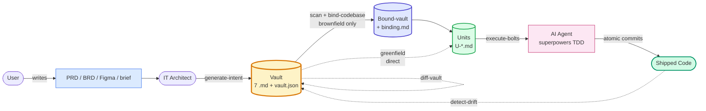
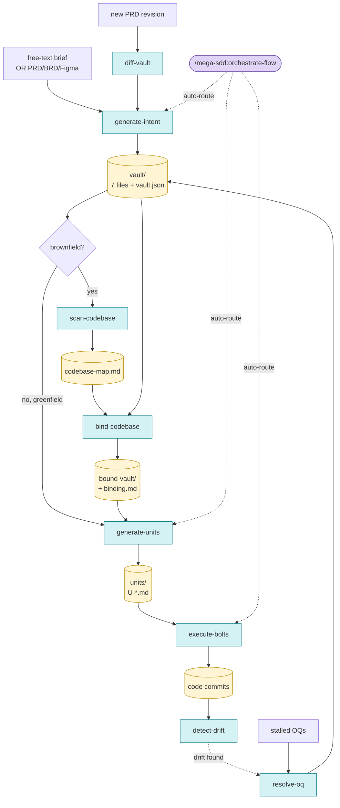

<div align="center">

# mega-sdd

### Spec-Driven Development for AI dev workflow.

*Intent → Unit → Bolt. From brief to working code with anti-hallucination guarantees end to end.*

**Plugin:** `mega-sdd` · **Version:** 1.0.1 · **License:** MIT
**Predecessor:** `grand-design-spec@0.15` (deprecated — see Migration below)

</div>

---

## What is this?

> **Without it**: PRD → "build it" handoff → AI dev tools invent entities/files/patterns → drift cascades → expensive rework.
> **With it**: PRD → intent vault → bound to live codebase → atomic units with grounding → bolts via superpowers TDD → drift detected & fixed early.

Mega-SDD applies AWS-flavored **Spec-Driven Development** with a 3-layer terminology:

- **Intent** — the WHAT/WHY layer (PRD/BRD/brief → 7-file vault)
- **Unit** — atomic, AI-executable dev prompts (HOW per chunk, derived from vault)
- **Bolt** — the actual code produced from executing a unit (via [superpowers](https://github.com/obra/superpowers))

For **brownfield** projects (existing repos), a **codebase binding gate** validates intent against live code before unit generation — eliminating the architect/dev hallucination boundary that kills AI dev quality in enterprise settings.

## Who · What · When · Where · Why · How

| | |
|---|---|
| **What** | A 5-phase pipeline (intent → scan → bind → units → bolts) plus 4 lifecycle skills (resolve-oq, diff-vault, detect-drift, orchestrate-flow) for spec-driven AI development. |
| **Who** | **Architects** produce intent without repo access. **Devs / AI** scan + bind with read-only repo access. **AI agents** ship bolts with write access via superpowers. |
| **When** | After PRD signed off or brief captured. Replaces ad-hoc "build this" handoff with a structured contract that survives all the way to code. |
| **Where** | Vaults default to `docs/mega-sdd/vaults/<name>/`; units inside vault; bolts as atomic git commits on your branch; bolt reports in `<vault>/bolts/`. |
| **Why** | The architect/dev hallucination boundary is the #1 source of AI-dev rework. Architects assume things about code they don't see; AI tools invent things to fill the gap. Mega-SDD inserts a **mandatory codebase binding gate** between intent and unit generation for brownfield projects. |
| **How** | 4-layer anti-hallucination defense (OQ promotion + binding gate + unit grounding + drift detect), TDD discipline via vendored superpowers, halt-on-blocker protocol throughout. |

## Pipeline (actor flow)



## Pipeline (detailed)



<details>
<summary>ASCII fallback (terminal-friendly)</summary>

```
                          orchestrate-flow (auto-router)
                  ──────────────────────────────────────────
                  Inspects CWD, proposes chain (max 3 skills),
                  confirms once, runs in --auto. Halt-pauses on
                  blocker artifacts. v1.0 chains all applicable
                  phases by default.

   Free-text         PRD/BRD/      Stakeholder mtg   PRD revision    Live codebase
   brief             Figma             │                 │                │
       │                │              │                 │                │
       ▼                ▼              ▼                 ▼                ▼
   generate-intent  generate-intent  resolve-oq      diff-vault      detect-drift
    (Mode B)         (Mode A)           │                 │                │
       │                │                │                 │                │
       └────────┬───────┘                │                 │                │
                ▼                         │                 │                │
            vault (7 files +              │                 │                │
            vault.json)                   │                 │                │
                │                          │                 │                │
                │  brownfield path:       │                 │                │
                │    scan-codebase ──→ bind-codebase ⚠ BLOCKS on conflicts
                │                          │
                ▼                          ▼
            generate-units ────────→ execute-bolts ─→ code commits
            (atomic specs            (superpowers:      (one per unit,
             with target_files,       TDD + subagent +  pre-commit hooks
             acceptance_tests,        worktrees)         enforced)
             dependency DAG)
```

</details>

## Skills + commands in this plugin

| Slash command | Skill | Purpose |
|---|---|---|
| `/mega-sdd:orchestrate-flow` ⭐ | **orchestrate-flow** (v1.0) | Lifecycle orchestrator. Inspects CWD, proposes a chain of sub-skills (max 3), confirms once, runs in `--auto`. Pauses on `blocker` artifacts. Anti-halu rails preserved by composition. **Recommended entry point.** |
| `/mega-sdd:generate-intent` | **generate-intent** (v1.0) | Initial vault generation. **Mode A:** structured PRD/BRD/Figma input. **Mode B:** `--from-prompt "<brief>"` for free-text with adaptive Q&A (≤10 questions). Produces 7 markdown files + `vault.json` manifest. Anti-hallucination by construction. |
| `/mega-sdd:scan-codebase` 🆕 | **scan-codebase** (v1.0) | Heuristic repo mapper. Walks codebase, extracts public interfaces, routes/endpoints, data models, naming conventions, test framework. Produces `codebase-map.md`. Brownfield prep — required before binding. |
| `/mega-sdd:bind-codebase` 🆕 | **bind-codebase** (v1.0) | **The keystone gate.** Validates each vault claim against `codebase-map.md`. Verdicts: CONFIRMED / CONFLICT / OQ. Produces `bound-vault/` + `binding.md`. **BLOCKS** unit generation when conflicts exist. Always human-in-the-loop for resolution. |
| `/mega-sdd:generate-units` 🆕 | **generate-units** (v1.0) | Decomposes bound-vault into atomic AI-executable unit specs (`U-*.md`). Each unit has `target_files` whitelist, `acceptance_test`, dependency DAG. Atomicity: 1 unit = 1 PR-sized commit. Rejects cycles. |
| `/mega-sdd:execute-bolts` 🆕 | **execute-bolts** (v1.0) | Executes units via superpowers integration. TDD-first (failing test → impl → passing → commit). Halt protocol after 3 retries. Whitelist enforcement (no out-of-bounds writes). Optional `--parallel` via `subagent-driven-development`. |
| `/mega-sdd:resolve-oq` | **resolve-oq** (v0.4 — untouched) | Interactive Open Questions resolver. Walks the OQ roll-up by priority, captures stakeholder answers, updates vault with version bump + Changelog. **Binding mode** (`--binding`) walks CONFLICT entries from bind-codebase. |
| `/mega-sdd:diff-vault` | **diff-vault** (v1.0) | Vault evolution when PRD source revisions. Computes structured diff, surfaces Resolved-OQ vs new PRD conflicts. Preserves prior decisions. Emits `blocker` (type=`diff_conflict`) on contradictions. |
| `/mega-sdd:detect-drift` | **detect-drift** (v1.0) | For `mode=existing` vaults: compares vault claims against live codebase. Flags drift (rename, type change, decision violation, code shipped without ADR). Auto-runs post-`execute-bolts`. |
| `/mega-sdd:update-plugin` | **update-plugin** (v1.0, bash) | Plugin maintenance. `git pull --ff-only` inside `~/.claude/plugins/marketplaces/`, prints version diff, prompts to rebuild cache. Also runs dep-doctor (verifies superpowers presence or vendored fallback). |
| `/mega-sdd:from-prompt` | _(deprecated alias)_ | Routes to `generate-intent --from-prompt`. Will be removed in v1.2. |

## What each phase produces

```
docs/mega-sdd/vaults/<name>/
├── 00-index.md          Navigation + Vault Lock Status + AI consumer notes + OQ roll-up
├── 01-overview.md       What, who, why, success metrics
├── 02-architecture.md   Components per layer, API contracts
├── 03-data-model.md     Entities (DBML), relations, constraints
├── 04-flows.md          User flows + system flows + per-flow Definition of Done
├── 05-decisions.md      ADR-lite: technical decisions with explicit source
├── 06-constraints.md    Technical, business, non-functional requirements
└── vault.json           Machine-readable manifest mirroring the markdown
```

After **scan-codebase** (brownfield only):
```
codebase-map.md          Public interfaces, routes, data models, conventions,
                         pattern signatures — produced from heuristic scan
```

After **bind-codebase** (brownfield only):
```
<name>-bound/            Copy of vault with inline binding annotations
binding.md               CONFIRMED / CONFLICT / OQ verdict table per claim
```

After **generate-units**:
```
<vault>/units/
├── U-001.md             Atomic unit with target_files, acceptance_test, deps
├── U-002.md
└── _index.md            Dependency DAG (Mermaid) + suggested execution order
```

After **execute-bolts**:
```
git commits              Atomic, one per unit, conventional format
<vault>/bolts/U-XXX/
└── bolt-report.md       Acceptance test results, files touched, retries
```

Every claim cites its source. Ambiguities become tagged Open Questions (`OQ-{DOC_CODE}-{N}`) with priority P0/P1/P2/P3. Out of Scope is always explicit. No invented entities, fields, endpoints, or behaviors.

## Trigger phrases

Common natural-language invocations (the anchor skill recognizes these and routes to the right skill):

**English:**
- "spec out this feature" / "buat dev handoff"
- "from this prompt" / "from a brief" / "I only have an idea, not a PRD"
- "scan codebase" / "map this repo"
- "bind vault to code" / "validate vault against repo"
- "generate units" / "vault to units"
- "execute bolts" / "run units" / "implement units"
- "what's next?" / "run the flow" / "auto mega-sdd"
- "drift detect" / "vault vs code"

**Indonesian:**
- "pecah PRD ini buat dev" / "siapkan context buat AI dev"
- "baku dari ide" / "ide aja gue belum sempat PRD"
- "spec ini" / "kontrak handoff"
- "pecah vault jadi unit" / "jalanin unit"
- "cek code vs vault" / "drift detect"

## Procedure cheat-sheet

| Scenario | Commands |
|---|---|
| New idea → working code (greenfield, fully autonomous) | `/mega-sdd:generate-intent --from-prompt "..." --chain` |
| Existing PRD → working code (brownfield) | `/mega-sdd:generate-intent ./prd.md` → `/mega-sdd:orchestrate-flow` |
| PRD revision arrived | `/mega-sdd:diff-vault ./new-prd.md` |
| Code drift detected | `/mega-sdd:detect-drift` → `/mega-sdd:resolve-oq` |
| Resume from interrupted phase | `/mega-sdd:orchestrate-flow --from=<phase>` |
| One-shot per phase | `/mega-sdd:<phase>` (e.g., `:bind-codebase ./vaults/v1`) |

## Anti-hallucination defense (4 layers)

1. **Intent layer** — uncertain claims promote to Open Questions (P0/P1/P2/P3). Architect never guesses.
2. **Binding gate** — vault claims validated against codebase-map. CONFLICTs **BLOCK** pipeline. Never auto-resolved. Always human-in-the-loop.
3. **Unit-level grounding** — each unit carries `target_files` whitelist + mandatory `acceptance_test`. No invention possible at unit boundary.
4. **Drift detection** — code vs vault reconciliation runs post-bolt and on demand. Surfaces silent divergence early.

## Architect/Dev separation

| Phase | Run by | Repo access |
|---|---|---|
| `generate-intent` | IT Architect | ❌ not required |
| `scan-codebase` | Dev / AI | ✅ read-only |
| `bind-codebase` | Dev / AI | ✅ read-only |
| `generate-units` | Dev / AI | ✅ read-only |
| `execute-bolts` | AI agent | ✅ write |

Architects produce intent on a laptop with **zero repo access**. The binding gate enforces grounding at hand-off without ever putting code in front of the architect. Enterprise-friendly: respects role boundaries that real organizations have.

## Installation

```bash
# 1. Add marketplace (GitLab URL — repo is on GitLab)
/plugin marketplace add https://gitlab.com/airnd1/grand-design-spec.git

# 2. Install plugin
/plugin install mega-sdd

# 3. (Recommended) Install superpowers companion for full bolt execution
/plugin install superpowers
```

Mega-SDD ships with **vendored superpowers skills** under `plugins/mega-sdd/skills/_vendored/` as fallback. If you don't install superpowers explicitly, bolts still execute — they route through the vendored copies. Real superpowers install always takes precedence when present.

After installation, verify with:
```bash
/mega-sdd:orchestrate-flow --dry-run
```

## Migrating from grand-design-spec

`grand-design-spec@0.15` users:

| Old | New |
|---|---|
| `/grand-design-spec:flow` | `/mega-sdd:orchestrate-flow` |
| `/grand-design-spec:grand-design-spec` | `/mega-sdd:generate-intent` |
| `/grand-design-spec:from-prompt` | `/mega-sdd:generate-intent --from-prompt` |
| `/grand-design-spec:drift-detect` | `/mega-sdd:detect-drift` |
| `/grand-design-spec:vault-diff` | `/mega-sdd:diff-vault` |
| `/grand-design-spec:resolve-oq` | `/mega-sdd:resolve-oq` |
| `/grand-design-spec:update` | `/mega-sdd:update-plugin` |

**Existing vaults remain fully compatible** — `vault.json` schema unchanged. For brownfield projects, retrofit binding by running:

```bash
/mega-sdd:scan-codebase
/mega-sdd:bind-codebase ./vaults/<your-vault>
```

`grand-design-spec` will remain in the marketplace as **deprecated** for 2 release cycles, then be removed.

## Halt protocol (across all skills)

Any skill MAY emit a `blocker` artifact and pause the pipeline. The user MUST acknowledge before the chain continues. Categories:

- `bind_conflict` — bind-codebase detected unresolvable claim vs code
- `diff_conflict` — diff-vault detected new PRD vs resolved OQ contradiction
- `mode_migrate` — vault mode (greenfield/existing) inconsistent with CWD signals
- `dep_missing` — execute-bolts can't find superpowers OR vendored fallback
- `test_fail` — bolt acceptance test failed after max retries
- `cycle_detected` — generate-units found dependency cycle

Blockers are surfaced verbatim with `next_action` suggestions. Pipeline never silently skips.

## Versioning

- **Plugin:** SemVer. Major bump for breaking renames, rails changes, or marketplace incompatibility.
- **Skills:** Per-skill `version:` in frontmatter. Bump on any content change.
- **Vault:** Internal `version` in `vault.json`, monotonically increments on `diff-vault` and `resolve-oq` events.
- **Unit IDs:** Zero-padded (`U-001`), stable across regenerations (preserved by content hash).

## Repository structure

```
.
├── .claude-plugin/marketplace.json     # marketplace manifest
├── plugins/mega-sdd/                   # the plugin itself
│   ├── README.md                       # plugin-folder shortform (points back here)
│   ├── skills/                         # 11 skills (5 new SDD + 5 renamed + 1 anchor) + _vendored/
│   ├── commands/                       # 11 slash commands
│   ├── hooks/                          # SessionStart hook for anchor injection
│   ├── scripts/                        # sync-superpowers + version bump
│   └── CLAUDE.md                       # AI-agent contributor guidelines
├── docs/
│   ├── superpowers/specs/              # design specs (gold reference)
│   ├── superpowers/plans/              # implementation plans
│   └── mega-sdd/                       # default output dir for generated vaults
├── tests/
│   ├── skill-triggering/               # 9 manual fixtures per skill
│   ├── hooks/                          # automated hook tests
│   ├── vendoring/                      # vendor sync tests
│   └── integration/                    # 2 E2E pipeline tests (greenfield + brownfield)
├── CHANGELOG.md
├── CONTRIBUTING.md
└── LICENSE
```

## Contributing

See [`plugins/mega-sdd/CLAUDE.md`](plugins/mega-sdd/CLAUDE.md) for AI-agent contributor protocol — anti-slop PR requirements, anti-hallucination rail enforcement, skill edit policy, release process.

For human contributors, see [`CONTRIBUTING.md`](CONTRIBUTING.md) — SDD invariants, testing guidelines, repository layout.

## License

MIT — see [`LICENSE`](LICENSE).

Vendored superpowers skills retain their original MIT license; see [`plugins/mega-sdd/skills/_vendored/ATTRIBUTION.md`](plugins/mega-sdd/skills/_vendored/ATTRIBUTION.md). Acknowledges [superpowers](https://github.com/obra/superpowers) by Jesse Vincent as the design inspiration for plugin patterns (anchor skill, hook injection, skill content structure).
