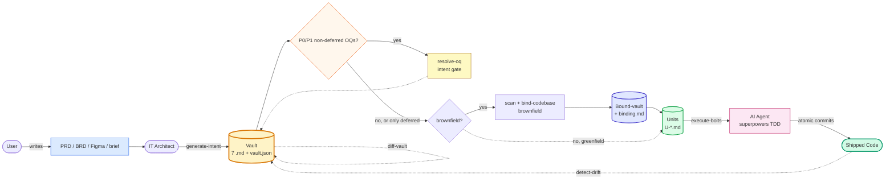
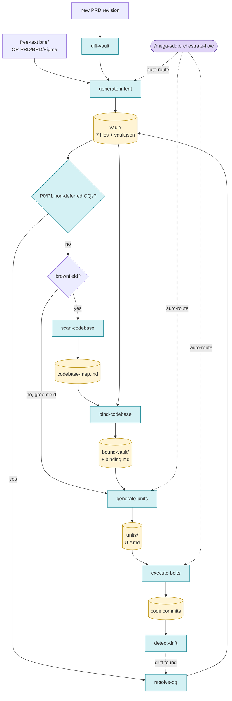

<div align="center">

# mega-sdd

### Spec-Driven Development for AI dev workflow.

*Turn a PRD or brief into working code via AI dev, with anti-hallucination at every handoff.*

**Plugin:** `mega-sdd` · **Version:** 1.2.0 · **License:** MIT
**Predecessor:** `grand-design-spec@0.15` (deprecated — see Migration below)

</div>

---

## TL;DR

A 5-phase pipeline (intent → scan → bind → units → bolts) plus 4 lifecycle skills wrap your existing AI dev tools (via [superpowers](https://github.com/obra/superpowers)) with anti-hallucination guarantees at every handoff.

```bash
/plugin marketplace add https://gitlab.com/airnd1/grand-design-spec.git
/plugin install mega-sdd

# Then in any project:
/mega-sdd:orchestrate-flow
```

## Why mega-sdd

> **Without it**: PRD → "build it" handoff → AI dev tools invent entities/files/patterns → drift cascades → expensive rework.
> **With it**: PRD → intent vault → bound to live codebase → atomic units with grounding → bolts via superpowers TDD → drift detected & fixed early.

For **brownfield** projects (existing repos), a **codebase binding gate** validates intent against live code before unit generation — eliminating the architect/dev hallucination boundary.

## Pipeline (actor flow)



## Primary commands (start here)

| Command | When to use |
|---|---|
| `/mega-sdd:orchestrate-flow` ⭐ | "What's next?" — recommended entry; auto-routes any phase |
| `/mega-sdd:generate-intent` | "I'm starting from a PRD or just an idea" |
| `/mega-sdd:resolve-oq` | "I need to answer open questions before going further" |

Most users only need these three. Advanced commands available in the section below.

## Anti-hallucination defense (4 layers)

1. **Intent layer** — uncertain claims promote to Open Questions. Architect never guesses.
2. **Binding gate** — vault claims validated against codebase-map. CONFLICTs BLOCK pipeline. Never auto-resolved.
3. **Unit-level grounding** — each unit carries `target_files` whitelist + mandatory `acceptance_test`. No invention at unit boundary.
4. **Drift detection** — code vs vault reconciliation suggested post-bolt; runs on demand.

---

<details>
<summary><b>📋 Advanced commands (8 more)</b></summary>

Full table for power users and AI agents needing granular control:

| Slash command | Skill | Purpose |
|---|---|---|
| `/mega-sdd:scan-codebase` | **scan-codebase** (v1.0) | Heuristic repo mapper. Walks codebase, extracts public interfaces, routes/endpoints, data models, naming conventions, test framework. Produces `codebase-map.md`. Brownfield prep — required before binding. |
| `/mega-sdd:bind-codebase` | **bind-codebase** (v1.1) | **The keystone gate.** Validates each vault claim against `codebase-map.md`. Verdicts: CONFIRMED / CONFLICT / OQ. Produces `<vault>-bound/` + `binding.md`. **BLOCKS** unit generation when conflicts exist. Auto-resolves deferred OQs against codebase evidence. |
| `/mega-sdd:generate-units` | **generate-units** (v1.0) | Decomposes bound-vault into atomic AI-executable unit specs (`U-*.md`). Each unit has `target_files` whitelist, `acceptance_test`, dependency DAG. Atomicity: 1 unit = 1 PR-sized commit. Rejects cycles. |
| `/mega-sdd:execute-bolts` | **execute-bolts** (v1.0) | Executes units via superpowers integration. TDD-first (failing test → impl → passing → commit). Halt protocol after 3 retries. Whitelist enforcement. Optional `--parallel` via `subagent-driven-development`. |
| `/mega-sdd:diff-vault` | **diff-vault** (v1.0) | Vault evolution when PRD source revisions. Computes structured diff, surfaces Resolved-OQ vs new PRD conflicts. Emits `blocker` (type=`diff_conflict`) on contradictions. |
| `/mega-sdd:detect-drift` | **detect-drift** (v1.0) | For `mode=existing` vaults: compares vault claims against live codebase. Flags drift (rename, type change, decision violation, code shipped without ADR). |
| `/mega-sdd:from-prompt` | _(deprecated alias)_ | Routes to `generate-intent --from-prompt`. Will be removed in v1.3. |

> **Note on `update-plugin`:** Implemented as a command-only entry (no backing `SKILL.md`) — a self-contained bash procedure under `commands/update-plugin.md`. Pulls latest plugin version, runs dep-doctor (verifies superpowers presence or vendored fallback), prompts cache rebuild. **Not counted** in the skill total above.

</details>

<details>
<summary><b>🏗️ Architecture deep dive</b></summary>

### Who · What · When · Where · Why · How

| | |
|---|---|
| **What** | A 5-phase pipeline (intent → scan → bind → units → bolts) plus 4 lifecycle skills (resolve-oq, diff-vault, detect-drift, orchestrate-flow) for spec-driven AI development. |
| **Who** | **Architects** produce intent without repo access. **Devs / AI** scan + bind with read-only repo access. **AI agents** ship bolts with write access via superpowers. |
| **When** | After PRD signed off or brief captured. Replaces ad-hoc "build this" handoff with a structured contract that survives all the way to code. |
| **Where** | Vaults default to `docs/mega-sdd/vaults/<slug>/`; units inside vault; bolts as atomic git commits on your branch; bolt reports in `<vault>/bolts/`. |
| **Why** | The architect/dev hallucination boundary is the #1 source of AI-dev rework. Architects assume things about code they don't see; AI tools invent things to fill the gap. Mega-SDD inserts a **mandatory codebase binding gate** between intent and unit generation for brownfield projects. |
| **How** | 4-layer anti-hallucination defense (OQ promotion + binding gate + unit grounding + drift detect), TDD discipline via vendored superpowers, halt-on-blocker protocol throughout. |

### Pipeline (detailed)



<details>
<summary>ASCII fallback (terminal-friendly)</summary>

```
                          orchestrate-flow (auto-router)
                  ──────────────────────────────────────────
                  Inspects CWD, proposes chain (max 3 skills),
                  confirms once, runs in --auto. Halt-pauses on
                  blocker artifacts.

   Free-text         PRD/BRD/      Stakeholder mtg   PRD revision    Live codebase
   brief             Figma             │                 │                │
       │                │              │                 │                │
       ▼                ▼              ▼                 ▼                ▼
   generate-intent  generate-intent  resolve-oq      diff-vault      detect-drift
    (Mode B)         (Mode A)           │                 │                │
       │                │                │                 │                │
       └────────┬───────┘                │                 │                │
                ▼                         │                 │                │
            vault (7 files +              │                 │                │
            vault.json)                   │                 │                │
                │                          │                 │                │
                │  brownfield path:       │                 │                │
                │    scan-codebase ──→ bind-codebase ⚠ BLOCKS on conflicts
                │                          │
                ▼                          ▼
            generate-units ────────→ execute-bolts ─→ code commits
            (atomic specs            (superpowers:      (one per unit,
             with target_files,       TDD + subagent +  pre-commit hooks
             acceptance_tests,        worktrees)         enforced)
             dependency DAG)
```

</details>

### What each phase produces

```
docs/mega-sdd/vaults/<name>/
├── 00-index.md          Navigation + Vault Lock Status + AI consumer notes + OQ roll-up
├── 01-overview.md       What, who, why, success metrics
├── 02-architecture.md   Components per layer, API contracts
├── 03-data-model.md     Entities (DBML), relations, constraints
├── 04-flows.md          User flows + system flows + per-flow Definition of Done
├── 05-decisions.md      ADR-lite: technical decisions with explicit source
├── 06-constraints.md    Technical, business, non-functional requirements
└── vault.json           Machine-readable manifest mirroring the markdown
```

After **scan-codebase** (brownfield only): `codebase-map.md` (public interfaces, routes, data models, conventions, pattern signatures from heuristic scan)

After **bind-codebase** (brownfield only): `<vault>-bound/` (copy with inline binding annotations) + `binding.md` (CONFIRMED / CONFLICT / OQ verdict table)

After **generate-units**: `<vault>/units/U-*.md` (atomic units with target_files, acceptance_test, deps) + `_index.md` (dependency DAG)

After **execute-bolts**: git commits (atomic, one per unit) + `<vault>/bolts/U-XXX/bolt-report.md` (test results, files touched, retries)

### Trigger phrases

**English:** "spec out this feature" / "from this prompt" / "I only have an idea, not a PRD" / "scan codebase" / "bind vault to code" / "generate units" / "execute bolts" / "what's next?" / "drift detect"

**Indonesian:** "pecah PRD ini buat dev" / "siapkan context buat AI dev" / "baku dari ide" / "spec ini" / "kontrak handoff" / "pecah vault jadi unit" / "jalanin unit" / "cek code vs vault"

### Architect/Dev separation

| Phase | Run by | Repo access |
|---|---|---|
| `generate-intent` | IT Architect | ❌ not required |
| `scan-codebase` | Dev / AI | ✅ read-only |
| `bind-codebase` | Dev / AI | ✅ read-only |
| `generate-units` | Dev / AI | ✅ read-only |
| `execute-bolts` | AI agent | ✅ write |

Architects produce intent on a laptop with **zero repo access**. The binding gate enforces grounding at hand-off without ever putting code in front of the architect.

### Halt protocol (across all skills)

Any skill MAY emit a structured `blocker` artifact (YAML, per `vault-contract.md §halt-protocol`) and pause the pipeline. The 8 types are:

- `oq_blocker` — `generate-intent` on P1 OQ surfaced in `--auto` mode
- `diff_conflict` — `diff-vault` on new PRD vs resolved-OQ/ADR contradiction
- `drift_framework_mismatch` — `detect-drift` on vault/code framework signal mismatch
- `bind_conflict` — `bind-codebase` on CONFLICT count > 0
- `dep_missing` — `execute-bolts` missing superpowers + vendored fallback
- `test_fail` — `execute-bolts` acceptance test fails after max retries
- `cycle_detected` — `generate-units` dependency DAG has a cycle
- `mode_migrate` — `orchestrate-flow` CWD signals contradict vault.mode

### Versioning

- **Plugin:** SemVer. Major bump for breaking renames, rails changes, or marketplace incompatibility.
- **Skills:** Per-skill `version:` in frontmatter. Bump on any content change.
- **Vault:** Internal `version` in `vault.json`, monotonically increments on `diff-vault` and `resolve-oq` events.
- **Unit IDs:** Zero-padded (`U-001`), stable across regenerations (preserved by content hash).

</details>

<details>
<summary><b>📦 Repository structure</b></summary>

```
.
├── .claude-plugin/marketplace.json     # marketplace manifest
├── plugins/mega-sdd/                   # the plugin itself
│   ├── README.md                       # plugin-folder shortform (points back here)
│   ├── skills/                         # 10 skills (5 new SDD + 4 renamed + 1 anchor) + _vendored/
│   ├── commands/                       # 11 slash commands
│   ├── hooks/                          # SessionStart hook for anchor injection
│   ├── scripts/                        # sync-superpowers + version bump
│   └── CLAUDE.md                       # AI-agent contributor guidelines
├── docs/
│   ├── superpowers/specs/              # design specs (gold reference)
│   ├── superpowers/plans/              # implementation plans
│   └── mega-sdd/                       # default output dir for generated vaults
├── tests/
│   ├── skill-triggering/               # 9 manual fixtures per skill
│   ├── hooks/                          # automated hook tests
│   ├── vendoring/                      # vendor sync tests
│   └── integration/                    # 2 E2E pipeline tests (greenfield + brownfield)
├── CHANGELOG.md
├── CONTRIBUTING.md
└── LICENSE
```

</details>

<details>
<summary><b>🔄 Migrating from grand-design-spec</b></summary>

`grand-design-spec@0.15` users:

| Old | New |
|---|---|
| `/grand-design-spec:flow` | `/mega-sdd:orchestrate-flow` |
| `/grand-design-spec:grand-design-spec` | `/mega-sdd:generate-intent` |
| `/grand-design-spec:from-prompt` | `/mega-sdd:generate-intent --from-prompt` (or just quote the brief) |
| `/grand-design-spec:drift-detect` | `/mega-sdd:detect-drift` |
| `/grand-design-spec:vault-diff` | `/mega-sdd:diff-vault` |
| `/grand-design-spec:resolve-oq` | `/mega-sdd:resolve-oq` |
| `/grand-design-spec:update` | `/mega-sdd:update-plugin` |

**Existing vaults remain fully compatible** — `vault.json` schema unchanged. For brownfield projects, retrofit binding by running:

```bash
/mega-sdd:scan-codebase
/mega-sdd:bind-codebase ./vaults/<your-vault>
```

`grand-design-spec` will remain in the marketplace as **deprecated** for 2 release cycles, then be removed.

</details>

<details>
<summary><b>📝 Procedure cheat-sheet</b></summary>

| Scenario | Commands |
|---|---|
| New idea → working code (greenfield, fully autonomous) | `/mega-sdd:generate-intent "your idea"` then `/mega-sdd:orchestrate-flow` |
| Existing PRD → working code (brownfield) | `/mega-sdd:generate-intent ./prd.md` then `/mega-sdd:orchestrate-flow` |
| Vault has unresolved P0/P1 OQs (non-deferred) | `/mega-sdd:resolve-oq` (intent gate — runs before scan/bind/units) |
| PRD revision arrived | `/mega-sdd:diff-vault ./new-prd.md` |
| Code drift detected | `/mega-sdd:detect-drift` then `/mega-sdd:resolve-oq` |
| Resume from interrupted phase | `/mega-sdd:orchestrate-flow --from=<phase>` |
| One-shot per phase | `/mega-sdd:<phase>` (e.g., `:bind-codebase ./vaults/v1`) |

</details>

## Contributing

See [`plugins/mega-sdd/CLAUDE.md`](plugins/mega-sdd/CLAUDE.md) for AI-agent contributor protocol — anti-slop PR requirements, anti-hallucination rail enforcement, skill edit policy, release process.

For human contributors, see [`CONTRIBUTING.md`](CONTRIBUTING.md) — SDD invariants, testing guidelines, repository layout.

## License

MIT — see [`LICENSE`](LICENSE).

Vendored superpowers skills retain their original MIT license; see [`plugins/mega-sdd/skills/_vendored/ATTRIBUTION.md`](plugins/mega-sdd/skills/_vendored/ATTRIBUTION.md). Acknowledges [superpowers](https://github.com/obra/superpowers) by Jesse Vincent as the design inspiration for plugin patterns (anchor skill, hook injection, skill content structure).
