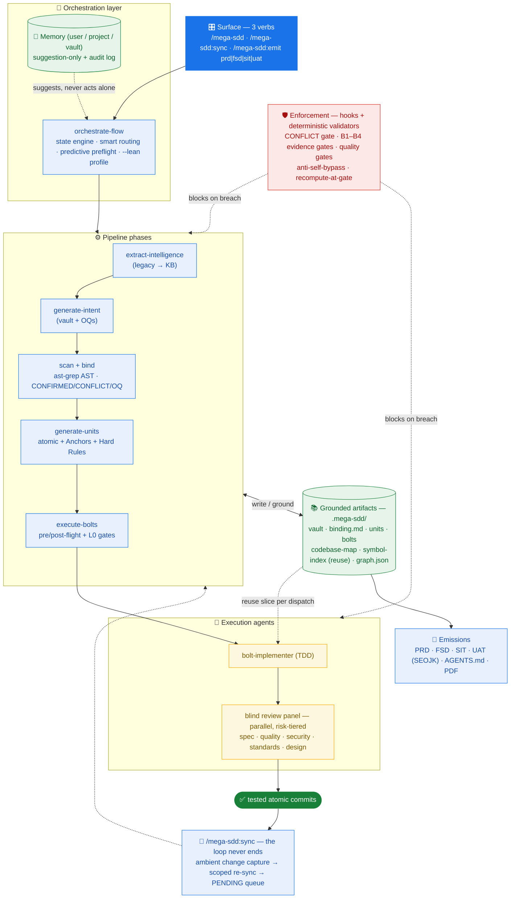

<div align="center">


# mega-sdd

### Spec-driven AI development pipeline. One command. Working code.

*PRD or idea → vault → atomic units → tested commits. With anti-hallucination at every handoff, persistent memory across sessions, and AST-precise grounding.*

**Plugin:** `mega-sdd` · **Version:** [`plugin.json`](plugins/mega-sdd/.claude-plugin/plugin.json) (single source of truth) · **License:** MIT

</div>

---

> **This page's job**: orient you and get you to a first successful run. Per-command reference + plugin internals → [`plugins/mega-sdd/README.md`](plugins/mega-sdd/README.md) · guided walkthroughs → [`tests/scenarios/`](tests/scenarios/README.md) · version history → [`CHANGELOG.md`](CHANGELOG.md).

## 30-second pitch

```bash
/mega-sdd ./prd.md
```

That's it. Mega-sdd runs the full pipeline: parse PRD → scan codebase → bind claims → generate atomic units → execute bolts via TDD → commit code. Single upfront confirmation; auto-continues unless something needs human input.

And when the code moves on afterwards (manual hotfix, AI edit in any session, `git pull`) — `/mega-sdd:sync` catches everything up incrementally. Development never ends; neither does the pipeline.

**Never used Claude Code at all?** → [Start from zero](#start-from-zero-never-used-claude-code) (10 min).
**For the new user**: skip to [Quick start](#quick-start-5-minutes) below.
**For the technical reader**: see [Architecture deep dive](#architecture-deep-dive) collapsed below.

---

## Start from zero (never used Claude Code?)

Mega-sdd is a plugin for [Claude Code](https://claude.com/claude-code) — Anthropic's AI coding agent that runs in your terminal. If you've never installed or tried Claude Code, you only need three things before anything on this page applies:

1. **Install Claude Code** (one command in your terminal — official guide: <https://code.claude.com/docs/en/quickstart>):

   ```bash
   curl -fsSL https://claude.ai/install.sh | bash    # macOS / Linux / WSL
   # or: npm install -g @anthropic-ai/claude-code    # if you have Node.js 18+
   ```

2. **Start it in a project folder** — run `claude` inside any directory. First launch walks you through logging in with a Claude account (Pro/Max subscription or Console API billing).

3. **Know the one convention**: inside the Claude Code session, anything starting with `/` is a command. Every `/plugin …` and `/mega-sdd:…` snippet in this README is typed **inside the Claude Code chat**, not in your shell.

That's genuinely all the Claude Code knowledge mega-sdd assumes. For a hand-held, nothing-assumed walkthrough (install → login → plugin → first run, ~20 min), follow **[Scenario 0 — Zero to first run](tests/scenarios/scenario-0-zero-to-first-run.md)**.

<details>
<summary><b>📖 New to the jargon? Plain-language glossary</b></summary>

| Term | Plain meaning |
|---|---|
| **PRD** | A requirements document — "what we want built". Mega-sdd accepts one, or just a sentence. |
| **Vault** | The structured spec mega-sdd writes from your PRD/idea, every claim cited to its source. |
| **Open Question (OQ)** | Anything the spec can't prove becomes a question for you — never a silent guess. |
| **Binding** | Checking the spec against your *real* code before any task is generated (existing projects). |
| **Unit** | One small, well-defined task — about one pull request of work. |
| **Bolt** | An executed unit: code + passing tests, committed to git. |
| **Halt** | A deliberate safety pause when something genuinely needs a human; resume with `--resume`. |
| **Greenfield / brownfield** | New empty project / existing codebase. |

</details>

---

## Quick start (5 minutes)

### 1. Install

This is the canonical install reference — other docs link here.

```bash
# In Claude Code:
/plugin marketplace add https://scm.bankmegadev.com/ai-rnd/mega-sdd.git
/plugin install mega-sdd
/plugin install superpowers   # recommended companion (TDD discipline)
```

> **The bare `/mega-sdd` verb** — Claude Code registers plugin commands only under the plugin namespace (`/mega-sdd:<command>`), so the bare front door is provided by a tiny user-level wrapper at `~/.claude/commands/mega-sdd.md`. The plugin's SessionStart hook installs and maintains it automatically — your **first session after install** (any project, any CWD) creates it; from the next session on, `/mega-sdd` works everywhere. Until then, `/mega-sdd:mega-sdd` is the namespaced equivalent. Manual install: `bash <plugin-dir>/scripts/install-front-door.sh`.
>
> **Mandatory routing (default)** — installing the plugin makes mega-sdd the default development workflow: every session routes dev work through the pipeline automatically, whether or not you type `/mega-sdd`. SDD projects get the full routing anchor; fresh CWDs get a slim rule that proposes `/mega-sdd <input>` before any production code is written (casual Q&A exempt). Opt out per user: `touch ~/.claude/.mega-sdd-routing-off`.

For higher precision (optional, recommended), let the OS-aware installer set up the native binaries for you:

```bash
/mega-sdd:install-deps
```

It detects your OS + package manager and installs `ast-grep` (the auto AST engine), `ripgrep`, `jd`, `pandoc`, `mmdc` (mermaid) — plus `tree-sitter` if you want the `--engine=tree-sitter` opt-in lane. Safety rails throughout: never auto-sudo, never `curl|bash`, always verify after install. Google Chrome is detect-only, powering the GitHub-style PDF render (never LaTeX; GitHub-styled HTML fallback when absent). Every tool is optional — mega-sdd has a graceful fallback for each. Tool-by-tool table: [plugin README](plugins/mega-sdd/README.md#optional-native-tools); manual per-platform one-liners (incl. Windows): [`tooling-install.md`](plugins/mega-sdd/references/tooling-install.md).

### 2. Keep it updated

```bash
/mega-sdd:update-plugin                          # pull the latest plugin from the marketplace repo (fast-forward only)
/plugin marketplace update mega-sdd              # rebuild the plugin cache to the new version
```

Then run `/reload-plugins` (or restart Claude Code) so new commands + skills register. `/mega-sdd:update-plugin` reports the before→after version, never touches your project, and tells you if you're already current. Your installed version shows in the header above and in `/plugin`.

To uninstall: `/plugin uninstall mega-sdd` (and optionally `/plugin marketplace remove mega-sdd`). Your `.mega-sdd/` outputs stay in your project — delete that folder if you want them gone too.

### 3. Try a guided scenario

The full scenario chooser (13 walkthroughs, each with copy-paste inputs, expected outputs, and pitfalls + recovery) lives in **[`tests/scenarios/README.md`](tests/scenarios/README.md)**. Three common entry points:

- Never used Claude Code → [Scenario 0 — Zero to first run](tests/scenarios/scenario-0-zero-to-first-run.md) (20 min)
- Want the minimum viable demo → [Scenario 1 — Greenfield from idea](tests/scenarios/scenario-1-greenfield-from-idea.md) (15 min)
- Have a PRD + an existing project → [Scenario 2 — PRD-driven feature](tests/scenarios/scenario-2-prd-driven-feature.md) (30 min)

A sample PRD to match expected outputs exactly: [`sample-prd-clinic.md`](tests/scenarios/sample-prd-clinic.md).

### 4. Common invocations

```bash
/mega-sdd ./prd.md                   # PRD → working code (5 phases)
/mega-sdd ./legacy-php/ --out=./new/ # Legacy KB → vault → code (6 phases)
/mega-sdd "build a clinic system"    # Free-text brief → code (3 phases)
/mega-sdd                            # no arg → status view, then proposes next chain
/mega-sdd --resume                   # Continue paused/halted chain
```

Single confirmation. Auto-continues clean phases. Halts surface YAML blockers with a `next_action` field — exactly what to run to recover.

---

## Why mega-sdd

> **Without it**: PRD → "build this" handoff → AI agent invents entities/files/patterns → drift cascades → expensive rework.
> **With it**: PRD → intent vault (cited claims) → bound to live codebase (AST precise) → atomic units shaped as polished prompts → bolts via TDD with pre/post-flight Hard Rule validation → memory accumulates across runs → drift detected early.

Every handoff is contracted and grounded. The seven layers that matter most:

1. **Uncertain claims become Open Questions** — anything the spec can't prove from its sources is promoted to a question for you, never a guess.
2. **The binding gate blocks** — vault claims are validated against the live codebase; unresolved CONFLICTs stop the pipeline before any code is generated.
3. **Units are grounded** — `target_files` whitelist + a mandatory acceptance test + anchors citing real code patterns.
4. **Hard Rules are enforced, not suggested** — ast-grep validates constraints at bolt time, wired to deterministic hooks. The doctrine: *prose that says HALT enforces nothing.*
5. **Handoffs are typed contracts** — every cross-phase handoff YAML is schema- and type-validated at the producer side, so shape drift halts the moment it happens.
6. **Memory never acts alone** — learning across runs is suggestion-only (explicit ACCEPT), with a mandatory audit log + rollback; drift detection reconciles code vs spec early.
7. **Reuse before reinvention** — a script-built full-repo symbol index puts existing code in front of the implementer at write time ("Existing symbols — REUSE, don't recreate"), and a post-write duplication sweep hands mechanical evidence to the review panel.

The full defense in depth (20 layers, including the code-delivery quality gates): [plugin README — How it prevents hallucination](plugins/mega-sdd/README.md#how-it-prevents-hallucination).

## Measured: classic vs express spine (P5, 2026-08)

Both arms: the SAME repo at the SAME commit, the same PRD, the same model (claude-opus-5, 100% of API calls in every session), run interactively by the same operator. Numbers come from deterministic channels only — transcript timestamps + `usage` fields and git commit times, extracted by `research/2026-08-04-p5-extract.py` with identical conventions for both arms (human-wait = ASK gaps + >30s pre-input gaps + any >10min inter-record idle; subtracted for the net figure). Protocol + full detail: `research/2026-08-04-p5-measurement-runbook.md`.

| PRD → first acceptance-backed unit commit | classic (v5.9-era) | express (v6.0.1) | Δ |
|---|---|---|---|
| Net machine time | 1h 53m | **1h 45m** | −7% |
| Cost-weighted tokens | 28.2M | **18.6M** | **−34%** |
| Rework in window | 0 fix commits | 0 fix commits | — |

Full-run figures are published but NOT task-class comparable and are stated as such: classic delivered 7 monorepo-conversion chore units (net 3h10m, 32.5M cw, 0 fix commits); express delivered 10 feature units — auth module, credit-calculation engine (tests 23→55), CRUD + audit trail, dashboard — at net 7h48m, 39.7M cw, with 8 in-run fix commits including a panel-caught Critical (fail-open DTI check). The fix-round churn measured in that run is what v6.1.0 redesigned (`docs/superpowers/specs/2026-08-06-v6.1-bolt-loop-efficiency.md`); its effect will be measured the same way, not asserted.

**The honest verdict:** the original "<10 minutes to first bolt" target FAILED — the pipeline's floor to a verified first delivery on this repo is ~1¾ hours of machine time with all gates live. The express spine's real, measured wins are the −34% cost and the collapse of interactive OQ ceremony; the quality counterweight (acceptance tests executed per unit, review panel catching a real Critical in-run) is what the remaining time buys.

## What makes mega-sdd special

Most AI-dev tools take a PRD → spit code in one shot. **Mega-sdd inserts structured intermediate artifacts** (vault → binding → units → bolts) so every layer is auditable, every handoff is contracted, and the AI agent has explicit constraints to respect at each step.

- **One command, full pipeline** — `/mega-sdd` runs PRD → vault → binding → units → tested commits with a single upfront confirmation; halts carry the exact recovery command.
- **Smart orchestrator** — memory-driven routing (after 3+ successful runs of your project shape it recommends the proven chain) + predictive preflight (catches `dep_missing` *before* the chain starts, not 8 minutes in).
- **Starterkit-aware** — auto-detects your stack's actual conventions (auth lib, RBAC, UI stack, layouts) and generates units that cite *your* patterns, so bolts match your codebase by default.
- **Memory that learns across sessions** — three scopes (user / project / vault), suggestion-only via `/mega-sdd:memory review`, mandatory audit log + rollback, `--memory-off` honored.
- **Audit-driven evolution** — every major version closes a structured, severity-classified audit; nothing hidden, nothing inflated. Full trail: [`CHANGELOG.md`](CHANGELOG.md) + [`plugins/mega-sdd/AUDIT.md`](plugins/mega-sdd/AUDIT.md) + [`docs/superpowers/audits/`](docs/superpowers/audits/).
- **A living pipeline, not a one-shot run** — out-of-pipeline changes (manual hotfix, AI edit, `git pull`) are captured ambiently and `/mega-sdd:sync` reconciles only what changed, queuing human-only decisions instead of guessing. Walkthrough: [scenario 12](tests/scenarios/scenario-12-continuous-sync.md).

**TL;DR**: if you've ever had an AI agent invent a function that doesn't exist, hallucinate a database column, or "implement" a feature that doesn't compile — mega-sdd's pipeline structure prevents those failure modes upstream. You get an AI development workflow that's been hardened against the actual ways AI agents drift.

---

## Architecture (HLD)



**Legend**:
- 🟦 **surface & phases** (the 3 verbs; pipeline skills) · 🟨 **execution agents** (implementer + blind panel) · 🟩 **grounded artifacts & outputs** · 🟥 **enforcement** (hooks + deterministic validators)
- **Solid arrows** = pipeline flow · **Dotted arrows** = cross-cutting (memory suggestions, reuse slices, gate blocks)
- Detail per phase (per-artifact flow, gates, deep-scan, starterkit): [plugin README](plugins/mega-sdd/README.md) + [architecture deep dive](#architecture-deep-dive) below.

All phases auto-chain via `/mega-sdd`. Each phase emits typed handoff YAML that the orchestrator validates (schema + types) before continuing; the intelligence layer consults past routing outcomes at chain start, runs predictive preflight before each skill, and records the run's outcome at chain end. Halts only on real issues (CONFLICT, P1 business OQ, Hard Rule violation, invalid handoff); auto-continues otherwise.

---

## Commands

`/mega-sdd` is the only command most users type. `/mega-sdd:sync` reconciles after any out-of-pipeline change. `/mega-sdd:emit <prd|fsd|sit|uat>` emits the four team documents. Four maintenance one-timers (`migrate-paths`, `install-deps`, `update-plugin`, `memory`) stay as typed commands; the pre-v5 stage commands were removed in 6.0.0 — a typed legacy form still routes as plain text to its skill.

**Full per-command reference: [plugin README — Commands](plugins/mega-sdd/README.md#commands-youll-actually-use).** Task → command quick lookup:

<details>
<summary><b>📝 Procedure cheat-sheet</b></summary>

| Scenario | Commands |
|---|---|
| **One-shot end-to-end** (recommended) | `/mega-sdd ./prd.md` · `/mega-sdd ./legacy/ --out=./new/` · `/mega-sdd "brief"` |
| Phase-by-phase greenfield | `/mega-sdd "your idea" --to=generate-intent`, lanjut `/mega-sdd` per phase |
| Phase-by-phase brownfield | `/mega-sdd ./prd.md --to=generate-intent`, lanjut `/mega-sdd` per phase |
| Legacy rebuild | `/mega-sdd ./legacy/ --out=./rebuild/` |
| Unresolved P1 business OQs | say "resolve OQ" / "walk open questions" |
| Bolt halted on Hard Rule | Review `<vault>/bolts/U-XXX/postflight.json`; revert OR edit unit's Hard rules; re-run unit |
| Resume after halt | `/mega-sdd --resume` |
| Module-filtered execution | say "eksekusi bolt module M-auth" (execute-bolts `--module=`) |
| Squad-filtered execution | say "eksekusi bolt squad squad-be" (execute-bolts `--squad=`, multi-squad mode) |
| Per-squad parallel | say "eksekusi bolt per squad, parallel" (execute-bolts `--per-squad --parallel`) |
| Inspect memory | `/mega-sdd:memory show <topic>` |
| Review pending learning suggestions | `/mega-sdd:memory review` |
| Generate AGENTS.md manually | say "generate AGENTS.md" (auto-runs at chain end on the classic spine) |
| Generate Confluence FSD manually | `/mega-sdd:emit fsd` (chain-end auto-emit is opt-in via `--with-fsd`) |
| Generate reverse PRD from legacy | `/mega-sdd:emit prd` |
| Generate SIT test-evidence doc | `/mega-sdd:emit sit` |
| Generate UAT doc-pack (incl. SEOJK berita acara) | `/mega-sdd:emit uat` |
| Install missing native deps (pandoc, mmdc, etc.) | `/mega-sdd:install-deps` (auto-detect OS + pkg mgr) |
| Update mega-sdd to the latest version | `/mega-sdd:update-plugin` then `/plugin marketplace update mega-sdd` |
| Migrate vault layout (one-time) | `/mega-sdd:migrate-paths --dry-run` then `/mega-sdd:migrate-paths` |
| Migrate Hard Rules grammar (one-time) | say "migrate hard rules ./vault" |
| Privacy-sensitive run | `/mega-sdd ./prd.md --memory-off` |
| Disable auto-diagnostic flags | `/mega-sdd ./prd.md --no-lint --no-analyze --no-modules-summary --no-agents-md` |
| PRD revision arrived | `/mega-sdd ./new-prd.md` (routes to diff-vault) — or say "PRD revisi" |
| Code drift periodic check | say "cek drift" |

> **6.0.0:** the 5.x typed aliases (`/mega-sdd:generate-intent`, `:analyze`, …) were removed — every row above is reachable through the 3 verbs + natural language. A typed legacy form still routes as plain text. Migration map: [plugin README](plugins/mega-sdd/README.md#commands-youll-actually-use) · [upgrade guide](plugins/mega-sdd/references/upgrade-from-old-version.md).

</details>

---

<details>
<summary><a id="architecture-deep-dive"></a><b>🏗️ Architecture deep dive</b></summary>

### Who · What · When · Where · Why · How

| | |
|---|---|
| **What** | Multi-phase pipeline: extract → intent → scan → bind → units → bolts. **20 skills** (lean routers + progressive disclosure — each `SKILL.md` ≤500 lines, detail in on-demand `references/`) + **8 first-class subagents** (`agents/`: bolt-implementer, spec-reviewer, code-quality-reviewer, security-reviewer, standards-reviewer, design-reviewer, domain-extractor, phase-advisor) + a **3-verb command surface** (`/mega-sdd` · `/mega-sdd:sync` · `/mega-sdd:emit <prd|fsd|sit|uat>`) plus 4 maintenance one-timers; the 5.x deprecation aliases were removed in 6.0.0 (typed legacy forms route as plain text). |
| **Who** | **Architects** produce intent without repo access. **Devs / AI** scan + bind with read-only repo access. **AI agents** ship bolts with write access via superpowers. |
| **When** | After PRD signed off, brief captured, OR legacy codebase available. Replaces ad-hoc "build this" handoff with a structured contract surviving all the way to working code. |
| **Where** | All outputs consolidated under `<project>/.mega-sdd/`. User memory at `~/.mega-sdd/`. Project source unchanged. |
| **Why** | The architect/dev hallucination boundary is the #1 source of AI-dev rework. Mega-sdd inserts a mandatory binding gate + per-claim implementation-state classification + AST-validated Hard Rules + memory-driven suggestions that learn from past patterns without auto-applying them. |
| **How** | Layered anti-hallucination defense; execution via first-class bolt agents (risk-tiered blind review panel: spec / quality / security / standards, + design for UI units), with superpowers TDD as optional technique; halt-on-blocker protocol; deterministic tech (ast-grep + ripgrep + jd; tree-sitter as an opt-in lane); markdown-driven memory with mandatory audit log + rollback. |

### Folder layout

```
<project>/
├── .mega-sdd/                              # ALL mega-sdd outputs
│   ├── config.yaml                          # project-level config
│   ├── vaults/<slug>/                       # vault per project
│   │   ├── 00-index.md ... 06-constraints.md, vault.json
│   │   ├── binding.md, bound/, units/, bolts/
│   │   ├── _meta/squads.yaml, modules.yaml  # multi-squad + modules
│   │   ├── interfaces/                      # cross-squad contracts
│   │   ├── .memory/                         # vault-scope memory
│   │   └── .internal/ # checkpoints
│   ├── knowledge-base/                      # legacy KB (extract-intelligence)
│   ├── codebase/codebase-map.md             # scan output
│   ├── codebase/symbol-index.json    # script-built reuse substrate (v5.28.0+)
│   ├── memory/                              # project memory
│   └── exports/                             # future tool-agnostic exports
├── AGENTS.md                                 # tool-agnostic interop (root)
├── CLAUDE.md                                 # project AI context (optional)
└── (project source: app/, routes/, src/, etc.)
```

User-scope: `~/.mega-sdd/memory/` (cross-project preferences + patterns).

### Halt protocol

Mega-sdd halts on real issues; never silent failures. Common halt types:

- `bind_conflict` — vault claim contradicts code
- `dedup_ambiguous` — create unit targets existing files
- `hard_rule_violated` — bolt modified locked code
- `hard_rule_unparseable` — Hard Rule grammar invalid
- `cross_squad_interface_draft` — consumer waiting for producer to lock interface
- `module_blocked_by` — prerequisite module incomplete
- `quality_gate_failed` — extract-intelligence wave failed twice
- `oq_recommend_underspecified` — recommendation missing required fields
- `memory_schema_mismatch` — memory file version differs

Each halt emits a YAML `blocker` with a `next_action` field. Resume via `/mega-sdd --resume`.

Full halt protocol + recovery: [Scenario 6](tests/scenarios/scenario-6-recovery-from-halt.md).

### Versioning

- **Plugin**: SemVer; `plugin.json` is the single source of truth (`marketplace.json` matches it; this README links it rather than restating it — a restated badge rots). Major bump for breaking renames, rails changes, or marketplace incompatibility. History: [`CHANGELOG.md`](CHANGELOG.md).
- **Skills**: Per-skill `version:` in frontmatter. Bump on any content change.
- **Vault**: Internal `version` in `vault.json`, increments on `diff-vault` and `resolve-oq` events.
- **Unit IDs**: Zero-padded (`U-001`), stable across regenerations.
- **Memory schema**: `memory_schema: N` stamped per file; auto-migrate via memory skill.

</details>

<details>
<summary><b>🤖 Autonomy Layer</b></summary>

Single-confirm pipeline-end execution with auto-continue, progress indication, CWD + mid-skill-checkpoint resume.

```bash
/mega-sdd ./prd.md                    # detect → propose chain → confirm once → run
/mega-sdd --resume                    # continue paused chain (CWD + checkpoint driven)
/mega-sdd --step-after=bind-codebase  # manual handoff after binding
/mega-sdd --shallow                   # opt-out of --deep (cap-3 default)
/mega-sdd --manual                    # disable autonomy entirely
/mega-sdd --memory-off                # disable memory layer
/mega-sdd --no-lint                   # skip auto lint-units pass
/mega-sdd --no-analyze                # skip auto analyze-parallelism
/mega-sdd --no-agents-md              # skip auto AGENTS.md emit
/mega-sdd --with-fsd                  # opt-in FSD emit at chain end (off by default)
/mega-sdd --lean                      # lean profile: skip advisory legs + diagnostics (every gate untouched)
```

ONE upfront confirmation. Halts may re-engage user mid-chain (test failures, conflict resolutions, hard-rule violations). Otherwise silent + auto-progresses.

</details>

<details>
<summary><b>📦 Repository structure</b></summary>

```
.
├── .claude-plugin/marketplace.json         # marketplace manifest
├── plugins/mega-sdd/                       # the plugin itself
│   ├── README.md                           # per-command reference + plugin internals
│   ├── skills/                             # 20 skills (lean routers + progressive disclosure) + _vendored/
│   ├── agents/                             # 8 first-class subagents (incl. the blind review panel)
│   ├── commands/                           # exactly 7: 3 public verbs + 4 maintenance one-timers (the 24 5.x aliases were removed in 6.0.0)
│   ├── references/                         # paths.md · tooling-install.md · framework-conventions/ (25 packs)
│   ├── hooks/                              # SessionStart anchor · Hybrid PreToolUse gate · PostToolUse validators · Stop
│   ├── scripts/                            # sync-superpowers + migrations + validators
│   └── CLAUDE.md                           # AI-agent contributor guidelines
├── docs/superpowers/{specs,audits}/        # design specs + honest audits
├── tests/
│   ├── scenarios/                          # USER-FACING walkthroughs (scenario-0 … scenario-12 + sample PRD)
│   ├── skill-triggering/                   # per-skill trigger fixtures
│   ├── integration/                        # E2E pipeline tests
│   └── pack-kit/  per-stack-packs/         # framework-pack linter + coverage gates
├── CHANGELOG.md                            # full version history
├── CONTRIBUTING.md
└── LICENSE
```

</details>

---

## Contributing

See [`plugins/mega-sdd/CLAUDE.md`](plugins/mega-sdd/CLAUDE.md) for AI-agent contributor protocol — anti-slop PR requirements, anti-hallucination rail enforcement, skill edit policy, release process.

For human contributors: [`CONTRIBUTING.md`](CONTRIBUTING.md) — SDD invariants, testing guidelines, repository layout.

## License

MIT — see [`LICENSE`](LICENSE).

Vendored superpowers skills retain their original MIT license; see [`plugins/mega-sdd/skills/_vendored/ATTRIBUTION.md`](plugins/mega-sdd/skills/_vendored/ATTRIBUTION.md). Acknowledges [superpowers](https://github.com/obra/superpowers) by Jesse Vincent for plugin pattern inspiration. Tree-sitter `.scm` query patterns adapted from [Aider](https://github.com/Aider-AI/aider) (Apache 2.0).
