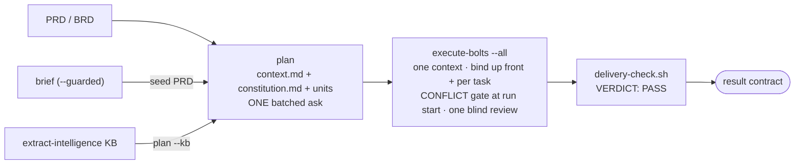
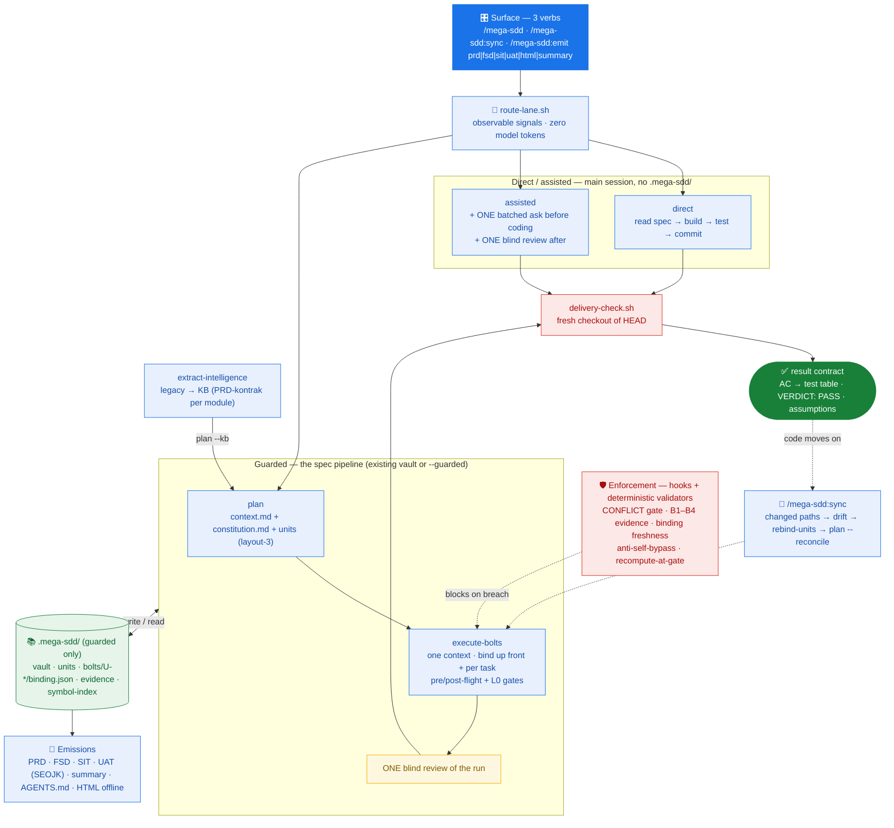

<div align="center">


# mega-sdd

### Build from a PRD or a brief. Every run ends with the same checked result.

*One front door routes each task to the lightest lane that fits it. Every lane ends with the same result: an acceptance-criterion → test table, a deterministic delivery check on the final commit, and the list of assumptions made. When a team needs traceability, the guarded lane adds a cited spec, a per-unit binding to the code, and audit evidence.*

**Plugin:** `mega-sdd` · **Version:** [`plugin.json`](plugins/mega-sdd/.claude-plugin/plugin.json) (single source of truth) · **License:** MIT

</div>

---

> **This page's job**: orient you and get you to a first successful run. Per-command reference + plugin internals → [`plugins/mega-sdd/README.md`](plugins/mega-sdd/README.md) · guided walkthroughs → [`tests/scenarios/`](tests/scenarios/README.md) · version history → [`CHANGELOG.md`](CHANGELOG.md).

## 30-second pitch

```bash
/mega-sdd ./prd.md
```

The front door first runs `route-lane.sh`, a script that reads the PRD and the repo and uses zero model tokens. It picks one of three lanes and names it in one line, together with the signals that fired:

- **direct**: nothing in the request needs more. The main session builds it the way plain Claude Code would. No vault, no units, no subagents, no `.mega-sdd/` writes.
- **assisted**: the spec has open business items, a security surface or several flows, or the repo is an existing app. This is direct plus ONE batched question round before coding and ONE blind review after it.
- **guarded**: a mega-sdd vault already exists, or you asked for it (`--guarded`; `--lite` implies it). This is the spec pipeline: `plan` → `execute-bolts`, with per-unit binding and audit artefacts.

Whatever the lane, the run is done only when [the result contract](#what-every-run-delivers) is met: every acceptance criterion mapped to a test, `delivery-check.sh` printing `VERDICT: PASS` on the final commit, and every assumption listed. That is an instruction the run follows, not a hook (measured adherence [below](#what-every-run-delivers)).

What was measured, on two greenfield fixtures only: the routed lanes landed **in plain Claude Code's range, not better** (median cost 1.1–1.2× and tokens 1.3–1.4× vanilla, ranges overlapping). Assisted on existing code, the brownfield default, is unmeasured. The guarded pipeline costs several times more and exists for teams that need the audit trail. Numbers in [Measured against plain Claude Code](#measured-against-plain-claude-code).

On a guarded project, when the code moves on afterwards (a manual hotfix, an AI edit in any session, a `git pull`), `/mega-sdd:sync` re-binds only the units the change touches.

**Never used Claude Code at all?** → [Start from zero](#start-from-zero-never-used-claude-code) (10 min).
**For the new user**: skip to [Quick start](#quick-start-5-minutes) below.
**For the technical reader**: see [Architecture deep dive](#architecture-deep-dive) collapsed below.

---

## Start from zero (never used Claude Code?)

Mega-sdd is a plugin for [Claude Code](https://claude.com/claude-code) — Anthropic's AI coding agent that runs in your terminal. If you've never installed or tried Claude Code, you only need three things before anything on this page applies:

1. **Install Claude Code** (one command in your terminal — official guide: <https://code.claude.com/docs/en/quickstart>):

   ```bash
   curl -fsSL https://claude.ai/install.sh | bash    # macOS / Linux / WSL
   # or: npm install -g @anthropic-ai/claude-code    # if you have Node.js 18+
   ```

2. **Start it in a project folder** — run `claude` inside any directory. First launch walks you through logging in with a Claude account (Pro/Max subscription or Console API billing).

3. **Know the one convention**: inside the Claude Code session, anything starting with `/` is a command. Every `/plugin …` and `/mega-sdd:…` snippet in this README is typed **inside the Claude Code chat**, not in your shell.

That's genuinely all the Claude Code knowledge mega-sdd assumes. For a hand-held, nothing-assumed walkthrough (install → login → plugin → first run, ~20 min), follow **[Scenario 0 — Zero to first run](tests/scenarios/scenario-0-zero-to-first-run.md)**.

<details>
<summary><b>📖 New to the jargon? Plain-language glossary</b></summary>

| Term | Plain meaning |
|---|---|
| **PRD** | A requirements document — "what we want built". Mega-sdd accepts one, or just a sentence. |
| **Lane** | How much process a task gets: **direct** (a plain build), **assisted** (+ one question round + one review), **guarded** (the spec pipeline). A script picks it; you can override it. |
| **Delivery check** | `delivery-check.sh`: a fresh checkout of your last commit, where the tests and the build must pass. `VERDICT: PASS` is what "done" means. |
| **Vault** | *(guarded lane)* The structured spec `plan` writes from your PRD, every claim cited to its source. |
| **Open Question (OQ)** | Anything the spec can't prove becomes a question for you — never a silent guess. |
| **Binding** | *(guarded lane)* Checking a unit's claims against your *real* code just before that unit is built. An unresolved CONFLICT blocks it. |
| **Unit** | *(guarded lane)* One small, well-defined task — about one pull request of work. |
| **Bolt** | *(guarded lane)* An executed unit: code + passing tests, committed to git. |
| **Halt** | A deliberate safety pause when something genuinely needs a human; resume with `--resume`. |
| **Greenfield / brownfield** | New empty project / existing codebase. |

</details>

---

## Quick start (5 minutes)

### 1. Install

This is the canonical install reference — other docs link here.

> **Bundled MCPs:** installing mega-sdd auto-registers TWO MCP servers — **Playwright** (`@playwright/mcp`, pinned, headless + isolated; Node ≥18) for browser render checks, and **Context7** (`@upstash/context7-mcp`, pinned, keyless free tier; Node ≥20.18.1) for current library docs during implementation. First browser use offers `npx playwright install chromium` (~130MB — via `/mega-sdd:install-deps`, never auto-run). Disable either per-server via `/mcp` without uninstalling the plugin (also the fix if you already run a standalone context7 plugin and don't want two processes — they're namespaced, no conflict). Neither server is ever load-bearing: every consumer degrades gracefully without it.

```bash
# In Claude Code:
/plugin marketplace add FarhanRiuzaki/Mega-SDD
/plugin install mega-sdd
/plugin install superpowers@claude-plugins-official   # recommended companion (TDD discipline) — official Anthropic marketplace, no extra `marketplace add` needed
/plugin install mega-sdd-extras   # optional: /mega-sdd-extras:slice — one Figma page → UI code (separate plugin, zero cost if unused)
```

> **The bare `/mega-sdd` verb** — Claude Code registers plugin commands only under the plugin namespace (`/mega-sdd:<command>`), so the bare front door is provided by a tiny user-level wrapper at `~/.claude/commands/mega-sdd.md`. The plugin's SessionStart hook installs and maintains it automatically — your **first session after install** (any project, any CWD) creates it; from the next session on, `/mega-sdd` works everywhere. Until then, `/mega-sdd:mega-sdd` is the namespaced equivalent. Manual install: `bash <plugin-dir>/scripts/install-front-door.sh`.
>
> **Two routing steps.**
> 1. **Session anchor (S / M / L).** Every task in a session is weighed before anything runs.
>    - **S** is the default when unsure: bug hunts, small fixes, questions about code. It is answered inline like plain Claude Code, with zero mega-sdd scripts and quiet hooks. When relevant you get a one-line offer to use the front door.
>    - **M** is a small change to a spec an existing vault owns ("tambah field X di form Y"). It goes to the front door's delta lane with ONE confirmation.
>    - **L** is a PRD, a brief, a legacy directory, an explicit `/mega-sdd`, or `sync`. It goes to the front door.
>
>    Override with `--weight=S|M|L`. A fresh CWD without SDD context gets no routing injection at all.
> 2. **Front door (lane).** For a PRD or a brief, `route-lane.sh` picks direct / assisted / guarded. The pipeline's gates arm only when a guarded chain actually runs.

Optional native binaries. The direct and assisted lanes need none of them; they serve the guarded pipeline and the document lanes. The OS-aware installer sets them up:

```bash
/mega-sdd:install-deps
```

It detects your OS + package manager and installs `ast-grep` (the symbol index behind reuse lookups and the per-unit bind, and Hard Rules v2), `jd`, `pandoc`, `mmdc` (mermaid), `markdownlint-cli2`, plus the code-gate tools `semgrep` + `gitleaks`. Safety rails throughout: never auto-sudo, never `curl|bash`, always verify after install. Google Chrome is detect-only, powering the GitHub-style PDF render (never LaTeX; GitHub-styled HTML fallback when absent). Every tool is optional — mega-sdd has a graceful fallback for each; `python3` is the one required interpreter (the hooks parse through it). Tool-by-tool table: [plugin README](plugins/mega-sdd/README.md#optional-native-tools); manual per-platform one-liners (incl. Windows): [`tooling-install.md`](plugins/mega-sdd/references/tooling-install.md).

### 2. Keep it updated

```bash
/mega-sdd:update-plugin                          # forced update: refresh the marketplace, update the plugin, verify
/reload-plugins                                  # load the new version into this session (or restart Claude Code)
```

`/mega-sdd:update-plugin` reports before→after and verifies that the installed version equals the marketplace version (`VERIFY: PASS`, else `FAIL` with the manual command); it never touches your project. Each session start also says when this session runs an older version than the one installed, or a newer one is available. Your installed version shows in the header above and in `/plugin`.

**CLI alternative (a terminal, a wrapper script or CI; the NEXT session loads the latest):**

```bash
claude plugin marketplace update mega-sdd && claude plugin update mega-sdd@mega-sdd -s user
```

`git pull` on the clone alone is NOT enough — Claude Code loads plugins from its cache, and only `claude plugin update` rebuilds it. The built-in background auto-updater is OFF by default for third-party marketplaces, so don't rely on it.

**Upgrading to 9.0 with an existing vault:** a vault built before 9.0 (layout-2) is still read, so the status view and the `emit` documents keep working on it. To build or sync on it, the front door proposes `/mega-sdd:migrate-paths --vault-layout=3` (dry-run first, `--apply` executes), followed by a mandatory full re-bind. It never runs the migration silently. Full guide: [upgrade from an older version](docs/mega-sdd/upgrade-from-old-version.md).

To uninstall: `/plugin uninstall mega-sdd` (and optionally `/plugin marketplace remove mega-sdd`). Your `.mega-sdd/` outputs stay in your project — delete that folder if you want them gone too.

### 3. Try a guided scenario

The full scenario chooser (walkthroughs with copy-paste inputs, expected outputs, and pitfalls + recovery) lives in **[`tests/scenarios/README.md`](tests/scenarios/README.md)**. Common entry points:

- Never used Claude Code → [Scenario 0 — Zero to first run](tests/scenarios/scenario-0-zero-to-first-run.md) (20 min)
- Want the minimum viable demo → [Scenario 1 — Greenfield from idea](tests/scenarios/scenario-1-greenfield-from-idea.md) (15 min)
- Have a PRD + an existing project → [Scenario 2 — PRD-driven feature](tests/scenarios/scenario-2-prd-driven-feature.md) (30 min)
- Revamping a legacy app to a new stack → [Scenario 4](tests/scenarios/scenario-4-legacy-rebuild.md) (single-phase) and [Scenario 10](tests/scenarios/scenario-10-phased-rebuild-walkthrough.md) (multi-phase). The concept guide [Revamp Journey](docs/mega-sdd/revamp-journey.md) predates 9.0: its build stage shows the removed classic chain (today it is `plan --kb` → `execute-bolts`), while its extraction, hand-off and sync stages still apply.

A sample PRD to match expected outputs exactly: [`sample-prd-clinic.md`](tests/scenarios/sample-prd-clinic.md).

### 4. Common invocations

```bash
/mega-sdd ./prd.md                    # route → direct / assisted / guarded; done = delivery-check VERDICT: PASS
/mega-sdd "add CSV export to orders"  # a free-text brief, routed the same way
/mega-sdd ./prd.md --guarded          # force the spec pipeline: plan → execute-bolts (JIT bind per unit) → delivery-check
/mega-sdd ./prd.md --assisted         # force a lane (--direct / --assisted / --guarded)
/mega-sdd ./legacy-php/ --out=./new/  # legacy → extract-intelligence KB → plan --kb → execute-bolts
/mega-sdd                             # no arg → status view of the project's vaults, then proposes the next chain
/mega-sdd --resume                    # continue a paused/halted guarded chain
/mega-sdd:sync                        # guarded project, code moved → re-bind the affected units
/mega-sdd:emit fsd                    # a team document from the vault (prd | fsd | sit | uat | html | summary)
```

Direct and assisted start without a confirmation prompt; the request itself is the go-ahead, as it is for plain Claude Code. A guarded chain asks ONE upfront confirmation, then auto-continues clean phases. Halts surface YAML blockers with a `next_action` field — exactly what to run to recover.

---

## What every run delivers

The owner principle is consistent, result-oriented output. A run is judged by what it delivers, and every lane delivers the same report in chat:

- a table of every acceptance criterion, its status, and the test that covers it;
- the delivery-check verdict. The run is done only when `delivery-check.sh` printed `VERDICT: PASS` on the final commit, and the report quotes that line;
- every assumption and decision made where the spec was silent;
- the commits.

**What the delivery check does.** It runs on a fresh checkout of HEAD, so untracked files and a local `.env` are not there. The checks:
- a real `scripts.test` exists (blocking);
- the tests pass under UTC and again under UTC+14 (blocking);
- `build` passes with an empty environment (blocking);
- every Next.js app-router page is linked from some other source file (advisory).

It covers Node projects (a `package.json`). On any other stack it prints `SKIP`, and the run executes that stack's own test and build commands instead. Each check reproduces a defect that the pre-9.0 pipeline shipped in the benchmark runs: its 9 clean lite and classic runs all failed the check (a 10th lite run, excluded as unclean, passed). It is a check plain Claude Code does not run by itself; vanilla's own runs passed it too.

**How it is enforced.** No hook runs it on any lane. On guarded it is the last step of `execute-bolts`; on direct and assisted it is a prose instruction in [`direct-lane.md`](plugins/mega-sdd/references/direct-lane.md). Measured adherence: all 9 routed benchmark runs ran it, 3/3 while it was only a procedure step and 6/6 once "done = `VERDICT: PASS`" was written into the lane instructions (read from the local run streams, which are not committed). That is n=9 headless runs, not a guarantee.

## Lanes

| Lane | When the router picks it (observable signals, [`route-lane.sh`](plugins/mega-sdd/scripts/route-lane.sh)) | What runs | Writes `.mega-sdd/`? |
|---|---|---|---|
| **direct** | no signal | main session: read the whole spec, implement, test, commit, delivery-check | no |
| **assisted** | `spec_open_items` (open questions / TBD in the spec) · `security_surface` (≥2 security terms) · `multi_flow` (not xs-scale) · `existing_code` (≥10 tracked source files) | direct + ONE batched ask for the spec's open **business** items before coding (technical items are decided and listed) + ONE blind review subagent over the whole diff | no |
| **guarded** | `vault_present`, or `--guarded` (`--lite` and pipeline-only flags imply it) | the spec pipeline below | yes |

The direct and assisted procedure: [`references/direct-lane.md`](plugins/mega-sdd/references/direct-lane.md). Those lanes stop and offer `--guarded` in one line when the work shows what the router could not see up front: the spec contradicts code you would have to change, the change spans modules someone else owns, or a business decision blocks most of the work.

## The guarded lane — a spec pipeline for traceability


```mermaid
flowchart LR
    PRD["PRD / BRD"] --> PLAN
    BRIEF["brief (--guarded)"] -->|seed PRD| PLAN
    KB["extract-intelligence KB"] -->|plan --kb| PLAN
    PLAN["plan<br/>context.md + constitution.md + units<br/>ONE batched ask"] --> BOLTS["execute-bolts --all<br/>one context · bind up front + per task<br/>CONFLICT gate at run start · one blind review"]
    BOLTS --> CHECK["delivery-check.sh<br/>VERDICT: PASS"] --> RESULT(["result contract"])
```

- **`plan`** is ONE model phase. It writes the vault (`context.md` with flows, DBML, NFRs and OQs, plus `constitution.md` and `vault.json`) and the atomic units (`units/U-*.md`). Every unit cites the PRD section it covers, and a coverage check refuses the bolts hop while a PRD heading has no decision: a unit, an open OQ carrying `[covers: <prd>#<slug>]`, or a line in `context.md ## Coverage exclusions` saying why nothing is built for it. Business OQs go to you in ONE batched ask. Technical OQs are decided by the AI as labelled, cited, reversible choices.
- **`execute-bolts`** runs every unit in ONE context from a generated plan. Every pending unit is bound to the code at HEAD up front, and again at its own task: every claim about existing code gets CONFIRMED / CONFLICT / OQ with an anchor (`bolts/U-XXX/binding.json`). An unresolved CONFLICT quarantines that unit at run start (its dependents are skipped with the reason) until a human resolves it. Each unit is built test-first with the pre/post-flight Hard Rule scans and the evidence writers, ONE blind review reads the run's diff, and the evidence gates check it at the run boundary.
- **What the lane adds over the other two** is grounding for the agent. Each unit is traced to its PRD section. Each claim about existing code carries a verdict and an anchor. Each bolt keeps its binding, acceptance evidence and bolt report on disk. It also feeds the team documents (`/mega-sdd:emit`) and `/mega-sdd:sync`.
- **What it does not add** is better code. See the next section.

> The enforcement doctrine: **a blocking gate is a deterministic validator wired to a hook — prose that says "HALT" enforces nothing.** Which gates hard-block vs. advise: [`plugins/mega-sdd/CLAUDE.md`](plugins/mega-sdd/CLAUDE.md).

**Removed in 9.0:** the classic chain (`generate-intent → scan-codebase → bind-codebase → generate-units`) and the scan-first "classic spine". `--classic` and a config `lane: standard` are now ignored, with a one-line note. Pre-9.0 vaults: see [Upgrading to 9.0](#2-keep-it-updated).

**Removed in P3:** `--agents` — the per-unit path (the `bolt-implementer` agent, the risk-tiered review panel, per-unit model routing, the attempt cap and the per-dispatch hook legs; spec v9 §8.6). A typed `--agents` still implies `--guarded` and runs the inline run, with a one-line note.

## Docs lanes

These lanes are opt-in and sit outside the build path:

- **`/mega-sdd:emit prd|fsd|sit|uat`** — the four team documents, built from the vault, units and bolts:
  - FSD with sha256-stamped citations; a missing source becomes `[Pending — X]`, never fabrication;
  - SIT with script-derived execution evidence;
  - UAT with business-language scenarios, the SEOJK berita acara page and an xlsx workbook for testers;
  - `emit prd` also runs in reverse, from an extract-intelligence KB.
- **`/mega-sdd:emit html <file|dir>`** — any md/KB bundle rendered to one self-contained offline interactive HTML page (⌘K search, role-colored diagrams + legend, zoom/pan). A deterministic script with zero model tokens; the md stays the only ground truth.
- **`/mega-sdd:emit summary`** — an executive summary where every number is cited.
- **`extract-intelligence`** — legacy code → knowledge base, one PRD-kontrak per module:
  - inline `file:line` citations and `[LOCKED]/[INTENT]/[ARTIFACT]` mutability tiers;
  - a census-backed completeness gate;
  - a blind `claim-verifier` re-check per module.

  `plan --kb=<kb>` then turns the KB into a buildable spec for `execute-bolts`. Start it with `/mega-sdd ./legacy/ --out=./new/`.
- **AGENTS.md** — say "generate AGENTS.md" for a tool-agnostic export of vault + units.

## Measured against plain Claude Code

Setup for every block: n=3 clean runs per arm, opus, and vanilla Claude Code (mega-sdd disabled) as the control. Figures are medians, with [min–max] where shown. The protocol and the decision rules were locked before the first run: [`benchmarks/runbooks/vanilla-vs-megasdd.md`](benchmarks/runbooks/vanilla-vs-megasdd.md) (greenfield) and commit `d447a6d2` + [`trap-judge.py`](benchmarks/scripts/trap-judge.py) (brownfield).

**Greenfield** (xs = a three-screen company-profile site; clinic = a multi-flow clinic app whose PRD carries open questions):

| | vanilla | mega-sdd routed | pre-9.0 pipeline: lite (classic, xs only) |
|---|---|---|---|
| xs — review-ready | 3.2 min [3.1–5.7] | 2.7 min [2.4–2.7] (direct) | 20.2 min (classic 38.5) |
| xs — cost | $1.03 [0.91–1.45] | $1.16 [0.98–1.18] | $11.29 (classic $22.47) |
| xs — AC / blind rubric | 12/12 / 95 | 12/12 / 94 | 11/12 / 84 (classic 11/12 / 82) |
| clinic — review-ready | 30.0 min [25.5–35.8] | 26.6 min [22.7–29.6] (assisted) | 70.5 min |
| clinic — cost | $7.68 [6.29–7.81] | $9.30 [6.95–9.79] | $67.33 |
| clinic — AC / Critical / blind rubric | 10/10 / 0 / 90 | 10/10 / 0 / 91 | 9–10/10 / 0 / 85 |

**Brownfield** (the clinic app plus a v2 PRD with 7 seeded traps: spec-vs-code contradictions, business ambiguities, a concurrency rule and a footnote-only criterion):

| | vanilla | guarded, per-unit agents (pre-P2) | guarded, inline (the default) |
|---|---|---|---|
| review-ready | 19.1 min [18.9–21.9] | 60.8 min [39.8–63.6] | 50.9 min [44.2–51.1] |
| cost | $6.46 [5.99–7.28] | $38.93 [37.64–39.32] (6.0×) | $25.08 [20.88–25.38] (3.9×) |
| subagents | 0 | 78 | 3 |
| traps surfaced (T1–T5) | 5/5 in every run | 5/5 in every run | 5/5 in every run |
| AC / Critical / regressions in the v1 suite | 13/13 / 0 / none | 13/13 / 0 / none | 13/13 / 0 / none |

What the numbers say:

- **Routed (direct / assisted) landed in vanilla's range on the two greenfield fixtures, not better.** Median cost was 1.13× (xs) and 1.21× (clinic) vanilla, and total tokens 1.30× and 1.38×. Every range overlaps, so the locked rule reads `OVERLAP`: not shown to differ, which is not a saving. Assisted on existing code, the brownfield default, was never measured. The xs speed difference is formally `BETTER` under the locked rule, but it is not claimed: the runs were on different days, the gap is about 0.5 min, and the prompts differ. AC and Critical overlap too. The xs blind rubric is formally `WORSE` (93–94 vs 95–96), but vanilla 1–3 were scored in an earlier batch, and the one vanilla run scored in the routed runs' batch got 94 (n=1), so it reads as not shown to differ.
- **The guarded pipeline surfaced the same 5/5 seeded traps as vanilla, at ~6× the cost (per-unit agents) and ~3.9× (inline, the default since P2).** Its CONFLICT gate fired 3 times in 3 runs, all false positives on the pipeline's own anchors. None of the seeded contradictions reached the gate. The runs were headless, so the value of a CONFLICT halt with a human answering it is unmeasured.
- **The old default** (the pipeline on every greenfield PRD) was 2.4–12× slower and 8.8–22× costlier than vanilla, with equal or lower quality. That is why 9.0 routes first and keeps one pipeline.
- **So mega-sdd makes no claim to be faster, cheaper, lighter or stronger than plain Claude Code.** What it adds:
  - a router that kept ordinary greenfield work within vanilla's cost range (two fixtures; medians 1.1–1.2× cost, 1.3–1.4× tokens, overlapping ranges);
  - the delivery check (the pre-9.0 pipeline failed it in 9/9 clean runs; the routed and vanilla runs passed it). On direct and assisted it is prose-enforced: the routed runs ran it 3/3 before "done = `VERDICT: PASS`" was written into the lane instructions and 6/6 after;
  - on assisted, one batched ask for business decisions. The runs were headless, so its value with a human answering is unmeasured.

  Opt-in, it adds the guarded lane's spec artefacts, which keep the agent grounded (the human audit trail is the commit history), not better code.

Tables: [`REPORT.md`](benchmarks/results/vanilla-ab/REPORT.md), [`REPORT-p2.md`](benchmarks/results/vanilla-ab/REPORT-p2.md) · decisions: commits `cf8d3df3`, `d447a6d2`, `5d880e8b`, `dbd3d7d4` · per-run data in [`benchmarks/results/vanilla-ab/`](benchmarks/results/vanilla-ab/). The rule these claims follow: [`plugins/mega-sdd/CLAUDE.md` §Release evidence](plugins/mega-sdd/CLAUDE.md#release-evidence--complexity-budget).

---

## Architecture (HLD)


```mermaid
flowchart TB
    classDef surface fill:#1a73e8,color:#fff,stroke:none
    classDef phase fill:#e8f0fe,stroke:#1a73e8,color:#174ea6
    classDef agent fill:#fef7e0,stroke:#f9ab00,color:#7f5c00
    classDef art fill:#e6f4ea,stroke:#188038,color:#0d652d
    classDef moat fill:#fce8e6,stroke:#d93025,color:#a50e0e
    classDef out fill:#188038,color:#fff,stroke:none

    CMD["🎛️ Surface — 3 verbs<br/>/mega-sdd · /mega-sdd:sync · /mega-sdd:emit prd|fsd|sit|uat|html|summary"]:::surface
    ROUTE["🧭 route-lane.sh<br/>observable signals · zero model tokens"]:::phase

    subgraph LIGHT["Direct / assisted — main session, no .mega-sdd/"]
        DIRECT["direct<br/>read spec → build → test → commit"]:::phase
        ASSIST["assisted<br/>+ ONE batched ask before coding<br/>+ ONE blind review after"]:::phase
    end

    subgraph GUARD["Guarded — the spec pipeline (existing vault or --guarded)"]
        PLAN["plan<br/>context.md + constitution.md + units (layout-3)"]:::phase --> BOLTS["execute-bolts<br/>one context · bind up front + per task<br/>pre/post-flight + L0 gates"]:::phase
        BOLTS --> REVIEW["ONE blind review of the run"]:::agent
    end

    EXTRACT["extract-intelligence<br/>legacy → KB (PRD-kontrak per module)"]:::phase
    CHECK["delivery-check.sh<br/>fresh checkout of HEAD"]:::moat
    OUT(["✅ result contract<br/>AC → test table · VERDICT: PASS · assumptions"]):::out
    ART[("📚 .mega-sdd/ (guarded only)<br/>vault · units · bolts/U-*/binding.json · evidence · symbol-index")]:::art
    MOAT["🛡️ Enforcement — hooks + deterministic validators<br/>CONFLICT gate · B1–B4 evidence · binding freshness<br/>anti-self-bypass · recompute-at-gate"]:::moat
    DOCS["📄 Emissions<br/>PRD · FSD · SIT · UAT (SEOJK) · summary · AGENTS.md · HTML offline"]:::phase
    SYNC["🔁 /mega-sdd:sync<br/>changed paths → drift → rebind-units → plan --reconcile"]:::phase

    CMD --> ROUTE
    ROUTE --> DIRECT
    ROUTE --> ASSIST
    ROUTE --> PLAN
    EXTRACT -->|plan --kb| PLAN
    DIRECT --> CHECK
    ASSIST --> CHECK
    REVIEW --> CHECK --> OUT
    GUARD <-->|write / read| ART
    MOAT -.blocks on breach.-> BOLTS
    ART --> DOCS
    OUT -.code moves on.-> SYNC -.-> BOLTS
```

**Legend**:
- 🟦 **surface, router & phases** · 🟨 **the blind review** (one reviewer per run; guarded) · 🟩 **artefacts & result** · 🟥 **checks & enforcement** (delivery check on every lane; hooks + validators on guarded)
- **Solid arrows** = flow · **Dotted arrows** = cross-cutting (gate blocks, the sync loop)
- Detail per phase: [plugin README](plugins/mega-sdd/README.md) + [architecture overview](docs/mega-sdd/architecture.md) + [architecture deep dive](#architecture-deep-dive) below.

On the guarded lane every phase is dispatched through the Skill tool, so the PreToolUse gates fire. The chain is derived from probed repo state by zero-token scripts, and predictive preflight runs before each skill. The chain halts only on real issues: a CONFLICT, a P1 business OQ, a Hard Rule violation, or an invalid handoff. Otherwise it auto-continues.

---

## Commands

`/mega-sdd` is the only command most users type. `/mega-sdd:sync` reconciles a guarded project after any out-of-pipeline change. `/mega-sdd:emit <prd|fsd|sit|uat|html|summary>` emits the four team documents plus two presentation lanes:
- `html` renders any md/KB bundle into self-contained **offline interactive HTML** (3-zone docs layout, ⌘K search, role-colored mermaid + legend, zoom/pan/fullscreen). It is a deterministic script with zero model tokens.
- `summary` writes a grounded executive summary.

Three maintenance one-timers (`migrate-paths`, `install-deps`, `update-plugin`) stay as typed commands. Everything else routes by natural language; a typed legacy (pre-v7) form still routes as plain text to its skill.

**Full per-command reference: [plugin README — Commands](plugins/mega-sdd/README.md#commands-youll-actually-use).** Task → command quick lookup:

<details>
<summary><b>📝 Procedure cheat-sheet</b></summary>

| Scenario | Commands |
|---|---|
| **Build from a PRD or a brief** (recommended) | `/mega-sdd ./prd.md` · `/mega-sdd "brief"` — routed to direct / assisted / guarded |
| Force a lane | `--direct` · `--assisted` · `--guarded` (`--lite` = `--guarded`) |
| Guarded: review the spec before any code | `/mega-sdd ./prd.md --guarded --step-after=plan`, lanjut `/mega-sdd --resume` |
| Legacy rebuild | `/mega-sdd ./legacy/ --out=./rebuild/` (extract-intelligence → `plan --kb` → execute-bolts) |
| KB already extracted | `/mega-sdd ./.mega-sdd/knowledge-base/` (→ `plan --kb`) |
| Unresolved P1 business OQs | say "resolve OQ" / "walk open questions" |
| A unit blocked by a binding CONFLICT | say "resolve binding conflict" (resolve-oq `--binding`) |
| Bolt halted on Hard Rule | Review `<vault>/bolts/U-XXX/postflight.json`; revert OR edit unit's Hard rules; re-run unit |
| Resume after halt | `/mega-sdd --resume` |
| Module-filtered execution | say "eksekusi bolt module M-auth" (execute-bolts `--module=`) |
| Squad-filtered execution (a vault that already carries `_meta/squads.yaml`) | say "eksekusi bolt squad squad-be" (execute-bolts `--squad=`) |
| Generate AGENTS.md | say "generate AGENTS.md" (at chain end only with `--full`) |
| Generate Confluence FSD | `/mega-sdd:emit fsd` (chain-end auto-emit is opt-in via `--with-fsd`) |
| Generate reverse PRD from legacy | `/mega-sdd:emit prd` |
| Generate SIT test-evidence doc | `/mega-sdd:emit sit` |
| Generate UAT doc-pack (incl. SEOJK berita acara) | `/mega-sdd:emit uat` |
| Render md/KB jadi HTML offline interaktif | `/mega-sdd:emit html <dir-atau-file.md>` — or say "render html" / "html-kan" |
| Generate executive summary (grounded, angka bercitasi) | `/mega-sdd:emit summary` — or say "emit summary" |
| Jawab OQ hasil extract (KB mode, tanpa vault) | say "resolve oq kb" / "jawab OQ hasil extract" |
| Unit kekecilan / kebanyakan | set `.mega-sdd/config.yaml` `unit_granularity: coarse` (or `--max-complexity=large`) |
| Install missing native deps (pandoc, mmdc, etc.) | `/mega-sdd:install-deps` (auto-detect OS + pkg mgr) |
| Update mega-sdd to the latest version | `/mega-sdd:update-plugin` (forced, verified) then `/reload-plugins` |
| Migrate legacy paths → `.mega-sdd/` (one-time) | `/mega-sdd:migrate-paths --dry-run` then `/mega-sdd:migrate-paths` |
| Build or sync on a pre-9.0 vault (one-time) | `/mega-sdd:migrate-paths --vault-layout=3 --vault=<vault>` (dry-run default, `--apply` executes; a full JIT re-bind follows: `scripts/rebind-units.sh --units=all`). A legacy 7-file vault takes `--vault-layout` (→ layout-2) first |
| Migrate Hard Rules grammar (one-time) | say "migrate hard rules ./vault" |
| Disable auto-diagnostic flags | `/mega-sdd ./prd.md --guarded --no-lint --no-analyze --no-modules-summary --no-agents-md` |
| PRD revision arrived | `/mega-sdd ./new-prd.md` or say "PRD revisi" (a newer revision of a vault's PRD → diff-vault → `plan --regenerate`) |
| Code drift periodic check | say "cek code vs vault" / "drift detect" |

> Every row above is reachable through the 3 public verbs + natural language. A typed legacy (pre-v7) form still routes as plain text. Upgrading from an older version: [upgrade guide](docs/mega-sdd/upgrade-from-old-version.md).

</details>

---

<details>
<summary><a id="architecture-deep-dive"></a><b>🏗️ Architecture deep dive</b></summary>

### Who · What · When · Where · Why · How

| | |
|---|---|
| **What** | A lane router (`route-lane.sh`) in front of ONE spec pipeline: direct / assisted build in the main session; guarded runs `plan` → `execute-bolts` → `delivery-check.sh`. The plugin has these parts:<br>• **16 skills** — lean routers with progressive disclosure: each `SKILL.md` ≤500 lines, detail in on-demand `references/`.<br>• **2 first-class subagents** (`agents/`): domain-extractor, claim-verifier (extract-intelligence).<br>• **A 3-verb command surface**: `/mega-sdd` · `/mega-sdd:sync` · `/mega-sdd:emit <prd\|fsd\|sit\|uat\|html\|summary>`, plus 3 maintenance one-timers. Typed legacy forms route as plain text. |
| **Who** | **Anyone with a PRD or a brief** gets direct/assisted: plain Claude Code plus the delivery check. **Teams that need traceability** (a cited spec, per-unit binding, bolt evidence, FSD/SIT/UAT) opt into guarded. There, the main session builds every unit test-first in one context (superpowers TDD optional) and one blind reviewer reads the run. **Rebuild teams** start from `extract-intelligence`. |
| **When** | Any build request from a PRD, a brief, or a legacy codebase. The router decides how much process it gets; you can override it. |
| **Where** | Guarded outputs are consolidated under `<project>/.mega-sdd/`; direct and assisted write none. User defaults at `~/.mega-sdd/config.yaml`. |
| **Why** | Measured against plain Claude Code, the pipeline did not produce better code, and it cost 6–22× more. What it does produce is an auditable trail from PRD section to unit to commit. So 9.0 routes ordinary work around the pipeline and keeps the pipeline for the teams that need that trail. |
| **How** | Every lane: the result contract + `delivery-check.sh`. Guarded adds:<br>• JIT per-unit binding with a CONFLICT gate (a run-start quarantine and the `conflict_bypassed` boundary gate);<br>• execution in one context with ONE blind review;<br>• the halt-on-blocker protocol;<br>• deterministic tech (ast-grep + jd). |

### Folder layout (guarded lane)

```
<project>/
├── .mega-sdd/                              # ALL mega-sdd outputs (none on the direct/assisted lanes)
│   ├── config.yaml                          # project-level config
│   ├── .gitignore                           # managed: regenerable copies + gate caches stay untracked
│   ├── vaults/<slug>/                       # vault per project
│   │   ├── context.md, constitution.md, vault.json   # layout-3 — the only layout written (by plan)
│   │   ├── units/                           # U-*.md + _index.md
│   │   ├── bolts/U-XXX/                     # binding.json (JIT bind) · acceptance.json · bolt-report.md
│   │   ├── _meta/modules.yaml               # modules
│   │   ├── _meta/archive/layout2/           # after migrate-paths --vault-layout=3: the archived pre-9.0 docs + binding.md
│   │   └── .internal/                       # checkpoints
│   ├── knowledge-base/                      # extract-intelligence: census.json + modules/<domain>.prd.md + README (pre-existing numbered-tree KBs stay readable)
│   └── codebase/symbol-index.json           # GROUND: script-built reuse + bind substrate
├── AGENTS.md                                 # tool-agnostic interop (root, on request)
├── CLAUDE.md                                 # project AI context (optional)
└── (project source: app/, routes/, src/, etc.)
```

Pre-9.0 vaults (layout-2: `vault.md`, `model.md`, `flows.md`, `constraints.md` + `binding.md`, `bound/`), legacy 7-file vaults, and a pre-9.0 `codebase/codebase-map.md` are read, never written. User-scope: `~/.mega-sdd/config.yaml` (cross-project defaults — `halt_auto_propose`).

### Halt protocol

Mega-sdd halts on real issues; never silent failures. Common halt types:

- `binding_conflict` — a unit's claim contradicts the code at HEAD (per-unit JIT bind)
- `plan_coverage_gap` — a PRD heading has no decision (no unit, no open OQ carrying `[covers: …]`, no `## Coverage exclusions` line with a reason)
- `dedup_ambiguous` — create unit targets existing files
- `hard_rule_violated` — bolt modified locked code
- `hard_rule_unparseable` — Hard Rule grammar invalid
- `module_blocked_by` — prerequisite module incomplete
- `quality_gate_failed` — an extract-intelligence module's gate failed twice
- `oq_recommend_underspecified` — recommendation missing required fields

Each halt emits a YAML `blocker` with a `next_action` field. Resume via `/mega-sdd --resume`.

Full halt protocol + recovery: [Scenario 6](tests/scenarios/scenario-6-recovery-from-halt.md).

### Versioning

- **Plugin**: SemVer; `plugin.json` is the single source of truth (`marketplace.json` matches it; this README links it rather than restating it — a restated badge rots). Major bump for breaking renames, rails changes, or marketplace incompatibility. History: [`CHANGELOG.md`](CHANGELOG.md).
- **Skills**: Per-skill `version:` in frontmatter. Bump on any content change.
- **Vault**: Internal `version` in `vault.json`, increments on `diff-vault` and `resolve-oq` events.
- **Unit IDs**: Zero-padded (`U-001`), stable across regenerations.

</details>

<details>
<summary><b>🤖 Autonomy Layer (guarded lane)</b></summary>

Single-confirm pipeline-end execution with auto-continue, progress indication, CWD + mid-skill-checkpoint resume.

```bash
/mega-sdd ./prd.md --guarded          # detect → propose chain → confirm once → run
/mega-sdd --resume                    # continue paused chain (CWD + checkpoint driven)
/mega-sdd --step-after=plan           # manual handoff after the spec phase
/mega-sdd --shallow                   # opt-out of --deep (cap-3 default)
/mega-sdd --manual                    # disable autonomy entirely
/mega-sdd --weight=S|M|L              # override the S/M/L task-weight routing
/mega-sdd --no-lint                   # skip auto lint-units pass
/mega-sdd --no-analyze                # skip auto analyze-parallelism
/mega-sdd --no-agents-md              # skip auto AGENTS.md emit
/mega-sdd --with-fsd                  # opt-in FSD emit at chain end (off by default)
/mega-sdd --lean                      # lean profile: skip advisory legs + diagnostics (every gate untouched)
```

ONE upfront confirmation. Halts may re-engage user mid-chain (test failures, conflict resolutions, hard-rule violations). Otherwise silent + auto-progresses. The direct and assisted lanes have no chain and no confirmation.

</details>

<details>
<summary><b>📦 Repository structure</b></summary>

```
.
├── .claude-plugin/marketplace.json         # marketplace manifest
├── plugins/mega-sdd/                       # the plugin itself
│   ├── README.md                           # per-command reference + plugin internals
│   ├── skills/                             # 16 skills (lean routers + progressive disclosure)
│   ├── agents/                             # 2 first-class subagents (extract-intelligence)
│   ├── commands/                           # exactly 6: 3 public verbs + 3 maintenance one-timers
│   ├── references/                         # direct-lane.md · paths.md · tooling-install.md · framework-conventions/ (25 packs — 24 full + 1 overlay, per `_registry.md`)
│   ├── assets/render-html/                 # offline HTML template v2 + vendored marked/mermaid/woff2 fonts
│   ├── hooks/                              # 6 events, direct dispatch: SessionStart · PreToolUse gate · PostToolUse journal · Stop · UserPromptExpansion/Submit
│   ├── scripts/                            # route-lane.sh · delivery-check.sh · the /analyze engine (run-analyze.sh) · migrations · deterministic validators
│   └── CLAUDE.md                           # AI-agent contributor guidelines
├── plugins/mega-sdd-extras/                # optional companion plugin (/mega-sdd-extras:slice)
├── benchmarks/                             # vanilla-vs-mega-sdd harness, runbooks, results, complexity budget
├── research/                               # the xs benchmark PRD
├── docs/superpowers/specs/                 # design specs of live mechanisms
├── tests/
│   ├── scenarios/                          # USER-FACING walkthroughs (scenario-0 … scenario-12, no 9 + sample PRDs)
│   ├── lanes/  delivery/  v9/              # router, delivery-check, 9.0 exit criteria
│   ├── skill-triggering/                   # per-skill trigger fixtures
│   └── pack-kit/  per-stack-packs/         # framework-pack linter + coverage gates
├── CHANGELOG.md                            # version history (pre-v5.2.3: git history)
├── CONTRIBUTING.md
└── LICENSE
```

</details>

---

## Contributing

See [`plugins/mega-sdd/CLAUDE.md`](plugins/mega-sdd/CLAUDE.md) for AI-agent contributor protocol — anti-slop PR requirements, CONFLICT-gate and evidence-gate enforcement, the release-evidence rule (no comparative claim without the vanilla comparison), skill edit policy, release process.

For human contributors: [`CONTRIBUTING.md`](CONTRIBUTING.md) — SDD invariants, testing guidelines, repository layout.

## License

MIT — see [`LICENSE`](LICENSE).

Acknowledges [superpowers](https://github.com/obra/superpowers) by Jesse Vincent (MIT) for plugin pattern inspiration (the vendored copies were removed in v7.4.0). Tree-sitter `.scm` query patterns were adapted from [Aider](https://github.com/Aider-AI/aider) (Apache 2.0) for the slice engine removed in v7.4.0.
