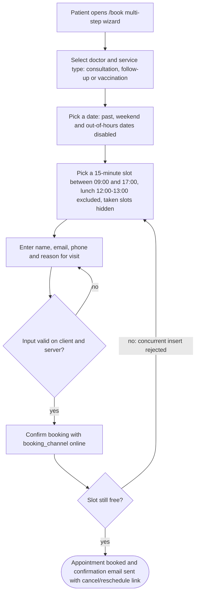
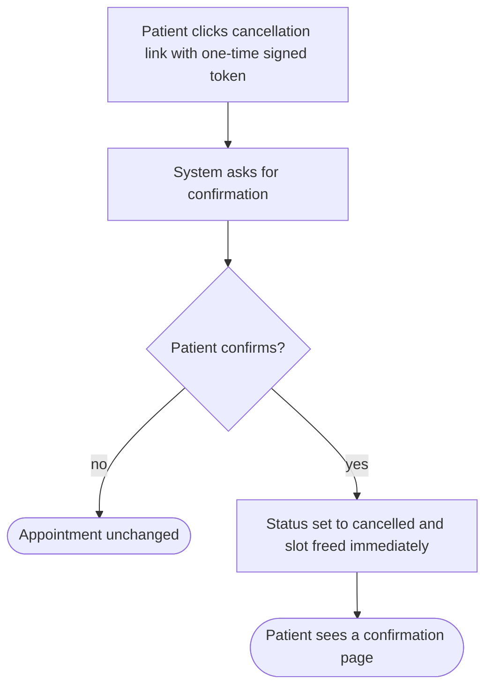
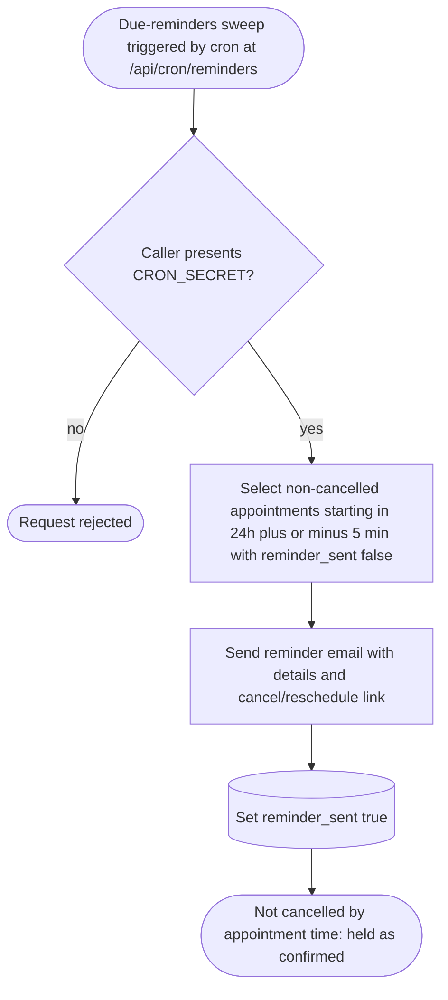
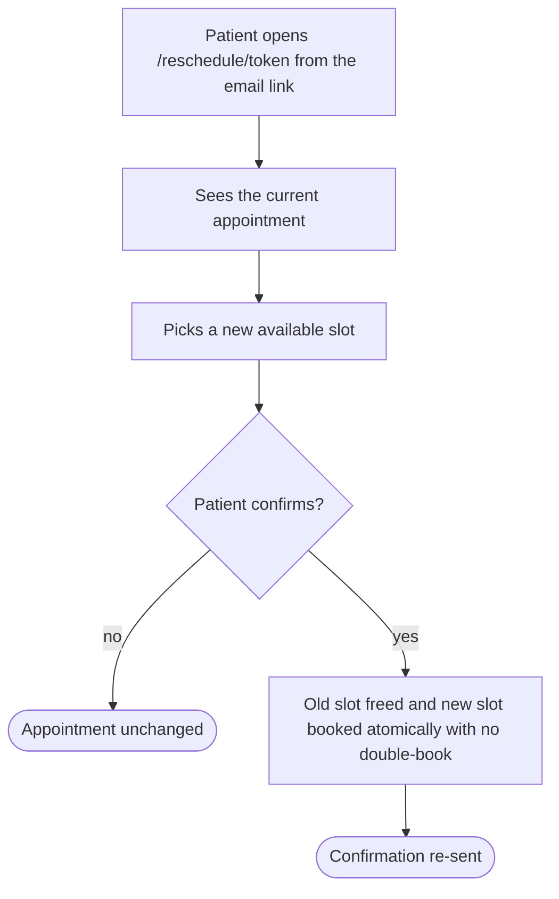
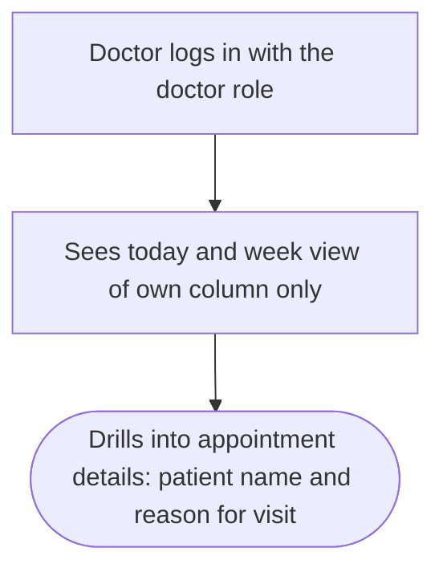
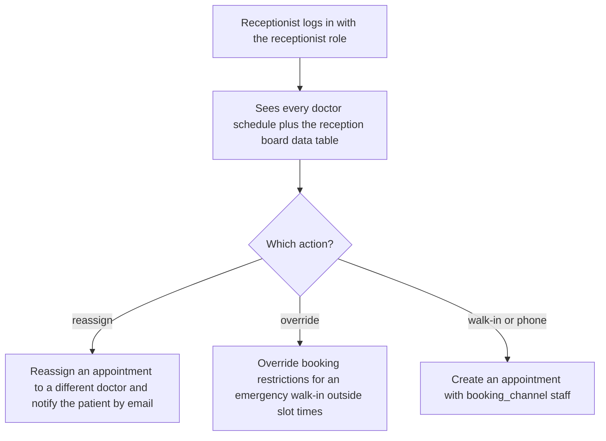

# Clinic Appointment System — Context

> **TL;DR**: Online appointment booking for one small clinic (5 doctors, ~50 appointments/day) — patients self-book, reschedule and cancel without logging in; doctors and receptionists manage the daily schedule. The ONE vault doc of the v8 lite lane: flows (Mermaid + DoD), data model (DBML), constraints (NFR), open questions — every claim cites PRD §<X.Y>.
> **Read when**: you implement a unit (units cite `context_source: context.md#<anchor>`), review a flow, or resolve an OQ.

## Overview

- Patients self-book, reschedule, and cancel appointments online without calling the clinic; clinic staff (doctors, receptionists) view and manage the daily schedule — PRD §1.
- Initial scope is one clinic with 5 doctors handling roughly 50 appointments per day — PRD §1.
- Goals: shift bookings off the phone, cut no-shows with an email reminder 24 hours before the appointment, and ship a trustworthy, accessible UI meeting WCAG 2.2 AA — PRD §2.
- Success metrics: ≥ 50% of appointments booked online within 3 months (measured via `booking_channel`), no-show rate < 10% (baseline 18%), median staff time per booking < 30 sec — PRD §2, §9.
- Roles: Patient (no login; cancel/reschedule via a one-time email token), Doctor (views own schedule), Receptionist (views all schedules, manages conflicts, creates walk-in/phone appointments) — PRD §3.

## Flows

### F-U-001: Patient books appointment

**Actor / Trigger**: Patient (unauthenticated) opens the public booking wizard at `/book`.

**Flow**:


**Definition of Done**:
- [ ] Booking a free slot creates a `booked` appointment with `booking_channel = online` and sends a confirmation email (AC-001)
- [ ] The picker hides taken slots AND a concurrent insert of the same slot is rejected by the unique constraint (AC-002)
- [ ] Slots follow BR-001: 09:00–17:00, 15-minute blocks, no slots 12:00–13:00, narrowed by the doctor's `working_hours`
- [ ] Name, email, phone and reason for visit are validated on the client and on the server (step 5)
- [ ] The booking confirmation is announced through `role="status"` / `aria-live` (§8.4)

**Source**: PRD §Clinic.1 F-U-001, §Clinic.5 AC-001 / AC-002, §5 BR-001 / BR-002 / BR-006, §8.4

### F-U-002: Patient cancels appointment

**Actor / Trigger**: Patient clicks the cancellation link (one-time signed token) from an email.

**Flow**:


**Definition of Done**:
- [ ] Cancelling via the email token sets status `cancelled` and frees the slot (AC-003)
- [ ] Nothing changes until the patient confirms (step 2) — the cancel endpoint accepts POST only; the confirmation screen itself is still an open question (cancel-confirmation page, see Open Questions)
- [ ] Patient sees a confirmation page (step 4) — pending the same open question: PRD §Clinic.3 names no page for it and no unit delivers it yet
- [ ] The token authorizes only its own appointment; there is no patient login (PRD §3)

**Source**: PRD §Clinic.1 F-U-002, §Clinic.3 (cancel via token), §Clinic.5 AC-003, §5 BR-002

### F-U-003: Patient receives reminder

**Trigger**: Scheduled DB-backed "due reminders" sweep (cron) — not per-appointment in-memory timers (PRD §6.3).
**Inputs**: Appointments with status `booked`, their `start_time`, `reminder_at`, `reminder_sent`.

**Flow**:


**Outputs**: Reminder emails; `reminder_sent = true` on each reminded appointment.

**Definition of Done**:
- [ ] A reminder fires 24h ± 5 min before `start_time` for non-cancelled appointments, exactly once — `reminder_sent` flips true and the sweep is idempotent (AC-004)
- [ ] The reminder includes the appointment details and a cancel/reschedule link (BR-003)
- [ ] An appointment not cancelled by its start time is held as confirmed (BR-004)
- [ ] The sweep endpoint rejects callers without `CRON_SECRET` (§Clinic.3)

**Source**: PRD §Clinic.1 F-U-003, §Clinic.3 (reminder cron), §Clinic.5 AC-004, §5 BR-003 / BR-004, §6.3

### F-U-004: Patient reschedules appointment

**Actor / Trigger**: Patient clicks the reschedule link (same one-time token) from an email.

**Flow**:


**Definition of Done**:
- [ ] Rescheduling frees the old slot and books the new one atomically with no double-book (AC-006)
- [ ] The new slot is chosen from available slots only (BR-001 / BR-002)
- [ ] A confirmation is re-sent after the change (step 3)

**Source**: PRD §Clinic.1 F-U-004, §Clinic.3 (reschedule via token), §Clinic.5 AC-006

### F-S-001: Doctor views schedule

**Actor / Trigger**: Doctor (staff, `doctor` role) after staff login.

**Flow**:


**Definition of Done**:
- [ ] A doctor sees only their own schedule (AC-005)
- [ ] Today and week views are available (step 2)
- [ ] Appointment details show the patient name and reason for visit (step 3)
- [ ] Appointment status is encoded by text + icon + color, never color alone (§8.2, AC-007)

**Source**: PRD §Clinic.1 F-S-001, §Clinic.3 (doctor schedule, staff login), §Clinic.5 AC-005 / AC-007

### F-S-002: Receptionist manages conflicts

**Actor / Trigger**: Receptionist (staff, `receptionist` role) after staff login.

**Flow**:


**Definition of Done**:
- [ ] Receptionists see every doctor's schedule plus a reception board data table (AC-005)
- [ ] An appointment can be reassigned to a different doctor, with a patient notification email (step 3)
- [ ] Booking restrictions can be overridden for an emergency walk-in outside slot times (step 4)
- [ ] Walk-in / phone appointments are created with `booking_channel = staff` (step 5, BR-006)

**Source**: PRD §Clinic.1 F-S-002, §Clinic.3 (reception board), §Clinic.5 AC-005, §5 BR-006

## Data model

```dbml
// Purpose: Clinic staff member (doctor or receptionist); owned by the auth schema per PRD §Clinic.4
Table staff {
  id varchar [pk]
  name varchar
  email varchar
  password_hash varchar
  role varchar [note: 'doctor | receptionist']
  specialty varchar [null, note: 'doctors only']
  working_hours json [null, note: 'doctors only; narrows availability within BR-001 bounds']
  created_at timestamp
}

// Purpose: Patient contact record captured at booking time (patients have no login)
Table patient {
  id varchar [pk]
  name varchar
  email varchar
  phone varchar
  created_at timestamp
}

// Purpose: Visit type — consultation, follow-up or vaccination; price is display-only
Table service {
  id varchar [pk]
  name varchar [note: 'consultation | follow-up | vaccination (BR-005)']
  duration_minutes int
  price decimal [note: 'display only; not billed (BR-005)']
}

// Purpose: A scheduled patient visit with a doctor (booked / cancelled / completed)
Table appointment {
  id varchar [pk]
  patient_id varchar
  doctor_id varchar [note: 'references staff']
  service_id varchar
  start_time timestamp
  end_time timestamp
  status varchar [note: 'booked | cancelled | completed']
  reason_for_visit text
  booking_channel varchar [note: 'online | staff (BR-006)']
  reminder_at timestamp
  reminder_sent boolean
  created_at timestamp
  updated_at timestamp

  indexes {
    (doctor_id, start_time) [unique, note: 'only where status = booked — BR-002 / AC-002']
  }
}

Ref: appointment.patient_id > patient.id  // many-to-one
Ref: appointment.doctor_id > staff.id  // many-to-one
Ref: appointment.service_id > service.id  // many-to-one
```

### Schema constraints

- **Uniqueness**: `appointment(doctor_id, start_time)` unique where `status = booked` — enforces BR-002 at the database level; concurrent booking is additionally guarded by a transactional insert — PRD §Clinic.4, §5 BR-002
- **Enumerations**: `appointment.status` ∈ {booked, cancelled, completed}; `appointment.booking_channel` ∈ {online, staff}; `staff.role` ∈ {doctor, receptionist} — PRD §Clinic.4, §4

## Constraints

### Technical constraints

- **PRD stack**: Next.js 16 App Router (Server Components for reads, Server Actions for mutations, Route Handlers for the cron trigger and the token endpoints), Bun 1.3.x, PostgreSQL + Drizzle, shadcn/ui on Tailwind v4, Better Auth for staff, Resend + React Email, DB-backed reminder sweep, Zod v4, Vitest + React Testing Library + Playwright, Biome — PRD §6.3. The existing codebase differs (see OQ-CN-1).
- **Existing codebase** (`implementation_mode: existing`): Next.js 16 App Router + React 19 + MUI 7 + TanStack Query v5 / TanStack Table + next-auth v4 + react-hook-form + zod, browser traffic through the same-origin `/api/v1/*` proxy to an upstream API, Vitest + RTL + MSW, pnpm — `package.json`, `CLAUDE.md` §Stack & Commands / §Architecture.
- **Surfaces**: `/book` (public, rate-limited), `/api/appointments/[id]/cancel` (+ token), `/reschedule/[token]`, `/staff/schedule` (doctor), `/staff/reception` (receptionist), `/staff/login`, `/api/cron/reminders` (`CRON_SECRET`) — PRD §Clinic.3.
- **Patient authentication**: patients are unauthenticated; cancel/reschedule only through a one-time signed email token — PRD §3, §6.3.
- **Reminder scheduling**: a DB-backed "due reminders" sweep, NOT per-appointment in-memory timers — PRD §6.3.

### Business constraints

- **Scale**: one clinic, 5 doctors, ~50 appointments per day — PRD §1.
- **Out of scope (v1)**: multi-clinic, payment processing (price is display-only), SMS reminders, patient medical records, recurring appointments, multi-language UI (English only), patient accounts — PRD §7, §5 BR-005.
- **Regulatory / compliance**: patient personal data (name, email, phone, reason for visit) is collected and stored and must be handled per the applicable regional patient-privacy regulation (OQ-CLINIC-001) — PRD §6.1.

### Non-functional requirements

| Category | Requirement | Source |
|----------|-------------|--------|
| Performance | Appointment lookup < 200ms (median) | PRD §6.2, §Clinic.2 NFR-002 |
| Performance | Reminder email delivered within 5 minutes of the scheduled send time | PRD §6.2, §Clinic.2 NFR-003 |
| Availability | 99% uptime expectation | PRD §6.2 |
| Accessibility | WCAG 2.2 Level AA across patient and staff views | PRD §6.1, §8.4, §Clinic.2 NFR-001 |
| Responsiveness | Mobile-responsive; the patient booking flow is primary and works at 375px | PRD §Clinic.2 NFR-001 |
| Measurement | Every appointment records `booking_channel` so the online-share metric is measured in-system | PRD §5 BR-006, §9 |

### Design system

#### Tokens

- `--primary`: teal-700 `#0E7490` = `oklch(0.520 0.094 223.1)` (5.36:1) with white foreground — PRD §8.2.
- `--accent` / success: green-700 `#15803D` = `oklch(0.527 0.137 150.1)` (5.02:1) — PRD §8.2.
- Raw brand `#0891B2` (3.68:1) and `#16A34A` (3.30:1) FAIL AA for white text — never `--primary` with white foreground; lighter brand hues only for fills, chart series and icon accents — PRD §8.2.
- Status is never color-only: booked / cancelled / completed are encoded by text + icon + color — PRD §8.2.

#### Accessibility

- Contrast ≥ 4.5:1 text / 3:1 UI; visible, unobscured focus; target size ≥ 24×24 (44×44 touch); labelled inputs with in-text error identification; `role="status"` / `aria-live` for booking confirmations and slot-availability updates; semantic landmarks; full keyboard reachability — PRD §8.4.

#### Voice & brand

- Brand color applied selectively to high-signal elements; humanist sans body with a real type scale; branded header (logo + nav) and footer; width-filling composition (two-column booking, hero/empty states) rather than a lone centered card; deliberate radius and consistent shadow/border language; restrained motion (transform/opacity, 160–220ms); clinical flows stay linear — PRD §8.3.

#### Components

- Component foundation per PRD: shadcn/ui + Blocks, Origin UI / Kibo UI, TanStack Table data tables, shadcn Calendar date picking, Schedule-X doctor grid, shadcn Charts, react-hook-form + Zod multi-step form (one `<form>`, single RHF instance, per-step Zod via `trigger(fields)`), lucide icons — PRD §8.1 (library choice subject to OQ-CN-1 / OQ-CLINIC-006).

## Open Questions

- [ ] **OQ-CLINIC-001** [P1] [business]: Which patient-data-privacy regulation applies in our region (HIPAA / GDPR-equivalent), and what does it require for storage and email handling of patient name, email, phone and reason for visit? (PRD §6.1 Compliance; source: PRD §Clinic.6 Open Questions (scope-specific)) — resolve: Product Owner + compliance **Deferred (plan)**: batched ask answered Defer by the benchmark runner (headless session, no stakeholder available) — units implement only PRD-stated handling and invent no regulation-specific behavior (constitution F-004); resurfaced after bolts
- [ ] **OQ-CLINIC-002** [P1] [business]: Should patients see other patients' names in any schedule view? (privacy implications; source: PRD §Clinic.6 Open Questions (scope-specific)) — resolve: Product Owner **Deferred (plan)**: batched ask answered Defer by the benchmark runner (headless session, no stakeholder available) — patient-facing views hide taken slots per PRD F-U-001 step 4 (constitution B-006), so no other patient's data is shown meanwhile; resurfaced after bolts
- [ ] **OQ-CN-1** [P1] [tech / recommend] [conf: medium]: The PRD §6.3 Technology Stack (Bun, PostgreSQL + Drizzle, Better Auth, shadcn/ui, Resend; see also §8.1 Component foundation with Schedule-X) is different from the codebase this project already runs on (Next.js 16 + MUI 7 + next-auth v4 + TanStack Query/Table, clinic data served by an upstream API behind the /api/v1 proxy, no database, pnpm). Which stack should the clinic features be built on? — resolve: Engineering Lead (see recommendation) **Deferred (v1.1)**: runner defer (headless benchmark session, no stakeholder available) — the units proceed on the recorded recommendation as a working assumption; resurfaced in the delivery report
- [ ] **OQ-AR-1** [P1] [tech / recommend] [conf: medium] [origin: context.md#Data-model]: This codebase has no database, yet PRD §Clinic.4 puts key rules in the database (only one booked appointment per doctor and start time, atomic reschedule, each reminder sent exactly once) and the flows send confirmation, reminder and reassignment emails. Which upstream API provides the clinic data, enforces these rules and sends these emails — and at which endpoints? — resolve: Engineering Lead (see recommendation) **Deferred (v1.1)**: runner defer (headless benchmark session, no stakeholder available) — the units proceed on the recorded recommendation as a working assumption; resurfaced in the delivery report
- [ ] **OQ-CN-2** [P2] [tech / blocking] [conf: low]: How are the §6.2 Performance targets (median appointment lookup under 200ms, reminder email within 5 minutes, 99% uptime) measured, and who owns them when the data lives behind an upstream API? — resolve: Engineering Lead **Deferred (v1.1)**: auto-deferred (P2, express) — bukan blocker delivery pertama; muncul lagi di delivery report
- [ ] **OQ-CN-3** [P2] [business]: Which timezone do the 09:00–17:00 bookable hours and the 24-hour reminder use — the clinic's local time or the patient's own device time? — resolve: Product Owner **Deferred (v1.1)**: auto-deferred (P2, express) — bukan blocker delivery pertama; muncul lagi di delivery report
- [ ] **OQ-DM-1** [P2] [business] [origin: context.md#Data-model]: A service's duration can be longer than the 15-minute slot. Does a longer visit (for example a 30-minute consultation) also block the following slot(s), or does only its start slot count as taken? — resolve: Product Owner **Deferred (v1.1)**: auto-deferred (P2, express) — bukan blocker delivery pertama; muncul lagi di delivery report
- [ ] **OQ-FL-1** [P2] [business] [origin: context.md#F-U-002]: Where does the patient confirm a cancellation and see the confirmation page (F-U-002 steps 2 and 4)? The PRD only lists the cancel Route Handler and gives no page for these two screens. — resolve: Design Lead **Deferred (v1.1)**: auto-deferred (P2, express) — bukan blocker delivery pertama; muncul lagi di delivery report
- [ ] **OQ-AR-2** [P2] [tech / blocking] [conf: low] [origin: context.md#F-S-001]: The staff navigation menu can only be restricted by permission names, but the PRD only defines the roles doctor and receptionist. Which permission names should control the Schedule and Reception menu entries? Until answered, the staff pages are protected by role and get no menu entry. — resolve: Engineering Lead **Deferred (v1.1)**: auto-deferred (P2, express) — bukan blocker delivery pertama; muncul lagi di delivery report
- [ ] **OQ-CN-4** [P2] [business] [origin: context.md#Constraints]: The public booking page must be rate-limited (PRD §Clinic.3), but no limit is stated. How many booking attempts per visitor per time window are allowed, and should the limit be enforced by this app or by the upstream API / gateway? — resolve: Product Owner + Engineering Lead **Deferred (v1.1)**: auto-deferred (P2, express) — bukan blocker delivery pertama; muncul lagi di delivery report
- [ ] **OQ-CLINIC-003** [P2] [business]: What is the cancellation window — any time up to the appointment, or N hours before? (Applies to reschedule too.) (source: PRD §Clinic.6 Open Questions (scope-specific)) — resolve: Product Owner **Deferred (v1.1)**: auto-deferred (P2, express) — bukan blocker delivery pertama; muncul lagi di delivery report
- [ ] **OQ-CLINIC-004** [P2] [business]: If a doctor calls in sick, how does the system handle their booked appointments (auto-notify + reassign, or manual)? (source: PRD §Clinic.6 Open Questions (scope-specific)) — resolve: Product Owner **Deferred (v1.1)**: auto-deferred (P2, express) — bukan blocker delivery pertama; muncul lagi di delivery report
- [ ] **OQ-CLINIC-005** [P2] [tech / recommend] [conf: medium]: Deployment target — Vercel (Bun beta runtime + Vercel Cron, Pro tier for sub-daily cron) or self-hosted (Node server + croner)? It determines the reminder-sweep trigger and the Bun-server posture. (source: PRD §Clinic.6 Open Questions (scope-specific)) — resolve: Engineering Lead (see recommendation) **Deferred (v1.1)**: auto-deferred (P2, express) — bukan blocker delivery pertama; muncul lagi di delivery report
- [ ] **OQ-CLINIC-006** [P3] [tech / recommend] [conf: medium]: Doctor schedule grid — confirm Schedule-X's current free-vs-premium view split is acceptable, or budget for FullCalendar Premium. (source: PRD §Clinic.6 Open Questions (scope-specific)) — resolve: Engineering Lead (see recommendation) **Deferred (v1.1)**: auto-deferred (P3, express) — bukan blocker delivery pertama; muncul lagi di delivery report
- [ ] **OQ-CN-5** [P3] [business] [origin: context.md#Constraints]: The branded patient header and footer need the clinic's name and logo (PRD §8.3), but neither is provided. Which clinic name and logo file should be shown? Until answered, the header shows the product name "Clinic Appointment System" as text. — resolve: Design Lead **Deferred (v1.1)**: auto-deferred (P3, express) — bukan blocker delivery pertama; muncul lagi di delivery report
