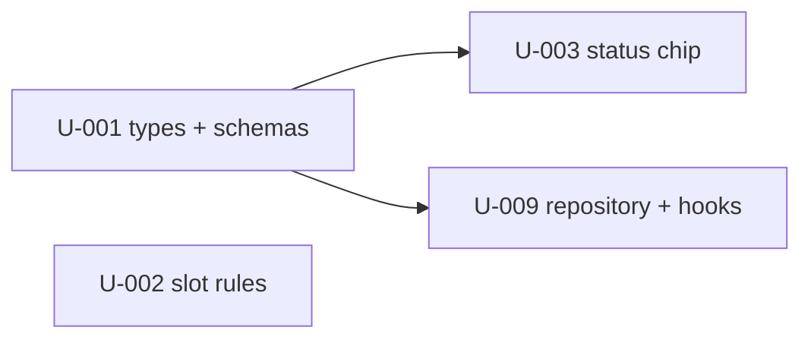
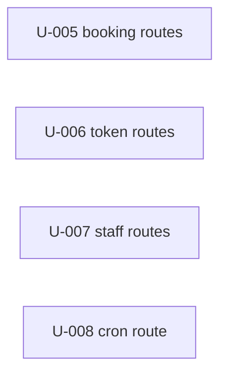
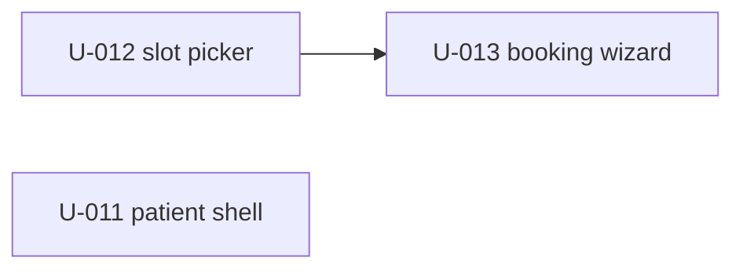
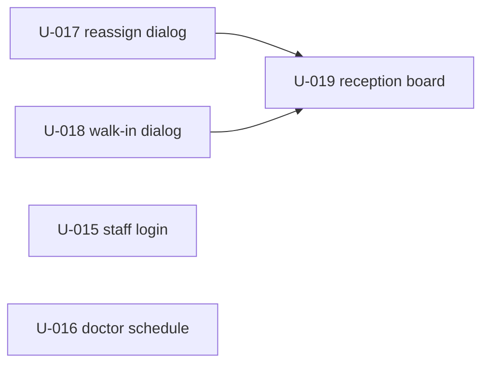
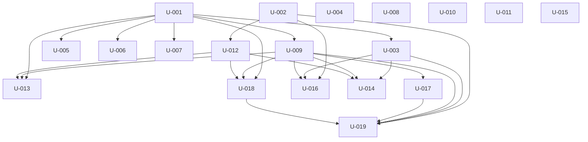

# Units — Clinic Appointment System

> **19 units · 6 modules** · lane: lite · vault: `.mega-sdd/vaults/clinic` · source: `PRD/prd-clinic.md` (sha256 `34b026c2…5d0a`) · every unit carries `prd_source` + `context_source`.
> Build approach follows the OQ-CN-1 / OQ-AR-1 recommendations (existing starterkit, upstream API behind `/api/v1`, no new dependencies) — see `context.md ## Open Questions`.

## M-clinic-core — Clinic domain core

**Status**: 0/4 complete · **Priority**: P1 · **Blocked by**: —

**DoD**:
- [ ] Types mirror PRD §Clinic.4 entities; schemas validate booking, walk-in, reschedule, cancel and reassign payloads
- [ ] Slot rules implement BR-001 / BR-002 and are unit-tested

| ID | Title | task_type | depends_on | risk | status |
|---|---|---|---|---|---|
| U-001 | Define appointment domain types and zod payload schemas | create | — | low | pending |
| U-002 | Implement the bookable slot rules library | create | — | low | pending |
| U-003 | Add appointment status labels and an accessible status chip | extend | U-001 | low | pending |
| U-009 | Add the appointments repository and TanStack Query hooks | create | U-001 | medium | pending |

## M-clinic-bff — Clinic BFF route handlers

**Status**: 0/4 complete · **Priority**: P1 · **Blocked by**: M-clinic-core

**DoD**:
- [ ] Every PRD §Clinic.3 Route Handler surface exists and rejects invalid or unauthorized requests

| ID | Title | task_type | depends_on | risk | status |
|---|---|---|---|---|---|
| U-005 | Add the public booking BFF routes (doctors, services, availability, create appointment) | create | U-001 | high | pending |
| U-006 | Add the token-authorized cancel and reschedule BFF routes | create | U-001 | high | pending |
| U-007 | Add the role-scoped staff schedule and reassign BFF routes | create | U-001 | high | pending |
| U-008 | Add the CRON_SECRET-guarded reminder sweep trigger route | extend | — | high | pending |

## M-patient-booking — Patient booking

**Status**: 0/3 complete · **Priority**: P1 · **Blocked by**: M-clinic-core

**DoD**:
- [ ] A patient can book a free slot at `/book` without logging in (AC-001, AC-002)

| ID | Title | task_type | depends_on | risk | status |
|---|---|---|---|---|---|
| U-011 | Add the branded patient shell layout | create | — | low | pending |
| U-012 | Build the accessible date and slot picker component | create | U-002 | low | pending |
| U-013 | Build the patient booking wizard and the /book page | create | U-001, U-009, U-012 | high | pending |

## M-patient-self-service — Patient self-service

**Status**: 0/1 complete · **Priority**: P1 · **Blocked by**: M-clinic-core, M-patient-booking

**DoD**:
- [ ] A patient can reschedule via the email token (AC-006)

| ID | Title | task_type | depends_on | risk | status |
|---|---|---|---|---|---|
| U-014 | Build the token reschedule page | create | U-003, U-009, U-012 | high | pending |

## M-staff — Staff surfaces

**Status**: 0/5 complete · **Priority**: P1 · **Blocked by**: M-clinic-core, M-patient-booking

**DoD**:
- [ ] Doctors see only their own schedule; receptionists see all and can reassign and create walk-ins (AC-005)

| ID | Title | task_type | depends_on | risk | status |
|---|---|---|---|---|---|
| U-015 | Add the /staff/login page on the existing credentials login | create | — | medium | pending |
| U-016 | Build the doctor schedule page with today and week views | create | U-002, U-003, U-009 | medium | pending |
| U-017 | Build the reassign appointment dialog | create | U-009 | medium | pending |
| U-018 | Build the walk-in appointment dialog with emergency override | create | U-001, U-009, U-012 | high | pending |
| U-019 | Build the reception board page with all doctors' schedules | create | U-002, U-003, U-009, U-017, U-018 | medium | pending |

## M-platform — Platform wiring

**Status**: 0/2 complete · **Priority**: P1 · **Blocked by**: —

**DoD**:
- [ ] Public patient routes reachable anonymously; primary color is teal-700

| ID | Title | task_type | depends_on | risk | status |
|---|---|---|---|---|---|
| U-004 | Make teal-700 the default primary color | extend | — | low | pending |
| U-010 | Open the patient pages and staff login in the route proxy | extend | — | high | pending |

## Cross-module dependency graph

## Suggested execution order (topological waves)

1. **Wave 1** — U-001, U-002, U-004, U-008, U-010, U-011, U-015
2. **Wave 2** — U-003, U-005, U-006, U-007, U-009, U-012
3. **Wave 3** — U-013, U-014, U-016, U-017, U-018
4. **Wave 4** — U-019

Under the lite lane W2 fast lane, readiness is per unit (`derive-ready-units.sh`), so a unit starts as soon as all its `depends_on` units have passing evidence — the waves above are the worst-case ordering.
