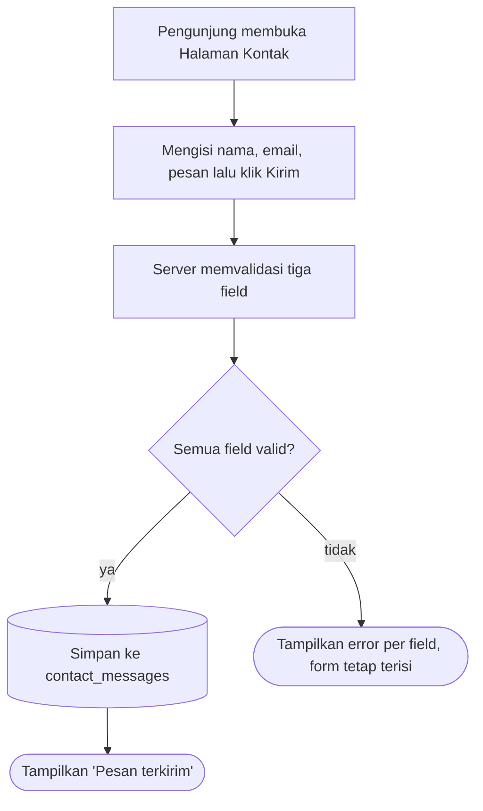

# Company Profile Mini — Context

> **TL;DR**: Tiga halaman publik (Beranda, Tentang Kami, Kontak) + satu form kontak yang menyimpan pesan ke `contact_messages`; audiens = pengunjung umum tanpa login. Satu-satunya dokumen vault lite lane: flow (Mermaid + DoD), data model (DBML), constraints (NFR), open questions — setiap klaim mengutip PRD §.
> **Read when**: mengimplementasikan unit (unit mengutip `context_source: context.md#<anchor>`), me-review flow, atau menjawab OQ.

## Overview

- Sebuah unit kerja butuh halaman profil publik sederhana: siapa mereka, apa layanannya, dan cara menghubungi. Tidak ada login, tidak ada dashboard, tidak ada integrasi eksternal — PRD §Latar belakang.
- Tujuan: pengunjung membaca profil dan daftar layanan dalam satu kunjungan; pengunjung mengirim pesan lewat form kontak dan pesan tersimpan agar bisa dibaca admin lewat database (tidak ada UI admin di rilis ini) — PRD §Tujuan.
- Lingkup: tiga halaman publik + satu form — PRD §Ruang lingkup.
  - **Beranda**: judul organisasi, tagline satu kalimat, ringkasan tiga layanan utama (judul + satu paragraf per layanan, konten statis dari file konfigurasi), tombol menuju Kontak; responsif di 375px dan desktop — PRD §Halaman Beranda.
  - **Tentang Kami**: profil singkat (dua–tiga paragraf statis), daftar tim (nama + peran, statis dari konfigurasi, tanpa foto), tautan kembali ke Beranda — PRD §Halaman Tentang Kami.
  - **Kontak**: form nama / email / pesan dengan validasi sisi server, simpan ke `contact_messages`, pesan sukses di halaman yang sama — PRD §Halaman Kontak.
- Konten statis (nama organisasi, layanan, tim) diambil dari file konfigurasi placeholder; isi final diganti tim sendiri — PRD §Open questions.

## Flows

### F-U-001: Kirim pesan kontak

**Actor / Trigger**: Pengunjung (tanpa login) membuka Halaman Kontak.

**Flow**:


**Aturan validasi** (PRD §Halaman Kontak):
- `nama` — wajib, ≤ 100 karakter.
- `email` — wajib, format email valid.
- `pesan` — wajib, ≤ 2000 karakter.

**Definition of Done**:
- [ ] Pesan valid tersimpan dengan `created_at`.
- [ ] Email tidak valid ditolak dengan pesan error di field email.
- [ ] Form tetap terisi setelah gagal validasi.

**Source**: PRD §Alur / F-U-001, PRD §Halaman Kontak

## Data model

```dbml
// Purpose: Pesan yang dikirim pengunjung lewat form Kontak, dibaca admin langsung dari database
Table contact_messages {
  id integer [pk]
  name varchar(100) [not null]
  email varchar(255) [not null]
  message text [not null]
  created_at timestamp [not null]
}
```

<!-- compact-skip -->
### contact_messages

- **Purpose**: menyimpan setiap pesan valid dari F-U-001 — PRD §Data model, PRD §Tujuan.
- **Key fields**: `name` — varchar(100), batas 100 karakter; `email` — varchar(255), format email valid; `message` — text, batas 2000 karakter di form; `created_at` — timestamp wajib, bukti pesan tersimpan (DoD F-U-001).
- **Relations**: tidak ada.
<!-- /compact-skip -->

### Schema constraints

- **Panjang field**: `name` ≤ 100 (PRD §Halaman Kontak, PRD §Data model `varchar(100)`); `email` ≤ 255 (PRD §Data model `varchar(255)`); `message` ≤ 2000 (PRD §Halaman Kontak).
- **Wajib**: `name`, `email`, `message`, `created_at` `[not null]` — PRD §Data model.

## Constraints

### Technical constraints

- **Codebase existing**: dibangun di dalam starter kit Next.js 16 (App Router) + MUI 7 + react-hook-form + zod + Vitest/RTL/MSW yang sudah ada — `package.json`, `CLAUDE.md §Stack & Commands`.
- **Tidak ada lapisan database lokal**: repo tidak punya dependency database; semua data mengalir lewat proxy `/api/v1/*` → `apiServer` → upstream API — `package.json`, `src/libs/api/server.ts:9`, `CLAUDE.md §Data flow`. Lokasi tabel `contact_messages` → OQ-AR-1.
- **Route guard**: `src/proxy.ts:11` hanya meloloskan `/login` dan `/register` tanpa sesi; halaman lain dialihkan ke `/login` — halaman publik PRD harus ditambahkan ke guard — `src/proxy.ts:11`, PRD §Latar belakang ("Tidak ada login").

### Business constraints

- **Di luar lingkup rilis ini**: autentikasi, panel admin, notifikasi email, multi-bahasa, CMS — PRD §Ruang lingkup.
- **Konten statis**: nama organisasi, tagline, layanan, profil, dan tim berasal dari file konfigurasi placeholder; isi final diganti tim — PRD §Halaman Beranda, PRD §Halaman Tentang Kami, PRD §Open questions.
- **Tim tanpa foto** — PRD §Halaman Tentang Kami.

### Non-functional requirements

| Category | Requirement | Source |
|----------|-------------|--------|
| Performance | Halaman statis termuat < 2 detik di koneksi 3G. | PRD §Non-functional |
| Accessibility | Semua field form berlabel; navigasi keyboard berfungsi. | PRD §Non-functional |
| Security | Input form di-escape saat ditampilkan; tidak ada HTML mentah dari pengunjung. | PRD §Non-functional |
| Responsiveness | Beranda responsif di 375px dan desktop. | PRD §Halaman Beranda |

### Design system

#### Accessibility

- Semua field form (nama, email, pesan) punya label; navigasi keyboard berfungsi — PRD §Non-functional.
- Target standar (mis. level WCAG) tidak dinyatakan PRD — tidak di-default-kan.

## Open Questions

- [ ] **OQ-AR-1** [P1] [tech / recommend] [conf: medium] [origin: context.md#Data-model]: PRD meminta pesan disimpan ke tabel `contact_messages`, tetapi repo ini tidak punya lapisan database (tanpa dependency DB; semua data lewat upstream API) — di mana tabel ini hidup dan siapa yang mengisi `created_at`? — resolve: recommendation di vault.json (simpan lewat upstream `POST /v1/contact-messages` via proxy route + `apiServer`; route handler mengisi `created_at`). **Deferred (v1.1)**: [ASSUMED-BY-RUNNER] tidak ada stakeholder di sesi benchmark — rekomendasi (upstream `POST /v1/contact-messages` via `apiServer`, tanpa dependency DB baru) dipakai sementara oleh U-004/U-005; konfirmasi ke pemilik upstream API sebelum rilis.
- [ ] **OQ-AR-2** [P2] [tech / recommend] [conf: medium] [origin: context.md#Overview]: PRD tidak menyebut URL tiga halaman publik, sementara `/` sudah dialihkan ke `/home` (dashboard) — pakai path apa? — resolve: recommendation di vault.json (`/beranda`, `/tentang-kami`, `/kontak`; redirect `/` tidak diubah). **Deferred (plan)**: resurfaced after bolts
- [ ] **OQ-FL-1** [P2] [business] [origin: context.md#F-U-001]: Setelah "Pesan terkirim", apakah isi form dikosongkan? PRD hanya menyebut pesan sukses di halaman yang sama. **Deferred (plan)**: resurfaced after bolts
- [ ] **OQ-CN-1** [P2] [business]: Form kontak publik tanpa login — perlu perlindungan spam / rate limit? PRD tidak menyebut. **Deferred (plan)**: resurfaced after bolts
- [ ] **OQ-CN-2** [P2] [business]: Target "< 2 detik di koneksi 3G" belum punya profil jaringan / alat ukur yang disepakati. **Deferred (plan)**: resurfaced after bolts
