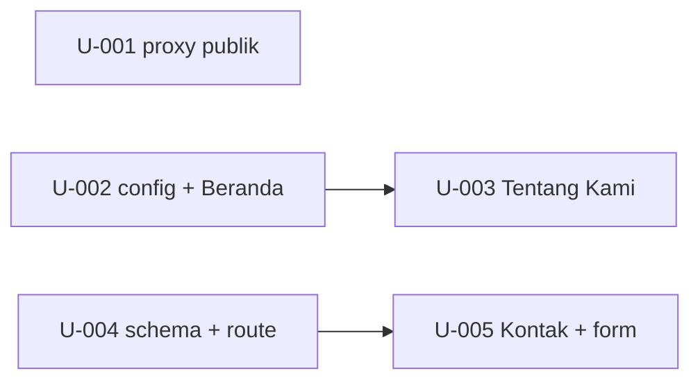

# Units — company-profile

> **Total**: 5 units · 1 module (`M-default`) · project_scale: xs · lane: lite (JIT bind at dispatch)
> **Source**: PRD/prd-company-profile.md + context.md

## M-default

| Unit | Title | task_type | depends_on | prd_source | binding_refs |
|---|---|---|---|---|---|
| U-001 | Loloskan halaman profil publik di route guard proxy | extend | — | #latar-belakang, #ruang-lingkup | OQ-AR-2 |
| U-002 | Buat konfigurasi konten profil dan Halaman Beranda | create | — | #halaman-beranda | OQ-AR-2 |
| U-003 | Buat Halaman Tentang Kami | create | U-002 | #halaman-tentang-kami | OQ-AR-2 |
| U-004 | Buat schema pesan kontak dan route handler penyimpanan | create | — | #halaman-kontak, #alur, #f-u-001-kirim-pesan-kontak | OQ-AR-1 |
| U-005 | Buat Halaman Kontak dengan form kirim pesan | create | U-004 | #halaman-kontak, #f-u-001-kirim-pesan-kontak | OQ-AR-1, OQ-AR-2, OQ-FL-1 |

**DoD (F-U-001)**: pesan valid tersimpan dengan `created_at` (U-004) · email tidak valid ditolak di field email (U-004 server, U-005 UI) · form tetap terisi setelah gagal validasi (U-005).

## Dependency graph

## Suggested topological order

1. Wave 1 (parallel): U-001, U-002, U-004
2. Wave 2 (parallel): U-003 (after U-002), U-005 (after U-004)
