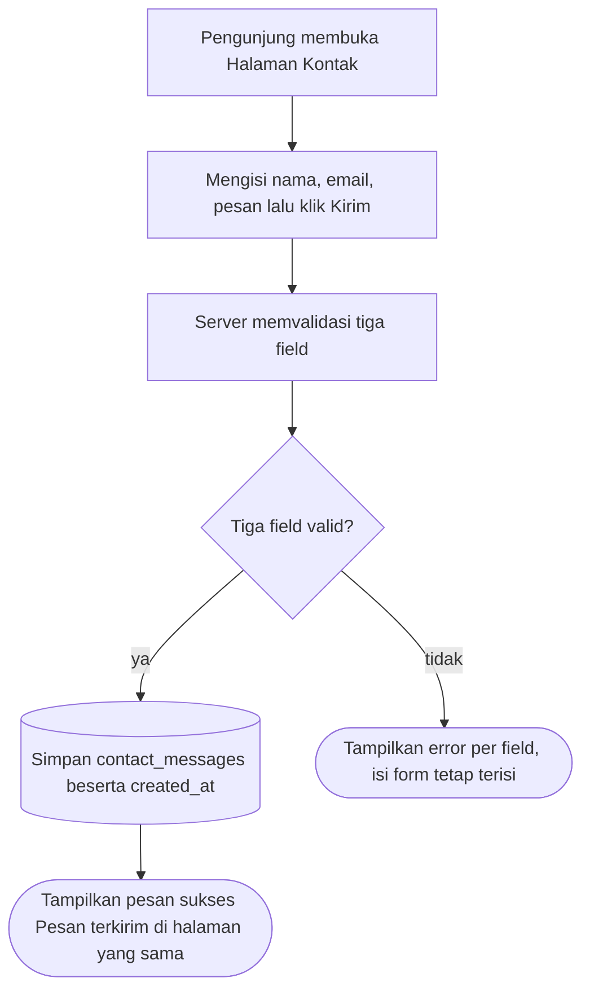

# Company Profile Mini — Context

> **TL;DR**: Tiga halaman publik (Beranda, Tentang Kami, Kontak) + satu form kontak yang menyimpan pesan pengunjung — tanpa login, tanpa panel admin (PRD §Latar belakang, §Ruang lingkup). Dokumen vault tunggal lane lite v8: flows (Mermaid + DoD), data model (DBML), constraints (NFR), open questions — setiap klaim mengutip PRD §.
> **Read when**: mengimplementasikan unit (unit mengutip `context_source: context.md#<anchor>`), me-review flow, atau menjawab OQ.

## Overview

- Sebuah unit kerja butuh halaman profil publik yang sederhana: siapa mereka, apa layanannya, dan cara menghubungi. Tidak ada login, tidak ada dashboard, tidak ada integrasi eksternal (PRD §Latar belakang).
- Tujuan: pengunjung membaca profil dan daftar layanan dalam satu kunjungan; pengunjung bisa mengirim pesan lewat form kontak, dan pesan tersimpan agar bisa dibaca admin lewat database — tidak ada UI admin di rilis ini (PRD §Tujuan).
- Lingkup: tiga halaman publik + satu form — Beranda (PRD §Halaman Beranda), Tentang Kami (PRD §Halaman Tentang Kami), Kontak (PRD §Halaman Kontak). Di luar lingkup: autentikasi, panel admin, notifikasi email, multi-bahasa, CMS (PRD §Ruang lingkup).
- Konten statis (nama organisasi, layanan, tim) diambil dari file konfigurasi placeholder; isi final diganti tim sendiri (PRD §Open questions).

## Flows

### F-U-001: Kirim pesan kontak

**Actor / Trigger**: Pengunjung (tanpa login) membuka Halaman Kontak

**Flow**:


**Definition of Done**:
- [ ] Pesan valid tersimpan dengan `created_at` (PRD §Alur › F-U-001 DoD).
- [ ] Email tidak valid ditolak dengan pesan error di field email (PRD §Alur › F-U-001 DoD).
- [ ] Form tetap terisi setelah gagal validasi (PRD §Alur › F-U-001 DoD).
- [ ] Validasi sisi server: nama wajib ≤100 karakter, email wajib format valid, pesan wajib ≤2000 karakter (PRD §Halaman Kontak).
- [ ] Setelah sukses, teks "Pesan terkirim" tampil di halaman yang sama (PRD §Halaman Kontak; PRD §Alur › F-U-001 langkah 4).

**Source**: PRD §Alur › F-U-001: Kirim pesan kontak; PRD §Halaman Kontak

## Data model

```dbml
// Purpose: Pesan kontak dari pengunjung, dibaca admin langsung lewat database (tanpa UI admin di rilis ini)
Table contact_messages {
  id integer [pk]
  name varchar(100) [not null]
  email varchar(255) [not null]
  message text [not null]
  created_at timestamp [not null]
}
```

Skema disalin verbatim dari PRD §Data model. Lokasi fisik tabel (repo ini tidak punya lapisan database sendiri) → OQ-DM-1.

### Schema constraints

- **Panjang `name`**: ≤100 karakter — PRD §Halaman Kontak (selaras `varchar(100)`, PRD §Data model).
- **Panjang `message`**: ≤2000 karakter — PRD §Halaman Kontak (kolom bertipe `text`; batas ditegakkan oleh validasi).
- **Format `email`**: format email valid, ≤255 karakter — PRD §Halaman Kontak; PRD §Data model.

## Constraints

### Technical constraints

- **Stack lock-in (brownfield)**: Next.js 16 App Router + React 19 + MUI 7 + react-hook-form + zod + TanStack Query; package manager pnpm; test Vitest + React Testing Library + MSW — `package.json:5`, `CLAUDE.md §Stack & Commands`.
- **Integration boundary**: repo tidak memiliki database/ORM; data mengalir page → hook → repository → apiClient → proxy `/api/v1` → apiServer → API upstream (`CLAUDE.md §Data flow`, `src/libs/api/server.ts:9`). Tempat penyimpanan `contact_messages` → OQ-DM-1.
- **Auth guard existing**: `src/proxy.ts:11-28` mengarahkan pengunjung tanpa sesi ke `/login` dan memantulkan user bersesi dari `publicRoutes` ke `/home`; halaman PRD harus terbuka tanpa login (PRD §Latar belakang; PRD §Ruang lingkup).
- **Root redirect existing**: `next.config.ts:5-13` mengalihkan `/` → `/home` secara permanen; URL halaman publik → OQ-AR-1.
- **Konten statis dari file konfigurasi**: judul organisasi, tagline, tiga layanan (judul + satu paragraf), profil 2–3 paragraf, daftar tim (nama + peran, tanpa foto) — PRD §Halaman Beranda; PRD §Halaman Tentang Kami; PRD §Open questions.

### Business constraints

- **Di luar lingkup**: autentikasi, panel admin, notifikasi email, multi-bahasa, CMS — PRD §Ruang lingkup.
- **Admin membaca pesan lewat database**, tidak ada UI admin di rilis ini — PRD §Tujuan.

### Non-functional requirements

| Category | Requirement | Source |
|----------|-------------|--------|
| Performa | Halaman statis termuat < 2 detik di koneksi 3G | PRD §Non-functional |
| Aksesibilitas | Semua field form berlabel; navigasi keyboard berfungsi | PRD §Non-functional |
| Keamanan | Input form di-escape saat ditampilkan; tidak ada HTML mentah dari pengunjung | PRD §Non-functional |
| Responsif | Halaman Beranda responsif di 375px dan desktop | PRD §Halaman Beranda |

## Open Questions

- [x] **OQ-DM-1** [P1] [business] [origin: context.md#Data-model]: PRD meminta pesan kontak disimpan ke tabel `contact_messages` supaya admin bisa membacanya lewat database, tetapi aplikasi ini tidak punya database sendiri — semua data dikirim ke API upstream. Di mana tabel `contact_messages` berada, dan lewat jalur apa pesan disimpan? — resolve: PO / tim backend → **Resolved (plan)** (2026-09-14): [ASSUMED-BY-RUNNER — headless benchmark run, owner absent] Tabel `contact_messages` dimiliki API upstream. Aplikasi menyimpan lewat route handler same-origin `POST /api/v1/contact-messages` yang memvalidasi di server, lalu meneruskan via `apiServer` ke `POST /v1/contact-messages` dengan `created_at` dicap server — tanpa database atau dependency baru (pola CLAUDE.md §Data flow). Konfirmasi kontrak upstream oleh tim backend tetap diperlukan sebelum rilis.
- [ ] **OQ-AR-1** [P2] [tech / recommend] [conf: medium] [origin: context.md#Constraints]: PRD tidak menyebut alamat URL ketiga halaman publik, sementara `/` sudah dialihkan ke dashboard `/home`. URL apa yang dipakai untuk Beranda, Tentang Kami, dan Kontak? — **Deferred (plan)**: project_scale=xs — resurfaced after bolts; unit memakai rekomendasi `/beranda`, `/tentang-kami`, `/kontak` sementara.
- [ ] **OQ-FL-1** [P2] [business] [origin: context.md#F-U-001]: PRD hanya menetapkan teks sukses "Pesan terkirim"; kalimat pesan error per field tidak ditentukan. Kalimat error apa yang ditampilkan untuk nama, email, dan pesan? — **Deferred (plan)**: project_scale=xs — resurfaced after bolts; unit memakai kalimat yang menyalin aturan PRD (wajib / maks 100 karakter / format email valid / maks 2000 karakter) sementara.
- [ ] **OQ-FL-2** [P2] [business] [origin: context.md#Overview]: PRD memberi tombol Beranda → Kontak dan tautan Tentang Kami → Beranda, tetapi tidak ada jalan dari halaman lain menuju Tentang Kami. Perlukah navigasi (misalnya menu atau tautan) ke Halaman Tentang Kami? — **Deferred (plan)**: project_scale=xs — resurfaced after bolts; tidak ada navigasi tambahan yang dibuat.
- [ ] **OQ-CN-1** [P2] [business]: Target performa "halaman statis termuat < 2 detik di koneksi 3G" tidak menyebut cara dan alat ukurnya, sehingga belum ada acceptance test yang bisa membuktikannya. Siapa yang mengukur, dan dengan alat apa? — **Deferred (plan)**: project_scale=xs — resurfaced after bolts.
