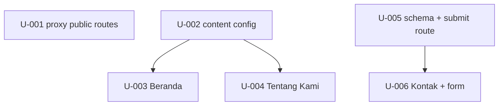

# Units — Company Profile Mini

**Total**: 6 units · 1 module (`M-default`) · project_scale: xs · lane: lite (JIT bind at dispatch)
**Source**: PRD/prd-company-profile.md · context.md

| ID | Title | task_type | depends_on | binding_refs | status |
|----|-------|-----------|------------|--------------|--------|
| U-001 | Open the three public company-profile routes in the proxy guard | extend | — | OQ-AR-1 | pending |
| U-002 | Add the static company-profile content config | create | — | — | pending |
| U-003 | Build the public Beranda page | create | U-002 | OQ-AR-1, OQ-FL-2, OQ-CN-1 | pending |
| U-004 | Build the public Tentang Kami page | create | U-002 | OQ-AR-1, OQ-FL-2, OQ-CN-1 | pending |
| U-005 | Add the contact-message schema and the server-validating submit route | create | — | OQ-DM-1, OQ-FL-1 | pending |
| U-006 | Build the public Kontak page with the contact form | create | U-005 | OQ-DM-1, OQ-FL-1, OQ-AR-1 | pending |

## Dependency graph

## Suggested execution order

1. Wave 1 (parallel): U-001, U-002, U-005
2. Wave 2 (parallel): U-003, U-004, U-006
