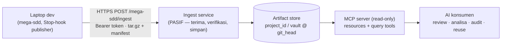

# Guide Tim — Gateway MCP untuk Artifact Mega-SDD

Arahan untuk tim yang membangun sisi **AI gateway**: satu endpoint ingest (pasif, menerima push dari mega-sdd) + satu **MCP server read-only** yang menyajikan artifact ke AI lain untuk analisa/review. Kontrak di dokumen ini adalah pasangan dari spec plugin `docs/superpowers/specs/2026-08-17-artifact-publisher-gateway.md`.



## 1. Endpoint ingest (yang diterima dari mega-sdd)

`POST /mega-sdd/ingest` — `Authorization: Bearer <token>` — body multipart/tar.gz berisi file yang BERUBAH + `manifest.json` LENGKAP.

`manifest.json`:

```json
{
  "schema": "mega-sdd-publish/1",
  "project_id": "scm.bankmegadev.com/grup/repo",
  "vault": "nama-vault",
  "git_head": "<sha40>",
  "generated_at": "2026-08-17T12:00:00Z",
  "files": { "<path-relatif>": "<sha256>" },
  "graph_meta": { "source_hashes": { "…": "…" } }
}
```

Aturan wajib:
- **Idempotent** — set sha sama dengan yang tersimpan → no-op, balas 200. Publisher retry bebas tanpa efek ganda.
- **Self-heal dari manifest** — manifest selalu LENGKAP walau file yang dikirim delta; file di manifest yang belum ada di store → minta di respons (`{"missing": ["path", …]}`) → publisher kirim penuh di push berikutnya.
- **Simpan per `project_id`/`vault`, berkunci `git_head`** — snapshot terbaru menang; simpan N snapshot terakhir kalau mau riwayat.
- **Jangan pernah menolak karena isi** — validasi hanya token + bentuk; gateway pasif, bukan gate.
- Respons: `200` diterima · `401` token · `413` kebesaran (negosiasikan cap dengan kami) · `5xx` → publisher antre + retry (fail-open di sisi dev, jangan andalkan dev melihat error).

## 2. Artifact yang kalian terima (apa maknanya)

| File | Isi | Catatan konsumsi |
|---|---|---|
| `graph.json` | nodes/edges: units, claims, modules, flows, KB domains → anchor kode; id unit **ber-prefix vault** (`app:U-001`) | `_meta.source_hashes` = dasar cek staleness; edges `depends_on` = bahan blast-radius |
| `vaults/<v>/00-…06-*.md` | vault 7-file: intent, arsitektur, data model, flows, OQ roll-up, constraints | Sumber kebenaran desain; OQ = pertanyaan terbuka, BUKAN fakta |
| `vaults/<v>/binding.md` | verdict per klaim: `CONFIRMED` / `CONFLICT` / `OQ` + anchor `path:line` + Implementation State Map (`NEW/IMPLEMENTED/PARTIAL_*/UNKNOWN`) | **Informasi, bukan gate** — gate hidup di dalam mega-sdd; sajikan apa adanya |
| `vaults/<v>/units/U-*.md` | unit kerja atomik: frontmatter (task_type, target_files, depends_on, squad, module), Hard rules, acceptance_test | `status: superseded/stale` bermakna — jangan sajikan stale sebagai current tanpa labelnya |
| `knowledge-base/` | ekstraksi domain legacy, marker `[VERIFIED]/[INFERRED]/[OPEN]` + tier `[LOCKED]/[INTENT]/[ARTIFACT]` | Marker WAJIB ikut tersaji — `[INFERRED]` yang disajikan tanpa marker = fabrikasi |
| `codebase/codebase-map.md` | peta kode ber-section (§) dengan kutipan | Berisi potongan source — perlakukan sesuai klasifikasi data internal |
| symbol index | simbol per file untuk reuse lookup | Bahan tool reuse lintas proyek |

**Kontrak kejujuran (tidak boleh dilanggar oleh MCP kalian):** (1) read-only mutlak — tidak ada tool yang menulis balik; (2) selalu sertakan staleness (`git_head` + umur snapshot) di respons; (3) jangan menyembunyikan marker/status; (4) verdict binding disajikan sebagai informasi bertanggal, bukan kebenaran hidup.

## 3. Desain MCP server (rekomendasi)

Transport HTTP/SSE (server terpusat — bukan stdio), auth token, **semua tool read-only**.

**Resources** (untuk AI yang mau baca utuh): satu resource per artifact per proyek/vault, mis. `megasdd://{project}/{vault}/binding`.

**Tools query** (nilai utamanya — jawaban kecil, bukan file besar):

| Tool | Signature | Kegunaan |
|---|---|---|
| `list_projects()` | → daftar project_id + vaults + git_head + umur | Orientasi |
| `get_claims(project, vault, status?)` | status ∈ CONFIRMED/CONFLICT/OQ | Review: "apa saja CONFLICT aktif?" |
| `blast_radius(project, vault, unit_id)` | closure reverse-`depends_on` dari graph | Analisa dampak (`app:U-001` atau bare id di-scope ke vault) |
| `get_unit(project, vault, unit_id)` | unit penuh + status | Konteks review |
| `search_kb(project, q)` | cari KB, hasil BAWA marker | Analisa domain |
| `reuse_candidates(q)` | cari symbol index LINTAS proyek | Nilai unik gateway: reuse antar-tim |
| `staleness(project, vault)` | git_head vs umur + graph_meta | Wajib ada — konsumen bisa menolak data basi |

Praktik: paginasi + cap ukuran respons (AI konsumen punya context terbatas); log akses per token; jangan meng-embed seluruh codebase-map di satu respons tool.

## 4. Registrasi di Claude Code tim (pola "otomatis seperti playwright")

MCP gateway TIDAK dibundel di plugin mega-sdd (URL-nya spesifik kantor). Cara mendapatkan auto-register yang sama: **commit `.mcp.json` di root tiap repo proyek kantor** — semua dev yang membuka repo itu otomatis dapat servernya:

```json
{
  "mcpServers": {
    "megasdd-gateway": {
      "type": "http",
      "url": "https://<gateway-internal>/mega-sdd/mcp"
    }
  }
}
```

(Token via mekanisme auth MCP kalian / header config sesuai platform gateway; jangan commit token ke repo.)

## 5. Integrasi mega-code (provisioning kredensial publisher)

`mega-code login` (NIP) adalah tempat provisioning kredensial publisher — dev tidak pernah mengisi config manual:

1. Saat login, mega-code menukar NIP → **token publish per pegawai** ke gateway (revocable, ber-expiry).
2. mega-code menyerahkan kredensial ke publisher lewat SALAH SATU kanal (plugin mendukung keduanya): set env `MEGA_SDD_PUBLISH_URL` + `MEGA_SDD_PUBLISH_TOKEN` saat me-launch `claude`, ATAU tulis `~/.mega-code/megasdd-publish.json` (`{"gateway_url": "…", "token": "…"}`, permission 600).
3. **Atribusi per NIP terjadi di gateway** (dari token) — manifest artifact tidak pernah membawa NIP (no PII in artifacts).
4. Token expired → publisher menerima 401, antre, dan menyarankan `mega-code login`; jangan buat gateway mengirim token baru lewat kanal lain.

## 6. Checklist keamanan & acceptance

- [ ] Hanya jaringan internal; TLS; token per tim (revocable); ingest + MCP di-log per token.
- [ ] Read-only terbukti: tidak ada endpoint/tool mutasi; store ditulis HANYA oleh ingest.
- [ ] Idempotensi terbukti (push ganda sha sama = 1 snapshot).
- [ ] Self-heal terbukti (hapus satu file di store → respons `missing` → pulih di push berikutnya).
- [ ] Staleness tersaji di setiap jawaban tool.
- [ ] Marker `[VERIFIED]/[INFERRED]/[OPEN]` + status unit tidak pernah di-strip.
- [ ] Retensi & klasifikasi data disepakati dengan security (artifact memuat potongan source code).
