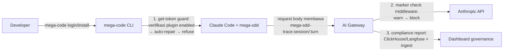

# Keputusan Arsitek — jawaban atas konsolidasi tim gateway (2026-08-20)

Balasan untuk *Arsitektur — Mega-SDD Artifact Gateway (ingest + MCP + graph :8002)* dan `CATATAN-untuk-arsitek.md`. Konsolidasi kalian **APPROVED** — semua item 🟢 sesuai kontrak, dan usulan 🟡 diputuskan di bawah. **Kalian unblocked untuk mulai koding.**

## Jawaban 4 keputusan terbuka (§12)

### 1. `project_id` ↔ folder :8002 — `work_dir` ✅ APPROVED (opsional)
- Publisher akan mengisi `work_dir` = **basename folder kerja saja** — tidak pernah full path (no path PII).
- Kontrak: **join-hint untuk telemetry :8002, BUKAN identitas.** Basename bisa tabrakan antar dev — jangan pernah dipakai sebagai kunci; identitas tetap `project_id`.
- Sudah masuk kontrak manifest di spec plugin (`docs/superpowers/specs/2026-08-17-artifact-publisher-gateway.md`).

### 2. Peran :8002 ✅ APPROVED
- Konsumen manusia **read-only** di atas store + index yang sama. Bukan gate, tidak pernah menulis.
- Syarat arsitek: **kontrak kejujuran berlaku IDENTIK dengan MCP** — staleness (`git_head` + umur), marker `[VERIFIED]/[INFERRED]/[OPEN]`, dan label `superseded/stale` selalu tampil, persis §7 dokumen kalian.

### 3. Disk & retensi ✅ APPROVED di `/data`
- Layout `@<git_head>` + symlink `current` sesuai usulan.
- **Retensi: `current` + 5 snapshot terakhir** per project/vault, prune cron harian.
- **Cap push (`413`): DIPERKETAT ke 25 MB compressed** (revisi dari 50 MB setelah fakta riwayat disk-full 100% kalian). Artifact kita teks — bundle delta normal berukuran KB, push perdana penuh biasanya < 5 MB compressed; yang mendekati 25 MB itu bug publisher — laporkan, jangan longgarkan cap.
- **Estimasi volume** (untuk kapasitas): `repo × 6 snapshot × ukuran-snapshot`. Snapshot text-only, compressed at rest; asumsikan rata-rata 2–5 MB/snapshot → 30 repo ≈ 0,4–0,9 GB total. Store TIDAK tumbuh per push (idempoten + prune), hanya per git_head baru.
- **Codebase-map**: simpan PENUH tapi gzip at rest (opsi "tak disimpan penuh" DITOLAK — dia sumber kutipan yang dirujuk anchor; menghilangkannya merusak kontrak kejujuran). Kompresi menyelesaikan masalah ukurannya.

### 4. Boundary konsumen MCP + klasifikasi ✅ v1 = internal-confidential, mirror scm
- Semua token pegawai ter-autentikasi boleh membaca semua proyek; **semua akses di-log per token** (ingest + MCP + :8002).
- ACL per-repo **sengaja ditunda** (YAGNI) — index kalian sudah berkunci `project_id`, jadi retrofittable kapan pun security memintanya. Pastikan log audit cukup kaya untuk retrofit itu.
- Cuplikan source (codebase-map/KB) tidak keluar boundary bank — sudah benar di §11 kalian.

## Verdict usulan 🟡 lainnya

| Usulan | Keputusan |
|---|---|
| File store = sumber kebenaran, SQLite (+FTS5) = cache turunan rebuildable | ✅ APPROVED — persis doktrin yang sama dengan graph.json di plugin (derived, rebuildable) |
| Indexer jalan saat ingest | ✅ APPROVED, **dengan satu aturan tambahan**: **kegagalan indexer TIDAK BOLEH menggagalkan ingest** — tulis file = kontrak selesai (balas `200`); index rebuild di belakang. Korup/hilang → rebuild dari file, nol kehilangan |
| Penempatan: route Fastify baru di `middleware-ai-gateway` sebelah `proxy.route`, auth JWT→VK sama, bukan Bifrost core | ✅ APPROVED — domain ops kalian; "never fork core" dihormati |
| Validasi Bearer identik dengan traffic `/v1/*` | ✅ APPROVED — persis maksud kontrak §10 |

## Jawaban 4 klarifikasi teknis (§12, bukan blocker)

1. **Penempatan** — DIKONFIRMASI: route Fastify baru di `middleware-ai-gateway` sebelah `proxy.route`, auth JWT→VK sama, bukan Bifrost core. Sesuai ekspektasi.
2. **Auth ingest vs MCP read** — **SAMA-SAMA token identitas pegawai** (per-NIP). Alasan: audit per-orang (bukan per-tim) lebih kuat untuk retrofit ACL, dan satu jalur mint lebih sedikit yang bisa salah. Token tim TIDAK dibuat. Kalau nanti muncul konsumen headless (service internal non-manusia), mint service-account token lewat mekanisme VK yang sama — tetap di-log; jangan bangun sekarang (YAGNI).
3. **Atribusi** — DIKONFIRMASI: persis itu maksud guide §5.3 — NIP dari token ingest (mapping VK kalian), manifest bersih dari PII.
4. **Transport MCP** — tidak ada ekspektasi streaming khusus di luar standar MCP: tools mengembalikan JSON kecil (cap respons ~100 KB, paginasi untuk sisanya); SSE hanya sebatas kebutuhan protokol. Concurrency = skala tim (puluhan koneksi), bukan ribuan — Fastify kalian lebih dari cukup.

## Jawaban titik koordinasi rencana implementasi (§4 kalian, 2026-08-20)

1. **Wire format ingest = opsi (b) APPROVED & DIPATOK**: body raw `Content-Type: application/gzip` — tar.gz dengan `manifest.json` sebagai **entri pertama di root tar**, lalu file berubah di path sesuai manifest. Tanpa multipart, nol dep baru di kedua sisi (publisher kami bash+curl `--data-binary`).
2. **Ekstraksi tar via shell `tar`**: direstui — konsisten dengan kondisi box.
3. **MCP SDK vs minimal impl**: direstui — coba SDK, fallback minimal JSON-RPC kalau proxy npm memblok; kontrak tools/staleness tidak berubah apa pun pilihannya.
4. **Deploy di middleware saja + mulai Fase 1 di branch/worktree**: setuju penuh.

## Yang terjadi berikutnya di sisi plugin

Publisher (`publish-artifacts.sh` + leg Stop-hook, fail-open, delta-by-sha + manifest lengkap + `work_dir`) dibangun setelah spec plugin final direview — kontraknya tidak akan berubah dari yang kalian pegang: `POST <ANTHROPIC_BASE_URL>/mega-sdd/ingest`, `Bearer` dari `mega-code get-token`, idempoten, self-heal via `missing`, `5xx` → antre + retry.

Referensi: guide utama `docs/mega-sdd/gateway-mcp-guide.md` (kontrak ingest §1, makna artifact + kontrak kejujuran §2, desain MCP §3, registrasi §4, mega-code §5, checklist §6).

## Governance kantor: sesi mega-code WAJIB menjalankan mega-sdd (mandat arsitek, 2026-08-20)

**Hard rule:** setiap sesi Claude Code yang di-provision lewat mega-code (token per-NIP) wajib menjalankan plugin mega-sdd sebagai runtime. Plugin tidak bisa meng-enforce keberadaannya sendiri (plugin dicabut = kode kami tidak jalan), jadi enforcement hidup di dua titik yang SELALU jalan — mega-code dan gateway — dengan plugin menyediakan sinyal deteksi deterministik.

**Enforcement ladder (urut dari yang paling tajam):**

1. **`mega-code get-token` guard (build kalian — gerbang utama).** apiKeyHelper dipanggil untuk setiap token; sebelum mengembalikan token, verifikasi mega-sdd terinstall + enabled di Claude Code. Urutan wajib: **auto-repair dulu** (mega-code sudah auto-manage plugin via `mega_sdd_latest` di login response — re-install/re-enable saja), **refuse token hanya kalau repair gagal**, dengan pesan yang menjelaskan kenapa (keterangan, bukan kode error telanjang). Tanpa plugin → tanpa token → Claude Code tidak jalan sama sekali. Ini titik enforce termurah dan terkeras.
2. **Marker check di gateway middleware (build kalian — defense-in-depth, rollout warn → block).** Kontrak deteksi (string STABIL, tidak akan pernah kami rename — dipin test `tests/hooks/trace-governance-contract.test.sh` + `session-start.test.sh`):
   - `mega-sdd-trace:session` — di-emit session-start di SEMUA path (termasuk CWD tanpa konteks SDD), terbawa di setiap request body via history, di-re-inject setelah compaction, tetap fire di `claude -p` (headless).
   - `mega-sdd-trace:turn` — satu per prompt user, hanya di project `.mega-sdd`.
   - **Hard check WAJIB keyed ke `:session`, bukan `:turn`** — `trace_tag: false` di config project hanya mematikan `:turn`; `:session` tetap ada. Satu-satunya celah `:session`: opt-out routing user (`~/.claude/.mega-sdd-routing-off` / `MEGA_SDD_ROUTING=off`) di CWD tanpa konteks SDD — dan celah ini self-correcting di bawah policy warn→block (dev yang opt-out kena warn/block → mencabut opt-out).
   - Scope: traffic Claude Code dari token per-NIP. Fase 1 = WARN (log per NIP + tampil di dashboard), Fase 2 = BLOCK (403 + pesan "aktifkan mega-sdd / jalankan `mega-code login` ulang") setelah coverage stabil.
   - **Bentuk block = AGREGAT per NIP per window, BUKAN per-request.** Subagent (sidechain) berjalan fresh-context → tidak membawa `:session`; subagent pipeline mega-sdd tetap bermarker (`mega-sdd-trace:<skill>` ditanam deterministik di dispatch prompt), tapi subagent generik Claude Code yang sah TIDAK bermarker. Block per-request keyed `:session` akan false-positive membunuh sidechain sah — evaluasi per NIP per window (window tanpa satu pun `:session` = pelanggaran; sidechain tanpa marker di window yang ada `:session` = netral). Detail di guide §8.
3. **Compliance reporting (ClickHouse/Langfuse + data ingest).** Coverage marker per NIP; repo dengan commit aktif tapi tanpa publish artifacts (drift list); **version floor** — mulai publisher v6.19.2 manifest membawa `plugin_version`, jadi dashboard bisa menandai NIP/project yang jalan di versi plugin lama (mega-code auto-update saat login, jadi drift harusnya sempit; kalau lebar berarti ada yang tidak login).

**Keputusan tegas yang menyertai:** (a) enforcement TIDAK diletakkan di request-parsing berat — marker check cukup substring match di body, murah; (b) auto-repair selalu didahulukan sebelum refuse — governance yang baik memperbaiki, bukan cuma menghukum; (c) traffic non-Claude-Code (SDK apps, service account) di luar scope rule ini — itu keputusan governance terpisah kalau muncul.
