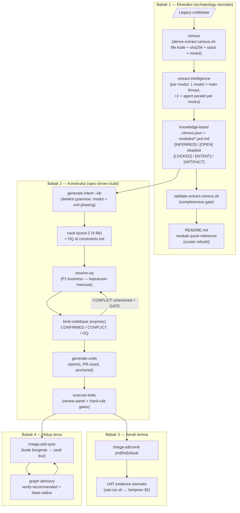
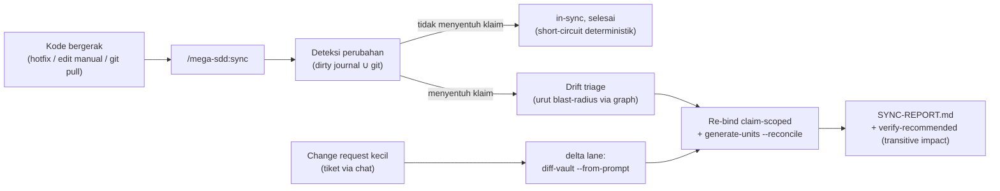

# Revamp Journey — dari aplikasi legacy sampai jadi baru (dan tetap hidup)

Panduan end-to-end untuk tim yang mau **revamp aplikasi legacy ke stack baru** memakai mega-sdd: mulai dari codebase lama yang tidak ada dokumentasinya, sampai aplikasi baru yang jalan, punya dokumen tim lengkap (PRD/FSD/SIT/UAT), dan tetap sinkron selama maintenance.

> **Bentuk vs walkthrough** — dokumen ini menjelaskan *alurnya dan kenapa tiap babak ada*. Untuk langkah copy-paste dengan expected output, pakai walkthrough-nya: [Scenario 4 — Legacy Rebuild](../../tests/scenarios/scenario-4-legacy-rebuild.md) (single-phase) dan [Scenario 10 — Phased Rebuild](../../tests/scenarios/scenario-10-phased-rebuild-walkthrough.md) (multi-phase).

## Peta besar

Empat babak. Tiga pertama mengubah legacy jadi aplikasi baru; babak keempat menjaga hasilnya tetap hidup — revamp tidak "selesai" di hari kode jadi.



| Babak | Verb yang dipakai | Output |
|---|---|---|
| 1 — Ekstraksi | `/mega-sdd <legacy-dir> --out=<path>` | `census.json` + PRD-kontrak per modul + `README.md` (urutan rebuild) |
| 2 — Konstruksi | (chain otomatis dari front door) | vault → binding → units → bolts (kode + commit atomik) |
| 3 — Serah terima | `/mega-sdd:emit <prd\|fsd\|sit\|uat>` | 4 dokumen tim + evidence pack UAT |
| 4 — Hidup terus | `/mega-sdd:sync`, delta lane | vault/binding/units tetap sinkron dengan kode |

## Prasyarat

- **mega-sdd v7.6+** (ekstraksi census→PRD-kontrak di babak 1) — surface publiknya **3 verb**: `/mega-sdd` (front door), `/mega-sdd:sync`, `/mega-sdd:emit` (`/mega-sdd:slice` dihapus di v7.4.0). Typed command lama (`/mega-sdd:auto`, `/mega-sdd:extract-intelligence`, `/mega-sdd:resolve-oq`, dst.) **sudah dihapus di v6.0.0** — frasa natural ("extract domain knowledge", "jawab OQ list") tetap route ke skill-nya.
- Legacy codebase yang bisa dibaca (idealnya 100+ file agar ekstraksinya bermakna).
- Direktori target rebuild yang **terpisah** dari legacy, sudah `git init` + scaffold framework tujuan (starterkit wajib; tanpa manifest framework harus opt-in `--greenfield`).
- Native deps opsional mempertajam hasil: `/mega-sdd:install-deps` (tree-sitter, ast-grep, dll.) — degradasi tetap jujur bila absen.

## Babak 1 — Ekstraksi: legacy jadi knowledge base

**Satu perintah** dari direktori target rebuild:

```
/mega-sdd ~/projects/legacy-app/ --out=./.mega-sdd/
```

Front door mendeteksi input = direktori berisi kode tanpa vault → mengusulkan chain yang dimulai dari `extract-intelligence`. `--out` **wajib** untuk lane ini (memisahkan output ekstraksi dari direktori rebuild — KB ditulis ke `<out>/knowledge-base/`). Satu konfirmasi upfront (Run / Edit / Cancel), lalu chain jalan sendiri.

Ekstraksi berjalan **census-contracted**, empat langkah deterministik:

1. **Census dulu** — `derive-extract-census.sh` menulis `census.json`: daftar file kode + sha256 + stack + entry point + usulan pembagian modul (logs/backups/data dikecualikan). Census inilah kontrak coverage — bukan tebakan model.
2. **Konfirmasi pembagian modul** — OQ module-split muncul HANYA bila census mengusulkan >1 modul.
3. **Ekstraksi per modul** — 1 modul = dikerjakan di main thread tanpa subagent; >1 modul = subagent `domain-extractor` paralel per modul (cap `--max-parallel` 5, hard cap 8). Tiap modul lewat quality gate sendiri, dan tiap batch berhenti di konfirmasi ber-keterangan (Lanjut / Review / Stop).
4. **Sintesis + gate kelengkapan** — main thread menulis roll-up `README.md` (termasuk module quick-reference berisi urutan rebuild yang disarankan) + `data-mutation-policy.md` bila ada klaim `[LOCKED]`, lalu `validate-extract-census.sh` menggagalkan hasil yang bolong: file tak ter-claim / double-claim / phantom / klaim tanpa sitasi / section hilang / OQ hilang / flow bukan Mermaid.

Hasilnya `knowledge-base/` yang tech-agnostic:

- **`modules/<domain>.prd.md`** — SATU PRD-kontrak per modul, 6 section: Purpose · Business Rules · Flow (Mermaid wajib; multi-step pakai blok `stages:`) · Data In/Out · Edge Cases & Gotchas · Open Questions. Sitasi inline `path:line` per klaim.
- **Marker kepercayaan** default-verified: klaim bersitasi TANPA marker = verified; hanya `[INFERRED]` (1 sumber lemah) dan `[OPEN]` (gap — butuh stakeholder) yang ditandai eksplisit. Tidak ada klaim tanpa sitasi ke file legacy.
- **Tier mutabilitas**: `[LOCKED]` (regulasi/kontrak — wajib dipertahankan), `[INTENT]` (outcome-nya yang penting, cara bebas), `[ARTIFACT]` (kecelakaan implementasi legacy — boleh dibuang).
- **`README.md` module quick-reference** — urutan rebuild yang disarankan per modul, input phasing untuk Babak 2.

Inilah jawaban untuk "aplikasi lama tidak ada dokumentasinya": arkeologi domain dikerjakan mesin, dengan disiplin sitasi, bukan ingatan senior developer. (KB lama bergaya numbered-tree `00-…99-*` dari ekstraksi sebelum v7.6 tetap terbaca di semua konsumen.)

## Babak 2 — Konstruksi: KB jadi aplikasi baru

### Vault per modul

Chain lanjut otomatis ke `generate-intent --kb=<out>/knowledge-base/` — flag `--kb` mendeteksi grammar KB-nya (ada `census.json` → lane PRD-kontrak; tidak ada → lane numbered-tree legacy). Untuk rebuild besar, **modul adalah unit phasing-nya**: ikuti urutan rebuild di module quick-reference `README.md`, kerjakan satu modul dulu, lalu modul berikutnya. (KB numbered-tree legacy tetap punya lane `--phase=N` mengikuti `suggested-phasing.md`-nya.)

Setiap tahap melahirkan vault sendiri di `.mega-sdd/vaults/<slug>/` dengan §Phase context (apa yang IN scope sekarang, apa yang menunggu). Item `[OPEN]` di KB naik jadi **Open Questions (OQ)** di vault — bukan ditebak.

### Keputusan manusia: resolve-oq

OQ business P1 (mis. "gotcha legacy ini dipertahankan atau diperbaiki?", "aturan regulasi ini masih berlaku?") **berhenti di manusia** — chain halt, `resolve-oq` memandu satu-satu dengan rekomendasi turunan KB + tier mutabilitas + fallback-if-wrong. Ini biasanya bagian paling lama yang butuh kehadiran stakeholder; sisanya idle. Lanjut dengan `/mega-sdd --resume`.

### Binding: gerbang anti-halusinasi

`bind-codebase` memverdiktkan tiap klaim vault terhadap kode target: **CONFIRMED / CONFLICT / OQ** dengan anchor. Di scaffold kosong mayoritas klaim `NEW` — tapi gerbangnya tetap sama: **CONFLICT yang belum resolved memblokir generate-units dan execute-bolts** (ditegakkan hook, bukan prosa). Spine **express** adalah default (tanpa fase scan terpisah; klaim di-retrieve terarah lewat symbol index); `--classic` tersedia bila ingin `codebase-map.md` penuh.

### Units → bolts

`generate-units` memecah bound-vault jadi unit atomik seukuran PR (task_type, anchors, dependency DAG, Hard rules dari framework pack — mis. aturan UUID PK atau SweetAlert2 dari pack Laravel). `execute-bolts` mengeksekusinya per wave paralel: tiap bolt = implementasi + acceptance test + commit atomik, dilewatkan **review panel** (spec/quality/security/standards, + design untuk unit UI) dan gerbang evidence pre/post-flight. Halt (`hard_rule_violated`, `quality_gate_failed`) muncul dengan blocker YAML + `next_action` — resolve, lalu `/mega-sdd --resume`.

### Sisi UI revamp

(`/mega-sdd:slice` dihapus di v7.4.0 — implementasi UI dari design reference sekarang jalan lewat pipeline biasa: unit UI + design lens di review panel; perubahan manual tetap tertangkap `/mega-sdd:sync`.)

## Babak 3 — Serah terima: dokumen tim + bukti

Kode jadi bukan akhir serah terima. Empat dokumen tim di-emit dari vault (bukan ditulis ulang manual — sitasi ber-sha256, sumber hilang jadi `[Pending — X]`, bukan karangan):

```
/mega-sdd:emit prd    # Product Requirements
/mega-sdd:emit fsd    # Functional Spec (Confluence-ready, md + PDF)
/mega-sdd:emit sit    # System Integration Test
/mega-sdd:emit uat    # UAT + berita acara + workbook
```

Khusus UAT ada **lane bukti otomatis**: `build-uat-e2e.sh` menurunkan skeleton Playwright per skenario UAT, `uat-run.sh` menjalankannya terhadap dev server (URL kamu yang tentukan — server tidak pernah dinyalakan otomatis) dan menulis evidence pack (`result.json` + screenshot + trace) yang **hook-guarded** — hasil eksekusi dirender jadi Lampiran §5 dokumen UAT oleh script, bukan diketik model, dan lampiran yang dipalsukan tertangkap gate `ANNEX_FORGED`. Status "executed" selalu punya bukti.

## Babak 4 — Hidup terus: sync sebagai mode harian

Setelah go-live, kode akan terus bergerak — hotfix, perubahan manual, PR tim lain. Lane-nya:



- **`/mega-sdd:sync`** mendeteksi apa yang berubah sejak terakhir, re-verdict hanya klaim yang terdampak, dan merekonsiliasi unit yang stale — proporsional, bukan sweep semua.
- **Graph advisory** (fail-open, tidak pernah memblokir): drift triage diproses **urut blast-radius terbesar dulu**, dan SYNC-REPORT membawa daftar **verify-recommended (transitive impact)** — unit downstream yang dependensinya berubah walau file-nya sendiri tidak (celah yang tak terlihat hash check).
- **Delta lane**: change request seukuran tiket cukup diketik ke front door (`/mega-sdd "ubah field X di form Y"`) — bila vault memiliki entitasnya, chain-nya `diff-vault --from-prompt` → re-bind claim-scoped → reconcile, tanpa regenerasi vault.
- Dokumen tim ikut hidup: `/mega-sdd:emit <doc>` kapan pun untuk refresh dari vault terbaru (versi dokumen di-track; `--bump`/`--approve` tetap keputusan manusia).

## Rel anti-fabrikasi sepanjang jalan

| Babak | Rel yang menjaga |
|---|---|
| Ekstraksi | Sitasi inline wajib per klaim; `[INFERRED]/[OPEN]` eksplisit (tanpa marker = verified); quality gate per modul + completeness gate census |
| Vault | Gap = OQ, bukan tebakan; OQ business = keputusan manusia, tidak pernah di-auto |
| Binding | Verdict per klaim dengan anchor; **CONFLICT gate memblokir downstream (hook-enforced)** |
| Bolts | Hard-rule pre/post-flight; acceptance evidence; review panel blind-lens |
| Emisi | Sitasi sha256; sumber absen → `[Pending — X]`; UAT executed hanya dari evidence pack |
| Sync | Verdict di-recompute dari ground truth; graph hanya advisory, tidak pernah menulis status |

## Pitfalls umum

- **Ekstraksi halt di quality gate** (`quality_gate_failed` subtype `module_quality_threshold_unmet` — gate satu modul gagal dua kali) → menu ber-keterangan: Re-scope module / Re-prompt / Abort. KB parsial tetap tersimpan; tidak ada auto-resume. Jangan terima gap diam-diam.
- **OQ terasa kebanyakan** → itu fitur: P1 business memang harus ke stakeholder; P2 tech kebanyakan terselesaikan otomatis saat bind; P3 bisa ditunda. Lihat [Scenario 4 §pitfalls](../../tests/scenarios/scenario-4-legacy-rebuild.md#common-pitfalls).
- **Bolt halt `hard_rule_violated`** → biasanya unit mencoba mereplikasi gotcha legacy yang sudah diputuskan dibuang — gate-nya benar; periksa keputusan OQ terkait.
- **Halt apa pun yang membingungkan** → [Scenario 6 — Recovery from halt](../../tests/scenarios/scenario-6-recovery-from-halt.md).
- **Sesudah go-live kode "lari" dari vault** → itu bukan kegagalan, itu Babak 4: jalankan `/mega-sdd:sync` ([Scenario 12](../../tests/scenarios/scenario-12-continuous-sync.md)).

## Referensi cepat

| Kebutuhan | Perintah |
|---|---|
| Mulai revamp dari legacy | `/mega-sdd <legacy-dir> --out=<path>` |
| Status posisi + usulan langkah berikut | `/mega-sdd` |
| Lanjut setelah halt / review | `/mega-sdd --resume` |
| Modul berikutnya (rebuild besar) | `generate-intent --kb=<kb>` — ikuti urutan module quick-reference di `README.md` (KB numbered-tree legacy: `--phase=N`) |
| Dokumen tim | `/mega-sdd:emit <prd\|fsd\|sit\|uat>` |
| Kode berubah setelah "jadi" | `/mega-sdd:sync` |
| Blast radius sebuah perubahan | tanya "apa yang kena kalau ubah X" (graph lens) |
| Rawat deps / layout | `/mega-sdd:install-deps`, `/mega-sdd:migrate-paths` |

Arsitektur plugin & moat: [architecture.md](architecture.md) · Kontrak kontributor: [`plugins/mega-sdd/CLAUDE.md`](../../plugins/mega-sdd/CLAUDE.md).
