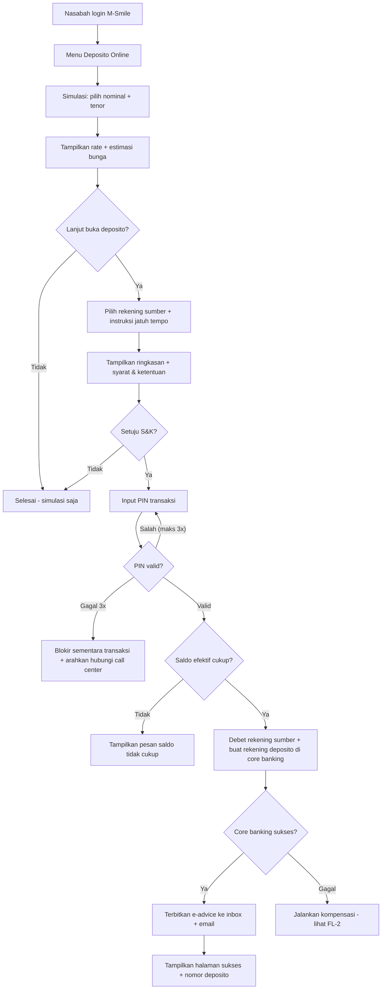
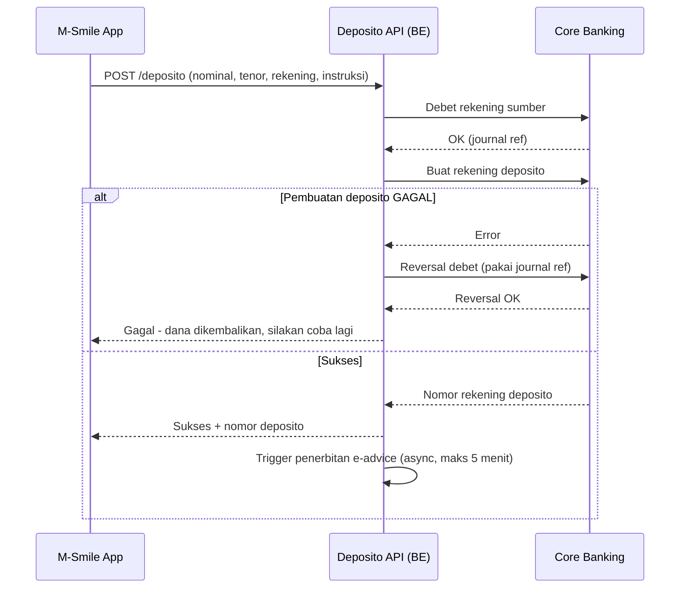
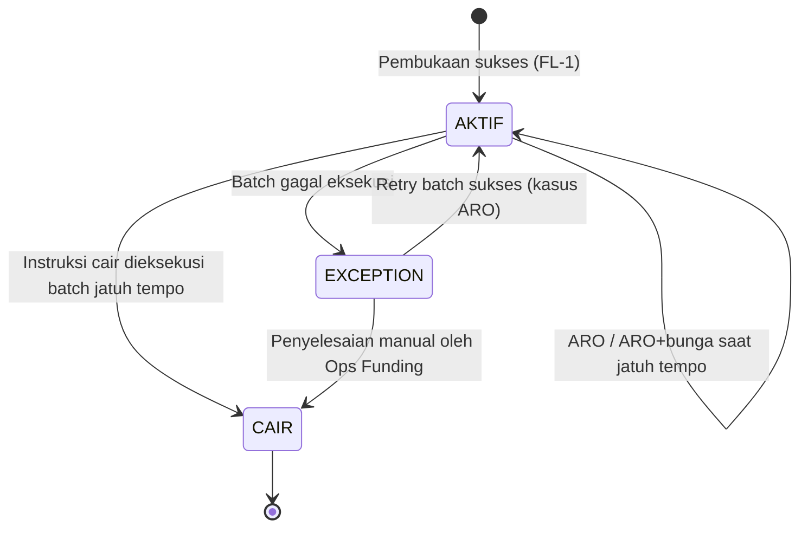

# PRD — Pembukaan Deposito Berjangka Online via M-Smile

> ⚠️ **Dokumen contoh (dummy).** Ini contoh pengisian template PRD untuk referensi internal — nama produk, angka, dan aturan di dalamnya ilustratif, bukan produk riil yang disetujui.

## §1. Ringkasan Eksekutif

Fitur ini memungkinkan nasabah existing Bank Mega membuka deposito berjangka langsung dari aplikasi M-Smile tanpa datang ke cabang — mulai dari simulasi bunga, pemilihan tenor, pendebetan dana dari rekening tabungan, sampai penerbitan bilyet elektronik (e-advice). Tujuannya menaikkan volume dana pihak ketiga (DPK) dari kanal digital dan mengurangi beban layanan cabang untuk transaksi pembukaan deposito bernilai kecil–menengah.

| Item | Nilai |
|---|---|
| Nama fitur | Deposito Online |
| Kanal | M-Smile (mobile) |
| Implementation mode | `existing` — extend M-Smile & integrasi ke core banking berjalan |
| Target rilis | Q4 2026 |

## §2. Latar Belakang & Masalah

Saat ini pembukaan deposito hanya bisa dilakukan di cabang. Nasabah muda yang sudah aktif di M-Smile harus tetap datang ke cabang untuk produk simpanan berjangka, sehingga sebagian memilih kompetitor yang sudah punya deposito online. Dari sisi internal, pembukaan deposito nominal kecil (< Rp100 juta) memakan waktu layanan CS yang tidak sebanding dengan nilainya. Fitur ini memindahkan segmen tersebut ke kanal digital.

## §3. Target Users / Personas

| Persona | Deskripsi | Kebutuhan utama |
|---|---|---|
| Nasabah retail existing | Punya rekening tabungan aktif + akses M-Smile, dana idle Rp8–500 juta | Buka deposito cepat, bunga jelas, tanpa ke cabang |
| Ops Funding (back office) | Memantau pembukaan/pencairan deposito harian | Laporan harian, jejak audit per transaksi |
| CS cabang | Menerima pertanyaan nasabah terkait deposito online | Bisa melihat status penempatan nasabah di sistem internal |

## §4. Goals & Success Metrics

| # | Goal | Metric | Target | Cara ukur |
|---|---|---|---|---|
| G1 | Menambah DPK dari kanal digital | Total penempatan deposito via M-Smile | Rp200 M dalam 6 bulan pertama | Laporan core banking, filter kanal |
| G2 | Adopsi fitur | Jumlah rekening deposito online dibuka | 5.000 rekening dalam 6 bulan | Dashboard produk |
| G3 | Mengurangi beban cabang | % pembukaan deposito < Rp100 jt yang pindah ke digital | 30% | Perbandingan volume cabang vs digital |

## §5. Scope — Fitur In-Scope (v1)

### F1 — Simulasi Deposito

- **Deskripsi:** Nasabah memilih nominal + tenor (1/3/6/12 bulan), sistem menampilkan suku bunga berlaku, estimasi bunga, dan proyeksi nilai saat jatuh tempo (sebelum pajak dan sesudah pajak bunga 20%).
- **Aktor:** Nasabah retail.
- **Precondition:** Login M-Smile berhasil.
- **Acceptance criteria:**
  - [ ] Suku bunga diambil real-time dari rate service, bukan hard-coded di aplikasi.
  - [ ] Estimasi bunga menampilkan nilai bruto dan neto (setelah pajak 20%).
  - [ ] Simulasi bisa dilakukan tanpa komitmen (tidak membuat transaksi apa pun).

### F2 — Pembukaan Deposito

- **Deskripsi:** Nasabah mengonfirmasi penempatan; dana didebet dari rekening tabungan sumber, rekening deposito dibuat di core banking, e-advice diterbitkan ke inbox M-Smile dan email terdaftar.
- **Aktor:** Nasabah retail.
- **Precondition:** Saldo efektif rekening sumber ≥ nominal penempatan + saldo minimum rekening; nominal dalam rentang Rp8 juta – Rp500 juta (lihat OQ-2 untuk batas atas).
- **Acceptance criteria:**
  - [ ] Transaksi memerlukan otentikasi ulang (PIN transaksi M-Smile) sebelum eksekusi.
  - [ ] Debet tabungan dan pembuatan rekening deposito bersifat atomik — tidak boleh ada dana terdebet tanpa deposito terbentuk (lihat FL-2 kompensasi).
  - [ ] E-advice terbit maksimal 5 menit setelah transaksi sukses.
  - [ ] Nasabah memilih instruksi jatuh tempo saat pembukaan: ARO (perpanjang pokok), ARO+bunga, atau cair ke rekening sumber.

### F3 — Daftar & Detail Deposito

- **Deskripsi:** Nasabah melihat daftar deposito aktif miliknya (online maupun yang dibuka di cabang), detail per deposito (nominal, tenor, bunga, tanggal jatuh tempo, instruksi jatuh tempo), dan mengunduh ulang e-advice.
- **Aktor:** Nasabah retail.
- **Acceptance criteria:**
  - [ ] Deposito yang dibuka di cabang ikut tampil (sumber data sama: core banking).
  - [ ] Instruksi jatuh tempo bisa diubah selama ≥ 1 hari kerja sebelum tanggal jatuh tempo.

### F4 — Pencairan saat Jatuh Tempo

- **Deskripsi:** Pada tanggal jatuh tempo, sistem mengeksekusi instruksi nasabah (ARO / ARO+bunga / cair) secara otomatis via proses batch harian.
- **Aktor:** Sistem (batch); Ops Funding sebagai pemantau.
- **Acceptance criteria:**
  - [ ] Pencairan masuk ke rekening sumber pada hari jatuh tempo sebelum pukul 12.00 WIB.
  - [ ] Kegagalan eksekusi batch masuk ke daftar exception yang dipantau Ops Funding (lihat FL-3).

## §6. User Flows

### FL-1 — Pembukaan Deposito (happy path + error path)

**Definition of Done:** rekening deposito terbentuk di core banking, dana terdebet sesuai nominal, e-advice terkirim, dan deposito tampil di daftar (F3) — atau transaksi gagal bersih tanpa dana nasabah tertahan.

### FL-2 — Kompensasi Kegagalan (sequence, BE)

### FL-3 — Siklus Hidup Deposito (state)

## §7. Data & Entitas

| Entitas | Field kunci | Relasi | Catatan |
|---|---|---|---|
| RekeningDeposito | nomor_deposito, cif, nominal, tenor, rate, tanggal_buka, tanggal_jatuh_tempo, instruksi_jatuh_tempo, status, kanal | N..1 ke Nasabah (CIF); 1..1 ke RekeningSumber | System of record di core banking; M-Smile hanya membaca/menginstruksikan |
| InstruksiJatuhTempo | jenis (ARO / ARO_BUNGA / CAIR), rekening_tujuan | 1..1 ke RekeningDeposito | Bisa diubah sampai H-1 hari kerja jatuh tempo |
| EAdvice | id, nomor_deposito, url_dokumen, tanggal_terbit | N..1 ke RekeningDeposito | Terbit saat pembukaan dan saat perpanjangan ARO |
| RateDeposito | tenor, nominal_min, nominal_maks, rate, berlaku_dari | — | Dikelola unit Funding; sumber tunggal rate untuk simulasi & pembukaan |

## §8. Arsitektur & Integrasi

| Sistem / Service | Peran | Integrasi | Protokol |
|---|---|---|---|
| M-Smile (mobile) | Kanal nasabah | Konsumsi Deposito API | REST/JSON via API gateway existing |
| Deposito API (baru) | Orkestrasi pembukaan/pencairan, validasi, kompensasi | Inbound dari M-Smile; outbound ke core banking & notifikasi | REST internal |
| Core banking | System of record rekening & jurnal | Debet, buat/tutup deposito, reversal | TBD — konfirmasi arsitek (lihat OQ-4) |
| Notification service (existing) | Kirim e-advice ke inbox & email | Outbound dari Deposito API | Existing internal contract |

### §BE. Kebutuhan Backend

1. **Deposito API** — endpoint: simulasi (kalkulasi rate + pajak), pembukaan (dengan idempotency key per percobaan transaksi), daftar/detail, ubah instruksi jatuh tempo.
2. **Batch jatuh tempo** — job harian mengeksekusi instruksi (ARO/cair), menulis exception list untuk Ops Funding.
3. **Audit trail** — setiap transaksi menyimpan jejak: siapa, kapan, dari device apa, hasil otentikasi.

### §FE. Kebutuhan Frontend (M-Smile)

1. Layar: entry menu, simulasi, pilih rekening & instruksi, ringkasan + S&K, input PIN, halaman sukses/gagal, daftar deposito, detail deposito.
2. Validasi sisi klien: rentang nominal, tenor tersedia; angka rate dan estimasi SELALU dari API, tidak dihitung ulang di klien.
3. Desain UI mengikuti design system M-Smile existing. Link Figma: `TBD — confirm with PO` (lihat OQ-5).

## §9. Non-Functional Requirements

| Kategori | Requirement | Target |
|---|---|---|
| Performance | Response time API simulasi & pembukaan (p95) | ≤ 3 detik |
| Availability | Jam layanan pembukaan deposito online | 24/7, kecuali window maintenance core banking (transaksi di luar jam core banking → antre/tolak, lihat OQ-3) |
| Security | Otentikasi ulang PIN transaksi; komunikasi TLS; data nasabah tidak disimpan di device | Standar keamanan aplikasi internal |
| Auditability | Semua transaksi finansial punya jejak audit yang bisa ditelusuri per journal ref | 100% transaksi |

## §10. Constraints

- **Teknis:** Core banking existing tidak boleh dimodifikasi selain penambahan konsumsi service yang sudah tersedia; M-Smile menggunakan API gateway dan notification service yang sudah berjalan.
- **Bisnis:** Target rilis Q4 2026 mengikuti kalender program kerja digital banking; rate deposito online mengikuti rate counter yang dikelola unit Funding (tidak ada rate khusus di v1).
- **Regulasi & compliance:** Produk deposito tunduk pada ketentuan penjaminan LPS (informasi tingkat bunga penjaminan wajib tampil di S&K); pajak bunga deposito 20% wajib diperhitungkan pada estimasi; perlindungan data pribadi nasabah mengikuti UU PDP. Nomor POJK/SEOJK spesifik yang berlaku: `TBD — confirm with Compliance` (lihat OQ-1).

## §11. Keputusan yang Sudah Diambil (Decisions)

| ID | Keputusan | Konteks | Konsekuensi |
|---|---|---|---|
| D1 | Hanya nasabah existing dengan rekening tabungan aktif yang bisa membuka deposito online | Menghindari kebutuhan e-KYC penuh di v1 | Akuisisi nasabah baru tetap via cabang; scope v1 lebih kecil |
| D2 | Pencairan sebelum jatuh tempo (break deposito) TIDAK tersedia di kanal digital pada v1 | Kebijakan penalti break bervariasi dan butuh persetujuan berjenjang | Nasabah yang ingin break tetap ke cabang; jadi kandidat v2 |
| D3 | Sumber rate tunggal dari RateDeposito service | Mencegah beda angka antara simulasi dan eksekusi | FE dilarang menghitung/menyimpan rate sendiri |

## §12. Out of Scope (v1)

- Pembukaan deposito oleh calon nasabah baru (non-nasabah) — butuh e-KYC, kandidat fase berikutnya.
- Pencairan sebelum jatuh tempo (break deposito) via digital (per D2).
- Deposito valas — v1 hanya IDR.
- Deposito untuk nasabah korporat/bisnis.
- Perubahan nominal atau tenor setelah deposito terbentuk.

## §13. Open Questions

| ID | Pertanyaan | Category | Priority | Owner | Status |
|---|---|---|---|---|---|
| OQ-1 | Daftar POJK/SEOJK dan ketentuan internal mana saja yang wajib dirujuk di S&K deposito online? | business | P1 | Compliance | OPEN |
| OQ-2 | Batas atas penempatan via digital Rp500 juta — final, atau mengikuti limit transaksi harian M-Smile existing? | business | P1 | Product Owner + Funding | OPEN |
| OQ-3 | Transaksi pembukaan di luar jam operasional core banking: ditolak, atau diantrekan dan dieksekusi hari kerja berikutnya (rate ikut tanggal mana)? | business | P1 | Product Owner + IT | OPEN |
| OQ-4 | Protokol integrasi ke core banking untuk debet + pembuatan deposito: service existing apa yang tersedia (REST adapter / MQ / ISO8583)? | tech | P2 | IT Architect | OPEN |
| OQ-5 | Link Figma final untuk layar deposito online belum tersedia — kapan design handoff? | business | P2 | Product Owner + UI/UX | OPEN |
| OQ-6 | Apakah e-advice perlu tanda tangan elektronik tersertifikasi, atau cukup dokumen PDF ber-stempel digital internal? | business | P2 | Legal + Compliance | OPEN |

## §14. Glossary

| Istilah | Definisi |
|---|---|
| ARO | Automatic Roll Over — perpanjangan otomatis deposito saat jatuh tempo (pokok saja; ARO+bunga = pokok+bunga) |
| E-advice | Bilyet/konfirmasi penempatan deposito dalam bentuk dokumen elektronik |
| DPK | Dana Pihak Ketiga |
| CIF | Customer Information File — identitas tunggal nasabah di core banking |
| Saldo efektif | Saldo yang bisa ditransaksikan (setelah dikurangi hold dan saldo minimum) |

---

## Changelog

| Versi | Tanggal | Penulis | Perubahan |
|---|---|---|---|
| 1.0 | 2026-07-20 | Tim Product Digital Banking | Versi contoh untuk referensi template |
