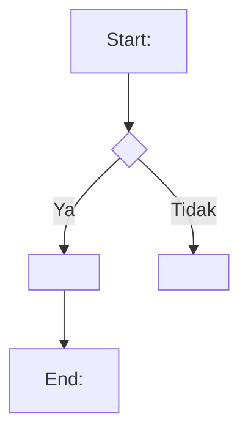

# PRD — <Nama Produk / Fitur>

> **Cara pakai template ini (hapus blok ini sebelum publish):**
> 1. **Eksplisit > implisit.** Downstream (dev team / AI pipeline `/mega-sdd` → generate-intent) hanya boleh mengimplementasikan apa yang TERTULIS. Yang tidak tertulis akan jadi Open Question, bukan ditebak.
> 2. **Jangan kosongkan section.** Kalau belum tahu, tulis `TBD — confirm with <owner>` atau pindahkan ke §13 Open Questions. Section kosong = ambigu.
> 3. **Semua flow WAJIB Mermaid** (flowchart / sequenceDiagram / stateDiagram) — bukan prosa panjang atau ASCII art. Sertakan happy path DAN error path.
> 4. **Out of Scope (§12) wajib diisi eksplisit** — minimal `TBD — confirm with PO`, tidak boleh kosong.
> 5. Penomoran section `§N` jangan diubah — dipakai sebagai anchor sitasi oleh pipeline dan reviewer.

---

## §1. Ringkasan Eksekutif

<2–4 kalimat: produk/fitur apa, untuk siapa, nilai bisnisnya apa, target rilis kapan.>

| Item | Nilai |
|---|---|
| Nama fitur | <nama> |
| Kanal | <M-Smile / Internet Banking / Internal Ops / dst.> |
| Implementation mode | `new` (greenfield) \| `existing` (extend sistem berjalan) |
| Target rilis | <QN YYYY / TBD> |

## §2. Latar Belakang & Masalah

<Masalah bisnis yang mau diselesaikan. Data pendukung kalau ada (volume transaksi, komplain, temuan audit). Kenapa sekarang?>

## §3. Target Users / Personas

| Persona | Deskripsi | Kebutuhan utama |
|---|---|---|
| <Nasabah retail> | <1 baris> | <1 baris> |
| <Ops / back office> | <1 baris> | <1 baris> |

## §4. Goals & Success Metrics

| # | Goal | Metric | Target | Cara ukur |
|---|---|---|---|---|
| G1 | <goal bisnis> | <KPI> | <angka> | <sumber data> |
| G2 | ... | ... | ... | ... |

## §5. Scope — Fitur In-Scope (v1)

> Satu sub-section per fitur. Acceptance criteria harus bisa diverifikasi (testable), bukan aspirasi.

### F1 — <Nama fitur>

- **Deskripsi:** <apa yang dilakukan fitur ini>
- **Aktor:** <siapa yang memakai>
- **Precondition:** <syarat sebelum fitur bisa dipakai>
- **Acceptance criteria:**
  - [ ] <kriteria terukur 1>
  - [ ] <kriteria terukur 2>

### F2 — <Nama fitur>

...

## §6. User Flows

> WAJIB Mermaid. Minimal happy path + error/rejection path per flow utama. Beri ID flow (FL-1, FL-2, …) supaya bisa dirujuk dari §5 dan Open Questions.

### FL-1 — <Nama flow>

**Definition of Done flow ini:** <kondisi terukur kapan flow dianggap selesai/berhasil>

## §7. Data & Entitas

> Entitas utama + field kunci + relasi. Cukup level bisnis; detail kolom DB boleh menyusul di FSD. Format tabel atau DBML.

| Entitas | Field kunci | Relasi | Catatan |
|---|---|---|---|
| <Entitas A> | <field, field> | <1..N ke Entitas B> | <aturan bisnis penting> |

## §8. Arsitektur & Integrasi

> Sistem yang disentuh, API/kontrak antar sistem, arah data. Kalau PRD multi-scope, pecah jadi §BE / §FE / §MW di bawah section ini.

| Sistem / Service | Peran | Integrasi | Protokol |
|---|---|---|---|
| <Core banking> | <system of record> | <inbound/outbound> | <REST / ISO8583 / MQ / TBD> |

### §BE. Kebutuhan Backend *(hanya untuk PRD multi-scope)*

<endpoint, service, job/scheduler yang dibutuhkan>

### §FE. Kebutuhan Frontend *(hanya untuk PRD multi-scope)*

<layar, komponen, validasi sisi klien; rujuk link Figma bila ada>

## §9. Non-Functional Requirements

| Kategori | Requirement | Target |
|---|---|---|
| Performance | <mis. response time p95> | <angka / TBD> |
| Availability | <jam layanan, SLA> | <angka / TBD> |
| Security | <authn/authz, enkripsi, audit trail> | <standar internal> |

## §10. Constraints

- **Teknis:** <stack wajib, sistem legacy yang tidak boleh diubah, batasan infra>
- **Bisnis:** <timeline, budget, ketergantungan unit lain>
- **Regulasi & compliance:** <POJK/SEOJK terkait, ketentuan BI, UU PDP, kebijakan internal — sebutkan nomor aturannya bila tahu; kalau belum, jadikan Open Question>

## §11. Keputusan yang Sudah Diambil (Decisions)

> Keputusan final yang TIDAK perlu didiskusikan ulang oleh tim dev. Format ringkas ADR: konteks → keputusan → konsekuensi.

| ID | Keputusan | Konteks | Konsekuensi |
|---|---|---|---|
| D1 | <keputusan> | <kenapa> | <dampak/trade-off> |

## §12. Out of Scope (v1) — WAJIB diisi

- <hal yang secara sadar TIDAK dikerjakan di v1>
- <atau tulis: `TBD — confirm with PO`>

## §13. Open Questions

> Semua yang belum diputuskan / masih ambigu / kontradiktif, ditulis jujur di sini — JANGAN ditebak di body. `category`: `business` (butuh keputusan stakeholder) atau `tech` (bisa dijawab dari codebase/arsitek).

| ID | Pertanyaan | Category | Priority | Owner | Status |
|---|---|---|---|---|---|
| OQ-1 | <pertanyaan> | business \| tech | P1 \| P2 \| P3 | <nama/role> | OPEN |

## §14. Glossary

| Istilah | Definisi |
|---|---|
| <istilah> | <definisi> |

---

## Changelog

| Versi | Tanggal | Penulis | Perubahan |
|---|---|---|---|
| 0.1 | YYYY-MM-DD | <nama> | Draft awal |
