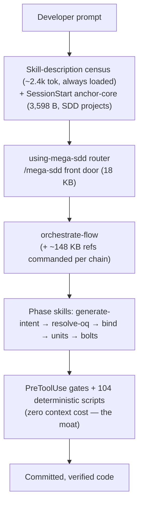

# Mega-SDD Skills Audit — DX, Velocity, Token & Context Efficiency

**Date:** 2026-08-10 · **Plugin version audited:** 6.1.1 (HEAD `91a944a`) · **Method:** 14-agent read-only fan-out (9 skill-cluster auditors over all 20 skills + every reference, 1 infra/context-injection auditor, 1 duplication-matrix agent, 1 prior-decision counter-auditor, 2 workflow simulators covering 5 scenarios), synthesized against the repo's own doctrine (`plugins/mega-sdd/CLAUDE.md`) and decision record. **No repository file was modified.** All token figures are estimates at ~4 bytes/token unless marked measured.

---

## 1. Executive Summary

**The verdict in one paragraph:** mega-sdd's *enforcement architecture* is genuinely excellent — 104 deterministic scripts (2.1 MB of logic, zero orphans) run at **zero context cost**, hooks inject almost nothing (only SessionStart injects meaningfully, and it is source-aware: ~930 tok on startup, ~330 on compact, 0 on resume), and the moat (verdict grammar, CONFLICT gate, recompute-at-gate, evidence artifacts, blind panel) is exactly-specified where it must be. **The accidental cost lives almost entirely in the prose layer**: "load on demand" reference files that the procedures actually command unconditionally (~148 KB per chain in orchestrate-flow alone), the same rule taught in 2–6 places (with **11 fresh confirmed contradictions** between copies), adversarial-round audit trail and version archaeology shipped as runtime prose (violating the plugin's own authoring standard), and 500-line caps satisfied by 2,000–3,400-character single lines that no human can diff-review — which is precisely *how* the contradictions survive review.

| Metric | Score | Basis |
|---|---|---|
| **Current System Score** | **67/100** unweighted · **~60** usage-weighted | mean of 20 per-skill composites; pipeline-core skills (used most) score lowest |
| Developer Experience | 65/100 | mean DX 6.55/10 — model-facing DX good, human-facing DX poor |
| Development Velocity | 73/100 | mean velocity +1.55 (−3..+3); only 1 negative (generate-intent) |
| Token Efficiency | 60/100 | infra plane ~9/10, prose plane ~4/10 |
| Maintainability | 57/100 | scripts excellent; multi-home prose with 11 live contradictions |

| Headline quantity | Value (est.) |
|---|---|
| Total plugin markdown | 2.88 MB (~720k tok equivalent — never all loaded; what matters is per-path load) |
| **Instruction load, full deep chain (S1/S3, measured file-by-file)** | **~930 KB ≈ ~230k tokens — more than one 200k context window before any project content**; mid-chain compaction is structurally inevitable |
| Recoverable per full chain, zero moat impact | **~60–90k tokens (~30–40% of instruction load)** |
| Direct cross-file duplication (grep-measured) | ~6.9k tokens, concentrated in 4 places |
| Always-loaded per session | descriptions ~2.4k tok (compliant, **essential** — it IS the router), anchor-core 3,598 B (**2 bytes under its 3,600 CI cap**) |
| Broadest hidden tax | 834 B injected into **every session of every non-mega-sdd project** (~210 tok/session) + 1 python3 spawn per prompt in all projects |
| Live cross-file contradictions confirmed | **11** (list in §11.2) |

**Biggest architectural problem:** false progressive disclosure — the architecture *has* the three-tier design (description → SKILL router → on-demand refs) and the doctrine mandates it, but in 6 of the 8 heaviest skills the Procedure text unconditionally commands the refs, so the tiers collapse into "load everything" on the main path.
**Biggest DX problem:** human-unreviewable mega-lines (max measured: 3,354 chars in one line, `scan-codebase/SKILL.md:54`) + multi-home rules — two developers reading the same skill demonstrably fork at 11 confirmed points.
**Biggest velocity bottleneck:** the entry lane for incremental change — a chat-level requirement ("add column X") cannot use the cheap diff-vault lane and re-pays full vault generation + full bind (~230k tok) for a 3-field delta.
**Biggest context bottleneck:** the orchestration layer (~180 KB per chain regardless of scenario) + generate-intent's main path (~45k tok commanded before the PRD itself is read).

The fix is **convergence, not invention**: the plugin already contains its own exemplars — `graph` (90/100), `analyze` (85), `using-mega-sdd` (85), `phase-advisor`, `domain-extractor`, `migrate-paths`, `commands/emit.md`, `commands/sync.md` all demonstrate the target pattern (thin router + deterministic script + genuinely conditional refs + labeled single-owner mirrors).

---

## 2. Repository / Skill Inventory

20 skills · 9 agents · 7 commands (exactly the 3-verbs + 4-one-timers contract) · 20 shared references + framework packs · 10 hooks · 104 scripts + 15 `_lib` helpers · 2 test trees.

| Skill | SKILL.md (lines / bytes) | Refs (files / bytes) | Main-path load (est. tok) |
|---|---|---|---|
| execute-bolts | 192 / 45,404 | 17 / 309,275 | ~22k (single unit) → ~32k (--all) |
| generate-intent | 186 / 24,896 | 23 / 208,623 | **~45k commanded unconditionally** |
| orchestrate-flow | 182 / 22,608 | 13 / 176,395 | **~29k (6 refs commanded)** |
| scan-codebase | 105 / 22,398 | 10 / 168,065 | ~32k (cache-hit) — demoted skill |
| generate-units | 163 / 26,295 | 12 / 137,105 | **~33k (9 of 12 refs commanded)** |
| bind-codebase | 157 / 26,732 | 12 / 93,969 | ~24k (~18–19k of it moat-essential) |
| resolve-oq | 92 / 18,363 | 4 / 89,200 | ~21k (50 KB walk ref commanded) |
| extract-intelligence | 334 / 34,938 | 3 / 62,472 | ~24k + repo-scaled Wave-5 reads |
| memory | 210 / 12,309 | 4 / 46,319 | ~3.1k (genuinely on-demand refs) |
| install-deps | 327 / 23,993 | 2 / 14,857 | ~11.8k |
| detect-drift | 106 / 16,831 | 3 / 24,365 | ~7.1k (context: fork pilot) |
| emit-fsd | 198 / 16,235 | 2 / 23,657 | ~4.1k (refs script-consumed) |
| diff-vault | 98 / 14,723 | 3 / 23,674 | ~7.6k |
| emit-uat | 166 / 13,923 | 2 / 14,949 | ~7.2k |
| emit-sit | 157 / 11,636 | 2 / 11,725 | ~5.8k |
| emit-agents-md | 179 / 11,176 | 1 / 12,354 | ~5.9k (only lane with no builder script) |
| emit-prd | 134 / 11,505 | 2 / 11,808 | ~2.9k |
| using-mega-sdd | 89 / 8,299 | 0 | ~1.1k/session (anchor-core inject) |
| analyze | 131 / 8,065 | 0 | ~2.0k |
| graph | 50 / 2,476 | 1 / 3,077 | ~0.6k |

Supporting: `references/` 217 KB (halt-protocol.md 44.7 KB largest) + framework-conventions/ 504 KB + design-intelligence/ 176 KB (sync-time distillate — runtime never reads the raw CSVs; exemplary). `scripts/build-dispatch-prompt.sh` is 194 KB — 12.5% of the whole scripts payload in one bash file. `AUDIT.md` (64.5 KB) ships inside the plugin dir; its own status lines are stale (says Round 3 "NOT yet fixed" — CHANGELOG shows all 14 fixed in v4.39.0) and it predates ~100 releases.

---

## 3. Architecture Analysis

The pipeline model:



**What is right (and must not be touched):**
- **Gates > rules > hooks is realized.** PostToolUse/Stop/SubagentStop are `async` (stdout can never reach the model); pre-tool-use emits only a deny JSON on block and has a pure-bash fast negative path; 194 KB of hook code costs ~0 context. The moat's cost is execution time, not tokens — and it is the product.
- **Scripts own determinism.** 104 scripts, effectively zero orphans (full cross-reference traced every one to a consumer). 2.1 MB of logic that never enters the window.
- **Fresh-context dispatch design** (build-dispatch-prompt.sh, ≤700 B pointer re-dispatch, findings-only lens returns, l0-results.json file channel — all v6.1.0) is state-of-the-art token architecture.
- **The description census** (~9.7 KB total) is the routing mechanism, fully compliant (all ≤1024 chars, zero archaeology, ID/EN keyword parity), and was explicitly traded against `when_to_use`/`disable-model-invocation` on the record.

**What is wrong:**
1. **False progressive disclosure** (the dominant finding — details §12).
2. **Multi-home normative rules** — the same grammar taught in 2–6 files; 11 confirmed live contradictions between copies (§11.2). The repo's own 6.1.1 round proved this class ships field defects ("the template still stamped the poison"); this audit found the class is systemic, not spot-level.
3. **Runtime prose carries its own audit trail** — `context-enrichment.md` (96 KB) is ~40–50% dated WITHDRAWN/struck/round-3-4 narrative; ~50 version-archaeology sites repo-wide; rationale essays addressed to hypothetical reviewers ride hot paths. The plugin's own standard (`CLAUDE.md:47`) forbids exactly this.
4. **Letter-vs-spirit of the 500-line cap** — measured single lines of 3,354 / 2,422 / 2,037 / 1,997 chars. Zero token cost, severe human cost: undiffable lines are where the duplicate step "5." and the max-cycles contradiction survived review.
5. **Deterministic logic as prose** — `predictive-checks.md` (20 KB of bash commands + expected exit codes the model hand-executes), install-deps' probe ladder stated 4×, os-detection.md's 120-line canonical bash transcribed by hand. The doctrine's own line: "Deterministic logic belongs in scripts/."

---

## 4. Developer Experience Audit

Two user classes diverge sharply:

**Claude-as-user: good to excellent.** Deterministic scripts own every mechanical decision, exit-code→halt maps are explicit, halt YAMLs are closed enums, keterangan contracts are exact. Two *model runs* converge almost everywhere.

**Human-as-user: poor in the core pipeline.** The run-on density means a maintainer cannot skim, diff, or review the highest-stakes bodies. Concrete two-developers-fork points (each verified with file:line evidence, full list §11.2): which lane is default on a standalone bind (`--express` per express-bind.md:3 vs classic per SKILL.md:47); how many convergence cycles run (5 vs 3); whether a staging drop halts or advises (template says halt, both teachers say advisory); which flow a detect-drift write-back follows (the commanded ref still teaches the *removed* interactive ACCEPT flow); which config path memory reads (two paths, one file contradicting itself); duplicate pre-flight step "5." in execute-bolts.

Per-skill DX scores (1–10): graph 9, phase-advisor 9 (agent), migrate-paths 9 (command), using-mega-sdd 8, analyze 8, emit-prd/fsd/sit 8, panel agents 8, domain-extractor 8, update-plugin 8, sync.md 8, emit-uat 7, diff-vault 7, bind-codebase 6, resolve-oq 6, generate-units 6, detect-drift 6, memory 6, emit-agents-md 6, execute-bolts 5, generate-intent 5, extract-intelligence 5, install-deps 5, mega-sdd.md 5, scan-codebase 4, orchestrate-flow 4.

The pattern is unambiguous: **DX correlates inversely with prose volume, not with capability.** The most capable artifacts with the *least* prose (graph, analyze, the agents) score highest.

---

## 5. Development Velocity Audit

Ground truth first (the repo's own P5 measurement, published in README): express spine reaches the first accepted bolt at **−7% net time / −34% context-weighted tokens** vs classic; the floor is ~1¾ hours with all gates live; the panel caught a real Critical (fail-open DTI check) during the measured run. The verification pays rent.

Velocity impact (−3..+3): **+2** — bind-codebase, graph, analyze, using-mega-sdd, extract-intelligence, detect-drift, emit-prd/fsd/sit/uat, panel agents, domain-extractor, phase-advisor. **+1** — execute-bolts, resolve-oq, generate-units, scan-codebase, orchestrate-flow, diff-vault, emit-agents-md, memory, install-deps, update-plugin, migrate-paths. **−1** — generate-intent (the only negative: ~45k tok of commanded instruction before the PRD is read, plus rules replicated across 2–5 homes; the capability is valuable — the delivery drags it below neutral).

**Time-to-first-action:** good. 3 public verbs + NL phrase census + the anchor's front-door rule means a developer finds the right verb in one hop. The cost problem is *after* routing fires.

**Rework drivers found:** (a) the 11 contradictions — each is a potential wrong-procedure iteration; (b) `styling-config.yaml` — ~85% dead knobs copied into every vault; user edits silently no-op (real user time); (c) emit-agents-md is the only emission with no deterministic verification — prose-asserted idempotency it cannot deliver; (d) memory export/import are unimplemented improvised ops.

**Composition:** the express chain (intent → GROUND → units → bolts) composes automatically with one confirmation — genuinely good. Two structural gaps: (1) **no cheap entry for chat-level deltas** (S4 finding — the expensive lane re-pays ~230k tok); (2) **no trivial-delta short-circuit in the sync lane** (S2 finding — any change signal dispatches the full 4-hop reconcile ≈ 285 KB of skill bodies even when the changed set intersects zero binding claims; the intersection is script-computable from `binding.json` anchors ∩ `.sync-changed-paths.txt`).

---

## 6. Token Efficiency Audit

### A. Context bloat (worst offenders, per-run est.)

| Source | Est. waste/run | Class |
|---|---|---|
| orchestrate-flow: 6 refs commanded per chain (routing-rules mirror of state_probes.py ~7k, predictive-checks-as-prose ~5k, resume ×4, handoff index) | ~10–12k | false PD + prose-mirrors-script |
| generate-intent: main path commands 8 refs + 7 templates; vault-contract.md (41 KB) required whole by 4 steps | ~15–25k recoverable | false PD |
| generate-units: 9 of 12 refs commanded (vs ~17k needed for the clean path) | ~16k | false PD |
| scan-codebase sync hop: loads 14.2k-tok scan-procedure.md for its ~1.5k-tok incremental section | ~12k | missing split |
| resolve-oq: 50 KB interactive-walk.md commanded; ~30% repeated rationale; recommendation pseudocode | ~5.5k | false PD + repetition |
| execute-bolts always-path: exit-code contract ×5, blind rail ×6, bridge duplicating Procedure ~90% | ~8–10k | multi-home |
| commands/mega-sdd.md: ~7 KB duplicating orchestrate-flow refs it immediately dispatches | ~2k/invocation | charter violation |
| install-deps: probe ladder ×4 + os-detection bash-as-prose | ~4k | prose-not-script |
| Version archaeology + scar-tissue essays repo-wide | ~1–2k/run touched | standard violation |

### B. Instruction duplication — see §11 (matrix).

### C. Context loading strategy — see §12.

### D. Skill token table — §2 carries per-skill footprints; composite verdicts in §10. Aggregate: full-chain instruction load ~230k est.; **recoverable ~60–90k (~30–40%) with zero moat impact**; direct grep-measured duplication ~6.9k; per-session overhead ~2.4k descriptions (essential) + ~0.9k anchor (essential) + 210 tok/session tax on *unrelated* projects (halvable).

---

## 7. Context Efficiency (pollution classification)

| Class | Contents |
|---|---|
| **ALWAYS LOAD (correct)** | description census; anchor-core; per-skill SKILL.md router bodies; exact commands/exit-code tables; keterangan contracts; no-fabrication rails at authorship points |
| **LOAD ON DEMAND (should be, currently isn't)** | orchestrate-flow's 6 refs; vault-contract §Starterkit/§Concurrency/§constitution; generation-guide non-core; validation-passes/task-typing/decomposition-rails full procedures; interactive-walk rationale; scan-procedure §Incremental; knowledge-base-schema Wave-5 sections; sit/uat template slot inventories |
| **REFERENCE ONLY (maintainer/editor material misfiled on runtime paths)** | context-enrichment.md amendment corpus; routing-rules full matrices (engine contract doc); prd-sections/section-mapping builder-mirrors (mostly already correct); adversarial-round rationale essays; bolt-dispatch-prompt budget archaeology |
| **REMOVE** | version archaeology (~50 sites); dead tombstone `deep-scan-stage.md`; DRIFT-ACTIONS template + ACCEPT-flow residue; emit-agents-md's disclaimed 50-line skeleton + 3 rotted schema fields; styling-config dead knobs; stale `used_by` rows; extract's stale `@1.6.0/@1.11.0` version pins; EP1/EP2 presented as live; "Real-world validation" marketing |

Hook injections (measured): SessionStart 3,710 B startup / ~1,330 B compact / 0 resume; UserPromptSubmit 20 B/turn + conditional ~230 B compaction advisory; all others gating-only. **This is excellent.** Two infra nits: user-prompt-submit spawns python3 on every prompt in *every* project before its own project gate (the sibling pre-tool-use hook already solved this with a pure-bash fast path — material on the ~220 ms/spawn Windows/CrowdStrike fleet), and the anchor-core sits **2 bytes** under its CI cap.

---

## 8. Skill Discoverability Audit

Overall: **strong.** All 20 descriptions ≤1024 chars, zero archaeology, ID/EN trigger parity, negative-routing lines where needed ("this is NOT for…"), and the 6.0.0 cull left exactly 7 command files.

| Risk | Detail | Recommendation |
|---|---|---|
| Continuation words double-route | "lanjut/next" in both using-mega-sdd and orchestrate-flow descriptions; anchor routes through the 18 KB front door | let bare continuation prompts dispatch orchestrate-flow directly (~4.5k tok saved on the most common re-entry) |
| "add feature X" trigger gap | no "feature/fitur/add" keyword anywhere in the census; engagement rests on CWD signals; cross-plugin collision with superpowers:brainstorming for exactly this phrase | add the keyword pair to using-mega-sdd's census |
| 5th emission invisible from the emit verb | `/mega-sdd:emit agents` hits unknown-arg with no pointer | one-line hint in emit.md |
| graph has no trigger test | every other routed skill has one | add `graph.test.md` |
| 4 emit descriptions rendered empty in one subagent listing | on-disk frontmatter is valid; likely a harness artifact — **unverified** | check in a fresh interactive session; if real, it's the silent-routing-death class CLAUDE.md:48 documents |

No merge/split/deprecate recommendations: the 20-skill partition is clean, overlaps are deliberate and documented, and the five-emission shape was examined (shared spine via emission-engine.md + scripts) — one-emit-skill-with-doctypes would save little and re-open the surface-cull decision.

---

## 9. Complexity Analysis

Counts: 20 skills · 116 in-skill refs + 20 shared refs · 9 agents · 7 commands · 104 scripts · 10 hooks · ~35 halt-protocol pointer citations · ~50 archaeology sites · 11 live contradictions.

**Essential complexity** (the moat — priced honestly): per-claim verdicting, CONFLICT gate, seven re-derived gate states + B1 recompute, evidence artifacts, blind panel + verifier rounds, keterangan + Mermaid mandates (user-pinned), no-fabrication restatements *at authorship points*, fresh-context dispatch duplication (a subagent cannot follow a pointer it never sees). Roughly **~8–19k tok of each core skill's main path is this** — report it, never cut it.

**Accidental complexity:** everything in §6-A plus: `build-dispatch-prompt.sh` as a 3,713-line bash/Python-heredoc monolith (unlintable, unimportable — zero token cost but the plugin's largest single maintenance risk); `_authored_by` living as invalid-YAML sustained by a standalone regex; hand-maintained validator rosters shadowing scripts; speculative surface (memory export/import, schema-v2 migration machinery for a v1 schema, `--to=legacy` "NOT YET IMPLEMENTED").

---

## 10. Skill-by-Skill Scorecard

Weights: DX 25% · Velocity 30% · Token Efficiency 25% · Discoverability 10% · Maintainability 10%. Velocity mapped from (−3..+3) to 0–10. Ranked worst → best.

| Rank | Skill | DX | Vel | Tok | Disc | Maint | **Score** | Class |
|---|---|---|---|---|---|---|---|---|
| 1 | generate-intent | 5 | −1 | 3 | 8 | 4 | **42** | Refactor (delivery, not capability) |
| 2 | orchestrate-flow | 4 | +1 | 3 | 7 | 3 | **48** | Refactor |
| 3 | scan-codebase | 4 | +1 | 3 | 8 | 3 | **49** | Refactor |
| 4 | install-deps | 5 | +1 | 4 | 8 | 5 | **56** | Needs improvement |
| 5 | generate-units | 6 | +1 | 4 | 8 | 4 | **57** | Needs improvement |
| 6 | resolve-oq | 6 | +1 | 4 | 8 | 5 | **58** | Needs improvement |
| 7 | execute-bolts | 5 | +1 | 5 | 9 | 6 | **60** | Needs improvement |
| 8 | emit-agents-md | 6 | +1 | 5 | 7 | 5 | **60** | Needs improvement |
| 9 | extract-intelligence | 5 | +2 | 5 | 9 | 3 | **62** | Needs improvement |
| 10 | memory | 6 | +1 | 7 | 8 | 5 | **66** | Needs improvement |
| 11 | bind-codebase | 6 | +2 | 6 | 8 | 5 | **68** | Needs improvement |
| 12 | diff-vault | 7 | +1 | 7 | 8 | 7 | **70** | Acceptable |
| 13 | detect-drift | 6 | +2 | 7 | 8 | 5 | **71** | Acceptable |
| 14 | emit-uat | 7 | +2 | 6 | 8 | 6 | **72** | Acceptable |
| 15 | emit-sit | 8 | +2 | 7 | 8 | 7 | **78** | Acceptable |
| 16 | emit-prd | 8 | +2 | 8 | 8 | 7 | **80** | Good |
| 17 | emit-fsd | 8 | +2 | 8 | 8 | 7 | **80** | Good |
| 18 | analyze | 8 | +2 | 9 | 8 | 9 | **85** | Good |
| 19 | using-mega-sdd | 8 | +2 | 9 | 9 | 8 | **85** | Good |
| 20 | graph | 9 | +2 | 10 | 8 | 9 | **90** | Excellent |

Read the ranking correctly: **the bottom seven are the pipeline's most capable skills.** Their scores are dragged by the delivery layer (commanded-ref load, multi-home rules, density), not by the engineering underneath — every one of them has an ESSENTIAL_MOAT core the auditors explicitly marked "do not touch."

---

## 11. Duplication Analysis

### 11.1 Matrix (grep-measured; "load-bearing" = fresh-context surfaces that cannot chase pointers)

| Instruction | Occurrences | Category | Verdict |
|---|---|---|---|
| Output-language policy blockquote | canonical ref + anchor + **15 SKILL.md re-inlines** (~1,760 tok) | global | ~1,600 tok recoverable — keep full inline only in fork-live/fork-ready skills (detect-drift, scan, bind); others → 1-line delta form |
| Front-door chain semantics (starterkit/diagnostics/convergence tables) | mega-sdd.md ~7 KB vs orchestrate-flow refs | domain | dedupe into the refs — the command self-declares "never duplicates chain logic" and does; produced the 5-vs-3 bug |
| CONFLICT detail-block + ✅ RESOLVED grammar | **4 normative homes** (binding-contract, binding-md-template, resolve-oq/binding-mode, handoff-validation) | domain | single-owner → binding-md-template.md (already declared authoritative) |
| Spawn-cost gate lanes | ≥6 sites in scan-codebase | skill | owner = scan-procedure §Spawn-cost gate; rest = pointers |
| Builder exit-code contract + `--quiet` ban | 3 / 5 sites in execute-bolts | skill | single-owner |
| Blind-review rail | 6+ sites, each with its own history lecture | skill | one sentence + table, once |
| Step-row / expects / acceptance contracts | schema + template + ref triples | task | **load-bearing at BOTH teachers** (6.1.1 lesson) — needs parity tests, not consolidation |
| Findings-only return contract | review-panel + all 6 agent bodies | task | structural (agents can't read refs) — parity test |
| No-fabrication restatements | 16 files, at authorship points | global (moat) | **keep — deliberate** |
| Keterangan contract | canonical pair + ~10 pointers | global (user-mandated) | **best pointer discipline in the plugin — no action** |
| Mermaid rule | canonical + inline at fresh-context surfaces | global (user-mandated) | correctly architected — no action |
| Skill-dispatch-only / Agent-offload ban | one per entry surface (+1 internal double) | global (moat) | keep; trim the double |
| **trace-tag rule — UNDER-duplicated** | missing from wave-dispatch, deep-scan, lens templates + 3 of 4 emit announce lines | global | **inverse defect: duplication here is load-bearing — ADD it** |
| Version archaeology | ~50 sites | violation | delete from runtime prose (~800–1,250 tok) |

Direct duplication total: **~6.9k tok**. The bigger cost is not the bytes — it is that every multi-home rule is a drift seam, and 11 of them have already drifted.

### 11.2 The 11 confirmed contradictions (all verified with file:line by independent auditors)

1. `--max-cycles` default **5** (commands/mega-sdd.md:131) vs **3** ("canonical", convergence-loops.md:33).
2. `halt-taxonomy.md:19-23` ships **5 admitted classification conflicts** vs canonical halt-protocol.md (memory_in_use, mode_migrate, invalid_handoff, partial_state_corrupt, verify_unit_writable) — behavior at a halt forks.
3. Staging-drop severity: template teaches **HALT** (generate-intent templates/04-flows.md:66) vs **advisory** at both teachers (vault-contract.md:128, generation-guide.md:32) — stamped into every generated vault.
4. Express default: SKILL.md:47 treats `--express` as opt-in vs express-bind.md:3 "the DEFAULT" (interactive-walk.md:650 agrees with the latter).
5. detect-drift's *commanded* write-back section still teaches the **removed** interactive ACCEPT flow (report-format.md:156,171,173 vs the fork contract); SKILL.md:70 itself retains "Walkthrough/ACCEPT" vocabulary.
6. ast-grep dedupe key: tree-sitter-integration.md:127 `(file, start.line)` vs owner scan-procedure.md:434 `(file, start.line, ruleId)` — the paraphrase implements the exact bug the owner warns "drops a real definition".
7. Residual `expects` poison: decomposition-rails.md:160-172 (`description:`, no expects) + pbt-integration.md:30-31 (`expected_exit_code:`) vs the 6.1.1-fixed substring contract — the field-proven defect class, still live in two refs.
8. templates/unit.md frontmatter omits `task_type`/`grounding_confidence`/`module` and shows a bullet `## Context` the schema forbids.
9. Memory config path: `~/.mega-sdd/config.yaml` (SKILL.md:100, memory-schema.md:625) vs `~/.mega-sdd/memory/config.yaml` (learning-rules.md:25, memory-schema.md:243 — the schema itself) — opt-out can be silently ignored.
10. Extract templates stamp `extract-intelligence@1.6.0` / `@1.11.0` (SKILL.md:220,257) while the skill is 1.18.1 — every emitted artifact lies about its generator.
11. Version-bump heuristic ×3 in diff-vault, one labeling an X.0 jump "minor"; plus cache_signatures labeled v2.0 in three places vs the block's own v2.1; plus duplicate pre-flight "5." (execute-bolts SKILL.md:60-61); plus design-reviewer.md:9 promising "traits/anti-patterns" vocabulary the builder is forbidden to emit (context-enrichment.md:335-345).

---

## 12. Context Loading Analysis

The intended architecture is right: **description → anchor-core → SKILL router → refs on demand → scripts executed, never read.** Where it holds (analyze, graph, emit-prd/fsd, memory, detect-drift's constitution ref, deep-scan's hot/cold split, halt-protocol's pointer discipline, design-intelligence's distill-at-sync), the numbers are excellent.

Where it breaks — the pattern is always the same: *the Procedure step names the ref as its detail* ("per references/X.md", "each step names the file to load", "read this file before any wave output"), which a compliant model must treat as a command. Measured consequences:

- orchestrate-flow §"Specialist references (**load on demand**)" is contradicted by its own Procedure commanding 6 of them (~148 KB) every chain.
- generate-intent Mode-A happy path: ~45k tok commanded before the PRD is read (~11k of it sections that cannot apply to the run).
- generate-units: ~33k vs ~17k actually needed on a clean brownfield run.
- The post-v6 *dominant* scan invocation (sync hop) loads 14.2k tok to reach a 1.5k section.

**The fix is cheap and behavior-preserving:** recast each pointer as a *conditional trigger* ("open task-typing.md only when the State Map has PARTIAL/UNKNOWN/CONFLICT rows"; "open halt-protocol.md only when emitting a blocker") and declare the inline step skeleton authoritative for the unambiguous path. The refs stay intact; only the loading contract changes.

---

## 13. Workflow Simulation (5 scenarios)

| Scenario | Chain & instruction load (est.) | Interactions | Verdict & biggest shortening |
|---|---|---|---|
| **S1 New feature** (bound project) | router → front door → orchestrator (~180 KB) → diff-vault-or-intent → units → bolts; deep chain ≈ **930 KB / ~230k tok instruction** | 1 chain confirm + P1 OQ batch + Mode-B Q&A (cap not sized to delta) | Trigger gap for "add feature X"; orchestrator single-source fix ≈ −23 KB/chain; Q&A cap should scale to delta |
| **S2 Bug fix** | mega-sdd **correctly does not engage** (explicit non-trigger) — 0 extra tok during the fix; deferred sync ≈ 285 KB bodies | 1 sync confirm; all decisions queued (best interaction economy in the plugin) | **Claim-intersection short-circuit**: script-intersect changed set ∩ binding anchors → empty = stamp freshness and stop (≈ −70k tok on the common hotfix; zero verification loss — nothing to re-verdict) |
| **S3 New project** (greenfield PRD) | front door → 3-phase express chain; ~150–175k tok instruction | starterkit halt (could ride the single confirm as a default), 1 confirm, ≤2 batched OQ calls (P3 win), per-slice deep-scan confirms | generate-intent ref split by mode ≈ −15–25k; predictive-checks as script ≈ −5k |
| **S4 Database change** | revised-PRD lane ≈ 156k; **free-text lane ≈ 230k** (full re-vault + full bind for a 3-field delta) | field-diff SURPLUS/BOTH review + LOCKED halt — both justified and precisely targeted (DB machinery itself adds <6k tok) | **Free-text delta lane**: let diff-vault/intent accept a chat-level requirement against the existing vault → scoped patch + `--paths` bind (all downstream machinery exists; only the entry adapter is missing) → ~60–80k |
| **S5 Large legacy** | extract controller ~24k + 15 subagent dispatches (correctly off-thread) → --kb intent → express bind → units → bolts | wave gates + confirms — justified | **Wave-5 diet**: synthesize from frontmatter counts + §summaries + glossary spot-reads (machinery already shipped) instead of whole-KB main-thread reads — the one cost that scales linearly with repo size; synthesis is authorship, not a gate |

---

## 14. Worst-Case Analysis

1. **The deep chain cannot fit its own instructions**: ~230k tok of instruction material guarantees mid-chain compaction; the plugin *engineered for this* (artifacts + handoffs + 3.6 KB anchor re-inject) — good resilience, but the cause is self-inflicted load.
2. **Disciplined hotfix teams pay the most**: every out-of-pipeline edit triggers the staleness notice → full 4-hop reconcile (~117k tok end-to-end) even for zero-claim-intersection changes; teams learn to ignore the notice — the worst possible adaptation.
3. **Chat-requirement teams never get the cheap lane** (S4) — the exact user base this plugin serves (bank teams with ticket-shaped requirements).
4. **Every non-SDD session pays 834 B + hook spawns** — the broadest tax, hitting all of the user's unrelated projects; `<<EXTREMELY_IMPORTANT>>` framing pressures routing in casual sessions the text must then exempt.
5. **A halt loads a 44.7 KB registry to fetch one YAML envelope** (~11k tok) — exceptional path, so amortized-low; split only if telemetry says it matters.
6. **Windows/CrowdStrike fleet**: spawn count dominates (~220 ms/spawn); user-prompt-submit's unconditional python3 spawn per prompt is the one unforced error.

## 15. Best-Case Analysis

- **Highest ROI skills:** execute-bolts' gate machinery (catches real Criticals), bind-codebase (the moat keystone; express lane already measured −34% cw), extract-intelligence (~600-file legacy → structured KB in ~3h vs weeks), the emissions cluster (regulated bank docs with unfakeable evidence/sign-off gates), graph + analyze (near-zero-cost answers).
- **Patterns that should become the house standard (already in-tree):** script-owns-logic + thin-prose-gate (migrate-paths, analyze, graph); labeled single-owner mirror ("definition OWNED by detect-drift Step 5; this line mirrors it" — sync.md:20); agent-carried contracts + pointer dispatch (bolt lane); distill-at-sync (design-intelligence); source-aware injection (session-start); explicit ANCHOR-CORE split marker; hot/cold cache-gated deep-scan.
- **Deprecation candidates:** none at the skill level. Sub-surface removals only (dead tombstone file, rotted schema fields, dead styling knobs, speculative export/import, EP1/EP2-as-live).

---

## 16. Target Architecture

No re-partition is warranted — the 20-skill/3-verb shape is right and recently culled. The target is a **loading-contract and ownership overhaul** of the existing shape:

```text
skills/<name>/
├── SKILL.md              # ≤ ~2–6k tok REAL router: inline skeleton authoritative for the
│                         #   unambiguous path; every ref pointer carries a WHEN trigger;
│                         #   moat blocks (exact commands, exit codes, halt names) stay inline
├── references/
│   ├── <operative>.md    # single-owner per rule; ToC; zero archaeology
│   ├── <conditional>.md  # loaded only on its named trigger (flag, halt, state)
│   └── templates/        # scaffolds — parity-tested against their teaching schema
scripts/                  # ALL deterministic logic (incl. predictive-preflight, probe-tool,
                          #   detect-os, sync claim-intersection) — executed, never read
references/ (plugin root) # cross-skill canon (halt-protocol, paths, output-language, …)
agents/                   # self-contained system prompts; parity tests pin agent↔ref contracts
docs/superpowers/         # ALL history: specs, amendments, measurements, audit trail
```

Five ownership rules to make it stick (each already proven somewhere in-tree):
1. **One owner per rule**; every other occurrence is a *labeled* mirror ("OWNED by X; this line mirrors it") or a pointer. Exception: fresh-context dispatch surfaces and templates inline their copy **and get a CI parity test** (the model-pin test pattern).
2. **WHEN-triggered refs**: a ref pointer without a load condition is a bug.
3. **History lives in docs/, never in runtime prose** (the no-archaeology standard, actually enforced — extend the clause-census test to the worst markers).
4. **Deterministic prose becomes a script** the moment it contains a command + expected exit code.
5. **Human-diffable lines**: reflow the mega-lines (content byte-identical); the 500-line cap is a lean-router discipline, not a compression target.

---

## 17–18. Prioritized Recommendations & Top 10

Every item respects the decision record: nothing below weakens verification, re-proposes a REJECTED item (TOON, vault-as-emission, PLAN-merge, lens cuts, when_to_use…), or re-reports a SHIPPED fix. Deferred items re-opened here (context-enrichment split) engage the recorded rationale with new evidence. Per house policy, behavior-adjacent batches need a small spec first.

| # | Pri | Recommendation | Impact (est.) | Effort |
|---|---|---|---|---|
| 1 | **P0** | **Contradiction batch**: fix all 11 confirmed forks (§11.2) — one spec, ~15 files, mostly one-line edits; add the worst pairs to the clause-census test | kills every known procedure fork; the class already produced field defects | Low |
| 2 | **P1** | **True progressive disclosure pass** on the 6 worst skills: WHEN-triggered ref pointers (orchestrate-flow, generate-intent, generate-units, resolve-oq, scan §Incremental split, extract Wave-5 section split) | **−60–90k tok per full chain (~30–40%)**, zero behavior change | Medium |
| 3 | **P1** | **Script-ify deterministic prose**: predictive-preflight.sh, probe-tool.sh, detect-os.sh (precedents: GROUND, derive-state, resolve-python) | −10k tok/run + converts prose-compliance risk into structural impossibility | Medium |
| 4 | **P1** | **Sync claim-intersection short-circuit**: script-intersect changed paths ∩ binding.json anchors ∪ unit target_files; empty → stamp + stop | −~70k tok on the common hotfix case; proportional-verification aligned | Low-Med |
| 5 | **P1** | **Single-owner sweeps + parity tests** for the proven-drift grammars: CONFLICT block (4 homes), spawn-gate (6), blind rail (6), exit-code contract (5), step-row contract (3), agent↔ref contracts (4) | collapses the plugin's largest defect class to CI-caught | Medium |
| 6 | **P1** | **Front-door diet**: mega-sdd.md → lanes + flag law + dispatch (~7–8 KB); pointers for the three duplicated tables | −2k tok/invocation; makes the 5-vs-3 class impossible here | Low |
| 7 | **P2** | **Trace-tag completion**: add `mega-sdd-trace:<skill>` to wave-dispatch, deep-scan, lens dispatch templates + emit-prd/sit/agents-md announce lines | restores the observability contract for fresh-context runs | Low |
| 8 | **P2** | **Archaeology purge** (runtime prose only) + **context-enrichment.md split** (re-opens deferred R6 with new evidence: ~40–50% measured history, consulted on every spec amendment) + reflow the >1 KB mega-lines (byte-identical content) | −~15k tok off spec consultations; human reviewability restored where drift breeds | Medium |
| 9 | **P2** | **Free-text delta lane** (generate-intent --amend or diff-vault chat-input): scoped vault patch + `--paths` bind — the machinery exists, only the entry adapter is missing (needs its own spec + no-gimmick justification) | S4 lane (b) ~230k → ~60–80k; unlocks the ticket-shaped-requirement workflow | Medium |
| 10 | **P2** | **Infra batch**: anchor-core diet to ≤3,400 B + tightened cap; halve the 834 B non-SDD block; user-prompt-submit bash fast path; fix used_by rot; delete tombstone/dead knobs; relocate ci-recipe.md + AUDIT.md out of runtime namespaces; verify the 4 blank emit descriptions in a fresh session | ~100–300 tok/session × every session incl. non-SDD; Windows latency; hygiene | Low |

P3/P4 (recorded, not urgent): halt-protocol family split (measure first), build-dispatch-prompt.sh → `_lib/` extraction (opportunistic, spec-first), emit-agents-md honest labeling or engine migration, diff-vault scope-aware fast pass, memory export/import cut-or-ship, graph trigger test, AUDIT.md refresh or archival.

---

## 19. Final Scorecard & Roadmap

```text
Current System Score      67/100 unweighted · ~60 usage-weighted
DX 65 · Velocity 73 · Token Efficiency 60 · Maintainability 57 · Discoverability 80

Estimated token waste     ~60–90k per full chain (of ~230k instruction load)
                          + ~210 tok/session across all non-SDD sessions
Optimization potential    ~30–40% of instruction load, zero moat impact
Biggest architectural problem   false progressive disclosure
Biggest DX problem              mega-lines + multi-home rules (11 live contradictions)
Biggest velocity bottleneck     no cheap entry for chat-level deltas; no sync short-circuit
Biggest context bottleneck      orchestration layer ~180 KB/chain + generate-intent ~45k main path
```

### Mega-SDD Skills Optimization Roadmap

**Phase 1 — Quick Wins** (days; one small spec): contradiction batch (#1) · front-door diet (#6) · trace tags (#7) · infra batch (#10). *Outcome: zero known forks, observability whole, every-session tax halved.*

**Phase 2 — Structural Optimization** (1–2 weeks; spec + adversarial round per house cadence): WHEN-triggered ref loading (#2) · script-ification (#3) · sync short-circuit (#4) · single-owner sweeps + parity tests (#5). *Outcome: full-chain instruction load ~230k → ~140–170k est.; drift class CI-caught; measure the effect P5-style on the next field run — never assert.*

**Phase 3 — Advanced Context Optimization** (behind measurement): context-enrichment + archaeology purge + mega-line reflow (#8) · vault-contract section-scoping · Wave-5 synthesis diet · halt-protocol family split only if halt-path telemetry justifies it · diff-vault scope-aware fast pass.

**Phase 4 — Long-Term Platform**: free-text delta lane (#9) · build-dispatch-prompt.sh extraction to lintable `_lib/` python · emit-agents-md engine migration or honest non-moat labeling · standing schema↔template parity harness (extend clause-census) as the permanent answer to the teacher/template class · AUDIT.md lifecycle decision (refresh as the v6 prose-vs-enforcement sweep, or archive to docs/superpowers/audits/).

---

*Constraints honored: read-only audit; moat cost reported as essential, never proposed for cutting; user mandates (Mermaid-only flows, Indonesian keterangan, no-gimmick, proportional verification, recompute-at-gate) treated as out of bounds for dieting; DEFERRED vs REJECTED distinguished per the decision record; all token figures estimates (bytes/4); this report itself belongs in `docs/superpowers/audits/` if adopted.*
