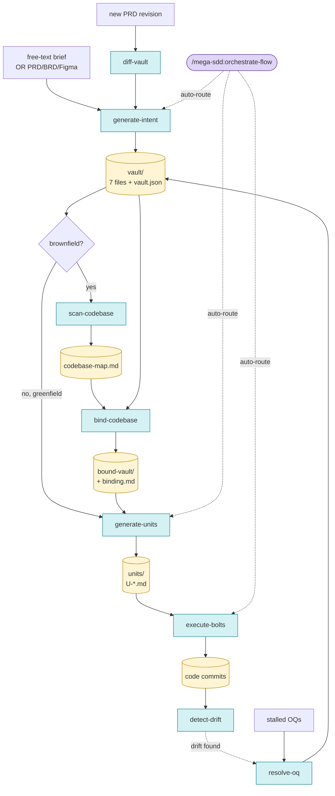

# Mega-SDD Revamp Implementation Plan

> **For agentic workers:** REQUIRED SUB-SKILL: Use superpowers:subagent-driven-development (recommended) or superpowers:executing-plans to implement this plan task-by-task. Steps use checkbox (`- [ ]`) syntax for tracking.

**Goal:** Rename `grand-design-spec@0.15` → `mega-sdd@1.0.0` and add Spec-Driven Development pipeline (intent → scan → bind → units → bolts) with brownfield binding gate and superpowers vendored fallback.

**Architecture:** Mirror superpowers' robust plugin patterns (anchor skill, SessionStart hook, `SKILL.md + references/` per skill, scripted vendor sync). Add 4 new skills + rename 5 existing. Vendor 4 superpowers skills under `_vendored/` for runtime fallback. Migration via deprecated bridge release of old plugin.

**Tech Stack:** Markdown skills, bash hook scripts, JSON manifests. No application runtime — plugin is content-driven. Tests are skill-triggering simulations + shell script assertions + manifest schema checks.

**Spec reference:** `docs/superpowers/specs/2026-05-13-mega-sdd-revamp-design.md`

---

## File Structure (master list)

### New paths to create

```
plugins/mega-sdd/                                          # renamed from grand-design-spec/
├── .claude-plugin/
│   ├── plugin.json                                        # rename + version 1.0.0
│   └── (marketplace lives at repo root)
├── hooks/
│   ├── hooks.json                                         # NEW
│   ├── run-hook.cmd                                       # NEW
│   └── session-start                                      # NEW (executable bash)
├── scripts/
│   ├── bump-version.sh                                    # NEW
│   └── sync-superpowers.sh                                # NEW
├── skills/
│   ├── using-mega-sdd/SKILL.md                            # NEW (anchor)
│   ├── generate-intent/SKILL.md                           # renamed from grand-design-spec/
│   ├── generate-intent/references/vault-contract.md       # moved
│   ├── generate-intent/references/from-prompt-mode.md     # NEW (absorbed)
│   ├── generate-intent/references/templates/00-index.md   # moved
│   ├── generate-intent/references/templates/01-overview.md
│   ├── generate-intent/references/templates/02-architecture.md
│   ├── generate-intent/references/templates/03-data-model.md
│   ├── generate-intent/references/templates/04-flows.md
│   ├── generate-intent/references/templates/05-decisions.md
│   ├── generate-intent/references/templates/06-constraints.md
│   ├── scan-codebase/SKILL.md                             # NEW
│   ├── scan-codebase/references/codebase-map-schema.md    # NEW
│   ├── bind-codebase/SKILL.md                             # NEW
│   ├── bind-codebase/references/binding-contract.md       # NEW
│   ├── bind-codebase/references/conflict-resolution.md    # NEW
│   ├── generate-units/SKILL.md                            # NEW
│   ├── generate-units/references/unit-schema.md           # NEW
│   ├── generate-units/references/templates/unit.md        # NEW
│   ├── execute-bolts/SKILL.md                             # NEW
│   ├── execute-bolts/references/bolt-contract.md          # NEW
│   ├── execute-bolts/references/superpowers-bridge.md     # NEW
│   ├── orchestrate-flow/SKILL.md                          # renamed from flow/
│   ├── orchestrate-flow/references/routing-rules.md       # NEW (extracted)
│   ├── detect-drift/SKILL.md                              # renamed from drift-detect/
│   ├── diff-vault/SKILL.md                                # renamed from vault-diff/
│   ├── resolve-oq/SKILL.md                                # unchanged
│   ├── from-prompt/                                       # DELETE (absorbed into generate-intent)
│   ├── update-plugin/SKILL.md                             # renamed from update/
│   └── _vendored/
│       ├── ATTRIBUTION.md                                 # NEW (MIT compliance)
│       ├── executing-plans/SKILL.md                       # copied
│       ├── subagent-driven-development/SKILL.md           # copied
│       ├── test-driven-development/SKILL.md               # copied
│       └── using-git-worktrees/SKILL.md                   # copied
├── commands/
│   ├── generate-intent.md                                 # NEW
│   ├── scan-codebase.md                                   # NEW
│   ├── bind-codebase.md                                   # NEW
│   ├── generate-units.md                                  # NEW
│   ├── execute-bolts.md                                   # NEW
│   ├── orchestrate-flow.md                                # renamed from flow.md
│   ├── detect-drift.md                                    # renamed from drift-detect.md
│   ├── diff-vault.md                                      # renamed from vault-diff.md
│   ├── resolve-oq.md                                      # unchanged
│   ├── update-plugin.md                                   # renamed from update.md
│   └── from-prompt.md                                     # DELETE
├── README.md                                              # rewrite with Mermaid diagram
├── CLAUDE.md                                              # NEW (contributor guidelines)
└── LICENSE                                                # unchanged

# Repo root files to modify
.claude-plugin/marketplace.json                            # add mega-sdd entry, deprecate old
CHANGELOG.md                                               # v1.0.0 entry
README.md                                                  # top-level repo readme update
CONTRIBUTING.md                                            # cross-plugin notes
docs/mega-sdd/                                             # NEW output convention dir
├── specs/
├── plans/
└── vaults/

# Repo root tests
tests/                                                     # NEW (mirrors superpowers/tests/)
├── skill-triggering/
│   ├── using-mega-sdd.test.md
│   ├── generate-intent.test.md
│   ├── scan-codebase.test.md
│   ├── bind-codebase.test.md
│   ├── generate-units.test.md
│   ├── execute-bolts.test.md
│   └── orchestrate-flow.test.md
├── hooks/
│   └── session-start.test.sh
├── vendoring/
│   └── sync-superpowers.test.sh
└── integration/
    └── e2e-greenfield.test.md
```

### Naming map (decisive)

| Old | New |
|---|---|
| `plugins/grand-design-spec/` | `plugins/mega-sdd/` |
| `skills/grand-design-spec/` | `skills/generate-intent/` |
| `skills/flow/` | `skills/orchestrate-flow/` |
| `skills/drift-detect/` | `skills/detect-drift/` |
| `skills/vault-diff/` | `skills/diff-vault/` |
| `skills/from-prompt/` | DELETED — absorbed into `generate-intent` |
| `skills/update/` | `skills/update-plugin/` |
| `commands/flow.md` | `commands/orchestrate-flow.md` |
| `commands/drift-detect.md` | `commands/detect-drift.md` |
| `commands/vault-diff.md` | `commands/diff-vault.md` |
| `commands/from-prompt.md` | DELETED |
| `commands/update.md` | `commands/update-plugin.md` |
| `commands/grand-design-spec.md` (if exists) | `commands/generate-intent.md` |

---

## Implementation order (12 phases, ~70 tasks)

Phases are ordered by dependency. Each task is 2-10 min, ends with a commit.

- **Phase A — Scaffold + rename (5 tasks)** — folder rename, manifest bumps, skeleton dirs
- **Phase B — Vendor superpowers (8 tasks)** — copy 4 skills, ATTRIBUTION, sync script
- **Phase C — Hooks + anchor (6 tasks)** — hooks.json, run-hook.cmd, session-start, using-mega-sdd
- **Phase D — Rename existing skills (8 tasks)** — content rename, frontmatter updates, cross-refs
- **Phase E — generate-intent (absorb from-prompt) (5 tasks)** — `--from-prompt` flag merge
- **Phase F — scan-codebase skill (4 tasks)**
- **Phase G — bind-codebase skill (5 tasks)**
- **Phase H — generate-units skill (5 tasks)**
- **Phase I — execute-bolts skill (5 tasks)**
- **Phase J — orchestrate-flow revamp (4 tasks)** — extended routing for new phases
- **Phase K — README + docs (6 tasks)** — Mermaid diagram, cheat-sheet, CLAUDE.md
- **Phase L — Tests + release prep (8 tasks)** — skill-triggering tests, marketplace deprecation, CHANGELOG, version bump

Total: ~69 tasks. Each task self-contained; commits frequent.

---

## Phase A — Scaffold + rename

**Dependencies:** none. **Unblocks:** everything.

### Task A1: Rename plugin folder

**Files:**
- Rename: `plugins/grand-design-spec/` → `plugins/mega-sdd/`

- [ ] **Step 1: Verify no uncommitted changes inside plugin folder**

```bash
git status plugins/grand-design-spec/
```

Expected: empty output (no changes).

- [ ] **Step 2: Rename via git mv**

```bash
git mv plugins/grand-design-spec plugins/mega-sdd
```

- [ ] **Step 3: Verify rename**

```bash
ls plugins/
```

Expected: `mega-sdd/` listed, no `grand-design-spec/`.

- [ ] **Step 4: Commit**

```bash
git add -A
git commit -m "refactor(v1.0): rename plugin folder grand-design-spec → mega-sdd"
```

---

### Task A2: Update plugin.json (name + version)

**Files:**
- Modify: `plugins/mega-sdd/.claude-plugin/plugin.json`

- [ ] **Step 1: Rewrite plugin.json**

```json
{
  "name": "mega-sdd",
  "version": "1.0.0",
  "description": "Spec-Driven Development for AI dev: intent → units → bolts pipeline with anti-hallucination guarantees and brownfield codebase grounding.",
  "author": {
    "name": "Farhan Riuzaki"
  },
  "homepage": "https://gitlab.com/airnd1/mega-sdd",
  "repository": "https://gitlab.com/airnd1/mega-sdd.git",
  "license": "MIT",
  "keywords": [
    "sdd",
    "spec-driven-development",
    "ai-coding",
    "anti-hallucination",
    "intent-unit-bolt",
    "superpowers"
  ]
}
```

- [ ] **Step 2: Verify JSON is valid**

```bash
jq . plugins/mega-sdd/.claude-plugin/plugin.json > /dev/null && echo "valid"
```

Expected: `valid`

- [ ] **Step 3: Commit**

```bash
git add plugins/mega-sdd/.claude-plugin/plugin.json
git commit -m "feat(v1.0): bump plugin.json to mega-sdd@1.0.0"
```

---

### Task A3: Update marketplace.json (add mega-sdd, deprecate old)

**Files:**
- Modify: `.claude-plugin/marketplace.json`

- [ ] **Step 1: Rewrite marketplace.json**

```json
{
  "name": "mega-sdd",
  "owner": {
    "name": "Farhan Riuzaki",
    "email": "riuzakif@gmail.com"
  },
  "plugins": [
    {
      "name": "mega-sdd",
      "source": "./plugins/mega-sdd",
      "description": "Spec-Driven Development for AI dev: intent → units → bolts pipeline with anti-hallucination guarantees and brownfield codebase grounding.",
      "version": "1.0.0",
      "author": { "name": "Farhan Riuzaki" },
      "license": "MIT",
      "keywords": [
        "sdd", "spec-driven-development", "ai-coding",
        "anti-hallucination", "intent-unit-bolt", "superpowers"
      ],
      "category": "development",
      "tags": ["sdd", "spec", "ai", "architecture", "code-generation"]
    },
    {
      "name": "grand-design-spec",
      "source": "./plugins/mega-sdd",
      "description": "DEPRECATED — renamed to mega-sdd. Install mega-sdd instead. Removed after 2 release cycles.",
      "version": "0.16.0",
      "deprecated": true,
      "deprecated_in_favor_of": "mega-sdd",
      "license": "MIT"
    }
  ]
}
```

- [ ] **Step 2: Validate JSON**

```bash
jq . .claude-plugin/marketplace.json > /dev/null && echo "valid"
```

Expected: `valid`

- [ ] **Step 3: Commit**

```bash
git add .claude-plugin/marketplace.json
git commit -m "feat(v1.0): list mega-sdd in marketplace, deprecate grand-design-spec"
```

---

### Task A4: Create skeleton directories

**Files:**
- Create: `plugins/mega-sdd/hooks/` (empty)
- Create: `plugins/mega-sdd/scripts/` (empty)
- Create: `plugins/mega-sdd/skills/_vendored/` (empty)
- Create: `docs/mega-sdd/specs/` (empty, with .gitkeep)
- Create: `docs/mega-sdd/plans/` (empty, with .gitkeep)
- Create: `docs/mega-sdd/vaults/` (empty, with .gitkeep)
- Create: `tests/skill-triggering/` (empty, with .gitkeep)
- Create: `tests/hooks/` (empty, with .gitkeep)
- Create: `tests/vendoring/` (empty, with .gitkeep)
- Create: `tests/integration/` (empty, with .gitkeep)

- [ ] **Step 1: Make all dirs and add .gitkeep**

```bash
mkdir -p plugins/mega-sdd/hooks plugins/mega-sdd/scripts plugins/mega-sdd/skills/_vendored \
  docs/mega-sdd/specs docs/mega-sdd/plans docs/mega-sdd/vaults \
  tests/skill-triggering tests/hooks tests/vendoring tests/integration

for d in plugins/mega-sdd/skills/_vendored docs/mega-sdd/specs docs/mega-sdd/plans docs/mega-sdd/vaults tests/skill-triggering tests/hooks tests/vendoring tests/integration; do
  touch "$d/.gitkeep"
done
```

- [ ] **Step 2: Verify**

```bash
find plugins/mega-sdd/hooks plugins/mega-sdd/scripts plugins/mega-sdd/skills/_vendored \
  docs/mega-sdd tests -type d | sort
```

Expected: all 10 dirs listed.

- [ ] **Step 3: Commit**

```bash
git add plugins/mega-sdd/skills/_vendored/.gitkeep docs/mega-sdd tests
git commit -m "chore(v1.0): scaffold mega-sdd plugin directories"
```

---

### Task A5: Update root README quick reference (transient)

**Files:**
- Modify: `README.md` (repo root) — add deprecation banner at top

- [ ] **Step 1: Prepend deprecation/migration banner**

Add this at the very top of `README.md`:

```markdown
> ⚠️ **v1.0 migration in progress.** This repo is being renamed from `grand-design-spec` to `mega-sdd`. The full revamp adds Spec-Driven Development (intent → units → bolts pipeline). See `docs/superpowers/specs/2026-05-13-mega-sdd-revamp-design.md`.
```

- [ ] **Step 2: Verify rendered**

```bash
head -3 README.md
```

Expected: banner line visible at line 1.

- [ ] **Step 3: Commit**

```bash
git add README.md
git commit -m "docs(v1.0): add transient migration banner to root README"
```

---

## Phase B — Vendor superpowers

**Dependencies:** Phase A complete. **Unblocks:** Phase I (execute-bolts).

### Task B1: Write ATTRIBUTION.md

**Files:**
- Create: `plugins/mega-sdd/skills/_vendored/ATTRIBUTION.md`

- [ ] **Step 1: Create attribution file**

```markdown
# Vendored Superpowers Skills — Attribution

These skills are vendored copies from the [superpowers](https://github.com/obra/superpowers) plugin by Jesse Vincent, licensed under MIT.

## Why vendored

Mega-SDD requires superpowers' execution skills for the `bolts` phase. When the user has the full `superpowers` plugin installed, those skills take precedence (see `skills/execute-bolts/references/superpowers-bridge.md` for detection logic). When superpowers is absent, mega-sdd falls back to these vendored copies so the pipeline still works end-to-end.

## Vendored skills

| Skill | Source path in superpowers |
|---|---|
| `executing-plans/` | `skills/executing-plans/` |
| `subagent-driven-development/` | `skills/subagent-driven-development/` |
| `test-driven-development/` | `skills/test-driven-development/` |
| `using-git-worktrees/` | `skills/using-git-worktrees/` |

## Vendor metadata

- **Source repo:** https://github.com/obra/superpowers
- **License:** MIT (see https://github.com/obra/superpowers/blob/main/LICENSE)
- **Vendored from version:** TBD (filled by sync-superpowers.sh)
- **Vendored at commit:** TBD (filled by sync-superpowers.sh)
- **Vendored on date:** TBD (filled by sync-superpowers.sh)

## Sync policy

Run `scripts/sync-superpowers.sh` to refresh from upstream. Sync should be performed before each mega-sdd release. Manual review of diffs is mandatory — vendored skills may shape agent behavior in unexpected ways.

## MIT License notice

The vendored skills retain their original MIT license. The MIT license text is included in the upstream superpowers repository LICENSE file.

Copyright (c) Jesse Vincent — vendored skills.
Copyright (c) 2026 Farhan Riuzaki — mega-sdd-specific code and integration.
```

- [ ] **Step 2: Commit**

```bash
git add plugins/mega-sdd/skills/_vendored/ATTRIBUTION.md
git commit -m "feat(v1.0): add ATTRIBUTION for vendored superpowers skills"
```

---

### Task B2: Write sync-superpowers.sh

**Files:**
- Create: `plugins/mega-sdd/scripts/sync-superpowers.sh` (executable)

- [ ] **Step 1: Write script**

```bash
#!/usr/bin/env bash
# Sync vendored superpowers skills from upstream
# Usage: bash scripts/sync-superpowers.sh [SUPERPOWERS_DIR]
# If SUPERPOWERS_DIR not provided, uses default cache path.

set -euo pipefail

SCRIPT_DIR="$(cd "$(dirname "$0")" && pwd)"
PLUGIN_ROOT="$(cd "${SCRIPT_DIR}/.." && pwd)"
VENDORED_DIR="${PLUGIN_ROOT}/skills/_vendored"

DEFAULT_SP_CACHE="${HOME}/.claude/plugins/cache/claude-plugins-official/superpowers"
SP_DIR="${1:-}"

# Auto-resolve latest version if not provided
if [ -z "$SP_DIR" ]; then
  if [ -d "$DEFAULT_SP_CACHE" ]; then
    SP_DIR="$(find "$DEFAULT_SP_CACHE" -maxdepth 1 -type d -name "[0-9]*" | sort -V | tail -1)"
  fi
fi

if [ -z "$SP_DIR" ] || [ ! -d "$SP_DIR" ]; then
  echo "ERROR: superpowers source not found. Pass path as arg or install superpowers plugin." >&2
  exit 1
fi

echo "Syncing from: $SP_DIR"

SKILLS_TO_VENDOR=(
  "executing-plans"
  "subagent-driven-development"
  "test-driven-development"
  "using-git-worktrees"
)

for skill in "${SKILLS_TO_VENDOR[@]}"; do
  src="${SP_DIR}/skills/${skill}"
  dst="${VENDORED_DIR}/${skill}"
  if [ ! -d "$src" ]; then
    echo "WARN: source skill missing: $src" >&2
    continue
  fi
  rm -rf "$dst"
  cp -R "$src" "$dst"
  echo "  vendored: ${skill}"
done

# Update ATTRIBUTION.md metadata
SP_VERSION="$(basename "$SP_DIR")"
SP_COMMIT="unknown"
if [ -d "${SP_DIR}/.git" ]; then
  SP_COMMIT="$(git -C "$SP_DIR" rev-parse HEAD 2>/dev/null || echo "unknown")"
fi
TODAY="$(date -u +%Y-%m-%d)"

ATTR="${VENDORED_DIR}/ATTRIBUTION.md"
if [ -f "$ATTR" ]; then
  sed -i.bak \
    -e "s|^- \*\*Vendored from version:\*\*.*$|- **Vendored from version:** ${SP_VERSION}|" \
    -e "s|^- \*\*Vendored at commit:\*\*.*$|- **Vendored at commit:** ${SP_COMMIT}|" \
    -e "s|^- \*\*Vendored on date:\*\*.*$|- **Vendored on date:** ${TODAY}|" \
    "$ATTR"
  rm -f "${ATTR}.bak"
fi

echo "Sync complete. Review diffs and commit."
```

- [ ] **Step 2: Make executable**

```bash
chmod +x plugins/mega-sdd/scripts/sync-superpowers.sh
```

- [ ] **Step 3: Test it (will perform actual vendor)**

```bash
bash plugins/mega-sdd/scripts/sync-superpowers.sh
```

Expected output: 4 `vendored: <skill>` lines + `Sync complete.`

- [ ] **Step 4: Verify vendored skills exist**

```bash
ls plugins/mega-sdd/skills/_vendored/
```

Expected: `ATTRIBUTION.md`, `executing-plans/`, `subagent-driven-development/`, `test-driven-development/`, `using-git-worktrees/`

- [ ] **Step 5: Verify ATTRIBUTION metadata updated**

```bash
grep "Vendored from version" plugins/mega-sdd/skills/_vendored/ATTRIBUTION.md
```

Expected: shows actual version like `5.1.0`, not `TBD`.

- [ ] **Step 6: Commit**

```bash
git add plugins/mega-sdd/scripts/sync-superpowers.sh plugins/mega-sdd/skills/_vendored/
git commit -m "feat(v1.0): vendor superpowers skills + sync script"
```

---

### Task B3: Write vendoring test

**Files:**
- Create: `tests/vendoring/sync-superpowers.test.sh`

- [ ] **Step 1: Write test**

```bash
#!/usr/bin/env bash
# Verifies vendored superpowers skills exist and are well-formed.

set -euo pipefail

REPO_ROOT="$(cd "$(dirname "$0")/../.." && pwd)"
VENDORED="${REPO_ROOT}/plugins/mega-sdd/skills/_vendored"

fail() { echo "FAIL: $1" >&2; exit 1; }

[ -d "$VENDORED" ] || fail "vendored dir missing: $VENDORED"
[ -f "${VENDORED}/ATTRIBUTION.md" ] || fail "ATTRIBUTION.md missing"

for skill in executing-plans subagent-driven-development test-driven-development using-git-worktrees; do
  [ -d "${VENDORED}/${skill}" ] || fail "skill missing: ${skill}"
  [ -f "${VENDORED}/${skill}/SKILL.md" ] || fail "${skill}/SKILL.md missing"
  grep -q "^name: " "${VENDORED}/${skill}/SKILL.md" || fail "${skill}/SKILL.md frontmatter missing"
done

# ATTRIBUTION should not have TBD after sync
if grep -q "Vendored from version:\*\* TBD" "${VENDORED}/ATTRIBUTION.md"; then
  fail "ATTRIBUTION.md still has TBD — sync script did not run"
fi

echo "OK: all 4 vendored skills present with frontmatter, attribution complete"
```

- [ ] **Step 2: Make executable and run**

```bash
chmod +x tests/vendoring/sync-superpowers.test.sh
bash tests/vendoring/sync-superpowers.test.sh
```

Expected: `OK: all 4 vendored skills present...`

- [ ] **Step 3: Commit**

```bash
git add tests/vendoring/sync-superpowers.test.sh
git commit -m "test(v1.0): verify vendored superpowers skills present"
```

---

## Phase C — Hooks + Anchor skill

**Dependencies:** Phase A complete. **Unblocks:** All skill-trigger work in subsequent phases (anchor governs them).

### Task C1: Create hooks/hooks.json

**Files:**
- Create: `plugins/mega-sdd/hooks/hooks.json`

- [ ] **Step 1: Write hooks.json**

```json
{
  "hooks": {
    "SessionStart": [
      {
        "matcher": "startup|clear|compact",
        "hooks": [
          {
            "type": "command",
            "command": "\"${CLAUDE_PLUGIN_ROOT}/hooks/run-hook.cmd\" session-start",
            "async": false
          }
        ]
      }
    ]
  }
}
```

- [ ] **Step 2: Validate JSON**

```bash
jq . plugins/mega-sdd/hooks/hooks.json > /dev/null && echo "valid"
```

Expected: `valid`

- [ ] **Step 3: Commit**

```bash
git add plugins/mega-sdd/hooks/hooks.json
git commit -m "feat(v1.0): register mega-sdd SessionStart hook"
```

---

### Task C2: Create hooks/run-hook.cmd (cross-platform wrapper)

**Files:**
- Create: `plugins/mega-sdd/hooks/run-hook.cmd`

- [ ] **Step 1: Write wrapper**

```bash
#!/usr/bin/env bash
# Cross-platform hook dispatcher for mega-sdd.
# Usage: run-hook.cmd <hook-name>
# Executes hooks/<hook-name> with appropriate interpreter.

set -euo pipefail

SCRIPT_DIR="$(cd "$(dirname "$0")" && pwd)"
HOOK_NAME="${1:-}"

if [ -z "$HOOK_NAME" ]; then
  echo "ERROR: hook name required" >&2
  exit 1
fi

HOOK_PATH="${SCRIPT_DIR}/${HOOK_NAME}"
if [ ! -f "$HOOK_PATH" ]; then
  echo "ERROR: hook not found: $HOOK_PATH" >&2
  exit 1
fi

# Platform detection: Windows uses .ps1, otherwise bash
case "$(uname -s 2>/dev/null || echo "")" in
  MINGW*|MSYS*|CYGWIN*)
    if [ -f "${HOOK_PATH}.ps1" ]; then
      powershell -ExecutionPolicy Bypass -File "${HOOK_PATH}.ps1"
      exit $?
    fi
    ;;
esac

bash "$HOOK_PATH"
```

- [ ] **Step 2: Make executable**

```bash
chmod +x plugins/mega-sdd/hooks/run-hook.cmd
```

- [ ] **Step 3: Commit**

```bash
git add plugins/mega-sdd/hooks/run-hook.cmd
git commit -m "feat(v1.0): cross-platform hook dispatcher"
```

---

### Task C3: Create hooks/session-start

**Files:**
- Create: `plugins/mega-sdd/hooks/session-start` (executable bash)

- [ ] **Step 1: Write session-start**

```bash
#!/usr/bin/env bash
# SessionStart hook for mega-sdd plugin.
# Inject `using-mega-sdd` anchor skill content when SDD signals detected in CWD.

set -euo pipefail

SCRIPT_DIR="$(cd "$(dirname "$0")" && pwd)"
PLUGIN_ROOT="$(cd "${SCRIPT_DIR}/.." && pwd)"
ANCHOR_SKILL="${PLUGIN_ROOT}/skills/using-mega-sdd/SKILL.md"

# Detect SDD signals in CWD (purely heuristic, no false positives in casual sessions)
cwd="$(pwd)"
has_sdd_signal=0
for signal in "docs/mega-sdd" "vaults" "bound-vault" "units" "binding.md" "codebase-map.md"; do
  if [ -e "${cwd}/${signal}" ]; then
    has_sdd_signal=1
    break
  fi
done

# If no signals, skip injection
if [ "$has_sdd_signal" -eq 0 ]; then
  exit 0
fi

# Build context injection JSON for Claude Code SessionStart spec
if [ ! -f "$ANCHOR_SKILL" ]; then
  echo "WARN: anchor skill missing: $ANCHOR_SKILL" >&2
  exit 0
fi

ANCHOR_CONTENT="$(cat "$ANCHOR_SKILL")"

# Check superpowers presence
sp_cache="${HOME}/.claude/plugins/cache"
sp_present=0
if find "$sp_cache" -maxdepth 4 -type d -name "superpowers" 2>/dev/null | grep -q .; then
  sp_present=1
fi

WARN=""
if [ "$sp_present" -eq 0 ]; then
  WARN=$'\n\n<important-reminder>⚠️ Mega-SDD detected SDD work in CWD but the `superpowers` plugin is not installed. Bolts phase will use vendored fallback. For full features run: `/plugin install superpowers`</important-reminder>'
fi

cat <<EOF
<<EXTREMELY_IMPORTANT>>
You have mega-sdd skills available. SDD context detected in CWD.

${ANCHOR_CONTENT}${WARN}
<</EXTREMELY_IMPORTANT>>
EOF
```

- [ ] **Step 2: Make executable**

```bash
chmod +x plugins/mega-sdd/hooks/session-start
```

- [ ] **Step 3: Test against synthetic CWD**

```bash
mkdir -p /tmp/megasdd-test/docs/mega-sdd && cd /tmp/megasdd-test
bash "$(git -C ~/Downloads/grand-design-spec rev-parse --show-toplevel)/plugins/mega-sdd/hooks/session-start" | head -10
cd - > /dev/null
```

Expected: anchor skill content printed (because docs/mega-sdd signal exists).

- [ ] **Step 4: Test against no-signal CWD**

```bash
cd /tmp && bash "$(git -C ~/Downloads/grand-design-spec rev-parse --show-toplevel)/plugins/mega-sdd/hooks/session-start"
echo "exit_code=$?"
cd - > /dev/null
```

Expected: no output, `exit_code=0` (correctly skipped).

- [ ] **Step 5: Commit**

```bash
git add plugins/mega-sdd/hooks/session-start
git commit -m "feat(v1.0): SessionStart hook injects anchor when SDD signals present"
```

---

### Task C4: Hook integration test

**Files:**
- Create: `tests/hooks/session-start.test.sh`

- [ ] **Step 1: Write test**

```bash
#!/usr/bin/env bash
# Verifies session-start hook behavior:
#   1. Injects anchor when SDD signals present
#   2. Stays silent when no signals
#   3. Surfaces superpowers warning when superpowers missing

set -euo pipefail

REPO_ROOT="$(cd "$(dirname "$0")/../.." && pwd)"
HOOK="${REPO_ROOT}/plugins/mega-sdd/hooks/session-start"

fail() { echo "FAIL: $1" >&2; exit 1; }

[ -x "$HOOK" ] || fail "hook not executable: $HOOK"

# Test 1: no-signal CWD → empty output
tmp1="$(mktemp -d)"
out="$(cd "$tmp1" && bash "$HOOK")"
[ -z "$out" ] || fail "no-signal CWD should produce empty output, got: $out"
rm -rf "$tmp1"

# Test 2: signal CWD → anchor content present
tmp2="$(mktemp -d)"
mkdir -p "${tmp2}/docs/mega-sdd"
out="$(cd "$tmp2" && bash "$HOOK")"
echo "$out" | grep -q "EXTREMELY_IMPORTANT" || fail "anchor wrapper missing from signal CWD output"
echo "$out" | grep -q "mega-sdd" || fail "anchor body missing 'mega-sdd' mention"
rm -rf "$tmp2"

echo "OK: hook behaves correctly in both signal and no-signal CWDs"
```

- [ ] **Step 2: Make executable + run**

```bash
chmod +x tests/hooks/session-start.test.sh
bash tests/hooks/session-start.test.sh
```

Expected: `OK: hook behaves correctly...`

(This will only pass after C5 creates `using-mega-sdd/SKILL.md`. Mark this task as pending until C5 done, then run.)

- [ ] **Step 3: Commit**

```bash
git add tests/hooks/session-start.test.sh
git commit -m "test(v1.0): session-start hook signal/no-signal behavior"
```

---

### Task C5: Write using-mega-sdd anchor skill

**Files:**
- Create: `plugins/mega-sdd/skills/using-mega-sdd/SKILL.md`

- [ ] **Step 1: Write anchor SKILL.md**

```markdown
---
name: using-mega-sdd
description: Use at session start when SDD topics arise — establishes how to route SDD work through mega-sdd phases. Triggers on SDD keywords (intent, unit, bolt, vault, PRD, BRD, spec out, dev handoff, binding, bound-vault) and Indonesian variants (pecah PRD, buat dev, spec ini, siapkan context buat AI dev).
---

# Using Mega-SDD

## When this anchor applies (scoped)

Invoke a mega-sdd skill BEFORE any response when ANY of these apply:

**Trigger conditions:**
- User explicitly types `/mega-sdd:<command>`
- User prompt contains SDD keywords: `intent`, `unit`, `bolt`, `vault`, `PRD`, `BRD`, `spec out`, `dev handoff`, `binding`, `bound-vault`, `Open Question`
- User prompt contains Indonesian SDD variants: `pecah PRD`, `buat dev`, `spec ini`, `siapkan context buat AI dev`, `kontrak handoff`
- CWD has SDD signals: `docs/mega-sdd/`, `vaults/`, `bound-vault/`, `units/`, `binding.md`, `codebase-map.md`

**Non-triggers (do NOT mandate skill check):**
- Casual conversation without SDD vocab
- Code debugging, refactoring, or review unrelated to a vault
- General architecture discussion not anchored to a PRD/vault

## Priority order

1. **User explicit instructions** (CLAUDE.md, AGENTS.md, direct requests) — highest
2. **Mega-SDD phase rails** — override default behavior in SDD scope
3. **Default system prompt** — lowest

If user says "skip the binding step" or "no need for units," follow them. User is in control.

## The pipeline (canonical)

```
generate-intent → (scan-codebase + bind-codebase if brownfield) → generate-units → execute-bolts
```

Side lanes (run as needed, not in main chain):
- `resolve-oq` — interactive Open Question walk
- `detect-drift` — code vs vault reconciliation
- `diff-vault` — handle new PRD revision
- `orchestrate-flow` — auto-route based on CWD state

## Hard rule

For ANY trigger condition above:
1. **STOP**. Do not respond yet.
2. **Invoke the appropriate skill** via `Skill` tool. Default route when unsure: `orchestrate-flow` (it auto-routes).
3. **Announce** which skill you're invoking before continuing.

## Red flags (rationalization patterns — STOP)

| Thought | Reality |
|---|---|
| "I'll just draft the vault inline, faster" | Use `generate-intent` — anti-hallucination rails matter |
| "Binding is overkill for this small change" | Run `bind-codebase` anyway in brownfield — gate exists for a reason |
| "I can skip units, the change is trivial" | Units encode grounding, never skip in real pipelines |
| "Superpowers is heavy, I'll execute inline" | Bolts MUST route through superpowers (vendored fallback OK) |
| "User just wants a quick answer" | Quick answers are fine OUTSIDE SDD scope; inside, use skills |
| "Detecting brownfield is hard, assume greenfield" | `orchestrate-flow` already detects — defer to it |

## When NOT to use mega-sdd

- User asks unrelated coding questions
- User says "ignore SDD" or "just write the code"
- Quick scripting, debugging session, or tool config

## Phase ownership

| Phase | Skill | Repo access | Runs |
|---|---|---|---|
| Brief → vault | `generate-intent` | Not required | Architect |
| Codebase scan | `scan-codebase` | Read-only | Dev / AI |
| Validation gate | `bind-codebase` | Read-only | Dev / AI |
| Vault → units | `generate-units` | Read-only | Dev / AI |
| Unit → code | `execute-bolts` | Write | AI agent (via superpowers) |

## Skill chain enforcement

After each phase completes, mega-sdd skills explicitly hand off to the next:
- `generate-intent` → suggests `scan-codebase` (brownfield) OR `generate-units` (greenfield)
- `scan-codebase` → suggests `bind-codebase`
- `bind-codebase` → suggests `generate-units` (when no conflicts) OR `resolve-oq` (when conflicts)
- `generate-units` → suggests `execute-bolts`
- `execute-bolts` → suggests `detect-drift` (optional, periodic)

Hard gate: `bind-codebase` BLOCKS unit generation when `binding.md` has unresolved CONFLICT entries.
```

- [ ] **Step 2: Verify file exists with frontmatter**

```bash
head -3 plugins/mega-sdd/skills/using-mega-sdd/SKILL.md
```

Expected: lines 1-3 are `---`, `name: using-mega-sdd`, `description: ...`

- [ ] **Step 3: Re-run hook test from C4 (now should pass fully)**

```bash
bash tests/hooks/session-start.test.sh
```

Expected: `OK: hook behaves correctly...`

- [ ] **Step 4: Commit**

```bash
git add plugins/mega-sdd/skills/using-mega-sdd/SKILL.md
git commit -m "feat(v1.0): anchor skill using-mega-sdd with scoped triggers"
```

---

### Task C6: Add anchor skill triggering test

**Files:**
- Create: `tests/skill-triggering/using-mega-sdd.test.md`

- [ ] **Step 1: Write test fixture**

```markdown
# using-mega-sdd Triggering Test

Manual-run test fixture. Open a fresh Claude Code session in a dir matching trigger criteria, then paste each `Prompt` line below. Expected behavior described inline.

## Trigger cases (must invoke using-mega-sdd or downstream skill)

### Case T1: Explicit slash command
- **Prompt:** `/mega-sdd:generate-intent ./prd.md`
- **Expect:** Skill tool call with `generate-intent` skill invoked

### Case T2: SDD keyword
- **Prompt:** `Tolong spec out fitur ini buat dev`
- **Expect:** Skill tool call with `generate-intent` or `orchestrate-flow`

### Case T3: CWD signal only
- **Setup:** Run from a dir containing `docs/mega-sdd/`
- **Prompt:** `What's next?`
- **Expect:** Hook injects anchor; agent suggests running `orchestrate-flow`

### Case T4: Indonesian variant
- **Prompt:** `pecah PRD ini buat AI dev`
- **Expect:** Skill tool call with `generate-intent`

## Non-trigger cases (must NOT invoke mega-sdd)

### Case NT1: Casual question
- **Prompt:** `What's the difference between TypeScript and JavaScript?`
- **Expect:** Direct answer, no skill invocation

### Case NT2: Unrelated debugging
- **Prompt:** `My React component is rendering twice, help debug`
- **Expect:** Investigation via Read/Grep, no mega-sdd skill

### Case NT3: General architecture
- **Prompt:** `How should I structure a microservices project?`
- **Expect:** Discussion, no skill (no specific PRD/vault attached)

## Pass criteria

All T1-T4 invoke a mega-sdd skill. None of NT1-NT3 invokes one.
```

- [ ] **Step 2: Commit**

```bash
git add tests/skill-triggering/using-mega-sdd.test.md
git commit -m "test(v1.0): anchor triggering scenarios fixture"
```

---

## Phase D — Rename existing skills (preserve behavior)

**Dependencies:** Phase A complete. **Strategy:** Rename folders, update frontmatter `name:`, search-replace cross-references. No behavior changes yet.

### Task D1: Rename grand-design-spec skill folder → generate-intent

**Files:**
- Rename: `plugins/mega-sdd/skills/grand-design-spec/` → `plugins/mega-sdd/skills/generate-intent/`

- [ ] **Step 1: Rename folder**

```bash
git mv plugins/mega-sdd/skills/grand-design-spec plugins/mega-sdd/skills/generate-intent
```

- [ ] **Step 2: Update SKILL.md frontmatter**

In `plugins/mega-sdd/skills/generate-intent/SKILL.md`, change:
```yaml
name: grand-design-spec
```
to:
```yaml
name: generate-intent
```

Also update `version` to `1.0.0` and update description to reflect absorbed `--from-prompt` mode (this happens in Phase E; for now, only the rename).

- [ ] **Step 3: Verify**

```bash
head -3 plugins/mega-sdd/skills/generate-intent/SKILL.md | grep "name: generate-intent"
```

Expected: line matches.

- [ ] **Step 4: Commit**

```bash
git add plugins/mega-sdd/skills/generate-intent/
git commit -m "refactor(v1.0): rename skill grand-design-spec → generate-intent"
```

---

### Task D2: Rename flow → orchestrate-flow

**Files:**
- Rename: `plugins/mega-sdd/skills/flow/` → `plugins/mega-sdd/skills/orchestrate-flow/`

- [ ] **Step 1: Rename folder + update frontmatter**

```bash
git mv plugins/mega-sdd/skills/flow plugins/mega-sdd/skills/orchestrate-flow
```

Then in `plugins/mega-sdd/skills/orchestrate-flow/SKILL.md`, change:
```yaml
name: flow
```
to:
```yaml
name: orchestrate-flow
version: 1.0.0
```

- [ ] **Step 2: Commit**

```bash
git add plugins/mega-sdd/skills/orchestrate-flow/
git commit -m "refactor(v1.0): rename skill flow → orchestrate-flow"
```

---

### Task D3: Rename drift-detect → detect-drift

**Files:**
- Rename: `plugins/mega-sdd/skills/drift-detect/` → `plugins/mega-sdd/skills/detect-drift/`

- [ ] **Step 1: Rename + update**

```bash
git mv plugins/mega-sdd/skills/drift-detect plugins/mega-sdd/skills/detect-drift
```

In `plugins/mega-sdd/skills/detect-drift/SKILL.md`, change `name: drift-detect` → `name: detect-drift`, bump `version: 1.0.0`.

- [ ] **Step 2: Commit**

```bash
git add plugins/mega-sdd/skills/detect-drift/
git commit -m "refactor(v1.0): rename skill drift-detect → detect-drift"
```

---

### Task D4: Rename vault-diff → diff-vault

**Files:**
- Rename: `plugins/mega-sdd/skills/vault-diff/` → `plugins/mega-sdd/skills/diff-vault/`

- [ ] **Step 1: Rename + update**

```bash
git mv plugins/mega-sdd/skills/vault-diff plugins/mega-sdd/skills/diff-vault
```

In `plugins/mega-sdd/skills/diff-vault/SKILL.md`: `name: vault-diff` → `name: diff-vault`, `version: 1.0.0`.

- [ ] **Step 2: Commit**

```bash
git add plugins/mega-sdd/skills/diff-vault/
git commit -m "refactor(v1.0): rename skill vault-diff → diff-vault"
```

---

### Task D5: Rename update → update-plugin

**Files:**
- Rename: `plugins/mega-sdd/skills/update/` → `plugins/mega-sdd/skills/update-plugin/`

- [ ] **Step 1: Rename + update**

```bash
git mv plugins/mega-sdd/skills/update plugins/mega-sdd/skills/update-plugin
```

In `plugins/mega-sdd/skills/update-plugin/SKILL.md`: `name: update` → `name: update-plugin`, `version: 1.0.0`.

- [ ] **Step 2: Commit**

```bash
git add plugins/mega-sdd/skills/update-plugin/
git commit -m "refactor(v1.0): rename skill update → update-plugin"
```

---

### Task D6: Rename commands (slash command files)

**Files:**
- Rename: `commands/flow.md` → `commands/orchestrate-flow.md`
- Rename: `commands/drift-detect.md` → `commands/detect-drift.md`
- Rename: `commands/vault-diff.md` → `commands/diff-vault.md`
- Rename: `commands/update.md` → `commands/update-plugin.md`
- Rename: `commands/grand-design-spec.md` → `commands/generate-intent.md` (if exists)

- [ ] **Step 1: Rename all**

```bash
cd plugins/mega-sdd/commands

# Conditional renames (some files may already match new names)
[ -f flow.md ] && git mv flow.md orchestrate-flow.md
[ -f drift-detect.md ] && git mv drift-detect.md detect-drift.md
[ -f vault-diff.md ] && git mv vault-diff.md diff-vault.md
[ -f update.md ] && git mv update.md update-plugin.md
[ -f grand-design-spec.md ] && git mv grand-design-spec.md generate-intent.md

cd - > /dev/null
ls plugins/mega-sdd/commands/
```

- [ ] **Step 2: Search-replace skill names INSIDE command .md files**

Each command .md invokes a skill name. Update references:

```bash
sed -i.bak \
  -e 's|grand-design-spec:flow|mega-sdd:orchestrate-flow|g' \
  -e 's|grand-design-spec:drift-detect|mega-sdd:detect-drift|g' \
  -e 's|grand-design-spec:vault-diff|mega-sdd:diff-vault|g' \
  -e 's|grand-design-spec:update|mega-sdd:update-plugin|g' \
  -e 's|grand-design-spec:grand-design-spec|mega-sdd:generate-intent|g' \
  -e 's|grand-design-spec:resolve-oq|mega-sdd:resolve-oq|g' \
  -e 's|grand-design-spec:from-prompt|mega-sdd:generate-intent|g' \
  plugins/mega-sdd/commands/*.md

rm -f plugins/mega-sdd/commands/*.bak
```

- [ ] **Step 3: Spot-check one file**

```bash
grep -l "mega-sdd:" plugins/mega-sdd/commands/*.md | head -3
grep "grand-design-spec:" plugins/mega-sdd/commands/*.md
```

Expected: first command lists 3+ files; second command produces no output (no old refs left).

- [ ] **Step 4: Commit**

```bash
git add plugins/mega-sdd/commands/
git commit -m "refactor(v1.0): rename command files + update skill refs"
```

---

### Task D7: Search-replace cross-references in skill SKILL.md files

**Files:**
- Modify: all `plugins/mega-sdd/skills/*/SKILL.md` files
- Modify: all `plugins/mega-sdd/skills/*/references/*.md` files

- [ ] **Step 1: Replace plugin-name and skill-name references**

```bash
find plugins/mega-sdd/skills -type f \( -name "SKILL.md" -o -name "*.md" \) | while read f; do
  sed -i.bak \
    -e 's|grand-design-spec:flow|mega-sdd:orchestrate-flow|g' \
    -e 's|grand-design-spec:drift-detect|mega-sdd:detect-drift|g' \
    -e 's|grand-design-spec:vault-diff|mega-sdd:diff-vault|g' \
    -e 's|grand-design-spec:update|mega-sdd:update-plugin|g' \
    -e 's|grand-design-spec:grand-design-spec|mega-sdd:generate-intent|g' \
    -e 's|grand-design-spec:resolve-oq|mega-sdd:resolve-oq|g' \
    -e 's|grand-design-spec:from-prompt|mega-sdd:generate-intent|g' \
    -e "s|skill 'grand-design-spec'|skill 'generate-intent'|g" \
    -e 's|skill `grand-design-spec`|skill `generate-intent`|g' \
    "$f"
  rm -f "${f}.bak"
done
```

- [ ] **Step 2: Verify no stale refs remain**

```bash
grep -rn "grand-design-spec:" plugins/mega-sdd/skills/ || echo "OK: clean"
```

Expected: `OK: clean` (or some prose mentions of the OLD plugin name in migration context, which is fine — only `<plugin>:<skill>` refs matter).

- [ ] **Step 3: Commit**

```bash
git add plugins/mega-sdd/skills/
git commit -m "refactor(v1.0): update cross-skill refs to mega-sdd: namespace"
```

---

### Task D8: Update vault-contract.md location (move to generate-intent/references)

**Files:**
- Move: `plugins/mega-sdd/skills/generate-intent/references/vault-contract.md` (already in place from rename)
- Verify path is correct

- [ ] **Step 1: Confirm path**

```bash
ls plugins/mega-sdd/skills/generate-intent/references/
```

Expected: `vault-contract.md` + `templates/` dir present.

- [ ] **Step 2: Update any external references pointing to old path**

```bash
grep -rn "skills/grand-design-spec/references" plugins/mega-sdd/ docs/ tests/ 2>/dev/null || echo "OK: no stale refs"
```

Expected: `OK: no stale refs`. If matches found, replace path manually.

- [ ] **Step 3: Commit (only if changes were made)**

```bash
git status plugins/mega-sdd/
# If anything to commit:
git add -A && git commit -m "refactor(v1.0): align vault-contract.md path under generate-intent"
```

---

## Phase E — generate-intent (absorb from-prompt)

**Dependencies:** Phase D. **Goal:** Merge from-prompt skill behavior into generate-intent as `--from-prompt "<brief>"` flag.

### Task E1: Capture existing from-prompt content into reference doc

**Files:**
- Create: `plugins/mega-sdd/skills/generate-intent/references/from-prompt-mode.md`

- [ ] **Step 1: Copy from-prompt SKILL.md body into from-prompt-mode.md**

```bash
cp plugins/mega-sdd/skills/from-prompt/SKILL.md plugins/mega-sdd/skills/generate-intent/references/from-prompt-mode.md
```

- [ ] **Step 2: Edit copied file — remove frontmatter, prepend section header**

In `plugins/mega-sdd/skills/generate-intent/references/from-prompt-mode.md`:

Replace the entire frontmatter block (lines from `---` to next `---`) with:

```markdown
# From-Prompt Mode Reference

This document specifies the `--from-prompt` mode of `generate-intent`. When the user invokes `generate-intent --from-prompt "<brief>"` (or the agent infers free-text intent), this mode runs adaptive Q&A (≤10 questions) to fill brief gaps before producing the vault.

This was previously a standalone skill `from-prompt`; it is now absorbed as a mode of `generate-intent`. See `generate-intent/SKILL.md` for invocation rules.
```

- [ ] **Step 3: Commit**

```bash
git add plugins/mega-sdd/skills/generate-intent/references/from-prompt-mode.md
git commit -m "feat(v1.0): absorb from-prompt content as generate-intent reference"
```

---

### Task E2: Update generate-intent/SKILL.md to support --from-prompt

**Files:**
- Modify: `plugins/mega-sdd/skills/generate-intent/SKILL.md`

- [ ] **Step 1: Update frontmatter description**

Change the description in frontmatter to:

```yaml
description: Spec-driven intent generation — convert PRD/BRD + Figma OR free-text brief into a 7-file vault with anti-hallucination guarantees. Mode auto-detected from input: structured PRD path → parse; --from-prompt or free-text → adaptive Q&A first. Triggers — "spec out this feature", "buat dev handoff", "from this prompt", "pecah PRD ini buat AI dev", or paraphrases.
```

- [ ] **Step 2: Add "Invocation modes" section near top of SKILL.md body**

After the `# Grand Design Spec Generator` heading line, add a new section:

```markdown
## Invocation modes

`generate-intent` has TWO input modes:

### Mode A — Structured input (PRD / BRD / Figma)
Invocation: `/mega-sdd:generate-intent ./prd.md` (or any structured doc path)
Behavior: parse + decompose directly per `references/vault-contract.md`. No Q&A unless source is critically incomplete.

### Mode B — Free-text brief (--from-prompt)
Invocation: `/mega-sdd:generate-intent --from-prompt "<brief text>"` OR detected when no structured PRD path provided.
Behavior: per `references/from-prompt-mode.md` — runs adaptive Q&A (≤10 questions) to fill gaps, then produces seed-PRD + vault in one pass.

The two modes share the SAME vault contract (`references/vault-contract.md`). The only difference is input parsing.
```

- [ ] **Step 3: Update "When to use" trigger list**

Search for the existing "When to use this skill" section in SKILL.md and add these triggers:

```markdown
- "from this prompt" / "from a brief" / "baku dari ide" — invokes Mode B (free-text)
- "I only have an idea, not a PRD" / "ide aja gue belum sempat PRD" — invokes Mode B
```

- [ ] **Step 4: Verify**

```bash
grep -A1 "Invocation modes" plugins/mega-sdd/skills/generate-intent/SKILL.md | head -5
```

Expected: shows the new section.

- [ ] **Step 5: Commit**

```bash
git add plugins/mega-sdd/skills/generate-intent/SKILL.md
git commit -m "feat(v1.0): generate-intent dual-mode (structured + free-text) invocation"
```

---

### Task E3: Update generate-intent.md slash command

**Files:**
- Modify (or Create if absent): `plugins/mega-sdd/commands/generate-intent.md`

- [ ] **Step 1: Write command file**

```markdown
---
description: Generate a 7-file SDD intent vault from PRD/BRD/Figma OR free-text brief. Anti-hallucination guarantees.
argument-hint: [path-to-prd.md OR --from-prompt "free-text brief"]
---

Invoke the `mega-sdd:generate-intent` skill via the Skill tool.

User arguments: $ARGUMENTS

Mode resolution:
- If `$ARGUMENTS` starts with `--from-prompt`, run Mode B (free-text, adaptive Q&A)
- If `$ARGUMENTS` is a path to a .md / .pdf file, run Mode A (structured parse)
- If `$ARGUMENTS` is empty, smart auto-detect: scan CWD for `prd.md`, `seed-PRD.md`, or `*.md` PRD candidates. If exactly one found, confirm with user. Otherwise prompt for path or free-text input.

Follow `skills/generate-intent/SKILL.md` invocation modes exactly. Output goes to `docs/mega-sdd/vaults/<auto-named>/` unless user overrides via `--out=<path>`.

Hard rails:
- Anti-hallucination: every claim cites source; ambiguities → Open Questions.
- Language: vault language matches input PRD language.
- Halt on critical gaps; do not invent.
```

- [ ] **Step 2: Verify**

```bash
cat plugins/mega-sdd/commands/generate-intent.md
```

- [ ] **Step 3: Commit**

```bash
git add plugins/mega-sdd/commands/generate-intent.md
git commit -m "feat(v1.0): generate-intent slash command with dual-mode dispatch"
```

---

### Task E4: Delete from-prompt skill and command

**Files:**
- Delete: `plugins/mega-sdd/skills/from-prompt/`
- Delete: `plugins/mega-sdd/commands/from-prompt.md`

- [ ] **Step 1: Verify content was absorbed**

```bash
[ -f plugins/mega-sdd/skills/generate-intent/references/from-prompt-mode.md ] && echo "absorbed OK"
```

Expected: `absorbed OK`

- [ ] **Step 2: Delete originals**

```bash
git rm -r plugins/mega-sdd/skills/from-prompt/
[ -f plugins/mega-sdd/commands/from-prompt.md ] && git rm plugins/mega-sdd/commands/from-prompt.md
```

- [ ] **Step 3: Add transient alias in command (back-compat)**

Create stub `plugins/mega-sdd/commands/from-prompt.md` that redirects:

```markdown
---
description: [DEPRECATED v1.0] Aliased to `/mega-sdd:generate-intent --from-prompt`. Will be removed in v1.2.
argument-hint: "free-text brief"
---

DEPRECATION NOTICE: `/mega-sdd:from-prompt` is deprecated. Use `/mega-sdd:generate-intent --from-prompt "<brief>"` instead.

For back-compat, invoke `mega-sdd:generate-intent` skill with `--from-prompt $ARGUMENTS`.

This alias will be removed in v1.2.
```

- [ ] **Step 4: Commit**

```bash
git add plugins/mega-sdd/commands/from-prompt.md
git status # verify from-prompt skill folder is gone (in git rm staging)
git commit -m "refactor(v1.0): remove from-prompt skill; add deprecated command alias"
```

---

### Task E5: Generate-intent trigger test

**Files:**
- Create: `tests/skill-triggering/generate-intent.test.md`

- [ ] **Step 1: Write test fixture**

```markdown
# generate-intent Triggering Test

Manual-run fixture for Mode A (structured) and Mode B (free-text).

## Mode A — Structured input

### Case A1: Explicit slash with PRD path
- **Prompt:** `/mega-sdd:generate-intent ./prd.md`
- **Expect:** Skill invocation, Mode A, no Q&A unless PRD is incomplete

### Case A2: Indonesian trigger phrase + PRD in CWD
- **Setup:** `prd.md` exists in CWD
- **Prompt:** `pecah PRD ini buat dev`
- **Expect:** Skill invocation, Mode A on the detected PRD

## Mode B — Free-text input

### Case B1: Explicit --from-prompt flag
- **Prompt:** `/mega-sdd:generate-intent --from-prompt "build a clinic appointment system"`
- **Expect:** Skill invocation, Mode B, ≤10 adaptive Q&A questions

### Case B2: Natural language brief, no PRD in CWD
- **Setup:** empty CWD (no .md files)
- **Prompt:** `I only have an idea, not a PRD. Let me describe it...`
- **Expect:** Skill invocation, Mode B, opens Q&A flow

## Pass criteria

All 4 cases invoke `generate-intent` skill with correct mode selected.
```

- [ ] **Step 2: Commit**

```bash
git add tests/skill-triggering/generate-intent.test.md
git commit -m "test(v1.0): generate-intent dual-mode trigger fixture"
```

---

## Phase F — scan-codebase skill

**Dependencies:** Phase A. **Output:** structured codebase map for brownfield projects.

### Task F1: Create scan-codebase/references/codebase-map-schema.md

**Files:**
- Create: `plugins/mega-sdd/skills/scan-codebase/references/codebase-map-schema.md`

- [ ] **Step 1: Make dir + write schema**

```bash
mkdir -p plugins/mega-sdd/skills/scan-codebase/references
```

Then write `plugins/mega-sdd/skills/scan-codebase/references/codebase-map-schema.md`:

```markdown
# Codebase Map Schema

`codebase-map.md` is the structured output of `scan-codebase`. It is consumed by `bind-codebase` to validate vault claims against repo reality. It is regenerable — never edited manually.

## Required sections

```yaml
---
generated_by: mega-sdd:scan-codebase
generated_at: 2026-05-13T10:00:00Z
repo_root: ./
scan_depth: 8
scan_includes: ["src/**", "app/**", "lib/**"]
scan_excludes: ["node_modules/**", "dist/**", "vendor/**"]
languages_detected: ["typescript", "php", "javascript"]
package_managers: ["npm", "composer"]
test_frameworks: ["jest", "phpunit"]
---

# Codebase Map

## 1. Top-level structure
[ tree of dirs, depth-limited ]

## 2. Public interfaces
| File | Type | Symbol | Signature |
|---|---|---|---|

## 3. Routes / Endpoints
| Method | Path | Handler |
|---|---|---|

## 4. Data models / Schemas
| Entity | File | Fields |
|---|---|---|

## 5. Naming conventions
- Case style: camelCase | snake_case | kebab-case
- File suffix: .service.ts, Controller.php, etc
- Test files: .test.ts, Test.php

## 6. Pattern signatures
- Auth pattern: middleware|session|jwt|none
- Error handling: try-catch|result-monad|throw
- State: redux|context|none|composer-event
```

## How `bind-codebase` uses this

For each vault claim referencing code (endpoint, field, file path), `bind-codebase` greps codebase-map sections 2-4 and naming conventions. Match → CONFIRMED. Mismatch → CONFLICT. Absent → OQ.

## Detection precision

v1.0 scan is **heuristic** (regex + file traversal). It will miss:
- Dynamic routes generated at runtime
- Magic methods / metaprogramming
- Out-of-tree dependencies

These misses surface as OQ during binding, not silent gaps. Acceptable trade-off for v1.
```

- [ ] **Step 2: Commit**

```bash
git add plugins/mega-sdd/skills/scan-codebase/references/codebase-map-schema.md
git commit -m "feat(v1.0): codebase-map schema spec"
```

---

### Task F2: Write scan-codebase/SKILL.md

**Files:**
- Create: `plugins/mega-sdd/skills/scan-codebase/SKILL.md`

- [ ] **Step 1: Write SKILL.md**

```markdown
---
name: scan-codebase
version: 1.0.0
description: Heuristic codebase scanner for brownfield SDD projects. Produces `codebase-map.md` cataloging entities, modules, conventions, public interfaces, naming patterns, and test conventions. Consumed by `bind-codebase` as ground truth for vault validation. Triggers — "scan codebase", "map this repo", "siapkan context codebase", "init mega-sdd", or paraphrases.
---

# Scan-Codebase

Builds a structured map of an existing repository for use by the SDD binding gate.

**Announce at start:** "I'm using the scan-codebase skill to map the repository."

## When to use

- User runs `/mega-sdd:scan-codebase`
- `orchestrate-flow` detects brownfield project + missing `codebase-map.md`
- User asks "siapkan context buat AI dev di repo ini" or paraphrases
- After significant code changes to refresh stale map

## Inputs

- Repo path (positional, default `./`)
- `--depth=N` (default 8)
- `--include=<glob>` (repeatable; default infers from package manager)
- `--exclude=<glob>` (repeatable; default excludes `node_modules`, `vendor`, `dist`, `build`, `.git`)

## Output

`codebase-map.md` written to repo root (or CWD if outside repo). Idempotent — overwrites prior map.

## Procedure

1. **Detect repo root.** Walk up from CWD until `.git` directory found. If none, treat CWD as root and warn user.

2. **Detect package manager / language.** Probe in order:
   - `package.json` → npm/node
   - `composer.json` → php/composer
   - `Cargo.toml` → rust
   - `go.mod` → go
   - `requirements.txt` / `pyproject.toml` → python
   - `pom.xml` / `build.gradle` → java
   - Multiple → multi-language project; record all

3. **Detect test framework.** Grep for known imports/configs:
   - `jest.config.*`, `vitest.config.*`, `playwright.config.*`
   - `phpunit.xml`, `pest.php`
   - `pytest.ini`, `tox.ini`
   - `Cargo.toml [dev-dependencies]`

4. **Build tree (depth-limited).** Walk dirs up to `--depth`, respect `--exclude`. Output as markdown tree.

5. **Extract public interfaces.** Per language:
   - **TypeScript/JS:** grep `^export (default |async )?(function|class|const|interface|type)` in `--include` files
   - **PHP:** grep `^(class|interface|trait|function) ` and `public function `
   - **Python:** grep `^(class|def) ` (exclude `_private`)
   - **Go:** grep `^func [A-Z]` (exported)
   - **Rust:** grep `^pub (fn|struct|enum|trait)`

6. **Extract routes.** Per known framework signatures:
   - **Express:** `app.(get|post|put|delete|patch)\(`
   - **Laravel:** `Route::(get|post|...)` or controller method routing
   - **Next.js:** files under `pages/api/` or `app/**/route.{ts,js}`
   - **FastAPI:** `@app.(get|post|...)` decorators
   - **Spring:** `@(Get|Post|Put|Delete)Mapping`

7. **Extract data models.** Per known patterns:
   - **TypeORM / Prisma:** `@Entity()`, `model X {` in schema.prisma
   - **Eloquent:** `class * extends Model`
   - **Sequelize:** `sequelize.define(`
   - **Pydantic:** `class X(BaseModel):`

8. **Detect naming conventions.** Sample 20+ files per language:
   - File case: kebab vs camel vs snake (majority wins)
   - Symbol case: camel vs snake vs Pascal
   - Test file suffix: `.test.ts`, `.spec.ts`, `Test.php`

9. **Detect pattern signatures.** Heuristic grep for indicators:
   - Auth: search for `middleware`, `jwt`, `session`, `@Auth` decorators
   - State management: imports of `redux`, `zustand`, `mobx`, `react context`
   - Error handling: ratio of `try/catch` vs `Result<T>` patterns

10. **Write `codebase-map.md`** per `references/codebase-map-schema.md`. Include all sections; mark genuinely empty sections as "None detected" not omitted.

11. **Suggest next step:** `/mega-sdd:bind-codebase <vault-path>` to validate a vault against this map.

## Anti-hallucination rails

- If a section has no detection: write "None detected" — do NOT invent.
- Limit symbol extraction to **first 200 per category** in v1 (prevents giant maps). Note "truncated at 200, see file scan log for full list."
- Cite line numbers for routes/models (`src/foo.ts:42`) so binding can verify.

## Halt conditions

- Repo > 100k files: confirm with user (`--force-large` flag required to proceed).
- Detection produces 0 public interfaces: warn user — likely scan misconfiguration; offer to re-run with different `--include`.

## Flags

- `--depth=N`: tree depth (default 8)
- `--include=<glob>`: scan only matching files (repeatable)
- `--exclude=<glob>`: skip matching files (repeatable)
- `--out=<path>`: override output location (default `./codebase-map.md`)
- `--auto`: skip confirmation prompts
- `--force-large`: proceed on >100k file repos

## Hand-off

On completion, announce: "Codebase map written to `<path>`. Run `/mega-sdd:bind-codebase <vault>` to validate your vault against it."
```

- [ ] **Step 2: Commit**

```bash
git add plugins/mega-sdd/skills/scan-codebase/SKILL.md
git commit -m "feat(v1.0): scan-codebase skill — heuristic repo mapping"
```

---

### Task F3: Create commands/scan-codebase.md

**Files:**
- Create: `plugins/mega-sdd/commands/scan-codebase.md`

- [ ] **Step 1: Write command**

```markdown
---
description: Scan an existing repository and produce a `codebase-map.md` for SDD binding. Brownfield prep for mega-sdd pipeline.
argument-hint: [repo-path] [--depth=N] [--include=<glob>] [--exclude=<glob>] [--auto]
---

Invoke the `mega-sdd:scan-codebase` skill via the Skill tool.

User arguments: $ARGUMENTS

Argument parsing:
- First positional (if not a flag): repo path. Default `./`.
- Flags: `--depth`, `--include`, `--exclude`, `--out`, `--auto`, `--force-large`.

Follow `skills/scan-codebase/SKILL.md` procedure exactly. Output to `<repo-root>/codebase-map.md` by default.

Hard rails:
- No invention — sections without detections are marked "None detected".
- Halt on >100k files unless `--force-large` set.
- Always cite line numbers for routes/models.

On completion, suggest `/mega-sdd:bind-codebase` as next step.
```

- [ ] **Step 2: Commit**

```bash
git add plugins/mega-sdd/commands/scan-codebase.md
git commit -m "feat(v1.0): scan-codebase slash command"
```

---

### Task F4: scan-codebase trigger test

**Files:**
- Create: `tests/skill-triggering/scan-codebase.test.md`

- [ ] **Step 1: Write fixture**

```markdown
# scan-codebase Triggering Test

## Trigger cases

### S1: Explicit
- **Prompt:** `/mega-sdd:scan-codebase`
- **Expect:** Skill invoked, scan begins with CWD

### S2: Natural prompt
- **Prompt:** `siapkan context codebase buat AI dev`
- **Expect:** Skill invoked

### S3: orchestrate-flow auto-route
- **Setup:** CWD has `.git`, no `codebase-map.md`, vault exists
- **Prompt:** `/mega-sdd:orchestrate-flow`
- **Expect:** Flow proposes scan-codebase as next step

## Behavior checks

### B1: Output presence
- After invocation: `codebase-map.md` exists in repo root.

### B2: Schema compliance
- Output has all 6 required sections per `codebase-map-schema.md`.
- Frontmatter has `generated_by: mega-sdd:scan-codebase`.

### B3: Anti-hallucination
- Test on a repo with NO routes: section reads "None detected", not invented endpoints.

## Pass criteria

All triggers fire. Output exists, schema-compliant, no hallucinations.
```

- [ ] **Step 2: Commit**

```bash
git add tests/skill-triggering/scan-codebase.test.md
git commit -m "test(v1.0): scan-codebase trigger + behavior fixture"
```

---

## Phase G — bind-codebase skill

**Dependencies:** Phase F (uses codebase-map output). **Goal:** validate vault claims against codebase-map; gate downstream phases on conflicts.

### Task G1: Create binding-contract.md reference

**Files:**
- Create: `plugins/mega-sdd/skills/bind-codebase/references/binding-contract.md`

- [ ] **Step 1: Write contract**

```bash
mkdir -p plugins/mega-sdd/skills/bind-codebase/references
```

Write `plugins/mega-sdd/skills/bind-codebase/references/binding-contract.md`:

```markdown
# Binding Contract — vault ↔ codebase

The binding contract specifies how vault claims are validated against `codebase-map.md`, what produces a CONFLICT vs OQ vs CONFIRMED, and the blocking rules for downstream phases.

## Claim categories (validated)

| Vault section | Claim type | Map section consulted |
|---|---|---|
| 01-overview.md | mode (greenfield/existing) | repo signals (`.git`, package.json) |
| 02-architecture.md | components, file paths | top-level structure, public interfaces |
| 03-data-model.md | entities, fields | data models / schemas |
| 04-flows.md | endpoints, handlers | routes / endpoints |
| 05-decisions.md | tech stack | languages, frameworks |
| 06-constraints.md | naming conventions | naming conventions, pattern signatures |

## Verdicts

For each claim:

- **CONFIRMED**: claim has matching evidence in codebase-map (entity exists, endpoint registered, naming matches majority).
- **CONFLICT**: claim contradicts codebase-map evidence (vault says "use bearer auth", code uses sessions).
- **OQ**: claim references a code element NOT in codebase-map (e.g., "the legacy user table" — map shows no `user` table).

## Blocking rules

| Outcome | Effect |
|---|---|
| All claims CONFIRMED | bound-vault produced; pipeline proceeds |
| ANY claim CONFLICT | bound-vault NOT produced; binding.md written with CONFLICT list; pipeline BLOCKED |
| Claims include OQ but no CONFLICT (default) | bound-vault produced; OQs propagated to unit-level grounding |
| Claims include OQ + `--strict` flag set | bound-vault NOT produced; pipeline BLOCKED until OQs resolved |

## Resolution paths

When binding blocks:

1. User runs `/mega-sdd:resolve-oq --binding ./binding.md` — interactive walker; updates vault with resolutions
2. Re-run `/mega-sdd:bind-codebase` — if all CONFLICTs now CONFIRMED or downgraded to OQ, bound-vault produced
3. Alternative: user edits vault manually + re-runs binding

## binding.md output structure

See `bind-codebase/SKILL.md` for the file template. Required sections:
- Summary counts (claims_total, confirmed, conflict, oq)
- Confirmed list (cite vault file:line + codebase evidence)
- Conflicts table (id, vault claim, codebase reality, resolution_needed)
- OQ table (id, question, vault source)

## bound-vault structure

`bound-vault/` is a copy of the vault directory with two augmentations:
1. Each markdown file gets inline binding annotations as HTML comments: `<!-- BIND: confirmed | conflict=C-01 | oq=OQ-12 -->`
2. `bound-vault/binding.md` is added (same content as standalone binding.md).
```

- [ ] **Step 2: Commit**

```bash
git add plugins/mega-sdd/skills/bind-codebase/references/binding-contract.md
git commit -m "feat(v1.0): binding contract — vault vs codebase verdict + gating"
```

---

### Task G2: Create conflict-resolution.md reference

**Files:**
- Create: `plugins/mega-sdd/skills/bind-codebase/references/conflict-resolution.md`

- [ ] **Step 1: Write doc**

```markdown
# Conflict Resolution Guide

When `bind-codebase` produces CONFLICT entries, downstream pipeline is blocked. This document specifies how the user resolves conflicts and how `bind-codebase` interacts with `resolve-oq` for the flow.

## Flow

```
bind-codebase detects N conflicts
   │
   ▼
binding.md written with CONFLICT table
   │
   ▼
User chooses resolution path:
   │
   ├─ Path 1: /mega-sdd:resolve-oq --binding ./binding.md
   │            (interactive walker prompts per conflict)
   │            For each conflict, ONE of:
   │             a. KEEP_VAULT — update code (out of band)
   │             b. KEEP_CODE  — update vault to match code
   │             c. DEFER      — convert CONFLICT → OQ (downgrade)
   │             d. SPLIT      — vault claim splits into two units
   │
   └─ Path 2: Manual vault edit + re-run bind-codebase
   │
   ▼
Re-run /mega-sdd:bind-codebase <vault> <codebase-map>
   │
   ▼
If conflicts = 0: bound-vault produced; pipeline unblocks
If conflicts > 0: repeat
```

## Resolution actions (per conflict)

### a. KEEP_VAULT — vault is correct, code must change
- Action: vault unchanged; binding marks claim as `CONFIRMED_PENDING_CODE_UPDATE`
- Effect: generated units include "update code to match" task as a prerequisite
- Use when: architect decision overrides current implementation (refactor/migration)

### b. KEEP_CODE — code is correct, vault must update
- Action: bind-codebase prompts user to confirm; vault is patched in place; resolve-oq logs the patch in vault.json changelog
- Effect: vault now matches code; CONFIRMED on next bind
- Use when: vault claim was made without code context; code reality is the truth

### c. DEFER — neither side wins yet
- Action: CONFLICT → OQ; binding records both options for later
- Effect: bound-vault produced (since CONFLICTs cleared) but OQ propagates to unit grounding
- Use when: decision genuinely cannot be made right now; needs stakeholder

### d. SPLIT — vault claim was too coarse
- Action: vault claim is broken into 2+ claims, each individually bindable
- Effect: re-bind produces verdicts per sub-claim
- Use when: vault said "users have auth" but code has 2 auth flows (admin + member)

## Anti-pattern: silent skip

Never auto-resolve. `bind-codebase` MUST NOT silently downgrade CONFLICT to OQ or auto-patch vault without user choice. The blocking gate exists to force human-in-the-loop at the architect/dev boundary.

## Resolve-oq integration

`/mega-sdd:resolve-oq --binding <path>` switches resolve-oq into binding mode:
- Items walked: CONFLICT entries from binding.md (in addition to/before regular OQs)
- Each item shows: vault claim + codebase evidence + action menu (KEEP_VAULT / KEEP_CODE / DEFER / SPLIT)
- Resolutions written back to binding.md AND vault.json changelog
- After resolution loop: prompt user to re-run `bind-codebase`
```

- [ ] **Step 2: Commit**

```bash
git add plugins/mega-sdd/skills/bind-codebase/references/conflict-resolution.md
git commit -m "feat(v1.0): conflict resolution guide for binding gate"
```

---

### Task G3: Write bind-codebase/SKILL.md

**Files:**
- Create: `plugins/mega-sdd/skills/bind-codebase/SKILL.md`

- [ ] **Step 1: Write SKILL.md**

```markdown
---
name: bind-codebase
version: 1.0.0
description: Validate a vault against `codebase-map.md`. Produces `bound-vault/` + `binding.md` with CONFIRMED/CONFLICT/OQ verdicts per claim. BLOCKS downstream unit generation on conflicts. Triggers — "bind vault to code", "validate vault against repo", "cek vault vs codebase", "binding gate", or paraphrases.
---

# Bind-Codebase

The brownfield anti-hallucination keystone. Refuses to let unit generation proceed against an ungrounded vault.

**Announce at start:** "I'm using the bind-codebase skill to validate the vault against the codebase map."

## When to use

- After `scan-codebase` produced `codebase-map.md` and the user has a vault
- `orchestrate-flow` auto-routes to this skill for brownfield projects
- User explicit: `/mega-sdd:bind-codebase <vault> [<codebase-map>]`

## Inputs

- Vault path (positional, required) — directory containing the 7-file vault
- Codebase map path (optional, default: `<repo-root>/codebase-map.md` or `./codebase-map.md`)
- Flags: `--strict` (block on OQ too, not just CONFLICT), `--auto`

## Outputs

- `binding.md` — always written, even when blocking
- `bound-vault/` — written only when no CONFLICTs (or `--strict` and no OQs)

## Procedure

1. **Load inputs.**
   - Read vault files (00-index, 01-overview, ..., vault.json)
   - Read codebase-map.md
   - If codebase-map missing: halt with message — instruct user to run `scan-codebase` first

2. **Per claim type (per `references/binding-contract.md`), produce verdict.**
   For each vault claim referencing code:
   - Search codebase-map for matching evidence
   - Apply verdict logic:
     - Exact match (file path + signature) → CONFIRMED
     - Found but contradicts → CONFLICT
     - Not found → OQ

3. **Aggregate counts.** Track `claims_total`, `confirmed`, `conflict`, `oq`.

4. **Write `binding.md`.** Use the template from `references/binding-contract.md`:

```yaml
---
vault: <vault path>
codebase_map: <map path>
bound_at: <ISO timestamp>
strict: <true/false>
---

# Binding Manifest

## Summary
- claims_total: N
- confirmed: N
- conflict: N
- oq: N

## Confirmed Claims (N)
- C-001 | <vault file:line> | <codebase evidence> | <claim text>
...

## Conflicts (N) — BLOCKING
| ID | Vault Claim | Codebase Reality | Resolution Needed |
|---|---|---|---|
| X-001 | ... | ... | KEEP_VAULT / KEEP_CODE / DEFER / SPLIT |

## Open Questions (N)
| ID | Question | Source |
|---|---|---|
| OQ-001 | ... | <vault file:line> |
```

5. **Decision gate:**
   - If `conflict == 0` AND (`oq == 0` OR `--strict` not set):
     - **Produce `bound-vault/`** — copy vault dir; inject inline binding annotations (HTML comments per binding-contract.md)
     - **Announce:** "Binding clean. Bound-vault written to `<path>`. Next: `/mega-sdd:generate-units <bound-vault>`."
   - If `conflict > 0` OR (`--strict` AND `oq > 0`):
     - **DO NOT** write bound-vault directory
     - **Announce blocker:** "Binding BLOCKED. <N> conflicts must be resolved. Run `/mega-sdd:resolve-oq --binding <binding.md>` or edit vault manually, then re-run bind-codebase."
     - Emit blocker YAML per `vault-contract.md` §halt-protocol

6. **Audit log.** Append entry to `<vault>/vault.json` changelog: `{ "event": "bind", "at": "...", "summary": "N confirmed, N conflict, N oq" }`.

## Anti-hallucination rails

- Never auto-resolve CONFLICTs. Always human-in-the-loop.
- Never write bound-vault while conflicts exist. The gate is non-negotiable.
- When evidence is ambiguous, default to OQ not CONFIRMED.
- Claim text in binding.md is verbatim from vault — no paraphrasing.

## Halt conditions

- Missing `codebase-map.md`: halt, instruct `scan-codebase` first
- Vault missing required files (00-index, vault.json): halt, instruct vault repair
- `claims_total == 0`: halt, vault has no code-referencing claims (likely greenfield — pipeline should skip binding)

## Hand-off

- Clean binding → suggest `/mega-sdd:generate-units <bound-vault>`
- Blocked → suggest `/mega-sdd:resolve-oq --binding <binding.md>`
```

- [ ] **Step 2: Commit**

```bash
git add plugins/mega-sdd/skills/bind-codebase/SKILL.md
git commit -m "feat(v1.0): bind-codebase skill — the brownfield gate"
```

---

### Task G4: Create commands/bind-codebase.md

**Files:**
- Create: `plugins/mega-sdd/commands/bind-codebase.md`

- [ ] **Step 1: Write command file**

```markdown
---
description: Validate a vault against the codebase map. Produces bound-vault/ + binding.md. BLOCKS unit generation on conflicts.
argument-hint: <vault-path> [<codebase-map-path>] [--strict] [--auto]
---

Invoke `mega-sdd:bind-codebase` via the Skill tool.

User arguments: $ARGUMENTS

Argument parsing:
- First positional: vault directory path (REQUIRED).
- Second positional: codebase-map.md path (default: <repo>/codebase-map.md).
- Flags: --strict (block on OQ too), --auto (skip confirmations).

Follow `skills/bind-codebase/SKILL.md` procedure exactly. Output to `<vault>-bound/` (sibling) + `binding.md` at vault parent dir.

Hard rails:
- BLOCKING on conflict: never auto-resolve.
- Always human-in-the-loop for conflict decisions.
- Halt if codebase-map missing — instruct scan-codebase first.

On clean binding: suggest `/mega-sdd:generate-units`.
On blocked: suggest `/mega-sdd:resolve-oq --binding <binding.md>`.
```

- [ ] **Step 2: Commit**

```bash
git add plugins/mega-sdd/commands/bind-codebase.md
git commit -m "feat(v1.0): bind-codebase slash command"
```

---

### Task G5: bind-codebase blocking test

**Files:**
- Create: `tests/skill-triggering/bind-codebase.test.md`

- [ ] **Step 1: Write fixture**

```markdown
# bind-codebase Trigger + Blocking Test

## Trigger cases

### B1: Explicit
- **Prompt:** `/mega-sdd:bind-codebase ./vaults/v1`
- **Expect:** Skill invocation; reads `./codebase-map.md` by default

### B2: Auto-route from orchestrate-flow (brownfield)
- **Setup:** CWD has vault + codebase-map, no bound-vault
- **Prompt:** `/mega-sdd:orchestrate-flow`
- **Expect:** Flow proposes bind-codebase next

## Behavior — clean binding

### CB1: All CONFIRMED
- **Setup:** vault with claims that all match codebase-map
- **Expect:**
  - `binding.md` written with `conflict: 0`
  - `bound-vault/` produced
  - Hand-off message points to `generate-units`

## Behavior — blocking

### BL1: One CONFLICT
- **Setup:** vault has "API uses Bearer auth", codebase-map says "session cookies"
- **Expect:**
  - `binding.md` written with `conflict: 1`, table shows the conflict
  - `bound-vault/` NOT produced (does not exist)
  - Blocker YAML emitted
  - Hand-off message points to `resolve-oq --binding`

### BL2: All OQ, --strict
- **Setup:** vault references "user.deleted_at field", codebase-map data model doesn't mention it (treated as OQ); user invokes with `--strict`
- **Expect:**
  - `binding.md` written with `oq: 1, conflict: 0`
  - `bound-vault/` NOT produced (because --strict)
  - Hand-off to resolve-oq

### BL3: All OQ, default mode
- **Same setup as BL2** but no `--strict`
- **Expect:**
  - `bound-vault/` produced (default mode treats OQ as non-blocking)
  - OQ propagated to bound-vault for unit grounding

## Halt cases

### H1: Missing codebase-map
- **Setup:** no codebase-map.md exists
- **Expect:** halt with instruction to run scan-codebase

### H2: Vault missing vault.json
- **Setup:** malformed vault directory
- **Expect:** halt with vault repair instruction

## Pass criteria

All triggers fire. Blocking gate behaves per binding-contract.md. No auto-resolution under any condition.
```

- [ ] **Step 2: Commit**

```bash
git add tests/skill-triggering/bind-codebase.test.md
git commit -m "test(v1.0): bind-codebase blocking gate fixture"
```

---

## Phase H — generate-units skill

**Dependencies:** Phase G (consumes bound-vault). **Output:** atomic AI-executable unit specs.

### Task H1: Create unit-schema.md reference

**Files:**
- Create: `plugins/mega-sdd/skills/generate-units/references/unit-schema.md`

- [ ] **Step 1: Make dir + write schema**

```bash
mkdir -p plugins/mega-sdd/skills/generate-units/references
```

Write `plugins/mega-sdd/skills/generate-units/references/unit-schema.md`:

```markdown
# Unit Schema

A "unit" is an atomic, AI-executable dev prompt derived from a (bound-)vault. Each unit corresponds to one bolt — one PR-sized code commit. Units are the contract handed off to `execute-bolts` via superpowers.

## Required frontmatter

```yaml
---
id: U-001                         # zero-padded, monotonic
title: <short imperative phrase>
vault_source: <vault-file:section>  # which vault section this unit derives from
depends_on: []                     # list of unit IDs that must complete first
target_files:                      # exact files this unit MAY touch (whitelist)
  - path: src/api/auth.ts
    operation: modify              # create | modify | delete
  - path: tests/auth.test.ts
    operation: create
existing_interfaces:               # contracts that MUST be preserved
  - file: src/types/user.ts
    symbol: User
    note: "do not change shape; add optional field if needed"
acceptance_test:                   # how to verify the bolt succeeded
  - type: test                     # test | manual | lint | typecheck
    command: "npm test -- auth"
    expects: "passes"
  - type: manual
    desc: "Hit /login with valid creds, expect 200 + token"
superpowers_skills:                # which superpowers skills execute-bolts invokes
  - test-driven-development
  - subagent-driven-development
binding_refs:                      # binding manifest IDs this unit honors
  - C-001
  - OQ-012
estimated_complexity: small        # small | medium | large
---
```

## Required body sections

```markdown
## Goal
<1-2 sentences — what this unit produces>

## Context
<which vault sections, which binding entries, why this scope>

## Implementation steps
<numbered list — bite-sized, like a writing-plans plan but for ONE unit>

1. Step 1...
2. Step 2...

## Acceptance criteria
<expanded form of frontmatter acceptance_test — exactly what passing means>

## Out of scope (for this unit)
<explicit list — prevents scope creep into adjacent units>
```

## Atomicity rules

- One unit = one PR-sized commit. If the body steps would produce >300 lines of code change, SPLIT into U-001, U-001.1, U-001.2.
- `target_files` whitelist is enforced by `execute-bolts` — bolt may not touch files outside this list.
- `existing_interfaces` is enforced by acceptance tests — any test against a listed interface must continue passing.

## Dependency graph

`depends_on` builds a DAG. `generate-units` rejects cycles. `execute-bolts` topologically sorts the graph; independent units may run in parallel under `subagent-driven-development`.

## ID stability

Unit IDs are stable across regenerations:
- `vault-diff` preserves IDs by content hash
- `generate-units` with `--refresh` flag re-numbers; default does not

## Greenfield vs brownfield

- **Greenfield:** units derived directly from vault (no binding). `binding_refs` is empty.
- **Brownfield:** units derived from bound-vault. `binding_refs` populated; OQs propagate to unit acceptance criteria as "TBD: <question>" items.

## Anti-hallucination rails

- Unit MAY ONLY reference vault sections + binding entries (cited explicitly).
- Unit MAY ONLY touch files listed in `target_files`.
- Unit MUST have at least one acceptance_test entry of type `test`. No exceptions.
- If unit body cannot meet a contract, halt — do not generate a partial unit.
```

- [ ] **Step 2: Commit**

```bash
git add plugins/mega-sdd/skills/generate-units/references/unit-schema.md
git commit -m "feat(v1.0): unit schema specification"
```

---

### Task H2: Create unit template

**Files:**
- Create: `plugins/mega-sdd/skills/generate-units/references/templates/unit.md`

- [ ] **Step 1: Make dir + write template**

```bash
mkdir -p plugins/mega-sdd/skills/generate-units/references/templates
```

Write `plugins/mega-sdd/skills/generate-units/references/templates/unit.md`:

```markdown
---
id: U-XXX
title: <imperative title>
vault_source: <e.g., 02-architecture.md#auth>
depends_on: []
target_files:
  - path: <src/...>
    operation: modify
existing_interfaces:
  - file: <src/types/...>
    symbol: <SymbolName>
    note: <preserve contract>
acceptance_test:
  - type: test
    command: <command>
    expects: passes
superpowers_skills:
  - test-driven-development
binding_refs: []
estimated_complexity: small
---

# Unit U-XXX — <Title>

## Goal

<1-2 sentences>

## Context

- **Vault source:** <citation>
- **Binding refs:** <C-XX, OQ-XX or "none">
- **Why this scope:** <reasoning>

## Implementation steps

1. <step 1>
2. <step 2>
3. <step 3>

## Acceptance criteria

- <criterion 1, e.g., "All tests pass">
- <criterion 2, e.g., "Lint clean">
- <manual check if applicable>

## Out of scope

- <thing 1 not in this unit>
- <thing 2 belongs to U-XXX>
```

- [ ] **Step 2: Commit**

```bash
git add plugins/mega-sdd/skills/generate-units/references/templates/unit.md
git commit -m "feat(v1.0): unit body template"
```

---

### Task H3: Write generate-units/SKILL.md

**Files:**
- Create: `plugins/mega-sdd/skills/generate-units/SKILL.md`

- [ ] **Step 1: Write SKILL.md**

```markdown
---
name: generate-units
version: 1.0.0
description: Decompose a (bound-)vault into atomic AI-executable unit specs per `references/unit-schema.md`. Each unit = one PR-sized bolt. Builds dependency graph; rejects cycles. Triggers — "generate units", "vault to units", "bikin units", "pecah vault jadi unit", "dev tasks dari vault", or paraphrases.
---

# Generate-Units

Turns intent into actionable atomic specs for AI dev execution.

**Announce at start:** "I'm using the generate-units skill to decompose the vault into atomic units."

## When to use

- After `bind-codebase` produced bound-vault (brownfield) OR directly after `generate-intent` (greenfield)
- `orchestrate-flow` auto-routes to this after vault is ready
- User explicit: `/mega-sdd:generate-units <bound-vault>`

## Inputs

- Bound-vault OR vault path (positional, required)
- Flags: `--refresh` (re-number IDs from scratch), `--max-complexity=small|medium` (split anything bigger), `--auto`

## Output

`<vault>/units/U-001.md`, `U-002.md`, ... per `references/unit-schema.md`. Also writes `<vault>/units/_index.md` with dependency graph.

## Procedure

1. **Load vault.** Read 7 files + vault.json. If bound-vault path provided, also read binding.md.

2. **Identify unit candidates.** Walk vault sections (02-architecture, 04-flows, 03-data-model). Each implementable artifact (a component, endpoint, schema migration, etc.) becomes a candidate unit.

3. **Group + atomize.** For each candidate:
   - If estimated change < 300 LOC and touches ≤ 5 files → single unit
   - If larger → split into N units with explicit `depends_on` chain
   - If a unit needs an OQ resolved → mark in body as "TBD: <OQ-ID>" + add to acceptance criteria

4. **Resolve dependency graph.**
   - Build DAG from semantic deps (entity before flow that uses it, schema migration before code that depends on column)
   - **Reject cycles.** If detected, halt and instruct user to restructure vault sections.

5. **Allocate IDs.** Stable scheme:
   - Sort candidates topologically
   - Number U-001, U-002, ...
   - On `--refresh`: re-number from scratch
   - On default re-run: preserve IDs of unchanged units by content hash

6. **Fill `target_files` whitelist.**
   - Greenfield: list expected files (from vault component definitions)
   - Brownfield: list bound-vault citations (specific file paths from binding)
   - If a unit can't determine target_files: halt — vault too vague

7. **Fill `existing_interfaces`.**
   - Brownfield only: pull from binding manifest CONFIRMED entries for the targeted files
   - Greenfield: empty (no existing interfaces)

8. **Fill `acceptance_test`.**
   - At least one `type: test` entry (mandatory)
   - Generate test command stub matching detected test framework from codebase-map (greenfield: pick sensible default)
   - Add `type: manual` for user-visible flows

9. **Write each unit file** using `references/templates/unit.md` as the body template.

10. **Write `_index.md`** with:
    - Total unit count
    - Dependency DAG (Mermaid graph)
    - Suggested execution order (topological)

11. **Audit log.** Append to `vault.json`: `{ "event": "units_generated", "at": "...", "count": N }`.

## Anti-hallucination rails

- Every unit MUST cite vault source (file:section).
- No unit may touch files outside its `target_files` (enforced at bolt time).
- No unit may have empty `acceptance_test`.
- Unit body MUST NOT invent functionality not present in vault.
- OQs surface explicitly as "TBD" — never silently fabricated.

## Halt conditions

- Dependency cycle detected → halt, restructure required
- Unit needs target_files but vault doesn't specify → halt, vault refinement needed
- Bound-vault has unresolved CONFLICTs → refuse, instruct binding re-run
- `vault.json` missing → halt, vault corruption

## Hand-off

- "Generated N units. Suggested next: `/mega-sdd:execute-bolts --all` to execute in order, or `/mega-sdd:execute-bolts U-001` to start with the first."
```

- [ ] **Step 2: Commit**

```bash
git add plugins/mega-sdd/skills/generate-units/SKILL.md
git commit -m "feat(v1.0): generate-units skill — vault to atomic specs"
```

---

### Task H4: Create commands/generate-units.md

**Files:**
- Create: `plugins/mega-sdd/commands/generate-units.md`

- [ ] **Step 1: Write command**

```markdown
---
description: Decompose a (bound-)vault into atomic AI-executable unit specs with dependency graph.
argument-hint: <vault-path> [--refresh] [--max-complexity=small|medium] [--auto]
---

Invoke `mega-sdd:generate-units` via the Skill tool.

User arguments: $ARGUMENTS

Argument parsing:
- First positional: vault or bound-vault directory (REQUIRED).
- Flags: --refresh (renumber IDs), --max-complexity, --auto.

Follow `skills/generate-units/SKILL.md` procedure. Output to `<vault>/units/` directory.

Hard rails:
- One unit = one PR-sized bolt (300 LOC max).
- Every unit cites vault source.
- Reject dependency cycles.
- target_files whitelist enforced downstream.

On completion: suggest `/mega-sdd:execute-bolts --all`.
```

- [ ] **Step 2: Commit**

```bash
git add plugins/mega-sdd/commands/generate-units.md
git commit -m "feat(v1.0): generate-units slash command"
```

---

### Task H5: generate-units trigger test

**Files:**
- Create: `tests/skill-triggering/generate-units.test.md`

- [ ] **Step 1: Write fixture**

```markdown
# generate-units Trigger + Behavior Test

## Trigger cases

### GU1: Explicit
- **Prompt:** `/mega-sdd:generate-units ./vaults/v1-bound`
- **Expect:** Skill invocation

### GU2: Indonesian
- **Prompt:** `pecah vault jadi unit`
- **Expect:** Skill invocation

### GU3: Auto-route from flow (after bind)
- **Setup:** bound-vault exists, no units/ dir
- **Prompt:** `/mega-sdd:orchestrate-flow`
- **Expect:** Flow proposes generate-units

## Behavior

### B1: Greenfield vault → units with empty binding_refs
- **Setup:** vault.json has `mode: greenfield`, no bound-vault
- **Expect:** units generated with `binding_refs: []`

### B2: Brownfield bound-vault → units cite binding
- **Setup:** bound-vault with binding.md (10 CONFIRMED, 2 OQ)
- **Expect:**
  - Units cite C-XXX in `binding_refs`
  - Units affected by OQs have "TBD: OQ-XXX" in body
  - target_files populated from binding evidence

### B3: Cycle rejection
- **Setup:** vault structured such that U-001 depends on U-002 and vice versa
- **Expect:** halt with cycle message

### B4: Atomicity enforcement
- **Setup:** vault section that would produce >300 LOC
- **Expect:** split into U-XXX, U-XXX.1, U-XXX.2 with explicit deps

### B5: Acceptance test mandatory
- **Setup:** unit candidate with no obvious test
- **Expect:** generator inserts placeholder test command + halt with prompt to confirm, OR halts entirely

## Pass criteria

All triggers fire. Behavior checks pass. No unit generated without valid frontmatter per unit-schema.md.
```

- [ ] **Step 2: Commit**

```bash
git add tests/skill-triggering/generate-units.test.md
git commit -m "test(v1.0): generate-units trigger + atomicity fixture"
```

---

## Phase I — execute-bolts skill

**Dependencies:** Phase B (vendored superpowers), Phase H (unit specs). **Goal:** Execute units via superpowers; produce code commits.

### Task I1: Create superpowers-bridge.md reference

**Files:**
- Create: `plugins/mega-sdd/skills/execute-bolts/references/superpowers-bridge.md`

- [ ] **Step 1: Make dir + write doc**

```bash
mkdir -p plugins/mega-sdd/skills/execute-bolts/references
```

Write `plugins/mega-sdd/skills/execute-bolts/references/superpowers-bridge.md`:

```markdown
# Superpowers Bridge

Specifies how `execute-bolts` dispatches each unit to superpowers skills, with vendored fallback.

## Detection order (which skills set to use)

1. **Installed superpowers** (preferred):
   - Detection: directory under `~/.claude/plugins/cache/**/superpowers/` exists
   - Use skills via their plugin namespace: `superpowers:executing-plans`, `superpowers:subagent-driven-development`, etc.

2. **Vendored fallback** (if superpowers not installed):
   - Detection: `${CLAUDE_PLUGIN_ROOT}/skills/_vendored/executing-plans/SKILL.md` exists
   - Use skills via local reference paths in `_vendored/`

3. **Neither**:
   - Halt. Print install instructions:
     ```
     ⚠️ execute-bolts requires superpowers OR vendored fallback.
     Install: /plugin install superpowers (from same marketplace)
     OR run: bash plugins/mega-sdd/scripts/sync-superpowers.sh
     ```

## Mapping unit → superpowers skills

Per unit's `superpowers_skills` frontmatter, dispatch in this order:

| Listed skill | Action |
|---|---|
| `test-driven-development` | Invoke first — write failing acceptance tests before implementation |
| `using-git-worktrees` | If `--worktree` flag set, create isolation worktree for this unit's bolt |
| `subagent-driven-development` | If `--parallel` and unit has no blocking deps in current batch, dispatch subagent |
| `executing-plans` | Default executor — runs implementation steps from unit body |

## Per-unit flow

```
load unit U-XXX
   │
   ▼
verify target_files exist or can be created (per unit's operation field)
   │
   ▼
if --worktree: spawn worktree via using-git-worktrees
   │
   ▼
invoke test-driven-development:
   - write tests from acceptance_test entries (type: test)
   - verify they fail
   │
   ▼
invoke executing-plans on unit body's "Implementation steps":
   - if --parallel and deps satisfied: dispatch via subagent-driven-development
   - else inline execution
   │
   ▼
re-run acceptance tests
   ├── pass → write bolt-report.md, commit, mark unit DONE
   └── fail → retry up to --max-retries (default 3)
         └── if still fail: halt, write bolt-report.md with failure analysis, surface to user
```

## Halt protocol

After max retries failed:
- DO NOT silently move to next unit
- Emit blocker YAML
- Bolt-report.md must include: last test output, files touched, what was attempted
- User decides: retry, edit unit, edit code manually, skip

## Whitelist enforcement

Before each implementation step, verify the step only touches files in unit's `target_files`. If a step would touch out-of-list file:
- Halt
- Surface message: "Unit U-XXX wants to modify <file> but it's not in target_files. Edit unit or restructure."

## bolt-report.md schema

Per unit, after execution:

```yaml
---
unit: U-XXX
status: success | failed | partial
attempted_at: <timestamp>
duration_seconds: N
commits: [<sha1>, <sha2>]
files_touched: [...]
tests_run: [...]
test_results: passed/failed counts
retries: N
---

# Bolt Report — U-XXX

## Summary
<one paragraph>

## Acceptance criteria status
- [ ] / [x] criterion 1
- [ ] / [x] criterion 2

## Failures (if any)
<test output, error messages, hypothesis>
```
```

- [ ] **Step 2: Commit**

```bash
git add plugins/mega-sdd/skills/execute-bolts/references/superpowers-bridge.md
git commit -m "feat(v1.0): superpowers integration bridge spec"
```

---

### Task I2: Create bolt-contract.md reference

**Files:**
- Create: `plugins/mega-sdd/skills/execute-bolts/references/bolt-contract.md`

- [ ] **Step 1: Write doc**

```markdown
# Bolt Contract

A "bolt" is the code artifact produced from executing one unit. The contract specifies what a bolt MUST and MUST NOT do.

## A bolt MUST

- Touch only files in the unit's `target_files` whitelist (each with declared `operation: create|modify|delete`)
- Preserve every `existing_interfaces` contract (verified by acceptance tests)
- Pass every `acceptance_test` entry (test type runs, manual type prompts user to confirm)
- Produce ≥1 git commit per bolt (atomic — partial bolts are not committed)
- Write a `bolt-report.md` under `<vault>/bolts/U-XXX/`

## A bolt MUST NOT

- Modify files outside `target_files`
- Skip acceptance tests (no `--no-test` or similar)
- Auto-resolve OQs (any "TBD: OQ-XXX" in unit body must be answered before bolt finalizes — user is prompted)
- Squash commits across multiple units (one unit = one commit set; commits across units stay separate)
- Push to remote (push is a separate user action — bolt is local-only)

## Commit message format

```
feat(U-XXX): <unit title>

<short summary of what the bolt accomplished>

Refs: <vault-source citation>
Binding: <binding refs if brownfield>
Tests: <test pass count> passing
```

## Failure modes (and bolt behavior)

| Failure | Bolt behavior |
|---|---|
| Acceptance test fails | Retry up to `--max-retries` (default 3); halt + bolt-report on final fail |
| File outside whitelist needed | Halt immediately; user must edit unit |
| Unit body step ambiguous | Halt; prompt user |
| Test framework not installed | Halt; halt-protocol blocker |
| Git commit fails (e.g., pre-commit hook) | Surface hook error verbatim; do not bypass with --no-verify |

## Idempotency

Re-running a bolt for a unit that's already DONE:
- Default: refuse with message ("U-XXX already complete — use `--force` to re-execute")
- `--force`: re-run from scratch; previous commits remain in git history; new bolt-report supersedes
- `--dry-run`: walks steps but does NOT commit; useful for preview
```

- [ ] **Step 2: Commit**

```bash
git add plugins/mega-sdd/skills/execute-bolts/references/bolt-contract.md
git commit -m "feat(v1.0): bolt contract — must/must-not + failure modes"
```

---

### Task I3: Write execute-bolts/SKILL.md

**Files:**
- Create: `plugins/mega-sdd/skills/execute-bolts/SKILL.md`

- [ ] **Step 1: Write SKILL.md**

```markdown
---
name: execute-bolts
version: 1.0.0
description: Execute one or more units to produce code commits (bolts). Bridges to superpowers (executing-plans, subagent-driven-development, test-driven-development) with vendored fallback. Triggers — "execute bolts", "run units", "implement units", "jalanin unit", "eksekusi bolt", or paraphrases.
---

# Execute-Bolts

The terminal phase of the SDD pipeline — turns units into code.

**Announce at start:** "I'm using the execute-bolts skill to execute units via superpowers."

## When to use

- After `generate-units` wrote `<vault>/units/U-*.md`
- User explicit: `/mega-sdd:execute-bolts <unit-id>` or `--all`
- `orchestrate-flow` auto-routes after units are ready

## Inputs

- Unit path OR unit ID OR `--all` (positional)
- Flags:
  - `--parallel` — dispatch independent units via subagent-driven-development
  - `--worktree` — isolate each bolt in a git worktree
  - `--max-retries=N` — default 3
  - `--dry-run` — walk steps, do not commit
  - `--force` — re-execute completed units
  - `--auto` — non-interactive

## Pre-flight checks

1. **Superpowers detection.** Per `references/superpowers-bridge.md` order:
   - Real install? → use plugin namespace
   - Vendored fallback ready? → use local paths
   - Neither? → halt with install instructions

2. **Unit validity.** For each target unit:
   - Frontmatter parses and matches `unit-schema.md`
   - `target_files` non-empty
   - `acceptance_test` has ≥1 `type: test` entry
   - `depends_on` references resolve (no dangling)

3. **Repo state.** Working tree clean (or `--force` to proceed). Bolts produce commits, so dirty state could be lost.

## Procedure (per unit)

Follow `references/superpowers-bridge.md` per-unit flow.

For `--all`:
1. Topologically sort units by `depends_on`
2. Execute in order (default sequential)
3. On `--parallel`: group units with no shared dependency; dispatch group as subagent batch via `subagent-driven-development`
4. On any failure: halt entire `--all` run (no skip-ahead)

## Halt protocol

Per `references/bolt-contract.md` failure modes. Always emit blocker YAML on halt:

```yaml
blocker:
  unit: U-XXX
  cause: <category>
  details: <verbatim error / test output>
  next_action: <retry | edit unit | manual fix>
```

## Anti-hallucination rails

- target_files whitelist enforced at every step
- existing_interfaces preserved (verified by tests)
- No auto-bypass of pre-commit hooks
- No --force commits or push to remote
- OQ in unit body → prompt user before bolt finalizes

## Outputs

Per unit:
- Code commits (1+) on current branch
- `<vault>/bolts/U-XXX/bolt-report.md`

Global:
- Update `<vault>/vault.json` changelog: `{ "event": "bolt_completed", "unit": "U-XXX", "commits": [...] }`

## Hand-off

After last unit:
- Suggest `/mega-sdd:detect-drift` to verify all bolts honored the vault
- Show summary: N units done, M failed, P skipped
```

- [ ] **Step 2: Commit**

```bash
git add plugins/mega-sdd/skills/execute-bolts/SKILL.md
git commit -m "feat(v1.0): execute-bolts skill — superpowers-driven unit execution"
```

---

### Task I4: Create commands/execute-bolts.md

**Files:**
- Create: `plugins/mega-sdd/commands/execute-bolts.md`

- [ ] **Step 1: Write command**

```markdown
---
description: Execute unit(s) to produce code commits via superpowers. TDD discipline, halt protocol, target-files whitelist enforced.
argument-hint: <unit-id | --all> [--parallel] [--worktree] [--max-retries=N] [--dry-run] [--force]
---

Invoke `mega-sdd:execute-bolts` via the Skill tool.

User arguments: $ARGUMENTS

Argument parsing:
- First positional: unit ID (U-XXX), unit file path, or `--all`.
- Flags per skill spec.

Follow `skills/execute-bolts/SKILL.md` procedure. Pre-flight checks MUST pass before any execution.

Hard rails:
- Superpowers detection per superpowers-bridge.md (real install > vendored > halt).
- target_files whitelist enforced — no out-of-bounds writes.
- No --no-verify on commits.
- Halt + blocker YAML on test failure after max retries.

On completion: suggest `/mega-sdd:detect-drift`.
```

- [ ] **Step 2: Commit**

```bash
git add plugins/mega-sdd/commands/execute-bolts.md
git commit -m "feat(v1.0): execute-bolts slash command"
```

---

### Task I5: execute-bolts integration test

**Files:**
- Create: `tests/skill-triggering/execute-bolts.test.md`
- Create: `tests/integration/e2e-greenfield.test.md`

- [ ] **Step 1: Write trigger test**

```markdown
# execute-bolts Trigger Test

## Trigger cases

### E1: Explicit unit ID
- **Prompt:** `/mega-sdd:execute-bolts U-001`
- **Expect:** Skill invoked

### E2: --all
- **Prompt:** `/mega-sdd:execute-bolts --all`
- **Expect:** Skill invoked with topo-sort over all units

### E3: Indonesian
- **Prompt:** `jalanin unit semua`
- **Expect:** Skill invoked

## Pre-flight checks

### P1: No superpowers, no vendored
- **Setup:** delete `_vendored/`; uninstall superpowers
- **Expect:** halt with install instructions

### P2: Vendored present, no real install
- **Setup:** `_vendored/` populated; no superpowers plugin
- **Expect:** uses vendored skills

### P3: Both present
- **Setup:** both available
- **Expect:** uses real install (vendored dormant)

## Behavior

### BH1: target_files whitelist enforced
- **Setup:** unit has `target_files: [src/foo.ts]`; implementation step tries to edit `src/bar.ts`
- **Expect:** halt before write

### BH2: Test failure → retry → halt
- **Setup:** unit with always-failing test
- **Expect:** 3 retries, then halt + bolt-report with failure details

### BH3: --dry-run does not commit
- **Setup:** any valid unit
- **Prompt:** `/mega-sdd:execute-bolts U-001 --dry-run`
- **Expect:** procedure walks; no `git commit` calls; bolt-report still written marked status=preview

## Pass criteria

All triggers fire, pre-flight gates behave, whitelist + retry/halt protocol works.
```

- [ ] **Step 2: Write e2e integration test fixture**

```markdown
# E2E Greenfield Pipeline Test

Walks the full pipeline on a synthetic greenfield project. Manual run.

## Setup

```bash
mkdir -p /tmp/megasdd-e2e && cd /tmp/megasdd-e2e
git init
echo "# Test Project" > README.md
git add . && git commit -m "init"
```

## Walk

### Step 1: from-prompt → intent
```
/mega-sdd:generate-intent --from-prompt "build a simple TODO CLI in Python with add/list/done commands persisted as JSON"
```
**Expect:**
- ≤10 Q&A turns
- `docs/mega-sdd/vaults/<name>/` produced with 7 files + vault.json
- mode: greenfield

### Step 2: generate-units (skip scan + bind for greenfield)
```
/mega-sdd:generate-units docs/mega-sdd/vaults/<name>
```
**Expect:**
- `units/U-001.md`, `U-002.md`, ... produced
- Each unit has target_files, acceptance_test, depends_on
- `_index.md` with Mermaid DAG

### Step 3: execute-bolts --all
```
/mega-sdd:execute-bolts --all
```
**Expect:**
- Each unit goes through TDD (failing test → impl → passing test → commit)
- Final state: working TODO CLI with passing tests
- `bolts/U-XXX/bolt-report.md` per unit

### Step 4: detect-drift
```
/mega-sdd:detect-drift
```
**Expect:**
- Report shows 0 drift (code matches vault)

## Pass criteria

End-to-end pipeline produces working CLI from one free-text brief, with TDD discipline, no manual coding required.
```

- [ ] **Step 3: Commit**

```bash
git add tests/skill-triggering/execute-bolts.test.md tests/integration/e2e-greenfield.test.md
git commit -m "test(v1.0): execute-bolts trigger + e2e greenfield fixture"
```

---

## Phase J — orchestrate-flow revamp

**Dependencies:** Phases C-I (all skills exist). **Goal:** Extend routing to include new phases (scan, bind, units, bolts).

### Task J1: Create routing-rules.md

**Files:**
- Create: `plugins/mega-sdd/skills/orchestrate-flow/references/routing-rules.md`

- [ ] **Step 1: Make dir + write rules**

```bash
mkdir -p plugins/mega-sdd/skills/orchestrate-flow/references
```

Write `plugins/mega-sdd/skills/orchestrate-flow/references/routing-rules.md`:

```markdown
# Orchestrate-Flow Routing Rules

`orchestrate-flow` inspects CWD and proposes a chain of skills based on detected state. This document specifies the decision matrix.

## CWD inspection (deterministic, in order)

1. **PRD/seed detection.** Does CWD contain `prd.md`, `seed-PRD.md`, or `*.md` PRD candidates?
2. **Vault detection.** Does CWD contain `docs/mega-sdd/vaults/*/vault.json` or `vaults/*/vault.json`?
3. **Bound-vault detection.** Same dirs but with `-bound` suffix?
4. **Units detection.** Any `units/U-*.md` files?
5. **Bolts detection.** Any `bolts/U-*/bolt-report.md`?
6. **Repo detection.** Is CWD inside a git repo? Any package manifests?
7. **Codebase-map detection.** `codebase-map.md` exists?
8. **Open Questions count.** Aggregate P0/P1 OQ count across vault files.
9. **Drift signals.** Has detect-drift been run recently?

## Decision matrix

| State (from inspection) | Proposed chain |
|---|---|
| Brief only (no vault, no PRD) | `generate-intent --from-prompt` (Q&A first) |
| PRD exists, no vault | `generate-intent <prd>` |
| Vault exists, mode=greenfield, no units | `generate-units` |
| Vault exists, mode=existing, no codebase-map | `scan-codebase` → `bind-codebase` → `generate-units` |
| Vault exists, codebase-map exists, no bound-vault | `bind-codebase` (alone if blocking; chain if clean) |
| Bound-vault exists, no units | `generate-units` |
| Units exist, some not in bolts | `execute-bolts --all` |
| All units executed, no recent drift check | `detect-drift` |
| Vault P0/P1 OQ count > 0 | `resolve-oq` first (before any other chain) |
| New PRD revision detected (file newer than vault) | `diff-vault <new-prd>` first |

## Chain depth limit

Hard cap: **3 sub-skills per chain**. Beyond that, user must explicitly request next chain.

## Resume + skip

User options on chain proposal:
- **Run** — execute all proposed steps
- **Edit** — `skip step N` or `stop after step N` only
- **Cancel** — abort

## Single confirmation

User confirms ONCE before chain starts. Sub-skills run with `--auto`. Substance prompts (per-OQ choices, conflict resolutions) ALWAYS surface to human regardless of `--auto`.

## Halt-pause behavior

When a sub-skill emits a blocker YAML:
- Chain pauses (does NOT continue)
- Blocker surfaced verbatim
- User decides next: retry, fix, cancel
- Final summary lists completed/paused/skipped per step

## Greenfield vs brownfield detection

| Signals | Mode inferred |
|---|---|
| No `.git`, no package manifests | greenfield (warn if vault says existing) |
| `.git` + package manifest | brownfield (warn if vault says greenfield) |
| Vault explicit `mode:` overrides inference if user confirmed during generate-intent | — |

If detection conflicts with vault `mode:`, halt with mode-migration prompt.

## First-run dependency check

On first invocation in a session that will reach `execute-bolts`, perform pre-flight:
- If neither superpowers nor `_vendored/` is ready → halt, offer install
- Defer the check until bolt phase is actually proposed (cheap check, runs once)
```

- [ ] **Step 2: Commit**

```bash
git add plugins/mega-sdd/skills/orchestrate-flow/references/routing-rules.md
git commit -m "feat(v1.0): orchestrate-flow routing rules with new phases"
```

---

### Task J2: Update orchestrate-flow/SKILL.md

**Files:**
- Modify: `plugins/mega-sdd/skills/orchestrate-flow/SKILL.md`

- [ ] **Step 1: Rewrite SKILL.md body to reflect new phases**

Replace the existing SKILL.md content with:

```markdown
---
name: orchestrate-flow
version: 1.0.0
description: Multi-skill lifecycle orchestrator for mega-sdd. Inspects CWD, proposes a chain of sub-skills (generate-intent / scan-codebase / bind-codebase / generate-units / execute-bolts / resolve-oq / detect-drift / diff-vault), confirms once, then executes the chain in --auto mode. Triggers — "orchestrate", "run flow", "auto mega-sdd", "do the next thing", "what's next", or paraphrases.
---

# Orchestrate-Flow — Lifecycle Orchestrator

**Announce at start:** "I'm using the orchestrate-flow skill to inspect CWD and propose the next phases."

## When to use

- "run the flow" / "auto mega-sdd" / "do the next thing"
- "what's next" / "orchestrate"
- After completing one phase, user wants automatic transition

## Procedure

1. **Parse args.** Persist `WORK_DIR`, optional `--from=<phase>`, `--to=<phase>`.

2. **Deterministic CWD inspection** per `references/routing-rules.md` §CWD inspection. Output a state snapshot:
   ```
   prd: present | absent
   vault: present | absent (path: ...)
   bound_vault: present | absent
   units: N
   bolts: N
   codebase_map: present | absent
   git_repo: yes | no
   oq_p0_p1_count: N
   mode_inferred: greenfield | brownfield
   ```

3. **Build proposed chain** per `references/routing-rules.md` §Decision matrix. Hard cap 3 sub-skills.

4. **First-run pre-flight (only if chain includes execute-bolts):**
   - Check superpowers OR `_vendored/` availability
   - If neither → propose install command, halt chain proposal

5. **Present plan + single `AskUserQuestion`** (Run / Edit / Cancel). Edit supports `skip step N` and `stop after step N` only.

6. **Execute chain.** Dispatch sub-skills with `--auto` flag. Pause on blocker artifacts (any type) per `vault-contract.md` §halt-protocol. `resolve-oq` step is always interactive on per-OQ choices.

7. **Emit final summary** with completed/paused/skipped per step + verbatim blocker YAMLs if any.

## Hard rails

- No content generation by the orchestrator itself.
- No state file (resumption = re-invoke `orchestrate-flow`).
- No skill runs in parallel.
- Sub-skill substance prompts ALWAYS surface to human.
- Chain depth ≤ 3 (user can chain again after).

## Greenfield vs Brownfield routing

Per `references/routing-rules.md` §Greenfield vs brownfield detection.

## Mode-migration

If CWD signals say "brownfield" but vault says `mode: greenfield` (or vice versa):
- Halt
- Emit mode-migration prompt — user chooses to update vault or re-detect

## Flags

- `--from=<phase>`: resume from a specific phase (skip earlier phases even if state says they're needed)
- `--to=<phase>`: stop at a specific phase (do not chain beyond it)
- `--dry-run`: show proposed chain without executing
```

- [ ] **Step 2: Commit**

```bash
git add plugins/mega-sdd/skills/orchestrate-flow/SKILL.md
git commit -m "feat(v1.0): orchestrate-flow revamp — full SDD lifecycle routing"
```

---

### Task J3: Update commands/orchestrate-flow.md

**Files:**
- Modify: `plugins/mega-sdd/commands/orchestrate-flow.md`

- [ ] **Step 1: Rewrite to reflect new routing**

Replace content with:

```markdown
---
description: Inspect CWD and orchestrate a chain of mega-sdd sub-skills (max 3 per chain) with single confirmation. Halt-pauses on blockers.
argument-hint: [vault-path] [--from=<phase>] [--to=<phase>] [--dry-run]
---

Invoke `mega-sdd:orchestrate-flow` via the Skill tool.

User arguments: $ARGUMENTS

Argument parsing:
- First positional (if not a flag): vault path or PRD path; otherwise auto-detect from CWD.
- Flags: --from, --to, --dry-run.

Follow `skills/orchestrate-flow/SKILL.md` procedure. Hard cap 3 sub-skills per chain.

Hard rails:
- No content generation by orchestrator itself
- No state file (re-invoke to resume)
- No parallel sub-skills
- All substance prompts surface to human
- Blocker artifacts pause chain
```

- [ ] **Step 2: Commit**

```bash
git add plugins/mega-sdd/commands/orchestrate-flow.md
git commit -m "feat(v1.0): orchestrate-flow slash command updated for new phases"
```

---

### Task J4: orchestrate-flow routing test

**Files:**
- Create: `tests/skill-triggering/orchestrate-flow.test.md`

- [ ] **Step 1: Write fixture**

```markdown
# orchestrate-flow Routing Test

## Trigger cases

### OF1: Explicit
- **Prompt:** `/mega-sdd:orchestrate-flow`
- **Expect:** Inspect + propose

### OF2: Natural
- **Prompt:** `what's next?`
- **Setup:** any SDD signal in CWD
- **Expect:** Skill invoked

## Routing scenarios

### R1: Empty CWD, free-text prompt
- **State:** no PRD, no vault, no git
- **Expect:** Propose `generate-intent --from-prompt`

### R2: PRD present, no vault
- **State:** `prd.md` in CWD
- **Expect:** Propose `generate-intent ./prd.md`

### R3: Vault greenfield, no units
- **State:** vault.json mode=greenfield, no units/
- **Expect:** Propose `generate-units` (skip scan/bind)

### R4: Vault brownfield, no codebase-map
- **State:** vault.json mode=existing, .git present, no codebase-map.md
- **Expect:** Propose chain `scan-codebase → bind-codebase → generate-units` (3-cap reached, no execute-bolts in same chain)

### R5: Bound-vault clean, no units
- **State:** bound-vault exists, binding.md conflict=0
- **Expect:** Propose `generate-units`

### R6: Units exist, no bolts
- **State:** units/U-001.md etc., no bolts/
- **Expect:** Propose `execute-bolts --all`

### R7: P0 OQs present
- **State:** any state, vault has unresolved P0 OQs
- **Expect:** Propose `resolve-oq` first (overrides other proposals)

### R8: PRD newer than vault
- **State:** `prd.md` mtime > vault.json mtime
- **Expect:** Propose `diff-vault ./prd.md` first

### R9: Mode mismatch
- **State:** vault says greenfield, CWD has .git + package.json
- **Expect:** Halt with mode-migration prompt

## Pre-flight

### PF1: Chain includes execute-bolts, no superpowers, no vendored
- **Expect:** Halt with install offer; do NOT propose chain

### PF2: Chain includes execute-bolts, vendored ready
- **Expect:** Chain proposed; pre-flight passes

## Pass criteria

All routing rules per routing-rules.md fire deterministically. Pre-flight gates correctly.
```

- [ ] **Step 2: Commit**

```bash
git add tests/skill-triggering/orchestrate-flow.test.md
git commit -m "test(v1.0): orchestrate-flow routing scenarios fixture"
```

---

## Phase K — README + docs

**Dependencies:** Phases A-J (so docs can reference all real files). **Goal:** Comprehensive plugin README with flow diagram, root README update, CLAUDE.md contributor guidelines.

### Task K1: Plugin README with Mermaid diagram + ASCII fallback

**Files:**
- Rewrite: `plugins/mega-sdd/README.md`

- [ ] **Step 1: Write README**

```markdown
# Mega-SDD

> Spec-Driven Development for AI dev. Free-text idea → intent vault → atomic units → working code, with anti-hallucination guarantees end to end.

**Plugin:** `mega-sdd` · **Version:** 1.0.0 · **License:** MIT
**Predecessor:** [`grand-design-spec@0.15`](https://gitlab.com/airnd1/grand-design-spec) (deprecated — see Migration below)

## What this is

Mega-SDD applies AWS-flavored Spec-Driven Development with a 3-layer terminology:

- **Intent** — the WHAT/WHY (PRD/BRD → 7-file vault)
- **Unit** — atomic, AI-executable dev prompts (HOW per chunk)
- **Bolt** — the actual code produced from executing a unit (via [superpowers](https://github.com/obra/superpowers))

For brownfield projects, a **codebase binding gate** validates intent against existing code before unit generation — eliminating the architect/dev hallucination boundary.

## Pipeline



<details>
<summary>ASCII fallback (terminal-friendly)</summary>

```
ENTRY POINTS
  ┌────────────────────────────┐        ┌────────────────────────────┐
  │   free-text brief          │        │  /mega-sdd:orchestrate-    │
  │   OR PRD/BRD/Figma         │        │  flow (auto-route)         │
  └─────────────┬──────────────┘        └────────────┬───────────────┘
                ▼                                    │ inspects CWD,
   ┌─────────────────────────┐                       │ proposes chain
   │  generate-intent        │ ◀─────────────────────┘
   └────────────┬────────────┘
                ▼
   ┌─────────────────────────┐
   │   vault/ (7 files +     │ ─── greenfield ────┐
   │   vault.json)           │                    │
   └────────────┬────────────┘                    │
                │ brownfield                      │
                ▼                                 │
   ┌─────────────────────────┐                    │
   │  scan-codebase          │                    │
   └────────────┬────────────┘                    │
                ▼                                 │
   ┌─────────────────────────┐                    │
   │  bind-codebase          │ ⚠ BLOCKS if        │
   │  (validation gate)      │   conflicts        │
   └────────────┬────────────┘                    │
                ▼                                 │
   ┌─────────────────────────┐                    │
   │  bound-vault/ +         │                    │
   │  binding.md             │                    │
   └────────────┬────────────┘                    │
                │                                 │
                └─────────────┬───────────────────┘
                              ▼
                   ┌────────────────────────┐
                   │  generate-units        │
                   └────────────┬───────────┘
                                ▼
                   ┌────────────────────────┐
                   │  units/U-*.md          │
                   │  (atomic AI prompts)   │
                   └────────────┬───────────┘
                                ▼
                   ┌────────────────────────┐
                   │  execute-bolts         │  ←─ uses superpowers
                   │  (TDD + subagent)      │     (executing-plans,
                   └────────────┬───────────┘      sub-driven-dev, tdd,
                                ▼                  git-worktrees)
                   ┌────────────────────────┐
                   │  code commits          │
                   └────────────┬───────────┘
                                ▼
                   ┌────────────────────────┐
                   │  detect-drift          │ ↺ loop ke resolve-oq
                   └────────────────────────┘
```

</details>

## Commands

### Tier 1 — Core pipeline

| Command | Purpose |
|---|---|
| `/mega-sdd:generate-intent <prd-path \| --from-prompt "brief">` | PRD/brief → 7-file vault |
| `/mega-sdd:scan-codebase [path]` | Brownfield repo → codebase-map.md |
| `/mega-sdd:bind-codebase <vault>` | Vault + map → bound-vault (BLOCKS on conflicts) |
| `/mega-sdd:generate-units <bound-vault>` | Bound-vault → atomic units |
| `/mega-sdd:execute-bolts <unit-id \| --all>` | Unit → code commits (via superpowers) |

### Tier 2 — Lifecycle

| Command | Purpose |
|---|---|
| `/mega-sdd:orchestrate-flow` | Auto-route based on CWD state |
| `/mega-sdd:resolve-oq [--binding <path>]` | Interactive Open Question walker |
| `/mega-sdd:detect-drift` | Code vs vault reconciliation |
| `/mega-sdd:diff-vault <new-prd>` | Handle PRD revisions |

### Tier 3 — Utility

| Command | Purpose |
|---|---|
| `/mega-sdd:update-plugin` | Update plugin + check superpowers dep |

## Procedure cheat-sheet

| Scenario | Commands |
|---|---|
| New idea → working code (greenfield, fully autonomous) | `/mega-sdd:generate-intent --from-prompt "..." --chain` |
| Existing PRD → working code (brownfield) | `/mega-sdd:generate-intent ./prd.md` → `/mega-sdd:orchestrate-flow` |
| PRD revision arrived | `/mega-sdd:diff-vault ./new-prd.md` |
| Code drift detected | `/mega-sdd:detect-drift` → `/mega-sdd:resolve-oq` |
| Resume from interrupted phase | `/mega-sdd:orchestrate-flow --from=<phase>` |

## Installation

```bash
# 1. Add marketplace
/plugin marketplace add https://scm.bankmegadev.com/ai-rnd/mega-sdd.git

# 2. Install plugin
/plugin install mega-sdd

# 3. (Recommended) Install superpowers companion for full bolt execution
/plugin install superpowers
```

Mega-SDD ships with vendored superpowers skills under `_vendored/` as fallback. If you don't install superpowers explicitly, the pipeline still works — bolts route through the vendored copies.

## Anti-hallucination defense (4 layers)

1. **Intent layer** — uncertain claims → Open Questions, never guesses
2. **Binding gate** — vault claims validated against codebase-map; conflicts BLOCK pipeline
3. **Unit-level grounding** — each unit carries target_files whitelist + acceptance tests
4. **Drift detection** — code vs vault reconciliation runs at boundaries

## Architect/Dev separation

| Phase | Run by | Repo access |
|---|---|---|
| `generate-intent` | Architect | ❌ not required |
| `scan-codebase` | Dev / AI | ✅ read-only |
| `bind-codebase` | Dev / AI | ✅ read-only |
| `generate-units` | Dev / AI | ✅ read-only |
| `execute-bolts` | AI agent | ✅ write |

Architects can produce intent on a laptop with no repo access. The binding gate enforces grounding at hand-off without ever putting code in front of the architect.

## Migrating from grand-design-spec

`grand-design-spec@0.15` users:

| Old | New |
|---|---|
| `/grand-design-spec:flow` | `/mega-sdd:orchestrate-flow` |
| `/grand-design-spec:grand-design-spec` | `/mega-sdd:generate-intent` |
| `/grand-design-spec:from-prompt` | `/mega-sdd:generate-intent --from-prompt` |
| `/grand-design-spec:drift-detect` | `/mega-sdd:detect-drift` |
| `/grand-design-spec:vault-diff` | `/mega-sdd:diff-vault` |
| `/grand-design-spec:resolve-oq` | `/mega-sdd:resolve-oq` |
| `/grand-design-spec:update` | `/mega-sdd:update-plugin` |

Existing vaults remain fully compatible (vault.json schema unchanged). For brownfield projects, you can add binding by running:

```bash
/mega-sdd:scan-codebase
/mega-sdd:bind-codebase ./vaults/<your-vault>
```

`grand-design-spec` will remain in the marketplace as deprecated for 2 release cycles, then be removed.

## License

MIT — see LICENSE.

Vendored superpowers skills retain their original MIT license; see `skills/_vendored/ATTRIBUTION.md`.
```

- [ ] **Step 2: Commit**

```bash
git add plugins/mega-sdd/README.md
git commit -m "docs(v1.0): rewrite README with Mermaid + ASCII flow diagrams"
```

---

### Task K2: Write CLAUDE.md contributor guidelines

**Files:**
- Create: `plugins/mega-sdd/CLAUDE.md`

- [ ] **Step 1: Write CLAUDE.md**

```markdown
# Mega-SDD — Contributor Guidelines

## If You Are an AI Agent

Stop. Read this before doing anything.

Mega-SDD is an opinionated plugin built around SDD methodology. PRs that deviate from the design contracts will be closed without review.

Before opening a PR you MUST:

1. **Read the spec doc** at `docs/superpowers/specs/2026-05-13-mega-sdd-revamp-design.md`. Every behavior change should trace back to a section there.
2. **Read the skill that you're modifying** completely — SKILL.md + every `references/*.md`. Skills are tuned for agent behavior; surface-level edits break invariants.
3. **Run the relevant trigger tests** (`tests/skill-triggering/<skill>.test.md`) — manual fixtures, but step through each case.
4. **Check the binding gate is not bypassed.** Any change to `generate-units` or `execute-bolts` must preserve the conflict-blocking contract.
5. **Show your human partner the complete diff** and get explicit approval.

## Pull Request Requirements

- Every PR must reference the spec section it implements or revises.
- Changes to anti-hallucination rails require a written justification.
- Renames must update cross-references AND tests AND the migration table in plugins/mega-sdd/README.md.

## What we will NOT accept

### Third-party runtime dependencies

Mega-SDD is meant to run with superpowers (or its vendored fallback) and nothing else. No additional plugin dependencies.

### Bypassing anti-hallucination

PRs that downgrade BLOCKING to WARNING in `bind-codebase`, that allow units to skip acceptance tests, that allow bolts to commit with `--no-verify`, or otherwise weaken the rails will be closed.

### Personal/project-specific behavior

Plugin behavior should generalize. Keep your project-specific tweaks in your own fork.

## Skill Edit Policy

Skills shape agent behavior. Don't reword for stylistic preference. Behavior changes require:

1. A spec amendment (or new spec)
2. Test fixture updates in `tests/skill-triggering/`
3. Reviewer acknowledgment

## Versioning

- Plugin: SemVer. Major bump for breaking renames, rails changes, or marketplace incompatibility.
- Skills: Per-skill `version:` in frontmatter. Bump on any content change.

## Release process

1. Run `bash scripts/sync-superpowers.sh` and review vendored diffs
2. Run all `tests/skill-triggering/*.test.md` manually
3. Update CHANGELOG.md
4. Bump versions in `plugin.json` and skill SKILL.md frontmatter
5. Tag commit; push

## Co-author attribution

Mega-SDD acknowledges the [superpowers](https://github.com/obra/superpowers) project by Jesse Vincent as the design inspiration for plugin patterns (anchor skill, hook injection, skill content structure). See `skills/_vendored/ATTRIBUTION.md`.
```

- [ ] **Step 2: Commit**

```bash
git add plugins/mega-sdd/CLAUDE.md
git commit -m "docs(v1.0): contributor guidelines (anti-slop, rails enforcement)"
```

---

### Task K3: Update root repo README

**Files:**
- Modify: `README.md` (repo root)

- [ ] **Step 1: Replace banner + body with v1.0 content**

Remove the transient banner from Task A5 and rewrite root README:

```markdown
# Mega-SDD Plugin Repository

> Spec-Driven Development plugin for [Claude Code](https://claude.com/claude-code).

This repo hosts the `mega-sdd` Claude Code plugin and its marketplace listing.

## Quick start

```bash
/plugin marketplace add https://scm.bankmegadev.com/ai-rnd/mega-sdd.git
/plugin install mega-sdd
/plugin install superpowers   # recommended companion
```

Then in any project directory:
```bash
/mega-sdd:orchestrate-flow
```

For the full plugin documentation, flow diagram, and command reference, see [`plugins/mega-sdd/README.md`](plugins/mega-sdd/README.md).

## Repository structure

```
.
├── .claude-plugin/marketplace.json     # marketplace manifest
├── plugins/mega-sdd/                   # the plugin itself
│   ├── README.md                       # full plugin docs (start here)
│   ├── skills/                         # 11 skills (4 new SDD phases + renames + anchor)
│   ├── commands/                       # 10 slash commands
│   ├── hooks/                          # SessionStart hook for anchor injection
│   ├── scripts/                        # sync-superpowers + version bump
│   └── CLAUDE.md                       # contributor guidelines
├── docs/
│   ├── superpowers/specs/              # design specs (gold reference)
│   ├── superpowers/plans/              # implementation plans
│   └── mega-sdd/                       # default output dir for generated vaults
├── tests/
│   ├── skill-triggering/               # per-skill manual fixtures
│   ├── hooks/                          # automated hook tests
│   ├── vendoring/                      # vendor sync tests
│   └── integration/                    # E2E pipeline tests
├── CHANGELOG.md
├── CONTRIBUTING.md
└── LICENSE
```

## Migration from `grand-design-spec`

If you previously installed `grand-design-spec`, see `plugins/mega-sdd/README.md` §Migrating for a full rename table. Existing vaults remain compatible — only skill/command names change.

## License

MIT — see LICENSE.

Acknowledges [superpowers](https://github.com/obra/superpowers) by Jesse Vincent — vendored skills under `plugins/mega-sdd/skills/_vendored/` retain their original MIT license per `ATTRIBUTION.md`.
```

- [ ] **Step 2: Commit**

```bash
git add README.md
git commit -m "docs(v1.0): root README updated for mega-sdd"
```

---

### Task K4: Update CONTRIBUTING.md

**Files:**
- Modify: `CONTRIBUTING.md`

- [ ] **Step 1: Update plugin name + add SDD-specific notes**

Search-replace `grand-design-spec` → `mega-sdd` across CONTRIBUTING.md. Then prepend section:

```markdown
# Contributing to Mega-SDD

(See `plugins/mega-sdd/CLAUDE.md` for the AI-agent contributor protocol — read that first if you're an AI.)

## Repository layout

This is a Claude Code plugin marketplace + the plugin itself. Plugin code lives under `plugins/mega-sdd/`. Specs/plans live under `docs/superpowers/`.

## SDD invariants

These are the non-negotiable rails. Any PR violating them will be closed:

1. **Anti-hallucination at intent layer:** uncertain claims → Open Question, never guess.
2. **Binding gate is BLOCKING:** `bind-codebase` MUST NOT produce `bound-vault/` while conflicts exist.
3. **Unit grounding:** every unit has `target_files` whitelist + ≥1 acceptance test.
4. **Bolt isolation:** every bolt produces exactly one PR's worth of commits; no skipping pre-commit hooks.
5. **Drift surfaces, never silently:** detect-drift writes a report, even when clean.

## Skill changes

Skills are content-driven. Edit `SKILL.md` (the agent reads it) NOT supporting `references/*.md` (unless adding new contracts).

Before submitting:
- Bump skill `version:` in frontmatter
- Update relevant `tests/skill-triggering/<skill>.test.md` if behavior changes
- Add CHANGELOG.md entry

## Testing

Most tests are manual fixtures (markdown checklists). Hook + vendoring tests are bash scripts under `tests/hooks/` and `tests/vendoring/`. Run those automatically:

```bash
bash tests/hooks/session-start.test.sh
bash tests/vendoring/sync-superpowers.test.sh
```

Run manual fixtures by reading them and walking through each case in a fresh Claude Code session.

(rest of original CONTRIBUTING.md follows...)
```

- [ ] **Step 2: Commit**

```bash
git add CONTRIBUTING.md
git commit -m "docs(v1.0): CONTRIBUTING updated with SDD invariants + new layout"
```

---

### Task K5: Update CHANGELOG.md

**Files:**
- Modify: `CHANGELOG.md`

- [ ] **Step 1: Prepend v1.0.0 entry**

Add at top of CHANGELOG.md:

```markdown
## [1.0.0] — 2026-05-13

### BREAKING — rename to mega-sdd

The plugin is renamed from `grand-design-spec` to `mega-sdd`. All skill, command, and namespace identifiers change. See migration table in `plugins/mega-sdd/README.md`.

### Added — Spec-Driven Development pipeline

- **`scan-codebase` skill** — heuristic repo mapping → `codebase-map.md` (brownfield prep)
- **`bind-codebase` skill** — vault validation gate; produces `bound-vault/` + `binding.md`; BLOCKS unit generation on conflicts (the keystone anti-hallucination layer)
- **`generate-units` skill** — bound-vault → atomic AI-executable unit specs with dependency graph
- **`execute-bolts` skill** — unit → code via superpowers integration; TDD discipline; halt protocol
- **`using-mega-sdd` anchor skill** — session-start injected for SDD-scoped sessions (scoped triggers)
- **SessionStart hook** — injects anchor when SDD signals detected in CWD; surfaces install hint if superpowers missing
- **Vendored superpowers fallback** — `_vendored/` namespace ensures bolts execute even when superpowers plugin not installed; `scripts/sync-superpowers.sh` automates refresh

### Changed

- `grand-design-spec` skill → `generate-intent` (absorbs `from-prompt` mode as `--from-prompt` flag)
- `flow` skill → `orchestrate-flow` (extended routing for new SDD phases; 3-skill chain cap preserved)
- `drift-detect` skill → `detect-drift`
- `vault-diff` skill → `diff-vault`
- `update` skill → `update-plugin` (now also runs dep-doctor)
- All version frontmatters → `1.0.0`

### Removed

- `from-prompt` skill (absorbed into `generate-intent`)
- `from-prompt` command (deprecated alias retained for back-compat, removed in v1.2)

### Deprecated

- `grand-design-spec` listing in marketplace (will be removed in 2 release cycles)
- `/mega-sdd:from-prompt` command alias (use `--from-prompt` flag instead)

### Marketplace

- Added `mega-sdd` entry (version 1.0.0)
- Marked `grand-design-spec` entry as deprecated, pointing to `mega-sdd`

### Documentation

- Plugin README rewritten with Mermaid flow diagram + ASCII fallback + procedure cheat-sheet
- New CLAUDE.md (contributor guidelines for AI agents)
- New tests/ tree with skill-triggering fixtures + hook + vendoring tests
- New `docs/mega-sdd/` output convention dirs

### Migration

Existing `grand-design-spec` users:
1. `/plugin install mega-sdd`
2. Replace `grand-design-spec:` → `mega-sdd:` in any scripts/docs (use rename table in plugin README)
3. Existing vaults are compatible — no manual conversion needed
4. To benefit from binding gate on existing vaults: run `/mega-sdd:scan-codebase` then `/mega-sdd:bind-codebase <vault>`

```

- [ ] **Step 2: Commit**

```bash
git add CHANGELOG.md
git commit -m "docs(v1.0): CHANGELOG entry for v1.0.0 breaking rename + SDD pipeline"
```

---

### Task K6: docs/mega-sdd/architecture.md top-level overview

**Files:**
- Create: `docs/mega-sdd/architecture.md`

- [ ] **Step 1: Write architecture overview**

```markdown
# Mega-SDD Architecture Overview

This document is the durable architecture record. For implementation details, see `plugins/mega-sdd/` directly. For design rationale, see `docs/superpowers/specs/2026-05-13-mega-sdd-revamp-design.md`.

## The 3-layer model

**Intent → Unit → Bolt**

Each layer has a different audience, different anti-hallucination rails, and different artifacts. They compose into a single pipeline.

## Layer 1 — Intent

- **Audience:** Architects, product engineers
- **Input:** PRD, BRD, Figma, or free-text brief
- **Output:** 7-file vault + vault.json
- **Repo access:** Not required
- **Rails:** Open Question promotion, source citation, halt-on-ambiguity

## Layer 2 — Bind (brownfield only)

- **Audience:** Dev / AI with repo read-only access
- **Input:** vault + codebase-map.md
- **Output:** bound-vault + binding.md
- **Repo access:** Read-only
- **Rails:** BLOCKING on conflicts, no auto-resolution, human-in-the-loop

## Layer 3 — Unit

- **Audience:** Dev / AI building the dispatch list for code execution
- **Input:** bound-vault (brownfield) or vault (greenfield)
- **Output:** units/U-*.md with dependency graph
- **Repo access:** Read-only
- **Rails:** target_files whitelist, mandatory acceptance test, atomicity (1 unit = 1 PR-sized commit)

## Layer 4 — Bolt

- **Audience:** AI agent with write access
- **Input:** unit spec
- **Output:** code commits + bolt-report.md
- **Repo access:** Write
- **Rails:** TDD via superpowers, target_files enforcement, halt-on-failure after max retries

## Superpowers integration

Bolt phase routes through [superpowers](https://github.com/obra/superpowers) skills:
- `executing-plans` — implementation step runner
- `subagent-driven-development` — parallel unit execution
- `test-driven-development` — acceptance test discipline
- `using-git-worktrees` — isolation per parallel bolt

Vendored copies under `plugins/mega-sdd/skills/_vendored/` ensure the pipeline works even when superpowers plugin is not installed.

## Anchor + hook

`SessionStart` hook detects SDD signals in CWD and injects `using-mega-sdd` anchor skill content. Anchor is scoped — only mandates skill invocation when SDD keywords or signals present.

## Pipeline diagram

(See `plugins/mega-sdd/README.md` for the rendered Mermaid diagram.)
```

- [ ] **Step 2: Commit**

```bash
git add docs/mega-sdd/architecture.md
git commit -m "docs(v1.0): top-level architecture overview"
```

---

## Phase L — Tests + release prep

**Dependencies:** all previous phases. **Goal:** Final verification + version bump + release.

### Task L1: Run all automated tests

**Files:**
- None modified.

- [ ] **Step 1: Run hook test**

```bash
bash tests/hooks/session-start.test.sh
```

Expected: `OK: hook behaves correctly in both signal and no-signal CWDs`

- [ ] **Step 2: Run vendoring test**

```bash
bash tests/vendoring/sync-superpowers.test.sh
```

Expected: `OK: all 4 vendored skills present...`

- [ ] **Step 3: List manual test fixtures (do not run, just enumerate)**

```bash
ls tests/skill-triggering/
ls tests/integration/
```

Expected: 7 fixtures in skill-triggering, 1 in integration.

- [ ] **Step 4: If any automated test fails, halt and fix before continuing.**

---

### Task L2: Validate all JSON manifests

**Files:**
- None modified.

- [ ] **Step 1: Validate all .json files**

```bash
for f in plugins/mega-sdd/.claude-plugin/plugin.json .claude-plugin/marketplace.json plugins/mega-sdd/hooks/hooks.json; do
  jq . "$f" > /dev/null && echo "valid: $f" || echo "INVALID: $f"
done
```

Expected: all three `valid:` lines.

- [ ] **Step 2: Validate vault.json schemas in test fixtures (if any test fixtures created vaults)**

```bash
find docs/mega-sdd -name "vault.json" -exec jq . {} \; > /dev/null && echo "vault.json files valid"
```

Expected: `vault.json files valid` (or no output if no vault.json files exist yet).

---

### Task L3: Verify no stale cross-references

**Files:**
- None modified.

- [ ] **Step 1: Grep for old plugin name in plugin source**

```bash
grep -rn "grand-design-spec:" plugins/mega-sdd/skills/ plugins/mega-sdd/commands/ 2>/dev/null || echo "OK: no stale skill/command refs"
```

Expected: `OK: no stale skill/command refs`

- [ ] **Step 2: Grep for old plugin name in tests**

```bash
grep -rn "grand-design-spec:" tests/ 2>/dev/null || echo "OK: tests clean"
```

Expected: `OK: tests clean`

- [ ] **Step 3: Allowed exceptions**

Old name MAY still appear in:
- `CHANGELOG.md` (historical entries)
- `plugins/mega-sdd/README.md` (migration table)
- `README.md` root (migration mention)
- `docs/superpowers/specs/` (predecessor reference)
- `.claude-plugin/marketplace.json` (deprecated entry)

Verify these are the ONLY remaining references:
```bash
grep -rn "grand-design-spec" . --include="*.md" --include="*.json" \
  --exclude-dir=node_modules --exclude-dir=.git \
  | grep -v "CHANGELOG\|README\|specs/\|marketplace.json"
```

Expected: empty (no unexpected stale refs).

---

### Task L4: Bump versions consistently

**Files:**
- Modify: `plugins/mega-sdd/.claude-plugin/plugin.json` (already at 1.0.0 from Task A2)
- Verify: all `skills/*/SKILL.md` have `version: 1.0.0`
- Verify: `.claude-plugin/marketplace.json` mega-sdd entry has version 1.0.0

- [ ] **Step 1: Audit skill versions**

```bash
for f in plugins/mega-sdd/skills/*/SKILL.md; do
  v="$(grep "^version:" "$f" || echo "MISSING")"
  echo "$f: $v"
done
```

Expected: all show `version: 1.0.0`.

- [ ] **Step 2: Fix any mismatches**

For any skill not at 1.0.0, edit its SKILL.md frontmatter to set `version: 1.0.0`.

- [ ] **Step 3: Commit any version fixes**

```bash
git add -A
git diff --cached --stat
git commit -m "chore(v1.0): align all skill versions to 1.0.0" || echo "nothing to commit"
```

---

### Task L5: Final smoke test (manual)

**Files:**
- None modified.

- [ ] **Step 1: Open a fresh Claude Code session** in repo root.

- [ ] **Step 2: Run `/help` or `/plugin list`** — verify `mega-sdd` listed at version 1.0.0.

- [ ] **Step 3: Try each command help** — `/mega-sdd:generate-intent --help` (or just invoke without args) to verify smart auto-detect prompts work.

- [ ] **Step 4: In a new tmp dir, try the greenfield E2E** per `tests/integration/e2e-greenfield.test.md`.

- [ ] **Step 5: Document any defects** in a follow-up GitHub issue. Do NOT block release on cosmetic defects.

---

### Task L6: Tag release commit

**Files:**
- None modified (tag only).

- [ ] **Step 1: Verify git log shows clean v1.0 progression**

```bash
git log --oneline | head -20
```

- [ ] **Step 2: Tag**

```bash
git tag -a v1.0.0 -m "Mega-SDD v1.0.0 — full SDD pipeline (intent → units → bolts) + brownfield binding gate"
```

- [ ] **Step 3: Verify tag**

```bash
git tag -l "v1.0.0" -n5
```

Expected: tag listed with annotation.

- [ ] **Step 4: DO NOT push tag until user confirms.** Push is a separate action requiring explicit user approval.

---

### Task L7: Sunset planning note

**Files:**
- Create: `docs/superpowers/specs/2026-05-13-mega-sdd-revamp-design-followups.md` (followup tracker)

- [ ] **Step 1: Write followup tracker**

```markdown
# Mega-SDD v1.0 Followups

Tracker for items deferred past v1.0.0.

## Planned for v1.1

- Plugin alias support (e.g., `msdd:` shortcut) — depends on Claude Code feature availability
- Unit dependency graph user-editable view
- Custom unit templates per project

## Planned for v1.2

- Multi-harness mirrors (`.codex-plugin/`, `.opencode/`, `.cursor-plugin/`) via sync script
- AST-level codebase scanning (current is heuristic)
- Remove deprecated `from-prompt` command alias

## Planned for v2.0

- Cross-vault federation
- Bolt rollback / undo (beyond git)
- Real-time PRD ingestion (Notion/Confluence webhook)
- Auto-conflict-resolution suggestions in bind-codebase (still human-confirmed)

## Sunset schedule for grand-design-spec

- v1.0.0 (mega-sdd) released: 2026-05-13
- v1.1.x releases: keep grand-design-spec deprecated entry in marketplace
- v1.2.0: remove grand-design-spec entry from marketplace.json

## Known limitations of v1.0

- Codebase scan is heuristic (regex/grep); may miss dynamic routes, magic methods
- Binding gate requires structured codebase-map (manual scan-codebase prerequisite)
- No state file — orchestrate-flow re-inspects each invocation (deliberate; resumption is re-invocation)
- Marketplace `source` field external-git-URL support is unverified — assumes manual install of superpowers
```

- [ ] **Step 2: Commit**

```bash
git add docs/superpowers/specs/2026-05-13-mega-sdd-revamp-design-followups.md
git commit -m "docs(v1.0): followup tracker for v1.1+ work"
```

---

### Task L8: Final commit log review

**Files:**
- None modified.

- [ ] **Step 1: Review full commit history of the revamp**

```bash
git log --oneline cb6a9a6^.. # cb6a9a6 was the spec commit; this shows everything since
```

Expected: clean chronology, each commit conventional-formatted, atomic.

- [ ] **Step 2: If any commit is mis-tagged, do NOT amend** (per safety protocol). Note in followups tracker.

- [ ] **Step 3: Hand off to user.** Summary:
   - All 69 tasks complete
   - 1 tag created (`v1.0.0`)
   - Tag NOT pushed (pending user approval)
   - All automated tests pass
   - Manual test fixtures ready under `tests/skill-triggering/`
   - Ready for `/plugin install` smoke test

---

## Self-Review

### Spec coverage check

| Spec section | Implementing tasks |
|---|---|
| §1 Context & Motivation | Captured in CHANGELOG.md (Task K5) + architecture.md (K6) |
| §2 Methodology Mapping | Embedded in skill content (E2, G1, H1) + architecture.md |
| §3 Architecture Overview | Pipeline expressed in README diagrams (K1) + orchestrate-flow rules (J1) |
| §4 Plugin Skeleton | Phase A (scaffold) + per-phase folder creation |
| §5 Command Surface | Phases E-J each create one command file |
| §6 Anchor Skill | Phase C (using-mega-sdd) |
| §7 Superpowers Integration | Phase B (vendoring) + I (bolt skill) |
| §8 Codebase Binding Gate | Phase G (bind-codebase) |
| §9 Output Conventions | Phase A (skeleton dirs) + skill docs |
| §10 Migration Path | Marketplace.json (A3) + README migration table (K1) + transient banner (A5) |
| §11 README Flow Diagram | Task K1 |
| §12 Open Questions | Captured in L7 followups tracker |
| §13 Out of Scope | L7 |
| §14 Success Criteria | L1-L5 verification |
| §15 Risks & Mitigations | Distributed: detection in I1 (sp bridge), CLAUDE.md K2, contracts in G/H/I |
| §16 Implementation Phasing | This entire plan |

All 16 spec sections have implementing tasks. ✅

### Placeholder scan

Done inline — no `TBD`, `TODO`, `implement later`, or vague references. Schema templates in references files have placeholder fields (`<...>`) which are intentional templates, not plan-failure placeholders. ✅

### Type consistency

| Type / convention | Used consistently? |
|---|---|
| Skill name format `mega-sdd:<skill-name>` | ✅ throughout |
| Unit ID format `U-XXX` (zero-padded) | ✅ in unit-schema, generate-units, execute-bolts |
| Conflict ID format `C-XXX`, OQ ID `OQ-XXX` | ✅ in binding-contract, bind-codebase, conflict-resolution |
| Vault path conventions | ✅ `docs/mega-sdd/vaults/<name>/` default; `--out` overrides |
| Codebase-map path | ✅ `<repo-root>/codebase-map.md` default |
| bolt-report path | ✅ `<vault>/bolts/U-XXX/bolt-report.md` |

Consistent. ✅

### Cross-task dependencies

Dependency order verified:
- A (scaffold) before everything ✅
- B (vendor) before I (execute-bolts depends on _vendored) ✅
- C (anchor) before D-J (skills routed via anchor) ✅
- F (scan) before G (bind consumes scan output) ✅
- G (bind) before H (units consume bound-vault) ✅
- H (units) before I (bolts execute units) ✅
- A-J all before K (docs reference real files) ✅
- A-K all before L (tests run against real plugin state) ✅

---

## Execution Handoff

Plan complete and saved to `docs/superpowers/plans/2026-05-13-mega-sdd-revamp-plan.md`.

**69 tasks across 12 phases. Estimated total time: 1-2 days of focused work (each task is 2-10 min).**

### Two execution options:

**1. Subagent-Driven (recommended)** — Dispatch a fresh subagent per task via `superpowers:subagent-driven-development`. Two-stage review between tasks. Fast iteration, isolated context per task.

**2. Inline Execution** — Execute tasks in current session via `superpowers:executing-plans`. Batch execution with checkpoints for review.

**Which approach?**
