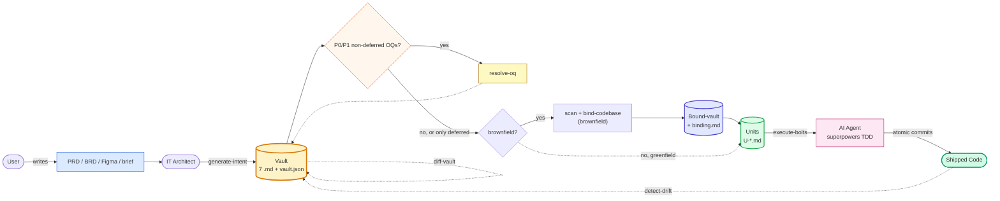

# Mega-SDD v1.1.0 — Alignment + Source-Code OQ Deferral Implementation Plan

> **For agentic workers:** REQUIRED SUB-SKILL: Use superpowers:subagent-driven-development (recommended) or superpowers:executing-plans to implement this plan task-by-task. Steps use checkbox (`- [ ]`) syntax for tracking.

**Goal:** Close audit findings F1-F8 from v1.0.1 README, add source-code OQ deferral semantic via resolve-oq 4-action menu + bind-codebase auto-resolution, extend vault-contract halt-protocol 3→8 structured types, align all skill paths and version to 1.1.0.

**Architecture:** Phased rollout enforces dependencies — Phase A lays schema/contract foundation (vault-contract halt-protocol, vault.json OQ schema, routing-rules); Phase B updates skill bodies to consume the new contracts; Phase C rewrites docs to match new reality; Phase D ships tests + version bump + tag.

**Tech Stack:** Markdown skills, YAML frontmatter, bash hook scripts, JSON manifests. No application runtime — plugin is content-driven. Tests are skill-triggering fixtures (manual walkthroughs) plus 2 automated shell tests carried over from v1.0.

**Spec reference:** `docs/superpowers/specs/2026-05-13-mega-sdd-v1.1-alignment-oq-deferral-design.md`

---

## File Structure

### Files to create

```
docs/superpowers/plans/2026-05-13-mega-sdd-v1.1-alignment-oq-deferral-plan.md   # this file
tests/skill-triggering/resolve-oq.test.md                                       # NEW fixture
```

### Files to modify

```
plugins/mega-sdd/skills/generate-intent/references/vault-contract.md            # halt-protocol schema extension
plugins/mega-sdd/skills/generate-intent/SKILL.md                                # --auto default path + vault.json OQ field guidance
plugins/mega-sdd/skills/orchestrate-flow/references/routing-rules.md            # intent-gate rule excludes deferred OQs
plugins/mega-sdd/skills/orchestrate-flow/SKILL.md                               # structured mode_migrate halt
plugins/mega-sdd/skills/resolve-oq/SKILL.md                                     # 4-action menu + --binding mode procedure
plugins/mega-sdd/skills/bind-codebase/SKILL.md                                  # deferred-OQ auto-resolution + path standardize + structured bind_conflict
plugins/mega-sdd/skills/bind-codebase/references/binding-contract.md            # auto-resolve section reference
plugins/mega-sdd/skills/generate-units/SKILL.md                                 # structured cycle_detected halt
plugins/mega-sdd/skills/execute-bolts/SKILL.md                                  # structured dep_missing + test_fail halts
plugins/mega-sdd/commands/detect-drift.md                                       # DRIFT.md → DRIFT-REPORT.md
plugins/mega-sdd/.claude-plugin/plugin.json                                     # version 1.0.0 → 1.1.0
.claude-plugin/marketplace.json                                                 # mega-sdd entry version → 1.1.0
README.md                                                                       # halt section, --chain removal, diagrams, skill count, drift wording, version
plugins/mega-sdd/README.md                                                      # version bump
CHANGELOG.md                                                                    # v1.1.0 entry prepended
tests/skill-triggering/bind-codebase.test.md                                    # add B6 + B7 deferred-OQ cases
```

### Phase dependency

```
Phase A (3 tasks) ───── Phase B (10 tasks) ───── Phase C (3 tasks) ───── Phase D (2 tasks + tag)
[schema layer]         [skill body consumes A]   [docs reflect B]        [tests + release]
```

Total: **~18 atomic commits**.

---

## Phase A — Schema + Contracts

Foundation tasks. All downstream phases depend on these. Each task is one commit.

---

### Task A1: Extend vault-contract.md §halt-protocol with 5 new types

**Files:**
- Modify: `plugins/mega-sdd/skills/generate-intent/references/vault-contract.md` (section `§halt-protocol`)

**Context:** The §halt-protocol section currently defines 3 blocker types (`oq_blocker`, `diff_conflict`, `drift_framework_mismatch`). v1.1 adds 5 more so the prose halts in bind/units/bolts/orchestrate become structured + inspectable.

- [ ] **Step 1: Read existing §halt-protocol section to locate it**

```bash
grep -n "halt-protocol\|halt_protocol\|blocker:" plugins/mega-sdd/skills/generate-intent/references/vault-contract.md | head -20
```

Expected: at least one `^## §halt-protocol` or similar header line. Note the line number.

- [ ] **Step 2: Read the full §halt-protocol section**

Read 40 lines starting from the header line found in Step 1 to understand the current schema.

- [ ] **Step 3: Edit §halt-protocol — replace `type:` enum**

Find the line declaring the type enum:

```
type: oq_blocker | diff_conflict | drift_framework_mismatch
```

Replace with:

```
type: oq_blocker | diff_conflict | drift_framework_mismatch | bind_conflict | dep_missing | test_fail | cycle_detected | mode_migrate
```

- [ ] **Step 4: Append type-specific schema blocks**

Add this content immediately after the existing type-specific schemas (preserve all existing schemas, append new ones):

```yaml
# bind_conflict — emitted by bind-codebase when CONFLICT count > 0
details:
  vault: <path>
  conflict_count: N
  conflicts:
    - id: C-001
      vault_claim: <text>
      codebase_reality: <text>
      suggested_action: KEEP_VAULT | KEEP_CODE | DEFER | SPLIT

# dep_missing — emitted by execute-bolts when superpowers AND vendored fallback both absent
details:
  required_skills: [executing-plans, subagent-driven-development, test-driven-development, using-git-worktrees]
  missing_real: [...]
  missing_vendored: [...]
  install_command: "/plugin install superpowers"

# test_fail — emitted by execute-bolts after max retries
details:
  unit_id: U-XXX
  retries_attempted: N
  test_command: <cmd>
  last_failure_output: <verbatim test output>
  files_touched: [...]

# cycle_detected — emitted by generate-units when dependency DAG has cycle
details:
  cycle_path: [U-001, U-002, U-001]

# mode_migrate — emitted by orchestrate-flow on vault.mode vs CWD signal mismatch
details:
  vault_mode: greenfield | existing
  cwd_signals: [.git, package.json, ...]
  resolution: "update vault mode" | "re-detect"
```

- [ ] **Step 5: Verify edit**

```bash
grep -c "type:" plugins/mega-sdd/skills/generate-intent/references/vault-contract.md
grep -E "bind_conflict|dep_missing|test_fail|cycle_detected|mode_migrate" plugins/mega-sdd/skills/generate-intent/references/vault-contract.md | wc -l
```

Expected: at least 1 `type:` line; at least 6 lines mentioning new type names (declaration + 5 schemas).

- [ ] **Step 6: Commit**

```bash
git add plugins/mega-sdd/skills/generate-intent/references/vault-contract.md
git commit -m "feat(v1.1): extend vault-contract §halt-protocol 3→8 structured types"
```

---

### Task A2: Document vault.json OQ schema extension

**Files:**
- Modify: `plugins/mega-sdd/skills/generate-intent/references/vault-contract.md` (vault.json schema section, or new section if needed)

**Context:** OQ entries in vault.json currently lack status tracking. v1.1 adds 5 new optional fields to support resolve-oq's 4-action menu.

- [ ] **Step 1: Locate vault.json schema section**

```bash
grep -n "vault.json\|oqs:\|OQ schema\|open_questions\|oq_schema" plugins/mega-sdd/skills/generate-intent/references/vault-contract.md | head -20
```

Note the section line number.

- [ ] **Step 2: Read the existing OQ schema definition**

Read the OQ schema section (15-30 lines from the header) to understand current field shape.

- [ ] **Step 3: Edit — add new optional fields**

In the OQ entry schema, append these fields after the existing fields. Use YAML-style annotations. The exact insertion point is after `text:` or similar existing field, before any closing structure:

```yaml
oqs:
  - id: OQ-DATA-001
    priority: P1 | P2 | P3
    section: <vault-filename.md>
    text: <question text>
    # NEW in v1.1 — additive, backwards compatible:
    status: pending | resolved | deferred | out-of-scope    # default: pending if absent
    # When status=resolved:
    resolved_at: <ISO8601 timestamp>
    resolution: <answer text>
    # When status=deferred:
    defer_to: binding                                       # only "binding" in v1.1
    deferred_at: <ISO8601 timestamp>
    deferred_reason: <optional explanation>
    # When status=out-of-scope:
    out_of_scope_reason: <text>
```

If the existing schema is in a code block, integrate the new fields cleanly within it. If the existing schema is described in prose, add a new sub-section titled "OQ status tracking (v1.1+)".

- [ ] **Step 4: Add backwards-compat note**

After the schema, add this note:

```markdown
**Backwards compatibility:** OQ entries without a `status` field are treated as `status: pending` by all skills. vault.json writers MAY omit `status` for pending OQs to minimize diff churn. Existing v1.0.x vaults load unchanged.
```

- [ ] **Step 5: Verify**

```bash
grep -E "status:|defer_to:|deferred_at:" plugins/mega-sdd/skills/generate-intent/references/vault-contract.md | wc -l
```

Expected: ≥ 3 lines.

- [ ] **Step 6: Commit**

```bash
git add plugins/mega-sdd/skills/generate-intent/references/vault-contract.md
git commit -m "feat(v1.1): vault.json OQ schema gains status/defer_to/deferred_* (additive)"
```

---

### Task A3: Update routing-rules.md intent gate to exclude deferred OQs

**Files:**
- Modify: `plugins/mega-sdd/skills/orchestrate-flow/references/routing-rules.md`

**Context:** Current rule `| Vault P0/P1 OQ count > 0 | resolve-oq first |` makes ALL P0/P1 OQs block the chain. After v1.1, deferred OQs should NOT block — they propagate to binding.

- [ ] **Step 1: Locate the P0/P1 OQ rule**

```bash
grep -n "P0/P1\|OQ count\|oq_p0_p1_count\|resolve-oq first" plugins/mega-sdd/skills/orchestrate-flow/references/routing-rules.md
```

Note the line number.

- [ ] **Step 2: Edit the rule**

Replace the line:

```
| Vault P0/P1 OQ count > 0 | resolve-oq first (before any other chain) |
```

With these two rules:

```
| Vault has unresolved P0/P1 OQs with status != deferred | resolve-oq first (intent gate, before any other chain) |
| Vault has only deferred P0/P1 OQs + brownfield context | scan-codebase → bind-codebase (which auto-resolves deferred OQs) |
```

- [ ] **Step 3: Update CWD inspection section if it counts OQs**

Search for the OQ counting step:

```bash
grep -n "oq_p0_p1_count\|count OQs\|P0/P1 count" plugins/mega-sdd/skills/orchestrate-flow/references/routing-rules.md
```

If found, update the counting logic note to specify: "Exclude OQs with `status: deferred` from the gating count. Track `deferred_count` separately for routing decisions."

If not found, append this note after the decision matrix:

```markdown
**OQ counting note (v1.1+):** When inspecting vault for P0/P1 OQ counts, distinguish:
- `pending_p0_p1_count`: OQs with `status: pending` (or status field absent) at P0/P1 priority. These gate the chain via the intent rule above.
- `deferred_p0_p1_count`: OQs with `status: deferred`. These do NOT gate; they propagate to binding phase.
```

- [ ] **Step 4: Verify**

```bash
grep "status != deferred\|status: deferred" plugins/mega-sdd/skills/orchestrate-flow/references/routing-rules.md
```

Expected: at least 2 matches (both rules updated).

- [ ] **Step 5: Commit**

```bash
git add plugins/mega-sdd/skills/orchestrate-flow/references/routing-rules.md
git commit -m "feat(v1.1): routing-rules intent gate excludes deferred OQs"
```

---

## Phase B — Skill Body Updates

10 tasks. Each consumes Phase A schema. Each is one atomic commit.

---

### Task B1: resolve-oq SKILL.md — 4-action menu

**Files:**
- Modify: `plugins/mega-sdd/skills/resolve-oq/SKILL.md`

**Context:** resolve-oq currently has a binary "answer or skip" menu. v1.1 adds 4 actions including the new "Defer to binding" option.

- [ ] **Step 1: Read the existing menu section**

```bash
grep -n "action\|choose\|menu\|per OQ\|Per-OQ" plugins/mega-sdd/skills/resolve-oq/SKILL.md | head -10
```

Identify the section that describes the user prompt per OQ.

- [ ] **Step 2: Locate the per-OQ procedure step**

Read the SKILL.md `Procedure` section. Find the step where the skill walks OQs and prompts the user.

- [ ] **Step 3: Replace per-OQ menu with 4-action version**

Update the relevant procedure step to use this menu format. If a similar step exists, rewrite it; otherwise insert new content:

```markdown
For each OQ presented (in priority order P0 → P1 → P2 → P3), display:

```
OQ-<DOC>-<NNN> (<priority>, section <filename>)
> <question text>

Choose action:
  [A] Answer now              — provide stakeholder resolution inline
  [B] Defer to binding        — code-dependent OQ; resolve at bind-codebase phase
  [C] Out of scope            — declare irrelevant to current spec
  [D] Skip                    — leave pending, decide later
```

**Conditional display of Option [B]:**

Option [B] appears ONLY when ALL of these are true:
- Vault `mode: existing` (brownfield)
- CWD has repo signals (any of `.git`, `package.json`, `composer.json`, `Cargo.toml`, `go.mod`, `pyproject.toml`)

In greenfield contexts OR when no repo signals detected, suppress Option [B] from the menu. The user sees only [A], [C], [D].

**Per-action state transitions:**

| Action | OQ field changes |
|---|---|
| A — Answer | `status: resolved`, `resolved_at: <now>`, `resolution: <answer text>` |
| B — Defer to binding | `status: deferred`, `defer_to: binding`, `deferred_at: <now>`, `deferred_reason: <optional user-provided text>` |
| C — Out of scope | `status: out-of-scope`, `out_of_scope_reason: <text>` |
| D — Skip | (no field changes; OQ remains pending) |

After action selection, write the field updates to `vault.json` immediately and append to the vault's changelog:
```
{ "event": "oq-resolved" | "oq-deferred" | "oq-out-of-scope", "id": "OQ-XXX", "at": "<iso>", "action": "A|B|C|D" }
```
```

- [ ] **Step 4: Update the "Hand-off" section**

In the Hand-off section, add this note:

```markdown
After completion, if any OQs were deferred to binding, suggest:
- For brownfield: `/mega-sdd:scan-codebase && /mega-sdd:bind-codebase <vault>` (binding will auto-resolve deferred OQs against codebase-map)
- For greenfield: warn user — deferred OQs in greenfield have no resolution path (no binding phase will run)
```

- [ ] **Step 5: Verify**

```bash
grep "Defer to binding\|status: deferred\|defer_to: binding" plugins/mega-sdd/skills/resolve-oq/SKILL.md | wc -l
```

Expected: ≥ 3 matches.

- [ ] **Step 6: Commit**

```bash
git add plugins/mega-sdd/skills/resolve-oq/SKILL.md
git commit -m "feat(v1.1): resolve-oq 4-action menu (Answer/Defer/OutOfScope/Skip)"
```

---

### Task B2: resolve-oq SKILL.md — --binding mode procedure

**Files:**
- Modify: `plugins/mega-sdd/skills/resolve-oq/SKILL.md`

**Context:** bind-codebase docs reference `/mega-sdd:resolve-oq --binding <binding.md>` but resolve-oq itself has no documented procedure for binding mode. v1.1 adds it.

- [ ] **Step 1: Locate insertion point**

Read the end of resolve-oq SKILL.md to find where to append the new section. The new section should sit after the existing Procedure section and before the Hand-off section, or as a new top-level section before Hand-off.

- [ ] **Step 2: Add the binding mode section**

Insert this content:

```markdown
## Binding mode (`--binding`)

**Invocation:** `/mega-sdd:resolve-oq --binding <path-to-binding.md>`

**Purpose:** Walk CONFLICT entries and propagated deferred-OQ entries from a `binding.md` file produced by `bind-codebase`. Updates resolutions back to `binding.md` + `vault.json` changelog.

**Procedure:**

1. **Load and parse binding.md.** Expect sections:
   - "## Confirmed Claims" (no action needed — informational)
   - "## Conflicts (N) — BLOCKING" with table columns: ID | Vault Claim | Codebase Reality | Resolution Needed
   - "## Open Questions (N)" — auto-propagated deferred OQs that couldn't be auto-resolved

2. **Walk Conflicts table.** For each conflict, present:

   ```
   C-NNN (BLOCKING)
   > Vault claim: <text from binding.md>
   > Codebase reality: <text from binding.md>

   Choose action:
     [K] KEEP_VAULT  — vault is correct; code patch will be required later
     [C] KEEP_CODE   — vault is wrong; patch vault inline to match code
     [D] DEFER       — downgrade CONFLICT to OQ; re-resolve later
     [S] SPLIT       — break vault claim into sub-claims (user provides splits)
   ```

   Per-action behavior:

   | Action | binding.md update | vault.json update |
   |---|---|---|
   | K — KEEP_VAULT | Mark conflict resolved as `CONFIRMED_PENDING_CODE_UPDATE` | Append changelog entry; vault claim unchanged |
   | C — KEEP_CODE | Mark conflict resolved as `vault patched` | Edit vault claim inline to match code; changelog entry |
   | D — DEFER | Move conflict to "Open Questions" table; tag as `deferred-binding` | Add new OQ entry (status=deferred, defer_to=binding); changelog |
   | S — SPLIT | Mark original conflict resolved; insert N sub-conflicts under it | For each sub-claim: edit vault to split; changelog |

3. **Walk Open Questions table.** For each propagated deferred-OQ, use the 4-action menu from the standard procedure section ABOVE, with **Option [B] Defer hidden** (already in binding context — nested deferral not supported in v1.1; re-binding flow is via re-running `bind-codebase`).

4. **Write back.** All resolutions persist to:
   - `binding.md` — conflict rows updated with resolution column; OQ rows updated with action
   - `vault.json` — append changelog: `{ "event": "resolve-oq-binding", "at": "<iso>", "summary": "N conflicts resolved, M OQs resolved" }`

5. **Hand-off.** After loop completes:
   - If any DEFER chosen → suggest `/mega-sdd:bind-codebase` re-run (deferred CONFLICTs become OQs in next bind pass)
   - If no DEFERs → all conflicts cleared, suggest `/mega-sdd:bind-codebase` re-run (now should produce bound-vault cleanly)

**Hard rails:**
- Never auto-resolve conflicts. Always user choice per row.
- Never modify code files. resolve-oq is read-only on the repo; KEEP_VAULT marks the conflict but does NOT patch code (that happens in execute-bolts later).
- Cycle protection: if `--binding` invoked but binding.md is malformed or empty, halt with helpful error.
```

- [ ] **Step 3: Verify**

```bash
grep -E "Binding mode|--binding|KEEP_VAULT|KEEP_CODE" plugins/mega-sdd/skills/resolve-oq/SKILL.md | wc -l
```

Expected: ≥ 5 matches.

- [ ] **Step 4: Commit**

```bash
git add plugins/mega-sdd/skills/resolve-oq/SKILL.md
git commit -m "feat(v1.1): resolve-oq adds --binding mode procedure"
```

---

### Task B3: bind-codebase SKILL.md — deferred-OQ auto-resolution flow

**Files:**
- Modify: `plugins/mega-sdd/skills/bind-codebase/SKILL.md`

**Context:** bind-codebase currently doesn't know about deferred OQs. v1.1 adds Step 2.5 that auto-resolves them against codebase-map.

- [ ] **Step 1: Locate the Procedure section steps**

```bash
grep -n "^##\|^### \|^[0-9]\+\." plugins/mega-sdd/skills/bind-codebase/SKILL.md | head -30
```

Identify the numbered step list (likely 1-6 per spec).

- [ ] **Step 2: Read Step 2 and Step 3 surrounding lines**

Read the SKILL.md around the verdict aggregation step (Step 2/3) to find the right insertion point. The new step 2.5 sits between current Step 2 (per-claim verdict) and Step 3 (aggregate counts).

- [ ] **Step 3: Insert Step 2.5**

After existing Step 2 (Per claim type, produce verdict), insert this new step:

```markdown
2.5. **Deferred-OQ auto-resolution.**

   For each OQ in the vault with `status: deferred` AND `defer_to: binding`:

   a. **Extract** the OQ text and section context.

   b. **Search codebase-map.md for evidence:**
      - If OQ mentions a specific entity name → search §3 (data models / schemas) for exact match
      - If OQ mentions an endpoint path → search §4 (routes / endpoints) for exact match
      - If OQ mentions a file path or symbol name → search §2 (public interfaces) for exact match
      - Otherwise → string-search across all map sections with conservative fuzzy threshold

   c. **High-confidence match** (single unambiguous hit):
      - Set OQ status: `resolved`
      - Set `resolved_at: <now>`
      - Set `resolution: "Auto-resolved by bind-codebase. Evidence: <codebase-map citation>"`
      - Append entry to `binding.md` under a "## Auto-Resolved Deferred OQs" section:
        ```
        | OQ-ID | Question | Evidence (codebase-map) | Status |
        |---|---|---|---|
        | OQ-DATA-001 | ... | §3 entry: User table line 42 | auto-resolved |
        ```

   d. **No match found OR ambiguous match** (multiple hits or low confidence):
      - Do NOT modify OQ status (remains `deferred`)
      - Propagate to `binding.md` under "## Open Questions" section:
        ```
        | ID | Question | Source vault section | Auto-resolve attempted |
        |---|---|---|---|
        | OQ-DATA-001 | ... | 03-data-model.md | no match found |
        ```
      - These get walked by user via `/mega-sdd:resolve-oq --binding <binding.md>`

   e. **Conservative threshold:** When in doubt, prefer falling back to manual resolution (d). Never silently auto-resolve a deferred OQ that could be wrong. The user trusts the citation in (c); never write an evidence string that doesn't exist in codebase-map.

   Update aggregate counts (claims_total / confirmed / conflict / oq) to include any newly auto-resolved deferred OQs in `confirmed`.
```

- [ ] **Step 4: Update Step 4 (Write binding.md) to include the new sections**

Find the binding.md template in Step 4 and add these section headers after the existing Confirmed/Conflicts/OQ sections:

```yaml
## Auto-Resolved Deferred OQs (N)
| OQ-ID | Question | Evidence (codebase-map) | Status |
|---|---|---|---|
...

## Open Questions (N)
| ID | Question | Source | Auto-resolve attempted |
|---|---|---|---|
...
```

(The "Open Questions" section may already exist for fresh OQs; ensure deferred-OQ propagation adds to it consistently.)

- [ ] **Step 5: Verify**

```bash
grep -E "deferred|Auto-Resolved|auto-resolve" plugins/mega-sdd/skills/bind-codebase/SKILL.md | wc -l
```

Expected: ≥ 4 matches.

- [ ] **Step 6: Commit**

```bash
git add plugins/mega-sdd/skills/bind-codebase/SKILL.md
git commit -m "feat(v1.1): bind-codebase auto-resolves deferred-binding OQs against codebase-map"
```

---

### Task B4: bind-codebase SKILL.md — standardize `<vault>-bound/` naming

**Files:**
- Modify: `plugins/mega-sdd/skills/bind-codebase/SKILL.md`

**Context:** Skill uses inconsistent naming for the bound-vault output dir. Audit F5 found "bound-vault/" (generic) vs "<vault>-bound/" (sibling pattern). Standardize on the sibling pattern.

- [ ] **Step 1: Find all bound-vault references**

```bash
grep -n "bound-vault\|<vault>-bound\|bound_vault" plugins/mega-sdd/skills/bind-codebase/SKILL.md
```

Note all line numbers.

- [ ] **Step 2: Replace generic "bound-vault/" with sibling pattern**

For each occurrence of standalone `bound-vault/` (NOT inside `<vault>-bound/` or `<name>-bound/` etc.), replace with the sibling pattern. Use Edit tool for precision:

Example replacements:
- `bound-vault/` → `<vault>-bound/` (in path contexts)
- `the bound-vault directory` → `the <vault>-bound/ sibling directory`
- `Outputs: bound-vault/` → `Outputs: <vault>-bound/ (sibling of vault dir)`

Keep references to "bound-vault" as a noun/concept (e.g., "the bound-vault concept" or "a clean bound-vault") — those are fine.

- [ ] **Step 3: Update Hand-off message**

If the Hand-off section says:

```
Bound-vault written to `bound-vault/`
```

Change to:

```
Bound-vault written to `<vault>-bound/` (sibling of vault directory)
```

- [ ] **Step 4: Verify**

```bash
# Should be ZERO occurrences of generic "bound-vault/" as a path (with trailing /)
# Allow occurrences without trailing slash (as concept noun)
grep -nE "(^|[^a-zA-Z<>])bound-vault/" plugins/mega-sdd/skills/bind-codebase/SKILL.md
```

Expected: no output (or only matches inside code examples that explicitly show the pattern).

- [ ] **Step 5: Commit**

```bash
git add plugins/mega-sdd/skills/bind-codebase/SKILL.md
git commit -m "refactor(v1.1): bind-codebase standardize <vault>-bound/ sibling pattern"
```

---

### Task B5: bind-codebase SKILL.md — structured `bind_conflict` halt

**Files:**
- Modify: `plugins/mega-sdd/skills/bind-codebase/SKILL.md`

**Context:** When CONFLICT count > 0, bind-codebase currently announces "BLOCKING" in prose. v1.1 emits structured blocker YAML per the extended halt-protocol schema.

- [ ] **Step 1: Find the blocking decision section**

```bash
grep -n "BLOCKING\|conflict > 0\|conflict_count\|emit\|blocker" plugins/mega-sdd/skills/bind-codebase/SKILL.md
```

Note the decision gate location (likely Step 5 per spec).

- [ ] **Step 2: Add structured emission**

Within the decision gate (Step 5 or equivalent), when conflict count > 0:

Add this content immediately after the existing "BLOCKING" announcement prose:

```markdown
**Emit structured halt per `vault-contract.md §halt-protocol`:**

```yaml
blocker:
  type: bind_conflict
  emitted_at: <ISO8601 timestamp>
  emitted_by: bind-codebase
  details:
    vault: <vault path>
    conflict_count: N
    conflicts:
      - id: C-001
        vault_claim: <verbatim from binding.md>
        codebase_reality: <verbatim from binding.md>
        suggested_action: KEEP_VAULT | KEEP_CODE | DEFER | SPLIT
      # ... one entry per conflict
  next_action: "Run /mega-sdd:resolve-oq --binding <binding.md>"
```

This YAML is the canonical halt artifact. Prose announcement remains for human readability; the structured form is for orchestrate-flow consumption and automation parsing.
```

- [ ] **Step 3: Verify**

```bash
grep -c "bind_conflict" plugins/mega-sdd/skills/bind-codebase/SKILL.md
```

Expected: ≥ 1.

- [ ] **Step 4: Commit**

```bash
git add plugins/mega-sdd/skills/bind-codebase/SKILL.md
git commit -m "feat(v1.1): bind-codebase emits structured bind_conflict halt YAML"
```

---

### Task B6: generate-intent SKILL.md — align --auto default path

**Files:**
- Modify: `plugins/mega-sdd/skills/generate-intent/SKILL.md`

**Context:** Audit F5 found SKILL.md says default is `./<slug>-spec/` but `commands/generate-intent.md` says `docs/mega-sdd/vaults/<auto-named>/`. Align to the canonical command spec.

- [ ] **Step 1: Find the --auto default path**

```bash
grep -n "default\|--auto\|<slug>-spec\|docs/mega-sdd/vaults" plugins/mega-sdd/skills/generate-intent/SKILL.md | head -10
```

- [ ] **Step 2: Replace path**

Find the line(s) that say something like:

```
--auto default output: ./<slug>-spec/
```

Replace with:

```
--auto default output: docs/mega-sdd/vaults/<slug>/
```

If there are multiple references, update all of them.

- [ ] **Step 3: Update Step 0 / Inputs section as needed**

If the Inputs section mentions output paths, align there too.

- [ ] **Step 4: Verify**

```bash
grep "slug-spec\|<slug>-spec" plugins/mega-sdd/skills/generate-intent/SKILL.md
grep "docs/mega-sdd/vaults" plugins/mega-sdd/skills/generate-intent/SKILL.md
```

Expected: no `<slug>-spec` matches; at least one `docs/mega-sdd/vaults` reference.

- [ ] **Step 5: Commit**

```bash
git add plugins/mega-sdd/skills/generate-intent/SKILL.md
git commit -m "fix(v1.1): generate-intent --auto default aligned to docs/mega-sdd/vaults/"
```

---

### Task B7: commands/detect-drift.md — DRIFT.md → DRIFT-REPORT.md

**Files:**
- Modify: `plugins/mega-sdd/commands/detect-drift.md`

**Context:** Audit F5: command says `DRIFT.md` but skill writes `DRIFT-REPORT.md`. Fix the command to match skill (source of truth).

- [ ] **Step 1: Find the offending line**

```bash
grep -n "DRIFT" plugins/mega-sdd/commands/detect-drift.md
```

- [ ] **Step 2: Replace**

Change:
```
Produce `DRIFT.md` with severity-tagged findings
```
(or whatever the exact phrasing is)

To:
```
Produce `DRIFT-REPORT.md` with confidence-rated findings
```

- [ ] **Step 3: Verify**

```bash
grep "DRIFT.md\b" plugins/mega-sdd/commands/detect-drift.md
grep "DRIFT-REPORT.md" plugins/mega-sdd/commands/detect-drift.md
```

Expected: zero matches for `DRIFT.md` (word-bounded); at least one for `DRIFT-REPORT.md`.

- [ ] **Step 4: Commit**

```bash
git add plugins/mega-sdd/commands/detect-drift.md
git commit -m "fix(v1.1): detect-drift command output is DRIFT-REPORT.md (matches skill)"
```

---

### Task B8: execute-bolts SKILL.md — structured dep_missing + test_fail halts

**Files:**
- Modify: `plugins/mega-sdd/skills/execute-bolts/SKILL.md`

**Context:** execute-bolts halts in prose for two cases: missing superpowers+vendored, and test failures after max retries. v1.1 emits structured YAML.

- [ ] **Step 1: Find pre-flight check and retry-fail sections**

```bash
grep -n "pre-flight\|dep\|missing\|retry\|max-retries\|test.*fail" plugins/mega-sdd/skills/execute-bolts/SKILL.md | head -20
```

Note line numbers for both sections.

- [ ] **Step 2: Add dep_missing structured halt**

In the pre-flight section where the skill halts on missing dependencies, add after the existing prose announcement:

```markdown
**Structured halt per `vault-contract.md §halt-protocol`:**

```yaml
blocker:
  type: dep_missing
  emitted_at: <ISO8601 timestamp>
  emitted_by: execute-bolts
  details:
    required_skills:
      - executing-plans
      - subagent-driven-development
      - test-driven-development
      - using-git-worktrees
    missing_real: <list of skills not found in real superpowers install>
    missing_vendored: <list of skills not found in _vendored/>
    install_command: "/plugin install superpowers"
  next_action: "Install superpowers (recommended) OR run: bash plugins/mega-sdd/scripts/sync-superpowers.sh"
```
```

- [ ] **Step 3: Add test_fail structured halt**

In the per-unit flow section where retries exhaust, add after the existing prose announcement:

```markdown
**Structured halt per `vault-contract.md §halt-protocol`:**

```yaml
blocker:
  type: test_fail
  emitted_at: <ISO8601 timestamp>
  emitted_by: execute-bolts
  details:
    unit_id: U-XXX
    retries_attempted: <N, default 3>
    test_command: <exact command run>
    last_failure_output: |
      <verbatim output of last failing test invocation>
    files_touched:
      - <list of files touched during the attempts>
  next_action: "Review bolt-report.md; edit unit acceptance criteria, fix code manually, or skip via --force"
```
```

- [ ] **Step 4: Verify**

```bash
grep -c "dep_missing\|test_fail" plugins/mega-sdd/skills/execute-bolts/SKILL.md
```

Expected: ≥ 2.

- [ ] **Step 5: Commit**

```bash
git add plugins/mega-sdd/skills/execute-bolts/SKILL.md
git commit -m "feat(v1.1): execute-bolts emits structured dep_missing + test_fail halts"
```

---

### Task B9: generate-units SKILL.md — structured cycle_detected halt

**Files:**
- Modify: `plugins/mega-sdd/skills/generate-units/SKILL.md`

**Context:** Cycle detection in Step 4 currently halts in prose. v1.1 emits structured YAML.

- [ ] **Step 1: Find the cycle detection section**

```bash
grep -n "cycle\|Cycle\|DAG\|dependency graph" plugins/mega-sdd/skills/generate-units/SKILL.md
```

- [ ] **Step 2: Add structured halt**

In Step 4 (Resolve dependency graph), where the cycle is detected, after the existing prose announcement, add:

```markdown
**Structured halt per `vault-contract.md §halt-protocol`:**

```yaml
blocker:
  type: cycle_detected
  emitted_at: <ISO8601 timestamp>
  emitted_by: generate-units
  details:
    cycle_path: [U-001, U-002, ..., U-001]  # node sequence forming the cycle
  next_action: "Restructure vault sections so unit dependencies form a DAG (no back-edges)"
```
```

- [ ] **Step 3: Verify**

```bash
grep -c "cycle_detected" plugins/mega-sdd/skills/generate-units/SKILL.md
```

Expected: ≥ 1.

- [ ] **Step 4: Commit**

```bash
git add plugins/mega-sdd/skills/generate-units/SKILL.md
git commit -m "feat(v1.1): generate-units emits structured cycle_detected halt"
```

---

### Task B10: orchestrate-flow SKILL.md — structured mode_migrate halt

**Files:**
- Modify: `plugins/mega-sdd/skills/orchestrate-flow/SKILL.md`

**Context:** Mode-migration halt currently in prose. v1.1 emits structured YAML.

- [ ] **Step 1: Find the mode-migration section**

```bash
grep -n "mode-migrate\|mode_migrate\|vault.mode\|mode_inferred" plugins/mega-sdd/skills/orchestrate-flow/SKILL.md
```

- [ ] **Step 2: Add structured halt**

When CWD signals don't match vault.mode, after the existing prose announcement, add:

```markdown
**Structured halt per `vault-contract.md §halt-protocol`:**

```yaml
blocker:
  type: mode_migrate
  emitted_at: <ISO8601 timestamp>
  emitted_by: orchestrate-flow
  details:
    vault_mode: greenfield | existing  # what vault.json says
    cwd_signals: [.git, package.json, ...]  # what was detected
    resolution: "update vault.mode to match CWD" | "re-detect by moving to clean dir"
  next_action: "Confirm correct mode then re-run /mega-sdd:orchestrate-flow"
```
```

- [ ] **Step 3: Verify**

```bash
grep -c "mode_migrate" plugins/mega-sdd/skills/orchestrate-flow/SKILL.md
```

Expected: ≥ 1.

- [ ] **Step 4: Commit**

```bash
git add plugins/mega-sdd/skills/orchestrate-flow/SKILL.md
git commit -m "feat(v1.1): orchestrate-flow emits structured mode_migrate halt"
```

---

## Phase C — Documentation

Three tasks. README + CHANGELOG rewrites to reflect Phase B reality.

---

### Task C1: Root README — halt section, --chain removal, diagram intent-gate, skill count, drift wording

**Files:**
- Modify: `README.md` (repo root)

**Context:** Audit F1, F2, F3, F6, F8 all require README edits. Bundle them into one commit since they're tightly coupled.

- [ ] **Step 1: Read current README structure**

```bash
grep -n "^## \|^### " README.md
```

Identify section line numbers for: Halt protocol, Procedure cheat-sheet, Skills + commands, Pipeline (actor flow), Pipeline (detailed), Anti-hallucination defense.

- [ ] **Step 2: Edit — Halt protocol section (Audit F1)**

Find the "Halt protocol (across all skills)" section. Replace the list with the new 8-type list:

```markdown
## Halt protocol (across all skills)

Any skill MAY emit a structured `blocker` artifact (YAML, per `vault-contract.md §halt-protocol`) and pause the pipeline. The user MUST acknowledge before the chain continues. The 8 types are:

- `oq_blocker` — `generate-intent` on P1 OQ surfaced in `--auto` mode
- `diff_conflict` — `diff-vault` on new PRD vs resolved-OQ/ADR contradiction
- `drift_framework_mismatch` — `detect-drift` on vault/code framework signal mismatch
- `bind_conflict` — `bind-codebase` on CONFLICT count > 0
- `dep_missing` — `execute-bolts` missing superpowers + vendored fallback
- `test_fail` — `execute-bolts` acceptance test fails after max retries
- `cycle_detected` — `generate-units` dependency DAG has a cycle
- `mode_migrate` — `orchestrate-flow` CWD signals contradict vault.mode

Blockers are surfaced verbatim with `next_action` suggestions. Pipeline never silently skips.
```

- [ ] **Step 3: Edit — Procedure cheat-sheet remove --chain (Audit F2)**

Find the cheat-sheet table. Replace the row:

```
| New idea → working code (greenfield, fully autonomous) | `/mega-sdd:generate-intent --from-prompt "..." --chain` |
```

With:

```
| New idea → working code (greenfield, fully autonomous) | `/mega-sdd:generate-intent --from-prompt "..."` then `/mega-sdd:orchestrate-flow` |
```

Also search for any other `--chain` references in the README:

```bash
grep -n "--chain" README.md
```

Remove all of them — `--chain` was hallucinated.

- [ ] **Step 4: Edit — Add resolve-oq intent-gate row to cheat-sheet (Audit F6 part 1)**

Insert this new row in the Procedure cheat-sheet table (right after the "Existing PRD → working code" row):

```
| Vault has unresolved P0/P1 OQs (non-deferred) | `/mega-sdd:resolve-oq` (intent gate before scan/bind/units) |
```

- [ ] **Step 5: Edit — Move update-plugin out of skills table (Audit F3)**

In the "Skills + commands in this plugin" section, find the row for `update-plugin`:

```
| `/mega-sdd:update-plugin` | **update-plugin** (v1.0, bash) | Plugin maintenance...
```

Remove this row from the table. Then immediately after the table, add this footnote:

```markdown
> **Note on `update-plugin`:** Implemented as a command-only entry (no backing SKILL.md) — a self-contained bash procedure under `commands/update-plugin.md`. It's not counted in the skill total.
```

Update any other table/text mentions to reflect "10 skills + 1 command-only".

- [ ] **Step 6: Edit — Repository structure section skill count (Audit F3 part 2)**

Find the "Repository structure" tree in the README. Update the skills comment line:

```diff
- │   ├── skills/                       # 11 skills (5 new SDD + 5 renamed + 1 anchor) + _vendored/
+ │   ├── skills/                       # 10 skills (5 new SDD + 4 renamed + 1 anchor) + _vendored/
```

Note: 11 → 10 because update-plugin is now command-only. The 5 renamed becomes 4 because update-plugin was one of the 5 (now removed from skill count).

Verify the new count by listing:

```bash
ls -d plugins/mega-sdd/skills/*/ | grep -v _vendored | wc -l
```

Expected: 10.

- [ ] **Step 7: Edit — Anti-hallucination defense layer 4 wording (Audit F8)**

Find the "Anti-hallucination defense (4 layers)" section. Update layer 4:

```diff
- 4. **Drift detection** — code vs vault reconciliation runs post-bolt and on demand.
+ 4. **Drift detection** — code vs vault reconciliation suggested post-bolt; runs on demand via `/mega-sdd:detect-drift`.
```

- [ ] **Step 8: Edit — Mermaid actor flow diagram add intent-gate (Audit F6 part 2)**

Find the first Mermaid block (the actor flow `flowchart LR`). Locate the existing `Vault -.->|resolve-oq| Vault` line. Replace that section with:



- [ ] **Step 9: Edit — Mermaid detailed pipeline diagram add intent-gate (Audit F6 part 3)**

Find the second Mermaid block (the detailed pipeline `flowchart TD`). After the existing `V --> C{brownfield?}` line, insert an intent-gate decision before that:

Replace this section:

```
B --> V[(vault/<br/>7 files + vault.json)]

V --> C{brownfield?}
```

With:

```
B --> V[(vault/<br/>7 files + vault.json)]

V --> OQG{P0/P1 non-deferred OQs?}
OQG -->|yes| RO[resolve-oq] --> V
OQG -->|no| C{brownfield?}
```

Also add `RO` to the `phase` classDef:

```diff
- class B,S,BI,GU,E,DD,DV,RO phase
+ class B,S,BI,GU,E,DD,DV,RO,OQG phase
```

(RO already there; just add OQG to classify it as a decision phase.)

Update the existing `DD -.drift found.-> RO[resolve-oq]` line if it references RO inconsistently — RO is now the same node as the one used in intent gate.

- [ ] **Step 10: Edit — Version bump in README header**

Find the centered header block at top:

```
**Plugin:** `mega-sdd` · **Version:** 1.0.1 · **License:** MIT
```

Change `1.0.1` to `1.1.0`.

- [ ] **Step 11: Verify all edits**

```bash
# F1: 8 types listed
grep -E "oq_blocker|bind_conflict|dep_missing|test_fail|cycle_detected|mode_migrate|drift_framework_mismatch|diff_conflict" README.md | wc -l
# Expected: ≥ 8

# F2: no --chain references
grep "\-\-chain" README.md
# Expected: empty

# F3: update-plugin not in skills table (only in footnote)
grep "update-plugin" README.md | grep -v "^>"
# Expected: 0-1 lines (only the footnote reference)

# F6: intent gate in diagrams
grep "OQGate\|OQG\|non-deferred OQs" README.md
# Expected: ≥ 2 matches

# F8: drift wording updated
grep "suggested post-bolt\|runs on demand via" README.md
# Expected: ≥ 1

# Version
grep "Version:" README.md | head -3
# Expected: 1.1.0
```

- [ ] **Step 12: Commit**

```bash
git add README.md
git commit -m "$(cat <<'EOF'
docs(v1.1): root README aligned to skill reality

Closes audit findings F1, F2, F3, F6, F8:
- Halt protocol section lists 8 real structured types
- All --chain references removed (flag was hallucinated)
- update-plugin moved to footnote (command-only, no SKILL.md)
- Skill count corrected: 10 skills + 1 command-only
- Both Mermaid diagrams add P0/P1 non-deferred intent-gate decision node
- Anti-hallucination layer 4 wording: "runs post-bolt" → "suggested post-bolt"
- Header version bumped to 1.1.0
EOF
)"
```

---

### Task C2: Plugin README — version bump

**Files:**
- Modify: `plugins/mega-sdd/README.md`

**Context:** Plugin folder README is a slim pointer; only the version line needs updating.

- [ ] **Step 1: Find and update version**

```bash
grep -n "1.0.1\|Version" plugins/mega-sdd/README.md | head -3
```

Replace `Version:** 1.0.1` with `Version:** 1.1.0`.

- [ ] **Step 2: Verify**

```bash
grep "Version" plugins/mega-sdd/README.md
```

Expected: shows `Version:** 1.1.0`.

- [ ] **Step 3: Commit**

```bash
git add plugins/mega-sdd/README.md
git commit -m "docs(v1.1): plugin README version 1.0.1 → 1.1.0"
```

---

### Task C3: CHANGELOG.md — v1.1.0 entry

**Files:**
- Modify: `CHANGELOG.md` (prepend new entry at top, preserving existing entries)

- [ ] **Step 1: Read top of CHANGELOG to find insertion point**

```bash
head -15 CHANGELOG.md
```

The new v1.1.0 entry goes immediately above the existing `## [1.0.0]` (or v1.0.1 if there's an interim one) entry, after any header block.

- [ ] **Step 2: Prepend the entry**

Insert this content above the most recent existing version entry:

```markdown
## [1.1.0] — 2026-05-13

### Added — Source-code OQ deferral + structured halt protocol

- **resolve-oq 4-action menu** — Per OQ: Answer / Defer-to-binding / Out-of-scope / Skip. Defer option appears only in brownfield context (vault.mode=existing AND repo signals present).
- **resolve-oq `--binding` mode** — Procedure documented for walking CONFLICT + propagated deferred-OQ entries from `binding.md`. Per-conflict actions: KEEP_VAULT / KEEP_CODE / DEFER / SPLIT.
- **bind-codebase auto-resolution** — Deferred-binding OQs auto-resolve against codebase-map evidence (high-confidence single match); else propagate to `binding.md` Open Questions for user resolution via `resolve-oq --binding`.
- **vault-contract §halt-protocol** extended 3 → 8 structured types: + `bind_conflict`, `dep_missing`, `test_fail`, `cycle_detected`, `mode_migrate`.
- **routing-rules.md** intent gate excludes deferred OQs (`Vault has unresolved P0/P1 OQs with status != deferred` — deferred propagate to binding).

### Changed — Skill alignment

- **vault.json OQ schema** gains optional fields: `status` (pending|resolved|deferred|out-of-scope), `defer_to`, `deferred_at`, `deferred_reason`, `out_of_scope_reason`. Backwards compatible — absent `status` treated as `pending`.
- **bind-codebase SKILL.md** standardizes `<vault>-bound/` sibling naming throughout (was mixed with generic `bound-vault/`).
- **generate-intent SKILL.md** `--auto` default output path aligned to `docs/mega-sdd/vaults/<slug>/` (was `./<slug>-spec/`).
- **commands/detect-drift.md** output filename corrected to `DRIFT-REPORT.md` (matches skill SKILL.md).
- **bind-codebase, execute-bolts, generate-units, orchestrate-flow** emit structured halt YAML per §halt-protocol (was prose-only).

### Fixed — README defects (audit findings F1-F8)

- Halt protocol section: 5 fabricated types replaced with the now-real 8-type list.
- `--chain` flag references removed (3 spots in cheat-sheet) — flag never existed.
- `update-plugin` moved from skills table to commands footnote (no backing SKILL.md).
- Skill count "11" corrected to "10 + 1 command-only".
- Plugin version aligned across `plugin.json`, marketplace.json, and both READMEs.
- Both diagrams add `{P0/P1 non-deferred OQs?}` intent-gate decision node visible in actor flow + detailed pipeline.
- Defense layer 4 wording: "runs post-bolt" → "suggested post-bolt; runs on demand".

### Migration

Fully backwards compatible. Existing v1.0.x vaults load without conversion. To benefit from new resolve-oq actions, re-invoke `resolve-oq` on existing vaults — 4-action menu appears for any pending OQ.

### Marketplace

- `mega-sdd@1.1.0` published
- `grand-design-spec@0.16.0` continues deprecated; removed at v1.2.0 per existing schedule

```

- [ ] **Step 3: Verify**

```bash
head -50 CHANGELOG.md | grep -E "## \[1\.\d+"
```

Expected: `## [1.1.0]` appears before `## [1.0.0]`.

- [ ] **Step 4: Commit**

```bash
git add CHANGELOG.md
git commit -m "docs(v1.1): CHANGELOG entry for v1.1.0 alignment + OQ deferral"
```

---

## Phase D — Tests + Release

Two commits + tag.

---

### Task D1: Skill-triggering tests — resolve-oq fixture + bind-codebase deferred cases

**Files:**
- Create: `tests/skill-triggering/resolve-oq.test.md`
- Modify: `tests/skill-triggering/bind-codebase.test.md`

- [ ] **Step 1: Create resolve-oq fixture**

Write `tests/skill-triggering/resolve-oq.test.md`:

```markdown
# resolve-oq Trigger + Behavior Test

Manual-run fixture for the `resolve-oq` skill.

## Trigger cases

### R1: Explicit standalone (intent mode)
- **Prompt:** `/mega-sdd:resolve-oq`
- **Expect:** Skill invocation; walks OQs from vault in CWD (auto-detect vault dir)

### R2: Explicit with vault path
- **Prompt:** `/mega-sdd:resolve-oq ./docs/mega-sdd/vaults/my-app`
- **Expect:** Walks OQs from the specified vault

### R3: Binding mode
- **Prompt:** `/mega-sdd:resolve-oq --binding ./vaults/v1-bound/binding.md`
- **Expect:** Walks CONFLICT + Open Questions entries from binding.md

### R4: Natural English
- **Prompt:** `resolve open questions`
- **Expect:** Skill invocation

### R5: Natural Indonesian
- **Prompt:** `jawab OQ list`
- **Expect:** Skill invocation

### R6: Auto-route from orchestrate-flow (intent gate)
- **Setup:** vault has 2 P1 OQs, status=pending
- **Prompt:** `/mega-sdd:orchestrate-flow`
- **Expect:** Flow proposes resolve-oq first (before scan/bind/units)

### R7: Auto-route hidden when only deferred OQs
- **Setup:** vault has 2 P1 OQs, all status=deferred, mode=existing, .git present
- **Prompt:** `/mega-sdd:orchestrate-flow`
- **Expect:** Flow proposes scan-codebase next (deferred OQs do NOT gate the chain)

## Behavior — 4-action menu

### B1: All 4 options offered (brownfield)
- **Setup:** vault.mode=existing AND .git present
- **Expect:** Per OQ, options [A] Answer / [B] Defer / [C] Out-of-scope / [D] Skip shown

### B2: Defer option hidden (greenfield)
- **Setup:** vault.mode=greenfield
- **Expect:** Per OQ, only options [A] / [C] / [D] shown

### B3: Defer option hidden (no repo signals)
- **Setup:** vault.mode=existing but CWD has no .git/package.json/etc.
- **Expect:** Only options [A] / [C] / [D] shown; skill warns user about the mode/CWD mismatch

### B4: State transitions per action
- **[A] Answer** → OQ becomes `status: resolved`, `resolved_at: <iso>`, `resolution: <text>`
- **[B] Defer to binding** → `status: deferred`, `defer_to: binding`, `deferred_at: <iso>`, optional `deferred_reason`
- **[C] Out of scope** → `status: out-of-scope`, `out_of_scope_reason: <text>`
- **[D] Skip** → no field change; OQ remains pending

### B5: Vault.json changelog appended
- **After any action:** vault.json gets a new changelog entry: `{ "event": "oq-<action>", "id": "OQ-XXX", "at": "<iso>", "action": "A|B|C|D" }`

## Behavior — --binding mode

### BM1: Walks conflicts
- **Setup:** binding.md has 2 CONFLICT rows
- **Expect:** Skill prompts per conflict with [K] KEEP_VAULT / [C] KEEP_CODE / [D] DEFER / [S] SPLIT

### BM2: Walks propagated deferred OQs
- **Setup:** binding.md has 1 CONFLICT + 2 Open Questions rows
- **Expect:** Skill walks CONFLICTs first, then OQs (with 4-action menu, Option B hidden because nested deferral not supported)

### BM3: Resolutions persist
- **After resolving 1 conflict + 1 OQ:** binding.md updated, vault.json changelog entry added

### BM4: Hand-off after binding mode
- **After loop:** suggests `/mega-sdd:bind-codebase` re-run (since conflicts now resolved)

## Pass criteria

All R1-R7 invoke skill correctly. 4-action menu obeys brownfield/greenfield/repo-signal conditions. State transitions match B4. Binding mode walks conflicts and OQs per BM1-BM3.
```

- [ ] **Step 2: Append deferred-OQ cases to bind-codebase fixture**

Read existing `tests/skill-triggering/bind-codebase.test.md` to find the existing behavior checks section.

Append after the existing B1-B5 cases (or wherever existing behavior cases live):

```markdown
### B6: Deferred-OQ auto-resolution (v1.1+)
- **Setup:** vault has OQ-X with `status: deferred, defer_to: binding`, AND codebase-map.md has an exact unambiguous match for the entity/endpoint/file referenced in OQ-X.text
- **Run:** `/mega-sdd:bind-codebase ./vault`
- **Expect:**
  - `binding.md` has a "## Auto-Resolved Deferred OQs" section listing OQ-X with evidence citation
  - vault.json: OQ-X is now `status: resolved`, has `resolved_at` and `resolution` (citing evidence)
  - aggregate counts: OQ-X is included in `confirmed`, not in `oq`

### B7: Deferred-OQ propagation when no match
- **Setup:** vault has OQ-Y with `status: deferred, defer_to: binding`, AND codebase-map.md has NO evidence for it
- **Run:** `/mega-sdd:bind-codebase ./vault`
- **Expect:**
  - `binding.md` has "## Open Questions" section with OQ-Y as a row
  - vault.json: OQ-Y still `status: deferred` (unchanged)
  - Hand-off message suggests `/mega-sdd:resolve-oq --binding`

### B8: Mixed deferred + CONFLICT scenario
- **Setup:** vault has 1 OQ deferred (auto-resolves) + 1 OQ deferred (propagates) + 1 vault claim that conflicts with code
- **Expect:**
  - `bound-vault/` NOT produced (CONFLICT blocks)
  - binding.md has all three sections: Auto-Resolved Deferred OQs (1), Open Questions (1), Conflicts (1, BLOCKING)
  - Hand-off points to `resolve-oq --binding`
```

- [ ] **Step 3: Verify both files**

```bash
[ -f tests/skill-triggering/resolve-oq.test.md ] && echo "resolve-oq test exists"
grep -c "^### " tests/skill-triggering/resolve-oq.test.md
# Expected: ≥ 15 cases (R1-R7 + B1-B5 + BM1-BM4)

grep -E "B[678]:" tests/skill-triggering/bind-codebase.test.md
# Expected: B6, B7, B8 lines visible
```

- [ ] **Step 4: Commit**

```bash
git add tests/skill-triggering/resolve-oq.test.md tests/skill-triggering/bind-codebase.test.md
git commit -m "test(v1.1): resolve-oq fixture + bind-codebase deferred-OQ cases"
```

---

### Task D2: Version bump + tag

**Files:**
- Modify: `plugins/mega-sdd/.claude-plugin/plugin.json`
- Modify: `.claude-plugin/marketplace.json` (mega-sdd entry version)

- [ ] **Step 1: Bump plugin.json**

Read current:
```bash
cat plugins/mega-sdd/.claude-plugin/plugin.json | grep version
```

Should currently show `"version": "1.0.0"`. Edit to `"version": "1.1.0"`.

- [ ] **Step 2: Bump marketplace.json mega-sdd entry**

Read current:
```bash
jq '.plugins[] | select(.name == "mega-sdd") | .version' .claude-plugin/marketplace.json
```

Should currently show `"1.0.0"`. Edit the mega-sdd entry version to `"1.1.0"`.

DO NOT modify the deprecated `grand-design-spec` entry — its version stays at 0.16.0.

- [ ] **Step 3: Validate JSONs**

```bash
jq . plugins/mega-sdd/.claude-plugin/plugin.json > /dev/null && echo "plugin.json valid"
jq . .claude-plugin/marketplace.json > /dev/null && echo "marketplace.json valid"
```

Expected: both `valid` lines.

- [ ] **Step 4: Commit**

```bash
git add plugins/mega-sdd/.claude-plugin/plugin.json .claude-plugin/marketplace.json
git commit -m "chore(v1.1): bump plugin + marketplace to 1.1.0"
```

- [ ] **Step 5: Tag**

```bash
git tag -a v1.1.0 -m "Mega-SDD v1.1.0 — alignment + source-code OQ deferral

Closes audit findings F1-F8 from v1.0.1 README. Adds:
- resolve-oq 4-action menu (Answer/Defer/OutOfScope/Skip)
- resolve-oq --binding mode procedure for walking CONFLICT + OQ entries
- bind-codebase auto-resolves deferred-binding OQs via codebase-map evidence
- vault-contract §halt-protocol extended 3 → 8 structured types
- vault.json OQ schema gains status/defer_to/deferred_* fields (additive, backwards compat)
- routing-rules intent gate excludes deferred OQs
- README diagrams add intent-gate decision node
- Path standardization across bind-codebase, generate-intent, detect-drift

Fully backwards compatible with v1.0.x vaults."
```

- [ ] **Step 6: Verify tag**

```bash
git tag -l "v1.1.0" -n5
```

Expected: tag listed with annotation visible.

- [ ] **Step 7: Push (only after user confirms)**

⚠️ **DO NOT PUSH** without explicit user authorization. After tagging locally, report to user and wait for "push" confirmation. The push command is:

```bash
git push origin main && git push origin v1.1.0
```

---

## Self-Review

### Spec coverage check

Mapping each spec section to implementing tasks:

| Spec section | Implementing tasks |
|---|---|
| §4.1 vault-contract halt-protocol extension | A1 |
| §4.2 vault.json OQ schema extension | A2 |
| §4.3 routing-rules update | A3 |
| §5.1.1 4-action menu | B1 |
| §5.1.2 --binding mode procedure | B2 |
| §5.2 bind-codebase deferred-OQ auto-resolution | B3 |
| §5.2 standardize <vault>-bound/ path | B4 |
| §5.3 generate-intent path align | B6 |
| §5.4 detect-drift command filename | B7 |
| §5.5.1 bind_conflict structured halt | B5 |
| §5.5.2 dep_missing + test_fail structured halts | B8 |
| §5.5.3 cycle_detected structured halt | B9 |
| §5.5.4 mode_migrate structured halt | B10 |
| §6.1.1 Halt protocol section rewrite | C1 step 2 |
| §6.1.2 Cheat-sheet remove --chain | C1 step 3 |
| §6.1.3 update-plugin reclassification | C1 step 5-6 |
| §6.1.4 Diagrams add intent-gate | C1 step 8-9 |
| §6.1.5 Defense layer 4 wording | C1 step 7 |
| §6.2 Plugin README version | C2 |
| §6.3 CHANGELOG entry | C3 |
| §7.1 Test fixtures | D1 |
| §7.2 Version bump + tag | D2 |

All 22 spec items covered. ✅

### Placeholder scan

Searched the plan for placeholder patterns:
- No "TBD" / "TODO" / "implement later"
- All YAML schemas show concrete example values (with `<...>` as standard template placeholder syntax for templates; these are NOT plan failures since the engineer will fill them at runtime per documented contract)
- All code blocks show complete content the engineer copies
- No "Add appropriate error handling" or similar
- No "Similar to Task N" references — each task is self-contained

✅ Clean.

### Type consistency

Cross-task type/name checks:
- `status` field values consistent: `pending | resolved | deferred | out-of-scope` (A2, B1, B3, D1) ✅
- `defer_to: binding` constant string (A2, B1, B3) ✅
- 5 new blocker types: `bind_conflict`, `dep_missing`, `test_fail`, `cycle_detected`, `mode_migrate` — consistent across A1, B5, B8, B9, B10, C1 ✅
- Path `docs/mega-sdd/vaults/<slug>/` consistent (B6 establishes; referenced in spec) ✅
- `<vault>-bound/` sibling pattern (B4 establishes) ✅
- `DRIFT-REPORT.md` filename (B7 corrects) ✅
- Version `1.1.0` consistent (C1 step 10, C2, D2) ✅

✅ No drift between tasks.

---

## Execution Handoff

Plan complete and saved to `docs/superpowers/plans/2026-05-13-mega-sdd-v1.1-alignment-oq-deferral-plan.md`.

**18 tasks across 4 phases. Estimated ~3-5 hours of focused work (each task 5-15 min).**

### Two execution options:

**1. Subagent-Driven (recommended)** — Dispatch a fresh subagent per task (or per phase for related tasks) via `superpowers:subagent-driven-development`. Two-stage review between dispatches. Fast iteration, isolated context per task.

**2. Inline Execution** — Execute tasks in current session via `superpowers:executing-plans`. Batch execution with checkpoints for review.

**Which approach?**
