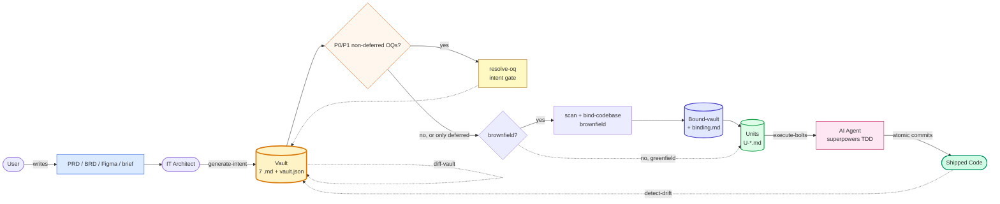
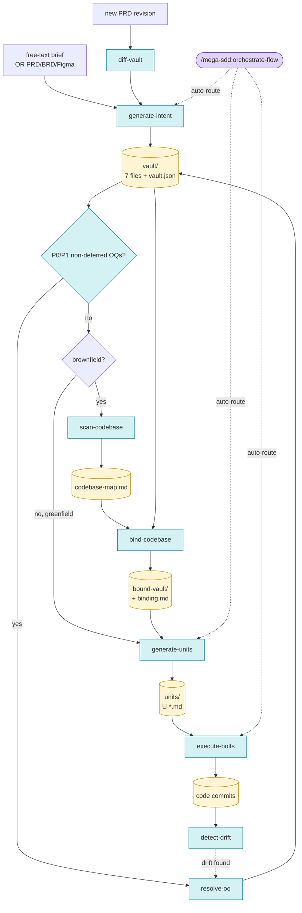

# Mega-SDD v1.2.0 — Tiered Surface + Mode Auto-Detect Implementation Plan

> **For agentic workers:** REQUIRED SUB-SKILL: Use superpowers:subagent-driven-development (recommended) or superpowers:executing-plans to implement this plan task-by-task. Steps use checkbox (`- [ ]`) syntax for tracking.

**Goal:** Reduce first-contact cognitive load. `generate-intent` auto-detects Mode A (PRD path) vs Mode B (free-text brief) from positional argument shape. Root README restructures into tiered surface with TL;DR + Primary commands visible (≤150 lines) and detailed/advanced content behind `<details>` collapse.

**Architecture:** Two complementary changes — (1) one small skill behavior addition (auto-detect via 6 deterministic rules) and (2) a content reorganization of the root and plugin READMEs. No architectural changes. Backwards compatible — all existing invocations and content preserved.

**Tech Stack:** Markdown skills + commands, GitLab/GitHub-flavored markdown with `<details>` collapse blocks, Mermaid diagrams.

**Spec reference:** `docs/superpowers/specs/2026-05-13-mega-sdd-v1.2-tiered-surface-design.md`

---

## File Structure

### Files to create

```
docs/superpowers/plans/2026-05-13-mega-sdd-v1.2-tiered-surface-plan.md  # this file
```

(No new skill files. New test fixture section appended to existing file.)

### Files to modify

```
plugins/mega-sdd/skills/generate-intent/SKILL.md        # Add Detection rules + Edge cases sub-sections
plugins/mega-sdd/commands/generate-intent.md            # Update Mode resolution + argument-hint
tests/skill-triggering/generate-intent.test.md          # Append Mode auto-detect cases section
README.md                                               # Tiered restructure (root)
plugins/mega-sdd/README.md                              # Slim tiered mirror
CHANGELOG.md                                            # Prepend v1.2.0 entry
plugins/mega-sdd/.claude-plugin/plugin.json             # version 1.1.0 → 1.2.0
.claude-plugin/marketplace.json                         # mega-sdd entry 1.1.0 → 1.2.0
```

### Phase dependency

```
Phase A (auto-detect, 3 tasks) ──┐
                                 ├─→ Phase C (release, 2 tasks + tag)
Phase B (README restructure, 2) ─┘
```

Phases A and B are **independent** of each other (skill change vs doc reorganization). Phase C depends on both. They could be done in parallel by separate subagents if desired, but sequential is also fine.

Total: **7 atomic commits + 1 tag**.

---

## Phase A — Mode auto-detect

3 atomic commits. Skill behavior gains: auto-detect Mode A vs B from positional argument shape, with `--from-prompt` flag preserved for explicit override.

---

### Task A1: generate-intent SKILL.md — Detection rules + Edge cases

**Files:**
- Modify: `plugins/mega-sdd/skills/generate-intent/SKILL.md`

**Context:** Current SKILL.md (post v1.0) has an "Invocation modes" section that describes Mode A (structured PRD) and Mode B (`--from-prompt` free-text). v1.2 adds auto-detection: positional argument shape determines mode without needing `--from-prompt`.

- [ ] **Step 1: Locate the "Invocation modes" section**

Run:
```bash
grep -n "^## Invocation modes\|^### Mode A\|^### Mode B" plugins/mega-sdd/skills/generate-intent/SKILL.md
```

Note the line numbers — you'll insert new sub-sections after "### Mode B".

- [ ] **Step 2: Update frontmatter description**

Find the existing description in the frontmatter (lines 1-5 area). Locate this exact text:

```
description: Spec-driven intent generation — convert PRD/BRD + Figma OR free-text brief into a 7-file vault with anti-hallucination guarantees. Mode auto-detected from input: structured PRD path → parse; --from-prompt or free-text → adaptive Q&A first. Triggers — "spec out this feature", "buat dev handoff", "from this prompt", "pecah PRD ini buat AI dev", or paraphrases.
```

Replace with this updated version (mentions deterministic auto-detect, keeps original triggers):

```
description: Spec-driven intent generation — convert PRD/BRD + Figma OR free-text brief into a 7-file vault with anti-hallucination guarantees. Mode A (PRD parse) vs Mode B (free-text Q&A) auto-detected from positional argument shape — no flag required. `--from-prompt` flag preserved for explicit override. Triggers — "spec out this feature", "buat dev handoff", "from this prompt", "pecah PRD ini buat AI dev", or paraphrases.
```

- [ ] **Step 3: Insert "Detection rules" sub-section after Mode B**

Find the end of the "### Mode B — Free-text brief (--from-prompt)" sub-section. After its closing line (typically a blank line before the next major section), insert this new content:

```markdown

### Detection rules (v1.2+ — deterministic, no LLM judgment)

When the user invokes `/mega-sdd:generate-intent <arg>`, evaluate rules in order. First match wins:

| Rule | Match condition | Mode |
|---|---|---|
| 1 | `--from-prompt` flag is present | **B** (explicit override; positional ignored as path) |
| 2 | Positional arg resolves to an existing file on disk | **A** |
| 3 | Positional arg matches glob `*.md` / `*.pdf` / `*.docx` (regardless of whether file exists) | **A** — warn if file missing; offer to switch to B |
| 4 | Positional arg contains whitespace OR is wrapped in quotes OR is longer than 80 chars | **B** (treat as brief) |
| 5 | Positional arg has no path separators (`/`, `\`) AND no recognized extension | **B** |
| 6 | No positional arg | CWD scan: search for `prd.md` / `seed-PRD.md` / `*.md` PRD candidates. 1 hit → confirm Mode A; 0 or >1 → prompt user |

The `--from-prompt` flag remains supported for explicit invocation; new users typically won't need it.
```

- [ ] **Step 4: Insert "Edge cases" sub-section right after Detection rules**

Append immediately after the Detection rules table:

```markdown

### Edge cases

- **Quoted single word** (`"buildTodoCLI"`) — Rule 4 matches (wrapped in quotes) → Mode B. The user explicitly quoted the input; treat it as a brief.
- **Looks-like-path but doesn't exist** (`./missing.md`) — Rule 2 fails (file doesn't resolve) but Rule 3 catches the `.md` extension → Mode A. Skill warns the user `"File ./missing.md not found. Treating as Mode A path. To use free-text, wrap in quotes or use --from-prompt."` and offers to abort.
- **Bare single word** (`prd`) — Rule 5 matches (no path separator, no extension) → Mode B. If the user actually meant a path, ask them to provide an extension (`prd.md`) or relative path (`./prd`).
- **Flag + positional conflict** (`--from-prompt "build X" ./prd.md`) — Rule 1 wins → Mode B. The trailing `./prd.md` is ignored. Skill warns: `"--from-prompt set; ignoring positional ./prd.md. Provide just the brief or just a path, not both."`

When detection is ambiguous (Rule 3 with missing file, Rule 6 with multiple candidates), the skill always confirms with the user before proceeding. Detection silently when high-confidence.
```

- [ ] **Step 5: Verify the edit**

Run:
```bash
grep -c "Detection rules\|Edge cases\|auto-detected from positional" plugins/mega-sdd/skills/generate-intent/SKILL.md
```

Expected: ≥ 3 (one match per new section header + frontmatter mention).

Also verify Mode A and Mode B sub-sections are still present:
```bash
grep -E "^### Mode A|^### Mode B" plugins/mega-sdd/skills/generate-intent/SKILL.md
```

Expected: 2 matches.

- [ ] **Step 6: Commit**

```bash
git add plugins/mega-sdd/skills/generate-intent/SKILL.md
git commit -m "feat(v1.2): generate-intent auto-detect Mode A/B from positional arg shape"
```

---

### Task A2: commands/generate-intent.md — Update Mode resolution + argument-hint

**Files:**
- Modify: `plugins/mega-sdd/commands/generate-intent.md`

**Context:** The command file currently describes Mode A vs B routing based on whether `--from-prompt` is present. v1.2 updates this to reference the new auto-detection rules.

- [ ] **Step 1: Read the current command file**

```bash
cat plugins/mega-sdd/commands/generate-intent.md
```

Note the existing frontmatter (description + argument-hint) and the body content.

- [ ] **Step 2: Update argument-hint**

Find this line in the frontmatter:

```
argument-hint: [path-to-prd.md OR --from-prompt "free-text brief"]
```

Replace with:

```
argument-hint: [path-to-prd.md OR "free-text brief" OR --from-prompt "<brief>" for explicit]
```

The new hint shows that quoted free-text works directly without the flag.

- [ ] **Step 3: Update Mode resolution paragraph**

Find this block in the body (current Mode resolution description, ~lines 7-12):

```
Mode resolution:
- If `$ARGUMENTS` starts with `--from-prompt`, run Mode B (free-text, adaptive Q&A)
- If `$ARGUMENTS` is a path to a .md / .pdf file, run Mode A (structured parse)
- If `$ARGUMENTS` is empty, smart auto-detect: scan CWD for `prd.md`, `seed-PRD.md`, or `*.md` PRD candidates. If exactly one found, confirm with user. Otherwise prompt for path or free-text input.
```

Replace with the new auto-detect block:

```
Mode resolution (v1.2+ — auto-detect per `skills/generate-intent/SKILL.md` §Detection rules):

- `--from-prompt` flag present → Mode B (explicit override)
- Positional arg resolves to existing file → Mode A
- Positional arg has `.md` / `.pdf` / `.docx` extension → Mode A (warn if file missing)
- Positional arg has whitespace, quotes, or no path separator → Mode B (free-text)
- No positional arg → CWD scan for PRD candidates; confirm Mode A on single hit, else prompt

The user typically does NOT need `--from-prompt`; just type the brief in quotes or the path. Flag is for explicit control.
```

- [ ] **Step 4: Verify**

```bash
grep -c "Detection rules\|auto-detect" plugins/mega-sdd/commands/generate-intent.md
```

Expected: ≥ 2.

```bash
grep "argument-hint" plugins/mega-sdd/commands/generate-intent.md
```

Expected: shows the new hint with `OR "free-text brief"` segment.

- [ ] **Step 5: Commit**

```bash
git add plugins/mega-sdd/commands/generate-intent.md
git commit -m "feat(v1.2): generate-intent command auto-detects mode from positional"
```

---

### Task A3: Trigger test fixture — auto-detect cases

**Files:**
- Modify: `tests/skill-triggering/generate-intent.test.md`

**Context:** Existing fixture has trigger cases (T1-T2 for Mode A, T3-T4 for Mode B). v1.2 adds a new section testing the 6 auto-detection rules.

- [ ] **Step 1: Read existing fixture structure**

```bash
grep -n "^## \|^### " tests/skill-triggering/generate-intent.test.md
```

Identify where to insert the new "## Mode auto-detect (v1.2+)" section. Typical placement: after existing trigger cases section, before "Pass criteria".

- [ ] **Step 2: Append new test section**

Insert this new section (full content) at the appropriate location:

```markdown

## Mode auto-detect (v1.2+)

Manual-run fixture for the 6 detection rules. Each case maps to one rule.

### AD1: Rule 1 — Explicit flag wins
- **Prompt:** `/mega-sdd:generate-intent --from-prompt "build a TODO CLI"`
- **Expect:** Mode B activates; no path-detection attempted on the flag value

### AD2: Rule 2 — Existing file path → Mode A
- **Setup:** Create `./prd.md` in CWD
- **Prompt:** `/mega-sdd:generate-intent ./prd.md`
- **Expect:** Mode A activates; parses the existing file

### AD3: Rule 3 — Path-like with missing file → Mode A with warning
- **Setup:** No file at `./missing-prd.md`
- **Prompt:** `/mega-sdd:generate-intent ./missing-prd.md`
- **Expect:** Skill warns `"File ./missing-prd.md not found. Treating as Mode A path. To use free-text, wrap in quotes or use --from-prompt."` and offers to abort. If user proceeds, Mode A attempted on the missing path (which will fail downstream — but the detection is correct).

### AD4: Rule 4 — Quoted brief → Mode B
- **Prompt:** `/mega-sdd:generate-intent "build a TODO CLI in python"`
- **Expect:** Mode B activates; treats the quoted string as a brief; opens Q&A flow

### AD5: Rule 4 — Whitespace brief → Mode B
- **Prompt:** `/mega-sdd:generate-intent build a TODO CLI in python`
- **Expect:** Mode B activates (positional has whitespace, no path-like chars); treats as brief

### AD6: Rule 5 — Bare single word → Mode B
- **Prompt:** `/mega-sdd:generate-intent dashboard`
- **Expect:** Mode B activates (no path separator, no extension); treats `dashboard` as brief. Skill may prompt for more detail since the brief is sparse.

### AD7: Rule 6 — Empty arg, single PRD in CWD → Mode A
- **Setup:** Exactly one `.md` file (e.g., `prd.md`) in CWD
- **Prompt:** `/mega-sdd:generate-intent`
- **Expect:** Skill auto-detects the candidate, confirms with user, then Mode A on confirmation

### AD8: Rule 6 — Empty arg, multiple candidates → prompt
- **Setup:** CWD has `prd.md`, `seed-PRD.md`, and `notes.md`
- **Prompt:** `/mega-sdd:generate-intent`
- **Expect:** Skill prompts user to pick which to use as Mode A input, or offers Mode B brief input

### AD9: Edge case — Quoted single word
- **Prompt:** `/mega-sdd:generate-intent "buildTodoCLI"`
- **Expect:** Mode B (Rule 4 matches: wrapped in quotes); does NOT treat as path

### AD10: Edge case — Flag + positional
- **Prompt:** `/mega-sdd:generate-intent --from-prompt "build X" ./prd.md`
- **Expect:** Mode B (Rule 1 wins); skill warns `"--from-prompt set; ignoring positional ./prd.md. Provide just the brief or just a path, not both."`

## Pass criteria (Mode auto-detect)

All 10 cases above invoke the correct mode per the rule table. No false positives where a path-looking string opens Q&A, or a brief gets treated as a file path. Ambiguous cases (AD3, AD8) prompt the user; do not silently proceed.
```

- [ ] **Step 3: Verify**

```bash
grep -c "^### AD" tests/skill-triggering/generate-intent.test.md
```

Expected: ≥ 10 (cases AD1-AD10).

```bash
grep "Mode auto-detect" tests/skill-triggering/generate-intent.test.md
```

Expected: ≥ 1 match.

- [ ] **Step 4: Commit**

```bash
git add tests/skill-triggering/generate-intent.test.md
git commit -m "test(v1.2): generate-intent auto-detect cases fixture (10 cases)"
```

---

## Phase B — README tiered restructure

2 atomic commits. Reorganize root + plugin READMEs to surface TL;DR and Primary commands; collapse advanced/deep-dive content behind `<details>` blocks.

---

### Task B1: Root README tiered restructure

**Files:**
- Modify: `README.md` (repo root)

**Context:** Current root README is ~370 lines, all visible. Target structure (per spec §4.2) keeps everything but collapses 5 sections via `<details>` for progressive disclosure.

This is a large surgical edit. Approach: read the entire file, then OVERWRITE with the new structure using Write tool. All content preserved, just reorganized.

- [ ] **Step 1: Read the entire current README**

```bash
wc -l README.md
```

Note line count (~370). Read the full file to identify all sections you need to preserve.

```bash
grep -n "^## " README.md
```

Note all section headings. They are (approximately, from current v1.1):
1. What is this?
2. Who · What · When · Where · Why · How
3. Pipeline (actor flow) — Mermaid #1
4. Pipeline (detailed) — Mermaid #2
5. Skills + commands in this plugin
6. What each phase produces
7. Trigger phrases
8. Procedure cheat-sheet
9. Anti-hallucination defense (4 layers)
10. Architect/Dev separation
11. Installation
12. Migrating from grand-design-spec
13. Halt protocol (across all skills)
14. Versioning
15. Repository structure
16. Contributing
17. License

- [ ] **Step 2: Write new README with target structure**

Use the Write tool to OVERWRITE `README.md` with this new structure. Preserve ALL content from the current README — only reorganize and collapse. The new structure:

````markdown
<div align="center">

# mega-sdd

### Spec-Driven Development for AI dev workflow.

*Turn a PRD or brief into working code via AI dev, with anti-hallucination at every handoff.*

**Plugin:** `mega-sdd` · **Version:** 1.2.0 · **License:** MIT
**Predecessor:** `grand-design-spec@0.15` (deprecated — see Migration below)

</div>

---

## TL;DR

A 5-phase pipeline (intent → scan → bind → units → bolts) plus 4 lifecycle skills wrap your existing AI dev tools (via [superpowers](https://github.com/obra/superpowers)) with anti-hallucination guarantees at every handoff.

```bash
/plugin marketplace add https://gitlab.com/airnd1/grand-design-spec.git
/plugin install mega-sdd

# Then in any project:
/mega-sdd:orchestrate-flow
```

## Why mega-sdd

> **Without it**: PRD → "build it" handoff → AI dev tools invent entities/files/patterns → drift cascades → expensive rework.
> **With it**: PRD → intent vault → bound to live codebase → atomic units with grounding → bolts via superpowers TDD → drift detected & fixed early.

For **brownfield** projects (existing repos), a **codebase binding gate** validates intent against live code before unit generation — eliminating the architect/dev hallucination boundary.

## Pipeline (actor flow)



## Primary commands (start here)

| Command | When to use |
|---|---|
| `/mega-sdd:orchestrate-flow` ⭐ | "What's next?" — recommended entry; auto-routes any phase |
| `/mega-sdd:generate-intent` | "I'm starting from a PRD or just an idea" |
| `/mega-sdd:resolve-oq` | "I need to answer open questions before going further" |

Most users only need these three. Advanced commands available in the section below.

## Anti-hallucination defense (4 layers)

1. **Intent layer** — uncertain claims promote to Open Questions. Architect never guesses.
2. **Binding gate** — vault claims validated against codebase-map. CONFLICTs BLOCK pipeline. Never auto-resolved.
3. **Unit-level grounding** — each unit carries `target_files` whitelist + mandatory `acceptance_test`. No invention at unit boundary.
4. **Drift detection** — code vs vault reconciliation suggested post-bolt; runs on demand.

---

<details>
<summary><b>📋 Advanced commands (8 more)</b></summary>

Full table for power users and AI agents needing granular control:

| Slash command | Skill | Purpose |
|---|---|---|
| `/mega-sdd:scan-codebase` | **scan-codebase** (v1.0) | Heuristic repo mapper. Walks codebase, extracts public interfaces, routes/endpoints, data models, naming conventions, test framework. Produces `codebase-map.md`. Brownfield prep — required before binding. |
| `/mega-sdd:bind-codebase` | **bind-codebase** (v1.1) | **The keystone gate.** Validates each vault claim against `codebase-map.md`. Verdicts: CONFIRMED / CONFLICT / OQ. Produces `<vault>-bound/` + `binding.md`. **BLOCKS** unit generation when conflicts exist. Auto-resolves deferred OQs against codebase evidence. |
| `/mega-sdd:generate-units` | **generate-units** (v1.0) | Decomposes bound-vault into atomic AI-executable unit specs (`U-*.md`). Each unit has `target_files` whitelist, `acceptance_test`, dependency DAG. Atomicity: 1 unit = 1 PR-sized commit. Rejects cycles. |
| `/mega-sdd:execute-bolts` | **execute-bolts** (v1.0) | Executes units via superpowers integration. TDD-first (failing test → impl → passing → commit). Halt protocol after 3 retries. Whitelist enforcement. Optional `--parallel` via `subagent-driven-development`. |
| `/mega-sdd:diff-vault` | **diff-vault** (v1.0) | Vault evolution when PRD source revisions. Computes structured diff, surfaces Resolved-OQ vs new PRD conflicts. Emits `blocker` (type=`diff_conflict`) on contradictions. |
| `/mega-sdd:detect-drift` | **detect-drift** (v1.0) | For `mode=existing` vaults: compares vault claims against live codebase. Flags drift (rename, type change, decision violation, code shipped without ADR). |
| `/mega-sdd:from-prompt` | _(deprecated alias)_ | Routes to `generate-intent --from-prompt`. Will be removed in v1.3. |

> **Note on `update-plugin`:** Implemented as a command-only entry (no backing `SKILL.md`) — a self-contained bash procedure under `commands/update-plugin.md`. Pulls latest plugin version, runs dep-doctor (verifies superpowers presence or vendored fallback), prompts cache rebuild. **Not counted** in the skill total above.

</details>

<details>
<summary><b>🏗️ Architecture deep dive</b></summary>

### Who · What · When · Where · Why · How

| | |
|---|---|
| **What** | A 5-phase pipeline (intent → scan → bind → units → bolts) plus 4 lifecycle skills (resolve-oq, diff-vault, detect-drift, orchestrate-flow) for spec-driven AI development. |
| **Who** | **Architects** produce intent without repo access. **Devs / AI** scan + bind with read-only repo access. **AI agents** ship bolts with write access via superpowers. |
| **When** | After PRD signed off or brief captured. Replaces ad-hoc "build this" handoff with a structured contract that survives all the way to code. |
| **Where** | Vaults default to `docs/mega-sdd/vaults/<slug>/`; units inside vault; bolts as atomic git commits on your branch; bolt reports in `<vault>/bolts/`. |
| **Why** | The architect/dev hallucination boundary is the #1 source of AI-dev rework. Architects assume things about code they don't see; AI tools invent things to fill the gap. Mega-SDD inserts a **mandatory codebase binding gate** between intent and unit generation for brownfield projects. |
| **How** | 4-layer anti-hallucination defense (OQ promotion + binding gate + unit grounding + drift detect), TDD discipline via vendored superpowers, halt-on-blocker protocol throughout. |

### Pipeline (detailed)



<details>
<summary>ASCII fallback (terminal-friendly)</summary>

```
                          orchestrate-flow (auto-router)
                  ──────────────────────────────────────────
                  Inspects CWD, proposes chain (max 3 skills),
                  confirms once, runs in --auto. Halt-pauses on
                  blocker artifacts.

   Free-text         PRD/BRD/      Stakeholder mtg   PRD revision    Live codebase
   brief             Figma             │                 │                │
       │                │              │                 │                │
       ▼                ▼              ▼                 ▼                ▼
   generate-intent  generate-intent  resolve-oq      diff-vault      detect-drift
    (Mode B)         (Mode A)           │                 │                │
       │                │                │                 │                │
       └────────┬───────┘                │                 │                │
                ▼                         │                 │                │
            vault (7 files +              │                 │                │
            vault.json)                   │                 │                │
                │                          │                 │                │
                │  brownfield path:       │                 │                │
                │    scan-codebase ──→ bind-codebase ⚠ BLOCKS on conflicts
                │                          │
                ▼                          ▼
            generate-units ────────→ execute-bolts ─→ code commits
            (atomic specs            (superpowers:      (one per unit,
             with target_files,       TDD + subagent +  pre-commit hooks
             acceptance_tests,        worktrees)         enforced)
             dependency DAG)
```

</details>

### What each phase produces

```
docs/mega-sdd/vaults/<name>/
├── 00-index.md          Navigation + Vault Lock Status + AI consumer notes + OQ roll-up
├── 01-overview.md       What, who, why, success metrics
├── 02-architecture.md   Components per layer, API contracts
├── 03-data-model.md     Entities (DBML), relations, constraints
├── 04-flows.md          User flows + system flows + per-flow Definition of Done
├── 05-decisions.md      ADR-lite: technical decisions with explicit source
├── 06-constraints.md    Technical, business, non-functional requirements
└── vault.json           Machine-readable manifest mirroring the markdown
```

After **scan-codebase** (brownfield only): `codebase-map.md` (public interfaces, routes, data models, conventions, pattern signatures from heuristic scan)

After **bind-codebase** (brownfield only): `<vault>-bound/` (copy with inline binding annotations) + `binding.md` (CONFIRMED / CONFLICT / OQ verdict table)

After **generate-units**: `<vault>/units/U-*.md` (atomic units with target_files, acceptance_test, deps) + `_index.md` (dependency DAG)

After **execute-bolts**: git commits (atomic, one per unit) + `<vault>/bolts/U-XXX/bolt-report.md` (test results, files touched, retries)

### Trigger phrases

**English:** "spec out this feature" / "from this prompt" / "I only have an idea, not a PRD" / "scan codebase" / "bind vault to code" / "generate units" / "execute bolts" / "what's next?" / "drift detect"

**Indonesian:** "pecah PRD ini buat dev" / "siapkan context buat AI dev" / "baku dari ide" / "spec ini" / "kontrak handoff" / "pecah vault jadi unit" / "jalanin unit" / "cek code vs vault"

### Architect/Dev separation

| Phase | Run by | Repo access |
|---|---|---|
| `generate-intent` | IT Architect | ❌ not required |
| `scan-codebase` | Dev / AI | ✅ read-only |
| `bind-codebase` | Dev / AI | ✅ read-only |
| `generate-units` | Dev / AI | ✅ read-only |
| `execute-bolts` | AI agent | ✅ write |

Architects produce intent on a laptop with **zero repo access**. The binding gate enforces grounding at hand-off without ever putting code in front of the architect.

### Halt protocol (across all skills)

Any skill MAY emit a structured `blocker` artifact (YAML, per `vault-contract.md §halt-protocol`) and pause the pipeline. The 8 types are:

- `oq_blocker` — `generate-intent` on P1 OQ surfaced in `--auto` mode
- `diff_conflict` — `diff-vault` on new PRD vs resolved-OQ/ADR contradiction
- `drift_framework_mismatch` — `detect-drift` on vault/code framework signal mismatch
- `bind_conflict` — `bind-codebase` on CONFLICT count > 0
- `dep_missing` — `execute-bolts` missing superpowers + vendored fallback
- `test_fail` — `execute-bolts` acceptance test fails after max retries
- `cycle_detected` — `generate-units` dependency DAG has a cycle
- `mode_migrate` — `orchestrate-flow` CWD signals contradict vault.mode

### Versioning

- **Plugin:** SemVer. Major bump for breaking renames, rails changes, or marketplace incompatibility.
- **Skills:** Per-skill `version:` in frontmatter. Bump on any content change.
- **Vault:** Internal `version` in `vault.json`, monotonically increments on `diff-vault` and `resolve-oq` events.
- **Unit IDs:** Zero-padded (`U-001`), stable across regenerations (preserved by content hash).

</details>

<details>
<summary><b>📦 Repository structure</b></summary>

```
.
├── .claude-plugin/marketplace.json     # marketplace manifest
├── plugins/mega-sdd/                   # the plugin itself
│   ├── README.md                       # plugin-folder shortform (points back here)
│   ├── skills/                         # 10 skills (5 new SDD + 4 renamed + 1 anchor) + _vendored/
│   ├── commands/                       # 11 slash commands
│   ├── hooks/                          # SessionStart hook for anchor injection
│   ├── scripts/                        # sync-superpowers + version bump
│   └── CLAUDE.md                       # AI-agent contributor guidelines
├── docs/
│   ├── superpowers/specs/              # design specs (gold reference)
│   ├── superpowers/plans/              # implementation plans
│   └── mega-sdd/                       # default output dir for generated vaults
├── tests/
│   ├── skill-triggering/               # 9 manual fixtures per skill
│   ├── hooks/                          # automated hook tests
│   ├── vendoring/                      # vendor sync tests
│   └── integration/                    # 2 E2E pipeline tests (greenfield + brownfield)
├── CHANGELOG.md
├── CONTRIBUTING.md
└── LICENSE
```

</details>

<details>
<summary><b>🔄 Migrating from grand-design-spec</b></summary>

`grand-design-spec@0.15` users:

| Old | New |
|---|---|
| `/grand-design-spec:flow` | `/mega-sdd:orchestrate-flow` |
| `/grand-design-spec:grand-design-spec` | `/mega-sdd:generate-intent` |
| `/grand-design-spec:from-prompt` | `/mega-sdd:generate-intent --from-prompt` (or just quote the brief) |
| `/grand-design-spec:drift-detect` | `/mega-sdd:detect-drift` |
| `/grand-design-spec:vault-diff` | `/mega-sdd:diff-vault` |
| `/grand-design-spec:resolve-oq` | `/mega-sdd:resolve-oq` |
| `/grand-design-spec:update` | `/mega-sdd:update-plugin` |

**Existing vaults remain fully compatible** — `vault.json` schema unchanged. For brownfield projects, retrofit binding by running:

```bash
/mega-sdd:scan-codebase
/mega-sdd:bind-codebase ./vaults/<your-vault>
```

`grand-design-spec` will remain in the marketplace as **deprecated** for 2 release cycles, then be removed.

</details>

<details>
<summary><b>📝 Procedure cheat-sheet</b></summary>

| Scenario | Commands |
|---|---|
| New idea → working code (greenfield, fully autonomous) | `/mega-sdd:generate-intent "your idea"` then `/mega-sdd:orchestrate-flow` |
| Existing PRD → working code (brownfield) | `/mega-sdd:generate-intent ./prd.md` then `/mega-sdd:orchestrate-flow` |
| Vault has unresolved P0/P1 OQs (non-deferred) | `/mega-sdd:resolve-oq` (intent gate — runs before scan/bind/units) |
| PRD revision arrived | `/mega-sdd:diff-vault ./new-prd.md` |
| Code drift detected | `/mega-sdd:detect-drift` then `/mega-sdd:resolve-oq` |
| Resume from interrupted phase | `/mega-sdd:orchestrate-flow --from=<phase>` |
| One-shot per phase | `/mega-sdd:<phase>` (e.g., `:bind-codebase ./vaults/v1`) |

</details>

## Contributing

See [`plugins/mega-sdd/CLAUDE.md`](plugins/mega-sdd/CLAUDE.md) for AI-agent contributor protocol — anti-slop PR requirements, anti-hallucination rail enforcement, skill edit policy, release process.

For human contributors, see [`CONTRIBUTING.md`](CONTRIBUTING.md) — SDD invariants, testing guidelines, repository layout.

## License

MIT — see [`LICENSE`](LICENSE).

Vendored superpowers skills retain their original MIT license; see [`plugins/mega-sdd/skills/_vendored/ATTRIBUTION.md`](plugins/mega-sdd/skills/_vendored/ATTRIBUTION.md). Acknowledges [superpowers](https://github.com/obra/superpowers) by Jesse Vincent as the design inspiration for plugin patterns (anchor skill, hook injection, skill content structure).
````

- [ ] **Step 3: Verify line count and structure**

```bash
wc -l README.md
```

Expected: significantly reduced from ~370. New README should be 280-320 lines total (including the collapsed content inside `<details>`, which still contributes to line count but is hidden by default in rendered view).

```bash
grep -c "^<details>" README.md
```

Expected: 5 (one per collapsed section: Advanced commands, Architecture deep dive, Repository structure, Migrating, Procedure cheat-sheet). Plus possibly 1 nested for ASCII fallback inside Architecture, so 6 total is acceptable.

```bash
grep "Version:" README.md | head -1
```

Expected: shows `1.2.0`.

```bash
# Verify primary commands visible (not collapsed)
awk '/^<details>/{exit} {print}' README.md | grep -E "orchestrate-flow|generate-intent|resolve-oq"
```

Expected: ≥ 3 matches (each primary command appears in the visible "Primary commands" table).

- [ ] **Step 4: Commit**

```bash
git add README.md
git commit -m "$(cat <<'EOF'
docs(v1.2): root README tiered restructure — TL;DR + Primary commands visible, advanced behind <details>

Reduces first-contact cognitive load from ~370 lines to ~150 visible:
- TL;DR + Why + actor flow diagram + 3 Primary commands + Anti-hallucination + Install up top
- Advanced commands (8 more) collapsed
- Architecture deep dive (5W1H, detailed Mermaid, ASCII, phase outputs, triggers, halt protocol, versioning) collapsed
- Repository structure / Migration / Procedure cheat-sheet collapsed

Zero content deletion — all v1.1 sections preserved, just relocated. Auto-detect
positional arg now front-page-friendly (cheat-sheet shows `"your idea"` without --from-prompt).

Version header bumped to 1.2.0.
EOF
)"
```

---

### Task B2: Plugin README tiered mirror

**Files:**
- Modify: `plugins/mega-sdd/README.md`

**Context:** Plugin README is already slim (~50 lines, just a pointer to root). v1.2 refreshes it to match the new root style — keep short but show the same TL;DR philosophy.

- [ ] **Step 1: Overwrite with new slim mirror**

Use Write tool to replace the entire contents of `plugins/mega-sdd/README.md` with:

```markdown
# mega-sdd

Spec-Driven Development plugin for [Claude Code](https://claude.com/claude-code). Intent → Unit → Bolt pipeline with anti-hallucination at every handoff.

**Version:** 1.2.0 · **License:** MIT

> 📖 **Full documentation lives at the repo root.** See [`../../README.md`](../../README.md) for TL;DR, 5W1H, full command reference, anti-hallucination layers, migration guide, halt protocol, and architecture deep dive.

## Quick start

```bash
/plugin marketplace add https://gitlab.com/airnd1/grand-design-spec.git
/plugin install mega-sdd
/plugin install superpowers   # recommended companion
```

Then in any project:

```bash
/mega-sdd:orchestrate-flow
```

## What's in this folder

```
plugins/mega-sdd/
├── .claude-plugin/plugin.json    # plugin manifest
├── skills/                       # 10 skills + _vendored/
│   ├── using-mega-sdd/           # anchor skill (injected at session start)
│   ├── generate-intent/          # PRD/brief → vault (auto-detect Mode A/B since v1.2)
│   ├── scan-codebase/            # brownfield repo mapper
│   ├── bind-codebase/            # vault ↔ code validation gate (BLOCKING)
│   ├── generate-units/           # vault → atomic AI prompts
│   ├── execute-bolts/            # units → code commits (via superpowers)
│   ├── orchestrate-flow/         # lifecycle auto-router
│   ├── resolve-oq/               # Open Question walker
│   ├── detect-drift/             # code vs vault reconciliation
│   ├── diff-vault/               # handle PRD revisions
│   └── _vendored/                # vendored superpowers skills (fallback)
├── commands/                     # 11 slash commands (10 skill + 1 command-only update-plugin)
├── hooks/                        # SessionStart hook (anchor injection)
├── scripts/sync-superpowers.sh   # vendor sync automation
├── CLAUDE.md                     # AI-agent contributor guidelines
└── LICENSE
```

## Pipeline (one-line)

```
brief/PRD → generate-intent → (scan + bind for brownfield) → generate-units → execute-bolts
```

See the [root README](../../README.md) for diagrams, full command table, trigger phrases, anti-hallucination layers, and migration from `grand-design-spec`.

## Contributing

Read [`CLAUDE.md`](./CLAUDE.md) first if you're an AI agent submitting a PR — anti-slop protocol applies.

For human contributors: [`../../CONTRIBUTING.md`](../../CONTRIBUTING.md).

## License

MIT. Vendored superpowers skills retain their original MIT license — see [`skills/_vendored/ATTRIBUTION.md`](./skills/_vendored/ATTRIBUTION.md).
```

- [ ] **Step 2: Verify**

```bash
wc -l plugins/mega-sdd/README.md
```

Expected: ≤ 60 lines.

```bash
grep "Version:" plugins/mega-sdd/README.md
```

Expected: shows `1.2.0`.

- [ ] **Step 3: Commit**

```bash
git add plugins/mega-sdd/README.md
git commit -m "docs(v1.2): plugin README tiered mirror — TL;DR + folder tree + pointer to root"
```

---

## Phase C — Release

2 commits + tag. Standard release prep.

---

### Task C1: CHANGELOG v1.2.0 entry

**Files:**
- Modify: `CHANGELOG.md`

**Context:** Prepend a new v1.2.0 entry above the existing v1.1.0 section.

- [ ] **Step 1: Read top of CHANGELOG**

```bash
head -15 CHANGELOG.md
```

Note the line where `## [1.1.0] — 2026-05-13` appears. The new entry goes IMMEDIATELY ABOVE that line.

- [ ] **Step 2: Prepend the v1.2.0 entry**

Use Edit tool. Find the existing line:

```
## [1.1.0] — 2026-05-13
```

Replace with this combined block (new v1.2.0 entry, then a blank line, then the existing v1.1.0 header on the line below):

```markdown
## [1.2.0] — 2026-05-13

### Added — Mode auto-detect for generate-intent

- **`generate-intent` auto-detects Mode A (PRD parse) vs Mode B (free-text Q&A)** from positional argument shape — no flag required.
  - Existing file path → Mode A
  - Quoted brief or whitespace input → Mode B
  - `--from-prompt` flag still works for explicit override
  - Edge cases (missing file, bare word, flag+positional conflict) handled with user-facing warnings
- New test fixture `tests/skill-triggering/generate-intent.test.md` covers 10 auto-detect cases (AD1-AD10) mapping to 6 detection rules + 2 edge cases.

### Changed — Tiered README

- **Root `README.md`** restructured for tiered surface:
  - Front-page (always visible): TL;DR + Why + actor flow diagram + 3 Primary commands + Anti-hallucination + Install (~150 lines visible)
  - 5 collapsed `<details>` sections preserve full content: Advanced commands (8 more), Architecture deep dive (5W1H, detailed Mermaid, ASCII, halt protocol, etc.), Repository structure, Migration from grand-design-spec, Procedure cheat-sheet
  - Single visible Mermaid (actor flow); detailed pipeline moved to Architecture deep dive
  - All v1.1 content preserved — just relocated/collapsed
- **`plugins/mega-sdd/README.md`** refreshed to mirror tiered style at smaller scale.
- **Cheat-sheet** updated: greenfield scenario now shows `/mega-sdd:generate-intent "your idea"` (no `--from-prompt` needed thanks to auto-detect).

### Migration

Fully backwards compatible. Existing v1.0.x/v1.1.x vaults load unchanged. All existing invocation patterns continue to work:
- `--from-prompt "..."` — still works, takes precedence as explicit override
- `./prd.md` — still works
- Empty args + CWD scan — still works
- New: just type `"your brief"` directly without any flag — auto-detected as Mode B.

### Marketplace

- `mega-sdd@1.2.0` published
- `grand-design-spec@0.16.0` continues deprecated; removed at v1.3.0 per existing schedule

## [1.1.0] — 2026-05-13
```

- [ ] **Step 3: Verify**

```bash
head -10 CHANGELOG.md
```

Expected: `## [1.2.0] — 2026-05-13` appears within the first 10 lines.

```bash
grep -c "^## \[" CHANGELOG.md
```

Expected: at least 2 (v1.2.0 + v1.1.0 + any prior entries).

- [ ] **Step 4: Commit**

```bash
git add CHANGELOG.md
git commit -m "docs(v1.2): CHANGELOG entry for v1.2.0 tiered surface + Mode auto-detect"
```

---

### Task C2: Version bump + tag

**Files:**
- Modify: `plugins/mega-sdd/.claude-plugin/plugin.json`
- Modify: `.claude-plugin/marketplace.json` (mega-sdd entry only)

- [ ] **Step 1: Bump plugin.json**

```bash
cat plugins/mega-sdd/.claude-plugin/plugin.json | grep version
```

Should currently show `"version": "1.1.0"`. Edit the file to change it to `"version": "1.2.0"`.

- [ ] **Step 2: Bump marketplace.json mega-sdd entry**

```bash
jq '.plugins[] | select(.name == "mega-sdd") | .version' .claude-plugin/marketplace.json
```

Should currently show `"1.1.0"`. Edit `.claude-plugin/marketplace.json` to change the mega-sdd entry version to `"1.2.0"`. DO NOT modify the deprecated `grand-design-spec` entry (stays at 0.16.0).

- [ ] **Step 3: Validate both JSONs**

```bash
jq . plugins/mega-sdd/.claude-plugin/plugin.json > /dev/null && echo "plugin.json valid"
jq . .claude-plugin/marketplace.json > /dev/null && echo "marketplace.json valid"
```

Expected: both `valid` lines.

```bash
jq -r .version plugins/mega-sdd/.claude-plugin/plugin.json
jq -r '.plugins[] | select(.name == "mega-sdd") | .version' .claude-plugin/marketplace.json
```

Expected: both show `1.2.0`.

- [ ] **Step 4: Commit**

```bash
git add plugins/mega-sdd/.claude-plugin/plugin.json .claude-plugin/marketplace.json
git commit -m "chore(v1.2): bump plugin + marketplace to 1.2.0"
```

- [ ] **Step 5: Tag v1.2.0 (NO PUSH)**

```bash
git tag -a v1.2.0 -m "Mega-SDD v1.2.0 — tiered surface + Mode auto-detect

Reduces first-contact cognitive load. Two complementary changes:
- generate-intent auto-detects Mode A vs B from positional arg shape (6 deterministic rules);
  --from-prompt flag still works for explicit override
- Root README tiered restructure: TL;DR + 3 Primary commands visible (~150 lines),
  advanced content behind <details> collapse (was ~370 lines all visible)

Zero content deletion, zero breaking changes. Drop-in replacement for v1.1.0."
```

- [ ] **Step 6: Verify tag**

```bash
git tag -l "v1.2.0" -n5
```

Expected: tag listed with annotation visible.

**⚠️ DO NOT push branch or tag.** Wait for user confirmation. The push commands when user authorizes:

```bash
git push origin main && git push origin v1.2.0
```

---

## Self-Review

### Spec coverage check

Mapping each spec section to implementing tasks:

| Spec section | Implementing tasks |
|---|---|
| §3.1-3.2 Mode auto-detect new behavior | A1 (SKILL.md) + A2 (command) |
| §3.3 Detection rules (6 rules) | A1 Step 3 (rules table) |
| §3.4 Edge cases | A1 Step 4 (edge cases sub-section) |
| §3.5 Backwards compatibility | A1 frontmatter description + A2 command |
| §3.6 SKILL.md update structure | A1 (all steps) |
| §4.1 Goals (≤150 visible, all preserved) | B1 Step 2-3 |
| §4.2 Target structure (root README) | B1 Step 2 |
| §4.3 Plugin README mirror | B2 |
| §4.4 What stays the same | B1 (preserves Mermaid, headings, metadata) |
| §4.5 Minor copy edits | B1 (TL;DR rewording, "Why mega-sdd" placement) |
| §5.1 Phase A (3 commits) | A1 + A2 + A3 |
| §5.2 Phase B (2 commits) | B1 + B2 |
| §5.3 Phase C (2 commits + tag) | C1 + C2 (including tag in C2) |
| §6 Success criteria | Verifications in each task |
| §7 Risks (Rule 3 warning, flag preservation, etc.) | A1 Step 4 (edge cases) explicitly handles |

All 15 spec items covered. ✅

### Placeholder scan

Searched for plan-failure patterns:
- No "TBD" / "TODO" / "implement later" / "fill in details"
- All code blocks show complete content
- No "Add appropriate error handling" or similar
- No "Similar to Task N" references — each task is self-contained
- Edge cases and verifications are concrete with expected outputs

✅ Clean.

### Type consistency

Cross-task naming/structure consistency:
- Detection rule count: 6 rules in spec (§3.3) → 6 rows in A1 Step 3 table; 8 test cases in A3 covering all 6 rules + 2 edge case rules (AD9, AD10 for §3.4 edge cases). ✅
- Mode names: `Mode A` (structured) and `Mode B` (free-text) consistent across A1, A2, A3, B1 (cheat-sheet inside Advanced collapse, Architecture deep dive ASCII reference). ✅
- Version `1.2.0` consistent across A1 frontmatter description (no change), B1 root README header, B2 plugin README header, C1 CHANGELOG entry, C2 plugin.json + marketplace.json. ✅
- `--from-prompt` mentioned as "still works for explicit override" consistently in A1, A2, B1, C1. ✅
- Auto-detect terminology: "auto-detect" (hyphenated) used consistently; not "autodetect" or "auto detect". ✅

✅ No drift.

---

## Execution Handoff

Plan complete and saved to `docs/superpowers/plans/2026-05-13-mega-sdd-v1.2-tiered-surface-plan.md`.

**7 atomic commits + 1 tag across 3 phases. Estimated 1-2 hours of focused work.**

### Two execution options:

**1. Subagent-Driven (recommended)** — Dispatch a fresh subagent per phase (3 dispatches: Phase A all 3 tasks, Phase B all 2 tasks, Phase C all 2 tasks + tag). Atomic commits preserved per task. Fast iteration.

**2. Inline Execution** — Execute tasks in current session via `superpowers:executing-plans`. Batch execution with checkpoints.

**Which approach?**
