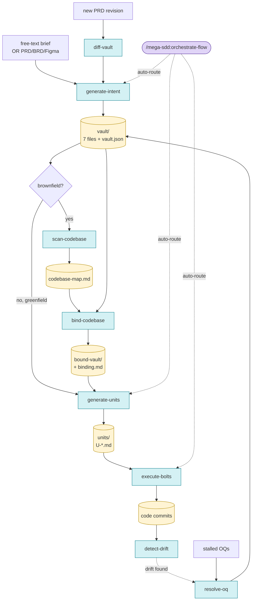

# Mega-SDD Revamp — Design Spec

**Date:** 2026-05-13
**Version:** 1.0.0 (target — major bump, rename, restructure)
**Status:** Draft (awaiting user review)
**Predecessor:** `grand-design-spec@0.15` (will be sunset over 2 release cycles)
**Author:** Farhan Riuzaki (riuzakif@gmail.com)

---

## 1. Context & Motivation

### 1.1 The problem with the current state

The current `grand-design-spec` plugin converts PRD/BRD/Figma into a 7-file dev handoff vault. This is the **Intent layer** — it answers WHAT and WHY. Downstream from the vault, however, there is **no structured handoff to AI dev execution**. Developers (human or AI) read the vault and improvise the HOW, which loses the anti-hallucination guarantees the vault was carefully constructed to provide.

### 1.2 The vision

Apply AWS-flavored Spec-Driven Development (SDD) methodology, mapped to a three-layer terminology:

- **Intent** = the WHAT/WHY layer (current vault)
- **Unit** = atomic, AI-executable dev prompts derived from intent (the HOW per chunk)
- **Bolt** = the actual code/artifact produced from executing a unit

Combined with the [`superpowers`](https://github.com/obra/superpowers) plugin (vendored as fallback), each unit becomes executable by an AI agent with full codebase grounding, TDD discipline, and subagent-driven-development orchestration.

### 1.3 The architect/dev separation problem

In enterprise contexts, IT architects produce intent **without source code access**. If intent contains hidden assumptions about code (file paths, existing interfaces, naming conventions), those assumptions poison every downstream unit and bolt. Drift cascades.

The revamp introduces a **mandatory codebase binding gate** between intent and unit generation for brownfield projects, while preserving the architect-side workflow as code-free.

---

## 2. Methodology Mapping

### 2.1 AWS SDD ↔ mega-sdd vocabulary

| AWS SDD concept | mega-sdd concept | Artifact | Run by |
|---|---|---|---|
| Intent (requirements + design) | Intent | `vaults/<name>/` (7 files + vault.json) | Architect (no code) |
| — (NEW: bridge) | Codebase Map | `codebase-map.md` | Dev / AI (read-only repo) |
| — (NEW: bridge) | Binding | `bound-vault/` + `binding.md` | Dev / AI (read-only repo) |
| Tasks / atomic specs | Unit | `units/U-*.md` | Dev / AI (read-only repo) |
| Implementation | Bolt | code commits (via superpowers) | AI agent (write access) |

### 2.2 4-layer anti-hallucination defense

```
Layer 1: Intent layer OQ promotion   (existing — preserved)
Layer 2: Codebase Binding Gate       (NEW — brownfield only, mandatory)
Layer 3: Unit-level grounding        (NEW — every unit carries target_files, deps, acceptance_test)
Layer 4: Drift-detect at boundaries  (existing — extended to new boundaries)
```

Each layer catches a different class of hallucination. Layer 2 is the keystone for brownfield correctness.

---

## 3. Architecture Overview

### 3.1 Pipeline (canonical)

```
                    ┌────────────────────┐
                    │  free-text brief   │
                    │  OR PRD/BRD/Figma  │
                    └─────────┬──────────┘
                              ▼
                    ┌────────────────────┐
                    │  generate-intent   │  → vaults/<name>/ (7 files)
                    └─────────┬──────────┘
                              ▼
                       ╔═════════════╗
                       ║ greenfield? ║
                       ╚══╦══════════╝
                  yes ────┴──── no (brownfield)
                   │                │
                   │       ┌────────▼─────────┐
                   │       │  scan-codebase   │  → codebase-map.md
                   │       └────────┬─────────┘
                   │                ▼
                   │       ┌────────────────────┐
                   │       │   bind-codebase    │  → bound-vault/ + binding.md
                   │       └────────┬───────────┘  (BLOCKS if conflicts)
                   │                │
                   └────────┬───────┘
                            ▼
                   ┌────────────────────┐
                   │   generate-units   │  → units/U-*.md
                   └─────────┬──────────┘
                             ▼
                   ┌────────────────────┐
                   │   execute-bolts    │  → code commits
                   └─────────┬──────────┘  (uses superpowers)
                             ▼
                   ┌────────────────────┐
                   │   detect-drift     │  ↺ loop back if drift
                   └────────────────────┘
```

### 3.2 Greenfield vs Brownfield routing

| Phase | Greenfield | Brownfield |
|---|---|---|
| `generate-intent` | ✅ runs | ✅ runs |
| `scan-codebase` | ⏭ skipped | ✅ runs |
| `bind-codebase` | ⏭ skipped | ✅ runs (BLOCKING if conflicts) |
| `generate-units` | ✅ runs (from vault) | ✅ runs (from bound-vault) |
| `execute-bolts` | ✅ runs | ✅ runs |

Auto-detection: `orchestrate-flow` inspects CWD for `.git`, `package.json`, `composer.json`, etc. — defaults to brownfield if any repo signal present.

### 3.3 Architect / Dev role separation

| Phase | Who | Repo access? |
|---|---|---|
| `generate-intent` | Architect | ❌ not required |
| `scan-codebase` | Dev / AI | ✅ read-only |
| `bind-codebase` | Dev / AI | ✅ read-only |
| `generate-units` | Dev / AI | ✅ read-only |
| `execute-bolts` | AI agent | ✅ write |

The intent layer's anti-hallucination contract (uncertain → Open Question, never guess) ensures the architect's output is honest about code-related gaps, which the binding gate then resolves.

---

## 4. Plugin Skeleton (mirrors superpowers' robust patterns)

```
mega-sdd/
├── .claude-plugin/
│   ├── plugin.json
│   └── marketplace.json
├── hooks/
│   ├── hooks.json
│   ├── run-hook.cmd
│   └── session-start                  ← anchor inject + dep check
├── scripts/
│   ├── bump-version.sh
│   └── sync-superpowers.sh            ← vendor sync automation
├── skills/
│   ├── using-mega-sdd/                ← anchor (scoped aggression)
│   │   └── SKILL.md
│   ├── generate-intent/
│   │   ├── SKILL.md
│   │   ├── vault-contract.md          ← carried over from grand-design-spec
│   │   ├── from-prompt-mode.md
│   │   └── intent-templates/
│   ├── scan-codebase/
│   │   ├── SKILL.md
│   │   └── codebase-map-schema.md
│   ├── bind-codebase/
│   │   ├── SKILL.md
│   │   ├── binding-contract.md
│   │   └── conflict-resolution.md
│   ├── generate-units/
│   │   ├── SKILL.md
│   │   ├── unit-schema.md
│   │   └── unit-templates/
│   ├── execute-bolts/
│   │   ├── SKILL.md
│   │   ├── bolt-contract.md
│   │   └── superpowers-bridge.md      ← integration contract
│   ├── orchestrate-flow/
│   │   ├── SKILL.md
│   │   └── routing-rules.md
│   ├── resolve-oq/                    ← carried over
│   ├── detect-drift/                  ← carried over (extended)
│   ├── diff-vault/                    ← carried over
│   ├── update-plugin/                 ← carried over (adds doctor check)
│   └── _vendored/                     ← Opsi D fallback
│       ├── ATTRIBUTION.md             ← MIT compliance
│       ├── executing-plans/
│       ├── subagent-driven-development/
│       ├── test-driven-development/
│       └── using-git-worktrees/
├── commands/
│   ├── generate-intent.md
│   ├── scan-codebase.md
│   ├── bind-codebase.md
│   ├── generate-units.md
│   ├── execute-bolts.md
│   ├── orchestrate-flow.md
│   ├── resolve-oq.md
│   ├── detect-drift.md
│   ├── diff-vault.md
│   └── update-plugin.md
├── docs/
│   └── mega-sdd/
│       ├── specs/                     ← lifecycle design docs
│       ├── plans/                     ← implementation plans
│       ├── vaults/                    ← default output for generated vaults
│       └── architecture.md            ← top-level SDD architecture overview
├── tests/                             ← skill-triggering tests
│   ├── intent-triggering/
│   ├── bind-blocking/
│   └── flow-routing/
├── CLAUDE.md                          ← contributor guidelines (anti-slop)
├── README.md                          ← includes Mermaid flow diagram
├── CONTRIBUTING.md
├── CHANGELOG.md
└── LICENSE
```

---

## 5. Command Surface

### 5.1 Tier 1 — Core pipeline (5 commands)

#### `/mega-sdd:generate-intent`
- **Input:** PRD path (e.g., `./prd.md`) **OR** `--from-prompt "<brief>"` for free-text mode
- **Output:** `vaults/<auto-named>/` containing 7 markdown files + `vault.json` manifest
- **Behavior:**
  - Free-text mode runs adaptive Q&A (≤10 questions) to fill gaps before vault generation
  - Structured PRD mode parses + decomposes
  - Language matches input (Indonesian PRD → Indonesian vault)
  - Anti-hallucination rails: every claim cites source; ambiguities → Open Questions
- **Flags:** `--lang=id|en`, `--mode=greenfield|brownfield`, `--auto`, `--chain`

#### `/mega-sdd:scan-codebase`
- **Input:** repo path (default `./`)
- **Output:** `codebase-map.md` — structured index of entities, modules, conventions, public interfaces, naming patterns, test conventions
- **Behavior:**
  - Heuristic scan (no AST parsing in v1 — file/dir traversal + grep-based pattern detection)
  - Idempotent — re-running rewrites map; manifest tracks scan timestamp
  - Brownfield prerequisite for `bind-codebase`
- **Flags:** `--depth=N`, `--include=<glob>`, `--exclude=<glob>`, `--auto`

#### `/mega-sdd:bind-codebase`
- **Input:** vault path + codebase-map path
- **Output:** `bound-vault/` (vault copy with binding annotations) + `binding.md` (conflict report)
- **Behavior:**
  - For each claim in vault that references code-level concerns (file paths, interfaces, entities, endpoints), validate against codebase-map
  - Tag each claim: `CONFIRMED`, `CONFLICT`, `OQ` (still unknown)
  - **BLOCKING GATE:** if `CONFLICT` count > 0, refuse to produce bound-vault until user resolves via `resolve-oq` or manual edit
  - Drift-detect skill is reused internally for the validation logic
- **Flags:** `--strict` (block even on OQ, not just CONFLICT), `--auto`

#### `/mega-sdd:generate-units`
- **Input:** bound-vault path (greenfield: vault path)
- **Output:** `units/U-001.md`, `U-002.md`, … each unit follows `unit-schema.md`
- **Unit schema (per file):**
  ```yaml
  ---
  id: U-001
  title: ...
  depends_on: [U-000]   # dependency graph for parallel exec
  target_files: [...]   # exact files this unit may touch
  existing_interfaces: # contracts that must be preserved
    - { file: "...", symbol: "...", note: "..." }
  acceptance_test:      # how to verify the bolt
    - { type: "test", command: "...", expects: "..." }
    - { type: "manual", desc: "..." }
  superpowers_skills:   # which superpowers skills to invoke
    - test-driven-development
    - subagent-driven-development
  ---
  # body — the AI-executable prompt
  ```
- **Behavior:**
  - Decompose vault sections into atomic chunks sized for one bolt iteration (~one PR worth)
  - Resolve dependency graph; reject cycles
  - Embed unit-level grounding from bound-vault binding manifest

#### `/mega-sdd:execute-bolts`
- **Input:** unit path **OR** unit ID **OR** `--all` for full unit set in dependency order
- **Output:** code commits + per-bolt `bolt-report.md` (acceptance test results)
- **Behavior:**
  - Invokes vendored / installed `superpowers:executing-plans` as engine
  - Wraps with TDD: tests-first per unit's `acceptance_test`
  - Optional parallel execution via `subagent-driven-development` for independent units
  - Optional worktree isolation via `using-git-worktrees`
  - **Halt protocol:** if acceptance test fails after N retries (default 3), halt and surface to user
- **Flags:** `--parallel`, `--worktree`, `--max-retries=N`, `--dry-run`, `--auto`

### 5.2 Tier 2 — Lifecycle (4 commands)

#### `/mega-sdd:orchestrate-flow`
- **Input:** none (inspects CWD) **OR** `--from=<phase>` **OR** `--to=<phase>`
- **Output:** chain proposal → user confirms → sub-skills run in `--auto` mode
- **Behavior:**
  - Inspect CWD: detect existing vault, bound-vault, units, bolts, codebase
  - Determine current pipeline state; propose next 1-N phases
  - First-run-only: detect missing superpowers; offer auto-install with confirmation
- **Flags:** `--from=<phase>`, `--to=<phase>`, `--dry-run`

#### `/mega-sdd:resolve-oq`
- **Input:** vault path **OR** bound-vault path
- **Output:** vault updated with resolutions; `vault.json` version bump; Changelog entry
- **Behavior:** interactive walker through OQs by priority (P0 → P3); supports `--auto` for "use my best guess" mode

#### `/mega-sdd:detect-drift`
- **Input:** vault path **OR** bound-vault path; auto-detects code via CWD
- **Output:** `DRIFT-REPORT.md` with confidence-rated findings
- **Behavior:**
  - Compares vault claims against current codebase state
  - Runs automatically post-`execute-bolts` (configurable)
  - Surfaces findings; offers interactive resolution

#### `/mega-sdd:diff-vault`
- **Input:** existing vault + new PRD revision
- **Output:** structured diff report; applies approved changes to vault
- **Behavior:**
  - Preserves resolved OQs across PRD revisions
  - Flags `diff_conflict` where new source contradicts resolved decisions
  - Supports `--auto`

### 5.3 Tier 3 — Utility (1 command)

#### `/mega-sdd:update-plugin`
- **Input:** none
- **Output:** updated plugin cache; doctor report
- **Behavior:**
  - Pull latest version from marketplace
  - Auto-run doctor check after update: verify all skills present, verify superpowers installed (or vendored fallback intact), report version drift
  - Prompt to install superpowers if missing

### 5.4 Argument convention (all commands)

```
/mega-sdd:<cmd> [target] [--auto] [--chain] [--lang=id|en] [--mode=...]
```

- **`target`** (positional, optional): path/identifier. Empty → smart auto-detect with confirmation.
- **`--auto`**: skip questions, use sensible defaults.
- **`--chain`**: after completion, hand off to `orchestrate-flow` for next phase.
- **`--lang`**: force output language (default: match input/CWD).
- **`--mode`**: phase-specific (e.g., `generate-intent --mode=greenfield`).

### 5.5 Default invocation behavior — Smart auto-detect

Every command, when invoked without `target`:
1. Scan CWD for likely inputs (e.g., `*.md`, `prd.md`, `seed-PRD.md`, `vaults/*/`)
2. If exactly one match: confirm with user ("Use `./prd.md`? Y/n")
3. If multiple matches: prompt user to choose
4. If zero matches: prompt for path input

---

## 6. Anchor Skill — `using-mega-sdd`

### 6.1 Purpose

Mirror `superpowers:using-superpowers` pattern: a session-start-injected skill that mandates skill-tool invocation **before** any response touching SDD topics.

### 6.2 Scoped aggression model

Unlike superpowers' aggressive global mandate, `using-mega-sdd` is **scoped**:

**Trigger conditions (mandatory skill check):**
- User explicit invocation: `/mega-sdd:*`
- SDD keywords in prompt: `intent`, `unit`, `bolt`, `vault`, `PRD`, `BRD`, `spec out`, `dev handoff`, `binding`, `bound-vault`
- Indonesian variants: `pecah PRD`, `buat dev`, `spec ini`, `siapkan context buat AI dev`

**Non-trigger (no mandate):**
- Casual conversation
- Unrelated tasks (debugging, refactoring, code review on unrelated code)
- Reading or writing code without SDD context

### 6.3 Anchor skill content (SKILL.md outline)

```markdown
---
name: using-mega-sdd
description: Use at session start when SDD topics arise — establishes how to route SDD work through mega-sdd phases
---

# Using Mega-SDD

## When this anchor applies
[trigger conditions list]

## Priority order
1. User explicit instructions (CLAUDE.md, AGENTS.md) — highest
2. mega-sdd phase rails — override default behavior in SDD scope
3. Default system prompt — lowest

## Hard rule
For ANY SDD-scoped request, invoke `Skill` tool BEFORE responding.
Default route: `/mega-sdd:orchestrate-flow` → it auto-routes to the right phase.

## Red flags (rationalization patterns to STOP)
- "I'll just write the intent directly" → use generate-intent skill
- "Binding seems unnecessary for this small change" → run bind-codebase anyway
- "I can skip unit generation for simple bolts" → no, units enforce grounding
- "Superpowers is overkill for execution" → bolts MUST go through superpowers (vendored OK)

## Phase chain
intent → (scan + bind for brownfield) → units → bolts
```

### 6.4 Hook injection

`hooks/session-start` shell script:
1. Detect if CWD contains SDD signals (`docs/mega-sdd/`, `vaults/`, `bound-vault/`, `units/`)
2. If yes: inject `using-mega-sdd` SKILL.md content into context
3. Check if superpowers is installed; if not and SDD signals present, append install hint
4. Multi-platform via `run-hook.cmd` wrapper

---

## 7. Superpowers Integration (Opsi D Hybrid)

### 7.1 Layered fallback strategy

```
Runtime: execute-bolts skill needs subagent-driven-development
         │
         ▼
   ┌─────────────────────────┐
   │ Is superpowers plugin   │
   │ installed?              │  ← detection: directory check at
   └────┬───────────────┬────┘     ~/.claude/plugins/cache/**/superpowers/
        │ yes           │ no
        ▼               ▼
   use it          ┌────────────────────────────┐
                   │ Is vendored fallback ready?│  ← detection: file check at
                   └────┬──────────────────┬────┘     ${CLAUDE_PLUGIN_ROOT}/skills/_vendored/
                        │ yes              │ no
                        ▼                  ▼
                   use vendored      block + offer install
```

**Detection precedence:** real install always wins over vendored. If both present, vendored is dormant (latest superpowers fixes/skills take priority).

### 7.2 Vendored skills bundle

Under `skills/_vendored/`:
- `executing-plans/` — drives bolt execution
- `subagent-driven-development/` — parallel unit execution
- `test-driven-development/` — acceptance test discipline per unit
- `using-git-worktrees/` — isolation per parallel bolt

**Attribution:** `_vendored/ATTRIBUTION.md` documents source (github.com/obra/superpowers), MIT license, vendor date, commit SHA.

**Sync automation:** `scripts/sync-superpowers.sh` (manual run by maintainer) pulls latest from superpowers repo, copies relevant skills, updates ATTRIBUTION. Run pre-release to detect drift.

### 7.3 Marketplace listing

`marketplace.json` extended with two plugin entries:
```json
{
  "name": "mega-sdd",
  "plugins": [
    {
      "name": "mega-sdd",
      "source": "./plugins/mega-sdd",
      "version": "1.0.0",
      ...
    },
    {
      "name": "superpowers",
      "source": { "type": "git", "url": "https://github.com/obra/superpowers" },
      "description": "Recommended companion — auto-installed for bolt execution. Falls back to vendored copy if absent.",
      "required": false,
      "recommended": true
    }
  ]
}
```

⚠️ **Caveat:** External git source in marketplace `source` field requires verification — if Claude Code does not support this syntax, fallback is README documentation + hook auto-install offer. The vendored copy ensures runtime functionality regardless.

### 7.4 User install paths

```bash
# Path 1 — full superpowers
/plugin marketplace add farhanriuzaki/mega-sdd
/plugin install mega-sdd
/plugin install superpowers       # from same marketplace listing
# Result: full superpowers experience, vendored skills inert

# Path 2 — minimal (vendored only)
/plugin marketplace add farhanriuzaki/mega-sdd
/plugin install mega-sdd
# Result: bolts work via vendored fallback, no superpowers session-start anchor
```

---

## 8. Codebase Binding Gate (the keystone)

### 8.1 Why this exists

Brownfield projects have **existing code**. Intent generated without code access will contain unstated assumptions about:
- File paths and module structure
- Existing data models / DB schema
- Public interfaces and API contracts
- Naming conventions (camelCase vs snake_case, suffix patterns)
- Existing utilities that should be reused vs reimplemented
- Test conventions (Jest? PHPUnit? RSpec?)

Without validation, every unit generated from such an intent inherits these assumptions, and every bolt amplifies the drift. The binding gate halts the chain until intent is grounded.

### 8.2 Binding manifest schema

`binding.md` produced by `bind-codebase`:

```yaml
---
vault: vaults/<name>
codebase_map: codebase-map.md
bound_at: 2026-05-13T10:00:00Z
strict: false
---

# Binding Manifest

## Summary
- claims_total: 47
- confirmed: 38
- conflict: 5
- oq: 4

## Confirmed Claims (38)
[list — each item references vault file:line + codebase evidence]

## Conflicts (5) — BLOCKING
| ID | Vault Claim | Codebase Reality | Resolution Needed |
|---|---|---|---|
| C-01 | API uses Bearer auth (api.md:23) | Code uses session cookies (src/middleware/auth.ts) | Decide: keep cookies or migrate |
| ... | | | |

## Open Questions (4) — non-blocking, propagated to units
| ID | Question | Source |
|---|---|---|
| OQ-12 | Does the user table have a `deleted_at` column? | data.md:45 |
| ... | | |
```

### 8.3 Conflict resolution flow

```
bind-codebase finds conflicts
        ▼
binding.md generated, bound-vault NOT yet written
        ▼
user runs: /mega-sdd:resolve-oq --binding ./binding.md
        ▼
interactive walker: each conflict gets a decision
        ▼
binding.md updated; vault updated with resolution markers
        ▼
re-run bind-codebase → bound-vault/ written, gate passes
```

### 8.4 What `bind-codebase` does NOT do

- Does not modify source code (read-only)
- Does not generate units (separate skill)
- Does not auto-resolve conflicts (always human-in-the-loop)

---

## 9. Output Conventions

### 9.1 Default output locations

| Artifact | Location | Override |
|---|---|---|
| Spec / design docs | `docs/mega-sdd/specs/YYYY-MM-DD-<topic>.md` | user preference in `.mega-sdd.local.md` |
| Implementation plans | `docs/mega-sdd/plans/YYYY-MM-DD-<feature>.md` | user preference |
| Generated vaults | `docs/mega-sdd/vaults/<name>/` | command flag `--out=<path>` |
| Bound vaults | sibling of vault, suffix `-bound/` | flag |
| Units | `<vault>/units/U-*.md` | flag |
| Bolt reports | `<vault>/bolts/<unit-id>/bolt-report.md` | flag |
| Codebase map | `./codebase-map.md` (repo root) | flag |

### 9.2 Versioning

- Plugin: SemVer, starts at `1.0.0` (major bump from `grand-design-spec@0.15`)
- Vault: internal `version` in `vault.json`, monotonically increments on diff/resolve-oq
- Unit ID: zero-padded `U-001`, `U-002`, … stable across regenerations (preserved by vault-diff)

---

## 10. Migration Path from `grand-design-spec`

### 10.1 Naming changes (summary)

| Old | New |
|---|---|
| `grand-design-spec` (plugin) | `mega-sdd` |
| `grand-design-spec` (skill) | `generate-intent` |
| `flow` (skill) | `orchestrate-flow` |
| `drift-detect` (skill) | `detect-drift` |
| `vault-diff` (skill) | `diff-vault` |
| `from-prompt` (skill) | absorbed into `generate-intent --from-prompt` |
| `update` (skill) | `update-plugin` |
| `resolve-oq`, output structure | preserved |

### 10.2 Existing-user migration

1. README has "Migrating from grand-design-spec" section with one-block commands
2. `update-plugin` (legacy in v0.16 — bridge release) detects old install → suggests installing `mega-sdd`
3. Existing vaults remain compatible (vault.json schema unchanged)
4. `grand-design-spec` remains in marketplace as **deprecated** entry for 2 release cycles, then removed

### 10.3 Release sequence

```
v0.16 (grand-design-spec)  — bridge release, adds migration hint
v1.0.0 (mega-sdd)          — full new plugin published
v1.1.x (mega-sdd)          — iterations
v0.17 (grand-design-spec)  — final maintenance release, marketplace marked deprecated
[2 releases later]
grand-design-spec removed from marketplace.json
```

---

## 11. README — Flow Diagram

README MUST include:

### Mermaid (primary, GitHub renders native)



### ASCII fallback (under `<details>` collapse)

[ASCII version as shown in section 3.1]

### Procedure cheat-sheet

| Scenario | Commands |
|---|---|
| New idea → working code (greenfield, fully autonomous) | `/mega-sdd:generate-intent --from-prompt "..." --chain` |
| Existing PRD → working code (brownfield) | `/mega-sdd:generate-intent ./prd.md` → `/mega-sdd:orchestrate-flow` |
| PRD revision arrived | `/mega-sdd:diff-vault ./new-prd.md` |
| Code drift detected | `/mega-sdd:detect-drift` → `/mega-sdd:resolve-oq` |
| Resume from interrupted phase | `/mega-sdd:orchestrate-flow --from=<phase>` |

---

## 12. Open Questions

**OQ-1** Claude Code marketplace `source` field — does it accept external `git` URLs? If not, the marketplace bundling falls back to README documentation + hook auto-install offer. **Resolution needed before implementation starts.**

**OQ-2** Claude Code plugin aliasing — can `mega-sdd` be aliased to a shorter prefix (`msdd`)? Affects command UX but not architecture. **Defer to v1.1 — start with full name.**

**OQ-3** Codebase scan depth in v1 — heuristic vs AST? Spec says heuristic for v1; AST integration deferred to v1.2 if heuristic accuracy proves insufficient. **Acceptable risk — start heuristic.**

**OQ-4** Unit dependency graph — allow user override of auto-generated dependencies? Defer to v1.1 unless early users report blocking issues.

**OQ-5** Vendored superpowers sync cadence — manual pre-release vs CI nightly? Start manual; promote to CI if vendor drift becomes a real maintenance problem.

---

## 13. Out of Scope (v1.0.0)

- Multi-harness mirrors (`.codex-plugin/`, `.opencode/`, `.cursor-plugin/`) — Phase 2
- AST-level codebase scanning — v1.2+
- Auto-conflict-resolution in bind-codebase — always human-in-loop in v1
- Cross-vault federation (multiple vaults referencing shared bound-vault) — v2
- Bolt rollback / undo — relies on git for now
- Real-time PRD ingestion (Webhook from Notion / Confluence) — out of scope
- Custom unit templates / theming per project — v1.1

---

## 14. Success Criteria

A v1.0.0 release is considered successful if:

1. **Pipeline completeness:** All 10 commands implemented and pass their skill-triggering tests
2. **Greenfield E2E:** Free-text brief → working code commits with zero manual intervention possible via `--chain`
3. **Brownfield E2E:** Existing PRD + existing repo → bind-codebase blocks at least one realistic conflict, resolve-oq cleans it, bolts execute against actual codebase patterns (verified by sampling ≥3 real projects)
4. **Anti-hallucination preserved:** zero new hallucination sources introduced; binding gate catches at least one synthetic test case of code-divergent intent
5. **Superpowers integration:** bolts execute successfully both with `superpowers` installed AND with only `_vendored/` fallback
6. **Migration smoothness:** at least one existing `grand-design-spec@0.15` user successfully migrates without losing prior vaults
7. **Documentation completeness:** README has rendered Mermaid diagram + ASCII fallback + procedure cheat-sheet; CLAUDE.md present with contributor guidelines

---

## 15. Risks & Mitigations

| Risk | Mitigation |
|---|---|
| Marketplace external git source unsupported | Vendored fallback ensures runtime; README documents manual install |
| Vendored superpowers diverges from upstream | `sync-superpowers.sh` + ATTRIBUTION drift check pre-release |
| Binding gate too strict, blocks legitimate edge cases | `--strict` is opt-in; default is "conflict blocks, OQ propagates" |
| Architect ignores OQ honesty contract | Anchor skill + hard gate in `generate-intent` prevents skipping |
| Heuristic codebase scan misses critical patterns | Codebase-map is regenerable; binding gate surfaces missed claims as OQs |
| Unit dependency cycles | Generator rejects cycles; user must restructure vault sections |
| User confusion from rename | Migration section in README + bridge release v0.16 with hint |

---

## 16. Implementation Phasing (preview — full plan in writing-plans skill output)

Suggested decomposition for the implementation plan:

1. **Scaffold + rename** — folder rename, plugin.json/marketplace.json bump, migration of existing skills to new names (no behavior change)
2. **Anchor skill + hook** — `using-mega-sdd` + `session-start` injection
3. **Vendor superpowers** — copy 4 skills + ATTRIBUTION + sync script
4. **`scan-codebase` skill** — heuristic implementation
5. **`bind-codebase` skill** — binding manifest + blocking gate
6. **`generate-units` skill** — unit schema + dependency graph
7. **`execute-bolts` skill** — superpowers bridge + halt protocol
8. **`orchestrate-flow` revamp** — extended routing for new phases
9. **README + flow diagram** — Mermaid + ASCII + cheat-sheet
10. **Skill triggering tests** — coverage for each new skill
11. **Release prep** — CHANGELOG, version bump, marketplace publish

---

**End of Spec.**
