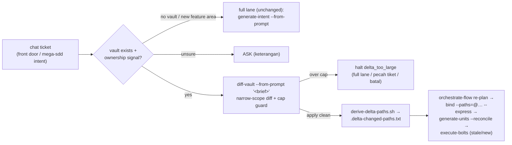

# Free-text delta lane — chat ticket → scoped vault patch → claim-scoped re-bind

**Date:** 2026-08-11
**Status:** SHIPPED v6.7.0 (2026-08-12, a6b8c45, CI green, suite 219/219 both trees) — dual-blind round: 0 blockers / 5 majors / 9 minors, ALL folded (§Round disclosure)
**Source:** proposals doc `2026-08-11-morning-proposals.md §(b)` (USER: "gas") + audit S4 (`2026-08-10-skills-audit.md §13`) + benchmark T07 (`benchmarks/results/comparison/REPORT.md`: negative control — a one-field ticket still commands ~120k est tok in v6.6.0, the largest remaining per-run cost). Recon: 4-reader workflow `wf_3e40c6f3-bb0` (raw digests preserved in the session transcript; every seam below is a recon-cited line).
**Version:** 6.7.0 (minor — a NEW input mode + one new script + one new halt; NO existing gate weakened, NO existing chain re-shaped).

**No-gimmick justification (mandated gate).** This is an ADAPTER, not a surface: every hop it proposes already exists (`diff-vault` apply mechanics, `bind-codebase --paths` claim-scoped re-bind, `generate-units --reconcile`, stale/new bolts). What is missing today is measured: a ticket-shaped requirement has NO route (un-routed chat triggers nothing; front-doored free-text unconditionally becomes a NEW VAULT — `commands/mega-sdd.md:47-48`, ratified by `multi-prd-lifecycle.md:38`) and re-pays ~120k est tok (benchmark T07, MEASURED static trace) vs the ~60–80k the existing scoped machinery can deliver. Frequency = the team's daily workflow (bank ticket flow). Anti-abuse guard included (§D4) so an epic hiding in a "delta" is forced to the full lane.

## The chain (target shape)

## D1 — `diff-vault --from-prompt "<brief>"` (skill 2.4.0 → 2.5.0)

- **Step 0 input branch**: `--from-prompt` exempts the "no new source provided (STOP…)" push-back (`SKILL.md:91` — the STOP text gains the exemption clause, everything else in §When-to-push-back verbatim). Mutually exclusive with source paths; both given → the file wins, warn once (round m1 disclosure). LOCKED-vault push-back, uncommitted-git AskUserQuestion (test-pinned `tanpa commit, tidak ada rollback point`), and every never-silently-overwrite rail stay UNCHANGED. The lane is interactive by nature (the user is in chat).
- **Step 0.5 scope auto-narrowing**: from-prompt auto-derives `specific-docs` DIFF_SCOPE from the entities/flows the brief names (heading-match against `00-index.md` roll-up; no match → the doc most plausibly owning the change + `03-data-model.md`); NEVER `full` for a from-prompt run. "Scope honesty" rule untouched.
- **Step 1.5 / 6.5 provenance (a chat ticket is NOT a PRD revision)**: `prd_sha256_changed: n/a` (the existing n/a leg, `diff-procedure.md:25/28`); Step 6.5's sources-patch must NOT re-baseline `prd_sha256`/`prd_path_at_generation` and must NOT replace the PRD entry in `source_documents[]` — it APPENDS a brief entry (`type: brief`, first ~80 chars, date). The Vault-Lock "PRD source" line is NOT rewritten. vault.json stays script-derived (`derive-vault-json.sh --patch` — the w5 writer sweep stays green).
- **Adaptive Q&A ≤ 3 questions** (sized-to-delta; the full-lane precedent is ≤10 in `generate-intent/references/from-prompt-mode.md`, reused by pointer for extraction grammar + output-language carriage). Unanswerable gaps → `[ ]` OQ rows (existing materialization, `OQ-{CODE}-{N+1}`), never guesses.
- **Report header variant**: `New source: chat brief (--from-prompt)` + the n/a sha leg; conflict semantics (Resolved-OQ / Decision → ALWAYS surface, `diff_conflict` under `--auto`) byte-identical to the file lane.
- **Version bump**: from-prompt applies are `Small bump` by definition of the cap (§D4 forbids scope-shift-scale deltas); bump grammar single-owner (`diff-procedure.md §Update vault metadata`, p9-pinned) untouched.

## D2 — deterministic scope writer: `scripts/derive-delta-paths.sh` (NEW)

`--vault=<dir>`: parses `<vault>/VAULT-DIFF.md` rows for the touched vault docs/sections → selects `binding.json claims[]` whose `vault_source` doc matches → parses their `anchor` cells with the SAME recipe `sync-intersect.sh:148-168` codifies (split `\s*\+\s*`, strip `:line`, file-like filter; slash-less pieces pass through as basenames) → writes `<vault>/.delta-changed-paths.txt` (one path per line, sorted, deduped — the `--paths=@file` consumer contract).

- **Own filename, deliberately NOT `.sync-changed-paths.txt`**: vault-side deltas are structurally invisible to the sync channel (`derive-changed-paths.sh:141` strips `.mega-sdd/` paths; `sync-intersect` targets are code anchors ∪ unit targets — a pure-vault delta would FALSE-in_sync short-circuit), and the sync basename is a pinned lane discriminator (`detect-drift.test.md:64`) with a scan-owned rm-lifecycle (`scan-codebase.test.md:168`). Distinct file = distinct lane, zero pin collisions; overwritten per from-prompt run, consumed by the immediately-following bind hop.
- **Fail-closed** (the recon's "bind --paths is NOT fail-closed on a no-match path" gap): exit 0 = written; exit 3 = no `binding.json` (greenfield/unbound vault → the router proposes the NORMAL chain, no scoped hop); exit 2 = ANY parse failure → the router proposes a FULL re-bind, never a guessed narrow one. The script never converts uncertainty into a scoped bind.
- OQ/NEW claims with `—`/null anchors contribute no path — their re-verdict rides the vault-section leg (§D3); that is why the paths file alone is never the whole selection.
- **Lifecycle (round m2 disclosure)**: the scope file is single-use by convention — overwritten by every from-prompt apply, read only by the delta overlay's bind proposal (overlay-only entry means a stale file is never consumed by another lane); no deletion owner, deliberately (the sync discriminator's rm-lifecycle belongs to scan, and this file is invisible to that lane by name).

## D3 — claim-scoped re-bind: make the vault-section leg concrete (binding-contract amendment)

`binding-contract.md §Claim-scoped re-bind` already selects "claims whose vault source section changed (vault edited)" (`:180`) — mechanism unspecified today. Amendment (APPEND-style; the three moat-pinned sentences at `:180/:185` + `SKILL.md:28` stay VERBATIM):

1. **Concrete detection**: when `<vault>/VAULT-DIFF.md` exists and is newer than the previous `binding.md`, the vault-section leg reads its Added/Changed/Removed rows — claims whose `vault_source` doc§ appears there join `affected_claims`. Added sections have no prior claim → their claims are authored fresh on this run (they are "changed vault source" by definition); an AFFECTED claim that cannot be matched keeps express rule 3's full-re-bind fallback (never a guessed mapping).
2. **Patch-bump ≠ regeneration** (the recon's FULL-RE-BIND SWALLOW): the fallback trigger "the vault itself was regenerated (version bump since last bind)" is narrowed — a bump whose vault Changelog entry was written by a diff-vault apply AND whose `VAULT-DIFF.md` is present is a PATCH, not a regeneration; its changed claims arrive via `--paths` + the section leg above, active CONFLICTs are still ALWAYS re-validated, and carry-forward stays safe because a diff-vault apply preserves untouched IDs/text by contract. A bump with NO diff-vault record keeps triggering the full-re-bind fallback unchanged. (Pin `bind-codebase.test.md:231` moves WITH this phrase in the same change.)

## D4 — the anti-abuse cap: halt `delta_too_large`

Computed at Step 3 (diff computed, BEFORE apply). A from-prompt diff exceeding ANY of: **new entities + new flows > 2**, **total changed rows > 12**, **any new scope/squad**, or the existing major-scope-shift push-back thresholds — halts `delta_too_large` (ALWAYS STOP). Registration set (recon-verified, complete):

- `references/halt-protocol.md` — `type:` pipe-enum APPEND + registry one-liner (pattern `:167`) with Indonesian `Keterangan:` + `options` as `{code, keterangan}` pairs: `full_lane` (vault/epic baru lewat generate-intent — brief ini terlalu besar untuk delta), `split_ticket` (pecah jadi beberapa tiket kecil ≤ cap, jalankan delta lane per tiket), `cancel` (batal — vault tidak disentuh). Type-specific fields `cap_exceeded`/`measured` with `# delta_too_large only` annotations. Prose must avoid the test-6d TOPO_BAD banned phrasings.
- `halt-taxonomy.md` — name APPENDED to the Always-stop roster (after the p9-pinned runs, never inside them).
- `handoff-contract.md:275` diff-vault row — halted enum gains `delta_too_large`; its route: re-plan via `mega-sdd:orchestrate-flow` (row keeps containing `mega-sdd:diff-vault` + `mega-sdd:orchestrate-flow` and keeps NOT containing `mega-sdd:bind-codebase` — assertions C/D/E of `test-diff-vault-conflict-route.sh` stay true by construction).

## D5 — routing (propose-first; NO auto-trigger census expansion)

- **Front door** `commands/mega-sdd.md:47-48`: the quoted-free-text row branches — NO vault in CWD → Mode B new-vault (pinned behavior, unchanged); vault(s) present AND the sentence names an entity/flow/screen an existing vault's docs own (prompt-scale ownership signal: heading/entity match against `00-index.md` roll-ups) → propose the DELTA chain (`diff-vault --from-prompt` → scoped re-bind → reconcile → stale/new bolts); ownership unsure → ASK with per-option keterangan (delta ke vault <name> / epic baru = vault baru / batal). Translation law satisfied: no new flag crosses the front door — the proposal carries the chain.
- **`multi-prd-lifecycle.md`**: row 4 (ticket-scale chat delta to an owned vault → `diff-vault --from-prompt`) + the `:38` free-text clause amended (epic-scale brief → new vault; ticket-scale delta → the owning vault's delta lane) + the prompt-scale ownership signal added beside the doc-title signal (`:22`). Census tokens (`diff-vault`, `new vault`, `sync`, `project constitution`, `when unsure`, `Doc-type agnostic`) all preserved.
- **`routing-rules.md`**: decision-matrix row (overlay — "quoted free-text + owned-vault signal", adjacent to the `prd_revision` row, which OUTRANKS it: a PRD file revision wins over a chat sentence) + `§Delta lane` detail block after Mode D naming the chain + both fail-closed edges (script exit 3 → normal chain; exit 2 → full re-bind) + the state-aware handoff choreography note (bind emits `--reconcile` only when the claim-scoped re-bind actually executed — existing `auto-memory-handoff.md:118-137` contract, reused not restated). Precedence ladder line APPENDED: OQ gate first; `prd_revision` outranks delta; delta outranks sync only in that it is user-initiated (no contention: different entry signals).
- **`using-mega-sdd/SKILL.md:62` bullets**: delta bullet between "Same source revised" and "new epic". **Deliberate scope cut:** NO new census keywords in the always-loaded description — the anchor-core sits at 3587/3600 (~13 tok margin) and a bare "tambah kolom" must NOT auto-route into a 5-hop chain over the user-control escape hatch (`:17`); the lane is reached propose-first via the front door or explicit mega-sdd intent. (Future census expansion = its own measured decision.)
- **Handoff tail**: `auto-and-chain.md` branch (c) gains the from-prompt variant — completed + clean + `.delta-changed-paths.txt` written → `suggested_skill: mega-sdd:orchestrate-flow` `["--auto"]` (the router's delta row proposes the scoped re-bind); the contract row never names bind-codebase.

## Non-goals

- No auto-trigger census keywords (above). No new orchestrate-flow flag. No detect-drift hop in the delta chain (no code moved — nothing to drift-check; drift stays owned by sync/post-bolt gates). No changes to `generate-intent` Mode B (greenfield brief chain byte-identical — `auto.test.md:29` pinned). No sync-lane surface changes (`sync-intersect.sh`, `.sync-changed-paths.txt` lifecycle untouched). The ≤50 auto-apply cap and all `diff_conflict` machinery unchanged.

## Proof

- NEW `tests/delta-lane/test-derive-delta-paths.sh` — fixture vault + binding.json: (a) touched-section claim → its anchor paths land in `.delta-changed-paths.txt` (sorted/deduped, repo-relative + basename lane); (b) untouched claims contribute nothing; (c) OQ/null-anchor rows are path-silent; (d) no binding.json → exit 3; (e) corrupt VAULT-DIFF/binding.json → exit 2 fail-closed; (f) MUTATION arm — a wrong claim id in the fixture must change the output (no hardcoded pass).
- NEW `tests/delta-lane/test-delta-lane-contracts.sh` — pins: front-door vault-presence branch text; multi-prd row 4 + amended `:38`; routing-rules delta row + precedence + both fail-closed edges; cap numbers (>2 / >12 / new-scope) at their single owner; the no-rebaseline sentence (`prd_sha256` NOT re-baselined under from-prompt); halt registration at all 3 homes; handoff row still routing-clean (C/D/E-equivalent local asserts); `.delta-changed-paths.txt` never named `.sync-changed-paths.txt`.
- UPDATED trigger fixtures: `diff-vault.test.md` (+from-prompt cases: routed, over-cap halt, greenfield exit-3 fall-through), `orchestrate-flow.test.md` / `sync.test.md` guard rows (prd_revision still outranks; sync untouched), `bind-codebase.test.md:231` fixture moved WITH the narrowed fallback phrase.
- Existing suites BOTH trees stay green — notably `test-sync-conflict-revalidate.sh` (3 verbatim moat sentences), `test-diff-vault-conflict-route.sh` (A–E), w5 writer sweep, p6 front-door + zero-phantom, p9 bump-grammar + C1-run, keterangan suite (incl. the new halt's `{code, keterangan}` options), multi-prd census.
- Round: dual-blind as always; measure-context re-trace of T07-delta as a NEW benchmark task is post-ship follow-up, not a ship gate.

## Round disclosure (dual-blind, 2 reviewers, read-only)

Reviewer 1 (fidelity+moat): 0 blockers / 4 majors / 6 minors. Reviewer 2 (breakage; 16/16 blast-radius suites green pre-fold + mktemp attack fixtures on the script): 0 blockers / 1 major / 3 minors. ALL folded:

- **The parser majors (R2 M1 + R1 m3/m4)**: `derive-delta-paths.sh` was fence-blind and occurrence/order-sensitive — a quoted `## Unchanged`/`## Summary` inside a code fence or an out-of-order section silently NARROWED the paths file (wrong, not fail-closed). Rewritten fence-stripped + section-based (headings in fences are not headings; section position irrelevant); vault_source shape drift now dies (was silently skipped); zero affected claims (incl. empty `claims: []`, R2 minor) now exit 2. Five new test arms (g–k) reproduce each attack.
- **R1 M1 (vault-section leg false negative)**: rule 4 read only Added/Changed/Removed, but a Supersede rewrites `05-decisions.md` and an auto-resolve mutates an OQ section — and the patch-bump narrowing had removed the accidental full-re-bind net. Folded three-way: rule 4 reads ALL diff-body rows; report-format gains the §Doc-literal mandate (EVERY applied row names its target doc, Conflicts + Auto-resolved included); the patch-bump exception now also requires NO vault doc newer than `VAULT-DIFF.md` (a post-patch manual edit re-fires the regeneration fallback).
- **R1 M2 (census leak)**: the diff-vault description had quietly gained the bare trigger sentence — the exact "poison moved to an unwatched surface" class. Removed; description now states the propose-first contract; contracts-test checks 9b/9c pin BOTH descriptions.
- **R1 M3**: the spec-promised guard fixtures landed (orchestrate-flow R8b/R8c, sync N6, auto A5 setup line — the last also R2 minor).
- **R1 M4**: `auto-memory-handoff.md`'s fallback restatement now carries the patch-record qualifier (was contradicting the narrowed binding-contract — the delta lane would have degraded to full re-bind every run).
- Minors: file-wins tiebreak + scope-file lifecycle disclosed in §D1/§D2; `options:` annotation for delta_too_large added to the envelope schema; CHANGELOG pin-count recounted last.

## Est. effect (labeled)

T07-class ticket: ~120k (benchmark T07, MEASURED trace) → **~60–80k est** (router block + diff-vault narrow-scope segment + claim-scoped bind segment + reconcile segment; the generate-intent full-generation segment ~40k and the full-bind delta leave the path). **MEASURED post-ship (benchmark T09, 2026-08-12): 95,035 est tok upper bound = −20.7% vs the T07 route** — above the estimate band because 4 `[SECTION:]` reads (incl. the two largest files) are counted whole-file by the method; the 60–80k band stays plausible at true section granularity but is NOT CONFIRMED without runtime telemetry. Disclosure in `benchmarks/tasks/T09-delta-lane/TASK.md`.
