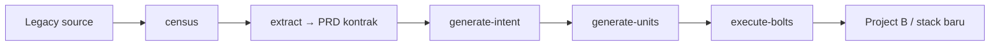

# Extract → PRD-kontrak revamp — desain (GATE: menunggu approval owner, JANGAN implement dulu)

**Status: DESIGN-ONLY.** Sumber: brainstorm owner 2026-08-26 + field run MTConvert (1 file kode hidup digiling 6 wave penuh, KB banyak file yang tidak dibutuhkan). Objective owner yang mengikat: **tidak overkill, tidak overengineer — "core-core dan yang esensi saja, sesuai kebutuhan untuk dev AI"**. Bayangan target: *"minta Claude revamp dari project A ke B, dia langsung jalanin"* — AI membangun ulang **sesuai kontrak hasil baca source code legacy**.

## Reframe inti: "lengkap" dikontrak ke census, bukan ke jumlah artefak

Hari ini extract-intelligence mengukur kelengkapan lewat template: 6 wave tetap + tree KB bernomor (`00-overview`…`99-rebuild-architecture`) — setiap project bayar semua, berapapun bobotnya. Desain baru: **lengkap = setiap item census tercatat statusnya (ke-cover, atau masuk Open Questions)**.

- Census = inventaris yang di-enumerasi dari kode legacy: module, entity, flow, integration.
- Engine 1 file yang ter-cover utuh oleh 1 PRD = 100% lengkap. Core banking 40 module = 40 rumah — juga 100% lengkap.
- Project kecil murah **bukan karena dipangkas**, tapi karena census-nya memang kecil. Gap kelengkapan jadi bisa diaudit (item census tanpa status = extraction belum selesai), bukan diasumsikan dari "semua wave sudah jalan".

## Output: PRD = kontrak revamp

Tugas extraction = **menyusun logika sistem dalam bahasa manusia**, tech-agnostic. Hasil susunan itulah PRD-nya — satu artefak yang sekaligus muka manusia (tim baca) dan makanan mesin (`generate-intent` memang mengonsumsi PRD di jalur greenfield).

**Bentuk per skala (resep sama, porsi ikut census):**

| Census | Output |
|---|---|
| 1 module (xs) | **1 PRD** — selesai |
| >1 module | 1 PRD per module + 1 PRD overview (ERD + alur lintas-module, Mermaid per standing rule) |

**Template seksi PRD (lean — hanya yang dev AI butuhkan untuk rebuild):**

1. Apa yang sistem lakukan (2–3 kalimat)
2. Aturan bisnis (logika inti: rules, mapping, kalkulasi)
3. Alur proses (Mermaid — standing rule semua flow)
4. Format data in/out (struktur input, struktur output)
5. Edge cases & gotchas (yang terbaca dari kode: retry, fallback, side effects)
6. Open Questions (yang ambigu di kode — dicatat, TIDAK PERNAH dikarang)

Seksi yang kosong di-omit (doktrin "omit, never fabricate"), bukan diisi placeholder. Tidak ada narasi arkeologi kode, tidak ada dokumentasi struktur file legacy — itu bukan kebutuhan rebuild.

## Anti-halu: utuh, dalam bentuk wajarnya

Moat tidak dilonggarkan — dipindah ke bentuk yang proporsional:

- **Sitasi inline** `file:line` di belakang klaim (di project kecil ini murah dan membantu pembaca; di project besar tetap per-klaim, bukan per-paragraf kosmetik).
- **Ambigu → Open Questions**, bukan default diam-diam. Slot OQ memang sudah ada di alur PRD mega-sdd; OQ business tetap human-decided dengan keterangan Indonesia (standing rule).
- **Secret-scan gate dipertahankan** (mirror perilaku sekarang): scan+redact sebelum setiap PRD ditulis — legacy rutin hardcode kredensial.
- Marker `[VERIFIED]/[INFERRED]/[OPEN]` sebagai sistem file terpisah **pensiun**; semantiknya terserap: klaim bersitasi = verified by construction, tanpa sitasi tidak boleh ditulis, ambigu = OQ.

## Eksekusi: census → konfirmasi → extraction proporsional

1. **Census** (enumerasi dari kode; reuse filter GROUND yang sudah ada — log/data/backup tak terhitung by construction).
2. **Konfirmasi pecahan module** — hanya bila census mendeteksi >1 module: satu OQ dengan keterangan (usulan pecahan dari struktur kode + domain; manusia konfirmasi supaya pecahan sesuai cara tim mikir). Census 1 module = tidak ada pertanyaan.
3. **Extraction per module** — paralel bila module banyak (cap `--max-parallel` existing); project xs = main thread, tanpa subagent, tanpa wave.
4. **Overview** (hanya multi-module): ERD + alur lintas-module — sintesis di main thread.
5. **Gate kelengkapan**: setiap item census punya status. Item tanpa status = halt, bukan lolos.

## Rantai revamp (unifikasi jalur)

PRD kontrak masuk `generate-intent` lewat jalur PRD yang **sudah ada** (format greenfield) — brownfield dan greenfield konvergen ke satu format konsumsi. "Revamp A ke B" = frasa pintu depan yang merantai chain di atas; titik sentuh manusia hanya yang moat wajibkan (konfirmasi module, OQ business, CONFLICT/halt gates).

## Amendemen implementasi (2026-08-26, hasil pemetaan 7-reader atas konsumen nyata)

Pemetaan blast radius sebelum implementasi menemukan empat fakta yang mengoreksi desain — dicatat DI SINI sebelum kode ditulis (pelajaran standing: patch lapangan wajib lewat spec):

1. **Rumah output TETAP `.mega-sdd/knowledge-base/`** — 15+ konsumen infra (resolve-project-root signal, gateway publisher `knowledge-base/**`, migrate-paths, graph builder, analyze fingerprint, preflight writable, komentar hooks) bergantung pada PATH, bukan grammar isi. Yang diganti = ISI: `census.json` + `modules/<module>.prd.md` + `README.md` (+ `00-overview` digantikan overview PRD di README/multi-module) — tree bernomor `00/10/20/30/40/50/99` pensiun. Kolateral turun dari ~30 permukaan test jadi belasan; hasil untuk user identik.
2. **`--kb` flag SURVIVES** (menunjuk dir extraction yang kini ber-grammar PRD kontrak) — mematikannya merusak chain orchestrate-flow + preseden handoff tanpa keuntungan. Yang pensiun: grammar tree bernomor di kb-submode, dan `--phase=N` (module = unit fase rebuild; urutan direkomendasikan di overview dari dependency antar-module). Baris tabel "deprecate --kb" di bawah DIBATALKAN oleh amendemen ini.
3. **Axis mutability `[LOCKED]/[INTENT]/[ARTIFACT]` KEPT sebagai tag inline** — dia invariant #4 plugin dan justru inti "kontrak revamp" (preserve 1:1 / outcome bebas / buang): menggerakkan Hard Rules execute-bolts, `data-mutation-policy.md` (tetap diemisi bila ada [LOCKED]; konsumen build-dispatch-prompt tak berubah), dan routing tier generate-intent. Axis confidence yang menyusut: default = verified-by-citation, hanya `[INFERRED]` (satu sumber) dan `[OPEN]` (→ OQ) yang ditandai eksplisit. Baris "marker pensiun" di bawah dibaca dengan koreksi ini.
4. **Absen eksplisit, bukan omit diam** — seksi kosong ditulis satu baris `_Tidak terdeteksi._` (auditable; gate bisa bedakan "tidak ada" vs "belum diekstrak"), bukan dihilangkan. `census.json` menyerap `.scan-meta.json` (deteksi stack) dan snapshot freshness (`source_files_sha256_map`) — dua file runtime lama pensiun.

Temuan bug tumpangan (difix di seri ini karena file yang sama disentuh): `ground.sh` `catalog_roles` mem-parse sel PERTAMA baris tabel model-tiers (= nomor baris), bukan nama role — guard `model_tier_unknown` salah alarm untuk semua override sah. Fix regex + test menyertai penggantian row wave.

## Yang PENSIUN (dan migrasinya)

| Pensiun | Pengganti / migrasi |
|---|---|
| 6 wave tetap + tree KB bernomor | Census + extraction per-module proporsional |
| `generate-intent --kb=<path>` | Jalur PRD existing (`--kb` deprecated dengan pesan tunjuk jalur baru; sapu semua situs referensi — pelajaran removal-PR standing) |
| KB sebagai secondary ground truth di `bind-codebase` | PRD kontrak (sitasi inline = anchor yang sama kelasnya) |
| Sidecar `evidence.md` (Opsi C brainstorm) | DITOLAK — sitasi inline cukup; dua file per module = surface tanpa konsumen |
| Advisory brownfield-XS "minimal/penuh/batal" (amendemen №A §2, c71d567) | MOOT — extraction proporsional tidak perlu ditanya mau diet atau tidak; №A §2 lengan brownfield di-supersede spec ini (stempel di dok №A) |

## Yang TIDAK berubah

Citation discipline, halt taxonomy, OQ business human-decided + keterangan, CONFLICT gate, secret-scan, semua gate bolt-stage hilir, doktrin omit-never-fabricate, Mermaid untuk semua flow. `generate-units`/`execute-bolts` tidak disentuh — mereka menerima vault hasil intent seperti biasa.

## Keputusan owner yang masih terbuka

1. **Ambang "module"** — angka final ambang census (berapa file/entity per module sebelum dipecah) ditera saat implementasi terhadap 2–3 legacy nyata kantor; bukan keputusan desain.
2. **Nasib skill `extract-intelligence`** — direstrukturisasi in-place (nama tetap, trigger "revamp" ditambah) vs skill baru + yang lama dihapus. Rekomendasi: **in-place** — konsumen luar mengenal namanya; sejarah di CHANGELOG.

## Urutan implementasi yang diusulkan (setelah approval)

1. Census + gate kelengkapan (+ test: item tanpa status = halt).
2. Template PRD kontrak + extraction per-module + secret-scan mirror (+ replay MTConvert-class: 1 file → 1 PRD, ukur waktu vs baseline 6-wave).
3. Jalur konsumsi: `generate-intent` terima PRD kontrak (jalur existing), deprecate `--kb`, repoint `bind-codebase`; sapu dok/referensi.
4. Frasa pintu depan "revamp A ke B" di orchestrate-flow + stempel supersede di №A §2.

Tiap langkah: satu commit, suite dua tree, CI hijau, moat tidak disentuh.
