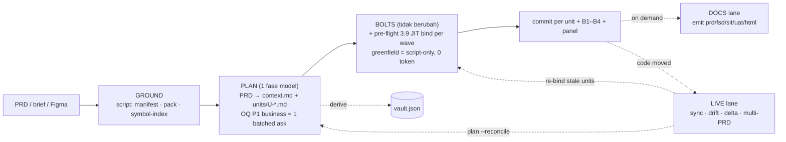

# v8 "Fused Pipeline" — desain (DRAFT, gate keputusan owner)

**Status:** APPROVED BERTAHAP — gate owner 2026-09-10 (keputusan per fase + kriteria ship dikunci di §7 "Keputusan gate"). Head yang diaudit: `5f7f220` (7.30.0). P0 dimulai 2026-09-10 → rilis 7.31.0; sensus lengkap diarsipkan di `research/2026-09-10-v8-consumer-census.md`; runbook baseline di `research/2026-09-10-p0-baseline/README.md`.
**Bukti:** lima census konsumen per artefak (path:line, Appendix A), tracer statis HEAD (`benchmarks/scripts/measure-context.sh`, arm `optimized` di 7.30.0), data P5 (`research/2026-08-04-p5-measurement-runbook.md`), angka tim (`research/2026-08-23-team-feedback-triage.md`), dan vault lapangan `TRAINING/p5-express-arm/.mega-sdd/vaults/simkredit-be` (ukuran riil artefak).
**Cara baca:** §0–§8 = inti keputusan (≤3 halaman). Appendix = data yang memutuskan. Semua angka v8 berlabel **EST** (proyeksi desain) atau **MEASURED** (diukur di HEAD); jangan dikutip tanpa labelnya.

## 0. Verdict yang dibilang bukti (bukan sentimen)

Hipotesis kerja "masalahnya arsitektur relay 5-fase, bukan sisa lemak" — **sebagian benar, sebagian tidak**:

| Klaim | Verdict | Bukti |
|---|---|---|
| Tiap fase menulis kontraknya sendiri lalu diteruskan | **BENAR** | 3 fase model pra-kode (intent → bind → units) menulis vault 4 dok (**77 KB** di simkredit) + `binding.md` (**21 KB** di arm klasik) + units (**95 KB**). Handoff YAML antar fase punya **0 konsumen input** — fase berikutnya re-derive dari disk (`derive-state.sh`); 14 dari ~32 field-nya validator-only (App. A3). |
| Vault sebagai dokumen antara mayoritas tidak dibaca hilir | **BENAR** | Dari 4 dok, section dengan pembaca BUILD deterministik cuma: DBML, `### F-*` + Mermaid + DoD, tabel NFR, `## Open Questions`, `### D-NNN`, frontmatter `implementation_mode`. **Nol byte** vault markdown masuk dispatch prompt (`build-dispatch-prompt.sh` baca `vault.json` saja: sha256, `design_system`, `scope_metadata`). Architecture prose, Glossary, Source documents, Overview = nol pembaca BUILD (App. A1). |
| bind sebagai fase tidak perlu | **BENAR untuk fasenya, SALAH untuk verdict-nya** | Gate CONFLICT yang ditegakkan hook **sudah hidup di dispatch execute-bolts** (`hooks/pre-tool-use:854`), bukan di generate-units (refusal-nya prose-only). execute-bolts sendiri **tidak membaca** `binding.md`; builder membacanya cuma per `binding_refs` (advisory, omittable). Jadi bind → gate JIT = memindahkan **penulisan**, bukan gate. 10/10 CONFLICT nyata di arm klasik ber-anchor file (`schema.prisma`, `auth.ts`, `register/page.tsx`) = kelas yang tertangkap kalau verifikasi di-scope ke `target_files`. |
| Overhead konstan berapapun ukuran unit (Igoo0) | **SEBAGIAN kejawab** | xs dispatch 7.28.0 = 18.174 → 6.342 B (−65 %, 5.7:1). Sisanya ada di **badan unit** yang verbatim (105–157 baris di lapangan) — v8 memangkasnya di **authoring**, bukan di dispatch. |
| Diet 7.0–7.5 belum cukup → arsitektur | **BELUM TERBUKTI** | Floor express P5 = 1h45m net ke bolt pertama; **tidak ada dekomposisi per fase** untuk arm express (transkrip tidak ada di mesin ini). Dekomposisi klasik: intent 34m · OQ 48m · bind+CONFLICT 30m · units 43m · **bolt-1 43m**. Fusion menyerang 155 menit pra-kode, **bukan** 43 menit bolt. Target ≤1 jam untuk 3-screen tergantung bolt-1 ≤45m — di luar jangkauan desain ini. |

**Konsekuensi:** v8 = lipat pra-kode jadi **1 fase model** + bind jadi gate JIT; bolt-stage (38/89 situs gate, seluruh B1–B4) **tidak disentuh**. Kill-criterion di §7 P0: kalau baseline 7.30 menunjukkan pra-kode < 25 % dari time-to-first-code, v8 lane BUILD tidak membayar — berhenti di P1 (JIT bind saja).

## 1. Arsitektur v8

Tiga lane. **BUILD** (default) = GROUND (script) → `plan` → `bolts`. **DOCS** (opt-in) = emisi diturunkan dari units + kode + PRD + context.md. **LIVE** = keyed ke units + `bolts/U-*/binding.json` + `vault.json` turunan. Surface tetap 3 verb + one-timers; `/mega-sdd <prd>` mengusulkan chain 2-hop dengan **satu** konfirmasi.

## 2. Artefak: dibunuh / dilebur / dipertahankan

| Artefak v7 | Nasib v8 | Bukti konsumen (App. A) |
|---|---|---|
| `vault.md ## Overview`, `## Architecture` prose, `## Glossary`, `## Source documents`, `## Last updated`, `## Phase context`, `model.md ## Constraints/Sources/Out of Scope`, `constraints.md ## Technical/Business constraints`, `## Design system` | **DIBUNUH** (tidak ditulis lagi) | Nol pembaca deterministik; Overview cuma DOCS (FSD §1/§2 → v8 baca PRD langsung); Architecture cuma prose walk generate-units + sweep bind (keduanya mati bersama fasenya). |
| `flows.md`, `model.md` DBML, `constraints.md` NFR + `## Open Questions`, `vault.md ## Decisions` (opsional), lock scalars | **DILEBUR** → `context.md` (layout-3, satu file, **grammar section identik**) | Pembaca: `validate-flow-coverage.sh` (gate BLOCKING), `derive-claims-ledger.sh`, SIT/UAT/PRD builders (Mermaid+DoD verbatim), `state_probes.probe_oq_counts` (oq_gate), `validate-handoff-binding-units.sh` (universe OQ), detect-drift Step 1, multi-PRD ownership (via `vault.json`). |
| `constitution.md` | **DIPERTAHANKAN** apa adanya | Dibaca builder (:2071), `validate-constitution*`, `emit-claude-rules`, GateGuard index — bukan artefak relay. |
| `vault.json` | **DIPERTAHANKAN, diturunkan dari `context.md`** (writer sama, path re-key) | `derive-vault-json.sh` sudah md-authoritative; front door ownership check sudah `vault.json`-only (`commands/mega-sdd.md:51`). Key mati (`adrs`, `open_questions_summary`, `changelog`, `constitution_version`, `advisor`, sub-field entities/flows/OQ) tetap ditulis 1 minor cycle, lalu dicabut. |
| `claims-ledger.json` | **DIBUNUH** → `bolts/_wave-N/claims.json` (per wave, dari units) | Satu-satunya konsumen = model pass bind; `doc_shas` + envelope 0 pembaca. |
| `binding.md` (+ `binding.json` vault-level) | **DILEBUR** → `bolts/U-XXX/binding.json` (script-written, hook-guarded, per unit) | Yang dibaca hilir cuma 4 hal: State→`task_type`, Anchor→`## Anchors`, Confidence→label, CONFLICT/OQ id→`binding_refs`. Summary, Tech-OQ cells, Suggested Hard Rules tables, `Codebase reality`, `field_diff` = 0 pembaca script. |
| `bound/` + `make-bound.sh` | **DIBUNUH** | Anotasi `<!-- BIND: -->` 0 pembaca (kontrak sendiri bilang advisory, `binding-contract.md:214`); eksistensinya cuma bit routing → diganti posisi "units present". |
| handoff YAML antar fase | **DIBUNUH di lane BUILD** (chain 2-hop di front door); tetap untuk LIVE/`--classic` | Tidak ada konsumen input; fase berikutnya re-derive dari `state.json`. Validator gate-time recompute-nya tetap untuk hop yang tersisa. |
| `codebase-map.md` | tidak berubah (on-demand, classic) | express sudah tanpa map sejak 5.35. |
| `units/U-*.md` | **DIPERTAHANKAN + diperluas** (§3) | Ini kontrak handoff yang sebenarnya: execute-bolts baca unit saja. |

## 3. Keputusan lane BUILD + DOCS (mekanika penuh: Appendix C–D)

- **Unit = satu artefak, ditulis sekali.** Grammar aditif: `prd_source:` (sitasi PRD — hari ini unit tidak pernah menyitasi PRD, cuma vault), `context_source:` (alias `vault_source`), `## Claims` (brownfield: klaim tentang kode eksisting yang unit andalkan = kontrak). Verdict-nya **bukan di unit** melainkan `bolts/U-XXX/binding.json` (script-written, hook-guarded) — evidence tidak hidup di file yang bisa diedit model. `## Hard rules`/`target_files`/`acceptance_test`/`binding_refs`/`## Anchors` tidak berubah. Field 0-pembaca berhenti ditulis. Unit `xs` ditulis ringkas saat authoring → target **≤4:1** di harness f4-xs (hari ini 5.7:1).
- **`context.md` layout-3** = satu file, grammar section identik `_lib/vault_md.py`: wajib Flows (Mermaid+DoD), Data model (DBML), Constraints (NFR), Open Questions; opsional Decisions, Overview; frontmatter = lock scalars + `author`/`stakeholders` + pin PRD. Re-key konsumen = satu resolver path. EST 34–41 KB vs 77 KB.
- **`plan` = 1 fase model:** PRD → `context.md` + units + `_index.md` → `derive-vault-json.sh` → validator tulis → **SATU** `AskUserQuestion` batched untuk OQ P1 business, tech auto (`scan|recommend|hard_rule`), xs medium lahir `deferred`. Rail A1 anti-rot + self-slice per modul. Rail baru **`validate-plan-coverage.sh`** (sensus requirement PRD vs `prd_source` units → halt `plan_coverage_gap`).
- **JIT bind = pre-flight 3.9 execute-bolts, per wave:** `derive-unit-claims.sh` (script) → greenfield/create-only = cek filesystem, **0 token model, stdout terukur**; klaim non-fs → ladder E3 express-bind verbatim di-scope wave → `write-unit-binding.sh` (sole writer) → gate `validate-handoff-binding-units.sh --units=` → deny hook yang sama dengan hari ini. CONFLICT → halt `binding_conflict` → `resolve-oq --binding`. `sync --full-bind` = JIT semua unit (sweep E2 hidup di sini).
- **Panel + routing** v7.1/7.8 tidak berubah.
- **DOCS:** FSD §4/§7/§8/§9, SIT §3–§4, UAT sudah unit/bolt-keyed (0 perubahan); flows/OQ/NFR re-key path; verdict FSD §5/§7 = union `bolts/*/binding.json`; FSD §1/§2 + PRD §1/§3 **baca file PRD langsung** (absen → `[Pending — PRD §…]`, tidak dikarang). **Yang tetap ditulis di depan** (tak bisa diturunkan mundur) → rumah baru: Mermaid flow + DoD, OQ, `D-NNN` (bila ada) → `context.md`; `[LOCKED]` → `constitution.md`; NFR yang PRD tak sebut → OQ; `scope_metadata`/`prd_sha256`/`author`/`stakeholders` → frontmatter `context.md` (default git user / PRD / `[Pending]`, tidak pernah ditanya); `squads.yaml`/`modules.yaml` tetap `_meta/`.

## 4. Lane HIDUP — re-key + degradasi jujur

| Lane | v7 key | v8 key | Status |
|---|---|---|---|
| sync changed-set | git + journal | sama | ✓ 0 perubahan |
| sync short-circuit (`sync-intersect.sh`) | changed ∩ (`binding.json claims[].anchor` ∪ units `target_files`) — fail-closed tanpa binding.json | changed ∩ (units `target_files` ∪ `## Anchors` ∪ union `bolts/*/binding.json` anchor) | re-key glob; fail-closed tetap (brownfield tanpa binding per unit ⇒ full JIT) |
| re-bind | `bind --paths=@` | `bolts --rebind=@paths` (JIT untuk unit terdampak; head recertify tetap) | ✓ lebih sempit, sama fail-closed |
| detect-drift Step 1 | `model.md`/`flows.md`/`## Architecture`/`## Decisions` | `context.md` DBML/Flows/Decisions | **DEGRADASI:** compare Architecture prose hilang. Siapa kena: tim living-vault brownfield/revamp yang mengandalkan drift prosa arsitektur (Host-AS400, multifinance). Untuk mereka KB PRD-kontrak = substrat lebih kaya; `--classic` tetap ada 1 major. **Amendemen owner:** dicatat di CHANGELOG 8.0 sebagai breaking yang disengaja; tim Host-AS400/multifinance diberi tahu eksplisit SEBELUM 8.0, bukan lewat release note saja. |
| `generate-units --reconcile` | `binding_refs`/`vault_source` + binding.md baru | `plan --reconcile`, bukti flip `task_type` dari `bolts/U-*/binding.json` | ✓ |
| diff-vault (revisi PRD) | `prd_sha256` + VAULT-DIFF literal doc + `derive-delta-paths` → binding.json | sama, literal = section `context.md`; affected = units yang `context_source`/`prd_source` menyentuh section | re-key; **NB defect HEAD:** `derive-delta-paths.sh:127` regex `0\d-*.md` legacy-only → di vault layout-2 lane delta **mati** (die exit 2 → full re-bind). Fix di P0, independen v8. |
| multi-PRD ownership | `vault.json entities/flows` | sama (turunan `context.md`) | ✓ 0 perubahan |
| graph | `vault.json` + `binding.json` + units | claim node dari union `bolts/*/binding.json` | re-key glob |
| PENDING-SYNC digest | `binding.md §CONFLICT-N` | `bolts/U-XXX/binding.json` CONFLICT id unit-scoped | re-key |

**Degradasi tambahan:** (b) coverage klaim whole-vault hilang di antara `--full-bind` — klaim PRD yang tak disentuh unit manapun tidak diverifikasi; ditutup sebagian oleh `validate-plan-coverage.sh` (Appendix C), sisanya = `sync --full-bind` on demand; siapa kena: audit adopsi "apakah kode sinkron dengan spec" (BA/QA), bukan developer harian. **Amendemen owner:** dokumentasi user v8 memuat satu kalimat eksplisit — *audit sinkronisasi penuh = `sync --full-bind`* — supaya BA/QA tahu tombolnya ada, tidak diam-diam. (c) CONFLICT bisa ketahuan lebih telat (saat dispatch, bukan sebelum decomposition) → re-plan satu unit; mitigasi: query index saat PLAN mengisi `## Claims` sehingga sebagian besar CONFLICT ter-antisipasi; **rate conflict-at-dispatch diukur di P2**. (d) FSD §1/§2 pada PRD tipis = slot Pending (sudah begitu hari ini via OQ).

## 5. Gate v7 → v8 (anti-halu audit; 89 situs, Appendix A4)

| Kelas | Situs | v8 | Argumen mekanis |
|---|---|---|---|
| **C — keyed units+bolts+git** | 38 (B1–B4, panel-evidence, orphans, whitelist, wave rail, acceptance-expects, render-test, A1, acceptance-path, L0 trio, anchor-freshness, semua writer evidence) | **TIDAK BERUBAH** | Input-nya tidak menyentuh vault/binding. |
| **A — keyed vault docs** | flow-coverage (gate), oq_gate, LOCKED index, preflight `has_vault`, bind Step-0, self-check intent, vault-oqs/flow-staging advisory | **re-key path** ke `context.md` via resolver tunggal; grammar section identik | Parser tidak berubah, cuma file yang dibaca. LOCKED index scan `context.md` + `constitution.md` + `bolts/*/binding.json`; trigger rebuild = mtime file-file itu. |
| **B — keyed binding** | MOAT gate (row 8), forged-state deny, verb battery, `binding-delete rail`, factory ledger phase bind, resolve-oq --binding, review-tier `constitution_b` | MOAT gate → **unit-scoped** + glob `bolts/U-*/binding.json`; delete rail → subsumed evidence-deny (row 28 regex tambah `binding.json`); ledger phase `bind-codebase` → phase `plan` + record JIT | Gate tetap fail-closed pada file unparseable; dispatch-time recompute sudah ada (`:855-877`). |
| **DIBUNUH dengan alasan** | `make-bound.sh` CONFLICT refusal (row 71) | mati bersama `bound/` | Gate kedua di atas salinan yang **0 pembaca konten**; input identik (`verdict==CONFLICT`) sudah dijaga gate unit-scoped di satu-satunya tempat kode diproduksi. |
| | `validate-binding-json.sh` parity (row 79) | mati | Parity 2 representasi output fase yang sama; v8 punya satu representasi script-written + recompute at gate. |
| | generate-units HARD GATE prose (row 44/45) + bind Step-5 (row 50) | mati sebagai prose; **tegakan hook**-nya = gate unit-scoped | Hari ini pun enforcement-nya cuma di execute-bolts; v8 menyamakan prose dengan mekanisme. |
| | generate-intent OQ classifier + self-check (54/55), OQ-ID propagation (46), DAG halts (48), hard-rule grammar (47) | pindah ke PLAN, isi sama | Prose gate berpindah rumah; validator deterministiknya (`validate-vault-oqs`, `validate-unit-spec`, `validate-handoff-binding-units`) tetap. |
| **BARU** | `validate-plan-coverage.sh` (`plan_coverage_gap`), `prd_source` resolve di `validate-unit-spec.sh`, JIT `binding_conflict` | — | Mekanis; sensus PRD dari struktur dokumen (pola `derive-project-scale.sh`). |

Yang dipertahankan utuh per prinsip 2: acceptance test dieksekusi (B4 + `run-acceptance-tests.sh`), whitelist `target_files` (B3), hard-rule pre/postflight (B1 recompute), CONFLICT brownfield (JIT gate, hook yang sama), emisi SIT/UAT/FSD (lane DOCS).

## 6. Proyeksi 2 skenario (tracer statis MEASURED di HEAD; v8 = EST)

| Metrik | v7.30 (MEASURED) | v8 (EST) | Catatan |
|---|---|---|---|
| Konteks statis PRD → dispatch bolt-1 (T01, greenfield) | 453 KB / ~112 k tok / 31 file | 250 KB / ~62 k tok / 16 file (**−45 %**) | drop 295 KB (intent 135 K, units SKILL 29 K + schema, orchestrate 97 K) ← ganti 92 KB EST (`plan` SKILL 26 K, guide 24 K, schema+template 32 K, hop 4 K, context template 6 K). Skrip proyeksi: scratchpad `v8-projection.py`. |
| Konteks fase bind (T02 brownfield) | 250 KB / ~62 k tok | 9 KB / ~2 k tok, **sekali per run** (−96 %) | ref JIT = subset E3 express-bind. |
| Konteks per unit (T10) | 195 KB / ~49 k tok | sama (xs body −10–15 % EST) | bolt-stage tidak disentuh. |
| Output model pra-unit (vault lapangan simkredit) | vault 77 K + constitution 5 K + binding ≈21 K ≈ **103 KB** | context 34–41 K + constitution 5 K + claims ≈1 K/unit ≈ **50 KB** (−50 %) | binding per unit lebih kecil dari sweep whole-vault. |
| Fase model pra-kode | 3 (+resolve-oq bila P1) | **1** | + handoff YAML ×3 → 0. |
| Konfirmasi manusia (happy path) | chain 1 + PROJECT_SHAPE 1 + OQ P1 batched ⌈n/4⌉ + L0 0–1 (+1 kalau tanpa `--deep`, cap 3 sub-skill) = **3–5** | chain 1 + OQ P1 batched ⌈n/4⌉ + L0 0–1 = **2–3** | PROJECT_SHAPE dicatat, tidak ditanya (xs); standard ikut di batch yang sama. |
| Artefak sebelum bolt-1 | 4 dok + constitution + guide + vault.json + html + ledger + binding.md/json + bound/ (5) + blockers + units + _index + modules ≈ **15 + N** | context.md + constitution + vault.json + units + _index (+ `bolts/_wave/claims.json` brownfield) ≈ **4 + N** | |

**Simulasi kertas** (langkah-demi-langkah kedua skenario: Appendix E). 3-screen xs: v7.30 = 4–5 fase model, 3–5 konfirmasi, ≈19 artefak; v8 = 2 fase model, 2–3 konfirmasi, ≈8 artefak. **Waktu:** pra-kode klasik 155 m (P5) → EST 10–15 m; bolt-1 **tidak berubah** (43 m klasik) → time-to-first-code EST **45–60 m**, target ≤1 jam = **borderline, ditentukan bolt-1**. Klinik (standard, 10 unit, brownfield): EST **65–80 m**.

## 7. Rencana bertahap (`--lite` berdampingan dulu)

- **P0 (7.31.x, 0 perubahan perilaku):** fix `derive-delta-paths.sh:127` (defect HEAD); **ukur baseline 7.30** skenario 3-screen + klinik dengan `p5-extract.py` **plus dekomposisi per fase** (pra-kode vs bolt-1) — ini prasyarat brief; simpan census App. A ke `research/` sebagai sensus tetap. **Kill-criterion:** pra-kode < 25 % time-to-first-code ⇒ hanya P1.
- **P1 (7.32–7.34, aditif, flag `--lite`):** grammar unit (`prd_source`, `## Claims`, xs body) + validator; `derive-unit-claims.sh` + `write-unit-binding.sh` + `validate-handoff-binding-units.sh --units=` + pre-flight 3.9. Brownfield sudah "bind at dispatch" walau fase bind masih ada (`--lite` melewatinya). Blackbox stage baru: CONFLICT tertangkap di dispatch. **Amendemen owner:** `validate-plan-coverage.sh` (rail pengganti satu-satunya untuk prose-gap PRD→units, risiko #5) dibangun + dites di **akhir P1**, sebelum `--lite` bisa diaktifkan siapa pun — bukan sebelum jadi default.
- **P2 (7.35+, `--lite`):** `skills/plan` + `context.md` layout-3 + `vault_md.resolve_doc` + re-key deriver/flow-coverage/state_probes/SIT/UAT + lane 2-hop di front door + `validate-plan-coverage.sh`. Ukur: arm tracer `lite` + run live protokol P5 (interaktif, bukan `-p`).
- **P3 (8.0.0 MAJOR):** `--lite` = default, `--classic` tetap; `generate-intent`/`bind-codebase`/`generate-units` → alias resolving ke `plan`/`bolts` (policy ladder: hidup 1 major, cabut 9.0 setelah usage review; **amendemen owner:** pesan alias menyebut satu baris KENAPA — fase dilipat — bukan cuma redirect, karena ini alat komunikasi ke tim yang memberi feedback); emit re-source PRD + union binding; sync/drift/delta re-key; `migrate-paths --vault-layout=3` (dry-run default; section mati dipindah ke `_meta/archive/`, `binding.md` dipecah per unit via `binding_refs` + arsip; **full JIT re-bind wajib** = aturan layout-2). Dual-read layout-3/2/legacy 1 minor cycle, lalu legacy 7-file dicabut (floor kantor sudah 7.6.x).
- **P4 (8.x):** field run tim (Windows+Falcon) sebagai angka resmi; keputusan 9.0.

**Kontrak budget waktu (mandat implementasi owner 2026-09-10 — PIN, dua kolom wajib di tiap laporan fase: *wall per tahap vs budget* dan *jumlah titik interaksi*):**

| Skenario | GROUND | PLAN | bolts | **total DONE (wall)** | titik interaksi manusia |
|---|---|---|---|---|---|
| 3-screen xs greenfield (4 unit paralel) | ≤ 2 m | ≤ 15 m (1 turn + 1 batched ask) | ≤ 35 m wall | **≤ 60 m** | **≤ 2** |
| klinik standard (10 unit) | — | — | — | **≤ 2 jam** | **≤ 3** |

Endpoint budget = **time-to-DONE** (semua unit committed + gate hijau), bukan time-to-first-code; pengukuran = protokol P5 interaktif + ekstraktor `research/2026-08-04-p5-extract.py` (phase decomposition + BOLT-1 breakdown + interaction points + `idle_ratio`; hasil → `benchmarks/results/p0-baseline/`). Semua angka berlabel MEASURED/EST; klaim tanpa label ditolak di laporan gate.

**Dua workstream lintas fase:**
- **W1 zero-idle** (P0.4 audit → P1.4 implementasi, berlaku juga di v7): sensus SEMUA titik chain berhenti menunggu manusia (halt taxonomy + situs `AskUserQuestion`), klasifikasi per titik **BATCH** (dilipat ke satu ask di ujung PLAN) / **DEFER** (dicatat + resurface di laporan akhir) / **TETAP BLOCKING** (hanya CONFLICT, `hard_rule_violated`, OQ P1 business); halt non-blocking di-defer ke laporan akhir; OQ P1 business + keputusan L0 = satu batched ask; pesan halt blocking satu layar (apa berhenti · satu pertanyaan · opsi). Pin: happy-path 3-screen = tepat 2 titik interaksi; bukti tutup P1 = `idle_ratio` run P5 < 20 %.
- **W2 fast lane bolts** (P2.3, di `--lite`): paralel default untuk wave xs tanpa dependency (`parallel_max` existing); verifier round xs dibatasi 1; tanpa konfirmasi per-bolt; ukur WALL per model untuk unit xs (sonnet vs default) dengan acceptance pass sama — lebih cepat ⇒ sel xs→sonnet aktif di `--lite`.

**P0 diamandemen (mandat implementasi):** P0.3 baseline 7.31 MEASURED terdekomposisi — pra-kode per fase vs bolt-1 (implementer turns × durasi, panel, fix rounds, gate scripts, konfirmasi) vs idle (wall − aktif), disimpan ke `benchmarks/results/p0-baseline/`; P0.4 = audit titik interaksi W1.1 (tabel titik × klasifikasi × bukti file:line, `research/2026-09-10-p0-interaction-audit.md`). Kill-criterion tetap: pra-kode < 25 % time-to-first-code ⇒ program berhenti di P1 (JIT bind + W1 saja).

**Keputusan gate owner 2026-09-10 (mengikat, tidak bergeser):**

1. **P0 — GO tanpa syarat.** Fix `derive-delta-paths.sh:127` + tiga divergensi Appendix B (ref-vs-script FSD/PRD; grammar `vault_source` → satu grammar + validator) + arsip sensus ke `research/` + **baseline 7.31 terdekomposisi per fase** (pra-kode vs bolt-1) untuk 3-screen dan klinik. Kill-criterion persis: pra-kode < 25 % time-to-first-code ⇒ berhenti di P1.
2. **P1 (JIT bind + grammar unit) — GO, tidak menunggu P0.** Syarat ship: blackbox stage baru (CONFLICT tertangkap di dispatch) + **10/10 kelas CONFLICT lapangan simkredit direplay lolos di jalur JIT** sebelum `--lite` mengaktifkannya.
3. **P2 (plan + context.md + lane 2-hop) — CONDITIONAL pada P0** (lolos kill-criterion). Dua pengukuran wajib dengan angka revert: (a) context-rot PLAN — kualitas unit standard (klinik 10 unit): acceptance pass rate dan P1 findings panel ≤ baseline; turun ⇒ self-slice per modul wajib atau revert; (b) rate conflict-at-dispatch — > 20 % unit brownfield kena CONFLICT saat dispatch ⇒ mitigasi query-index-saat-PLAN belum cukup, perbaiki sebelum P3.
4. **P3 (8.0.0, `--lite` default) — kriteria ship dikunci sekarang (direvisi mandat implementasi: endpoint = DONE):** (i) **time-to-DONE** 3-screen ≤ 60 m dan klinik ≤ 2 jam MEASURED protokol P5 interaktif, interaksi ≤ 2 / ≤ 3 titik; (ii) kualitas setara: acceptance pass rate + P1 findings ≤ arm classic pada skenario yang sama; (iii) nol regresi moat: seluruh suite C-set 38 situs + blackbox CONFLICT-at-dispatch hijau; (iv) migrasi layout-3 idempoten + full JIT re-bind wajib. Gagal salah satu ⇒ `--lite` tetap opt-in di 8.0, bukan default.
5. **P4** — angka lapangan Windows+Falcon sebagai angka resmi sebelum keputusan 9.0; `test-spawn-ceilings.sh` wajib meng-cover jalur JIT (klaim spawn-neutral dibuktikan, bukan diklaim).

Rambu standing: satu commit per langkah, suite dua tree + CI hijau, parity-proof sebelum delete, moat test (S-series, C-set) hijau per commit, angka MEASURED/EST selalu berlabel, tiap fase P1–P3 berhenti di laporan dengan tracer before/after.

Tiap fase = section spec → tests → dual-blind round → ship (cadence standing).

## 8. Risiko

1. **Context rot di PLAN** pada PRD standard/besar (1 turn menulis 95 KB unit): rail A1 + self-slice per modul + `--scope`; ukur di P2, revert kalau kualitas unit turun (counterweight P5).
2. **CONFLICT telat** (di dispatch): re-plan 1 unit; rate diukur P2; mitigasi §4(c).
3. **Bertentangan dengan Evidence-First 2026-09-05** ("rewrite = OVERENGINEERING, tidak ada bukti incremental gagal"): jawabannya P0 — v8 tidak jalan tanpa dekomposisi waktu; P1 (JIT bind) berdiri sendiri karena buktinya sudah ada (gate sudah di dispatch; fase bind menulis 21 KB yang 4 field-nya saja dibaca).
4. **Bolt-stage = residual waktu**; v8 tidak menyentuhnya. Kalau target ≤1 jam tetap gagal setelah v8, levernya ada di bolt (verifier rounds, xs panel), bukan pipeline.
5. **Prose-only generation tetap prose**: PRD → units tidak punya pembaca deterministik selain `validate-plan-coverage.sh`; itu rail mekanis baru, harus dibangun sebelum `--lite` default.
6. **Tiga layout dual-read** = beban maintenance 1 cycle; resolver tunggal + sweep producer-grammar (7.24.0 rule) wajib sebelum tiap rilis P2/P3.
7. **Windows/Falcon**: JIT bind menambah 2 script + ≤1 model pass per wave; spawn-neutral (script-first, batched per wave, bukan per unit); ukur di P4 dengan `test-spawn-ceilings.sh`.

---

## Appendix A — sensus konsumen (data yang memutuskan; path relatif `plugins/mega-sdd/`)

**A1. Vault docs → pembaca deterministik BUILD/gate.** `implementation_mode` → `derive-claims-ledger.sh:137-142` (klaim `C-MODE`). `## §<id>` → `:184-193` **kosong di vault template** (`express-bind.md:76`). DBML `Table` → `_lib/vault_md.py:105,317-401` → `derive-claims-ledger.sh:195-261`, `derive-vault-json.sh:152`. `### F-*` + Mermaid + DoD → `validate-flow-coverage.sh:321-324,671-730` (**gate blocking**), `derive-claims-ledger.sh:263-269`, `build-sit-evidence.sh:101,269,296-301`, `build-uat-scaffold.sh:95,427,454-458`, `build-prd-core.sh:243-266`, `build-fsd-core.sh:417-440`. NFR table → `derive-claims-ledger.sh:283-299`, `build-fsd-core.sh:496-543`. `## Open Questions` → `state_probes.py:848-880` (oq_gate), `validate-handoff-binding-units.sh:218-224`, `derive-vault-json.sh:159-182`, `build-prd-core.sh:347-362`, `build-fsd-core.sh:640-650`. `### D-NNN` → `derive-claims-ledger.sh:271-281`; detect-drift/diff-vault prose. **Nol pembaca (grep patterns di transkrip agent):** Glossary (`vault_md.py:220` → None), Source documents, Last updated, Phase context, Architecture `### System overview`/`### API contracts` (sebagai parse), `model.md ## Constraints/Entity descriptions product`, semua `## Sources`/`## Out of Scope`, `constraints.md ## Technical/Business constraints`, frontmatter `prd_status`/`prd_source`; `vault.json` `vault_layout`, `adrs`, `open_questions_summary`, `changelog`, `constitution_version`, `advisor`, `phase_total`, `entities[].purpose/fields_count/doc`, `flows[].dod_count/source_acs`, per-OQ `classification_confidence/resolver_owner/*_at/*_reason`. **AUTHOR-only:** `project_scale`, `[origin:]`, Auto-Classification Review, `locked_at/by`. **Dispatch prompt** (`build-dispatch-prompt.sh`): vault hanya lewat `vault.json` `:1093` (sha256 `:1102-1107`, `design_system` `:1109`, `scope_metadata` `:1110`); `generate-units` tanpa script (`SKILL.md:48,52`); constraints/NFR tidak pernah disebut di `skills/generate-units/**`.

**A2. Binding.** Writer `binding.md` = model (`bind-codebase/SKILL.md:82`) + `derive-binding-json.sh` banner; reader deterministik: `binding_md.py` (`parse_state_map`, `parse_frontmatter_metadata` = provenance+head saja, `parse_confirmed_sources` = field 2 saja, `parse_conflict_resolutions`), `validate-handoff-binding-units.sh:123-128,142-200,346-410,514-580` (OQ/CONFLICT harvest + recertify head), `build-dispatch-prompt.sh:2945-3046` (hanya bila `binding_refs` non-empty; `omit()` 4 fallback), `build-fsd-core.sh:187-192,560-568`, `build-locked-index.sh:35-72` (`[LOCKED]` → index GateGuard; trigger mtime `pre-tool-use:1357-1363`). `binding.json`: `claims[].verdict` → `make-bound.sh:69-89`; `claims[].anchor` → recertify + `sync-intersect.sh:128-144` + `derive-delta-paths.sh:12-15,62-66` + `build-graph.sh:371-390`; `field_diff` **0 pembaca script**. `claims-ledger.json`: **0 pembaca script**, konsumen = model pass bind; `doc_shas` 0 pembaca. `.validation-blockers.json`: writer tunggal `validate-handoff-binding-units.sh:705-709`; reader `pre-tool-use:940-966` keyed `SKILL_NAME=mega-sdd:execute-bolts` (`:854`), re-derive `:855-877`; **generate-units tidak membaca state CONFLICT manapun** (hits `:660`,`:710` = ledger + preflight). `bound/`: eksistensi = `state_probes.py:897,954,1282,1291-1301`; anotasi `<!-- BIND: -->` 0 pembaca (`binding-contract.md:214`). Kebutuhan minimum generate-units dari binding: State→`task_type`, Confidence→`grounding_confidence`, Anchor→`## Anchors`, CONFLICT/OQ id→`binding_refs` (`generate-units/SKILL.md:56-65,113,125`; `task-typing.md:17-40`).

**A3. Handoff YAML + map + unit.** Handoff: fase berikut re-derive dari disk (`orchestrate-flow/SKILL.md:66`, `routing-rules.md:24`, `derive-state.sh:71-78`, `bind-codebase/SKILL.md:11,48`); konsumen nyata cuma `status`, `next_action.{suggested_skill,suggested_args,confidence}`, `blockers`, `artifacts` (eksistensi), 4 `metrics.*`, `metadata.model_tiers`, `emitted_by`, `scope` (trigger L9); 14 field validator/producer-only (`pbt.*`, `cycles.*`, `replay.*`, `mutability.*`, `checkpoints.*`, `rationale`, `emitted_at`, `duration_ms`, `sibling_scopes`, `model_tier_sources`). Map: express tidak pernah memproduksinya (`ground.sh:8`, `state_probes.py:1283-1287`); fallback = symbol-index/pack/starterkit-context/`[Pending]`. Unit field 0 pembaca: `mutability` (`unit-schema.md:58` mengakui), `estimated_complexity`, `grounding_evidence`, `superpowers_skills`, `ears` (`unit-schema.md:119`), `scope_name` (prose), `produces/consumes/existing_interfaces` (prose-only), `status: superseded` (tanpa writer). Unit hari ini menyitasi vault+binding+KB, **tidak pernah PRD** (`unit-schema.md:329,205-206`); `vault_source` divalidasi presence-only (`validate-unit-spec.sh:188-190`).

**A4. Gate (89 situs; agent D).** C-set 38 situs keyed units+bolts+git; A-set (vault docs): preflight `has_vault` (row 5), flow-coverage (16), GateGuard index (31/39), bind Step-0 (49), intent self-check (54/55), oq_gate (56), checkpoint resume (58), make-bound (71), vault-oqs/flow-staging advisory (82/85); B-set (binding): python-absent fail-closed (1), MOAT (8), degenerate-map (25), forged-state deny (26), verb battery (33), binding-delete rail (34), generate-units HARD GATE (44/45), OQ propagation (46), bind Step-5 (50), constitution/tech-OQ/pack gates (51–53), factory ledger (4/23/57), make-bound (71), review-tier signal 5 (78), binding-json parity (79). Rekam defect-catch: B1/B2/B3/B4/panel/orphans/MOAT/L0 = CAUGHT; flow-coverage/sibling/ui-quality/cross-cutting = INERT-ON-FIELD (defect pack resolution, fixed 7.12.0); `DO_NOT_MODIFY` snapshot = FIRED-0-TP (fixed 7.9.0).

**A5. Emit + LIVE (agent E).** FSD §4/§7/§8/§9, SIT §3–§4, UAT unit/annex/xlsx = units+bolts+code-keyed (0 vault read). Vault-only yang dibaca emitter: flows Mermaid+DoD, OQ, `author`/`stakeholders`/`squads.yaml`, constitution `[LOCKED]`, NFR, `scope_metadata`, `prd_sha256`, heading vocab Overview, `modules.yaml`, verdict binding. Vault-only tanpa emitter: Architecture, Decisions, DBML, Glossary. LIVE: `sync-intersect.sh:15-26,136-138` fail-closed tanpa `binding.json`; `derive-delta-paths.sh:24-40` fail-closed; detect-drift Step 1 (`SKILL.md:56`) satu-satunya konsumen field signature/step body; multi-PRD ownership (`commands/mega-sdd.md:51`) dan graph vault/flow node (`build-graph.sh:315-348`) sudah `vault.json`-only.

## Appendix B — temuan sampingan (independen v8, layak P0)

1. `scripts/derive-delta-paths.sh:127` — regex literal dok `\b0\d-[a-z0-9-]+\.md\b` legacy-only; `diff-vault/references/report-format.md:130` memandatkan literal layout-2 (`vault.md`/`model.md`/`flows.md`/`constraints.md`) → di vault layout-2 script `die` "no vault-doc literal found" → lane delta selalu jatuh ke full re-bind (fail-closed, tidak silent, tapi lever T09 −20.7 % mati). Terlewat sweep Fase 3.
2. Divergensi ref-vs-script: `emit-fsd/references/section-mapping.md:148-152` (FSD §7 sumber `04-design.md`, tidak pernah dibaca), `:42` (`model.md` di priority list, tidak dibaca); `emit-prd/references/prd-sections.md:67` (PRD §2 klaim baca Overview/flows, script cuma `squads.yaml`); `multi-prd-lifecycle.md:23` (heading md) vs `commands/mega-sdd.md:51` (`vault.json` only).
3. `unit-schema.md:26` menulis `vault_source: <file:section>` sementara template + producer memakai `#section`; di lapangan/fixture ada empat bentuk (`doc#anchor`, `doc:anchor`, `doc §anchor`, `doc`). **Koreksi P0:** `build-graph.sh:392-399` (strip `:line`) membaca `binding.json claims[].vault_source` — field LAIN dengan grammar `<doc>.md:<line>` yang memang benar; jadi ini dua field, bukan tiga grammar satu field. Perbaikan 7.31.0 = satu grammar unit `<doc>#<anchor>` di `unit-schema.md` + advisory deterministik di `validate-unit-spec.sh` (bukan gate baru — unit lapangan memakai keempat bentuk).

## Appendix C — mekanika lane BUILD (detail §3)

**C1. Unit v8 = satu artefak, ditulis sekali.** Delta grammar (aditif, dual-read):
- `prd_source:` — sitasi PRD `<file>#<heading>` / `:line` (baru; hari ini unit **tidak pernah** menyitasi PRD, cuma vault). Divalidasi `validate-unit-spec.sh` (file + anchor resolve); sha-stamped saat emit lewat `build-citation-map.sh` yang memang resolve path apa pun.
- `context_source:` — alias `vault_source` menunjuk section `context.md` (F-id untuk SIT/UAT tetap terekstrak).
- `## Claims` (brownfield) — baris klaim tentang kode EKSISTING yang unit ini andalkan: `- C-U005-01 "<teks>" — expect: <file>[:symbol]`, hasil query index saat PLAN. Ini **kontrak**; verdict-nya bukan di unit.
- `## Hard rules`, `target_files`, `acceptance_test`, `binding_refs`, `## Anchors` — tidak berubah (pembaca B1/B3/B4/anchor-freshness utuh).
- Writer berhenti menulis field 0-pembaca: `mutability`, `estimated_complexity`, `grounding_evidence`, `superpowers_skills`, `ears`. Reader tetap toleran.
- **xs authoring:** untuk `unit_tier: xs` (router 7.28.0), PLAN menulis badan ringkas (Goal 1 baris, Context ≤2 kalimat, steps ≤3, tanpa Anti-patterns/Out-of-scope kecuali bersumber). Target terukur di harness `tests/dispatch-parity/` f4-xs: **≤4:1** (hari ini 5.7:1). "17.9:1 harus mati" = angka ini.

**C2. `context.md` (layout-3).** Satu file, frontmatter lock scalars (`vault_layout: 3`, `implementation_mode`, `project_scale`, `scope*`, `prd_sha256`, `prd_path_at_generation`, `author`, `stakeholders[]`) + section **WAJIB** `## Flows` (`### F-*` Mermaid + DoD), `## Data model` (DBML), `## Constraints` (tabel NFR), `## Open Questions` (grammar OQ hari ini, satu rumah); **OPSIONAL, hanya bila sumbernya ada** `## Decisions` (`### D-NNN`), `## Overview`. Grammar section = `_lib/vault_md.py` yang ada → re-key konsumen = **path resolver satu tempat** (`vault_md.resolve_doc`: layout-3 → layout-2 → legacy). Ukuran EST dari vault lapangan: flows 15 K + DBML 11 K + NFR 2 K + OQ 6 K (+ decisions 7 K) ≈ **34–41 KB** vs 77 KB (−45–55 %).

**C3. PLAN (1 fase model, `skills/plan`).** Step: baca PRD/Figma penuh → `derive-project-scale.sh` → ekstrak tabel kerja internal → tulis `context.md` → tulis units (candidate walk = Step 2–13 generate-units hari ini, sumber = PRD + context, brownfield: query `symbol-index` per kandidat untuk `task_type`/`## Claims`/`Anchors`) → `_index.md` → `derive-vault-json.sh` → validator tulis (unit-spec, flow-coverage, sibling) → **OQ P1 business = SATU `AskUserQuestion` batched ≤4** (pola P3), tech `scan|recommend|hard_rule` auto, xs medium lahir `deferred`. Rail anti-rot A1 tetap (kontrak di awal, tabel verdict di akhir, PRD besar self-slice per modul, `--scope`). Rail baru **`validate-plan-coverage.sh`**: sensus requirement PRD (heading/tabel) vs union `prd_source` units → requirement tanpa unit dan tanpa baris OQ/out-of-scope = halt `plan_coverage_gap` (mekanis; menutup lubang "klaim yang tak disentuh unit tak pernah diverifikasi", §4 butir b).

**C4. JIT bind = pre-flight 3.9 execute-bolts, per wave.** `derive-unit-claims.sh --units=…` (script) menyusun claim set wave dari `## Claims` ∪ `existing_interfaces` ∪ `## Anchors` ∪ `target_files` (create ⇒ must-not-exist; modify/delete ⇒ must-exist) ∪ entitas DBML yang di-`implements`. **Greenfield / create-only ⇒ semua klaim = cek filesystem ⇒ verdict script, 0 token model**; stdout `jit_bind: model_claims=0 fs_claims=N conflict=0` = "no-op terukur". Bila ada klaim non-fs: ladder E3 express-bind **verbatim** (index → Read → collision sweep 2 leg → grep → KB → ungrounded ⇒ OQ/CONFLICT, never CONFIRMED-by-absence) di-scope ke wave; `write-unit-binding.sh` = sole writer `bolts/U-XXX/binding.json` `{head, claims[{id,verdict,state,anchor,confidence}]}`, masuk regex evidence-deny (row 28). Gate: `validate-handoff-binding-units.sh --units=` (unit-scoped) → `.validation-blockers.json` FAIL → deny hook yang sama (row 8). CONFLICT → halt `binding_conflict` → `resolve-oq --binding` berjalan di `bolts/U-*/binding.json`; dependents ter-blok via `depends_on`. `sync --full-bind` / `bolts --bind-all` = JIT untuk semua unit (audit/adopsi) — sweep E2 hidup di sini.

**C5. Panel & routing** per unit tetap (v7.1/7.8); tidak ada perubahan di `resolve-review-tier.sh`.

## Appendix D — derivasi lane DOCS (detail §3)

Sudah unit/bolt/kode-keyed hari ini (0 perubahan): FSD §4/§7/§8/§9, SIT §3–§4, UAT unit/annex, seluruh doc-control. Re-key path saja: flows+DoD, OQ, NFR → `context.md`; verdict FSD §5/§7 → union `bolts/U-*/binding.json`. **Re-source baru**: FSD §1/§2/§10-out-of-scope + PRD §1/§3 → **file PRD langsung** (heading sniff §Background/§Scope/§Goals/§Requirements; absen → `[Pending — PRD §…]`, tidak dikarang) — presedennya sudah ada (`build-fsd-core.sh:414-486` fallback flows).

**Tidak bisa diturunkan mundur (satu-satunya yang tetap ditulis di depan) → rumah baru:** Mermaid flow + DoD (substrat SIT/UAT 1:1) → `context.md ## Flows`; Open Questions (by construction = gap PRD) → `context.md ## Open Questions`; `[LOCKED]` constitution → `constitution.md`; keputusan arsitektur `D-NNN` → `context.md ## Decisions` (opsional, hanya bila arsitek/PRD punya); target NFR yang PRD tak sebut → OQ; `scope_metadata.id`, `prd_sha256`, `author`, `stakeholders[]` → frontmatter `context.md` (default `author` = git user, stakeholders dari PRD atau `[Pending]`, **tidak pernah ditanya**); `squads.yaml`/`modules.yaml` tetap di `_meta/`.

## Appendix E — simulasi kertas (detail §6)

**Simulasi kertas, 3-screen xs (starterkit ada, PRD final):** v7.30 — turn 1 front door + konfirmasi; generate-intent 1 turn panjang (4 dok + constitution + OQ ≈ 28 OQ pra-7.29; pasca-7.29 tech medium deferred); `oq_gate` → resolve-oq batched P1 (1 ask); bind --express 1 turn (E2 sweep baca 4 dok + ladder ~8–15 klaim); generate-units 1 turn (4 unit ≈ 40 KB); execute-bolts (L0 ask 0–1) → bolt-1. Total **4–5 fase model, 3–5 konfirmasi, ≈19 artefak**. v8 — turn 1 front door + konfirmasi; `plan` 1 turn (context ≈20 KB + 4 unit xs ≈ 20 KB; 1 batched ask P1 di ujung); `bolts` pre-flight 3.9 = 0 token (create-only) → bolt-1. Total **2 fase model, 2–3 konfirmasi, ≈8 artefak**. **Waktu:** pra-kode klasik 155 m (P5) → EST 10–15 m (output-bound ≈10 k token + reasoning); bolt-1 **tidak berubah** (43 m klasik / belum terdekomposisi di express) → time-to-first-code EST **45–60 m**; target ≤1 jam = **borderline, ditentukan bolt-1**. Klinik (7 screen/4 entitas/6 flow, standard): plan 1 turn ≈ 20–30 m (10 unit ≈ 95 KB), 1–2 ask P1, JIT bind brownfield 1 model pass per wave (≈10–20 klaim) → **65–80 m** EST.

## Appendix F — P1 kontrak implementasi (JIT bind + grammar unit + W1; flag `--lite`; approved-to-build per mandat 2026-09-10, P1 GO tanpa menunggu P0)

Semua aditif dan dual-read; default v7 tidak berubah sampai P3. Urutan commit = F8. Setiap langkah: suite dua tree + CI hijau, moat test hijau, parity-proof sebelum delete.

**F1. Grammar unit (aditif).** (a) `prd_source: <prd-file>#<heading-slug>` atau `<prd-file>:<line>` (path relatif root; boleh list). `validate-unit-spec.sh` me-resolve file + heading/line **hanya bila field ada** → issue `prd_source_unresolvable` (status FAIL validator; bukan gate hook). (b) `context_source:` = alias `vault_source` (grammar `<doc>.md#<anchor>` yang sama; validator menerima salah satu; writer v7 tetap `vault_source`, PLAN v8 menulis `context_source`). (c) `## Claims` (body, brownfield): satu baris per klaim `- C-U<NNN>-<NN> "<ekspektasi verbatim>" — expect: <path>[:<symbol>] | must-exist | must-not-exist`; ini KONTRAK, verdict tidak pernah di unit. (d) Writer (`generate-units` Step 10 + template) berhenti menulis `mutability`, `estimated_complexity`, `grounding_evidence`, `superpowers_skills`, `acceptance_test[].ears`; reader tetap toleran (tidak ada validator yang mensyaratkan absennya). (e) Badan xs: bila `unit_tier: xs` (router 7.28.0) → Goal 1 baris, Context ≤ 2 kalimat, Implementation steps ≤ 3, tanpa Anti-patterns/Out of scope kecuali bersumber; diukur harness `tests/dispatch-parity/` f4-xs target **≤ 4:1**; advisory `xs_body_advisory` di state unit-spec (bukan gate).

**F2. `scripts/derive-unit-claims.sh --cwd=<root> --vault=<vault> --units=U-001,…`** → `<vault>/bolts/_wave-<head8>/claims.json` `{schema, head, units[], claims[{id, unit, kind, expect, source}]}`. Kind deterministik: `fs_must_not_exist` (target `operation: create`), `fs_must_exist` (`modify|delete`, `## Anchors` path + line-in-range, `existing_interfaces.file`), `symbol` (`existing_interfaces.symbol`, `## Claims` dengan `:symbol`), `text` (`## Claims` tanpa symbol). stdout satu JSON `{"jit_bind":{"fs_claims":N,"symbol_claims":S,"text_claims":T}}`; exit 0 tertulis, 2 usage/unit tak ada. **Greenfield/create-only ⇒ `symbol_claims=text_claims=0` ⇒ nol token model** (bukti no-op terukur).

**F3. Verdict + writer.** Klaim `fs_*` diverdict script (`write-unit-binding.sh --fs-verdicts`); klaim `symbol` diverdict script via `query-symbol-index.sh` (ada di file yang diharapkan = CONFIRMED/IMPLEMENTED; ada di tempat lain saja = CONFLICT collision; tidak ada = OQ); klaim `text` → ladder E3 `express-bind.md` **verbatim** (index → Read → collision sweep 2 leg → grep → KB → ungrounded ⇒ OQ/CONFLICT) dijalankan controller execute-bolts di-scope wave, hasil diserahkan ke writer. **`scripts/write-unit-binding.sh --cwd --vault --unit=U-XXX --claims=<json>`** = sole writer `<vault>/bolts/U-XXX/binding.json` `{schema, generated_by, head, unit, claims[{id, kind, expect, verdict CONFIRMED|CONFLICT|OQ, state, anchor, confidence, evidence, resolution?}]}`; `--resolve C-U005-01=KEEP_VAULT|KEEP_CODE|SPLIT --by=user` untuk write-back resolve-oq. File masuk regex evidence-deny (3 situs hook: python ×2 + `PROTECTED` bash) — Write/Edit/Bash ke file ini ditolak; hanya writer.

**F4. Gate (hook yang sama, unit-scoped).** `validate-handoff-binding-units.sh --units=U-001,…` membaca `bolts/U-*/binding.json` unit terdaftar (∪ `binding.md` vault bila ada) → drop `conflict_unresolved` per unit → `.validation-blockers.json` (writer tunggal yang sama, deny hook row 8 tidak diubah). Tanpa `--units=` perilaku hari ini byte-identik. **execute-bolts pre-flight 3.9** (prose + 3 call script): per wave `derive-unit-claims` → verdict → `write-unit-binding` → `validate-handoff-binding-units --units=` → FAIL ⇒ halt **`binding_conflict`** (registrasi: enum `halt-protocol.md` + `halt-families/bind.md`; ALWAYS STOP; propose = `resolve-oq --binding`). `resolve-oq --binding`: sumber = `binding.md ### CONFLICT-N` ∪ `bolts/U-*/binding.json` claims verdict CONFLICT; write-back per-unit lewat `write-unit-binding.sh --resolve` (bukan Edit — file ter-guard). Dispatch unit ber-CONFLICT ditolak hook; dependents skip via `depends_on`.

**F5. `scripts/validate-plan-coverage.sh --cwd --prd=<file> --vault=<vault>`** — sensus requirement PRD dari struktur dokumen (pola `derive-project-scale.sh`: heading H2/H3 di section requirement/screen/halaman/flow, id `F-*`, baris tabel requirement) vs union anchor `prd_source` semua unit ∪ OQ yang menyitasi heading itu ∪ baris "out of scope" eksplisit → `plan_coverage_gap` (list heading tanpa pemilik) → state `.plan-coverage-state.json` FAIL/PASS. Dipanggil generate-units Step 12 (halt prose `plan_coverage_gap`, registrasi enum + family units) dan `run-analyze.sh` (row). Prasyarat `--lite` dipakai siapa pun (P1-akhir); gate hook = P2 bersama lane `--lite`.

**F6. W1 zero-idle (P1.4; berlaku di chain v7 juga).** (a) Ask OQ P1 business express (`resolve-oq/SKILL.md:54`) menyerap item **L0 toolchain** (probe GROUND `.l0-toolchain-probe.json` advisory + decision absen ⇒ satu opsi di call yang sama; jawaban ditulis ke `.mega-sdd/l0-toolchain-decision.json` oleh resolve-oq; execute-bolts 3.8 lalu diam) dan sub-field Defer/OOS (`defer_to` default tier direkam; alasan = opsi/Other di call yang sama). (b) Carve-out `--auto`: retrofit bridge PRD tanpa `scopes:` ⇒ `scope_inferred: single` direkam di vault.json + laporan; PROJECT_SHAPE low-confidence ⇒ rekam shape + alternatif, jangan tanya. (c) Karantina: `scripts/write-unit-quarantine.sh --unit --reason --halt=<envelope>` menulis `bolts/U-XXX/quarantine.json` (bukan evidence lulus ⇒ tidak perlu guard) + unit `status: quarantined` lewat `compute-unit-staleness.sh` (membaca file itu); execute-bolts melewati unit terkarantina + dependents beralasan, `_summary.md` memuat tabel karantina + satu pertanyaan per unit; semua halt kelas DEFER (audit §C) memakai jalur ini alih-alih parkir. (d) Template halt BLOCKING satu layar (`propose-and-confirm-prompt.md`: apa berhenti · satu pertanyaan · opsi). (e) Pin: suite statis menghitung situs ask happy-path di prose (carve-out ada, Step 6 suppressed, L0 dilipat) = 2; angka live = `interaction_points` ekstraktor pada run P5 owner; `idle_ratio` < 20 %.

**F7. Bukti tutup.** Blackbox stage S14 `tests/blackbox/test-blackbox-pipeline.sh`: unit `## Claims` vs repo seed → `binding.json` CONFLICT → blockers FAIL → deny hook (live). Replay `tests/jit-bind/test-simkredit-conflict-replay.sh`: fixture mini yang mereproduksi 10 kelas CONFLICT simkredit (field hilang `created_at` ×4, tipe money BigInt vs Decimal, enum 2 vs 3, `username` vs `nip`, endpoint refresh tak ada di kontrak, halaman register yang harus dihapus, JWT arrays vs single role) → JIT 10/10 CONFLICT, 0 CONFIRMED-by-absence. `idle_ratio` = run P5 owner (P0.3).

**F8. Urutan commit.** P1.a grammar + validator (`prd_source_unresolvable`, `xs_body_advisory`) + template/schema + writer diet → P1.b `derive-unit-claims.sh` + `write-unit-binding.sh` + regex evidence-deny + suite → P1.c `--units=` di validator + pre-flight 3.9 + `binding_conflict` + resolve-oq write-back + blackbox S14 → P1.d `validate-plan-coverage.sh` + analyze row + halt → P1.e W1 (a–e) → P1.f replay 10/10 + tracer arm `lite` → release **7.32.0** (`--lite` terdaftar di front door sebagai opt-in: pre-flight 3.9 JIT + W1; default v7 utuh). Laporan gate P1: kolom wall-per-tahap vs budget + titik interaksi (dari run owner), MEASURED/EST berlabel.

**F9. As-built 7.34.0 (debt ledger P1, 2026-09-10 — semua angka MEASURED di head rilis, statis).** Koreksi laporan: rilis 7.33.0 menyebut "semua item P1 shipped" — **F1(e) belum**; ditutup di 7.34.0. (1) **F1(e)**: proxy ukuran `xs` diekstrak ke `_lib/unit_tier.py` (satu implementasi, dipakai router + validator; golden f1–f4 byte-identik) → `xs_body_advisory` di state unit-spec (advisory, bukan gate); harness f5-xs-diet: **125 → 119 baris = 5,7:1 → 5,4:1; target ≤4:1 (88 baris) MISS 31 baris** — sisa adalah blok kontrak/proteksi (anti-context 10, provenance 9, NOTE 5, T2 tracker 13, T3 7, omissions 8, banner 12) yang verdict 7.28.0 tolak dipangkas; target tidak dilonggarkan. (2) **F2**: `bolts/_wave-<head8>/claims.json` → **`bolts/_wave-claims.json`** (satu file, ditimpa per wave, head di dalam; direktori per-head menumpuk tanpa cleanup). (3) **F5/F8 `--lite`**: bentuk durable `lane: lite` di `config.yaml` → `probe_lane` → `derived.lane` (cermin `spine:`); rail script `validate-preflight.sh --predictive` menolak hop execute-bolts di lane lite bila `.plan-coverage-state.json` absen/FAIL (fatal, sengaja tidak fail-open); gate hook tetap P2. (4) **C4/§4 amendemen**: `sync --full-bind` dibangun = `derive-unit-claims.sh --units=all` → writer per unit → `validate-handoff-binding-units.sh --units=all` (semua unit LISTED); kalimat owner *audit sinkronisasi penuh = `sync --full-bind`* ada di `commands/sync.md`. (5) **F6c**: `quarantine.json.question` = objek keterangan (text · source · RETRY/MANUAL/DROP + keterangan, Indonesia), dirender verbatim di tabel Karantina. (6) Prosa 3.9/3.10 pindah ke `execute-bolts/references/jit-bind-and-quarantine.md` (SKILL.md 48.503 → 47.067 B); tracer T01 optimized **114.358** est-token (7.33.0: 114.290 — pemangkasan execute-bolts −1.436 B tertutup prosa writer F1(e) +≈1.700 B), lite **115.688** (= optimized + referensi tersebut, +1.330). (7) **P4 sebagian**: spawn ceilings jalur JIT dipin — derive 4 · writer 4 · validator `--units=` 6 · quarantine 2 · plan-coverage 2 · gate in-run Agent + binding.json per unit 86 (python 28; 0 interpreter ekstra) — Windows+Falcon tetap lower bound, angka kantor tetap dibutuhkan sebelum 9.0. **Tidak berubah dari ledger**: batched ask masih SEBELUM units (pindah ke ujung PLAN = P2 `plan`), pin W1 statis, replay 8/10 kelas konten lewat kontrak output ladder (butuh satu run brownfield live), dua run P5 owner + keputusan tiga halt DEFER-loud masih terutang.
