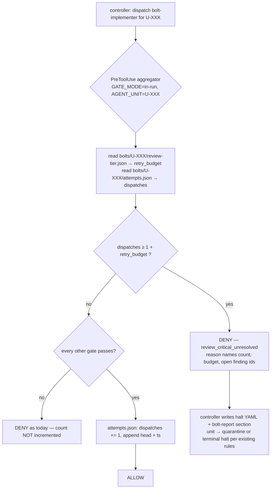

# Hook-enforced attempt cap for the bolt loop — design spec (PROPOSAL)

**Status:** SPEC ONLY — nothing built. Owner gate required before implementation (touches the PreToolUse aggregator = rails-adjacent). Source: `research/2026-09-20-agent-loop-goal-and-run-bounding.md` §3 (the agent-loop map) — the only in-run loop whose cap a script recomputes today is the factory ledger (`scripts/validate-factory-ledger.sh:13` `CAP=3`); every bolt-loop cap is prose the controller is trusted to count.

**One-line:** make `--max-retries` a *mechanism* — the hook counts `bolt-implementer` dispatches per unit and denies the dispatch that would exceed the budget — with zero new forks, zero new skills, zero new halt types.

## 1. The defect (evidence)

| # | Observation | Evidence |
|---|---|---|
| E1 | The budget was exceeded in the field. | `research/2026-09-10-v8-p0-baseline.md:110` — "11 fix round: U-005 ×2, U-006 ×2, **U-008 ×4** [secret_in_code]" against `--max-retries` default **3** (`skills/execute-bolts/SKILL.md:30`). The runner soft-reset the commit and re-ran; nothing counted across the reset. |
| E2 | Fix rounds are the single most expensive part of the loop. | `research/2026-09-11-v8-p2-report.md:25` — "Fix round = 25 % wall … U-008 mengulang 4× untuk `secret_in_code` yang sama"; `research/2026-08-06-bolt-loop-context-efficiency.md` (attempt loop = the context burner). An uncounted round is unbounded spend. |
| E3 | The round number is controller-supplied. | `scripts/merge-panel-findings.sh:48,68,293` — `attempt` in `findings.json` is whatever `--round=N` the controller passes. The ledger is hook-guarded, but its counter is not derived. |
| E4 | A controller-held counter cannot survive the run shape. | The clean xs run was **176 turns inside one 89.7-minute turn** (`research/2026-09-11-v8-p2-report.md:47`); clinic runs cross auto-compaction and `--resume`. A count that lives in model context is lost exactly when the run is long enough to need it. |
| E5 | The doctrine already rules on this class. | `plugins/mega-sdd/CLAUDE.md` §enforcement doctrine — "Prose that says HALT enforces nothing"; `review-panel.md` §Attempt rounds — "a model applying a rule it merely read is not a mechanism" (13 findings stamped `open` where the contract allowed 2). |

Not evidence, and not claimed: that the cap is breached *often*. E1 is one unit in one run. The case for building is that the mechanism is nearly free (§4) and the failure mode is unbounded cost — not frequency.

## 2. Design

**D1 — the counter (`<vault>/bolts/U-XXX/attempts.json`).** Written by the PreToolUse aggregator and by nothing else, inside the python block that already runs for a `bolt-implementer` dispatch (`hooks/pre-tool-use:940`, `AGENT_UNIT` already extracted at `:311`). Incremented only when the aggregator's final verdict is ALLOW — a denied dispatch costs no budget. Shape: `{"schema":1,"unit":"U-003","dispatches":2,"log":[{"n":1,"head":"<sha>","at":"<iso>"},…],"written_by":"pre-tool-use"}`. Counts every re-dispatch regardless of cause (panel fix round, spec ❌, acceptance red, model-tier escalation) — which is what "panel retries and spec retries draw from the same budget" (`review-panel.md:103`) already says in prose.

**D2 — the budget (`retry_budget` in `review-tier.json`).** `scripts/resolve-review-tier.sh --write` already persists the per-unit routing verdict at dispatch and is already the obligation key for the panel-evidence gate. It gains one field, resolved mechanically: lane lite + `unit_tier: xs` → **1** (today's W2 prose rule, `review-panel.md:145`); else `--max-retries=N` when passed, else `.mega-sdd/config.yaml` `execute_bolts.max_retries`, else **3**. Recorded with `retry_budget_source: xs-lite | flag | config | default`. No `review-tier.json` (a pre-7.11 bolt, or tier routing skipped) → the gate is **advisory-silent** for that unit: same migration guarantee as the panel-evidence gate ("earlier bolts advisory only").

**D3 — the deny.** In the aggregator's in-run, per-unit block (the F-18 `acceptance-expects` precedent at `hooks/pre-tool-use:1093-1104`): `dispatches ≥ 1 + retry_budget` → fail entry `attempt-cap`, halt type **`review_critical_unresolved`** (existing, terminal, already carries the right `next_action`; no new halt type, no halt-registry growth). Reason text names the count, the budget + its source, and the still-open finding ids from `findings.json` when present, plus keterangan in Indonesian per the OQ/halt-prompt mandate. This check is **exempt from the in-flight drop** (`:985-987`) — it is about the in-flight unit by definition, like F-18.

**D4 — the early verdict (saves the doomed dispatch).** `merge-panel-findings.sh` reads `attempts.json` + `review-tier.json` and adds `budget_left` to its one-line summary; when `gate` would be `re-dispatch` and `budget_left == 0` it prints **`gate: "halt"`**. The controller stops building a dispatch the hook would deny. `attempt` in the ledger becomes `dispatches` (script-derived); `--round=N` stays accepted for back-compat and a mismatch is a stderr WARN — the derived number wins.

**D5 — anti-self-bypass.** Add `attempts` to the protected `bolts/…/(…)\.json` alternation (`hooks/pre-tool-use:364` and its byte-copy in the dedicated interpreter — the parity pin keeps them in lockstep). Same best-effort-deny honesty as B2: this is a READ artifact, not a recompute — dispatch history is not derivable from git, so there is no ground truth to recompute from. Stated, not hidden.

**D6 — reset is human-only.** Recovery mirrors the factory-ledger precedent (`factory-routing.md:41`): the human deletes `bolts/U-XXX/attempts.json` (or raises the budget in `config.yaml`) and re-runs. The halt `next_action` says so. The model cannot do it — D5 denies the write.

## 3. What this deliberately does NOT do

- **No anti-spin for the bolt loop in this spec.** "Identical open-finding id-set across two consecutive rounds → halt" is the obvious twin of the factory `anti_spin`, and E1 (same `secret_in_code` 4×) argues for it — but it changes *when* a unit halts inside a legal budget, which is a behavior change with no measurement yet. PARKED as Phase 2, needs its own owner gate.
- **No cap on `--max-cycles`, model escalation, or partial-resume** in this spec. Same class (prose-only), zero field breaches on record → evidence-first says no. Revisit if the counter pattern proves out.
- **No new hook event, no Stop-hook block-to-continue, no `/goal` integration** (research §4: `/goal` is user-typed only; it belongs in a usage recipe, not the plugin).
- **No hard ceiling on the flag.** See OD-1.

## 4. Cost

Hot path untouched: the check lives in the python aggregator that a `bolt-implementer` dispatch already pays for (nine parallel re-derives + one python process). Added work = two small JSON reads + one atomic write → **0 new forks**, no new process, no new matcher. Every non-implementer `Agent` call still exits in the 0-fork fast path (`:117`). Token cost to the model: zero on the allow path; one deny reason (~120 tokens) on the cap path, replacing an entire implementer + verifier + L0 round (E2).

## 5. Tests (pins to add)

| Home | Pin |
|---|---|
| `tests/hooks/agent-dispatch-gate.test.sh` | (a) 1st…(1+budget)th dispatch ALLOW and `dispatches` increments; (b) the next dispatch DENY with `review_critical_unresolved` + count/budget in the reason; (c) a dispatch denied by ANOTHER gate does not increment; (d) no `review-tier.json` → silent allow (migration guarantee); (e) cap deny survives the in-flight drop. |
| `tests/size-weighted/test-unit-tier-router.sh` | `retry_budget` resolution table: xs-lite → 1, flag, config, default 3, + `retry_budget_source`. |
| `tests/round-discipline/test-merge-panel-findings.sh` | `budget_left` in the summary; `gate: halt` when budget is 0 and findings are open; `--round` mismatch = WARN, derived wins. |
| `tests/audit-hardening/` (anti-forge family) | Bash + Write/Edit to `bolts/U-XXX/attempts.json` denied; the prot-regex parity pin still holds. |
| `tests/blackbox` | one e2e arm: a unit whose fix never lands halts at the budget instead of looping. |

Producer-grammar sweep (release rule 7.24.0): `findings.json` gains no field consumers must parse; `review-tier.json` gains one — sweep `validate-bolt-artifacts.sh --panel-scan`, `resolve-review-tier.sh` readers, and `run-analyze.sh` globs before release.

## 6. Docs to amend on ship

`skills/execute-bolts/SKILL.md:30` (`--max-retries` — "hook-enforced per unit"), `references/review-panel.md` §Merge gate + §Attempt rounds (replace "the SHARED `--max-retries` cap applies" prose with the mechanism + D4's `gate: halt`), `references/halt-recovery.md` (`review_critical_unresolved` — add the reset path), `plugins/mega-sdd/CLAUDE.md` §"What is actually enforced" (add the attempt-cap gate to the in-run list; keep the seven-gate count honest).

## 7. Open decisions (owner)

- **OD-1 — ceiling on a flag-supplied budget.** A model can forward `--max-retries=50` and defeat the cap. Options: (a) no ceiling, record the source, surface any value > 3 in the bolt-report *(recommended — the flag is the user's by design, and the record makes abuse visible)*; (b) the flag may only LOWER the budget, raising requires `config.yaml` (a human-owned file); (c) hard clamp at 5.
- **OD-2 — Phase 2 anti-spin** (§3): build after one field run shows whether same-finding recurrence still happens outside xs-lite, or never.
- **OD-3 — release number.** Behavior change to a gate → MINOR. The tree is shared with a parallel session; the free version number must be confirmed at ship time.
