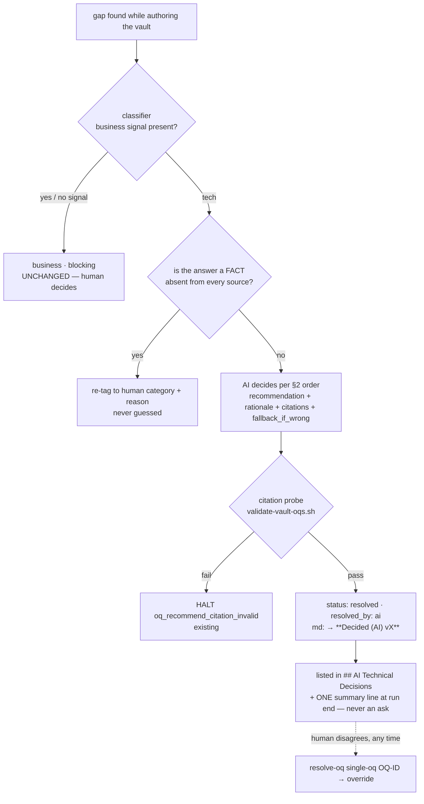

# OQ = business-only; technical questions are DECIDED by the AI — design spec (PROPOSAL)

**Status:** SPEC ONLY — nothing built. Owner gate required: this amends an anti-halu rail ("NEVER auto-accept a recommendation") and a human-decision surface, so it is proposal-first per the moat-takeout rule. The CONFLICT gate (invariants 1–2) is **not touched**.

**Mandate (owner, 2026-09-20, verbatim):** *"oq itu wajib yg benar2 tidak bisa di jawab ai misal terkait keputusan bisnis, klo teknis harus take decision yg terbaik dan terefisien by ai."* Its ancestor, same owner, 2026-05-20 (`docs/superpowers/specs/2026-05-20-tech-oq-autoresolve-design.md:50-56`): *"OQ hanya terkait business. klo terkait teknis lo bisa suggesting/recomendation atau hard rulesnya…"* — that spec built the `category` + `resolution_mode` machinery but stopped one step short: the AI *writes* the answer, then a human is still asked to accept it.

**One-line:** a `tech` OQ is resolved by the AI at the moment its recommendation passes the citation probe — recorded as a labelled, cited, reversible **decision** — so it never reaches `resolve-oq`, never trips `oq_gate`, and never costs a human round trip. Business OQs are untouched.

## 1. Evidence

| # | Observation | Source |
|---|---|---|
| E1 | **Half of all OQs are technical.** 64 OQs across the 10 P3 vault snapshots: **33 tech (52 %)**, 31 business. Clinic (`project_scale: standard`, the unmitigated case): 16 tech of 33. | recomputed 2026-09-20 from `benchmarks/results/p3/*/vault-snapshot/.mega-sdd/vaults/*/vault.json` (`category` field) |
| E2 | **The AI has already answered them.** 31 of 33 tech OQs are `resolution_mode: recommend` @ `classification_confidence: medium` — each already carries `recommendation` + `rationale` + verified `scan_citations` + `fallback_if_wrong`. The other 2 are `blocking` @ `low`. **`scan`: 0. `hard_rule`: 0.** The deterministic `scan` lane never fired once in 10 runs. | same recompute; required fields `skills/generate-intent/references/vault-core.md:251-254,348-356` |
| E3 | **Nothing filters them out of the human walk.** `oq_gate` counts `status: open` at P0/P1 — no `category` term (`skills/orchestrate-flow/references/routing-rules.md:111-113`). `resolve-oq` Step 1 extracts every `[ ]` (`skills/resolve-oq/SKILL.md:58`) and "stays interactive on EVERY OQ" (`:53`). A high-confidence recommendation only changes the prompt's first slot — "User confirms ALWAYS" (`references/recommendation-context.md:24`). |
| E4 | **Bind surfaces, never accepts.** "Recommendations are NOT auto-resolved … User accepts later via the standard `resolve-oq` walk" + "NEVER auto-accept a recommendation" (`skills/bind-codebase/references/oq-resolution.md:48,51`). A failed `scan` *manufactures* a `tech / blocking` OQ (`:22-23`) whose only consumer is a human. |
| E5 | **Cost when it fires.** A single P1 tech OQ (`OQ-AR-2`, architecture family) took **20m45s** of a 42-minute pre-code phase (`research/2026-09-11-v8-p2-report.md:40`). *Honest label: that attempt is marked "konteks, bukan data" (network died later in the run) — directional, not a benchmark.* The lite lane removed that segment and PRE-CODE went 35m13s → 20m37s (−41 %, `:93`, clean data). |
| E6 | **Team complaint, still open.** "28 OQ utk 3 screen" — status **BELUM kejawab** (`research/2026-08-23-team-feedback-triage.md:10`); the proposed fix at `:21` was exactly this: "menaikkan ambang auto-resolve OQ tech … business OQ tetap human-decided". Origin case: 230 OQs, ~180 technical (2026-05-20 spec §1.2). |
| E7 | **When nobody could be asked, the AI decided fine.** Headless runs resolved tech OQs with grounded answers (`xs-lite-8.3.0-levers-run3` OQ-AR-1/AR-2: "server action + zod + `apiServer.post('/v1/contact-messages')`"). Of the ±18 runner assumptions in the clinic baseline, ≥12 were technical (`research/2026-09-10-v8-p0-baseline.md:108`). |
| E8 | **One lane already complies.** `plan` Step 6: "Tech OQs are never asked here" (`skills/plan/references/plan-procedure.md:73`) — and names the hole: "`blocking` tech stays open for `resolve-oq`". |

Already true, so NOT a goal here: tech OQs never block a bolt or unit readiness (`execute-bolts/SKILL.md:66` names the blocking class "OQ P1 **business**"; `derive-ready-units.sh` has no OQ term). Today's cost is *interaction*, not *execution*.

## 2. The rule

> **An Open Question exists only when the AI cannot answer it:** (a) a **business decision** (scope, limits, money, compliance, user-visible behaviour, anything `[LOCKED]`), or (b) a **fact no source contains** (what the legacy system / the organisation actually does). Everything else is a **technical decision** the AI takes — best + most efficient — and records.

**Decision ≠ fabrication (invariant 5 stays verbatim).** Invariant 5 forbids inventing a *fact about the source*. A technical decision asserts nothing about the source: it is a labelled choice with a cited basis and a stated way back. `plugins/mega-sdd/CLAUDE.md:23` already lists **codebase** among the sources. Two things stay forbidden: an invented citation, and "deciding" a missing *fact* — a tech question whose answer is a fact found in no source is case (b): it is re-tagged to the human category with the reason, never guessed.

**How the AI picks ("terbaik + terefisien") — fixed order, first hit wins:** (1) what the codebase already does (reuse-first); (2) the project pack, then the plugin framework pack; (3) a dependency already installed over a new one; (4) current library docs via the bundled context7 for version-sensitive picks; (5) the simplest option that satisfies the PRD constraint / NFR. Tie → fewer new dependencies, then fewer files.

## 3. Design

**D1 — a decided tech OQ is `resolved`, written by the phase that verified it.** Lite: `plan` Step 3.6 writes tech OQs *born decided* (the same mechanism as today's xs "born deferred", which this supersedes — a deferral is decision debt, a decision is not). Classic: `bind-codebase` Step 2.6/2.7 flips from *surface* to *accept* — bind is already non-interactive and already writes `[ ]→[x]` + the `→ **Resolved vX**` annotation for `scan` hits, so the writer exists. New `vault.json` fields: `resolved_by: "ai" | "human"`, `decision_basis: codebase | pack | kb | docs | prd | convention`, `impact: low | medium | high`; the four recommendation fields are reused as the audit trail. **Because the status is `resolved`, `oq_gate` and the `resolve-oq` walk skip it with ZERO change to either predicate** — the two highest-volume leaks (E3) close without touching the ask engine.

**D2 — `tech / blocking` is abolished.** No-match / multi-match `scan` no longer flips to `blocking` (`oq-resolution.md:22-23`): multi-match → pick per the §2 order and cite the winner + list the losers; no-match → decide from pack/docs/convention (`decision_basis` says which). A low-confidence tech item is decided the same way with `impact` and `fallback_if_wrong` carrying the risk — it is never handed to a human as a raw question with no AI input (today's worst case, `interactive-walk.md:262-266`).

**D3 — the misclassification guard is a mechanism, not a sentence.** The 2026-05-20 spec's real fear (§2.2 `:73`) was a business question mis-tagged `tech` and silently auto-answered. Three rails, all in the existing `scripts/validate-vault-oqs.sh` battery (already fired post-write by `generate-intent` Step 3.8 and read by exit code at `plan` Step 5 — no new hook, no new script):
1. **Business wins ties.** Any business signal (`vault-core.md:279-283` — scope, limits/thresholds, regulatory, edge-case behaviour, named stakeholders) forces `business`, whatever tech signal also matched. The no-signal default stays `business / blocking / low` — **unchanged**.
2. **`oq_decided_business_signal` (FAIL, halts generation):** an OQ with `resolved_by: ai` whose text or rationale matches a business pattern, touches a `[LOCKED]` claim, or names money/retention/compliance. This is the mirror of today's advisory `oq_misclassified_tech`.
3. **`oq_tech_undecided` (FAIL):** a `tech` OQ still `open` after the deciding phase. Makes "technical never reaches a human" checkable instead of hoped-for.

**D4 — visibility without asking.** A `## AI Technical Decisions` table (OQ-ID · decision · basis + citation · impact · fallback_if_wrong), sorted `impact: high` first, in `vault.md` (layout-2) / `context.md` (layout-3); `binding.md`'s `## Tech-OQ Recommendations (review required)` becomes the same table under the new name. The run summary prints ONE line — `N keputusan teknis diambil AI (H high-impact) — review: <path>; override: resolve-oq single-oq <OQ-ID>` — with keterangan in natural Indonesian. High impact changes the *sort order and the summary count*, never adds an ask.

**D5 — override is the existing single-OQ walk.** `resolve-oq single-oq <OQ-ID>` on a decided OQ re-opens it, shows the AI decision in slot `[1]`, records the human answer with `resolved_by: human` and keeps the AI decision in the changelog event. `resolve-oq` itself stays a pure human-capture skill ("No invention", `SKILL.md:88-89` — untouched): it simply stops *seeing* tech OQs.

## 4. Rulings this amends (each needs the owner's explicit yes)

| Ruling today | Becomes |
|---|---|
| "NEVER auto-accept a recommendation (always user-in-the-loop for `recommend` mode)" — `oq-resolution.md:51`, `bind-codebase/SKILL.md:137` | "NEVER accept a recommendation whose citations fail the probe or that trips `oq_decided_business_signal`." |
| "User confirms ALWAYS" — `recommendation-context.md:24` | "Business: user confirms always. Tech: the AI decides; the user may override." |
| "The skill never answers an OQ on the user's behalf" — `plan-procedure.md:87` | "…never answers a **business** OQ…" (`[ASSUMED-BY-RUNNER]` stays a benchmark-harness label for business asks only). |
| "Only `high`-confidence tech OQs auto-resolve" — DESIGN-OQ-3, `vault-core.md:266` | `classification_confidence` keeps gating the *category* review table; it no longer gates whether a correctly-tagged tech item is decided. |
| xs rule 4b "born deferred" — `generation-guide.md:98`, `plan-procedure.md:35` | Superseded for tech: born **decided** at every `project_scale`. (P2 *business* deferral on xs is unchanged.) |

**Untouched, by design:** "P1 + category: business NEVER auto-accept" (`auto-memory-handoff.md:77`, test-pinned) · the CONFLICT gate and "Never auto-resolve CONFLICTs" (`bind-codebase/SKILL.md:131`, moat test) — a CONFLICT is *spec vs code disagree on intent*, which is a legitimately human call, and its field rate already collapsed to 0 after anchor auto-repair (`research/2026-09-15-v8-p3-report.md:175`) · propose-and-confirm at bolt halts ("Self-healing without user confirm" stays rejected) · `hard_rule` mode · the destructive-overwrite and LOCKED-unlock confirms.

## 5. Cost / benefit

**Buys:** on the measured mix, ~half of all OQs stop being human work; the classic lane loses the per-tech-OQ `resolve-oq` hop (one framed prompt + one vault write + one `derive-vault-json.sh` per OQ); the ask budget pinned by `tests/w1-zero-idle/test-happy-path-ask-sites.sh` (EXACTLY two stops) gets *easier* to hold. **Token cost: ≈ 0 added** — the four recommendation fields are already authored today; the change is what happens to them afterwards. **Risk:** a wrong technical pick ships unreviewed. Bounded by: citation probe (existing halt), D3 guards, mandatory `fallback_if_wrong`, the review panel + L0 gates + acceptance evidence downstream (a bad library/shape pick surfaces as a red gate, not a silent defect), and the override path.

## 6. Phasing + measurement

1. **P1 — lite lane + the validators** (`plan` Step 3.6 born-decided; D3 checks; D4 table in the `context.md` template; summary line). Smallest surface; the lane that already half-complies (E8).
2. **P2 — classic lane** (bind Step 2.6/2.7 accept; D2 abolishes the `scan → blocking` flip; generate-intent rule 4b superseded; `binding.md` section rename).
3. **P3 — OPTIONAL, separate owner gate: technical asks that are not OQs** and are mechanically derivable — L0 toolchain decision (`execute-bolts/SKILL.md:64`), output path + `implementation_mode` on the classic lane (`setup-flow.md:31,65-73` — the lite lane already derives both via `derive-plan-pins.sh`), squad *partition model* (`:119-121`), `no_starterkit_detected`. Not in P1/P2: they are a different object with their own pins.

**Field validation (the evidence-first exit):** on the team's next real run record `resolved_by: ai` count, **override rate**, and asks per run. Override rate > ~20 % ⇒ the §2 decision order is wrong for that stack → fix the order/packs, do not re-add asks. Zero overrides over 2 runs ⇒ P3 is justified.

## 7. Tests + sweep

Must change (they pin today's behaviour): `tests/skill-triggering/bind-codebase.test.md` TQ2/TQ3/TQ4/TQ5 + the `:238` summary ("No auto-accepted recommendations") · `tests/skill-triggering/generate-intent.test.md` classifier table · `tests/god-review-s4/test-4d-contract-truth.sh:102-103` (`RECOMMEND-CONF`) · `tests/god-review-s2/test-2a-oq-schema.sh` (new halts) · `tests/w1-zero-idle/test-happy-path-ask-sites.sh` (budget prose) · `tests/v8-plan/test-plan-skill.sh` (template section) · `tests/size-weighted/test-project-scale.sh` (rule 4b) · `plugins/mega-sdd/tests/graph/test-vault-layout2.sh` + `fixtures/derive-vault/expected-vault.json` (new fields) · `tests/migrate-paths/test-vault-layout-migration.sh`. Must stay green untouched: `tests/interaction-keterangan/test-oq-single-prompt.sh:1014-1015` (business never auto-accepts) and `plugins/mega-sdd/tests/moat/test-bind-codebase-fork.sh:322` (CONFLICT ruling).
New pins: business-wins tie-break; `oq_decided_business_signal`; `oq_tech_undecided`; no `[tech / blocking]` bracket producible; override round-trip keeps both resolutions in the changelog.
**Producer-grammar sweep (release rule 7.24.0):** the OQ object grows three fields and one md marker → sweep `derive-vault-json.sh`, `_lib/vault_md.py`, `validate-vault-oqs.sh`, `run-analyze.sh` globs, the graph builder, `emit-prd/fsd/sit/uat` OQ renderers, `generate-units` 12.5.g carry, and `resolve-oq` KB mode before release.

## 8. Open decisions (owner)

- **OD-1 — MINOR or MAJOR?** It relaxes an anti-halu rail but not a moat invariant or a blocking gate. Recommended: **MINOR**, with the amended rulings listed verbatim in the CHANGELOG.
- **OD-2 — an escape hatch?** `.mega-sdd/config.yaml` `oq.tech: ask` to restore today's behaviour for a team that wants it. Recommended: **no** — per-OQ override already exists, and a mode flag doubles the test matrix for a behaviour the mandate rejects.
- **OD-3 — case (b) naming.** A missing *fact* is re-tagged into the existing `business` category (its definition already reads "needs stakeholder judgment"; widen the prose to "…or knowledge only a human holds") — avoids a third enum value and its consumer sweep. Alternative: a new `category: knowledge`.
- **OD-4 — extraction KB OQs.** `extract-intelligence` PRD-kontrak §6 OQs are mostly case (b) facts, but the HOST-AS400 audit found four P1 KB OQs that were answerable from source files (`research/2026-09-05-hostas400-kb-audit/A-system-inventory.md:215`). In scope for P2, or its own spec after the next extraction run?
- **OD-5 — release number + shared tree** (a parallel session is active; the free version must be confirmed at ship time).
