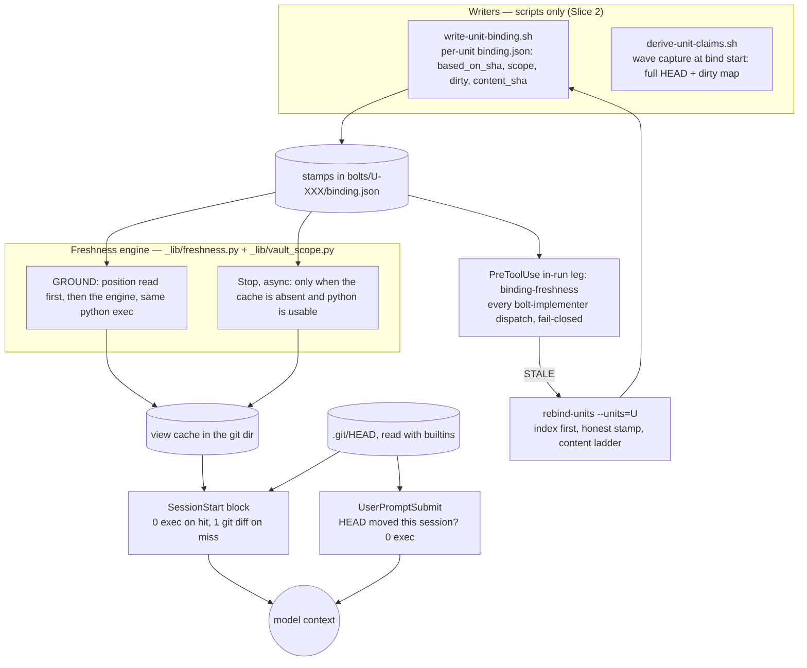
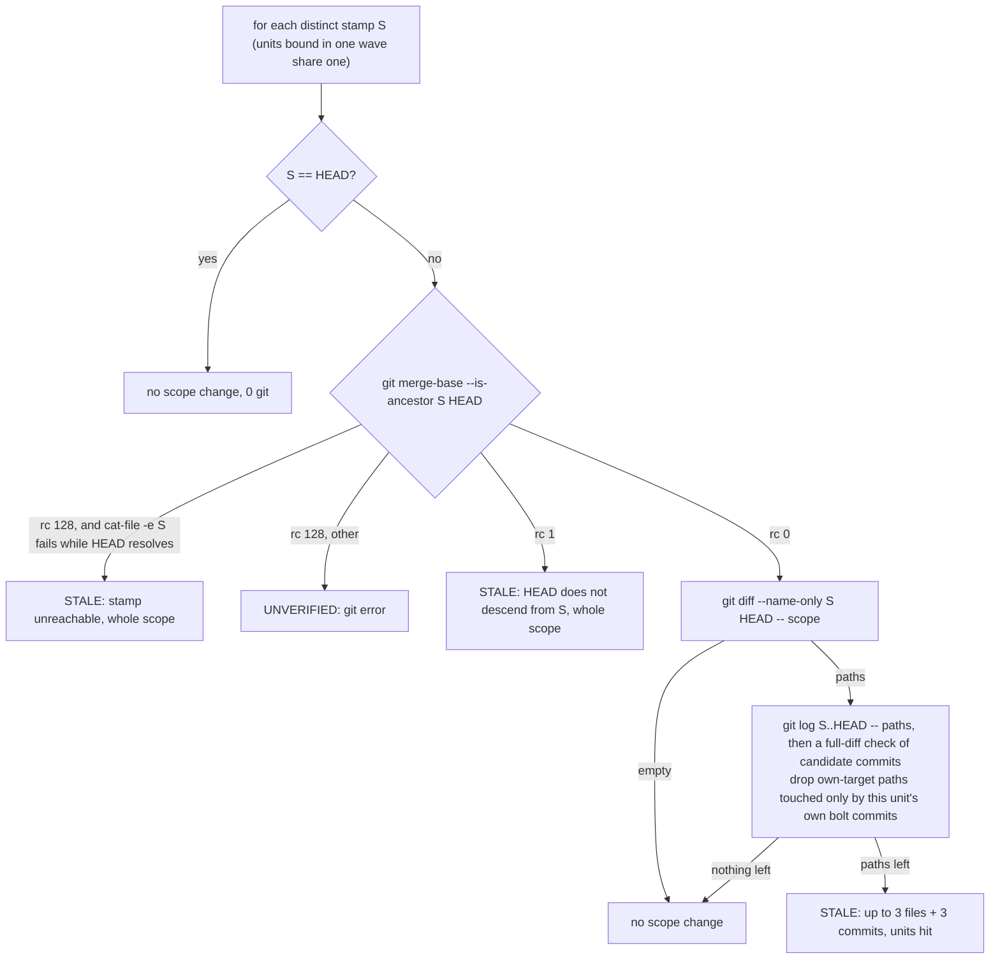

# State anchor — code at HEAD is the source of truth — design spec (Fase 1)

**Status:** DESIGN v3 (three adversarial review rounds) — **Slices 1 and 2 IMPLEMENTED in 8.8.0** (local commit, not pushed). The owner answered the Fase-1 gate with "gas lanjut fase 2" without resolving §0, so every **[ASSUMED]** default below was built; §18 and §19 record where the build differs from this text and why. Still open before the drift can be called fixed: the D33 acceptance run and the D32 Windows check (release gates of this spec).

This is Fase 1 of the owner's three-phase program: Fase 0 audit → Fase 1 design → Fase 2 implementation + proof.
- Evidence base: `research/2026-09-25-state-anchor-audit.md` (Fase 0).
- The Fase-0 gate questions Q1–Q10 are still unanswered. The owner said "gas lanjut fase 1", so every decision that depends on them is taken conservatively, marked **[ASSUMED — owner confirm]**, and collected in §0.
- The cost numbers in §10 were measured on a scratch prototype of Slice 1 plus the cost-relevant part of the Slice-2 gate leg. That prototype predates the two review rounds, so cells that changed since carry a DERIVED label, and §10 lists which decision flips force a re-measure in Fase 2.

**Trigger.** Team feedback: one monorepo, several teams. In an FE-team session Claude read stale memory and artifacts and misdescribed the current state. The owner's target: mega-sdd always starts from the code as it really is at HEAD, without the user having to say a pull happened.

**Evidence-first classification: MUST** (owner-mandated Iron Rule plus a field report).
- **What Fase 0 proved** (on a monorepo playground, reproduced with 0 normalized diff across 4 runs):
  - no model-facing surface says HEAD beats derived claims;
  - the only start-of-session SHA check is repo-wide and notice-only;
  - per-unit stamps are written but never read;
  - anchors are checked for range only;
  - in a control built from the baseline, once the batch suite is green again, a teammate's line-shifting commit reaches the implementer unflagged.
- **What it could not prove:** which surface fed the FE session. Q1, the drift trace, is missing, so the hypotheses stay unranked. Slice 1 therefore carries a mandatory acceptance run (§13) before anyone claims the drift is fixed.

**Contract rules carried unchanged:**
- the five moat invariants;
- gates > rules > hooks;
- hook events stay SIX, and no new hook body is added;
- the `mega-sdd-trace:*` marker stays byte-verbatim;
- the python deny path and `_lib` python stay;
- no auto-invoke from `.mega-sdd/` presence;
- no telemetry, cost or usage tracking;
- the gate writes nothing new: no report, metric or log beyond the deny it emits.

The view layer adds four per-machine cache files. The three view files are read by SessionStart and probed by the Stop bootstrap; the seen ring is read by SessionStart and UserPromptSubmit (§5).

## Contents

- [0. Decisions for the owner](#0-decisions-for-the-owner)
- [1. The rule](#1-the-rule)
- [2. Architecture](#2-architecture)
- [3. Stamp](#3-stamp)
- [4. Scope](#4-scope)
- [5. Freshness engine](#5-freshness-engine)
- [6. Session-start block](#6-session-start-block)
- [7. Per-prompt check](#7-per-prompt-check)
- [8. The BOLTS gate](#8-the-bolts-gate)
- [9. Honest re-bind](#9-honest-re-bind)
- [10. Cost](#10-cost)
- [11. Scenario coverage](#11-scenario-coverage)
- [12. Slices and files](#12-slices-and-files)
- [13. Tests and acceptance](#13-tests-and-acceptance)
- [14. Risks](#14-risks)
- [15. What Fase 1 does not fix](#15-what-fase-1-does-not-fix)
- [16. Rejected on record](#16-rejected-on-record)
- [17. How this design was produced](#17-how-this-design-was-produced)
- [18. Slice 1 as built](#18-slice-1-as-built)
- [19. Slice 2 as built](#19-slice-2-as-built)

## 0. Decisions for the owner

### Decide first

These eight change outcomes the most. Each line gives the default, then the alternative.

1. **Gate reach in Fase 1** (D9).
   - Default: gate per-unit-bound units only. The classic default lane stays on Pass-5, and a machine with no usable python has no gate.
   - Alternative: also deny `bolt-implementer` from subdirectories when python is missing, which stops bolts on those laptops.
2. **Dirty tree** (D10).
   - Default: DENY when uncommitted in-scope edits differ from the bind-time snapshot.
   - Alternatives: a lenient sibling excuse, or the brief-literal "flag it, never FRESH" with no DENY.
3. **The edit-then-revert window and `binding.json` trust** (D25).
   - Default: a writer-side re-check, with no gate recompute.
   - Alternative: the gate recomputes anchored content (B1 precedent), with an own-commit exemption.
4. **Aggregator crash** (D24).
   - Default: a crash DENYs the in-run dispatch.
   - Option: extend that to the Skill entry, which hardens every existing gate.
5. **Halt taxonomy** (D23).
   - Default: add `binding_stale` to the DEFER class (touches invariant #4).
   - Alternative: reuse an existing DEFER member, which mislabels the question.
6. **In-range anchor drift** (D22).
   - Default: CONFLICT.
   - Alternative: OQ plus a label.
7. **Always-on block** (D6, D7).
   - Default: the block replaces today's notice in every adopted start, at +440 to +720 B (DERIVED), and the engine also runs in an async Stop bootstrap.
   - Alternatives: GROUND-only (brief-literal), or keep the old notice.
8. **Sequencing** (D31).
   - Default: ship Slice 1 directly.
   - Alternative: ship Slice 1a first (header + rule line only, 0 exec) and measure the rule line's effect before building the engine.

### All decisions

**A. Brief deviations and reach**

**D1. Stamp coverage.** The brief says "every derived artifact stores `based_on_sha` + `scope`; written at GROUND/PLAN and at bind per unit". The default covers it only partly:

| Artifact | Stamp | When |
|---|---|---|
| per-unit `bolts/U-XXX/binding.json` (lite, and layout-2 units with `## Claims`) | yes | Slice 2 |
| classic `binding.json` | yes | Slice 3 |
| plan `vault.json` | yes | Slice 3 |
| `context.md`, unit files, `bolt-report.md`, vault docs | never | they stay "no SHA = hint" through the rule line (§1) |

§3 explains the first three rows; the last row is covered by the rule line (§1). Alternative (brief-literal): stamp every row, including context.md, unit files and bolt-report (each writer gains a stamp field; none of them has a gate that reads it). **[ASSUMED]**

**D2. GROUND writes no tracked stamp.** It advances only a per-machine cache field. Advancing tracked stamps at GROUND churns tracked files and breaks the sole-writer rule. Alternative (brief-literal (b) "empty → FRESH + advance the stamp"): GROUND rewrites each FRESH unit's `based_on_sha` through `write-unit-binding.sh` (+1 writer run per FRESH unit per GROUND, and a tracked-file change on every M/L entry). **[ASSUMED]**

**D3. Plan stamp waits for Slice 3.** It would be `vault.json` `based_on_sha` + `scope`, captured at plan START. It depends on neither Q2 nor Q7, so it can move to Slice 2 for one more changed writer. Until it ships, plan-born units show as "no stamp". **[ASSUMED: Slice 3]**

**D4. "Incremental re-ground on the changed paths" is read as follows.**
- The STALE line names exactly the changed paths and the units they hit.
- The gate forces a re-bind of only those units at dispatch.
- GROUND itself re-binds nothing.
- Classic vault claims, done units and unbound vaults are never re-grounded in Slices 1–2 (§15).

Alternative (brief-literal): GROUND runs `rebind-units.sh --paths=<changed>` for every STALE group (the sync lane's hop, a model-free re-verdict of every unit the changed paths hit). **[ASSUMED]**

**D5. Brief (c) is read literally.** A stamp that is not an ancestor of HEAD makes the whole scope STALE, even when scope content is identical. Alternative: content-aware FRESH. **[ASSUMED]**

**D6. Where the engine runs, and what the block shows.**
- **(a) Default:** GROUND, plus an async Stop bootstrap. The bootstrap runs only when the cache is absent and python is usable, so tier-S-only machines also get per-vault lines.
- **(b)** Also an async Stop refresh on every HEAD-moving turn. It adds no blocking time but costs async CPU on those turns.
- **(c) Brief-literal:** GROUND only. Tier-S-only machines get just the header and rule line until their first M/L entry, which is exactly the FE drift class.

In every option the full brief block appears only on a cache hit. A miss shows the cached status plus a content-only delta; no cache shows the header ("per-vault freshness not computed yet") and the rule line. Under (a) the bootstrap runs at the END of the first turn, so that header never promises when the view appears. **[ASSUMED: (a)]**

**D7. Today's repo-wide "codebase moved" notice is removed,** together with its journal leg. The block replaces it and is always present in adopted projects, because the rule line is the principle. The UPS census sync offer keeps using the journal. Alternative: keep the old line alongside. **[ASSUMED]**

**D8. Opt-in fetch with a timeout is not built.** The brief allows it. Behind-upstream uses only the last-fetched `@{u}`. Alternative: a config key `freshness_fetch: true` makes GROUND run `git fetch --quiet` with a 10 s timeout before the engine (+1 network process per M/L entry; off by default). **[ASSUMED]**

**D9. Gate reach in Fase 1.**
- **Gated:** units with a per-unit binding, on machines with usable python.
- **Not gated in Slices 1–2:**
  - classic units in waves without `## Claims`/`existing_interfaces`, and vault-level classic claims. These stay on Pass-5 with its known blind spots (Fase-0 §2b), and the remedy is sync.
  - any machine without usable python, or in the post-winget half-state (a real `python` but a stub `python3`). No PreToolUse gate runs there today (Fase-0 moat-1), and the new leg is no exception.

Fase 1 adds for classic units only an unreachable-SHA DENY at in-run dispatch. Alternative for the python-less case: deny `bolt-implementer` dispatches from any subdirectory when python is missing, which stops bolts on those laptops until Q3 is resolved. Whether the FE team is on the classic lane is a Q2 answer. **[ASSUMED: inherit]**

**D10. Brief (d) is read strictly.**
- **(a) Default:** DENY when uncommitted in-scope edits differ from the bind-time snapshot, compared both ways. Assume-unchanged, skip-worktree and gitignored exact scope files count as dirty.
- **(b)** The same, but dirt inside an in-flight sibling's `target_files` is excused.
- **(c) Brief-literal:** show `dirty n` in the view and in the deny text of any other reason, but never DENY for dirt alone. This removes the serialization risk and the pre-Slice-2 benchmark dependency.

(a) and (b) both need the lite benchmark arms measured before Slice 2 ships. **[ASSUMED: (a)]**

**D35. Trust tiers (a brief deviation).** Brief (a) says "SHA equal → FRESH" and (b) "empty → FRESH". The default renders FRESH only for `unit-binding/2` script stamps; a pre-honest short-8 head (the writer before Slice 2) or a model-typed classic head renders "no scope change since <h8> (…: hint)", never FRESH, because Fase 0 showed those stamps can vouch for evidence older than they say (§3 "Why oldest evidence"). Alternative (brief-literal): FRESH for every SHA-equal or empty-diff stamp, with the hint tag appended. **[ASSUMED]**

**B. Budget and placement**

**D11. Per-prompt check.**
- **Default:** build the HEAD-moved line in UserPromptSubmit. It adds 0 exec and 0 fork, and it removes today's `$(resolve_project_root)` fork. Exec stays 1 (C1 tightens ≤2 → ≤1) and processes drop from 2 to 1.
- **Alternative:** ship only the fork removal, and add the line after Q1 shows a mid-session pull.

The brief permits the check at 0 added process. Two standing owner records point toward waiting for data:
- `docs/gateway-contract.md:78` defers a per-prompt delta line until gateway data shows the gap;
- the 2026-08-23 decision that restored UPS said it should hold "HANYA echo tag" (`research/2026-08-23-v7-gate7b-trace-restore.md`; `hooks/user-prompt-submit:12-14`).

Building the line supersedes both for one optional line. **[ASSUMED: build]**

**D12. Hooks write per-machine files in the git dir.** The view cache, a hook overlay and a per-session seen ring live at the root of the per-worktree git dir (`<gitdir>/mega-sdd-*`):
- never tracked, no `mkdir` needed;
- they cannot dirty the tree or block a checkout;
- best-effort, written after the block is printed (§6);
- the ring holds no timestamps, counters or prompt data.

Alternative: no ring, with UPS comparing against the shared cache `checked`. Parallel sessions on one worktree would then mask each other's HEAD moves (§7). If hooks may not write at all, the UPS line is dropped and every SessionStart pays 1 git while HEAD ≠ the cache. **[ASSUMED]**

**D13. Rule line wording** — §1: 342 B, English, model-facing, with an IS/SHOULD split. It also becomes the principle sentence in `plugins/mega-sdd/CLAUDE.md`. `staleness_notice: false` hides the vault lines and the UPS line but keeps the header and rule line. **[ASSUMED]**

**D14. Gateway contract amendment.** An optional non-tag UPS line after the census line. Line 1 stays `mega-sdd-trace:turn` byte-verbatim. **[ASSUMED]**

**D15. The anchor core's stale phrase.** `using-mega-sdd/SKILL.md:31` says "(one session-start notice line)". Replace it byte-for-byte with "(the session-start state block)": 31 B each, so the 3,971 B (<4,000) pin stays green. This is a trigger-fixture change. Alternative: accept the stale wording as disclosed debt. **[ASSUMED]**

**D16. GROUND root resolution.** Today `ground.sh` takes `--cwd` literally and exits "pre-init" from `apps/web` (Fase-0 §5).
- **(a) Default, narrow:** `ground.sh` makes `--cwd` absolute (a relative `apps/web` cannot be walked up), resolves the project root with the no-fork resolver, and runs the position + engine python exec whenever the literal cwd OR the resolved root has `.mega-sdd/`, BEFORE the pre-init exit. POSITION is still read from the literal cwd's `state.json`; `derive-state`, the pre-init exit, the C1 battery, the L0 probe and the index rebuild keep today's literal `--cwd` behaviour, so nothing is minted under a subdir.
- **(b)** Resolve for all of `ground.sh`. A subdir session then also runs the C1 self-resolve battery, the L0 probe write and the index rebuild against the root, which widens Fase-0 state-6 and the index restamp.

**[ASSUMED: (a)]**

**C. Scope and stamps**

**D17. Scope is derived (Q7).** One grammar over existing artifacts; no config key, no CODEOWNERS.
- Every vault is reported, including legacy locations.
- The cwd sub-path only orders the lines, never hides one.
- `vaults[0]` routing is not changed.

**[ASSUMED]**

**D18. The authoritative stamp is script-written (Q8).** It is a full `based_on_sha`, written only by scripts. A model-typed head (`bind-codebase/SKILL.md:83`) is never authoritative; until Slice 3 the view labels it a hint. **[ASSUMED]**

**D19. Where the per-unit `dirty` snapshot lives (Q9).**
- **Default:** inside `binding.json` as `{path: git blob hash of the working-tree bytes}` from the one `freshness.dirty_map()` (§5 d), so it travels if `bolts/` is tracked. On another machine it mismatches and forces a one-time re-bind (fail-closed).
- **Alternative:** a per-machine sidecar in the git dir, keyed by the binding's sha256.

**[ASSUMED: inside binding.json]**

**D. The gate (Slice 2)**

**D20. Unit identity and hand dispatches.** In a project with lite vaults or per-unit bindings:
- **(a) Default:** a `bolt-implementer` dispatch needs one consistent unit identity AND a pointer to a builder-made `dispatch-prompt.md` inside an enumerated vault whose `binding_sha256` header matches. Hand-typed inline prompts (F-09) are denied.
- **(b)** A hand dispatch with a single consistent `UNIT: U-XXX` and a vault-qualified identity is allowed. Reason 5 then checks the on-disk `<vault>/bolts/U/dispatch-prompt.md` when one exists. The residual — a hand-copied stale anchor in an inline prompt — is disclosed in §14.

Both options keep the identity-conflict and foreign-pointer denies. **[ASSUMED: (a)]**

**D21. One-time denies on upgrade.** A binding that is not `unit-binding/2` with all fields, or a dispatch prompt without the binding hash, is denied once. The remedy is a script re-bind plus a prompt rebuild. **[ASSUMED]**

**D22. In-range anchor drift ladder** (§9), in order:
1. identical;
2. shifted block found uniquely;
3. block changed only through the unit's own commits;
4. label still present → CONFIRMED + an `ANCHOR CHANGED` mark;
5. otherwise CONFLICT.

The lenient variant replaces the last rung with OQ + the `ANCHOR STALE` label. This changes verdicts on the default lite path, so it needs benchmark evidence. **[ASSUMED: CONFLICT]**

**D23. Quarantine halt value.** A re-bind that still ends STALE needs a `--halt` value. Default: add `binding_stale` to the DEFER-class list in `execute-bolts/references/jit-bind-and-quarantine.md` §3.10. This is a halt-taxonomy addition (invariant #4) and needs explicit approval. Alternative: reuse an existing DEFER member, which mislabels the question. **[ASSUMED]**

**D24. Aggregator crash handling.** Today the aggregator's output is captured as `GATE_REASON=$(… 2>/dev/null)`, and the hook blocks only on non-empty output. So ANY interpreter crash silently ALLOWs every execute-bolts gate. A stdout encoding error on a Windows cp1252 console is one way to crash it.
- **D24a (needed by the new gate, default ON):**
  - `PYTHONIOENCODING=utf-8` on the aggregator exec and on `emit_block`'s python;
  - every injected string sanitized;
  - a non-zero interpreter exit → DENY "gate NOT evaluated" on an in-run `bolt-implementer` dispatch.
- **D24b (owner option, a Q10 side finding, default OFF):** extend non-zero-exit → DENY to the Skill entry, which hardens every existing gate. Before choosing, run the existing gate suites once under `PYTHONIOENCODING=cp1252` and with a forced exception, to see which ALLOWs would flip.

**[ASSUMED]**

**D25. The edit-then-revert window and `binding.json` trust.**
- **(a) Default, brief-literal:** no gate recompute. Instead each `write-unit-binding.sh` run takes one scoped `freshness.dirty_map()` (2 exec) after reading and before writing. It compares that with the unit-scope subset of its capture and nulls its OWN stamp on a mismatch. This keeps the sole-writer rule and costs +2 per writer. Indirect script writes that never name `binding.json` stay an accepted residual; the common write forms are pinned as denied (§13).
- **(b)** Instead of (a), the gate recomputes each anchored claim's `content_sha` from the working tree (B1 precedent, 0 exec), exempting paths the own-commit rule drops, and the writer re-check is dropped. This stores and checks more than the brief's "SHA compare + scoped name-only diff".

**[ASSUMED: (a)]**

**D26. Attribution for the own-commit exemption.** A commit is unit U's own commit when the run-boundary gates' own `unit_of()` attributes it to U (imported, never re-typed), its full message carries exactly one `Unit: U` and one `SDD-PROVENANCE … unit=U` line, U is v5-keyed in the same log, it lies inside the gates' newest-300 walk, and its full changed-path set passes B3's own glob-aware target match (§5 b). Vault-blind; the exemption switches off when another vault's same-ID unit's targets hit the same path. A `vault=` token in `SDD-PROVENANCE` is an agent-contract change for Slice 3. **[ASSUMED]**

**D27. Contract changes the gate needs.**
- `review-panel.md:103` ("the dispatch-prompt builder is NOT re-run") gains an exception: rebuild after a freshness re-bind or `--resolve`.
- The Edit/Write anti-self-bypass set gains `_wave-claims.json` and `dispatch-prompt.md`.

**[ASSUMED]**

**E. Scope of change and release**

**D28. Fase-0 side findings (Q10).**
- **Required for the new gate:**
  - moat-3 and moat-5, for the new leg and the attempt-cap lookup only;
  - moat-8 (resolution carry-forward);
  - the JIT-before-index ordering;
  - range-only anchors;
  - the unread short-8 head;
  - Pass-5's unknown-SHA skip, at in-run dispatch only;
  - D24a;
  - D27.
- **Adjacent, deferrable by the owner:** D15, D16(b), D24b.
- **NOT touched:**
  - moat-1/2/4/6/7/9;
  - state-1…9;
  - Pass-5 global scoping;
  - B2;
  - GROUND index laundering of the sync baseline;
  - sync-lane rewiring.

**[ASSUMED]**

**D29. Slice 0 is out of this program.** Fork offsets in the PreToolUse fast path, `session-note` and session-start globals are not needed by the view, the gate or the per-prompt budget. If wanted, they get their own small spec and gate, with the Fase-0 §3 fork counts as evidence. **[ASSUMED]**

**D30. Spawn pins.** No existing ceiling is raised to fit. Any re-measured number over its ceiling goes to the owner before the slice ships.
- C1 ≤1, plus a process pin.
- C5 ≤4.
- C8b ≤95.
- C10 ≤6 and C11 ≤6, with a C11b fixture for the conditional writer paths.
- New pins for GROUND and the Stop bootstrap.

**[ASSUMED]**

**D31. Sequencing.** Default: ship Slice 1 directly. Alternative: ship Slice 1a first (header + rule line, 0 exec), run the acceptance measurement (D33), and build the engine only if the rule line changes behaviour. The old notice drew 0 model reactions in 11 appearances, so this is the cheaper evidence-first path. **[ASSUMED: Slice 1]**

**D32. Windows office verification is a release gate for Slices 1–2.** Measure on an office laptop:
- real process counts and wall time;
- `$(exec git …)` = 1 process on MSYS;
- MSYS conversion of `:(glob)` pathspecs and `a..b`;
- which `git` python launches;
- builtin and `source` speed;
- git-dir writes under CrowdStrike;
- python's piped-stdout encoding, including `emit_block`;
- the git version (≥2.31 for `--diff-merges`).

**[ASSUMED]**

**F. Measurement budget**

**D33. Evidence runs before claims.**
- **Slice-1 acceptance:** tier-S benchmark arms, N = 5 per arm, the block vs no block, for each of three planted surfaces (MEMORY.md, CLAUDE.md, a vault doc). That is 30 runs. Go when the block arm reaches ≥4/5 and beats baseline by ≥3 on each surface.
- **Before Slice 2:** the lite xs and clinic arms for D10 (serialization) and D22 (the override rate of the in-range CONFLICT). Go when serialization does not raise wall time more than the owner accepts; that number is the owner's to set.

**[ASSUMED]**

**G. Numeric caps**

**D34. Every cap in this spec is a chosen number, not a measured one.** The brief's "≤N commits" is filled with 3. Each value below is a default; any of them can change without touching the design, but the byte and cost cells in §6 and §10 move with them.

| Cap | Value | Where |
|---|---|---|
| commits shown per stale vault (the brief's N) | 3 | §6 |
| files shown per stale vault | 3 | §6 |
| vault lines in the block | 6 | §6 |
| block size | 1,200 B | §6 |
| commit subject / path length | 50 / 80 chars | §6 |
| lines accepted from the SessionStart miss diff | 200 (was 2,000: bash matching measured 130 s at 2,000 paths) | §6 |
| distinct stamps checked by the engine | 8 | §5 |
| exact pathspec before coarsening to parents | 200 entries or 8 KB argv | §4 |
| git timeout (engine, gate, writer) | 15 s | §5, §8 |
| upstream log depth | 200 commits | §5 (e) |
| seen-ring sessions | 8 | §7 |
| paths / commits in a deny text | 5 / 3 | §8 |
| session id accepted by the ring | `[A-Za-z0-9-]`, 8–64 chars | §6, §7 |
| a classic head counts as SHA-shaped | hex, ≥7 chars | §5, §8 |
| display widths | sha12 header, h8/s8/c8 stamps, h7 commits | §6 |
| re-binds per unit per dispatch attempt | 1 (a mechanism, §8) | §8 |
| newest commits the run-boundary gates walk | 300 (theirs, reused) | §5 (b) |

**[ASSUMED — owner confirm]**

### Consequences (no choice; say if you object)

- The gate runs on EVERY in-run dispatch; first-dispatch-only gating was measured hollow (§16).
- The verdict is a tree diff. `log --cc` was verified false-FRESH, and subject-based attribution is forgeable (§5, §16).
- The UPS HEAD reader's placement (inlined vs sourced) is decided by the Fase-2 measurement, with a parity test either way.

**Still-open field inputs:**
- Q1 — the drift trace (the Slice-1 field acceptance).
- Q2 — squash convention, tracked `.mega-sdd`, vault locations and lane, unit-ID collisions.
- Q3 — python on the laptops, including the post-winget half-state.
- Q4 — the auto-memory settings in every scope and the Claude Code version (they decide the MEMORY.md acceptance arm).
- Q5 — whether Windows Edit/Write `file_path` uses backslashes. It decides whether the Slice-2 guard entries and the realpath'd pointer match on office laptops.
- The Git for Windows version.

## 1. The rule

> Rule: code at HEAD decides what the code IS (files, symbols, lines, what is built). Memory, CLAUDE.md and vault/unit/bolt-report claims about what the code IS are derived: no SHA = hint, contradicts HEAD = STALE; say so, never use them silently. What the code SHOULD do stays with the vault: a spec-vs-code mismatch is a CONFLICT for a human.

**Why the IS/SHOULD split.**
- The owner's principle is about code STATE.
- A rule that also let HEAD overrule requirements would break invariant #5: "source-vs-code contradictions are never decided by the AI" (`plugins/mega-sdd/CLAUDE.md:23`).
- It would also contradict the vault's own guide (`generate-intent/references/templates/ai-consumer-guide.md:5,42`): the vault is the source of truth for requirements, and a vault-vs-code conflict escalates to a human.
- A trigger fixture pins the behaviour: a pending requirement that differs from HEAD is called pending or CONFLICT, never STALE (§13).

**Where it lives:**
- in the session-start block (§6), on startup, clear, compact and the no-python path, and on resume only when HEAD or the branch moved since this session's last block (an unmoved resume keeps the rule line already in the resumed transcript);
- as the principle sentence in `plugins/mega-sdd/CLAUDE.md`;
- **not** in the anchor core, which has 28 B headroom.

**Size:** 342 B (UTF-8, measured by rendering the final string).

## 2. Architecture



**Three tiers:**
- **View** (Slice 1): tells the model what is known per scope. It is advisory. It never prints FRESH for a stamp it cannot trust (§5 trust tiers); uncertain states render as a hint or UNVERIFIED.
- **Gate** (Slice 2): denies a dispatch on a stale binding. It is blocking and fail-closed.
- **Writer** (Slice 2): makes the stamp honest, so a re-bind cannot satisfy the gate with stale evidence.

The gate and the writer ship together.

**Timing.** Execute-bolts step 3.9 already re-binds every per-unit-bound unit of a wave before its dispatch (`execute-bolts/SKILL.md:65`), and §9 moves the index rebuild in front of it. The gate therefore DENYs only a move that lands AFTER the wave's 3.9: a fix round, a mid-wave sibling commit, or a teammate pull during a run.

## 3. Stamp

**Form.** `based_on_sha` is a full commit SHA (40-hex, or 64-hex in sha256 repos), written only by scripts.

**Per-unit bindings** (`<vault>/bolts/U-XXX/binding.json`, Slice 2) move to schema `unit-binding/2`. Fields are added; none are renamed.

| Field | Meaning |
|---|---|
| `based_on_sha` | the OLDEST SHA among the evidence behind the verdicts (below), or `null` with a `null_cause` |
| `head` | kept as an alias, = `based_on_sha[:8]`. Today it is the write-time HEAD, short-8, and nothing reads it (`write-unit-binding.sh:37,210`). |
| `scope` | sorted project-relative paths from `vault_scope.unit_scope()` (§4); an empty scope is valid (the unit claims nothing about code) |
| `own_targets` | the unit's `target_files` paths |
| `unit_sha256` | sha256 of the unit file, computed AFTER the R1 `## Anchors` rewrite (`write-unit-binding.sh:213-231`), so a repaired unit is not denied one extra time |
| `dirty` | `{path: git blob sha1 of the working-tree bytes}` for scope paths dirty at bind time (D19) |
| `index_head` | the symbol-index `head_commit` the verdicts used, or null |
| per claim `content_sha` | the content reference for the next re-bind's ladder (§9); its shape per anchor is below |
| per `fs_must_not_exist` claim `absent_at` | the full SHA at which the path was verified absent; carried forward verbatim (§9) |

**`content_sha` per anchor shape:**
- `path:lo[-hi]` → sha256 of those lines, LF-normalised.
- A whole file → sha256 of the file bytes.
- A directory → null.
- A `+`-joined multi-anchor → a list of per-part hashes.
- No anchor → the key present with value null.

**The evidence set behind `based_on_sha`:**
- the HEAD the writer read (fs claims);
- the symbol-index `head_commit`, when at least one symbol claim's verdict came from the index (CONFIRMED, CONFLICT, or an index OQ "not found anywhere"). A symbol verdict is repo-wide evidence that no unit-scope diff can vouch for, so this leg must EQUAL the HEAD the writer read, or the stamp is null with `null_cause=index_stale` (the next bind rebuilds the index first, §9);
- the `_wave-claims.json` head, only when E3 text verdicts were supplied.

**Rules:**
- **All equal** (the common case) → that SHA, 0 extra exec.
- **Different:** the distinct SHAs are ordered pairwise with `merge-base --is-ancestor` (≤3 exec). If any pair is incomparable, or any SHA is not an ancestor of HEAD, the stamp is null with `null_cause=evidence_off_line`. Otherwise the stamp is the oldest, and `git diff --quiet <oldest> <newest> -- <unit scope>` must be empty, or the stamp is again null with the same cause.
- **A missing index** never nulls the stamp. Symbol claims stay OQ, and the stamp comes from fs evidence. When ast-grep is absent and an older `symbol-index.json` exists (e.g. tracked), an index whose head ≠ HEAD is treated as absent.
- **A dirty index** → null (`null_cause=dirty_index`) only when the index's dirty-path map differs from the binding's `dirty` snapshot on the unit scope ∩ the index's enumerated file set (tracked code files). Untracked and ignored scope paths never take part, because the index never reads them. `build-symbol-index.sh` records the map with the same `freshness.dirty_map()`.
- **The writer's own re-check (D25a):** one `freshness.dirty_map()` over the unit's OWN scope, after reading and before writing. It is compared with only the unit-scope subset of the capture's `dirty` map, so a parallel sibling's dirt elsewhere in the wave's union scope never nulls this unit's stamp. If they differ, the stamp is null with `null_cause=writer_capture_moved`.
- **On any git error while a `.git` exists,** the writer refuses: non-zero exit, no file written. It never writes null for a git error.

**Wave capture.** `derive-unit-claims.sh` already writes a `head` into `_wave-claims.json` (`:29,130`, short-8 today). It becomes full, plus a `dirty` map over the wave's union scope from `freshness.dirty_map()` (2 exec), taken at the START of the bind phase.

**One dirty-map function.** `freshness.dirty_map(root, paths)` builds every dirty map in this design: the wave capture, the writer's `dirty` field and its D25a re-check, the index's dirty-path map, the view (§5 d) and gate reason 9. It is exactly §5 (d) and returns `{path: git blob hash of the working-tree bytes}` (computed in python, 0 exec), never a bare path set, so every site compares keys AND hashes. No site uses a bare `status`: a bare `status` lists neither a gitignored path nor a modified assume-unchanged or skip-worktree path, so a status-only snapshot would make reason 9 deny with no remedy.

**Every re-bind recaptures, per unit.** A 3.9b re-bind never writes the shared `_wave-claims.json`: `rebind-units.sh --units=<list>` calls `derive-unit-claims.sh --units=<list> --out=unit`, which takes ONE capture over the list's union scope and writes each unit's claims plus the unit-scope subset of the `dirty` map to `<vault>/bolts/U-XXX/_claims.json`. `write-unit-binding.sh` records `claims_path` + `claims_sha256` of the `--claims` file it read; a later `--verdicts` (E3) pass refuses (exit 3, naming the recorded path) when its `--claims` file differs. So a sibling's 3.9b cannot change the capture this unit's E3 pass reads. A `--resolve` write-back (resolve-oq) keeps `based_on_sha` and `dirty` unchanged: it only records a human decision.

**Why "oldest evidence".** Today `binding.json` gets `head` = current HEAD while its symbol verdicts may come from an older index. In Fase-0 §5 C2, `head=<C2>` confirmed `login` at `:6` while it sat at `:11`.

**Classic (Slice 3).** `derive-binding-json.sh` writes `based_on_sha` = the HEAD a script captured when the bind STARTED. The stamp advances only when `binding.md` changed and every changed in-scope path was re-verified.

**Plan (Slice 3, D3).** `vault.json` gets `based_on_sha` + `scope`, captured at plan START.

**GROUND (D2).** It advances only the view cache's `checked` field.

## 4. Scope

One grammar lives in a new `scripts/_lib/vault_scope.py`. It is extracted from the path set that `sync-intersect.sh:128-245` and `rebind-units.sh:75-106` already compute.

- `unit_scope(U)` = `target_files[].path` ∪ `existing_interfaces[].file` ∪ `## Anchors` path tokens ∪ `## Claims` expect paths ∪ that unit's `binding.json` `claims[].anchor/expect`.
- `vault_scope(V)` = the union of `unit_scope` over its units ∪ classic `binding.json` `claims[].anchor`.

**Rules:**
- Paths are project-relative.
- Slash-less anchors keep the basename lane as the pathspec `:(glob)**/<Name>`.
- `.mega-sdd/**` is never in scope.
- Both unit shapes are covered: `U-*.md` and `U-*/unit.md`.
- **Root-escaping paths** (`../packages/shared/…`, absolute) are returned explicitly, never dropped. The two source normalizers drop them today (`sync-intersect.sh:108-109`, `rebind-units.sh:51`). The engine diffs them repo-relative from the worktree top, without `--relative`.
- **Vault enumeration** uses `vault_layouts.vault_prefixes()` **plus** the root `vaults/*` generation, which `state_probes.py:49-51` recognises but `vault_prefixes()` does not list.
- **Pathspec cap:** above 200 entries or 8 KB of argv, git gets parent directories and python filters exactly. The view can then over-report but never under-report. The gate always uses exact paths.

**Session scope = none.** Every vault is reported. `relpath(cwd, root)` only orders the lines.

`sync-intersect.sh` and `rebind-units.sh` are NOT rewired in Fase 1 (D28). A parity test pins `vault_scope ⊇` their output; the rewiring is Slice 3.

## 5. Freshness engine

**Components:**
- **`scripts/_lib/freshness.py`** — the engine. It groups units by distinct stamp; computes verdict, attribution, dirty state and upstream; writes the view cache; and exposes `unit_status(root, vault_dir, uid)` for the gate. It always runs with the resolved interpreter (`$MEGA_SDD_PY` from `resolve-python.sh`), never a bare `python3`.
- **`scripts/check-freshness.sh`** — a thin CLI.

**Entry points:**
1. **GROUND.** The python exec at `ground.sh:543-549` (with the project root resolved per D16):
   - reads `derived.position` from `state.json` FIRST, inside `try/finally`, and prints it before any git work;
   - then runs the engine inside `try/except`.
   
   An engine failure can therefore never change POSITION, which feeds the round-F1 sync-pending guard (`maintenance_sync` must still defer the index rebuild). The engine runs after `derive-state` (`:526`) and before the index rebuild (`:555`). The view keys on binding stamps, so GROUND's index restamp cannot launder it.
2. **Stop (async, D6a).** Runs only when the cache is absent or torn AND the builtin `mega_sdd_python` probe succeeds. It reuses the HEAD probe at `stop:122`.
3. **Gate.** Imports `unit_status()` inside the aggregator python.



**Git hygiene for every engine, gate and writer call:**
- `-c core.fsmonitor=false`, `--no-optional-locks`, `GIT_NO_REPLACE_OBJECTS=1`, `-c core.quotepath=false`;
- a 15 s timeout;
- `MSYS_NO_PATHCONV=1` on hook calls.

"Not a git repo" is decided ONLY by the builtin `.git` walk. When a `.git` exists, any git failure is an error — UNVERIFIED in the view, `not_evaluated` at the gate — and never counts as an empty result. That covers Windows `safe.directory` rc 128.

**(a) Fast path.**
- HEAD is read with builtins (`_lib/git-head.sh`, extracted from `session-start:259-286`). Reftable repos, unborn HEADs and `.git` files fall back to one `git rev-parse`.
- S == HEAD → no scope change, 0 git.
- At SessionStart, HEAD == `cache.checked` AND the cache is strictly newer than every input → render the cache at 0 exec.

**(c) Ancestry, checked before (b).**
- `merge-base --is-ancestor S HEAD` rc 1 → STALE (diverged) for the whole group scope (D5).
- rc 128 → STALE (unreachable) only when `cat-file -e S^{commit}` fails while HEAD resolves (+1 exec on this rare path); otherwise UNVERIFIED.

**(b) Verdict.**
**Path key.** Every scope entry, target, P entry and git name list is compared in ONE form: the worktree-top-relative path (the project prefix from the builtin git-dir walk, `../` resolved). Every git call runs from the worktree top with `--no-relative` (which also overrides a repo's `diff.relative=true`); the project-relative `../` form is for display only. A glob entry `:(glob)**/<Name>` keeps the basename lane. A scope path that resolves outside the worktree top is never in scope.

1. `git diff --no-relative --no-renames --name-only -z S HEAD -- <group scope, top-relative>` → path set P. P empty → no scope change.
2. P non-empty → ONE `git log --no-relative --full-history --diff-merges=first-parent --no-renames --format=<hash, parents, subject, Unit-trailer atom, full body> --name-only S..HEAD -- P`. It supplies the context lines (up to 3 `<h7> <subject>`, the brief's `git log --oneline … -- scope`) and the candidate commits for the own-commit drop.
3. **Own-commit drop.** A path p is dropped for unit U when ALL of these hold:
   - p hits U's `own_targets` with B3's matcher: `p == t or postflight_rules._glob_match(p, t, basename_fallback=False)` for some target t (`validate-bolt-artifacts.sh:1203`). For a classic vault-level group the owners are the vault's units read from their unit files.
   - At least ONE commit in the step-2 log touches p. A path with no attributed commit is never dropped.
   - EVERY commit touching p is U's own commit:
     - not a merge;
     - `postflight_rules.unit_of(subject, Unit-trailer atom) == U`: the SAME attribution B1/B3/B4 use (imported from `_lib/postflight_rules.py:28`, never re-typed). Body lines under a non-unit subject (a `chore:` commit, a squash under a PR title) never make an own commit;
     - its FULL message carries exactly one line-anchored `^Unit:[ \t]*U[ \t]*$`, exactly one `^SDD-PROVENANCE:[ \t]*mega-sdd/execute-bolts unit=U[ \t]*$`, and no Unit / SDD-PROVENANCE line naming anything else. Git's trailer parser is NOT trusted for these lines: it reads only the last paragraph, and real bolt commits put them before a separate `Co-Authored-By` paragraph (91 of 113 field bolt-commit commands);
     - U is v5-keyed in the same log: at least one of U's own-shaped commits carries a line-anchored `SDD-Acceptance: v5` (stricter than B4's `(?im)^SDD-Acceptance:\s*v5\b` at `validate-bolt-artifacts.sh:886`, so every match is B4-keyed). B4 keys per unit, so the controller's L0 follow-up commit (`code-gates.md`: Unit + PROVENANCE, no Acceptance) still counts;
     - it lies inside the gates' walk: the newest 300 commits under `-- .` of the project (one `git rev-list -300 HEAD [-- .]`, run only when a candidate matched);
     - **subset:** its full changed-path set (one batched `git log --no-relative --no-walk --full-diff --no-renames --name-only --format=%H <candidate shas>`, only when a candidate matched) has every path hitting U's targets, under `<vault>/bolts/U/`, or B3-sanctioned (`bolt_attrib.sanctioned`, a verbatim copy of B3's heredoc predicate pinned by a parity test until B3 imports it, D28). `--no-renames` keeps a rename's source visible; `--full-diff` without `--relative` keeps a squash's out-of-scope and out-of-project paths visible. A root-escaping path counts only when it hits a target, and a commit that changes nothing inside the project never exempts (the project-scoped gates cannot see it).
   - No other vault's same-ID unit has targets that hit p.

   Together these make every exempted commit one that B1/B3 attribute to U inside their walk and that B4 keys.
4. Remaining paths → STALE.

**Why a tree diff and not `log --cc`.** Verified in scratch (git 2.52): a merge that resolves an in-scope file to a stale side-branch version shows in `git diff` and in `log --full-history --diff-merges=first-parent`, but NOT in `--cc` or `--left-right --cc`.

**(d) Dirty tree.**
- `freshness.dirty_map()`: ONE `git status --porcelain=v1 -z --untracked-files=all -- <union scope>` plus `git ls-files -v -z -- <union scope>` (2 exec), both run from the worktree top so both name lists are top-relative: scoped, never the whole tree. Each entry's value is the git blob hash of its working-tree bytes (python, 0 exec; the `readlink` target for a symlink; null when absent from disk).
- `--ignored=matching` is NOT used. With glob pathspecs it returns whole ignored DIRECTORY entries (e.g. `!! node_modules/` for any `:(glob)**/Name`).
- Instead, for EXACT (non-glob) scope paths that are not real directories, a path that exists on disk (`os.path.lexists`) but is missing from the `ls-files` output is untracked (ignored or not) and counts as dirty with its blob hash. A real-directory scope path (the field U-005 `## Claims` expect `src/features/company-profile/config`) is never a key itself: untracked files beneath it already appear in the scoped `status`, and the `ls-files -v` flags apply to its tracked files. Gitignored files beneath a directory scope path are not dirt. Glob scope entries never go through untracked detection.
- Assume-unchanged and skip-worktree entries count as dirty ("dirty ?"). Skip-worktree entries count only when the path exists on disk, so an out-of-cone sparse entry is not dirt.
- Both lists are top-relative (the path key above); the project prefix is stripped only for display, and a path outside the prefix is never silently dropped.
- A dirty or flagged vault never renders as clean and never joins the collapsed FRESH line.

**(e) Upstream.**
- Python resolves `@{u}` from `.git/config` plus `refs/remotes` (loose or packed) at 0 exec. No upstream → silent.
- `@{u}` ≠ HEAD → 1 `git log -n 200 HEAD..@{u} -- <union scope>`.
- Warning only; no fetch (D8).

**Unit states:**
- **pending** — has a binding, not yet bolted.
- **implemented** — `bolts/U/bolt-report.md` exists, or at least one commit passes the own-commit rule for it. A change by others to an implemented unit's own targets renders "implemented code changed since bolt" and does not make the vault's pending status STALE. That line clears through the existing reconcile lane (sync → `compute-unit-staleness` → reconcile), never through a 3.9b re-bind.
- **done** — implemented AND not in the current run (its bolt-report `status: completed`). A re-bind never re-verdicts a DONE unit's pre-implementation `fs_must_not_exist` and anchor claims; it carries them forward. A unit still in its run (fix rounds) always goes through §9's `absent_at` rule and ladder rung 3.
- **unbound** — no stamp. "Not checked until Slice 2 ships", afterwards "checked at dispatch".

**Trust tiers.** The word FRESH and the "verified at this HEAD" header are used only for groups whose stamp is a `unit-binding/2` script stamp.

| Stamp kind | Renders as |
|---|---|
| `unit-binding/2` script stamp | FRESH / STALE, under the "verified at this HEAD" header when every group qualifies |
| pre-Slice-2 short-8 head (write-time HEAD, possibly over a stale index) | `<v>: no scope change since <h8> (pre-honest stamp: hint)`, or STALE with the same tag |
| classic model-typed head | `<v>: no scope change since <h8> (stamp model-typed: hint)`, or STALE with the same tag — never FRESH |
| missing head | `UNSTAMPED — its claims are hints` |

This keeps Slice 1 from certifying today's stamps; the Fase-0 ctl-C2-green state would otherwise render FRESH.

**Caps and failure.**
- At most 8 distinct stamps are checked. Any further stamp renders UNVERIFIED unless it is proven an ancestor of a checked one.
- Any git error → that group is UNVERIFIED.
- The CLI always exits 0.
- Nothing is written to `state.json`, `.validation-blockers.json`, or any report, metric or log.

**View files** (per-worktree git dir; D12):

| File | Owner | Content |
|---|---|---|
| `mega-sdd-freshness` | engine | `v=1`, `checked=<40hex>`, `branch=`, `gen=<max input mtime>`, one `vault=` line per vault, `up=` lines, and `end=<checked>`. Each `vault=` line has 12 `\x1f`-separated fields: name, status, stale-group stamp8, ≤3 files, ≤3 commits, pending units, implemented-changed units, unbound count, dirty count, trust flag, top-level prefixes, reserved. |
| `mega-sdd-freshness.scope` | engine | per-vault coarsened prefixes + the exact pathspec union; read only on a SessionStart miss |
| `mega-sdd-freshness.overlay` | session-start | `base=<checked> through=<sha>` + per-vault changed paths from the content-only miss diff; valid only while `base == checked` |
| `mega-sdd-seen` | session-start, UPS | a ring of ≤8 lines `<session_id> <sha> <branch>` |

**File rules:**
- Python writes with `newline='\n'`, and every bash reader strips a trailing `\r` per field.
- A file counts only with `v=1` and a matching `end=`; anything torn is treated as absent.
- The engine re-checks `gen` just before `os.replace`.
- **Reader-side staleness check:** SessionStart takes a HIT only when the cache is STRICTLY newer than every input: each `bolts/*/binding.json`, unit file, classic `binding.json`, and the `bolts/`, `units/` and vault directories themselves (a directory's mtime changes on add and remove). This is a builtin `-nt` loop at 0 exec. bash 3.2 compares whole seconds, so equal seconds resolve toward a miss. Correctness therefore never depends on a writer deleting the cache; in Slice 2 the writer deletes it too.

**Locating the git dir.** Builtins walk UP from the project root to the first `.git`, either a directory or a worktree `.git` file (`gitdir:` + `commondir`). The walk stops at a fixed point, applying the `dirname C:` lesson (`resolve-project-root.sh:91-105`). This fixes today's dead HEAD leg for nested `.mega-sdd` projects (`session-start:263`).

## 6. Session-start block

It replaces today's staleness notice (`hooks/session-start:233-323`) inside the existing `<<EXTREMELY_IMPORTANT>>` block. It is emitted on startup, clear, compact and resume, and also on the no-python early exit (`:204-223`), but only in adopted projects. On resume it is skipped when the seen ring already holds this session at the current HEAD.

**Template:**

```text
[header, one of]
mega-sdd state @ <sha12> (<branch|detached>) · verified at this HEAD:
mega-sdd state @ <sha12> (<branch|detached>) · checked at this HEAD (hint-tier stamps marked):
mega-sdd state @ <sha12> (<branch>) · as of check <c8>; later moves checked by content only:
mega-sdd state @ <sha12> (<branch>) · per-vault freshness not computed yet:
mega-sdd state @ <sha12> (<branch>) · per-vault freshness unavailable on this machine (no usable python):
[vault lines, the cwd's vault first]
- FRESH: <v1>, <v2>
- <v>: FRESH · dirty <d> (as of check)
- <v>: STALE since <s8> · <n> file(s): <p1>, <p2>, <p3>[ +k] · <h7> <subject≤50>[; ≤3][ · pending: <U-002,…>][ · dirty <d> (as of check)]
- <v>: STALE · stamp unreachable (history rewritten or gc) — whole scope[ · dirty <d> (as of check)]
- <v>: STALE · HEAD does not descend from stamp <s8> (rebase/branch switch) — whole scope[ · dirty <d> (as of check)]
- <v>: implemented code changed since bolt: <U-001> (<p>)
- <v>: no scope change since <h8> (pre-honest stamp: hint)
- <v>: no scope change since <h8> (stamp model-typed: hint)
- <v>: STALE since <h8> · … (stamp model-typed: hint)
- <v>: UNSTAMPED (no script stamp) — its claims are hints
- <v>: <k> unbound unit(s) — no stamp, not checked until Slice 2 / checked at dispatch
- <v>: <cached status> (as of <c8>) · changed since: <p1>[, ≤3]
- <v>: <cached status> (as of <c8>) · no further scope change
- <v>: <cached status> (as of <c8>) · later moves UNVERIFIED (large move / git error)
- upstream <remote/branch> (fetched <age>): <k> commit(s) touching <v> not pulled
- <v>: UNVERIFIED (git error)
- +<k> more vault(s) — details at M/L entry
<RULE LINE, §1>
```

**Header rule.** "verified at this HEAD" only when EVERY rendered group is a `unit-binding/2` stamp; otherwise "checked at this HEAD (hint-tier stamps marked)". No line tells the model to run `/mega-sdd` or sync.

**Paths:**
- **Hit** (HEAD == `checked`, cache strictly newer than every input) → render the cache at 0 exec. Dirt is labelled "(as of check)".
- **Miss:**
  - A valid overlay whose `through` already equals HEAD → re-render at 0 exec.
  - Otherwise exactly ONE `x=$(MSYS_NO_PATHCONV=1 exec git -C <worktree top> diff --name-only --no-renames --no-relative <base> HEAD -- <scope pathspecs> 2>/dev/null) || rc=$?`. The base is `overlay.through` when valid, else `checked`. The pathspecs are the engine's top-relative ones from `.scope` (exact while ≤200 entries, coarsened beyond), so a root-escaping prefix is matched too and the hook never normalizes `../`.
  - **Every vault line keeps its cached status word** and appends the delta.
  - rc ≠ 0, or more than 200 changed paths → each line keeps its cached status and appends "later moves UNVERIFIED". The miss path always diffs from `checked` (one process, exact); the overlay only saves that diff when it already reaches HEAD.
  - The hook writes the overlay but NEVER `checked`.
- **No cache:** header + rule line.
- **No usable python and no cache:** the "unavailable on this machine" header + rule line.

**Shell safety** (the hook runs under `set -euo pipefail`):
- Git captures use `x=$(exec git …) || rc=$?`: 1 process, and it survives rc 128 and rc 1. The unguarded form exits and prints nothing, dropping the whole anchor core — the 0-byte class of 2026-07-28, now a regression test.
- **The full block is printed before any file write**, and every write is `{ printf … > "$f"; } 2>/dev/null || :`.

**Other rules:**
- Both `cat <<EOF` heredocs (`:215`, `:328`) become builtin `printf` (−1 exec per adopted start).
- **Sanitizing:** a widened variant of `session-note`'s lossy rule. `session-note:59` replaces `[^A-Za-z0-9._/-]` with `_`; the block also keeps `: ( ) # @ +` and space for commit subjects; anything else becomes `_`.
- **Caps:**
  - at most 6 vault lines; FRESH vaults with no dirt collapse into one line, and the overflow becomes "+k more vault(s)";
  - 3 files and 3 commits per vault;
  - subjects ≤50 chars, paths ≤80;
  - block ≤1,200 B, truncated at a line boundary. The header, the rule line and every shown vault's status word are never dropped.
- **Never read:** `state.json`, the `vaults[0]` digest, or the project-wide journal.

**Sizes.** "Measured" = prototype render on the 2-vault playground, with the pre-revision 319 B rule line and the pre-trust-tier template. "DERIVED" = measured + 23 B for the longer rule line + up to ~35 B for hint-tier wording. Re-measure on the Slice-1 build.

| Case | Measured | DERIVED for this text |
|---|---|---|
| A: FE per-unit + BE classic head | 434 | ≈ 457–492 |
| ctl-B: BE STALE, FE unchanged | 560 | ≈ 583–618 |
| ctl-C2: FE STALE + commit + pending unit | 551 | ≈ 574–609 |
| ctl-C1: + "implemented code changed since bolt" | 659 | ≈ 682–717 |
| miss: 1 changed + 1 unchanged | 567 | ≈ 590–625 |
| E: both stamps unreachable + dirt | 590 | ≈ 613–648 |
| no cache yet | 421 | 444 |
| D + upstream, 2 stamps | 658 | ≈ 681–716 |
| `staleness_notice: false` (header + rule) | 382 | 405 |
| miss with git rc 128/1 | 509 | ≈ 532–567 |
| resume, nothing moved | 0 | 0 |
| UPS line (once per HEAD move per session) | 160 | 160 (no rule line) |

**Always-on cost.** Today's notice is 0 B when silent (the common case) and ~152 B when it fires. Measured stdout growth is +417 to +661 B; DERIVED for this text, about **+440 to +720 B (≈110–180 tokens)** per startup/clear/compact on this playground. A 6-vault monorepo with long paths reaches the 1,200 B cap. A realistic multi-vault fixture is measured before Slice 1 ships (§13).

## 7. Per-prompt check

**Default (D11): merged into `hooks/user-prompt-submit`, with 0 exec and 0 fork added.** It also removes today's `$(resolve_project_root)` fork (`:50`).

**Mechanism:**
1. **No-fork resolver.** `resolve-project-root.sh` also sets a global `RPR_ROOT` at its three returns (`:87,:110,:113`). UPS calls it without a subshell.
2. **Builtin reads**, in adopted projects only, after the tag and the census line (plus one builtin scan of `.mega-sdd/config.yaml` for `staleness_notice: false`, which silences the line):
   - `session_id` must match `[A-Za-z0-9-]{8,64}`, else the check is skipped. Nothing is eval'd.
   - The git dir is found by the builtin walk, then HEAD and the LOOSE ref are read.
   - `packed-refs` is never read per prompt. Slurping it was measured quadratic (31 s at 5k unsorted refs in a UTF-8 locale), and even a linear read grows with repo size.
3. **Seen ring.** SessionStart stores `<sid> <sha> <branch>`. UPS then does one of:
   - this session absent → append silently;
   - same sha, or the loose ref is missing on the same branch (packed after `gc`) → nothing;
   - different sha or different branch → print ONE line and rewrite the ring (≤8 sessions, builtin redirect, best-effort).

**The line** (160 B, once per HEAD move per session):

```text
mega-sdd: HEAD moved this session (<old8> -> <new8>, <branch>) — the session-start state block is outdated; re-check memory/vault claims against code at HEAD.
```

**Why per session:** two sessions on one worktree share `.git/HEAD`, and the owner runs parallel sessions.

**Why no scope detail:** scope needs git. SessionStart, GROUND and the gate recompute on their own.

**Accepted noise:** the session's own `git commit` fires the line once.

**Measured** (prototype, n=100 per cell):
- processes 2 → 1 on bash 3.2 and 5.3; exec 1 → 1; 0 externals through a PATH shim.
- Mac wall on the non-adopted path: −0.55 to −1.0 ms.
- Mac wall on the adopted path: no gain (+0.35 ms on 3.2, +2.15 ms on 5.3). The prototype sourced a separate library, and the added builtins cost 0.83–1.31 ms against 0.58–0.61 ms saved by the removed fork.
- Windows (EXTRAPOLATED): −110 to −220 ms per prompt from the removed fork, before the unmeasured Git Bash builtin cost.

Whether the reader is inlined in the hook or sourced from `git-head.sh` is a Fase-2 measurement decision, pinned by a parity test either way.

## 8. The BOLTS gate

**Where.** A new in-run leg, `binding-freshness`, inside the execute-bolts aggregator python in `hooks/pre-tool-use`, next to acceptance-expects and attempt-cap. It is active only on a `bolt-implementer` Agent dispatch.

**Why inline rather than in `validate-handoff-binding-units.sh`:**
- that validator's `--units` grammar stays unchanged, so its bare-basename JIT CONFLICT leg keeps blocking;
- the leg does not sit behind the validator's early PASS;
- nothing is written to `.validation-blockers.json`.

**Fail-closed wrapper (D24a).**
- The leg sits in `try/except`; any exception → DENY "freshness NOT evaluated".
- The aggregator exec and `emit_block` get `PYTHONIOENCODING=utf-8`, and every injected path and subject is sanitized.
- On an in-run `bolt-implementer` dispatch, a non-zero interpreter exit becomes a DENY: `GATE_REASON=$(…) || { _rc=$?; [ "$GATE_MODE" = in-run ] && GATE_REASON="… gate NOT evaluated (aggregator exit $_rc)"; }`. D24b drops the `GATE_MODE` condition.

**Unit classification** (the hook's approximation of the step-3.9 trigger at `execute-bolts/SKILL.md:65`, which is run/wave-level and includes the front-door `--lite` flag the hook cannot see): a unit must carry a per-unit binding when its vault is layout-3, config `lane: lite` is set, the unit carries `## Claims` / `existing_interfaces`, OR a `bolts/U/binding.json` already exists for it. The last clause covers wave-mates that 3.9 bound because a sibling had claims. `SKILL.md:65` is amended so 3.9 also runs on any layout-3 vault. The classification never depends on whether the binding under test is valid.

**Identity** (the parse at `pre-tool-use:303-311`, same interpreter):
- Collect EVERY unit marker: each `<abs vault>/bolts/U-…/dispatch-prompt.md` pointer, each `UNIT: U-…` line, each `mega-sdd-trace:execute-bolts:U-…` tag. All must agree, else DENY `unit_identity_conflict`.
- The pointer AND the project root are both realpath'd; the pointer must lie under the root inside an enumerated (realpath'd) vault prefix, else DENY `unit_identity_foreign`. A project reached through a symlink (macOS `/tmp` → `/private/tmp`) therefore still matches.
- In a project with lite vaults or per-unit bindings, D20(a) requires a builder-made `dispatch-prompt.md`, else DENY `dispatch_prompt_missing`.
- An ID in more than one vault without a pointer → DENY `unit_ambiguous`.
- The attempt-cap lookup uses the same vault-qualified unit dir.

**Reasons.** Evaluated for a per-unit-bound unit on EVERY in-run dispatch, in this order; evaluation stops at the first hit.

| # | Reason | Condition |
|---|---|---|
| 1 | `binding_absent` | no `bolts/U/binding.json` for a unit the classification says must have one |
| 2 | `binding_unparseable` | not JSON, or `scope` absent / not a list |
| 3 | `binding_legacy` | schema ≠ `unit-binding/2`, or any §3 field missing (D21); no legacy head is ever accepted as a stamp |
| 4 | `stamp_null` | `based_on_sha` is null; the deny carries the `null_cause` |
| 5 | `dispatch_prompt_stale` | the prompt's `binding_sha256` header ≠ sha256 of `binding.json`, or the header is missing |
| 6 | `unit_changed_since_bind` | sha256 of the unit file ≠ `unit_sha256` |
| 7 | `diverged` / `stamp_unreachable` | ancestry per §5 (c) |
| 8 | `binding_stale` | the scoped tree diff (§5 b) is non-empty after the own-commit drop |
| 9 | `uncommitted_in_scope` | under D10(a), the current `freshness.dirty_map()` over the unit scope ≠ the binding's `dirty` snapshot (keys and blob hashes, both ways) |
| — | `not_evaluated` | any git error or timeout (15 s) in reasons 7–9 while a `.git` exists: an immediate DENY, never an empty result — except the attribution log's `--diff-merges` rejection (git < 2.31, §14 floor), which drops nothing and so yields `binding_stale` (remedy 3.9b) |

A hit on reasons 4 and 7–9 is renamed **`rebind_exhausted`** when the binding was written by a 3.9b re-bind (`rebind_head` set, §9) at the CURRENT HEAD: one re-bind at this HEAD already failed to clear it. Reason 6 is excluded: the writer hashes the unit AFTER its R1 rewrite, so a unit change at the re-bind HEAD is always a new edit that a 3.9b clears. This makes the one-re-bind bound a mechanism the gate enforces (0 exec), not a count the controller keeps.

Under D25(b), a tenth reason recomputes each anchored claim's `content_sha` and exempts paths that the own-commit rule drops.

**Classic unit** (no per-unit binding by the classification):
- Only the dispatched vault's binding head is checked, and only when it is SHA-shaped (hex, ≥7) and ≠ HEAD.
- `git cat-file -e <h>^{commit}` fails while HEAD resolves → DENY `stamp_unreachable`.
- A literal `HEAD`, null or absent head stays advisory.
- Everything else stays with Pass-5 (D9).

**Deny.** The leg appends to the aggregator's `fails` list, so the standard deny text applies: unit, vault, reason, ≤5 sanitized paths, ≤3 commits, the remedy, and Indonesian keterangan. Nothing else is written. A deny spends no attempt.

**Remedies.** The controller never runs `git stash`, and never commits, restores or resets edits it did not make: the wave commit rail (`pre-tool-use:1597`) denies stash while any unit is in flight, and the denied unit is itself in flight.

| Deny | Remedy |
|---|---|
| `binding_stale`, `diverged`, `stamp_unreachable` (per-unit), `unit_changed_since_bind`, `binding_legacy`, `binding_absent`, `binding_unparseable` | step 3.9b: `rebind-units.sh --cwd=<root> --vault=<vault> --units=U-XXX` (per-unit capture, §3; the index is rebuilt first when stale, §9), then rebuild `dispatch-prompt.md` and re-dispatch |
| `stamp_null`, cause `dirty_index` / `index_stale` / `evidence_off_line` | 3.9b (it rebuilds the index first) |
| `stamp_null`, cause `writer_capture_moved` | hold while a moved path lies in the `target_files` of another unit whose implementer is running; then 3.9b |
| `uncommitted_in_scope` | (i) a dirty path lies in the `target_files` of another unit whose implementer is running (the controller's own dispatch/return record): HOLD this unit. It spends no re-bind and no attempt, and is re-checked at each implementer return, never on a timer; once every implementer running at the deny has returned, 3.9b and re-dispatch. (ii) otherwise, or when the path is still dirty after that: quarantine `write-unit-quarantine.sh --halt=binding_stale` (D23) with a question listing the paths — a human commits or discards them, then RETRY |
| `rebind_exhausted` | quarantine: `write-unit-quarantine.sh --halt=binding_stale` (D23); the deny text forbids another 3.9b |
| `dispatch_prompt_stale`, `dispatch_prompt_missing`, `unit_identity_*`, `unit_ambiguous` | rebuild the prompt with `build-dispatch-prompt.sh`; never a re-bind |
| classic `stamp_unreachable` | re-run `bind-codebase` for that vault (or the sync lane); never 3.9b |
| `not_evaluated` | a human halt with keterangan: the `git config --global --add safe.directory <root>` command, the timeout, and the first line of git's stderr |
| a re-bind that yields CONFLICT | the existing `binding_conflict` human halt |

**Fail modes.**
- **Fail closed:**
  - unknown or unreachable SHA, a null stamp, a legacy binding;
  - a git error or timeout while `.git` exists;
  - an unparseable binding, any exception, an interpreter crash or encode error;
  - a conflicting, foreign or missing identity, or a missing built prompt.
- **Does not deny:**
  - a classic head that is not SHA-shaped;
  - no `.git` found by the builtin walk;
  - no usable python, or the post-winget half-state (D9, inherited).

**Interplay:**

| Mechanism | Effect |
|---|---|
| JIT 3.9 | re-binds every per-unit-bound unit per wave before dispatch (index first, §9), so the leg normally passes (2 exec: `status` + `ls-files -v`); it denies only a move after 3.9 |
| Pass-5 | unchanged in Slices 1–2: still project-global via the single blockers file, still skips an unknown SHA at the Skill entry; the in-run classic reachability check closes that skip at dispatch for the dispatched vault |
| B1/B3/B4 | unchanged; the own-commit exemption only accepts commits their own `unit_of()` attributes to the unit, inside their newest-300 walk, from a v5-keyed unit — commits they owe evidence for at the run boundary (Skill entry, Stop), not at an in-run dispatch |
| B2 | untouched; a BE code commit still closes the FE Skill entry until a green suite (§15) |
| UPE | unaffected |
| quarantine, attempt cap | reused; the lookup becomes vault-qualified |
| parallel waves | a running sibling's uncommitted edit inside this unit's scope DENYs this dispatch under D10(a) and the unit is HELD (remedy (i)); a sibling commit into this unit's read scope after its ALLOW is re-checked only at its next dispatch (§14) |

## 9. Honest re-bind

A re-bind means running `write-unit-binding.sh` again for the unit; it stays the sole writer. It rewrites every §3 field and deletes the view cache. STALE clears **only** because the new evidence stamp reaches HEAD. A 3.9b re-bind (`rebind-units.sh --units`) also records `rebind_head` = the HEAD it bound at, which §8's `rebind_exhausted` reads; a 3.9 wave bind leaves it unset.

**Claim-set integrity.** The writer re-derives the unit's claim set from the unit file with the SAME parser `derive-unit-claims.sh` uses: Slice 2 moves that parser out of its heredoc into `scripts/_lib/unit_claims.py`, and both scripts import it (0 exec; never re-typed, never an exec of `derive-unit-claims.sh`). It compares claim ids, kinds and paths, ignores line ranges that match a recorded `repairs[]` from→to, and refuses to write on any other difference. The ignore rule keeps an R1 repair plus an E3 `--verdicts` second pass valid.

**Index ordering.**
- EVERY 3.9 bind (each wave, each lite top-up batch, and each 3.9b through `rebind-units`) first runs `build-symbol-index.sh` as its own call when the index `head_commit` ≠ HEAD, or when the index's dirty map differs from the current one on the bind's union scope. Conditional per bind, never per bolt, never inside `derive-unit-claims.sh`.
- Step 5 (`SKILL.md:68`) moves before the first 3.9 and keeps building the run's `symbol_slice` index; alone it would give only wave 1 a fresh index.
- Machines without ast-grep: symbol claims stay OQ, and the stamp comes from fs evidence (§3).

**Anchor content ladder** (D22). Today `write-unit-binding.sh:132` returns "present" whenever the range fits. For an in-range `## Anchors` line, the reference is the prior binding's `content_sha` (0 git), else the authoring snapshot, fetched per UNIT with one `git log --format=%H -- <unit file>` plus one `git cat-file --batch` over the unit file at those commits and the anchored files at the chosen snapshot (+2 exec per writer run when any in-range anchor lacks a prior `content_sha`). The rungs:
1. **Block identical** → CONFIRMED.
2. **The authored block found verbatim and uniquely elsewhere** → R1-shift CONFIRMED, and `## Anchors` is rewritten through the existing `:213-231` path with a `repairs[]` entry. At HEAD, R1 runs only when a range overshoots EOF; the `:6 → :11` repair of the Fase-0 C2 case was measured on the design-panel prototype that extends `fs_exists` to in-range anchors.
3. **The block changed only through the unit's own commits** (the §5 (b) rule) → CONFIRMED, `state=IMPLEMENTED_BY_UNIT` (modify variant); `content_sha` is refreshed, and a re-pointed anchor goes through the same `## Anchors` rewrite + `repairs[]` entry as rung 2.
4. **The block changed, but the anchor's label token is still inside the range** → CONFIRMED "content changed, label present"; the builder marks it `ANCHOR CHANGED (verify before use)`. The claim KEEPS the prior reference `content_sha` and records `anchor_changed: {reference, seen}`, so later re-binds compare against the reference and the mark persists until the unit's `## Anchors` or claim text is edited (reason 6) or a human resolves it. The label token is the first backticked identifier on the anchor line; if there is none, this rung does not apply.
5. **Otherwise** → CONFLICT `anchor_content_drift`.

**Human-resolution carry-forward** (Fase-0 moat-8). A prior `resolution` (KEEP_VAULT/KEEP_CODE/SPLIT/DEFER, with by/at) or a prior E3 text verdict carries forward only when ALL of these hold:
- the prior binding is `unit-binding/2` with a full-hex `based_on_sha` that is an ancestor of HEAD;
- claim id, kind and expect are unchanged;
- for a resolution, the new verdict is still CONFLICT;
- the claim's evidence paths show no change from that prior stamp to HEAD;
- there is no dirty change.

Otherwise the claim reopens, with `prior_resolution` kept for resolve-oq.

**Own-created targets (`IMPLEMENTED_BY_UNIT`, create variant).** This rule is inductive. When a bind finds an `fs_must_not_exist` claim CONFIRMED (the path is absent), it records `absent_at` = the full SHA it checked against. The writer carries `absent_at` forward verbatim. A create target that now exists is CONFIRMED with `state=IMPLEMENTED_BY_UNIT` only when ALL hold:
- (a) a base A is found: the carried `absent_at`, or — when it is missing (a pre-Slice-2 binding) or no longer an ancestor of HEAD (a `pull --rebase` mid-run) — `git merge-base <absent_at or the prior stamp> HEAD`; with neither, the rule does not apply;
- (b) `git cat-file -e A:<path>` fails;
- (c) at least one commit in A..HEAD touches the path, and every such commit meets the §5 (b) own-commit rule;
- (d) the path is not untracked-only or dirty-only.

A claim that is already `IMPLEMENTED_BY_UNIT` stays so while every commit touching the path since the prior stamp meets the own-commit rule. Otherwise the claim is CONFLICT, as today.

This closes two holes:
- the round-1 hole: a pre-existing file with no commits since the prior stamp passed vacuously;
- the round-2 hole: a rule keyed on the prior stamp failed after the first re-bind.

A re-bind never re-verdicts a DONE unit's pre-implementation claims (§5 unit states).

**Prompt rebuild.** After a re-bind or `--resolve`, the controller rebuilds `dispatch-prompt.md` (D27); gate reason 5 enforces it.

## 10. Cost

**Labels:**
- **MEASURED** — timed on the scratch prototype, on the Fase-0 2-vault playground, through a fragment-free symlink path.
  - "Mac ms" = bash 3.2 median, the macOS production shell. Cross-bash spans say so.
  - Process counts are given as bash 5.3.15 / 3.2. The 5.3.15 build is a self-built proxy for Git Bash.
  - Baselines were re-measured on the same fixtures, and differ slightly from the Fase-0 tables.
- **DERIVED** — Fase-0 primitive costs × call counts, or measured + a stated delta. The prototype predates the review rounds' changes (`ls-files -v`, the subset log, the writer re-check, prompt checks), so those cells are DERIVED.
- **EXTRAPOLATED** — Windows: exec × 220 ms + fork-only × 110–220 ms.

| Event | Path | Exec before → after | Proc 5.3/3.2 before → after | Mac ms, bash 3.2 median | Windows | Bytes |
|---|---|---|---|---|---|---|
| UserPromptSubmit | adopted, HEAD unchanged | 1 → 1 | 2/2 → 1/1 | 21.7 → 22.0 (5.3: 24.1 → 26.3) | −110…−220 ms before builtin cost | 20 → 20 |
| UserPromptSubmit | first prompt after a HEAD move | 1 → 1 | 2/2 → 1/1 | 21.9 → 22.9 | −110…−220 ms | 20 → 181 once |
| UserPromptSubmit | non-adopted repo | 1 → 1 | 2/2 → 1/1 | 21.6 → 21.0 | −110…−220 ms | 0 |
| SessionStart | startup, cache hit (common) | 2 → 1 | 5/6 → 4/5 | 38.5 → 33.5 | −220 ms | measured 4,085 → 4,521; DERIVED +23…+58 more |
| SessionStart | compact, cache hit | 2 → 1 | 5/6 → 4/5 | 38.5 → 32.8 | −220 ms | measured 1,884 → 2,320 |
| SessionStart | cache miss, HEAD moved since `checked` (1 git diff) | 2 → 2 | 5/6 → 5/6 | 35.8 → 50.9 (+13.5…+15.1 across bashes) | ≈0 | measured 4,237 → 4,654 |
| SessionStart | no cache yet | 2 → 1 | 5/6 → 4/5 | 36.5 → 33.4 | −220 ms | measured 4,085 → 4,508 |
| SessionStart | no python, no cache | 2 → 1 | 5/6 → 4/5 | 34.5 → 30.2 | −220 ms | measured 4,931 → 5,354; DERIVED 5,383 with this text's header + rule |
| SessionStart | resume, nothing moved | 2 → 1 | 4/5 → 3/4 | 33.0 → 29.8 | −220 ms | 116 → 116 |
| SessionStart | reftable / unborn / `.git` file | DERIVED hit 2, miss 3 (+1 `rev-parse` fallback) | — | DERIVED +10 | +220 ms | — |
| GROUND | fast path, every stamp == HEAD (right after a bind) | measured 19 → 20; DERIVED 21 with `ls-files -v` | 26/29 → 27/30 | 482 → 533 | +0.22–0.44 s | +436 |
| GROUND | 1 stamp moved, 2 vaults (also the post-bolt steady state) | measured 19 → 23; DERIVED 24–25 (+`ls-files -v`, +0–1 subset log) | 26/29 → 30/33 | 475 → 575 | +1.1–1.3 s | 620 → 1,056 |
| GROUND | 2 stamps moved + upstream + dirty | measured 12 → 20; DERIVED 21–23 | 18/20 → 26/28 | 330 → 484 | +2.0–2.4 s | 832 → 1,491 |
| Stop (async) | cache absent → bootstrap | 8 → 14 | 15/18 → 19/22 | 121 → 260 | +0.9–1.1 s async | 0 |
| Stop (async) | cache present | 8 → 8 | 15/18 → 14/17 | noise ±5 | −110…−220 ms | 0 |
| Stop (async) | no usable python | DERIVED 10 → 10 (bootstrap gated by the builtin probe; the ungated prototype measured 10 → 11) | DERIVED 23/27 → 22/26 | ≈0 DERIVED (ungated measured +7.7…+10.5) | −110…−220 ms DERIVED | 0 |
| PreToolUse in-run (Slice 2) | stamp == HEAD, right after 3.9 | measured 94 → 95; DERIVED 96 (+`ls-files -v`) | 148/159 → 149/160 (+1 DERIVED) | 1,289 → 1,326 (+37 on 3.2, +51 on 5.3; `import freshness` ≈11–17 ms) | +0.44 s | 0 (ALLOW) |
| PreToolUse in-run (Slice 2) | HEAD moved, scope untouched | measured 94 → 97; DERIVED 98 | 148/159 → 151/162 (+1 DERIVED) | 1,281 → 1,360 | +0.88 s | 0 |
| PreToolUse in-run (Slice 2) | HEAD moved in scope → DENY `binding_stale` | measured 94 (ALLOW today) → 99; DERIVED 99–100 (+0–1 subset log) | 148/159 → 155/166 | 1,292 → 1,412 | +1.3–1.8 s | 0 → 1,089 |
| PreToolUse other tools | all | 0 | 0 | 0 | 0 | 0 |
| derive-unit-claims (per wave, Slice 2) | wave capture | DERIVED +2 (`dirty_map`: `status` + `ls-files -v`) | +2 | DERIVED +44–52 | +440 ms | 0 |
| write-unit-binding (per unit, Slice 2) | steady re-bind | DERIVED +2 fixed (`dirty_map`, D25a) +0–12 conditional (ordering ≤4, carry-forward ≤2, authoring snapshot 2, rung-3 attribution ≤3, `absent_at` ≤3) | — | DERIVED +44–300 | +0.44–3.1 s | +0.5–2 KB binding.json |
| build-symbol-index (Slice 2) | every build | DERIVED +2 (`dirty_map`) | +2 | DERIVED +44–52 | +440 ms | 0 |
| 3.9 bind per wave ≥2 (Slice 2) | index stale after wave 1's commits | +1 `build-symbol-index.sh` run (conditional) | — | the index build | the index build | 0 |

**Slice 1 as built — production-dispatch spawns (PATH shim, macOS, the same fixture on 8.7.2 vs this build; `tests/weighted-routing/test-spawn-ceilings.sh` C1, C17–C20):**

| Event | 8.7.2 | Slice 1 | Pin |
|---|---|---|---|
| UserPromptSubmit, adopted | 2 | 1 | C1 ≤1 |
| SessionStart, view HIT | 2 | 1 | C18 ≤1 |
| SessionStart, view MISS (one `git diff`) | 2 | 2 | C19 ≤2, ≤1 git |
| Stop, steady (turn-gated) | 8 | 7 | C4 ≤6 → measured on its own fixture |
| Stop, no view cache (one-time bootstrap) | 34 | 36 | C17 ≤40 |
| GROUND, one stamp moved in scope | 17 | 22 (+5 git, +0 python) | C20 ≤26 |

**Budget verdicts:**
- **Per prompt:** exec stays 1; processes 2 → 1. C1 ≤2 → ≤1.
- **SessionStart:** a hit is 1 exec and a miss 2, so C5 ≤4 holds. The HEAD-moved miss costs +13.5…+15.1 ms on the Mac; "no cache yet" is −3 ms.
- **GROUND:** measured +1…+8 git; DERIVED +2…+10 with `ls-files -v` and the subset log. That is +42…+154 ms on the Mac (measured, before the DERIVED additions) and about +0.2–2.4 s on Windows (EXTRAPOLATED). GROUND runs once per M/L entry, never per prompt.
- **In-run gate:** +2 to +6 exec DERIVED on the fixture. C8b (≤95) must be re-baselined on a fixture that carries the measured cost drivers:
  - binding docs whose head ≠ HEAD and that have a sibling `binding.json`: +1 git each;
  - bolt commits: +1 `cat-file`, plus +1 `show -s` per commit until a v5 trailer;
  - `acceptance.json` / `_batch-suite.json`: +1 `merge-base` each.
  
  Vault count alone adds 0. The 94/96/98 counts above use a full-PATH shim, not the C8b shim. Any re-baselined number over 95 goes to the owner (D30).
- **C10 / C11** (≤6): derive-unit-claims measures 4 today and gains +2 → 6, at the ceiling. write-unit-binding measures 4 and gains +2 fixed → 6 on the steady path, +0–12 conditional on the rare paths. A C11b fixture exercises the conditional paths; its number goes to the owner with the Slice-2 release (D30), never a silently raised ceiling.

**Decision flips that force a re-measure:**
- D5 (content-aware FRESH);
- D6 (engine entry points);
- D7 (keep the old notice);
- D10 (dirt);
- D11/D12 (UPS line, git-dir writes);
- D13 and the trust tiers (the §6 bytes);
- D19 (sidecar);
- D20 (hand dispatch);
- D22 (the ladder);
- D25 (recompute);
- the Fase-2 UPS reader placement.

## 11. Scenario coverage

This is the Fase-2 matrix: the Fase-0 §5 rows, the owner brief's 8 scenarios, and the extras. "Expected" is what the text above produces.

**Staging rule for Fase 2.** Execute-bolts 3.9 re-binds each wave before dispatch (§2 Timing). The gate's DENY leg is therefore exercised only by a commit staged between the wave's 3.9 and a dispatch: a fix round, or a mid-wave sibling or teammate commit.

| Scenario | Today | Expected (Slices 1+2) |
|---|---|---|
| Same SHA | no notice; the digest names `vaults[0]` | block from cache, 0 exec. FE per-unit line: FRESH once Slice-2 stamps exist, "pre-honest stamp: hint" before that. BE classic head = hint. Gate: 2 exec → ALLOW |
| Commit outside scope (BE commit, FE session) | notice fires for everyone, no scope | SessionStart miss: api keeps its cached status + "changed since", web "no further scope change". After GROUND: api STALE, web unchanged. New leg PASSes FE units. **Still pre-existing:** Pass-5 on the BE binding + B2 deny FE dispatches (§15) |
| Commit inside scope, content (C1), before a run | only B2 reacts; Agent ALLOW | view: web STALE with file + commit; "implemented code changed since bolt: U-001". At the next run, 3.9 re-binds pending units with the ladder (step 4 CONFIRMED + `ANCHOR CHANGED`, or step 5 `binding_conflict` halt) → ALLOW or halt |
| Commit inside scope, content, after the wave's 3.9 | not re-checked | gate DENY `binding_stale` → 3.9b (once) → ALLOW or halt |
| Commit inside scope, +5 lines above an anchor (C2), before a run | ALLOW after a green suite; T1 `:6`, T2 `:11` | 3.9 (index rebuilt first) re-binds U-002: the ladder finds the block at `:11` → R1-shift rewrites `## Anchors`, stamp = HEAD; the prompt is built after, so T1 and T2 agree → ALLOW |
| Commit inside scope, +5 lines, after the wave's 3.9 | ALLOW | gate DENY `binding_stale` → 3.9b → the same R1 repair → prompt rebuilt → ALLOW |
| Rebase / force-push, old SHA present | Pass-5 walks a non-ancestor log range | view: STALE diverged for the whole scope (D5). At the next run 3.9 re-binds on the new history; the gate denies only a move after 3.9. Classic units: Pass-5 as today (D9) |
| History rewrite + gc (CP E) | gates open silently | view: STALE unreachable; a SessionStart miss keeps the cached status + "later moves UNVERIFIED". 3.9 re-binds before dispatch; after 3.9 → DENY. Classic SHA-shaped head → DENY `stamp_unreachable` → bind-codebase |
| Dirty tree in scope (CP D) | invisible everywhere | GROUND: "dirty 1", never in the FRESH collapse. Gate under D10(a): DENY `uncommitted_in_scope` unless the dirt equals the bind snapshot (a revert afterwards also DENYs) → HOLD while a running sibling owns the path, else quarantine with the paths listed; never a stash or a controller commit. Classic units: Pass-5 as today |
| Behind upstream | invisible | engine: "upstream … k commit(s) touching `<vault>` not pulled"; the SessionStart hit renders it; warning only |
| No upstream | same as with | upstream line omitted, 0 exec |
| Two team sessions in parallel, one worktree | shared journal, deny, notice | one HEAD-moved line per move per session; every vault listed, cwd first. The new leg is per (vault, unit) and denies another team only on paths inside both scopes (shared packages), by design. Journal, blockers, B2 and Pass-5 stay shared |
| Squash-merge of an FE branch + gc | Pass-5 false FAIL before gc, silent PASS after | branch stamps: STALE diverged → cheap re-bind at the next 3.9; after gc: unreachable → re-bind. A squash commit is never an own commit (exactly-one and full-diff subset rules) |
| Merge-commit PR of the FE branch | — | the merge commit itself touches the own targets under first-parent history and is a merge, so the own-commit drop never applies. Pending units → STALE → re-bind at the next 3.9. Implemented units → the "implemented code changed" line, not STALE |
| Branch switch to a divergent branch | notice fires (scope-less); the Pass-5 advisory wrongly says "still current"; the changed set carries the other branch's code | UPS line (branch compare); SessionStart miss diff; view STALE diverged; 3.9 re-binds before dispatch |
| Unit-ID collision (U-001 in two vaults) | lookups resolve to the first vault | the gate takes (vault, unit) from the realpath'd pointer; disagreeing markers → DENY; the exemption is off only for shared paths |
| Legacy vault (docs/…, root `vaults/`, `*-bound`, model-typed head) | invisible to the moat; notice silent for a root map | every vault reported; the classic head renders as a hint (never FRESH); no head → "UNSTAMPED" |
| Index-only project, no binding | GROUND restamp absorbs a teammate commit silently | unbound vaults show "no stamp, not checked" (Slice 1) or "checked at dispatch" (Slice 2); never FRESH |
| UPE cached read | stale verdicts decide `/mega-sdd` expansion | unchanged (D28) |
| Real `lane: lite` | same as the standard captures (Fase 0) | same as the C1/C2 rows |
| Tier-S-only machine (never enters M/L) | notice only | D6(a): the first turn's async Stop bootstrap writes the cache; until then "not computed yet" + rule line. D6(c): header + rule line until an M/L entry |
| No usable python | notice dead | "unavailable on this machine" header + rule line; no per-vault lines; gate absent (D9) |
| Post-winget half-state (`python` real, `python3` stub) | no warning; gates ALLOW; `state.json` never rewritten | the engine uses the resolved interpreter, so the view works; the PreToolUse fallback gap stays (D9, disclosed) |
| Merge resolving to a stale side | — | the tree diff reports it → STALE (verified in scratch) |
| Fix round after the unit's own bolt (field commit layout, incl. the controller's L0 `style(U-XXX)` follow-up) | — | own-target paths touched only by own commits (`unit_of` = U, body identity lines, v5-keyed unit, full-diff subset) are dropped → ALLOW without a re-bind. A teammate commit with only a `feat(U-002):` subject, only a PROVENANCE line, body lines under a `chore:` subject, or a squash quoting the lines → STALE |
| Fix round that forces a re-bind (a teammate shifted a read-only anchor) | — | DENY → 3.9b → own-created targets stay `IMPLEMENTED_BY_UNIT` via `absent_at`; in-range own edits take ladder step 3 → ALLOW |
| Pull mid-session | gitStatus stale, memory trusted | the next prompt gets one HEAD-moved line; the gate recomputes at dispatch |
| Exception or encode error inside the aggregator, in-run | would ALLOW every gate | `try/except` + non-zero exit → DENY "NOT evaluated" (D24a) |
| Read-only git dir | — | block and anchor still print; hook writes silently skipped |

## 12. Slices and files

**Slice 1 — the view. No gate or moat change.**

What it addresses:
- **H1/H2:** the rule line, the only lever on native memory and CLAUDE.md.
- **H3:** partly. It gives a status only for vaults with per-unit bindings, and FRESH vouches for unit scope, not vault docs.
- **H6:** the gitStatus part, through the UPS line.

H4 (the `vaults[0]` digest) and H5 (a stale `state.json` read after a python failure) are NOT addressed (§15).

| File | Change |
|---|---|
| `scripts/_lib/git-head.sh` (NEW) | builtin HEAD / loose ref / packed-refs (linear, SessionStart only) / gitdir+commondir reader, walking up; the seen-ring writer; 1-process git fallbacks |
| `scripts/_lib/state-block.sh` (NEW) | the session-start renderer (hit / miss / overlay / caps), sourced by `hooks/session-start` |
| `scripts/_lib/bolt_attrib.py` (NEW) | own-commit attribution (§5 b step 3): `unit_of` + glob matcher imported from `postflight_rules`; B3's sanctioned predicate copied, parity-pinned |
| `scripts/_lib/resolve-project-root.sh` | the returns also set `RPR_ROOT` |
| `scripts/_lib/vault_scope.py` (NEW) | the one scope grammar, incl. root-escaping paths and root `vaults/*` |
| `scripts/_lib/freshness.py` (NEW) | engine a–e, trust tiers, unit states, the view writer (LF, v/gen/end), `unit_status()`; reads today's artifacts, pre-Slice-2 stamps as hints |
| `scripts/check-freshness.sh` (NEW) | thin CLI, resolved interpreter |
| `scripts/ground.sh` | D16(a) root resolution; the POSITION exec switches to the resolved interpreter; POSITION first, then the engine |
| `hooks/session-start` | block replaces `:233-323`; emitted on both exits; print before any write; `printf` instead of heredocs; seen ring + overlay; reader-side strict `-nt` check; 1-process fallbacks |
| `hooks/user-prompt-submit` | no-fork resolver; HEAD reader; HEAD-moved line after the census; header `:12` corrected |
| `hooks/stop` | async bootstrap when the cache is absent and python is usable; builtin HEAD probe at `:122` (1-process fallback) |
| `skills/using-mega-sdd/SKILL.md` | the 31 B phrase swap at `:31` (D15) |
| `docs/gateway-contract.md` | sanction the optional UPS line (D14) |
| `references/paths.md`, `references/project-config.md` | git-dir view files; `staleness_notice` semantics |
| `plugins/mega-sdd/CLAUDE.md` | the Iron Rule sentence; UPS is now 1 process |

**Slice 1a** (D31 alternative): header + rule line only, 0 exec, ~405–445 B, no scope information.

**Slice 2 — gate + honest re-bind (ship together).**

| File | Change |
|---|---|
| `scripts/_lib/unit_claims.py` (NEW) | the unit claim grammar moved out of the `derive-unit-claims.sh` heredoc (`CLAIM_RE`, `ANCHOR_RE`, `section`, `fm_block`, `parse_targets`, `parse_interfaces`, `unit_file`, a pure `derive_claims`); same mint order and positional ids |
| `scripts/write-unit-binding.sh` | §3 fields, honest stamp, writer re-check (D25a), claim-set integrity via `unit_claims`, content ladder, carry-forward, `IMPLEMENTED_BY_UNIT` with `absent_at`, `claims_path`/`claims_sha256`, `rebind_head` (with `--rebind`), refuse on git error, cache deletion |
| `scripts/derive-unit-claims.sh` | imports `unit_claims`; full head + `dirty_map` capture; `--out=unit` writes per-unit `bolts/U-XXX/_claims.json` |
| `scripts/build-symbol-index.sh` | records the dirty-path map (`dirty_map`) |
| `scripts/rebind-units.sh` | `--units=<list>`; index first (head or dirty map mismatch); per-unit capture; passes `--rebind` to the writer |
| `scripts/build-dispatch-prompt.sh` | `binding_sha256` header; `ANCHOR CHANGED` label |
| `hooks/pre-tool-use` | all-markers identity + realpath'd pointer + `AGENT_VAULT`; the `try/except` `binding-freshness` leg; D24a on the aggregator and `emit_block`; vault-qualified attempt-cap; D27 guard entries |
| `skills/execute-bolts/SKILL.md` + `references/jit-bind-and-quarantine.md` + `references/review-panel.md` | 3.9 also on any layout-3 vault; the conditional index build at every bind; step 5 before 3.9; new 3.9b (HOLD / quarantine remedies, `rebind_exhausted`); `binding_stale` in the DEFER-class list (D23); the prompt-rebuild exception (D27) |

**Slice 3 — after Q2 and Q7:**
- classic script stamps captured at bind START;
- plan stamps (unless moved per D3);
- `bind-codebase/SKILL.md:83` + `express-bind.md:165` demote the model-typed head;
- Pass-5 scoped per vault, with unreachable → FAIL at the Skill entry;
- B2 scoping;
- an optional `vault=` provenance token;
- sync-lane rewiring to `vault_scope`.

**Not touched in any slice here:** `CHANGELOG` / `plugin.json` / `marketplace.json` (release-time only), the `mega-sdd-trace` marker, and routing (`vaults[0]`).

## 13. Tests and acceptance

**Suites.** CI runs BOTH test trees.

**`tests/state-anchor/test-freshness-engine.sh`** (a `repro.sh`-shaped fixture):
- Verdicts per checkpoint:
  - A;
  - ctl-B (api STALE / web unchanged);
  - C1 (web STALE + "implemented changed");
  - C2 (web STALE);
  - D (dirty flag, no FRESH collapse);
  - E (STALE unreachable);
  - a rebased stamp (STALE diverged).
- **ctl-C2-green with today's writer must NOT render FRESH.**
- A merge-to-stale-side fixture, with a guard that `--cc` is never used.
- Attribution, all built from a **verbatim field message** (the SDD lines, a blank line, then `Co-Authored-By`):
  - an own bolt commit on an own target IS dropped;
  - a subject-only `feat(U-002):` is NOT;
  - PROVENANCE-only is NOT;
  - a squash commit quoting the lines with an out-of-scope AND an out-of-project path is NOT;
  - a legitimate bolt that commits an unlisted test file IS.
- Collision switch-off; a classic-group drop; the nested-project prefix strip; root-escaping scope paths (a teammate commit on a root-escaping own target → STALE).
- The controller's L0 follow-up commit (no Acceptance line) of a v5-keyed unit → dropped; body lines under a `chore:` subject → NOT own; a glob-declared target covers its files; a rename into a target → NOT own.
- A `## Claims` expect directory on a clean tree → dirty 0; an untracked file beneath it → dirty 1 at the file.
- Assume-unchanged / skip-worktree / exact untracked scope file → dirty.
- `node_modules/` and `dist/` ignored with a basename-lane anchor → dirty 0.
- `safe.directory` rc 128 → UNVERIFIED.
- More than 8 stamps → UNVERIFIED.
- The view after a bolt run → unit implemented, vault not STALE on its own files.
- Git exec counts through a PATH shim.

**`tests/state-anchor/test-session-block.sh`:**
- Git process counts: hit = 0; miss = exactly 1 process; overlay-through == HEAD = 0.
- The miss path never writes `checked`, keeps the cached status words, and on rc 128 keeps them with "later moves UNVERIFIED".
- **`set -euo pipefail` survives git rc 128, rc 1 and a read-only git dir, on bash 3.2 and 5.x.**
- `\r`-terminated lines parse; a torn cache is treated as absent; an input written in the same second as the cache → miss.
- Block ≤1,200 B, with the header and rule line byte-verbatim.
- Fixture A with today's writer shows no "FRESH" token and no "verified at this HEAD".
- The rule line appears on every source and on the no-python path, with the "unavailable" header there.
- Resume suppression; `staleness_notice: false`.
- No `/mega-sdd` or sync imperative in any line.
- Nothing printed without `.mega-sdd`.
- Nested `.mega-sdd` and linked worktrees resolve.
- Injected strings are sanitized.
- `printf` output is byte-identical to the old heredoc.
- A ≥5-vault long-path fixture for the byte ceiling.

**`tests/hooks/ups-head-move.test.sh`:**
- Line 1 is `mega-sdd-trace:turn` byte-verbatim; 0 externals through a PATH shim.
- A shell-aware static fork pin scoped to the hook file: no `$(` or backtick outside `$((`, and no pipeline outside `case` patterns and regex literals.
- A/B shared-worktree: one line per move per session.
- `gc` / pack-refs does not fire; a real move after `gc` and a branch change do.
- An invalid `session_id` stays silent.
- The ring holds ≤8 entries, with no timestamps, counters or prompt data.
- Ordering against the census line.
- A parity test between the UPS reader and `git-head.sh`.

**`tests/weighted-routing/test-spawn-ceilings.sh`:**
- C1 ≤1, plus a process pin (bash 5 `BASHPID`).
- C5: hit 1 / miss 2 / reftable 3.
- C8b re-baselined with the named drivers, still ≤95.
- C10/C11 ≤6, plus a C11b fixture.
- New GROUND and Stop-bootstrap pins, including "the gated bootstrap spawns nothing on the no-python path".

**`tests/state-anchor/test-gate-binding-freshness.sh`** + extended `tests/hooks/agent-dispatch-gate.test.sh`:
- Every §8 reason and every remedy row, including C2 staged after 3.9 (ALLOW today).
- Encoding and crash handling must DENY:
  - an emoji subject and a CJK path under `PYTHONIOENCODING=cp1252`;
  - an exception injected into the leg, and one after it.
- Identity and prompt checks must DENY:
  - a `## Claims` unit with its binding deleted;
  - a hand-typed inline prompt under D20(a);
  - a pointer outside the vault prefixes.
- A deny after a 3.9b at the same HEAD → `rebind_exhausted` → quarantine, never a second re-bind.
- `uncommitted_in_scope` never emits `git stash`; a running sibling's dirt → HOLD; non-owned dirt → quarantine. A sibling's dirt outside this unit's scope does not null the stamp.
- An assume-unchanged, a skip-worktree and a gitignored exact scope file present at bind → the dispatch right after 3.9 ALLOWs (one `dirty_map`).
- A two-wave run where wave 1 commits into a wave-2 unit's scope → the wave-2 dispatch ALLOWs with no 3.9b (index rebuilt per bind).
- A project reached through a symlinked path → ALLOW.
- `not_evaluated` → a human halt with the `safe.directory` keterangan.
- ALLOW cases:
  - A;
  - a fix round after the unit's own bolt with the field commit layout, with no re-bind;
  - a bind over unchanged dirt.
- A deny increments no attempt.
- Common programmatic writes to `binding.json` (python open-write, `sed -i`, `cp`/`mv`, `tee`, redirect) → denied by the guard.

**Verdict-flip audit** of the existing gate fixtures in both trees: every JIT CONFLICT DENY unchanged, and every existing ALLOW listed with its new verdict (a new DENY on an old ALLOW is named, never silent).

**C8b fixture** (spawn pin): it must exercise the leg's ALLOW path — an absolute pointer to a builder-made `dispatch-prompt.md`, a `unit-binding/2` binding at HEAD — or the pin measures a cheaper deny path.

**Retired pins (D7).** Suites that byte-pin the removed "codebase moved" notice are rewritten to the block, never deleted: `plugins/mega-sdd/tests/state/test-derive-state.sh` (the f9 notice byte-match and its f9+queue arm → a vault line with `dirty`, never the old string), `tests/express-default/test-p2-ground-express-default.sh` F3 (the index-substrate notice leg → the block from an index-only project), and `tests/scenarios/scenario-12-continuous-sync.md`.

**`tests/jit-bind/test-writer-stamp.sh`:**
- Full-hex stamp, with `head` as its prefix.
- The honest stamp: index at A → STALE; rebuilt → FRESH; sibling-branch index → null `evidence_off_line`; missing index → fs stamp.
- The writer re-check: an edit-then-revert between the capture and the write → null `writer_capture_moved`.
- A git error → the writer refuses (no file).
- `unit_sha256` is taken after R1.
- Ladder rungs 1–5, including an own in-range edit → rung 3.
- `content_sha` shapes: a directory, a whole file, a `+`-joined anchor, and an unanchored claim, each ALLOWed on an unchanged tree.
- Claim-set integrity accepts an R1 repair + an E3 second pass.
- Carry-forward is kept, and reopened (including a legacy/null prior).
- `IMPLEMENTED_BY_UNIT`:
  - two consecutive re-binds after creation → still implemented;
  - a pre-existing committed file + a prior CONFLICT → still CONFLICT;
  - an untracked-only create → CONFLICT.

**Other suites:**
- `tests/state-anchor/test-vault-scope-parity.sh`: `vault_scope ⊇` the current sync scope; the `unit.md` shape, the basename lane and root `vaults/*`.
- `tests/state-anchor/test-ground-position.sh`: the engine raises while `state.json` says `maintenance_sync` → GROUND still prints "index: rebuild DEFERRED".
- **Anchor pins** stay green after the D15 phrase swap, plus an assertion that the rule text is NOT in the anchor core.

**Trigger fixtures:**
- A tier-S code question with a STALE block: the model reads code at HEAD, names the stale claim, and neither invokes `/mega-sdd` nor proposes sync.
- A pending requirement that differs from HEAD: called pending/CONFLICT, never STALE.
- The execute-bolts flow: deny → 3.9b → prompt rebuild → re-dispatch.

**Acceptance and release gates:**
- **Slice-1 acceptance:** per D33. The playground's FE per-unit stamp must be honest; it must not be a ctl-C2-green state, which Slice 1 renders as a hint.
- **Windows office verification:** D32, a release gate for Slices 1–2.

## 14. Risks

- **The rule line may not change behaviour.** The old notice drew 0 reactions (Fase-0 §6). This is why D33 and D31 exist.
- **Always-on bytes:** +440–720 B DERIVED per startup/clear/compact on the 2-vault playground, and up to the 1,200 B cap on large monorepos. That is on top of the ~4.5k fixed overhead measured at 8.7.1.
- **GROUND is slower:** +42…+154 ms measured on the Mac before the DERIVED additions (≈0.2–2.4 s on Windows, EXTRAPOLATED) per M/L entry. In the post-bolt steady state the attribution log runs every time.
- **Wave serialization.** Under D10(a), a sibling's dirt serializes parallel dispatches. A sibling commit into a unit's read scope after its ALLOW is not re-checked if the unit passes in round 1. Measure per D33 (the P3 report measured one serializer class at 45%). Candidate rules:
  - do not co-schedule units whose read scope meets a sibling's `target_files`;
  - call `unit_status()` from the postflight script as a detect-after check.
- **Squash-merge and merge-commit teams:** branch-bound units need a cheap re-bind after merge; how noisy depends on the convention (Q2).
- **Forged lines:** a forged `Unit:` + `SDD-PROVENANCE` + `SDD-Acceptance` set exempts own-target changes. It also makes the commit a bolt that owes B1/B3/B4 evidence at the run boundary. A vault-qualified token is Slice 3.
- **Git version floor:** `--diff-merges` needs git ≥ 2.31. On an older git the log fails, nothing is dropped, and fix rounds force re-binds.
- **Windows unknowns:**
  - MSYS pathspec and range conversion;
  - `$(exec git …)` process count;
  - python's `git` launcher and stdout encoding;
  - builtin/`source` speed;
  - git-dir writes under CrowdStrike.
- **In-range drift CONFLICT noise** on churny or reformatted files; the lenient variant is ready (D22).
- **Upgrade friction:** one-time denies (D21); hand dispatches must build a prompt first under D20(a).
- **Hand-dispatch residual** under D20(b): a hand-copied stale anchor in an inline prompt passes a fresh binding.
- **Evidence scope:** every number is macOS-only. The sources:
  - the 2-vault playground;
  - primitive costs measured on the plugin repo;
  - the 0/11 notice-reaction and 10/10 commit numbers, from single-vault lite benchmark streams (7.38.0–8.3.0);
  - the packed-refs and reflog costs, from synthetic files.
  
  There is no field trace (Q1).

## 15. What Fase 1 does not fix

The owner should read this as an explicit statement, not a gap.

- **Cross-team false DENY stays.** Pass-5 writes the single project-wide `.validation-blockers.json`, and B2 is whole-repo, so a BE commit can still close the FE execute-bolts Skill entry. The new leg denies another team only on paths inside both scopes. The fix needs Q7 (Slice 3).
- **The classic (default) lane keeps Pass-5 as its staleness gate** for units without per-unit bindings, with its known blind spots, until Slice 3 (D9).
- **Machines without usable python get no gate,** including the post-winget half-state (D9).
- **H4:** `vaults[0]` routing of the front-door position/chain (Q7).
- **H5:** a stale `state.json` read after a python failure. The engine uses the resolved interpreter, but `derive-state` is unchanged.
- **GROUND index laundering of the sync baseline** (`ground.sh:538-555`). The VIEW no longer depends on it; `derive-changed-paths` still does.
- **Never re-grounded in Slices 1–2 (D4):**
  - classic vault claims;
  - done units: they get the "implemented code changed" line, cleared by the existing reconcile lane;
  - unbound vaults.
- **The Fase-0 §8 findings** not listed under D28.

## 16. Rejected on record

**Design choices**

- **A content-fingerprint gate** (per-file sha256 over the whole scope). It is sound, but it stores more and departs from the brief. The narrower anchored-content recompute is offered as D25(b).
- **A tracked per-vault `.state-anchor` file** plus a bootstrap. It is stamped at phase END (a laundering window), and it can bootstrap from a model-typed head.
- **Hosting the leg inside `validate-handoff-binding-units.sh`.** It would demote open JIT CONFLICTs, sit behind the early PASS, and feed UPE's cached read.
- **First-dispatch-only gating.** Measured hollow: it depends on `attempts.json`, which exists only with a retry budget.

**Verdict and attribution**

- **`log --cc` / `--left-right --cc` as the verdict.** Verified false-FRESH on a merge to a stale side.
- **Attribution through `unit_of()`** (subject or `Unit:` trailer). A teammate's `feat(U-002): …` or a squash PR title would be attributed.
- **Attribution through `SDD-PROVENANCE` alone.** A PROVENANCE-only commit owes no B1/B3/B4 evidence.
- **Attribution through git's trailer parser.** It reads only the last paragraph and misses the field commit layout: 91 of 113 bolt-commit commands have the SDD lines before a separate `Co-Authored-By` paragraph.
- **A single `--relative -- P` log for the subset check.** It cannot see a squash commit's out-of-scope or out-of-project paths.
- **An `IMPLEMENTED_BY_UNIT` rule keyed on the prior stamp.** It fails after the first re-bind. `absent_at` makes the rule inductive.
- **An octopus merge-base** for the oldest-evidence stamp. An index built on a sibling branch produced FRESH over different content.
- **Turning the own-commit exemption off on any unit-ID collision.** Every fix round in a colliding project would end in a false CONFLICT.

**Dirty tree**

- **`--ignored=matching` with glob pathspecs.** It returns whole ignored directory entries.
- **Two edit-then-revert mechanisms at once** (a second wave capture AND a gate recompute). One is enough (D25).

**Hook and per-prompt costs**

- **A SessionStart python bootstrap.** It is synchronous (~1.0–1.5 s on Windows) and breaks the hook cost doctrine and C5.
- **A UPS reflog classifier.** Measured at 0.58–5.2 s on realistic reflogs.
- **Reading `packed-refs` per prompt.** Slurping is quadratic (31 s at 5k unsorted refs in a UTF-8 locale), and even a linear read grows with repo size.
- **A per-prompt `git rev-parse` or diff.** +1 exec per prompt (~220 ms on Windows).

**Where state lives**

- **Advancing tracked stamps at GROUND** (D2).
- **A cache under `.mega-sdd/.cache/`.** The 8.7.0 suggested ignore block was all commented out, field `.gitignore` files are unknown (Q2), and in 10/10 single-vault benchmark runs the model ran `git add .mega-sdd`. The git dir cannot be tracked, whatever a team's `.gitignore` says.
- **A `state.json` anchor block.** `state.json` may be tracked.

**The rule line**

- **A rule line without the IS/SHOULD split.** It violates invariant #5.
- **The rule line in the anchor core.** 28 B headroom, and resume gets no core.

**Scope**

- **Auto-fetch** (D8).
- **Rewiring the sync lane in Fase 1.** Slice 3, behind a parity test.
- **Extending the Bash token guard to `_wave-claims.json` / `dispatch-prompt.md`.** It would deny the legitimate script calls.
- **Keeping the old repo-wide "codebase moved" line** as the default (D7).
- **Slice 0 inside this program** (D29).

## 17. How this design was produced

1. **Design panel** (workflow): three independent designs — reuse-first minimal, robustness-first, and cost-first (Windows) — each built against the Fase-0 audit with scratch prototypes.
2. **Three lens judges:** moat + correctness, cost + Windows, and owner fit + simplicity. The moat lens favoured robustness-first (7.5); the cost and owner-fit lenses favoured reuse-first (8 and 7.5).
3. **Synthesis:** reuse-first as the chassis, plus robustness-first's gate-soundness properties and cost-first's process savings.
4. **Measure + review round 1.**
   - A scratch prototype of Slice 1 plus the cost-relevant part of the Slice-2 gate leg produced the measured numbers in §6 and §10.
   - Four review lenses returned 80 findings: 2 BLOCKER, 15 HIGH, 38 MEDIUM, 25 LOW.
5. **Review round 2**, on the revision. Three lenses returned 49 findings: 1 BLOCKER, 6 HIGH, 23 MEDIUM, 19 LOW.
   - The BLOCKER was a regression introduced by the round-1 fix: git's trailer parser cannot see the field commit layout.
   - The HIGH items:
     - `IMPLEMENTED_BY_UNIT` failed after the first re-bind;
     - the subset check could not be computed from one relative log;
     - the content recompute conflicted with the own-commit drop, and was scope creep;
     - `--ignored=matching` produced directory entries;
     - the gate-DENY rows ignored that 3.9 re-binds before dispatch.
6. **This text addresses both rounds.**
   - Every round-1 and round-2 BLOCKER and HIGH has a fix above.
   - The MEDIUM and LOW findings are either applied or turned into §0 options.
   - Round 2 also restructured §0: the "Decide first" block, part-A deviations, and the consequences list.
7. **Review round 3** (focused: did the round-2 fixes land, code truth, owner-gate consistency; every BLOCKER/HIGH re-checked by a skeptic). 57 findings: 8 BLOCKER, 11 HIGH, the rest MEDIUM/LOW; 21/21 heavy findings confirmed. Five of the BLOCKERs were again regressions of the previous round's fixes — the lesson this program keeps teaching: a fix to a gate rule needs the same adversarial pass as the rule. The main changes: one `dirty_map()` for every site; attribution through the gates' own `unit_of()`; no stash/commit remedies (HOLD / quarantine instead); a mechanism for the one-re-bind bound (`rebind_exhausted`); a per-bind index rebuild; a per-unit claims capture; directory scope paths; top-relative path keys with `--no-relative` everywhere.
8. **Owner answer:** "gas lanjut fase 2" with §0 unanswered, so Fase 2 builds the defaults. Slice 1's as-built record is §18.

## 18. Slice 1 as built

Slice 1 (the view) is implemented as specified above, with these recorded differences. Each is a simplification the renderer needed, or a round-3 fix that also applies to the view.

**Files:**
- `scripts/_lib/freshness.py`, `vault_scope.py`, `bolt_attrib.py`, `git-head.sh`, `state-block.sh`, `scripts/check-freshness.sh` — new;
- `hooks/session-start`, `hooks/user-prompt-submit`, `hooks/stop`, `scripts/ground.sh`, `scripts/_lib/resolve-project-root.sh` — changed.

**Differences from the text:**

| Topic | As built | Why |
|---|---|---|
| view-cache record | `vault=<name>␟<status word>␟<collapsible>␟<cwd prefixes>␟<line>`, `xline=<name>␟<extra line>`, `vdir=` / `watch=` input lines; `.scope` = `s=<vault>␟<top-relative pathspec>`; overlay = `base=`, `through=`, `c=<vault>␟<path>`, `unverified=1` | the engine pre-renders each vault's line; the hook only orders (cwd first), collapses FRESH, caps and byte-limits — one renderer, fewer fields than the 12-field sketch |
| engine write guard | the max input mtime is taken before and after the run; the cache is not written when an input changed mid-run | the `gen` re-check of §5 |
| UPS HEAD reader | sourced from `git-head.sh` (one reader for UPS, session-start and Stop) | parity by construction; C1 measured 1 process |
| unbound units | "<k> unbound unit(s) — no stamp, claims are hints" | "until Slice 2" is not a sentence a model can act on; Slice 2 adds "checked at dispatch" |
| a vault whose units are all bolted | its status comes from its done units (FRESH / hint), plus the "implemented code changed" line | a done vault is not UNSTAMPED |
| classic group | its scope includes its units' scope (§4 `vault_scope`); the own-commit owners are its units | round-3 code truth: a classic vault's own bolt commits made it STALE on the playground |
| miss path | the `up=` line is not rendered (its fetch age is outdated) | honest view |
| `staleness_notice: false` | header `mega-sdd state @ <sha12> (<branch>):` + rule line | — |
| no git repository | header `mega-sdd state · no git repository at this project root:` + rule line | the rule still applies to memory claims |
| the gates' walk window | also applied in the view's own-commit drop | one rule for view and gate |
| miss-path worktree | the miss `git diff` runs in the LIVE worktree top (the builtin walk), not the cached `top=` | the before/after repro showed a copied checkout diffing the original directory → "later moves UNVERIFIED" |
| miss-path cap | 200 changed paths (D34 said 2,000); the diff always starts at `checked`, the overlay stores ≤3 paths + a count per vault | the implementation review measured the bash matching at 130 s for 2,000 paths; now < 100 ms at 150 and 2,000 |

**Measured on the final text:** rule line 342 B; UPS line 160 B (both `len(s.encode())`). The whole block on the Fase-0 playground (two vaults, pre-Slice-2 stamps, so every line carries a hint tag): A 557 B, ctl-B 658 B, ctl-C1 757 B, ctl-C2 649 B, ctl-D 582 B, behind-upstream 635 B. The always-on cost is therefore **+559 to +759 B** per startup/clear/compact on this playground — above the DERIVED +440…+720 of §6, because the hint-tier wording is longer than the prototype's. It stays under the 1,200 B cap; a `unit-binding/2` vault collapses to `- FRESH: <v>`.

**Retired pins.** Two existing suites byte-pin the removed notice (§13): `plugins/mega-sdd/tests/state/test-derive-state.sh` f9 and `tests/express-default/test-p2-ground-express-default.sh` F3. Rewriting them is part of Slice 1's release.

## 19. Slice 2 as built

Slice 2 (the gate + the honest re-bind) is implemented from §3, §5, §8 and §9 of this revision, with these recorded differences.

**Files:**
- new: `scripts/_lib/unit_claims.py` (the claim grammar, moved out of the derive heredoc), `scripts/_lib/unit_binding.py` (the writer body; `write-unit-binding.sh` is its thin entry);
- changed: `scripts/_lib/freshness.py` (`Attributor`, `dirty_map`, `gate_check`), `scripts/derive-unit-claims.sh`, `scripts/rebind-units.sh`, `scripts/build-symbol-index.sh`, `scripts/build-dispatch-prompt.sh`, `hooks/pre-tool-use`, `skills/execute-bolts/SKILL.md` + `references/jit-bind-and-quarantine.md` + `references/review-panel.md`.

**Differences from the text:**

| Topic | As built | Why |
|---|---|---|
| reason 2 | an EMPTY `scope` is valid; only a non-list `scope` is `binding_unparseable` | a unit that claims nothing about code (a verify unit with no anchors) would otherwise deny forever (round-3 R3-16); it can still go stale through reasons 4–7 |
| identity denies | apply in projects with a lite vault, `lane: lite`, or any per-unit binding (the D20(a) scope); a purely classic project keeps today's identity parse | the classic lane has no built-prompt contract to enforce yet (D9) |
| classic head check | ancestry via the engine (`merge-base` + `cat-file`), denying only `unreachable` | one reachability rule for view and gate |
| `rebind-units.sh` | ALWAYS captures per unit (`--out=unit`), in the sync lane too; `--rebind` (→ `rebind_head`) only with an explicit `--units=<list>` (the 3.9b remedy) | a shared wave file is never rewritten by a re-bind; a sync re-bind is a fresh bind, not a remedy attempt |
| ladder rung 2 | applies only when the reference block sits at a DIFFERENT offset | an identical block at the same offset is rung 1 |
| authoring snapshot | still `git log` + one `git show` per unit commit (the existing `anchor_snapshot`), not the batched `cat-file --batch` of §9 | correctness first; the batch is a cost optimisation for the re-measure list |
| done units | "done" = `bolt-report.md` `status: success` or `forced_pass` AND not in flight (`vault_layouts.inflight_units`) | the bolt-report schema has no `completed` status |
| upgrade | every existing `unit-binding/1` binding denies once (`binding_legacy`) → one 3.9b; the create rule's `absent_at` base falls back to the v1 short-8 `head` | D21, as designed; the implementation review showed an in-flight unit would otherwise CONFLICT on its own created file |
| glob-shaped `target_files` | scope entries with `*` / `?` reach git as their literal base directory and are filtered with B3's `_glob_match`; a glob create target is present when any file it covers exists | the implementation review proved them invisible to reasons 8/9 (a false ALLOW) |
| dirty index | ONE rule, `freshness.index_mismatch()`, in the writer AND `rebind-units` (keys absent on a side are clean; an index without a dirty map cannot vouch for dirty code); with no `ast-grep`, symbol verdicts degrade to OQ instead of a null no remedy clears | the review found clean-at-index / dirty-now files never compared, and the two sites disagreeing |
| `rebind_head` | also kept by the E3 `--verdicts` pass of the same 3.9b (prior `rebind_head` = HEAD and the same claims sha256) | without it every unit with a text claim lost the one-re-bind bound |
| D25a re-check | compares only where the capture looked (`scope` recorded in the capture); verdict anchors added later never count as "moved" | a false `writer_capture_moved` on an E3 anchor + the kept `rebind_head` was a dead end |
| ladder | rung 2 also searches the prior `content_sha` (no git snapshot needed); rung 3's base is a prior bind that cleanly CONFIRMED the block | the review proved a pure line shift and a legitimate own edit both ending as CONFLICT |
| pointer | read from the builder's `READ FIRST, IN FULL:` line (spaces, backslashes), the token regex only as a fallback | a project path with a space denied every dispatch |
| index step 0 | 3.9's per-bind index build also covers "index absent" and "dirty map differs"; SKILL step 5 stays where it is (step 0 already runs before every 3.9) | §9's "move step 5" is redundant once every bind builds first |

**Measured (production dispatch, PATH shim, macOS):** C10 derive-unit-claims 4 → 5; C11 write-unit-binding 4 → 5; C8b the in-run gate on its ALLOW path 87 → 89 (+2 git, the `dirty_map`; the leg rides the aggregator's python). No ceiling was raised.

**Verdict flips (the §13 audit).** Existing suites that pinned the old behaviour and now pin the spec'd one:
- `tests/god-review-s8/test-8b-stale-range-anchor-repair.sh` — an in-range block rewritten by someone else: CONFIRMED (range-fit) → CONFLICT `anchor_content_drift` (D22);
- `tests/v8-layout3/test-state-sync-lite.sh` b2 — an out-of-band hotfix to an anchored line: gate PASS → CONFLICT for a human (D22);
- `tests/jit-bind/test-derive-and-write-binding.sh` b — schema `unit-binding/1` → `/2`.

**Not yet evidenced.** D33's lite xs/clinic benchmark arms (the D22 CONFLICT override rate, the D10 serialization cost) have not run; they need interactive sessions and the owner's budget call. Until they do, D22's CONFLICT default and D10's strict dirt rule are the design's assumption, not a measured result.

