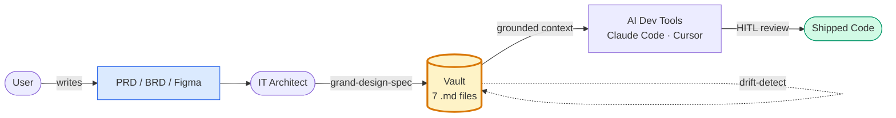

<div align="center">

# grand-design-spec (plugin)

### Four skills covering the full vault lifecycle, plus an update command.

*From initial PRD ingestion to live-codebase drift detection.*

</div>

---

## What is this?

> **Without it**: every dev session re-reads the PRD, re-derives architecture, AI bakes different assumptions into the code.
> **With it**: PRD → 7-file vault → AI dev tools cite it → grounded code, less halu.

The plugin lives at the boundary between **Inception** and **Construction** in your AI dev lifecycle (AI-DLC framing).



| | |
|---|---|
| **Who runs it** | IT Architect (generates vault) → Developer (consumes via AI tools) |
| **When** | After PRD signed off, before sprint-0 |
| **Output** | 7 markdown files + `vault.json` manifest: anti-halu, source-cited, gap-honest |
| **Mode** | Human-in-the-loop — stakeholders triage OQs; devs approve AI code citing vault |

## Skills + commands in this plugin

| Slash command | Skill | Purpose |
|---------------|-------|---------|
| `/grand-design-spec:flow` ⭐ | **`flow`** (v0.14) | Lifecycle orchestrator. Inspects CWD, proposes a chain of sub-skills (generate / resolve-oq / vault-diff / drift-detect), confirms with user once, then executes the chain in `--auto` mode. Stateless. Pauses on `blocker` artifacts. Anti-halu rails preserved by composition. |
| `/grand-design-spec:grand-design-spec` | **`grand-design-spec`** | Initial vault generation. PRD/BRD/Figma → 7-file dev handoff folder with anti-hallucination guarantees. Also writes a `vault.json` manifest for machine consumption. Supports `--auto` (v0.10+). |
| `/grand-design-spec:resolve-oq` | **`resolve-oq`** | Interactive Open Questions resolver. Walks the OQ roll-up by priority, captures stakeholder answers, updates the vault with version bump + Changelog. Preserves OQ tag identity as audit trail. Cross-cutting OQs land in a primary doc with cross-refs in others. Supports `--auto` for logistical prompts (v0.4+); per-OQ choices stay interactive. |
| `/grand-design-spec:vault-diff` | **`vault-diff`** | Vault evolution when the PRD/BRD source revisions. Computes structured diff, surfaces conflicts (Resolved-OQ vs new PRD, ADR vs new PRD) for explicit user resolution, applies approved changes without losing prior history. Supports `--auto` (v0.3+); conflicts emit `blocker` (type=`diff_conflict`) and pause. |
| `/grand-design-spec:drift-detect` | **`drift-detect`** | For `mode=existing` vaults: scans the live codebase, compares against vault, flags drift (entity rename, type changed, decision violated, code shipped without ADR). For `mode=new` vaults, surfaces the `mode_migrate_after` trigger so you know what to do before re-running. Supports `--auto` (v0.3+); skips interactive walkthrough, writes `DRIFT-REPORT.md` only. |
| `/grand-design-spec:update` | _(no skill — bash wrapper)_ | Plugin maintenance. `git pull --ff-only` inside `~/.claude/plugins/marketplaces/grand-design-spec/`, prints before/after version, then prompts you to run the built-in `/plugin marketplace update grand-design-spec` to rebuild the cache. |

## Lifecycle at a glance

```
                                  flow (v0.14)
                          ────────────────────────────
                          orchestrates the row below
                          based on CWD state, in --auto

   Initial PRD      Stakeholder mtg     PRD revisi      Live codebase
       │                  │                  │                 │
       ▼                  ▼                  ▼                 ▼
 grand-design-spec → resolve-oq    →   vault-diff   →    drift-detect
                                                         (existing only)
       │                  │                  │                 │
       ▼                  ▼                  ▼                 ▼
  vault v1.0        vault v1.1         vault v1.2       DRIFT-REPORT.md
                                                        DRIFT-ACTIONS.md
```

`flow` is the recommended entry point: it inspects state, proposes a chain across the row above, confirms once, runs sub-skills in `--auto` mode. Direct invocation of any sub-skill still works (and bypasses orchestration when you want full interactive control).

## What `grand-design-spec` produces

When triggered, the main skill takes a product/business document (and optionally a Figma URL) and produces 7 markdown files plus a JSON manifest inside a folder you choose:

```
<your-output-folder>/
├── 00-index.md          Navigation + Vault Lock Status + AI consumer notes + OQ roll-up
├── 01-overview.md       What, who, why, success metrics
├── 02-architecture.md   Components per layer, API contracts
├── 03-data-model.md     Entities (DBML), relations, constraints
├── 04-flows.md          User flows + system flows + per-flow Definition of Done
├── 05-decisions.md      ADR-lite: technical decisions with explicit source
├── 06-constraints.md    Technical, business, non-functional requirements
└── vault.json           Machine-readable manifest mirroring the markdown:
                         entities, flows, ADRs, OQs (with status + priority),
                         source documents, design-system flags. AI dev tools
                         load this for fast structural lookup; markdown stays
                         the human-authoritative source.
```

Every claim cites its source. Ambiguities become tagged Open Questions (`OQ-{DOC_CODE}-{N}`) with priority P1/P2/P3. Out of Scope is always explicit. No invented entities, fields, endpoints, or behaviors. The companion skills (`resolve-oq`, `vault-diff`, `drift-detect`) keep `vault.json` in sync as state evolves.

## Trigger phrases

Each skill activates by intent matching, not exact wording. Examples per skill:

**`grand-design-spec`**:
- "Help me break down this PRD for the dev team" / "pecah PRD ini buat dev"
- "Spec out this feature" / "buat dev handoff"
- "Prepare context for AI-assisted dev" / "siapkan context buat AI dev"
- "Translate this BRD into architecture docs"

**`resolve-oq`**:
- "Resolve open questions" / "jawab OQ list"
- "Walk through OQ list" / "tackle the P1 blockers"
- "Answer the OQs from the meeting"

**`vault-diff`**:
- "PRD updated" / "PRD versi baru"
- "Regenerate vault from new PRD"
- "Vault diff against new source"

**`drift-detect`**:
- "Drift detect" / "vault vs code"
- "Check codebase against vault" / "cek code vs vault"
- "Is the code in sync with the vault?"

Or paraphrases — each skill matches intent, not literal phrasing.

## Hard guarantees across all 4 skills

- **Grounded in source**: every claim cites PRD §, Figma frame, uploaded file, or live code reference. No invention.
- **No silent overwrites**: every conflict between vault state and new input surfaces to the user. Skills never auto-decide on contested content.
- **Tag stability**: OQ identifiers, flow IDs, ADR `D-XXX` numbers persist across rounds. New entries get next-available IDs; existing IDs preserved.
- **Removed-not-deleted**: when content drops from a new PRD, vault marks it with a banner (`> **Removed in v1.2**`) but retains it for audit history.
- **vault.json kept in sync**: every regeneration / `resolve-oq` / `vault-diff` round updates the JSON manifest so AI consumers and human reviewers see the same state.
- **Halt protocol for autonomous runs**: when an AI agent hits an unresolved P1 OQ in non-interactive mode, the vault emits a structured `OQ_BLOCKER` YAML artifact (tag, priority, blocking task, resolver owner) instead of silently failing — see `00-index.md` "Halt protocol for autonomous runs".
- **No code execution**: skills read vault and code, write reports and edit vault docs. They never open PRs, run migrations, or modify codebase files.
- **Anti-halu invariants preserved in compact mode**: even when output is token-trimmed, every source citation, every OQ tag, every Definition of Done remains intact.

## Project shapes supported

The main `grand-design-spec` skill is general-purpose. Pre-templated shapes:

- `mobile-app` — Mobile UI + Backend + Integrations
- `web-app` — Web Frontend + Backend + Integrations
- `api-only` — Backend service with no own UI
- `multi-platform` — Web + Mobile + Backend
- `data-pipeline` — ETL/batch processing, no user UI
- `custom` — Any other shape (CLI, SDK, browser extension, IoT, etc.)

The skill **infers** shape from PRD content during the extract phase, then **confirms** with the user before generating files. Shape choice drives sub-section structure in `02-architecture.md` and `04-flows.md`.

## Install

This plugin ships through the `grand-design-spec` marketplace (this same repository):

```text
/plugin marketplace add https://gitlab.com/airnd1/grand-design-spec.git
/plugin install grand-design-spec@grand-design-spec
```

All four lifecycle skills install together — they share state via the vault directory. The maintenance command (`/grand-design-spec:update`) installs alongside them.

See the [marketplace README on GitLab](https://gitlab.com/airnd1/grand-design-spec/-/blob/main/README.md) for version pinning, private repo auth, and Claude.ai / Claude API installation paths.

## License

MIT — see [LICENSE](./LICENSE).
