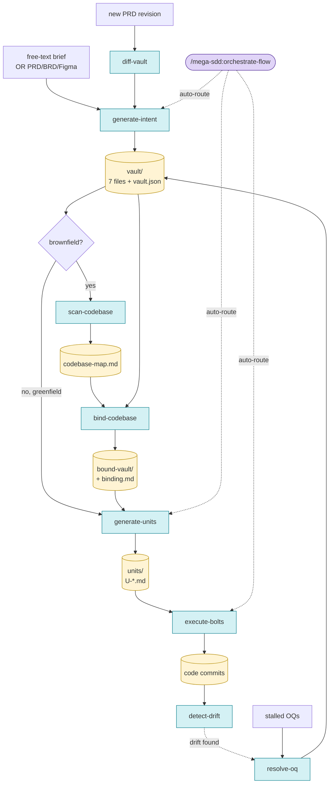

# Mega-SDD

> Spec-Driven Development for AI dev. Free-text idea → intent vault → atomic units → working code, with anti-hallucination guarantees end to end.

**Plugin:** `mega-sdd` · **Version:** 1.0.0 · **License:** MIT
**Predecessor:** [`grand-design-spec@0.15`](https://gitlab.com/airnd1/grand-design-spec) (deprecated — see Migration below)

## What this is

Mega-SDD applies AWS-flavored Spec-Driven Development with a 3-layer terminology:

- **Intent** — the WHAT/WHY (PRD/BRD → 7-file vault)
- **Unit** — atomic, AI-executable dev prompts (HOW per chunk)
- **Bolt** — the actual code produced from executing a unit (via [superpowers](https://github.com/obra/superpowers))

For brownfield projects, a **codebase binding gate** validates intent against existing code before unit generation — eliminating the architect/dev hallucination boundary.

## Pipeline



<details>
<summary>ASCII fallback (terminal-friendly)</summary>

```
ENTRY POINTS
  ┌────────────────────────────┐        ┌────────────────────────────┐
  │   free-text brief          │        │  /mega-sdd:orchestrate-    │
  │   OR PRD/BRD/Figma         │        │  flow (auto-route)         │
  └─────────────┬──────────────┘        └────────────┬───────────────┘
                ▼                                    │ inspects CWD,
   ┌─────────────────────────┐                       │ proposes chain
   │  generate-intent        │ ◀─────────────────────┘
   └────────────┬────────────┘
                ▼
   ┌─────────────────────────┐
   │   vault/ (7 files +     │ ─── greenfield ────┐
   │   vault.json)           │                    │
   └────────────┬────────────┘                    │
                │ brownfield                      │
                ▼                                 │
   ┌─────────────────────────┐                    │
   │  scan-codebase          │                    │
   └────────────┬────────────┘                    │
                ▼                                 │
   ┌─────────────────────────┐                    │
   │  bind-codebase          │ ⚠ BLOCKS if        │
   │  (validation gate)      │   conflicts        │
   └────────────┬────────────┘                    │
                ▼                                 │
   ┌─────────────────────────┐                    │
   │  bound-vault/ +         │                    │
   │  binding.md             │                    │
   └────────────┬────────────┘                    │
                │                                 │
                └─────────────┬───────────────────┘
                              ▼
                   ┌────────────────────────┐
                   │  generate-units        │
                   └────────────┬───────────┘
                                ▼
                   ┌────────────────────────┐
                   │  units/U-*.md          │
                   │  (atomic AI prompts)   │
                   └────────────┬───────────┘
                                ▼
                   ┌────────────────────────┐
                   │  execute-bolts         │  ←─ uses superpowers
                   │  (TDD + subagent)      │     (executing-plans,
                   └────────────┬───────────┘      sub-driven-dev, tdd,
                                ▼                  git-worktrees)
                   ┌────────────────────────┐
                   │  code commits          │
                   └────────────┬───────────┘
                                ▼
                   ┌────────────────────────┐
                   │  detect-drift          │ ↺ loop ke resolve-oq
                   └────────────────────────┘
```

</details>

## Commands

### Tier 1 — Core pipeline

| Command | Purpose |
|---|---|
| `/mega-sdd:generate-intent <prd-path \| --from-prompt "brief">` | PRD/brief → 7-file vault |
| `/mega-sdd:scan-codebase [path]` | Brownfield repo → codebase-map.md |
| `/mega-sdd:bind-codebase <vault>` | Vault + map → bound-vault (BLOCKS on conflicts) |
| `/mega-sdd:generate-units <bound-vault>` | Bound-vault → atomic units |
| `/mega-sdd:execute-bolts <unit-id \| --all>` | Unit → code commits (via superpowers) |

### Tier 2 — Lifecycle

| Command | Purpose |
|---|---|
| `/mega-sdd:orchestrate-flow` | Auto-route based on CWD state |
| `/mega-sdd:resolve-oq [--binding <path>]` | Interactive Open Question walker |
| `/mega-sdd:detect-drift` | Code vs vault reconciliation |
| `/mega-sdd:diff-vault <new-prd>` | Handle PRD revisions |

### Tier 3 — Utility

| Command | Purpose |
|---|---|
| `/mega-sdd:update-plugin` | Update plugin + check superpowers dep |

## Procedure cheat-sheet

| Scenario | Commands |
|---|---|
| New idea → working code (greenfield, fully autonomous) | `/mega-sdd:generate-intent --from-prompt "..." --chain` |
| Existing PRD → working code (brownfield) | `/mega-sdd:generate-intent ./prd.md` → `/mega-sdd:orchestrate-flow` |
| PRD revision arrived | `/mega-sdd:diff-vault ./new-prd.md` |
| Code drift detected | `/mega-sdd:detect-drift` → `/mega-sdd:resolve-oq` |
| Resume from interrupted phase | `/mega-sdd:orchestrate-flow --from=<phase>` |

## Installation

```bash
# 1. Add marketplace
/plugin marketplace add farhanriuzaki/mega-sdd

# 2. Install plugin
/plugin install mega-sdd

# 3. (Recommended) Install superpowers companion for full bolt execution
/plugin install superpowers
```

Mega-SDD ships with vendored superpowers skills under `_vendored/` as fallback. If you don't install superpowers explicitly, the pipeline still works — bolts route through the vendored copies.

## Anti-hallucination defense (4 layers)

1. **Intent layer** — uncertain claims → Open Questions, never guesses
2. **Binding gate** — vault claims validated against codebase-map; conflicts BLOCK pipeline
3. **Unit-level grounding** — each unit carries target_files whitelist + acceptance tests
4. **Drift detection** — code vs vault reconciliation runs at boundaries

## Architect/Dev separation

| Phase | Run by | Repo access |
|---|---|---|
| `generate-intent` | Architect | ❌ not required |
| `scan-codebase` | Dev / AI | ✅ read-only |
| `bind-codebase` | Dev / AI | ✅ read-only |
| `generate-units` | Dev / AI | ✅ read-only |
| `execute-bolts` | AI agent | ✅ write |

Architects can produce intent on a laptop with no repo access. The binding gate enforces grounding at hand-off without ever putting code in front of the architect.

## Migrating from grand-design-spec

`grand-design-spec@0.15` users:

| Old | New |
|---|---|
| `/grand-design-spec:flow` | `/mega-sdd:orchestrate-flow` |
| `/grand-design-spec:grand-design-spec` | `/mega-sdd:generate-intent` |
| `/grand-design-spec:from-prompt` | `/mega-sdd:generate-intent --from-prompt` |
| `/grand-design-spec:drift-detect` | `/mega-sdd:detect-drift` |
| `/grand-design-spec:vault-diff` | `/mega-sdd:diff-vault` |
| `/grand-design-spec:resolve-oq` | `/mega-sdd:resolve-oq` |
| `/grand-design-spec:update` | `/mega-sdd:update-plugin` |

Existing vaults remain fully compatible (vault.json schema unchanged). For brownfield projects, you can add binding by running:

```bash
/mega-sdd:scan-codebase
/mega-sdd:bind-codebase ./vaults/<your-vault>
```

`grand-design-spec` will remain in the marketplace as deprecated for 2 release cycles, then be removed.

## License

MIT — see LICENSE.

Vendored superpowers skills retain their original MIT license; see `skills/_vendored/ATTRIBUTION.md`.
