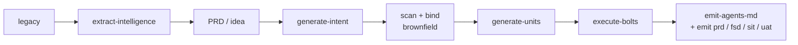
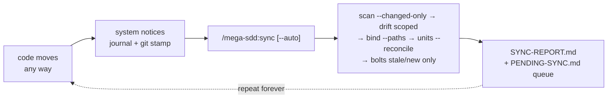

<p align="center"></p>

# mega-sdd

Spec-driven AI development pipeline for [Claude Code](https://claude.com/claude-code). PRD or idea → vault → atomic units → tested commits, with anti-hallucination at every handoff.

**Version:** see [`.claude-plugin/plugin.json`](./.claude-plugin/plugin.json) (single source of truth) · **License:** MIT

> **This page's job**: per-command reference + plugin internals (defense layers, memory, config, native tools). Install/update + orientation → root [`../../README.md`](../../README.md) · walkthroughs → [`../../tests/scenarios/`](../../tests/scenarios/) · version history → [`../../CHANGELOG.md`](../../CHANGELOG.md).

## Install / update

Canonical install, update, and uninstall instructions live in the **[root README — Quick start](../../README.md#quick-start-5-minutes)**. TL;DR (typed inside the Claude Code chat, not your shell): add the marketplace, `/plugin install mega-sdd`, optionally `/mega-sdd:install-deps` — then in any project:

```
/mega-sdd ./prd.md
```

Never used Claude Code itself? Start with [Scenario 0 — Zero to first run](../../tests/scenarios/scenario-0-zero-to-first-run.md).

## Commands you'll actually use

`/mega-sdd` is the headline — it runs the whole pipeline autonomously with one upfront confirmation (no arg = status view + proposed next chain). `/mega-sdd:sync` reconciles after out-of-pipeline changes; `/mega-sdd:emit <prd|fsd|sit|uat>` emits the four team documents. **6.0.0 removed the 5.x deprecation aliases** — everything below the kept table is reachable by natural-language phrase through the front door (a typed legacy form still arrives as plain text and routes to its skill).

> **How the bare verb works**: Claude Code registers plugin commands only as `/mega-sdd:<command>`, so `/mega-sdd` itself is a user-level wrapper (`~/.claude/commands/mega-sdd.md`) that the SessionStart hook auto-installs on your first session and keeps current across plugin updates (`scripts/install-front-door.sh`, version-marker idempotent — a hand-edited wrapper without the marker is never touched). Before that first session, use `/mega-sdd:mega-sdd`.

| Command | What it does |
|---|---|
| `/mega-sdd <input>` | **The one command** — routes a PRD / idea / legacy path through the full pipeline end-to-end |
| `/mega-sdd:sync` | **The other one** — after ANY out-of-pipeline change (manual edit, AI edit, hotfix, `git pull`): incremental re-scan → drift → re-bind → unit reconcile. `--auto` = one confirmation, zero mid-chain questions |
| `/mega-sdd:emit <prd\|fsd\|sit\|uat>` | The four team documents (PRD / Confluence FSD / SIT / UAT) emitted from vault/units/bolts state; no arg lists them with maturity |
| `/mega-sdd:install-deps` | OS-aware install of the optional native tools |
| `/mega-sdd:update-plugin` | Pull the latest plugin version (then `/plugin marketplace update mega-sdd` + `/reload-plugins` to activate) |
| `/mega-sdd:memory review` | Review what mega-sdd learned across runs (accept / reject) |
| **Migration table — the 5.x typed forms → how to do it in 6.0.0** | |
| ~~`/mega-sdd:generate-intent <prd>`~~ | `/mega-sdd ./prd.md` — or say "pecah PRD ini" |
| ~~`/mega-sdd:scan-codebase`~~ | on-demand: ask "scan codebase ini" (the express spine needs no map) |
| ~~`/mega-sdd:bind-codebase`~~ | in-chain by default; standalone: "bind vault ini ke code" |
| ~~`/mega-sdd:generate-units`~~ | in-chain by default; standalone: "generate units" |
| ~~`/mega-sdd:execute-bolts --all`~~ | in-chain by default; standalone: "eksekusi bolt" |
| ~~`/mega-sdd:resolve-oq`~~ | "walk open questions" / "resolve OQ" |
| ~~`/mega-sdd:detect-drift`~~ | "cek drift" |
| ~~`/mega-sdd:analyze`~~ | "cek konsistensi" |
| ~~`/mega-sdd:extract-intelligence <dir>`~~ | `/mega-sdd <legacy-dir>` — or "pecah legacy ini" |
| ~~`/mega-sdd:emit-fsd`~~ (and prd/sit) | `/mega-sdd:emit <fsd\|prd\|sit\|uat>` |
| ~~`/mega-sdd:lint-units`, `:list-modules`, `:replay`, `:graph`, …~~ | ask by phrase ("lint units", "status module", "replay U-001", "blast radius") |

Full surface: **4 public verbs + 4 maintenance one-timers** — exactly the 8 files in [`commands/`](./commands/) (`/mega-sdd:slice` added 6.8.0 — standalone UI slicing, command-only). The 24 5.x deprecation aliases were removed in 6.0.0 (per policy: demoted at 5.0.0, removed the following major after telemetry review). Typing an old form still works as plain text — it routes to the same skill; only the registered slash command is gone. Details: [`references/upgrade-from-old-version.md`](./references/upgrade-from-old-version.md).

## First time? Start with a scenario

The full chooser table (13 guided walkthroughs with copy-paste inputs + expected outputs) lives in **[`tests/scenarios/README.md`](../../tests/scenarios/README.md)**. Most common entry points: [Scenario 0 — Zero to first run](../../tests/scenarios/scenario-0-zero-to-first-run.md) (never used Claude Code) · [Scenario 1 — Greenfield from idea](../../tests/scenarios/scenario-1-greenfield-from-idea.md) · [Scenario 12 — Continuous sync](../../tests/scenarios/scenario-12-continuous-sync.md) (code changed after "done").

A canonical example PRD (the standard frontmatter + `§`-section format) lives at [`../../tests/scenarios/sample-prd-clinic.md`](../../tests/scenarios/sample-prd-clinic.md); the blank template is [`../../docs/templates/prd-template.md`](../../docs/templates/prd-template.md).

## The pipeline



`/mega-sdd` wraps all of it: single upfront confirmation, diagnostics (lint / analyze / drift) auto-invoked at the right phases, halt-protocol preserved throughout. Brownfield runs bind claim-scoped via `bind-codebase --express` (default spine — `scan-codebase` is on-demand / classic); the legacy-rebuild lane starts from `extract-intelligence`.

**And it loops.** Development never actually ends — so after the pipeline "finishes", every out-of-pipeline change (a manual hotfix, an AI-prompted edit in any session, a `git pull`) is captured ambiently (a PostToolUse journal + the map's git stamp), surfaced as a one-line session-start notice, and reconciled by `/mega-sdd:sync`:



Under `--auto`: one upfront confirmation, zero mid-chain questions — human-required decisions (drift direction calls, vault patches, CONFLICTs) are QUEUED, never auto-resolved. Walkthrough: [scenario 12](../../tests/scenarios/scenario-12-continuous-sync.md) · design: [`living-vault spec`](../../docs/superpowers/specs/2026-06-10-living-vault-continuous-sync-design.md).

## What's in this folder

```
plugins/mega-sdd/
├── .claude-plugin/plugin.json    # plugin manifest (version SSOT)
├── skills/                       # 20 skills — lean routers + progressive disclosure (each SKILL.md ≤500 lines)
│   ├── using-mega-sdd/           # anchor skill (auto-injected at session start)
│   ├── extract-intelligence/  generate-intent/  scan-codebase/  bind-codebase/
│   ├── generate-units/  execute-bolts/          # the core pipeline
│   ├── orchestrate-flow/  resolve-oq/  detect-drift/  diff-vault/  analyze/  graph/
│   ├── memory/  emit-agents-md/  emit-prd/  emit-fsd/  emit-sit/  emit-uat/  install-deps/
│   └── _vendored/                # superpowers fallback (optional technique skills)
├── agents/                       # 8 first-class subagents
│   ├── bolt-implementer.md       # execute-bolts implementer
│   ├── spec-reviewer.md, code-quality-reviewer.md, security-reviewer.md, standards-reviewer.md, design-reviewer.md
│   │                             #   ↳ the execute-bolts review panel (parallel blind lenses, risk-tiered; design joins for UI-bearing units)
│   ├── domain-extractor.md       # extract-intelligence wave worker
│   └── phase-advisor.md          # adversarial second-opinion at the bind/intent gates
├── commands/                     # exactly 8: 4 public verbs (mega-sdd · sync · emit · slice) + 4 maintenance one-timers (5.x aliases removed in 6.0.0)
├── references/                   # paths.md (canonical layout), framework-conventions/, tooling-install.md, …
├── hooks/                        # SessionStart anchor · Hybrid PreToolUse gate · PostToolUse validators · Stop
├── scripts/                      # /analyze engine (run-analyze.sh) + validators + sync scripts
├── CLAUDE.md                     # AI-agent contributor guide (contracts + invariants)
└── LICENSE
```

## How it prevents hallucination

Mega-sdd's reason for existing is that it **won't let an agent invent what isn't grounded**. Defense is layered across every handoff — uncertain claims become Open Questions, never guesses; the binding gate blocks on unresolved CONFLICTs; units carry a `target_files` whitelist + acceptance test + cited anchors; Hard Rules are AST-validated at bolt time. The full defense in depth:

1. **Intent** — uncertain claims promote to Open Questions
2. **OQ classification** — business vs tech; tech auto-resolves with cited evidence
3. **Binding gate** — unresolved CONFLICTs (and CONFLICT *resolution*) block downstream generation
4. **Implementation state** — IMPLEMENTED / NEW / PARTIAL_FIELDS_MISSING / UNKNOWN per claim
5. **Unit grounding** — `target_files` whitelist + acceptance_test + cited Anchors
6. **Hard Rules pre/post-flight** — ast-grep validates constraints at bolt time
7. **AST-precise extraction** — ast-grep (zero-compilation, one spawn; tree-sitter as an explicit opt-in lane — no regex guessing of structure)
8. **Reuse-first write loop** — a script-built full-repo symbol index feeds every bolt dispatch an "Existing symbols — REUSE, don't recreate" slice at write time, and a post-write duplication sweep (exact / camel-snake / same-suffix-root / verb-synonym matching) hands mechanical evidence rows to the code-quality review lens
9. **Memory** — suggestion-only, with a mandatory audit log
10. **Drift detection** — committed code reconciled against the vault
11. **Interface lock** — cross-squad consumed interfaces must be locked
12. **Mutability tiers** — `[LOCKED]/[INTENT]/[ARTIFACT]`, orthogonal to confidence
13. **Constitution layer** — project invariants enforced as Hard Rules at bolt time
14. **Framework convention packs** — stack conventions inject into Suggested Unit Hard Rules
15. **Predictive preflight** — upcoming halts surfaced *before* a skill runs
16. **Handoff schema validation** — handoff YAML type-checked at emission
17. **Code-delivery quality gates** — tech-agnostic validators (flow-coverage, sibling-consistency, cross-cutting registration, render-test, ui-quality) hard-block `execute-bolts`; signatures from the framework pack, SKIP off-stack
18. **Pipeline-intelligence gates** — fan-out parity, UI-deferral, the de-vacuoused conflict-classification gate, a typed `next_action.confidence`
19. **Semantic-depth fidelity** — a multi-step workflow's staged inputs must survive the KB→vault handoff, or `execute-bolts` is blocked
20. **Living-vault sync invariants** — incremental re-bind NEVER carries an active CONFLICT forward silently (always re-validated; moat-test-pinned); autonomous sync defers human decisions to a queue instead of deciding them; drift write-back requires git provenance + explicit ACCEPT, and `[LOCKED]` claims are never patched from code

> The doctrine: **a blocking gate is a deterministic validator wired to a hook — prose that says "HALT" enforces nothing.** Which gates hard-block vs. advise is defined in [`CLAUDE.md`](./CLAUDE.md); the analyze skill ("cek konsistensi") surfaces the advisory ones.

## Memory

Three scopes of markdown + JSON memory persist context across sessions (complementary to Claude Code's own memory):

- `~/.mega-sdd/memory/` — **USER** (opt-in, cross-project)
- `<project>/.mega-sdd/memory/` — **PROJECT** (per-repo, git-trackable per file)
- `<vault>/.memory/` — **VAULT** (per-vault, ephemeral)

Self-learning via threshold-based suggestions, reviewed through `/mega-sdd:memory review`. **Never auto-applied** — mandatory audit log + rollback path. Disable with `--memory-off`.

## Per-project config

Optional `.mega-sdd/config.yaml` at the project root — every key has a default (missing file = all defaults, never an error):

```yaml
telemetry: true          # false → PostToolUse hook fully off for this project
dirty_journal: true      # false → living-vault journaling off (git channel still covers sync)
staleness_notice: true   # false → suppress the session-start "codebase moved" line
layout: canonical        # legacy → pre-v3.4 output paths
```

Full key reference + scope table (user / project / vault): [`references/project-config.md`](./references/project-config.md). Safe to commit (no secrets by design) or gitignore for per-developer preferences.

## Optional native tools

Mega-sdd adopts stable native binaries instead of reinventing them — all optional, each with a graceful fallback. `/mega-sdd:install-deps` installs them for you (see [Install / update](#install--update)).

| Tool | Used by | Fallback |
|---|---|---|
| `tree-sitter` | scan-codebase OPT-IN lane (`--engine=tree-sitter`; auto uses ast-grep) | auto is unaffected — ast-grep serves tier `ast` |
| `ast-grep` | scan-codebase (the auto AST engine) / execute-bolts + generate-units (Hard Rules v2) / the reuse symbol index + duplication sweep | scan falls to regex tier; rules fall to the v1 5-type grammar |
| `ripgrep` (`rg`) | scan-codebase (structured JSON grep) | GNU grep |
| `jd` | diff-vault (canonical JSON/YAML patches) | manual Read+compare |
| `pandoc` | emit-fsd / emit-prd / emit-sit / emit-uat (PDF rendering) | Markdown-only output |
| `mmdc` | emit lanes — mermaid→SVG for the md2pdf PDF (Chrome-print, GitHub style) | mermaid stays code |
| Google Chrome | emit lanes — the PDF printer (detect-only, not installed) | GitHub-styled HTML fallback |
| `markdownlint-cli2` | lint-units (vault prose) | skill-internal heuristics |
| `semgrep` | execute-bolts L0 code gate 4 (SAST on bolt diffs) | gate SKIPs with a note |
| `gitleaks` | execute-bolts L0 code gate 3 (secret scan) | plugin regex fallback (always scanned) |

Full per-platform install matrix + **platform support table** (macOS/Linux/WSL = full; Git Bash = works with a `python3` shim; native cmd = prose-only, not recommended): [`references/tooling-install.md`](./references/tooling-install.md). Running the gates in CI / headless (`claude -p`, claude-code-action, pure-script exit-code gates): [`references/ci-recipe.md`](./references/ci-recipe.md).

## What's new

**v6.0.0** — *The surface cull (MAJOR):* the 24 5.x deprecation aliases are removed (policy-ladder complete: demoted 5.0.0 → telemetry review → removed); the surface is exactly 3 verbs + 4 one-timers, everything else by phrase; all operative alias content relocated into skill references; the on-demand doc pack now derives fully from the modern vault generation (flows/constraints/vault.json sources). Migration: `references/upgrade-from-old-version.md`.
**v5.34.0–v5.36.0** — *The Express Spine:* GROUND (script, seconds) → claim-scoped express bind (ledger + symbol index, zero map load) → batched blocking-OQ prompt + recorded auto-defers → deterministic risk-tiered review; the express spine is the DEFAULT (`--classic` restores scan-first).
**v5.31.x** — *ast-grep is the auto AST engine:* the scan ladder is `ast-grep → regex` (one spawn, zero compilation — the clang grammar-compile OOM class is structurally unreachable unattended); `--engine=tree-sitter` stays as a fully supported explicit opt-in lane. Install guidance follows (`recommended_minimum: ast-grep + ripgrep`).
**v5.30.0** — *Duplication sweep with teeth:* newly-added symbols matched against the FULL symbol index (exact / camel-snake / same-suffix-root / verb-synonym), capped evidence rows handed to the code-quality review lens — advisory by doctrine, never a hook.
**v5.29.0** — *PageRank targeting removed* (−832 lines): file-level, advisory-only, dead on real machines; replaced at the right layer by the write-time symbol slice. `--skip-pagerank` stays an accepted no-op through 5.x.
**v5.28.0** — *Reuse-first symbol index:* `build-symbol-index.sh` (script-built, byte-deterministic, zero model tokens) + every bolt dispatch carries "Existing symbols — REUSE, don't recreate" (target-file rows first, capped 40, provenance-stamped).
**v5.26.0** — *`--lean` profile:* opt-in configuration over existing levers — advisory legs + diagnostics skipped, every gate untouched (census-pinned); a lean run names itself in the digest and chain summary.
**v5.3.0** — *UAT doc-pack + doc versioning:* `emit uat` (4th doc, SEOJK berita acara, zero-dep xlsx) + human-only `--bump/--approve` versioning sidecar with Riwayat Revisi.
**v5.2.7** — *`mega-sdd-trace` observability tag:* the single-token AI-gateway/Langfuse log-filter contract. `mega-sdd-trace:session` (session-start, both injection blocks — rides every request body via history), `mega-sdd-trace:turn` (user-prompt-submit, fresh per iteration in mega-sdd projects; opt-out `trace_tag: false` in `.mega-sdd/config.yaml`), `mega-sdd-trace:<skill>` (every announce line + every subagent dispatch prompt — subagents run fresh-context). Filter gateway logs with `contains "mega-sdd-trace"`; prefix-match for per-phase breakdown.
**v5.2.6** — *Mandatory routing by default:* installing the plugin makes mega-sdd the default dev workflow in EVERY session — no-signal CWDs no longer exit silently; the SessionStart hook injects a slim routing rule (route dev tasks via `using-mega-sdd`, propose `/mega-sdd <input>` init before production code; casual Q&A exempt). Full anchor stays signal-gated (token diet). Opt-out: `~/.claude/.mega-sdd-routing-off` or `MEGA_SDD_ROUTING=off`.
**v5.2.5** — *The bare `/mega-sdd` verb actually registers:* Claude Code namespaces plugin commands (`/mega-sdd:<command>`), so the advertised bare front door never resolved. The SessionStart hook now auto-installs a thin user-level wrapper (`~/.claude/commands/mega-sdd.md` via `scripts/install-front-door.sh`, version-marker idempotent, user-authored files respected) that forwards verbatim to the plugin's front-door command.
**v5.2.3** — *Native GitHub/VS Code PDF render:* the emit lanes (`emit-fsd`/`emit-prd`/`emit-sit`) render PDFs via the shipped `scripts/md2pdf.sh` (pandoc HTML + `github.css` + Chrome print, mermaid → SVG) — **never pandoc+LaTeX**. Bordered tables, inline diagrams, one-page-fit. Moat-safe (transforms on a throwaway copy — the citation-stamped source `.md` is untouched); Chrome-absent → GitHub-styled HTML fallback (CI-safe). Dependency shift: `tectonic` retired, `mmdc` added, Chrome detect-only.
**v5.2.1** — *Hook recovery + fork headless caveat:* an interrupted run's hook-driven recovery now routes to `/mega-sdd --resume` (the front door); the `context: fork` headless caveat is documented — under `claude -p` a forked skill silently runs inline (no token win, telemetry dark), while PreToolUse gates + SessionStart still fire, so scripted/CI usage stays gate-safe.
**v5.2.0** — *Dependency authorization:* execute-bolts code gate 6 — a bolt that adds a dependency the unit's `allowed_new_deps` did not sanction is flagged `dep_unauthorized` (advisory-first, deterministic).
**v5.0.0** — *Surface collapse:* the public surface became three verbs (`/mega-sdd` · `/mega-sdd:sync` · `/mega-sdd:emit`); the 24 former stage commands became deprecation aliases that keep resolving through the whole 5.x cycle.

Everything older → [`../../CHANGELOG.md`](../../CHANGELOG.md) (the single source of release history).

## Contributing

If you're an AI agent submitting a PR, read [`CLAUDE.md`](./CLAUDE.md) first — the anti-slop protocol applies and every behavior change must trace to a spec in [`../../docs/superpowers/specs/`](../../docs/superpowers/specs/). Human contributors: [`../../CONTRIBUTING.md`](../../CONTRIBUTING.md).

## License

MIT. Vendored superpowers skills retain their original MIT license — see [`skills/_vendored/ATTRIBUTION.md`](./skills/_vendored/ATTRIBUTION.md). Tree-sitter `.scm` query patterns adapted from [Aider](https://github.com/Aider-AI/aider) (Apache 2.0) — see `skills/scan-codebase/queries/`.
