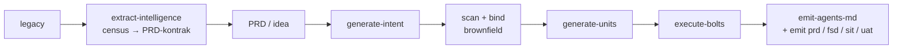
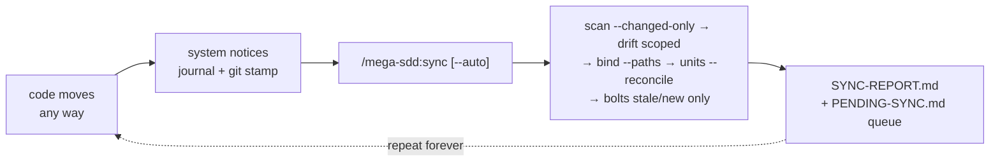

<p align="center"></p>

# mega-sdd

Spec-driven AI development pipeline for [Claude Code](https://claude.com/claude-code). PRD or idea → vault → atomic units → tested commits, with anti-hallucination at every handoff.

**Version:** see [`.claude-plugin/plugin.json`](./.claude-plugin/plugin.json) (single source of truth) · **License:** MIT

> **This page's job**: per-command reference + plugin internals (defense layers, config, native tools). Install/update + orientation → root [`../../README.md`](../../README.md) · walkthroughs → [`../../tests/scenarios/`](../../tests/scenarios/) · version history → [`../../CHANGELOG.md`](../../CHANGELOG.md).

## Install / update

Canonical install, update, and uninstall instructions live in the **[root README — Quick start](../../README.md#quick-start-5-minutes)**. TL;DR (typed inside the Claude Code chat, not your shell): add the marketplace, `/plugin install mega-sdd`, optionally `/mega-sdd:install-deps` — then in any project:

```
/mega-sdd ./prd.md
```

> **Bundled MCPs:** installing mega-sdd auto-registers TWO MCP servers — **Playwright** (`@playwright/mcp`, pinned, headless + isolated; Node ≥18) for browser render checks, and **Context7** (`@upstash/context7-mcp`, pinned, keyless free tier; Node ≥20.18.1) for current library docs during implementation. First browser use offers `npx playwright install chromium` (~130MB — via `/mega-sdd:install-deps`, never auto-run). Disable either per-server via `/mcp` without uninstalling the plugin (also the fix if you already run a standalone context7 plugin and don't want two processes — they're namespaced, no conflict). Neither server is ever load-bearing: every consumer degrades gracefully without it.

Never used Claude Code itself? Start with [Scenario 0 — Zero to first run](../../tests/scenarios/scenario-0-zero-to-first-run.md).

> **Optional companion plugin — `mega-sdd-extras`** (same marketplace, separate `/plugin install mega-sdd-extras`): `/mega-sdd-extras:slice` turns ONE Figma page/frame into framework-conventional UI code through your own Figma MCP, render-checked with the bundled Playwright. Zero hooks/scripts, zero cost when not installed; it reuses this plugin's design corpus and packs. Docs: [`plugins/mega-sdd-extras/README.md`](../mega-sdd-extras/README.md).

## Commands you'll actually use


> **How the bare verb works**: Claude Code registers plugin commands only as `/mega-sdd:<command>`, so `/mega-sdd` itself is a user-level wrapper (`~/.claude/commands/mega-sdd.md`) that the SessionStart hook auto-installs on your first session and keeps current across plugin updates (`scripts/install-front-door.sh`, version-marker idempotent — a hand-edited wrapper without the marker is never touched). Before that first session, use `/mega-sdd:mega-sdd`.

`/mega-sdd` is the headline — it runs the whole pipeline autonomously with one upfront confirmation (no arg = status view + proposed next chain). `/mega-sdd:sync` reconciles after out-of-pipeline changes; `/mega-sdd:emit <prd|fsd|sit|uat|html|summary>` emits the four team documents plus the two presentation lanes (offline interactive HTML render; grounded executive summary). Everything else is reachable by natural-language phrase through the front door; a typed legacy (pre-v7) form still arrives as plain text and routes to its skill — the full old→new map: [`docs/mega-sdd/upgrade-from-old-version.md`](../../docs/mega-sdd/upgrade-from-old-version.md).

| Command | What it does |
|---|---|
| `/mega-sdd <input>` | **The one command** — routes a PRD / idea / legacy path through the full pipeline end-to-end. Task weight is auto-judged S/M/L (default S = answer inline, zero pipeline); override with `--weight=S\|M\|L`; `--classic` restores the scan-first spine |
| `/mega-sdd:sync` | **The other one** — after ANY out-of-pipeline change (manual edit, AI edit, hotfix, `git pull`): incremental re-scan → drift → re-bind → unit reconcile. `--auto` = one confirmation, zero mid-chain questions |
| `/mega-sdd:emit <prd\|fsd\|sit\|uat\|html\|summary>` | The four team documents (PRD / Confluence FSD / SIT / UAT) emitted from vault/units/bolts state; no arg lists them with maturity. The uat lane also generates Playwright e2e skeletons + OFFERS an automated evidence run (§5 annex — human execution surfaces untouched). `html <file\|dir>` renders any md/KB bundle to self-contained offline interactive HTML (deterministic script, zero model tokens); `summary` writes a grounded executive summary with cited numbers |
| `/mega-sdd:migrate-paths` | One-time move of pre-v3.4 scattered outputs into the canonical `.mega-sdd/` layout; `--vault-layout` migrates a legacy 7-file vault to the 4-file layout-2 (dry-run default; `--apply` executes, then a full re-bind is mandatory) |
| `/mega-sdd:install-deps` | OS-aware install of the optional native tools |
| `/mega-sdd:update-plugin` | Pull the latest plugin version (then `/plugin marketplace update mega-sdd` + `/reload-plugins` to activate) |

Full surface: **3 public verbs + 3 maintenance one-timers** — exactly the 6 files in [`commands/`](./commands/). Typing an old (pre-v7) form still works as plain text — it routes to the same skill; only the registered slash command is gone. Upgrading from an older version: [`docs/mega-sdd/upgrade-from-old-version.md`](../../docs/mega-sdd/upgrade-from-old-version.md).


## First time? Start with a scenario

The full chooser table (12 guided walkthroughs with copy-paste inputs + expected outputs) lives in **[`tests/scenarios/README.md`](../../tests/scenarios/README.md)**. Most common entry points: [Scenario 0 — Zero to first run](../../tests/scenarios/scenario-0-zero-to-first-run.md) (never used Claude Code) · [Scenario 1 — Greenfield from idea](../../tests/scenarios/scenario-1-greenfield-from-idea.md) · [Scenario 12 — Continuous sync](../../tests/scenarios/scenario-12-continuous-sync.md) (code changed after "done").

A canonical example PRD (the standard frontmatter + `§`-section format) lives at [`../../tests/scenarios/sample-prd-clinic.md`](../../tests/scenarios/sample-prd-clinic.md); the blank template is [`../../docs/templates/prd-template.md`](../../docs/templates/prd-template.md).

## The pipeline



`/mega-sdd` wraps all of it: single upfront confirmation, diagnostics (lint / analyze / drift) auto-invoked at the right phases, halt-protocol preserved throughout. Brownfield runs bind claim-scoped via `bind-codebase --express` (default spine — `scan-codebase` is on-demand / classic); the legacy-rebuild lane starts from `extract-intelligence`.

**And it loops.** Development never actually ends — so after the pipeline "finishes", every out-of-pipeline change (a manual hotfix, an AI-prompted edit in any session, a `git pull`) is captured ambiently (a PostToolUse journal + the map's git stamp), surfaced as a one-line session-start notice, and reconciled by `/mega-sdd:sync`:



Under `--auto`: one upfront confirmation, zero mid-chain questions — human-required decisions (drift direction calls, vault patches, CONFLICTs) are QUEUED, never auto-resolved. Walkthrough: [scenario 12](../../tests/scenarios/scenario-12-continuous-sync.md) · design: [`living-vault spec`](../../docs/superpowers/specs/2026-06-10-living-vault-continuous-sync-design.md).

## What's in this folder

```
plugins/mega-sdd/
├── .claude-plugin/plugin.json    # plugin manifest (version SSOT)
├── .mcp.json                     # bundled MCP pins (playwright + context7, exact versions)
├── skills/                       # 19 skills — lean routers + progressive disclosure (each SKILL.md ≤500 lines)
│   ├── using-mega-sdd/           # anchor skill (auto-injected at session start)
│   ├── extract-intelligence/  generate-intent/  scan-codebase/  bind-codebase/
│   ├── generate-units/  execute-bolts/          # the core pipeline
│   ├── orchestrate-flow/  resolve-oq/  detect-drift/  diff-vault/  analyze/  graph/
│   ├── emit-agents-md/  emit-prd/  emit-fsd/  emit-sit/  emit-uat/  install-deps/
├── agents/                       # 9 first-class subagents
│   ├── bolt-implementer.md       # execute-bolts implementer
│   ├── spec-reviewer.md, code-quality-reviewer.md, security-reviewer.md, standards-reviewer.md, design-reviewer.md
│   │                             #   ↳ the execute-bolts review panel (parallel blind lenses, risk-tiered; design joins for UI-bearing units)
│   ├── resolution-verifier.md    # execute-bolts fix-round reviewer (verifies open findings at the new head instead of a full re-panel)
│   ├── domain-extractor.md       # extract-intelligence per-module PRD-kontrak extractor
│   ├── claim-verifier.md         # extract-intelligence adversarial per-module verify lane (grades citations EXACT/IMPRECISE/WRONG; 100% of [LOCKED] + money-class rules)
├── commands/                     # exactly 6: 3 public verbs (mega-sdd · sync · emit) + 3 maintenance one-timers (migrate-paths · install-deps · update-plugin)
├── references/                   # paths.md (canonical layout), framework-conventions/, tooling-install.md, …
├── hooks/                        # 6 events, dispatched direct (no run-hook shim): SessionStart anchor · PreToolUse gate · PostToolUse journal · Stop · UserPromptExpansion · UserPromptSubmit (gateway tag + sync offer)
├── scripts/                      # /analyze engine (run-analyze.sh) + validators + sync scripts
├── tests/                        # moat / drift / handoff / state suites (more under repo-root tests/)
├── CLAUDE.md                     # AI-agent contributor guide (contracts + invariants)
└── LICENSE
```

## Gateway contract

The `mega-sdd-trace:*` tag family is the plugin's ONLY observability artifact — the office AI gateway filters mega-sdd sessions on it; all token/cost/session accounting lives gateway-side. Spec: [`../../docs/gateway-contract.md`](../../docs/gateway-contract.md).

## How it prevents hallucination

Mega-sdd's reason for existing is that it **won't let an agent invent what isn't grounded**. Defense is layered across every handoff — uncertain claims become Open Questions, never guesses; the binding gate blocks on unresolved CONFLICTs; units carry a `target_files` whitelist + acceptance test + cited anchors; Hard Rules are AST-validated at bolt time. The full defense in depth:

1. **Intent** — uncertain claims promote to Open Questions
2. **OQ classification** — business vs tech; tech auto-resolves with cited evidence
3. **Binding gate** — unresolved CONFLICTs (and CONFLICT *resolution*) block downstream generation
4. **Implementation state** — IMPLEMENTED / NEW / PARTIAL_FIELDS_MISSING / UNKNOWN per claim
5. **Unit grounding** — `target_files` whitelist + acceptance_test + cited Anchors
6. **Hard Rules pre/post-flight** — ast-grep validates constraints at bolt time
7. **AST-precise extraction** — ast-grep (zero-compilation, one spawn — no regex guessing of structure; the tree-sitter opt-in lane was removed in v7.4.0)
8. **Reuse-first write loop** — a script-built full-repo symbol index feeds every bolt dispatch an "Existing symbols — REUSE, don't recreate" slice at write time, and a post-write duplication sweep (exact / camel-snake / same-suffix-root / verb-synonym matching) hands mechanical evidence rows to the code-quality review lens
9. **Drift detection** — committed code reconciled against the vault
10. **Interface lock** — cross-squad consumed interfaces must be locked
11. **Mutability tiers** — `[LOCKED]/[INTENT]/[ARTIFACT]`, orthogonal to confidence
12. **Constitution layer** — project invariants enforced as Hard Rules at bolt time
13. **Framework convention packs** — stack conventions inject into Suggested Unit Hard Rules
14. **Predictive preflight** — upcoming halts surfaced *before* a skill runs
15. **Handoff schema validation** — handoff YAML type-checked at emission
16. **Code-delivery quality gates** — tech-agnostic validators (flow-coverage, sibling-consistency incl. render-test + cross-cutting registration, unit-spec incl. verify-grounding, ui-quality) hard-block `execute-bolts`, all re-derived at the gate itself; signatures from the framework pack, SKIP off-stack
17. **Bolt evidence gates** — seven artifact gates at the `execute-bolts` hook: bolt-orphans, batch-suite (B2), postflight-evidence (B1 — recomputed at the gate from git/fs ground truth), the whitelist observer (B3), acceptance-evidence (B4, commit-keyed), panel-evidence (a dispatched bolt must carry script-written `findings.json` + `l0-results.json`), and the in-run acceptance-expects gate — plus the Factory Line ledger gate in both directions; a `bolt-implementer` **Agent** dispatch is gated the same as the Skill route (hand-dispatch cannot slip past)
18. **Pipeline-intelligence gates** — fan-out parity, UI-deferral, a typed `next_action.confidence`
19. **Semantic-depth fidelity** — a multi-step workflow's staged inputs must survive the KB→vault handoff, or `execute-bolts` is blocked
20. **Living-vault sync invariants** — incremental re-bind NEVER carries an active CONFLICT forward silently (always re-validated; moat-test-pinned); autonomous sync defers human decisions to a queue instead of deciding them; drift write-back requires git provenance + explicit ACCEPT, and `[LOCKED]` claims are never patched from code
21. **Extraction claim-verify lane** — after each module's quality gate, a blind `claim-verifier` subagent adversarially re-checks the PRD-kontrak against the legacy source (sampled citations graded EXACT/IMPRECISE/WRONG; 100% of `[LOCKED]` + money-class rules), with coverage recomputed at the census gate — the writer never checks itself

> The doctrine: **a blocking gate is a deterministic validator wired to a hook — prose that says "HALT" enforces nothing.** Which gates hard-block vs. advise is defined in [`CLAUDE.md`](./CLAUDE.md); the analyze skill ("cek konsistensi") surfaces the advisory ones.

## Apa yang otomatis, apa yang tidak (v7.5.0)

Tanpa mengetik `/mega-sdd` sekalipun: **(a)** kalimat berniat M/L ("tambah field NIK di form", "kode berubah, sync") di-route otomatis oleh anchor + front door; **(b)** guard anti-forge selalu aktif di tier apa pun; **(c)** begitu satu skill mega-sdd jalan, seluruh gate chain arm sendiri; **(d)** edit inline file yang ter-anchor ke claim `[LOCKED]` memunculkan SATU baris notice (0 fork) — kontrak berubah → tawarkan `/mega-sdd:sync`, bug fix internal → lanjut; **(e)** kalimat "selesai" (`udah`/`commit`/`push`/`PR`/`merge`, census di test) saat ada perubahan ter-journal memunculkan satu baris TAWARAN sync — bukan auto-run. Yang **sengaja tidak** otomatis: pipeline tidak pernah auto-invoke dari keberadaan `.mega-sdd/` atau dari sembarang prompt (pelajaran bug-hunt 20 menit, klausa :13(c) dihapus permanen); acceptance auto-offer per-edit hanya hidup kalau `auto_verify_on_edit: true` di config (default false).

## Per-project config

Optional `.mega-sdd/config.yaml` at the project root — every key has a default (missing file = all defaults, never an error):

```yaml
dirty_journal: true       # false → living-vault journaling off (git channel still covers sync)
staleness_notice: true    # false → suppress the session-start "codebase moved" line
layout: new               # legacy → pre-migration scattered output paths
auto_verify_on_edit: false # true → inline edit of a unit's target_file offers its acceptance run
spine: express            # classic → restore the scan-first chain + Stop-hook analyze aggregate
# unit_granularity:       # ABSENT is the default (medium); fine|coarse resize generated units (--max-complexity flag wins)
parallel_max: 4           # execute-bolts wave width
model_tiers:
  bolt_implementer: inherit # auto → per-unit routing via resolve-review-tier (haiku/sonnet/opus + cascade)
```

Full key reference + scope table (user / project / vault): [`references/project-config.md`](./references/project-config.md). Safe to commit (no secrets by design) or gitignore for per-developer preferences.

## Optional native tools

Mega-sdd adopts stable native binaries instead of reinventing them — all optional, each with a graceful fallback. `/mega-sdd:install-deps` installs them for you (see [Install / update](#install--update)).

| Tool | Used by | Fallback |
|---|---|---|
| `ast-grep` | scan-codebase (the auto AST engine) / execute-bolts + generate-units (Hard Rules v2) / the reuse symbol index + duplication sweep | scan falls to regex tier; rules fall to the v1 5-type grammar |
| `ripgrep` (`rg`) | scan-codebase (structured JSON grep) | GNU grep |
| `jd` | diff-vault (canonical JSON/YAML patches) | manual Read+compare |
| `pandoc` | emit-fsd / emit-prd / emit-sit / emit-uat (PDF rendering) | Markdown-only output |
| `mmdc` | emit lanes — mermaid→SVG for the md2pdf PDF (Chrome-print, GitHub style) | mermaid stays code |
| Google Chrome | emit lanes — the PDF printer (detect-only, not installed) | GitHub-styled HTML fallback |
| `markdownlint-cli2` | the vault-prose lint leg of the chain diagnostics ("lint units" by phrase) | skill-internal heuristics |
| `semgrep` | execute-bolts L0 code gate 4 (SAST on bolt diffs) | gate SKIPs with a note |
| `gitleaks` | execute-bolts L0 code gate 3 (secret scan) | plugin regex fallback (always scanned) |

Full per-platform install matrix + **platform support table** (macOS/Linux/WSL = full; Git Bash = works with a `python3` shim; native cmd = prose-only, not recommended): [`references/tooling-install.md`](./references/tooling-install.md). Running the gates in CI / headless (`claude -p`, claude-code-action, pure-script exit-code gates): [`references/ci-recipe.md`](./references/ci-recipe.md).

## What's new

**v7.29.1** — *Leftover sweep:* 22 research decision records cited by shipped docs finally landed in git; the predictive `vault_present_for_oq` check is layout-aware (it demanded a `03-open-questions.md` no layout ever produced); rule 4b's defer target follows the `defer_to` contract (`binding` only in brownfield, `stakeholder` in greenfield); five emitted halt types (`bind_inputs_missing`, `unit_oq_trace_missing`, `cross_module_dep_invalid`, `module_cycle_detected`, `ambiguous_spec`) joined the canonical registry; ~60 stale doc/comment sites (PostToolUse fan-out, vendored fallback, memory lane, 7-file vault wording) corrected. No gate behavior changed.
**v7.29.0** — *Project scale (`project_scale: xs`):* `derive-project-scale.sh` reads the PRD's structure (≤3 screens AND ≤2 entities AND ≤3 flows → `xs`; no structural evidence → `standard`), stamps the scalar into the layout-2 frontmatter + `vault.json`, and at `xs` exactly two things change — the vault Glossary is omitted and medium-confidence tech OQs are born deferred (never asked interactively; the evidence standard is unchanged). Calibrated against the repo PRD corpus (the clinic PRD is pinned `standard` at 7/4/6).
**v7.28.0** — *Size-weighted dispatch (`unit_tier: xs`):* the review-tier router now labels each unit `xs|s|m|l` (deterministic size proxy — never a routing input), and `build-dispatch-prompt.sh --unit-tier=xs` cuts the dispatch payload for small units: measured **−65% bytes** on the 22-line-unit replay (prompt:code ratio 12.4:1 → 5.7:1; the spec's ≤5:1 target missed by 0.7 and published as such). Unit body stays verbatim, every gate/validator untouched — muatan turun, bukti tidak. Also fixes a resolver frontmatter overcapture that false-fired `file_count` on scalar-list `target_files`.
**v7.24.0 – v7.27.0** — *KB accuracy pack (from a real field audit that found 8 WRONG citations, 0 fabricated):* KB validators migrated to the module grammar + SKIP-honesty (`kb_discovery` MISCONFIGURED backstop), the adversarial **claim-verify lane** (blind `claim-verifier` per module), counts script-derived + rollup recount + site-census, `rebuild_after` dependency DAG, acceptance-criteria golden-master for `[LOCKED]` rules, §7 Run & Recovery, and a negative-claim rail. Live acceptance: 3/3 seeded WRONGs reproduced, 0 false positives.
**v7.20.0 – v7.23.x** — *Team-feedback round:* unit coarsening (`--max-complexity=large` / `unit_granularity: coarse`), resolve-oq reaches the extraction KB (§6 walk) with human-first OQ language (Konteks + keterangan per option), OQ context slots 2→6, render-html template v2 (developer-platform layout, per-diagram isolated render), and the natural-register writing contract for all emitted docs.
**v7.7.0 – v7.11.0** — *Execute-bolts efficiency + audit-driven hardening:* sprint waves default on `--all` (measured 3.0× vs sequential), per-lens review routing (measured full-panel 30/30 → 17/13/1), the per-bolt gate now also fires on a hand `Agent` dispatch of `bolt-implementer`, DO_NOT_MODIFY judged by the bolt's own touched-set (21/21 false positives → 0), directive-typed rules demoted to advisory (256/278 field rules could never fail), and the panel-evidence gate; v7.12.0 adds project-local framework packs (`.mega-sdd/packs/<framework>.md` beats a same-named plugin pack).
**v7.6.0** — *Census-contracted extraction:* each legacy module gets ONE PRD-kontrak (`modules/<domain>.prd.md`, flows in Mermaid) under a completeness gate (unclaimed / phantom / uncited → FAIL); a single-module legacy runs on the main thread with zero subagents. Pre-existing numbered-tree KBs stay readable.
**v7.0.0 – v7.5.x** — *The v7 diet (MAJOR):* weighted **S/M/L** routing (default S = answer inline, zero pipeline, hooks quiet; override `--weight=`), per-unit model routing + cascade (`model_tiers.bolt_implementer: auto`), observability removed to the AI gateway (`mega-sdd-trace:*` is the only artifact), the Fase-5 cull (slice lane, phase-advisor, vendored superpowers, tree-sitter engine), and the hook spawn diet (direct dispatch, 0-fork hot paths — tier-S Edit = 0 hook forks).

Everything older → [`../../CHANGELOG.md`](../../CHANGELOG.md) (the single source of release history).

## Contributing

If you're an AI agent submitting a PR, read [`CLAUDE.md`](./CLAUDE.md) first — the anti-slop protocol applies and every behavior change must trace to a spec in [`../../docs/superpowers/specs/`](../../docs/superpowers/specs/). Human contributors: [`../../CONTRIBUTING.md`](../../CONTRIBUTING.md).

## License

MIT. (The vendored superpowers skills and the Aider-derived tree-sitter `.scm` query pack were both removed in v7.4.0; design inspiration remains credited in `CLAUDE.md §Co-author attribution`.)
