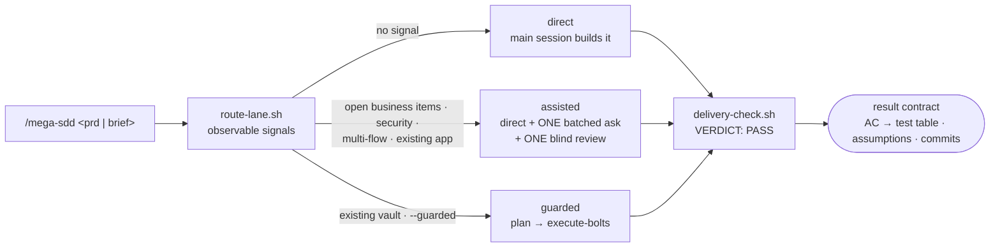
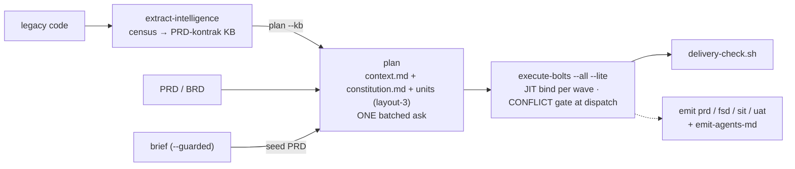
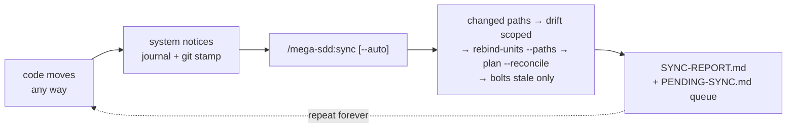

<p align="center"></p>

# mega-sdd

Build from a PRD or a brief in [Claude Code](https://claude.com/claude-code). A front door routes each task to the lightest lane that fits (direct / assisted / guarded), and every lane ends with the same checked result: an acceptance-criterion → test table, `delivery-check.sh` `VERDICT: PASS` on the final commit, and the assumptions made. The guarded lane adds a cited spec, per-unit binding and audit evidence for teams that need traceability.

**Version:** see [`.claude-plugin/plugin.json`](./.claude-plugin/plugin.json) (single source of truth) · **License:** MIT

> **This page's job**: per-command reference + plugin internals (lanes, the guarded pipeline, defense layers, config, native tools). Install/update + orientation → root [`../../README.md`](../../README.md) · walkthroughs → [`../../tests/scenarios/`](../../tests/scenarios/) · version history → [`../../CHANGELOG.md`](../../CHANGELOG.md).

## Install / update

Canonical install, update, and uninstall instructions live in the **[root README — Quick start](../../README.md#quick-start-5-minutes)**. TL;DR (typed inside the Claude Code chat, not your shell): add the marketplace, `/plugin install mega-sdd`, optionally `/mega-sdd:install-deps`, then `/reload-plugins` — then in any project:

```
/mega-sdd ./prd.md
```

> **Bundled MCPs:** installing mega-sdd auto-registers TWO MCP servers — **Playwright** (`@playwright/mcp`, pinned, headless + isolated; Node ≥18) for browser render checks, and **Context7** (`@upstash/context7-mcp`, pinned, keyless free tier; Node ≥20.18.1) for current library docs during implementation. First browser use offers `npx playwright install chromium` (~130MB — via `/mega-sdd:install-deps`, never auto-run). Disable either per-server via `/mcp` without uninstalling the plugin (also the fix if you already run a standalone context7 plugin and don't want two processes — they're namespaced, no conflict). Neither server is ever load-bearing: every consumer degrades gracefully without it.

Never used Claude Code itself? Start with [Scenario 0 — Zero to first run](../../tests/scenarios/scenario-0-zero-to-first-run.md).

> **Optional companion plugin — `mega-sdd-extras`** (same marketplace, separate `/plugin install mega-sdd-extras`): `/mega-sdd-extras:slice` turns ONE Figma page/frame into framework-conventional UI code through your own Figma MCP, render-checked with the bundled Playwright. Zero hooks/scripts, zero cost when not installed; it reuses this plugin's design corpus and packs. Docs: [`plugins/mega-sdd-extras/README.md`](../mega-sdd-extras/README.md).

## Commands you'll actually use


> **How the bare verb works**: Claude Code registers plugin commands only as `/mega-sdd:<command>`, so `/mega-sdd` itself is a user-level wrapper (`~/.claude/commands/mega-sdd.md`) that the SessionStart hook auto-installs on your first session and keeps current across plugin updates (`scripts/install-front-door.sh`, version-marker idempotent — a hand-edited wrapper without the marker is never touched). Before that first session, use `/mega-sdd:mega-sdd`.

`/mega-sdd` is the headline. With a PRD or a brief it routes first, then builds. With no argument it shows the status of the project's vaults and proposes the next chain. `/mega-sdd:sync` reconciles a guarded project after out-of-pipeline changes. `/mega-sdd:emit <prd|fsd|sit|uat|html|summary>` emits the four team documents plus the two presentation lanes (offline interactive HTML render; grounded executive summary).

Everything else is reachable by natural-language phrase through the front door. A typed legacy (pre-v7) form still arrives as plain text and routes to its skill; the full old→new map is in [`docs/mega-sdd/upgrade-from-old-version.md`](../../docs/mega-sdd/upgrade-from-old-version.md).

| Command | What it does |
|---|---|
| `/mega-sdd <input>` | **The one command.** For a PRD or a brief it runs `scripts/route-lane.sh` first and builds in the lane it picks: **direct**, **assisted** or **guarded** (see [Lanes](#lanes)). A directory input takes another path: a legacy codebase goes to extract-intelligence, a KB to `plan --kb`, a vault to its next chain.<br>• Force a lane with `--direct` / `--assisted` / `--guarded`. `--lite` and the pipeline-only flags imply guarded.<br>• `--weight=S\|M\|L` overrides the session anchor's task weight.<br>• `--classic` and `lane: standard` are retired: the front door ignores them with a one-line note. |
| `/mega-sdd:sync` | **The other one.** Use it after ANY out-of-pipeline change on a guarded project (manual edit, AI edit, hotfix, `git pull`). The chain: changed-set derivation (a zero-token script) → drift triage → per-unit re-bind (`scripts/rebind-units.sh`) → `plan --reconcile` → `execute-bolts` on stale units only.<br>• `--auto`: one confirmation, zero mid-chain questions.<br>• `--full-bind`: re-binds every unit (the "apakah kode masih sinkron dengan spec?" audit). |
| `/mega-sdd:emit <prd\|fsd\|sit\|uat\|html\|summary>` | The four team documents (PRD / Confluence FSD / SIT / UAT), emitted from vault/units/bolts state; no argument lists them with their maturity.<br>• The `uat` lane also generates Playwright e2e skeletons and OFFERS an automated evidence run (§5 annex — human execution surfaces untouched).<br>• `html <file\|dir>` renders any md/KB bundle to self-contained offline interactive HTML (deterministic script, zero model tokens).<br>• `summary` writes a grounded executive summary with cited numbers. |
| `/mega-sdd:migrate-paths` | One-time move of pre-v3.4 scattered outputs into the canonical `.mega-sdd/` layout. Its vault-layout rungs:<br>• `--vault-layout=3 --vault=<dir>` moves a pre-9.0 (layout-2) vault to layout-3 `context.md`. This is how you build or sync on a pre-9.0 vault. Dry-run by default; `--apply` executes and archives the four docs + `binding.md` under `_meta/archive/layout2/`. A full JIT re-bind is then MANDATORY: `scripts/rebind-units.sh --cwd=<root> --vault=<vault> --units=all`.<br>• `--vault-layout` migrates a legacy 7-file vault to layout-2 first. |
| `/mega-sdd:install-deps` | OS-aware install of the optional native tools |
| `/mega-sdd:update-plugin` | Pull the latest plugin version (then `/plugin marketplace update mega-sdd` + `/reload-plugins` to activate) |

Full surface: **3 public verbs + 3 maintenance one-timers** — exactly the 6 files in [`commands/`](./commands/). Typing an old (pre-v7) form still works as plain text — it routes to the same skill; only the registered slash command is gone. Upgrading from an older version: [`docs/mega-sdd/upgrade-from-old-version.md`](../../docs/mega-sdd/upgrade-from-old-version.md).


## First time? Start with a scenario

The full chooser table (guided walkthroughs with copy-paste inputs + expected outputs) lives in **[`tests/scenarios/README.md`](../../tests/scenarios/README.md)**. Most common entry points: [Scenario 0 — Zero to first run](../../tests/scenarios/scenario-0-zero-to-first-run.md) (never used Claude Code) · [Scenario 1 — Greenfield from idea](../../tests/scenarios/scenario-1-greenfield-from-idea.md) · [Scenario 12 — Continuous sync](../../tests/scenarios/scenario-12-continuous-sync.md) (code changed after "done").

A canonical example PRD (the standard frontmatter + `§`-section format) lives at [`../../tests/scenarios/sample-prd-clinic.md`](../../tests/scenarios/sample-prd-clinic.md); the blank template is [`../../docs/templates/prd-template.md`](../../docs/templates/prd-template.md).

## Lanes


```mermaid
flowchart LR
    IN["/mega-sdd &lt;prd | brief&gt;"] --> R["route-lane.sh<br/>observable signals"]
    R -->|no signal| D["direct<br/>main session builds it"]
    R -->|"open business items · security ·<br/>multi-flow · existing app"| A["assisted<br/>direct + ONE batched ask<br/>+ ONE blind review"]
    R -->|"existing vault · --guarded"| G["guarded<br/>plan → execute-bolts"]
    D --> C["delivery-check.sh<br/>VERDICT: PASS"]
    A --> C
    G --> C
    C --> RES(["result contract<br/>AC → test table · assumptions · commits"])
```

- **direct** — no signal fired. The main session builds the spec the way plain Claude Code would. No vault, no units, no subagents, no `.mega-sdd/` writes.
- **assisted** — fires on `spec_open_items`, `security_surface`, `multi_flow` or `existing_code` (≥10 tracked source files). It is direct plus two steps:
  - before coding, the spec's open business items go to the human in ONE `AskUserQuestion`; technical items are decided and listed;
  - after the delivery check passes, ONE blind review subagent reads the whole diff. It gets the PRD and the commit range, but not the implementer's notes.
- **guarded** — `vault_present`, or forced. This is the spec pipeline below.

The direct/assisted procedure is [`references/direct-lane.md`](./references/direct-lane.md). The signals and their thresholds are in the [`scripts/route-lane.sh`](./scripts/route-lane.sh) header, and `<repo-root>/tests/lanes/test-lanes.sh` pins them. Direct and assisted stop and offer `--guarded` in one line when the work shows a spec-vs-code contradiction, a cross-owner change, or a blocking business decision.

**The result contract (every lane).** The run is done only when `scripts/delivery-check.sh` printed `VERDICT: PASS` on the final commit. The chat report then carries four items:
- a table of every criterion with its status and the test that covers it;
- the delivery-check verdict, quoting the PASS line;
- every assumption and decision made;
- the commits.

**What the delivery check runs.** It works on a fresh checkout of HEAD:
- a real `scripts.test` (blocking);
- tests under TZ=UTC and TZ=UTC+14 (blocking);
- `build` with an empty env (blocking);
- unlinked Next.js pages (advisory).

A repo without a `package.json` gets `SKIP`, and the run executes that stack's own test and build commands. `<repo-root>/tests/v9/test-result-contract.sh` pins the contract in both places that end a run.

## The guarded pipeline


```mermaid
flowchart LR
    LEG[legacy code] --> EXT["extract-intelligence<br/>census → PRD-kontrak KB"]
    EXT -->|"plan --kb"| PL
    PRD[PRD / BRD] --> PL
    BR["brief (--guarded)"] -->|seed PRD| PL
    PL["plan<br/>context.md + constitution.md + units (layout-3)<br/>ONE batched ask"] --> EB["execute-bolts --all --lite<br/>JIT bind per wave · CONFLICT gate at dispatch"]
    EB --> DC[delivery-check.sh]
    EB -.-> EMIT["emit prd / fsd / sit / uat<br/>+ emit-agents-md"]
```

ONE spec pipeline. `--lite` survives only as its lane marker.

- **`plan`** is ONE model phase. Its input is a PRD/BRD, a seed PRD that the front door writes from a brief under `--guarded`, or `--kb=<kb-dir>` for an extract-intelligence KB. It writes the layout-3 vault (`context.md` with flows, DBML, NFRs and OQs, plus `constitution.md` and `vault.json`) and the atomic units (`units/U-*.md` + `_index.md`), each carrying `prd_source` / `context_source` citations. P1 business OQs go out in ONE batched ask. `validate-plan-coverage.sh` must PASS before the bolts hop: every PRD heading must be owned by a unit or an OQ.
- **`execute-bolts --all --lite`** runs in dependency waves. Pre-flight 3.9 binds each unit just in time: `derive-unit-claims.sh` → `write-unit-binding.sh`, the sole writer of `bolts/U-XXX/binding.json` (CONFIRMED / CONFLICT / OQ per claim) → `validate-handoff-binding-units.sh`. An unresolved CONFLICT closes that unit's dispatch (`binding_conflict`) and skips its dependents, until `resolve-oq --binding` settles it. Then come the `bolt-implementer` agent (TDD), the risk-tiered blind review panel, the pre/post-flight Hard Rule scans and the hook-enforced evidence gates. The run ends with `delivery-check.sh` and the result contract.
- **Why it exists:** traceability and audit. It gives a PRD section → unit → binding verdict → commit trail, per-bolt evidence on disk, and the inputs for FSD/SIT/UAT. It is **not** a code-quality gain; see [Measured](#measured-against-plain-claude-code).

**Removed in 9.0:** the classic chain (`generate-intent → scan-codebase → bind-codebase → generate-units`) and the scan-first spine. `--classic` and a config `lane: standard` select nothing: the front door says so in one line and carries on with the one pipeline. **Pre-9.0 (layout-2) vaults** are still READ (resolver: layout-3 → layout-2 → legacy), so emit-* and status keep working. To build or sync on one, run `/mega-sdd:migrate-paths --vault-layout=3` and then the mandatory full re-bind. The front door proposes this and never runs it silently.

**And it loops.** Development never actually ends. After a guarded run "finishes", every out-of-pipeline change (a manual hotfix, an AI-prompted edit in any session, a `git pull`) goes through the same steps:
1. It is captured ambiently: a PostToolUse journal, plus per-unit binding stamps checked against HEAD.
2. It is surfaced in the session-start state block: HEAD, FRESH/STALE per vault, and the rule "code at HEAD decides what the code IS".
3. It is blocked at dispatch when a unit's binding no longer describes HEAD.
4. It is reconciled by `/mega-sdd:sync`:


```mermaid
flowchart LR
    MOVE[code moves<br/>any way] --> NOTICE[system notices<br/>journal + git stamp] --> SYNC["/mega-sdd:sync [--auto]"]
    SYNC --> CHAIN[changed paths → drift scoped<br/>→ rebind-units --paths → plan --reconcile<br/>→ bolts stale only]
    CHAIN --> REPORT[SYNC-REPORT.md<br/>+ PENDING-SYNC.md queue]
    REPORT -.repeat forever.-> MOVE
```

`plan --reconcile` flips `task_type` / `status` and marks superseded units; it never adds a unit. A new requirement goes `diff-vault` → `plan --regenerate`. `sync --full-bind` audits every unit.

Under `--auto`: one upfront confirmation, zero mid-chain questions — human-required decisions (drift direction calls, vault patches, CONFLICTs) are QUEUED, never auto-resolved. Walkthrough: [scenario 12](../../tests/scenarios/scenario-12-continuous-sync.md) · design: [`living-vault spec`](../../docs/superpowers/specs/2026-06-10-living-vault-continuous-sync-design.md).

## Measured against plain Claude Code

Setup: n=3 clean runs per arm, opus, vanilla Claude Code (mega-sdd disabled) as the control, medians. The protocol and decision rules were locked before the runs (`benchmarks/runbooks/vanilla-vs-megasdd.md`). The routed rows are two greenfield fixtures only; assisted on existing code (the brownfield default) is unmeasured.

| Block | vanilla | mega-sdd | verdict |
|---|---|---|---|
| greenfield xs (routed → direct) | 3.2 min · $1.03 · AC 12/12 | 2.7 min · $1.16 · AC 12/12 | OVERLAP: cost 1.13×, tokens 1.30× (the xs speed gap is not claimed) |
| greenfield clinic (routed → assisted) | 30.0 min · $7.68 · AC 10/10 | 26.6 min · $9.30 · AC 10/10 | OVERLAP: cost 1.21×, tokens 1.38× |
| brownfield, 7 seeded traps (guarded) | 19.1 min · $6.46 · traps 5/5 | 60.8 min · $38.93 · traps 5/5 | same traps at ~6× the cost |
| old default pipeline, greenfield (lite/classic) | — | 2.4–12× slower, 8.8–22× costlier | equal or lower quality |

- The guarded CONFLICT gate fired 3× in 3 runs, all false positives on the pipeline's own anchors. None of the seeded contradictions reached it.
- The runs were headless, so the interactive value of a CONFLICT halt is unmeasured.
- No hook runs `delivery-check.sh`. On direct/assisted it is a prose rule: the routed runs ran it 3/3 while it was a procedure step and 6/6 once "done = `VERDICT: PASS`" was written into the lane instructions.
- mega-sdd makes **no** claim to be faster, cheaper, lighter or stronger than plain Claude Code (rule: [`CLAUDE.md` §Release evidence](./CLAUDE.md#release-evidence--complexity-budget)).

Reports: [greenfield](../../research/2026-09-27-vanilla-vs-megasdd-results.md) · [lane router](../../research/2026-09-27-lane-router-results.md) · [brownfield](../../research/2026-09-27-brownfield-results.md) · the full tables: [root README](../../README.md#measured-against-plain-claude-code).

## What's in this folder

```
plugins/mega-sdd/
├── .claude-plugin/plugin.json    # plugin manifest (version SSOT)
├── .mcp.json                     # bundled MCP pins (playwright + context7, exact versions)
├── skills/                       # 16 skills — lean routers + progressive disclosure (each SKILL.md ≤500 lines)
│   ├── using-mega-sdd/           # anchor skill (auto-injected at session start)
│   ├── plan/  execute-bolts/     # the guarded pipeline
│   ├── orchestrate-flow/  resolve-oq/  detect-drift/  diff-vault/  analyze/  graph/
│   ├── extract-intelligence/     # legacy → KB (hands off to plan --kb)
│   ├── emit-agents-md/  emit-prd/  emit-fsd/  emit-sit/  emit-uat/  install-deps/
├── agents/                       # 9 first-class subagents
│   ├── bolt-implementer.md       # execute-bolts implementer
│   ├── spec-reviewer.md, code-quality-reviewer.md, security-reviewer.md, standards-reviewer.md, design-reviewer.md
│   │                             #   ↳ the execute-bolts review panel (parallel blind lenses, risk-tiered; design joins for UI-bearing units)
│   ├── resolution-verifier.md    # execute-bolts fix-round reviewer (verifies open findings at the new head instead of a full re-panel)
│   ├── domain-extractor.md       # extract-intelligence per-module PRD-kontrak extractor
│   ├── claim-verifier.md         # extract-intelligence adversarial per-module verify lane (grades citations EXACT/IMPRECISE/WRONG; 100% of [LOCKED] + money-class rules)
├── commands/                     # exactly 6: 3 public verbs (mega-sdd · sync · emit) + 3 maintenance one-timers (migrate-paths · install-deps · update-plugin)
├── references/                   # direct-lane.md (direct/assisted procedure), paths.md (canonical layout), vault-core.md, framework-conventions/, tooling-install.md, …
├── hooks/                        # 6 events, dispatched direct (no run-hook shim): SessionStart anchor + gateway session note · PreToolUse gate · PostToolUse journal · Stop · UserPromptExpansion · UserPromptSubmit (gateway tag + sync offer)
├── scripts/                      # route-lane.sh · delivery-check.sh · /analyze engine (run-analyze.sh) · validators · sync scripts
├── tests/                        # moat / drift / handoff / state suites (more under repo-root tests/)
├── CLAUDE.md                     # AI-agent contributor guide (contracts + invariants)
└── LICENSE
```

## Gateway contract

The plugin emits exactly two in-band artifacts for an LLM gateway, and nothing else: the `mega-sdd-trace:*` tag family (the gateway filters mega-sdd sessions on it) and, on gateway-routed sessions only, one sanitized `mega-sdd-note:` line at session start carrying the repository, branch and commit the session ran in — a vanilla session gets neither cost nor output from it. All token/cost/session accounting lives gateway-side. Spec: [`../../docs/gateway-contract.md`](../../docs/gateway-contract.md).

## Guarded-lane defense layers

The guarded pipeline is built so an agent does not act on what isn't grounded: its procedure turns an uncertain claim into an Open Question rather than a guess (technical OQs are AI-decided as labelled choices; headless runs record business defaults as assumptions). These layers make its output traceable and auditable. Measured against plain Claude Code they did not produce better code ([Measured](#measured-against-plain-claude-code)), so they are an audit mechanism, not a quality claim. The full list:

1. **Spec** — `plan` promotes uncertain claims to Open Questions
2. **OQ classification** — business vs tech; tech is decided by the AI as a labelled, cited, reversible choice; business stays human
3. **Binding gate** — an unresolved CONFLICT in a unit's `bolts/U-XXX/binding.json` (JIT bind at dispatch) blocks that unit until a human resolution is recorded (`resolve-oq --binding`, through the same sole writer)
4. **Implementation state** — IMPLEMENTED / PARTIAL_* / NEW / UNKNOWN per confirmed claim (JIT bind). `plan` types units `create` / `extend` / `verify` from the symbol index, and `plan --reconcile` re-types them from the per-unit binding evidence
5. **Unit grounding** — `target_files` whitelist + acceptance_test + cited Anchors + `prd_source`
6. **Hard Rules pre/post-flight** — ast-grep validates constraints at bolt time
7. **AST-precise lookup** — ast-grep builds the GROUND symbol index (zero-compilation, one bounded pass — no regex guessing of structure); without it, symbol claims are verdicted OQ with the reason, never CONFIRMED
8. **Reuse-first write loop** — the script-built symbol index feeds every bolt dispatch an "Existing symbols — REUSE, don't recreate" slice at write time, and a post-write duplication sweep (exact / camel-snake / same-suffix-root / verb-synonym matching) hands mechanical evidence rows to the code-quality review lens
9. **Drift detection** — committed code reconciled against the vault
10. **Interface lock** — on a vault that carries cross-squad interfaces, consumed interfaces must be locked
11. **Mutability tiers** — `[LOCKED]/[INTENT]/[ARTIFACT]`, orthogonal to confidence
12. **Constitution layer** — project invariants enforced as Hard Rules at bolt time
13. **Framework convention packs** — stack conventions reach the implementer as an advisory slice and the standards lens as its contract
14. **Predictive preflight** — upcoming halts surfaced *before* a skill runs
15. **Handoff schema validation** — handoff YAML type-checked at emission
16. **Code-delivery quality gates** — tech-agnostic validators (flow-coverage, sibling-consistency incl. render-test + cross-cutting registration, unit-spec incl. verify-grounding, ui-quality) hard-block `execute-bolts`, all re-derived at the gate itself; signatures from the framework pack, SKIP off-stack
17. **Bolt evidence gates** — the artifact gates at the `execute-bolts` hook (all hard-block):
    - bolt-orphans;
    - batch-suite (B2);
    - postflight-evidence (B1, recomputed at the gate from git/fs ground truth);
    - the whitelist observer (B3);
    - acceptance-evidence (B4, commit-keyed);
    - panel-evidence: a dispatched bolt must carry the script-written `findings.json` + `l0-results.json`;
    - the in-run acceptance-expects gate;
    - binding-freshness: a unit whose binding no longer describes HEAD is denied, fail-closed;
    - the attempt cap;
    - the Factory Line ledger gate, in both directions.

    A `bolt-implementer` **Agent** dispatch is gated the same as the Skill route, so hand-dispatch cannot slip past.
18. **Pipeline-intelligence advisories** (non-blocking, surfaced by `analyze`) — fan-out parity, UI-deferral, a typed `next_action.confidence`
19. **Semantic-depth fidelity** — a multi-step workflow's staged inputs must survive the KB→vault handoff — `vault_flow_staging_drop` is surfaced by `analyze` (advisory)
20. **Living-vault sync invariants** — the incremental re-bind (`rebind-units.sh`) NEVER clears an active CONFLICT silently: an affected unit is re-verdicted by the same JIT writers, and an unaffected unit keeps its `binding.json`, so its unresolved CONFLICT still closes the gate at dispatch (`sync --full-bind` re-verdicts every unit); autonomous sync defers human decisions to a queue instead of deciding them; drift write-back requires git provenance + explicit ACCEPT, and `[LOCKED]` claims are never patched from code
21. **Extraction claim-verify lane** — after each module's quality gate, a blind `claim-verifier` subagent adversarially re-checks the PRD-kontrak against the legacy source (sampled citations graded EXACT/IMPRECISE/WRONG; 100% of `[LOCKED]` + money-class rules), with coverage recomputed at the census gate — the writer never checks itself

On every lane, including direct and assisted, the delivery check and the result contract apply.

> The doctrine: **a blocking gate is a deterministic validator wired to a hook — prose that says "HALT" enforces nothing.** Which gates hard-block vs. advise is defined in [`CLAUDE.md`](./CLAUDE.md); the analyze skill ("cek konsistensi") surfaces the advisory ones.

## Apa yang otomatis, apa yang tidak (v7.5.0)

Tanpa mengetik `/mega-sdd` sekalipun:
- **(a)** kalimat berniat M/L ("tambah field NIK di form", "kode berubah, sync") di-route otomatis oleh anchor + front door;
- **(b)** guard anti-forge selalu aktif di tier apa pun;
- **(c)** begitu satu skill mega-sdd jalan, seluruh gate chain arm sendiri;
- **(d)** edit inline file yang ter-anchor ke claim `[LOCKED]` memunculkan SATU baris notice (0 fork) — kontrak berubah → tawarkan `/mega-sdd:sync`, bug fix internal → lanjut;
- **(e)** kalimat "selesai" (`udah`/`commit`/`push`/`PR`/`merge`, census di test) saat ada perubahan ter-journal memunculkan satu baris TAWARAN sync — bukan auto-run.

Yang **sengaja tidak** otomatis:
- pipeline tidak pernah auto-invoke dari keberadaan `.mega-sdd/` atau dari sembarang prompt (pelajaran bug-hunt 20 menit, klausa :13(c) dihapus permanen);
- PRD atau brief di front door tidak otomatis masuk pipeline: `route-lane.sh` memilih lane dulu, dan lane direct/assisted tidak menulis `.mega-sdd/` sama sekali;
- acceptance auto-offer per-edit hanya hidup kalau `auto_verify_on_edit: true` di config (default false).

## Per-project config

Optional `.mega-sdd/config.yaml` at the project root — every key has a default (missing file = all defaults, never an error):

```yaml
dirty_journal: true       # false → living-vault journaling off (git channel still covers sync)
staleness_notice: true    # false → session-start state block keeps only header + rule line; no "HEAD moved" prompt line
layout: new               # legacy → pre-migration scattered output paths
auto_verify_on_edit: false # true → inline edit of a unit's target_file offers its acceptance run
# unit_granularity:       # ABSENT is the default (medium); fine|coarse resize the units plan writes (--max-complexity flag wins)
parallel_max: 4           # execute-bolts wave width
# profile: lean           # trims advisory diagnostics (never a gate); `full` re-enables the Stop-hook analyze aggregate
# render_html: on         # ABSENT = off for pipeline hand-offs (the emit lanes always render)
knowledge_base: ""        # KB dir OUTSIDE the tree (monorepo submodule shared by FE + BE apps); empty → in-project paths
model_tiers:
  bolt_implementer: inherit # auto → per-unit routing via resolve-review-tier (haiku/sonnet/opus + cascade)
# spine / lane            # retired selectors: express + lite are the only spine and pipeline; `spine: classic` / `lane: standard` select nothing (one-line note)
```

Full key reference + scope table (user / project / vault): [`references/project-config.md`](./references/project-config.md). Safe to commit (no secrets by design) or gitignore for per-developer preferences.

## Optional native tools

Mega-sdd adopts stable native binaries instead of reinventing them — all optional, each with a graceful fallback. The direct and assisted lanes use none of them. `/mega-sdd:install-deps` installs them for you (see [Install / update](#install--update)).

| Tool | Used by | Fallback |
|---|---|---|
| `ast-grep` | the GROUND symbol index (`build-symbol-index.sh` — plan's brownfield task typing, the JIT bind's symbol claims, the reuse slice + duplication sweep) / execute-bolts + detect-drift (Hard Rules v2) | no symbol index: JIT symbol claims stay OQ with the reason; rules fall to the v1 grammar |
| `jd` | diff-vault (canonical JSON/YAML patches) | manual Read+compare |
| `pandoc` | emit-fsd / emit-prd / emit-sit / emit-uat (PDF rendering) | Markdown-only output |
| `mmdc` | emit lanes — mermaid→SVG for the md2pdf PDF (Chrome-print, GitHub style) | mermaid stays code |
| Google Chrome | emit lanes — the PDF printer (detect-only, not installed) | GitHub-styled HTML fallback |
| `markdownlint-cli2` | the vault-prose lint leg of the chain diagnostics ("lint units" by phrase) | skill-internal heuristics |
| `semgrep` | execute-bolts L0 code gate 4 (SAST on bolt diffs) | gate SKIPs with a note |
| `gitleaks` | execute-bolts L0 code gate 3 (secret scan) | plugin regex fallback (always scanned) |

`python3` is the one REQUIRED interpreter: the hooks parse through it, and without it the PreToolUse gates fail closed. Full per-platform install matrix + **platform support table** (macOS/Linux/WSL = full; Git Bash = works with a `python3` shim; native cmd = prose-only, not recommended): [`references/tooling-install.md`](./references/tooling-install.md). Running the gates in CI / headless (`claude -p`, claude-code-action, pure-script exit-code gates): [`docs/mega-sdd/ci-recipe.md`](../../docs/mega-sdd/ci-recipe.md).

## What's new

**v9.0.0** — *one front door, one pipeline*:
- **Lane router.** `/mega-sdd` runs `route-lane.sh` first. direct/assisted build like plain Claude Code (+ one ask and one blind review on assisted). guarded (an existing vault, or `--guarded`) runs the one spec pipeline.
- **One result contract** on every lane: AC → test table, `delivery-check.sh` `VERDICT: PASS`, assumptions.
- **The classic chain is removed.** The skills `generate-intent`, `scan-codebase`, `bind-codebase` and `generate-units` are gone (20 → 16 skills), along with the scan-first spine. Their surviving contracts were relocated into `plan` and `execute-bolts`.
- **`plan --kb`** is the legacy-rebuild hand-off from `extract-intelligence`.
- **Pre-9.0 vaults** are read; to build on one, run `migrate-paths --vault-layout=3`.
- **Measured against vanilla Claude Code** (n=3 per arm): routed = within vanilla's range on two greenfield fixtures (medians 1.1–1.2× cost, 1.3–1.4× tokens, ranges overlapping; assisted on existing code unmeasured); guarded = the same trap coverage at ~6× the cost. Details in CHANGELOG 9.0.0 and the research reports linked above.

**v8.5.0 – v8.8.1** — technical OQs decided by the AI as labelled, cited, reversible choices (8.5.0); the per-unit attempt cap enforced by the hook (8.6.0); the in-band gateway session note (8.7.0); the **state anchor** (8.8.x): code at HEAD is the source of truth, shown as a per-vault FRESH/STALE block at session start and enforced by the fail-closed binding-freshness gate at bolt dispatch.

**v8.4.0** — *debt gate after the doc audit*: 20 code findings closed (RESOLUTIONS column order, `validate-unit-spec.sh --vault=` exit scope, per-vault layout-3 folding, `constitution.md` reaches FSD/PRD, `model_tiers` key normalization, MAP-form `scopes:`, the publisher ships `bolts/U-*/binding.json`, `--resolve=DEFER`, `run-full-suite.sh --base=` writes `bypass_commits[]`, inline `### D-NNN` ADR cites), 13 live halt types registered, `plan.test.md`, and a version-archaeology diet of the runtime prose (CHANGELOG 8.4.0).

**v8.0.0 – v8.3.0** — *the v8 lite lane (OPT-IN)*: `--lite` / `lane: lite` → one `plan` phase (layout-3 `context.md` + `constitution.md` + units) → `execute-bolts --all --lite` with JIT bind per wave (`bolts/U-XXX/binding.json`); `migrate-paths --vault-layout=3` + mandatory full JIT re-bind; the classic chain stays the DEFAULT (ship criteria (a)/(b) missed on the clean run — numbers in CHANGELOG 8.0.0); comments explain WHY (8.0.1); the file provenance trailer is TWO lines (8.0.2/8.0.3); code-style playbook per pack (8.1.0/8.2.0); three clinic levers built, measurement pending (8.3.0).

**v7.35.0** — *three real defects caught by the P0 baseline runs:* a halted handoff with a populated `blockers[]` could never validate (the contract pointed at a non-existent section, the validator's parser could not read a block list of mappings, and the hook's deny message invited deleting the retry state) — the clinic arm deadlocked on it; the project-root resolver elected `$HOME` when a stale `~/.mega-sdd/` existed; predictive preflight reported false fatals for inputs an earlier hop of the same chain produces. All three fixed with pins. MEASURED xs-3screen baseline: pre-code share 80.1 %, DONE 76 min (budget ≤60 m missed).

**v7.34.1** — *owner's final v8 decisions + live brownfield replay:* blocking list closed at binding_conflict · hard_rule_violated · OQ P1 business, with two CONFLICT-like drift halts kept blocking (`bolt_introduces_locked_drift` override-only, never proposed; `constitution_drift_detected` in detect-drift) and `review_critical_unresolved` quarantined instead of parking; xs body 5.4:1 accepted as the contract floor (F1(e) closed). Live JIT bind against the real simkredit brownfield: 8/8 content claims → CONFLICT by the E3 ladder, 0 confirmed-by-absence. Headless P5 launcher `benchmarks/scripts/p0-headless-run.sh` (AskUserQuestion is disabled under `-p`; deviations stated).

**v7.34.0** — *v8 P1 debt ledger closed (with a correction):* 7.33.0 said every P1 item had shipped — spec F1(e) had not; it lands here (`_lib/unit_tier.py` = the one xs size proxy, `xs_body_advisory` in the unit-spec state; MEASURED f4-xs 5.7:1 → f5-xs-diet 5.4:1, the ≤4:1 target is a MISS reported as such). `--lite` gets a durable form (`lane: lite` in config.yaml → `derived.lane`) and a script rail (`validate-preflight.sh --predictive` refuses the bolts hop without a plan-coverage PASS under lite). **Audit sinkronisasi penuh = `sync --full-bind`** (whole-vault JIT sweep, `--units=all`). Spawn ceilings now pin the JIT path (C10–C14 + C8b). `bolts/_wave-claims.json` replaces the per-head directory; quarantine questions carry keterangan; execute-bolts 3.9/3.10 moved to `references/jit-bind-and-quarantine.md` (T01 optimized 114,358 est tokens, lite 115,688).

**v7.33.0** — *v8 P1 complete (W1 zero-idle + `--lite`):* on a happy-path express run the chain stops for a human at exactly two points (front-door confirm + one batched ask that now also carries the L0 toolchain decision and Defer sub-fields); every other halt quarantines its unit (`write-unit-quarantine.sh`, `status: quarantined`, Karantina table with one question per unit at the end) instead of parking the run; BLOCKING halts render on one screen; `--lite` opts a run into JIT bind every wave + plan-coverage PASS. Replay proof: the 10 simkredit field CONFLICT classes flow through JIT to blocking drops (`tests/jit-bind/test-simkredit-conflict-replay.sh`). Gate numbers (wall per phase vs budget, live interaction points) await the owner's P5 runs.
**v7.32.0** — *v8 P1.a–d:* units cite the PRD (`prd_source`, resolved by the validator), carry `## Claims` about existing code, and the CONFLICT gate becomes **unit-scoped at dispatch**: `derive-unit-claims.sh` → `write-unit-binding.sh` (sole, hook-guarded writer of `bolts/U-XXX/binding.json`; greenfield waves cost zero model tokens) → `validate-handoff-binding-units.sh --units=` → the same PreToolUse deny; halts `binding_conflict` + `plan_coverage_gap` (`validate-plan-coverage.sh`: every PRD heading owned by a unit or an OQ). Default v7 unchanged; W1 zero-idle + the `--lite` flag land in 7.33.0.
**v7.31.0** — *v8 P0 (design APPROVED bertahap):* the delta lane's claim-scoped hop works on layout-2 vaults again (`derive-delta-paths.sh` doc regexes were legacy-only — every layout-2 vault fell to a full re-bind); three emit/routing references now describe what their scripts actually read; the unit `vault_source` field gets ONE documented grammar (`<doc>.md#<anchor>`) with an advisory-only drift report in `.unit-spec-state.json` (`vault_source_advisory`, never a halt); `research/2026-08-04-p5-extract.py` prints a per-phase decomposition (PRE-CODE vs BOLT-1 + the kill-criterion share) for the P0 baseline runbook. Zero gate behavior changed. Spec: `docs/superpowers/specs/2026-09-10-v8-fused-pipeline-design.md`; standing census: `research/2026-09-10-v8-consumer-census.md`.
**v7.29.1** — *Leftover sweep:* 22 research decision records cited by shipped docs finally landed in git; the predictive `vault_present_for_oq` check is layout-aware (it demanded a `03-open-questions.md` no layout ever produced); rule 4b's defer target follows the `defer_to` contract (`binding` only in brownfield, `stakeholder` in greenfield); five emitted halt types (`bind_inputs_missing`, `unit_oq_trace_missing`, `cross_module_dep_invalid`, `module_cycle_detected`, `ambiguous_spec`) joined the canonical registry; ~60 stale doc/comment sites (PostToolUse fan-out, vendored fallback, memory lane, 7-file vault wording) corrected. No gate behavior changed.
**v7.29.0** — *Project scale (`project_scale: xs`):* `derive-project-scale.sh` reads the PRD's structure (≤3 screens AND ≤2 entities AND ≤3 flows → `xs`; no structural evidence → `standard`), stamps the scalar into the layout-2 frontmatter + `vault.json`, and at `xs` exactly two things change — the vault Glossary is omitted (the tech-OQ born-deferred carve-out this release also shipped was superseded — tech OQs are now decided by the AI at every scale). Calibrated against the repo PRD corpus (the clinic PRD is pinned `standard` at 7/4/6).
**v7.28.0** — *Size-weighted dispatch (`unit_tier: xs`):* the review-tier router now labels each unit `xs|s|m|l` (deterministic size proxy — never a routing input), and `build-dispatch-prompt.sh --unit-tier=xs` cuts the dispatch payload for small units: measured **−65% bytes** on the 22-line-unit replay (prompt:code ratio 12.4:1 → 5.7:1; the spec's ≤5:1 target missed by 0.7 and published as such). Unit body stays verbatim, every gate/validator untouched — muatan turun, bukti tidak. Also fixes a resolver frontmatter overcapture that false-fired `file_count` on scalar-list `target_files`.
**v7.24.0 – v7.27.0** — *KB accuracy pack (from a real field audit that found 8 WRONG citations, 0 fabricated):* KB validators migrated to the module grammar + SKIP-honesty (`kb_discovery` MISCONFIGURED backstop), the adversarial **claim-verify lane** (blind `claim-verifier` per module), counts script-derived + rollup recount + site-census, `rebuild_after` dependency DAG, acceptance-criteria golden-master for `[LOCKED]` rules, §7 Run & Recovery, and a negative-claim rail. Live acceptance: 3/3 seeded WRONGs reproduced, 0 false positives.
**v7.20.0 – v7.23.x** — *Team-feedback round:* unit coarsening (`--max-complexity=large` / `unit_granularity: coarse`), resolve-oq reaches the extraction KB (§6 walk) with human-first OQ language (Konteks + keterangan per option), OQ context slots 2→6, render-html template v2 (developer-platform layout, per-diagram isolated render), and the natural-register writing contract for all emitted docs.
**v7.7.0 – v7.11.0** — *Execute-bolts efficiency + audit-driven hardening:* sprint waves default on `--all` (measured 3.0× vs sequential), per-lens review routing (measured full-panel 30/30 → 17/13/1), the per-bolt gate now also fires on a hand `Agent` dispatch of `bolt-implementer`, DO_NOT_MODIFY judged by the bolt's own touched-set (21/21 false positives → 0), directive-typed rules demoted to advisory (256/278 field rules could never fail), and the panel-evidence gate; v7.12.0 adds project-local framework packs (`.mega-sdd/packs/<framework>.md` beats a same-named plugin pack).
**v7.6.0** — *Census-contracted extraction:* each legacy module gets ONE PRD-kontrak (`modules/<domain>.prd.md`, flows in Mermaid) under a completeness gate (unclaimed / phantom / uncited → FAIL); a single-module legacy runs on the main thread with zero subagents. Pre-existing numbered-tree KBs stay readable.
**v7.0.0 – v7.5.x** — *The v7 diet (MAJOR):* weighted **S/M/L** routing (default S = answer inline, zero pipeline, hooks quiet; override `--weight=`), per-unit model routing + cascade (`model_tiers.bolt_implementer: auto`), observability removed to the AI gateway (`mega-sdd-trace:*` is the only artifact), the Fase-5 cull (slice lane, phase-advisor, vendored superpowers, tree-sitter engine), and the hook spawn diet (direct dispatch, 0-fork hot paths — tier-S Edit = 0 hook forks).

Everything older → [`../../CHANGELOG.md`](../../CHANGELOG.md) (the single source of release history).

## Contributing

If you're an AI agent submitting a PR, read [`CLAUDE.md`](./CLAUDE.md) first — the anti-slop protocol applies, every behavior change must trace to a spec in [`../../docs/superpowers/specs/`](../../docs/superpowers/specs/), and no comparative claim against plain Claude Code may be written without the measured comparison (§Release evidence). Human contributors: [`../../CONTRIBUTING.md`](../../CONTRIBUTING.md).

## License

MIT. (The vendored superpowers skills and the Aider-derived tree-sitter `.scm` query pack were both removed in v7.4.0; design inspiration remains credited in `CLAUDE.md §Co-author attribution`.)
