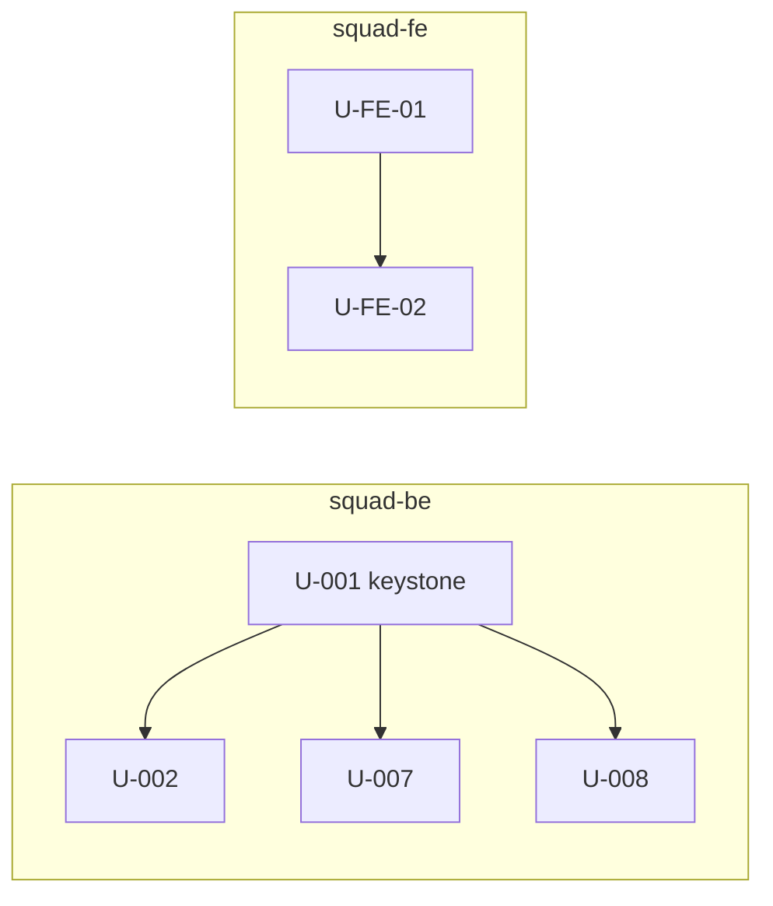

Analyze unit dependency graph for parallelism opportunities and bottlenecks. Read-only.

User arguments: $ARGUMENTS

## Procedure

### Step 1 — Resolve vault path

Same as lint-units: probe v3.4+ then legacy paths.

### Step 2 — Build DAG

For each unit:
- Node = unit ID
- Edge = entry in `depends_on` (unit-level dep)
- Cross-module edge = `depends_on` where target is in different `module:` than source
- Cross-squad edge = `depends_on` where target is in different `squad:` (should not exist per Iter 1.1; via interfaces only)

Graph properties to compute:
- Depth (longest path)
- Width (max parallel batch size — units at same topological level)
- Forks (units with high out-degree — many things depend on them)
- Joins (units with high in-degree — many deps converging)

### Step 3 — Per-grouping analysis

#### Per-squad (--per=squad)

For each squad declared in `_meta/squads.yaml`:

```
squad-be:
  units: 6
  depth: 3
  max parallel width: 4
  topological waves:
    Wave 1: U-001, U-010, U-020, U-030  (4 parallel)
    Wave 2: U-002, U-007, U-011         (3 parallel)
    Wave 3: U-008                        (1 sequential)
  forks: U-001 (5 dependents)
  cross-squad edges (should be 0; via interfaces): 0
  estimated wall-clock (if --parallel + 1bolt/min): ~3 min
```

#### Per-module (--per=module)

Same structure per module:

```
M-auth:
  units: 5
  depth: 2
  max parallel width: 3
  topological waves:
    Wave 1: U-001, U-008                 (2 parallel)
    Wave 2: U-002, U-003, U-007          (3 parallel)
  cross-module edges (require blocked_by): 0
  module DoD ready when: all 5 units complete
```

#### Whole-vault overview (--per=all)

```
Vault: leave-management v3
Total units: 13 | Modules: 4 | Squads: 2

Overall DAG:
  Depth: 4 (longest chain)
  Max parallel width: 7 (Wave 1)
  Total waves: 4

Execution plan (--per-squad --parallel):

Wave 1 (start parallel):
  squad-be:    U-001 U-010 U-020 U-030
  squad-fe:    U-FE-01 U-FE-02
  squad-int:   U-INT-01
  → 7 bolts parallel

Wave 2:
  squad-be:    U-002 U-007 U-011
  squad-fe:    U-FE-03
  → 4 bolts parallel

Wave 3:
  squad-be:    U-008
  squad-int:   U-INT-02 (waits for U-INT-01)
  → 2 bolts parallel

Wave 4:
  squad-be:    U-FINAL
  → 1 bolt (longest chain endpoint)

Total estimated wall-clock (1bolt/min average): ~4 min
Sequential equivalent (no parallel): ~13 min
Parallelism speedup: 3.25x
```

### Step 4 — Bottleneck + over-coupling analysis

Surface units that block parallelism:

```
Bottlenecks (units in critical path):
  U-001 — forks to 5 dependents; deep dependency tree
    → Suggestion: scope-down U-001 if possible; or accept as keystone

Suspected over-coupling (depends_on edges that might be unnecessary):
  ⚠️ U-002 depends_on U-001 — share zero target_files; no symbol cross-reference
     Suggestion: review; if independent, remove dep for +1 parallelism width

  ⚠️ U-005 depends_on U-003 — different modules (M-leave vs M-auth); should be blocked_by
     Suggestion: move dep from unit-level depends_on to module-level blocked_by

Critical chain (longest path):
  U-001 → U-002 → U-007 → U-FINAL (4 hops)
```

### Step 5 — Output formats

#### `--format=table` (default)

Per-section markdown table per spec above.

#### `--format=json`

Machine-parseable:

```json
{
  "vault": "leave-management",
  "total_units": 13,
  "depth": 4,
  "max_width": 7,
  "parallelism_speedup": 3.25,
  "squads": {
    "squad-be": { "units": 6, "depth": 3, "max_width": 4, "waves": [...] },
    ...
  },
  "modules": { ... },
  "bottlenecks": [...],
  "suspected_over_coupling": [...]
}
```

#### `--format=mermaid`

Mermaid graphviz for visual inspection:



User can paste into mermaid.live or Obsidian for visual analysis.

### Step 6 — Filter flags

- `--per=squad|module|all` — analysis grouping level (default: all)
- `--module=<id>` — analyze only specific module
- `--squad=<id>` — analyze only specific squad
- `--depth-only` — skip suggestion output; just show depth + width metrics

### Step 7 — Hand-off

After display:
- If `parallelism_speedup` ≥ 2 → suggest `/mega-sdd:execute-bolts --per-squad --parallel`
- If `parallelism_speedup` < 1.5 → suggest reviewing `depends_on` over-coupling list
- If bottlenecks exist → suggest scope-down OR accept as keystone
- Always link to `/mega-sdd:lint-units` for quality check before execution

## Anti-halu rails

- DAG analysis is DETERMINISTIC (graph algorithms on parsed frontmatter)
- Over-coupling SUGGESTIONS are heuristic (compare target_files overlap + body symbol references) — surfaced as SUGGESTIONS for user review, NEVER auto-removed
- User SELALU pegang control: removes deps manually if confirmed unnecessary
- Speedup estimate uses simple "1 bolt = 1 min" assumption — labeled as estimate, not promise

## Halt conditions

- Vault not found → halt
- Vault.json corrupt → halt
- DAG has cycle (should have been caught by generate-units; halt-equivalent here for safety)

## References

- `plugins/mega-sdd/skills/generate-units/SKILL.md` — DAG construction logic (Step 4)
- `plugins/mega-sdd/skills/generate-units/references/modules-schema.md` — cross-module blocked_by
- `plugins/mega-sdd/skills/execute-bolts/SKILL.md` — `--per-squad --parallel` execution
- Iter 1.1 spec — squad partition rules
