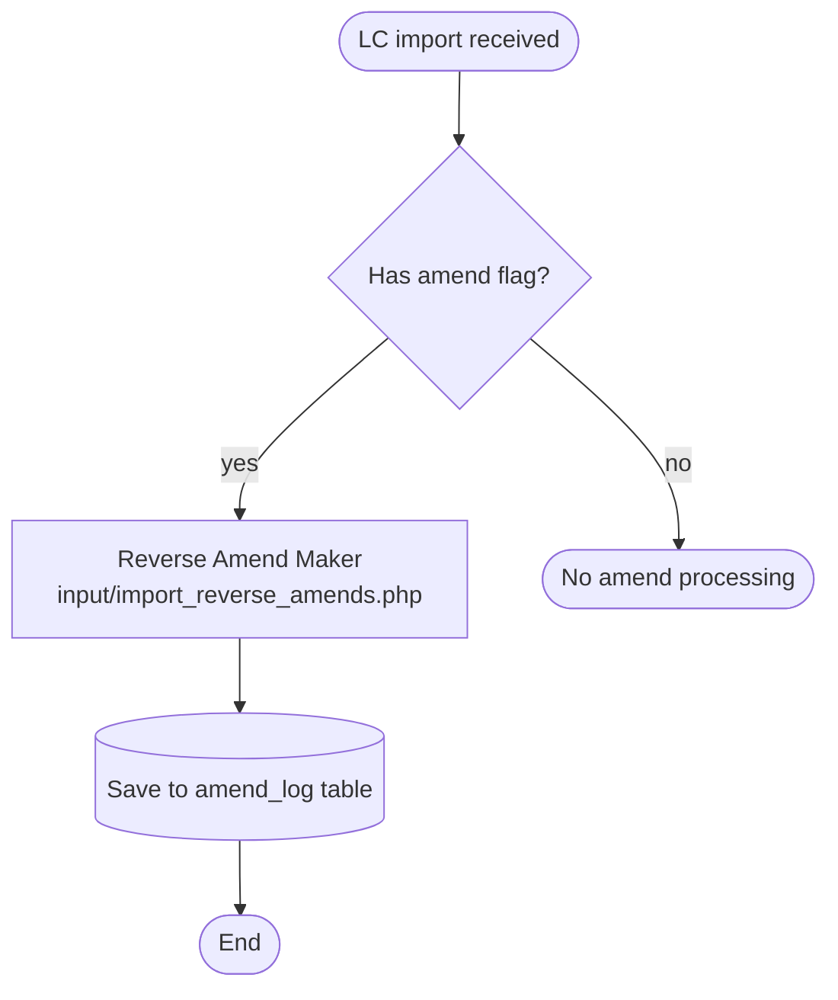
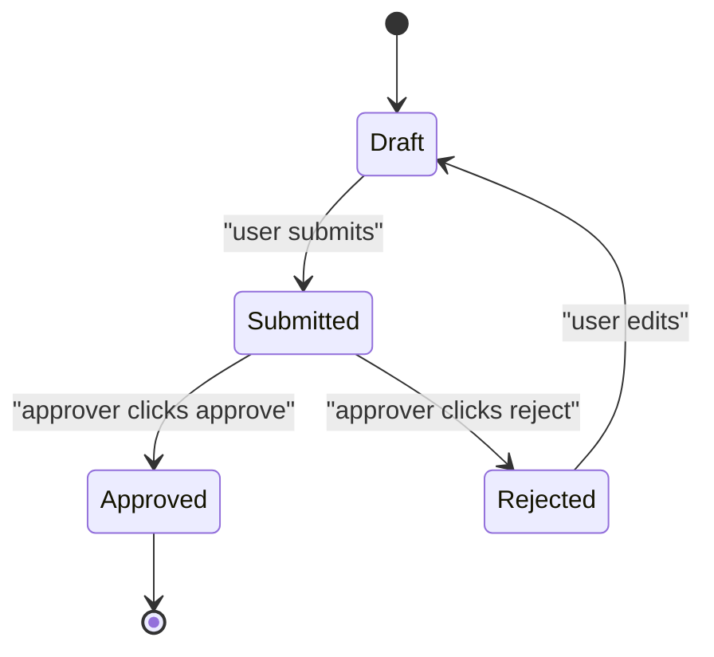
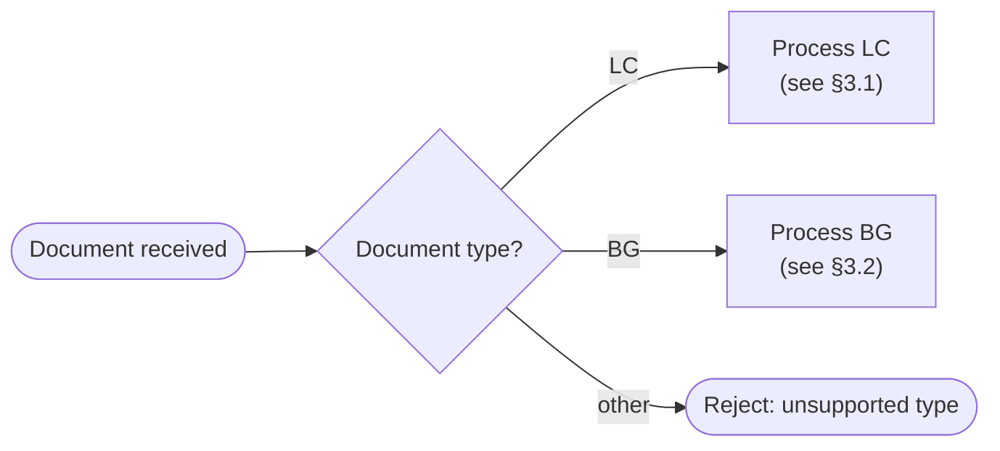

# Mermaid Emission Rules — every generated flow / state diagram

> Anti-hallucination + parser-safety contract for **every** skill that emits a process/flow or state diagram. Under the Mermaid-flows hard rule, any generated flow IS a Mermaid diagram (never a prose step list or ASCII arrows), and that diagram must actually render. Surfaces: `extract-intelligence` KB §3 Flow + §8 State Machine; `generate-intent` vault `04-flows.md` flows; any flow `detect-drift` / `diff-vault` write into a vault; and any future flow-emitting skill.
>
> A model writing a diagram from natural-language node text (often verbatim from legacy code) tends to leave an unquoted comma / parenthesis / colon inside a shape, or omit the diagram-type header — producing a fenced ` ```mermaid ` block that LOOKS valid but renders as an error. These rules prevent that at the producer side.

---

## Contents

- Why this exists
- Rule 0 — Declare a diagram type (else it does not render)
- Rule 1 — Always wrap node text in double quotes
- Rule 2 — Newline in node text = `<br/>`, NEVER a literal line break
- Rule 3 — Escape special characters inside quoted text
- Rule 4 — Edge labels follow the same quoting discipline
- Rule 5 — Avoid raw code expressions in node text; paraphrase
- Rule 6 — `classDef` and `style` go at end of block; verify spelling
- Reference patterns — known-good examples
- Anti-pattern catalog (validator-detected)
- Cross-references
- Not done (candidates)

## Why this exists

Mermaid is the canonical diagram format for mega-sdd KB outputs. Skills that emit Mermaid are responsible for producing **parser-valid** syntax. The historical failure mode: model writes natural-language node text (often verbatim from legacy code references), Mermaid parser hits an unquoted comma / parenthesis / colon inside `[...]` shape, fails to render. Downstream consumers (PDF, vault, generate-intent) see a fenced ` ```mermaid ` block that LOOKS valid but renders as an error message. A fence-presence check alone does not catch this; the validators parse the block's syntax.

This document is the producer-side contract. `validate-kb-flows.sh` (KB §3/§8) and `validate-vault-flows.sh` (vault `04-flows.md` flows) enforce a heuristic subset at the always-on hook layer, sharing one tokenizer (`scripts/_lib/mermaid_syntax.py`). The opt-in ground-truth oracle (`verify-mermaid.sh`, real `mermaid.parse()`) was removed in v7 Fase 2 — the shared heuristic tokenizer is the enforced layer; for render ground truth, paste the block into mermaid.live or run `npx @mermaid-js/mermaid-cli` by hand.

---

## Rule 0 — Declare a diagram type (else it does not render)

The first non-comment line of every ` ```mermaid ` block MUST be a diagram-type declaration — `flowchart TD`, `graph LR`, `stateDiagram-v2`, `sequenceDiagram`, `erDiagram`, etc. A block that jumps straight into edges (a header-less fragment) or holds a `[placeholder]` fails to render with mermaid's "No diagram type detected" — the single most common real render-breaker, and one the quoting rules below do NOT catch.

| ❌ Wrong | ✅ Right |
|---|---|
| ` ```mermaid `<br/>`A --> B` | ` ```mermaid `<br/>`flowchart TD`<br/>`  A --> B` |
| ` ```mermaid `<br/>`[actor flow only]` | author a real diagram, or omit the block |

## Rule 1 — Always wrap node text in double quotes

Regardless of shape — `[...]`, `(...)`, `{...}`, `[(...)]`, `[[...]]`, `[\...\]`, `[(...)]`. Default to quoted text. The quote is part of the Mermaid spec for any text containing special characters; defaulting to "always quote" eliminates the per-case judgment.

| ❌ Wrong | ✅ Right |
|---|---|
| `PRE([LC has flag_amend IN (2.2, 4)])` | `PRE(["LC has flag_amend IN (2.2, 4)"])` |
| `A[Reverse Amend Maker]` | `A["Reverse Amend Maker"]` |
| `D{Has amend?}` | `D{"Has amend?"}` |
| `S1((Idle))` | `S1(("Idle"))` |

The `(2.2, 4)` in the TF Import example is the exact failure shape: comma + parens inside `[...]` without surrounding quotes confuses the Mermaid lexer.

## Rule 2 — Newline in node text = `<br/>`, NEVER a literal line break

Mermaid does not parse literal `\n` or actual newlines inside node text reliably. Multi-line node text MUST use `<br/>` for line breaks.

| ❌ Wrong | ✅ Right |
|---|---|
| `M1["Reverse Amend Maker\ninput/import_reverse_amends.php"]` | `M1["Reverse Amend Maker<br/>input/import_reverse_amends.php"]` |
| `M1["line1`<br>(actual newline)`line2"]` | `M1["line1<br/>line2"]` |

## Rule 3 — Escape special characters inside quoted text

If the text content itself contains characters Mermaid would interpret structurally, HTML-escape them:

| Char in text | Escape |
|---|---|
| `"` (double-quote within text) | `&quot;` (HTML entity) or `#quot;` (Mermaid-native) |
| `<` | `&lt;` |
| `>` | `&gt;` |
| `&` | `&amp;` |

Backticks for inline code-like text are fine and recommended: `A["call \`amendFlag()\`"]`.

| ❌ Wrong | ✅ Right |
|---|---|
| `A["he said "hi""]` | `A["he said &quot;hi&quot;"]` |
| `A["x < y && z > 0"]` | `A["x &lt; y &amp;&amp; z &gt; 0"]` |

## Rule 4 — Edge labels follow the same quoting discipline

Edge label syntax `A --|label|--> B` or `A -- "label" --> B`. If the label contains parens, commas, colons, or other special chars, wrap in double quotes.

| ❌ Wrong | ✅ Right |
|---|---|
| `A -- if (x > 0) --> B` | `A -- "if (x > 0)" --> B` |
| `A -->|step 1: validate| B` | `A -->|"step 1: validate"| B` |

## Rule 5 — Avoid raw code expressions in node text; paraphrase

Even with quoting, raw code expressions inside diagrams are hostile to readers and brittle. Paraphrase to natural language abstractions where possible.

| ⚠ Brittle (works but bad) | ✅ Better |
|---|---|
| `PRE(["IN (2.2, 4)"])` | `PRE(["amend flag in (2.2 OR 4)"])` |
| `D{"if x == NULL && y > 0"}` | `D{"x is null AND y positive"}` |

Fewer special chars = fewer ways for a future reader (or downstream renderer) to mis-handle the diagram.

## Rule 6 — `classDef` and `style` go at end of block; verify spelling

Mermaid styling directives are valid Mermaid syntax but easy to typo. Place them AFTER all nodes and edges (at the bottom of the `flowchart` block) and verify spelling against the [Mermaid Style spec](https://mermaid.js.org/syntax/flowchart.html#styling-and-classes).

Common typos:

| ❌ Wrong | ✅ Right |
|---|---|
| `style A stroke-dash-array:5` | `style A stroke-dasharray:5` |
| `style A fill:red` (no quotes for color word) | `style A fill:#ff0000` (hex or `style A fill:red` is OK; both valid) |
| `classDef important: fill:red` (colon after name) | `classDef important fill:red` (no colon between class name and props) |

---

## Reference patterns — known-good examples

### Pattern A — Sequential flow (extract-intelligence §3 Flow)



### Pattern B — State machine (extract-intelligence §8 State Machine)



State-machine syntax uses `:` for transition labels — wrap label in double-quotes if it contains commas/parens/special chars.

### Pattern C — Decision with multiple branches



---

## Anti-pattern catalog (validator-detected)

The shared tokenizer (`_lib/mermaid_syntax.py`, used by both flow validators) detects these heuristic anti-patterns:

| Anti-pattern | Detection regex (approximate) | Failure mode |
|---|---|---|
| Unquoted text with special chars inside shape | `[A-Z_][A-Z0-9_]*[(\[{][^"]*[(),:|][^"]*[)\]}]` | Mermaid lexer fails on the special char |
| Literal `\n` in node text | `[(\["][^"]*\\n[^"]*[)\]"]` | Mermaid renders `\n` as literal text, not line break |
| Actual newline within `[...]` or `(...)` shape | (multi-line regex within shape) | Parser breaks at end-of-line |
| Multiple unescaped `"` in node text | `["][^"]*["][^"]*["]` between shape brackets | Inner `"` ends the text early |

When detected, the validator emits:
- `halt_type: mermaid_syntax_invalid`
- `line_number`: where the offending node sits
- `node_id`: the leading identifier (e.g., `PRE`)
- `excerpt`: the raw offending line (truncated to ~120 chars)
- `rule_violated`: which Rule above (1, 2, 3, etc.)
- `suggested_fix`: a one-line corrective rewrite

Tier classification: **C2** (producer must fix). NOT C1 — auto-rewriting Mermaid would risk semantic change (e.g., paraphrasing a condition incorrectly). Producer-side responsibility.

---

## Cross-references

- Producer skills: `plugins/mega-sdd/skills/extract-intelligence/SKILL.md` §3 Flow + §8 State Machine emission steps
- Producer skills: `plugins/mega-sdd/skills/generate-intent/SKILL.md` (vault `04-flows.md` flow emission)
- Shared tokenizer: `plugins/mega-sdd/scripts/_lib/mermaid_syntax.py` (Rule 0 + Rule 1-3 heuristics)
- Heuristic gates (always-on hook): `validate-kb-flows.sh` (KB §3/§8), `validate-vault-flows.sh` (vault flows)
- KB schema: `plugins/mega-sdd/skills/extract-intelligence/references/knowledge-base-schema.md` §3 Flow + §8 State Machine
- Spec: `docs/superpowers/specs/2026-07-01-mermaid-flows-hard-rule.md`

## Not done (candidates)

- **Full-render via `mmdc`**: `npx @mermaid-js/mermaid-cli` renders each block to SVG for pixel-level ground truth. Rejected for any gate: needs Chromium, slow, offline-flaky. (The former in-repo headless `mermaid.parse()` oracle was removed in v7 — same conclusion stands: full-render stays rejected for any gate.)
- **Auto-fix for unquoted shape text**: risk-graded tool that adds quotes only when unambiguous (no nested quotes / HTML entities). Opt-in; producer-side responsibility means it stays off by default.
