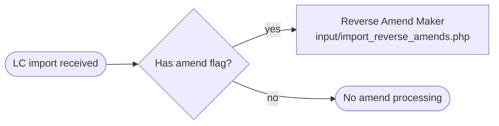
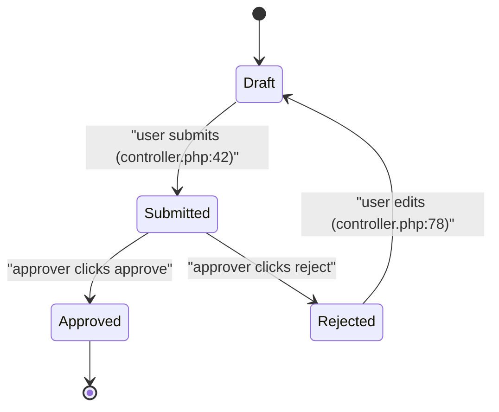

# Knowledge-Base Output Schema

`.mega-sdd/knowledge-base/` (default) is the structured output of `extract-intelligence`. It is consumed by `mega-sdd:generate-intent` (Mode B brief) and `mega-sdd:bind-codebase` (secondary ground truth). Legacy default `docs/knowledge-base/` retained for read-side back-compat only.

Regenerable — never edited manually. To revise: edit the source legacy code OR re-run extraction with updated `--seed`.

---

## Contents

- Directory layout
- Per-domain file frontmatter (MANDATORY)
- Per-domain 11-section template (MANDATORY)
- 1. Purpose
- 2. Actors
- 3. Flow (Input → Process → Output)
- 3a. Staged inputs (multi-step workflows)
- 4. Inputs
- 5. Process
- 6. Outputs
- 7. Business Rules
- 8. State Machine
- 9. Edge Cases & Gotchas
- 10. Open Questions
- 11. Source References
- Marker conventions (two orthogonal axes)
- ERD Quality Rails
- `data-mutation-policy.md` template
- Entity-level summary
- Per-locked-field policy
- Discardable artifacts
- How rebuild teams use this file
- README roll-up structure
- 99-rebuild-architecture templates
- Anti-hallucination invariants
- Consumed by

## Directory layout

```
{out}/
├── _source/                       # forensic seed cross-reference (optional, read-only)
│   └── <seed-doc>.md
└── knowledge-base/
    ├── README.md                  # nav + critical findings + OQ roll-up + stats
    ├── 00-overview/
    │   ├── system-purpose.md
    │   ├── glossary.md
    │   ├── module-classification.md
    │   └── actors-and-roles.md
    ├── 10-domains/                # 1 file per business domain
    ├── 20-workflows/              # cross-cutting workflows
    │   ├── maker-checker-pattern.md
    │   ├── approval-state-machine.md
    │   └── …
    ├── 30-data-model/
    │   ├── conceptual-erd.md
    │   ├── core-entities.md
    │   └── reference-entities.md
    ├── 40-business-rules/
    │   ├── regulatory-rules.md
    │   ├── operational-rules.md
    │   └── hidden-gotchas.md
    ├── 50-integrations/           # 1 file per external system
    └── 99-rebuild-architecture/
        ├── suggested-erd.md
        ├── suggested-system-flow.md
        ├── module-dependency-graph.md
        └── suggested-phasing.md
```

**Default `--out`:** `.mega-sdd/knowledge-base/` (canonical). Configurable. Pipeline-consumers probe in this order:

1. `.mega-sdd/knowledge-base/` (canonical default — checked FIRST)
2. `docs/knowledge-base/` (legacy v1.x extraction)
3. `docs/mega-sdd/knowledge-base/` (legacy v2.x layout)
4. `old-reference/knowledge-base/` (cross-folder rebuild placement)

First hit wins.

---

## Per-domain file frontmatter (MANDATORY)

Every file under `10-domains/` (and recommended for `20-workflows/`, `40-business-rules/`, `50-integrations/`):

```yaml
---
generated_by: mega-sdd:extract-intelligence
generated_at: <ISO8601 timestamp>
domain: <kebab-case-id>            # e.g., cif-customer, import-lc-issuance
classification: master | workflow | reporting | integration | reference
criticality: high | medium | low
rebuild_phase: 1 | 2 | 3
depends_on: [<other-domain-ids>]   # for dependency graph synthesis
verified_count: <int>              # count of [VERIFIED] markers in the file
inferred_count: <int>              # count of [INFERRED] markers
open_count: <int>                  # count of [OPEN] markers / OQ entries
# mutability distribution (machine-read by generate-intent --kb)
locked_count: <int>                # count of [LOCKED] markers (1:1 preserve)
intent_count: <int>                # count of [INTENT] markers (outcome-only)
artifact_count: <int>              # count of [ARTIFACT] markers (discardable)
source_files_cited: <int>          # unique source file count in §11
---
```

These fields are machine-read by `bind-codebase` when consulting KB for secondary ground truth, and by `generate-intent --kb` to route claims to vault correctly per mutability tier.

---

## Per-domain 11-section template (MANDATORY)

Every file under `10-domains/` MUST have all 11 sections, in order. Empty sections are filled with `_None detected — see §10 Open Questions._`, never omitted.

```markdown
# <Domain Name>

> **Classification**: <from frontmatter>
> **Criticality**: <from frontmatter>
> **Depends on**: <links to other domain files>
> **Rebuild Phase**: <from frontmatter>

## 1. Purpose

<1-2 paragraphs: what this domain exists for, in business terms. Tech-agnostic.>

## 2. Actors

<List of actor roles touching this domain. Link to `00-overview/actors-and-roles.md`.>

## 3. Flow (Input → Process → Output)

**Mermaid emission rules (MANDATORY):** see `plugins/mega-sdd/references/mermaid-emission-rules.md`. Quick checklist before writing the block:
- Every node text wrapped in **double quotes** regardless of shape (Rule 1)
- Newlines in node text use `<br/>` (Rule 2) — never literal `\n` or actual line breaks
- Special chars (`<`, `>`, `&`, embedded `"`) HTML-escaped (Rule 3)
- Edge labels with parens/commas/colons also wrapped in quotes (Rule 4)
- Paraphrase raw code expressions (e.g., `IN (2.2, 4)` → `"amend flag in (2.2 OR 4)"`) (Rule 5)



`validate-kb-flows.sh` enforces a heuristic subset of these rules at the validator layer; producer responsibility to author parser-valid syntax (validator catches the obvious failures, not all).

## 3a. Staged inputs (multi-step workflows)

<Only when classification = workflow AND the legacy flow collects inputs across MORE THAN ONE sequential step / page / role (a wizard, a maker→checker hand-off, a multi-page form). Otherwise: "_N/A — single-step flow._">

A flat "Inputs: A, B, C, D, E, F" list silently destroys staging: a downstream bolt then builds ONE form when the legacy was a multi-step wizard (the captured trade-finance regression). When a workflow stages its inputs, capture the staging EXPLICITLY as a structured `stages:` block so `generate-intent` can preserve it verbatim (it does NOT re-derive staging from prose) and the rebuild keeps the multi-step shape.

**REQUIRED when the source has a multi-step pattern** (see §detection below). Each stage carries its own `_source` citation (anti-hallucination rail: a stage with no anchor is an `[OPEN]`, never an invented step).

```yaml
stages:                          # staged-input block. REQUIRED when source is multi-step.
  - stage_id: "S1"
    stage_name: "Initial input"
    actor_role: "Maker"           # who fills / acts at this stage
    input_fields: ["field_a", "field_b", "field_c"]  # BARE-STRING form — still fully valid (back-compat). Subset of TOTAL workflow inputs allocated to THIS stage
    transitions:
      - to: "S2"
        trigger: "submit_partial"  # the event that advances the workflow
        conditions: []             # guard conditions (role / field / status); empty list if none
    _source: ["legacy/path/file.php:120-184"]   # anchor(s) proving this stage exists
  - stage_id: "S2"
    stage_name: "Review & complete"
    actor_role: "Checker"
    input_fields:                  # ENRICHED OBJECT form (OPTIONAL) — progressive-disclosure delta semantics
      - { name: "field_a", mutability: "dual-key-re-entry", visibility: "shown", conditional: "always" }  # re-typed by checker (G-110 dual-key)
      - { name: "field_d", mutability: "required",          visibility: "shown", conditional: "always" }
      - { name: "field_g", mutability: "optional",          visibility: "conditional", conditional: "if discount_type != 'none'" }
    new_fields_vs_prior: ["field_d", "field_g"]          # fields collected HERE that no prior stage collected
    hidden_fields_vs_prior: ["field_b", "field_c"]       # fields shown at a prior stage, no longer in THIS form
    promoted_to_mutable_vs_prior: ["field_a (display-only at S1 → dual-key-re-entry at S2)"]
    dynamic_disclosures:           # WITHIN-stage show/hide (JS / server-side conditional render)
      - { trigger: "discount_type dropdown change", fields_shown: ["field_g"], _source: "legacy/path/file.php:215-222" }
    transitions:
      - to: "DONE"
        trigger: "approve"
        conditions: ["actor_role in {MGRL1, MGRL2}"]
    _source: ["legacy/path/file.php:201-240"]
```

**Enriched per-field & delta fields (OPTIONAL — reuse-compliant extension of the SAME `stages:` block, NOT a parallel artifact):**
- `input_fields` accepts EITHER bare strings (back-compat — S1 above) OR objects with `name` + optional `mutability` ∈ {`required`, `optional`, `display-only`, `dual-key-re-entry`} + `visibility` ∈ {`shown`, `hidden`, `conditional`} + `conditional` (trigger expr, default `"always"`). A consumer that doesn't read the enriched fields simply uses `name` (or the bare string) — no consumer breaks (per CLAUDE.md semantic-depth invariant #7).
- Per-stage delta lists (all OPTIONAL): `new_fields_vs_prior` (the progressive-disclosure kernel — fields introduced at this stage), `hidden_fields_vs_prior` (collected earlier, no longer shown), `promoted_to_mutable_vs_prior` (was display-only, now mutable — e.g. dual-key re-entry).
- `dynamic_disclosures` (OPTIONAL): within-stage show/hide keyed to a control (dropdown / checkbox / radio / AJAX sub-table) — `trigger` + `fields_shown` + `_source` anchor.
- **Enforcement stance:** these dimensions are **best-effort / advisory** in v3.72.0 (the per-field mutability / conditional / dynamic-disclosure dims are the Fork-B-future dimensions named in the walking-skeleton note below). They are NOT validator-blocking — recording them makes the stage→stage delta auditable; absence never fails a gate.

**Detection (when to author this block):** the source is multi-step when ANY of —
- a multi-page form / wizard (a `step` / `stage` / `page` param or hidden state field switches which fields render),
- conditional rendering keyed to a stage (`if (stage == 'review')`),
- a maker→checker / multi-role hand-off (different roles supply different fields in sequence),
- a state field whose transitions gate which inputs are accepted next (`status: draft → pending → approved`).

**Carry-over:** `stages:` propagates KB → vault `04-flows.md` → units — the SAME class of stable-identifier propagation as OQ-IDs and constitution clauses (see `generate-intent/references/vault-contract.md §stages-propagation`). `generate-intent` MUST copy the block verbatim and emit the matching Mermaid `stateDiagram`, never re-flatten it. `validate-vault-flow-staging.sh` checks non-loss across the KB→vault boundary (advisory via `/mega-sdd:analyze` in v4 Hybrid — no longer a hard-block); `validate-kb-flows.sh` raises an advisory (`kb_flow_staging_missing`) when a workflow looks multi-step but carries no `stages:` block, pointing the user to `/mega-sdd:enrich-semantics`.

> **Walking-skeleton scope:** only the staged-input dimension is enforced. Other semantic-depth dimensions (rich per-stage conditional logic beyond `conditions:`, fine-grained role matrices, full transition guards) are captured best-effort here but not yet validator-enforced (Fork-B-future — `conditional` / `role-stage` / `transition` dimensions follow in a later iter).

## 4. Inputs

<What triggers / data this domain accepts. Tech-agnostic (e.g., "customer details", not "POST /api/v2/customers").>

> **Staged workflows:** if §3a `stages:` is present, the per-stage `input_fields` together enumerate this section's inputs — keep §4 as the flat union (back-compat for consumers that don't read §3a) AND keep §3a as the authoritative field→stage allocation. Never let §4 be the ONLY place inputs live for a multi-step workflow.

## 5. Process

<Step-by-step business logic. State transitions called out. Each non-trivial step carries a marker.>

1. Step 1. [VERIFIED]
2. Step 2. [INFERRED] — single source path; needs confirmation.
3. Step 3. [OPEN] — branch logic unclear in legacy.

## 6. Outputs

<What this domain emits / persists / triggers.>

## 7. Business Rules

| ID | Rule | Why | Source | Confidence | Mutability |
|---|---|---|---|---|---|
| BR-{domain}-1 | <rule in business language — explicit, not code-level> | <business reason> | <file:line> | [VERIFIED] / [INFERRED] / [OPEN] | [LOCKED] / [INTENT] / [ARTIFACT] / [?] |

Depth expectations:
- Extract IMPLICIT rules coded as conditionals — make the business rule EXPLICIT. E.g., `if amount > threshold` → "BR-PAYMENT-3: Transactions exceeding threshold require dual approval".
- Minimum: every conditional branch that drives a different business outcome = one rule row.
- Error-handling rules count: "BR-PAYMENT-7: Failed payment retries 3 times then flags for manual review" is a business rule, not just an implementation detail.

## 8. State Machine

<Only if classification = workflow. Otherwise: "_N/A — not a workflow domain._">

Depth expectations:
- Include ALL states (not just happy-path): error states, timeout states, cancellation, reversal, partial-completion.
- Each transition: event name + guard condition + citation.
- If no explicit state machine exists in code but status/state fields drive branching → reconstruct the implicit state machine.

**Mermaid emission rules (MANDATORY):** see `plugins/mega-sdd/references/mermaid-emission-rules.md`. State-machine syntax uses `:` for transition labels — wrap label in double quotes if it contains commas/parens/special chars.



> **Staged workflows (§3a present):** label each transition with the `stage_id` it advances from §3a (e.g. `Draft --> Submitted: "S1 maker submits (controller.php:42)"`) so the state topology stays joined to the staged-input allocation. A transition whose actor differs from the prior state's actor MUST name the actor/role.

## 9. Edge Cases & Gotchas

<Silent bugs, race conditions, .bak-vs-live discrepancies, edge cases. Each labelled.>

- **Edge Case 1** [VERIFIED]: <description>. **Source**: <file:line>. **Rebuild guidance**: <do-not-replicate / replicate / open question>.

Depth expectations:
- Minimum 3 entries per workflow domain (gate enforced). Look for:
  - Empty-collection edge cases (what happens when list is empty, no records match?)
  - Boundary values (0, max, null, empty string)
  - Race conditions (concurrent users updating same record)
  - Timezone / date-boundary issues (midnight, DST, fiscal year boundary)
  - Silent error swallowing (empty catch blocks, swallowed errors, error suppression)
  - .bak vs live file discrepancies
  - **Dynamic dispatch seams (P6)** — behaviour reached via DI-container resolution, reflection / `dynamic`, attribute/annotation/convention routing, interface → implementation dispatch, or event/delegate/middleware wiring. Document the resolved target(s) as a business outcome (cite BOTH the seam site and each target); an unresolvable seam is an `[OPEN]` here, never an invented target. See `references/wave-dispatch-templates.md` DEEP DISCIPLINES P6 + STACK IDIOM TABLE for the per-stack idiom to look for.
- Each entry MUST have: description + source file:line + rebuild guidance (replicate/don't/open).

## 10. Open Questions

> ❓ Items requiring domain expert input. Tagged for downstream OQ propagation.

- [ ] **OQ-<DOMAIN>-<NN>** [P1|P2|P3]: <question text>. **Resolves**: <what unblocks this>.

## 11. Source References

<Every non-trivial claim above maps to a citation here. file:line format.>

- `<file>:<line-range>` — <what this proves>
- …
```

---

## Marker conventions (two orthogonal axes)

### Axis 1 — Confidence

| Marker | Meaning | Behavior downstream |
|---|---|---|
| `[VERIFIED]` | Confirmed by multiple code paths OR explicit doc | `bind-codebase` → CONFIRMED when claim matches |
| `[INFERRED]` | Single source code path; needs confirmation | `bind-codebase` → CONFIRMED with note when claim matches |
| `[OPEN]` | Unknown from code; needs domain expert | `bind-codebase` → escalate as OQ; `generate-intent --kb` → propagates to vault as OQ |

### Axis 2 — Mutability tier

| Marker | Meaning | `generate-intent --kb` behavior |
|---|---|---|
| `[LOCKED]` | MUST preserve 1:1 — regulatory, contractual, integration-required, or external-FK-dependent | Vault body verbatim; emit as Hard Rule for execute-bolts; mutability_source: kb_locked |
| `[INTENT]` | Outcome matters, implementation free | Vault as outcome goal; reference `99-rebuild-architecture/` recommendation as proposed new shape; mutability_source: kb_intent |
| `[ARTIFACT]` | Coincidental legacy detail — discardable | Vault OQ with default "discard unless user requests preservation"; mutability_source: kb_artifact |
| `[?]` | Mutability pending — only valid when paired with `[OPEN]` | Vault OQ — answering resolves both confidence + mutability |

### Combined notation

Markers stack: `[VERIFIED][LOCKED]`, `[VERIFIED][INTENT]`, `[INFERRED][LOCKED]`, etc. Confidence first, mutability second. Inline format:

```
Status code 14 written by act_import_ops.php:269 [INFERRED][INTENT] — outcome (mark application as approved) matters; field-level mechanism is rebuild's choice.
```

In Business Rules table, two separate columns (Confidence + Mutability). Markers go inline next to claims AND in the table.

### Default tier when uncertain

If a wave-2/3/4 agent can't classify with high confidence, default to `[INTENT]` (middle-ground). Wave 5 synthesis re-reviews and may upgrade to `[LOCKED]` (regulatory citation found) or downgrade to `[ARTIFACT]` (zero callers + workaround pattern).

Never auto-default to `[LOCKED]` (over-constrains rebuild) or `[ARTIFACT]` (risks discarding business rule). Both require positive evidence.

### Backward-compat for KBs without tier markers

Pre-v1.4 KBs that only carry confidence markers: `generate-intent --kb` treats every claim as `[INTENT]` (safe middle-ground). User MAY re-run extraction to upgrade tier classification.

---

## ERD Quality Rails

`suggested-erd.md` MUST satisfy these checks before Wave 5 writes the file:

### Universal-good-practice defaults

- **Column naming**: snake_case (universal default; framework pack may override — see `plugins/mega-sdd/references/framework-conventions/`)
- **Table naming**: plural snake_case (`customers`, `loan_applications`)
- **Primary key**: `id` (auto-increment BIGINT or UUID per framework convention)
- **Foreign key**: `{singular_target_table}_id` (e.g., `customer_id` on `loans` table referencing `customers.id`)
- **Standard timestamps**: `created_at TIMESTAMP NOT NULL`, `updated_at TIMESTAMP NOT NULL` on every mutable table
- **Soft delete (when applicable)**: `deleted_at TIMESTAMP NULL` — application enforces filter
- **Audit columns (when applicable)**: `created_by`, `updated_by` → FK to users.id

### Normalization checklist

- **3NF compliance**: every non-key field depends on the WHOLE key, ONLY the key, NOTHING but the key
- **No repeating groups**: e.g., `phone1`, `phone2`, `phone3` → separate `customer_phones` table
- **Junction tables for M:N**: e.g., `users` × `roles` → `user_roles` table with composite PK
- **No denormalization shortcuts** unless paired with `[LOCKED]` tag + business justification (e.g., reporting performance)

### Departures from legacy (mandatory section)

`suggested-erd.md` MUST include a `## Departures from Legacy` section enumerating:

1. **Denormalization fixes** — legacy field X was stored on table Y for read-perf; rebuild moves to JOIN / projection
2. **Naming standardization** — legacy `cifmast` → rebuild `customers`; legacy `cifNm` → rebuild `name`
3. **Type corrections** — legacy `varchar(255)` for currency → rebuild `decimal(15,2)`
4. **Bug fixes structural** — legacy typo `commited_at` → rebuild `committed_at`
5. **Discarded fields** — `[ARTIFACT]` columns listed with discard rationale

Each departure cross-references the `[LOCKED]/[INTENT]/[ARTIFACT]` tier of the affected entity. `[LOCKED]` entities cannot have name/type departures — only additive changes allowed.

---

## `data-mutation-policy.md` template

```markdown
---
generated_by: mega-sdd:extract-intelligence
wave: 5
purpose: Entity-level mutability policy — drives ERD freedom in generate-intent --kb
---

# Data Mutation Policy

This file declares which legacy entities/fields are LOCKED (must preserve 1:1) vs INTENT (outcome only) vs ARTIFACT (discardable). Generated from per-domain `[LOCKED]/[INTENT]/[ARTIFACT]` markers.

## Entity-level summary

| Entity | Locked count | Intent count | Artifact count | Overall tier | Departure-allowed? |
|---|---|---|---|---|---|
| customers | 3 | 12 | 4 | INTENT (mixed; 3 locked fields) | Yes — except for locked fields below |
| transactions | 8 | 6 | 0 | LOCKED (audit trail compliance) | No structural departures; additive only |
| audit_logs | 4 | 0 | 0 | LOCKED (regulatory) | No |

## Per-locked-field policy

For every `[LOCKED]` field, list explicitly:

| Entity.field | Legacy name | Mandated by | Rebuild permission |
|---|---|---|---|
| customers.nip | cifmast.cifNip | BI Reg 23/2/2021 §4 | Field name MAY change to `national_id`; type + length + validation rule MUST preserve. |
| transactions.swift_mt_type | trxmast.mt_type | SWIFT MT Standard | Field name + values MUST be exact (MT103, MT700, etc.) |
| ... | ... | ... | ... |

## Discardable artifacts

| Entity.field | Legacy purpose | Why discardable | Rebuild action |
|---|---|---|---|
| customers.flag_legacy_v1 | Tag for legacy migration script | Migration completed 2018; field unused since | DROP |
| transactions.amount_str | Denormalized string copy of amount for legacy report | Reports rebuilt; redundant with `amount DECIMAL` | DROP |

## How rebuild teams use this file

1. Read this file BEFORE designing rebuild ERD
2. For `[LOCKED]` entities: clone legacy shape (name/type/constraints), no structural changes
3. For `[INTENT]` entities: design clean rebuild ERD per universal-good-practice defaults + framework conventions
4. For `[ARTIFACT]` columns: confirm with business stakeholder before discarding (default: discard); document discarded items in rebuild ADR
```

---

---

## README roll-up structure

`knowledge-base/README.md` is the master entrypoint. Required sections in order:

1. **Project header** — name, 1-sentence description, extraction date, source codebase path, forensic seed pointer (if any), methodology pointer to the spec.
2. **How to use this knowledge base** — table mapping reader goal → starting file.
3. **Module classification quick reference** — table of all domains with classification + criticality + rebuild phase.
4. **Reading conventions** — marker definitions, file reference format, cross-link conventions.
5. **Critical findings (surface first)** — bugs not to replicate, hidden dependencies, compliance gaps. THIS GETS READ FIRST by rebuild team; lead with what hurts.
6. **Open Questions roll-up** — grouped by phase blocker (Phase 1 / Phase 2 / Phase 3 / regulatory / integration). 1-line per OQ with link.
7. **Directory index** — tree view of `knowledge-base/`.
8. **Stats** — total files, total size, OQ count, business-rule count, gotcha count, state count, MT-type / external-message-type count, entity counts, legacy file count.
9. **Next steps for rebuild** — ordered list pointing reader to next action.
10. **About this extraction** — methodology, discipline, source-of-truth pointer, disclaimer.

---

## 99-rebuild-architecture templates

### `suggested-erd.md`
- Mermaid ER diagram of the clean rebuild schema.
- MUST satisfy §ERD Quality Rails above — universal-good-practice defaults + Normalization checklist + Departures section.
- Documents DEPARTURES from legacy (normalize denormalized tables, event-source mutable counters, fix typo bugs structurally).
- Tech-agnostic field types (e.g., `decimal`, `text`, not `varchar(255)`).
- Cross-references `data-mutation-policy.md` — fields tagged `[LOCKED]` retain legacy shape; `[INTENT]` fields apply rebuild design freedoms; `[ARTIFACT]` fields omitted with discard rationale in §Discarded fields.

### `suggested-system-flow.md`
- Logical service boundaries — NOT a microservice prescription.
- Anti-corruption layer pattern for integrations.
- Idempotency requirements per flow.
- No framework names; describe behavior contracts.

### `module-dependency-graph.md`
- Mermaid DAG showing module-level dependencies.
- Leaf-vs-trunk analysis.
- Critical-path estimate for rebuild ordering.

### `suggested-phasing.md`
- Phase 1 / 2 / 3 plan.
- Per-phase acceptance criteria.
- Per-module acceptance template.
- Pre-phase blocker list (resolved OQs required before phase start).

---

## Anti-hallucination invariants

- Every non-trivial claim has a marker AND a `file:line` citation in §11.
- Section presence is mandatory — empty sections render as `_None detected — see §10._`, never omitted.
- Forbidden patterns (language/DB names) absent in domain files except `## 11. Source References` and `50-integrations/`.
- README "Critical findings" leads with do-not-replicate bugs — surfaced first, not buried.
- Every `## 3a` stage carries its own `_source` anchor — a stage with no citation is `[OPEN]`, never invented; staging is reconstructed from code evidence, not assumed.

## Consumed by

- **`mega-sdd:generate-intent` (Mode B with `--kb`)**: reads `README.md` + relevant domain files as PRD-equivalent source quotes. `[VERIFIED]` items → vault body; `[INFERRED]` → confirmation prompt; `[OPEN]` → vault OQ. When a workflow domain carries a §3a `stages:` block, generate-intent copies it **verbatim** into the matching `04-flows.md` flow, emits the corresponding Mermaid `stateDiagram`, and stamps the flow with `_kb_source: [20-workflows/<file>.md]` (the back-reference `validate-vault-flow-staging.sh` follows to prove staging was not dropped).
- **`mega-sdd:bind-codebase`**: when codebase-map.md is silent on a vault claim, consults the matching domain file. KB `[VERIFIED]` → CONFIRMED; `[INFERRED]` → CONFIRMED with note; `[OPEN]` → escalate as OQ. Never overrides a codebase-map CONFLICT.
- **`mega-sdd:orchestrate-flow`**: detects KB presence in CWD and routes the next step.
