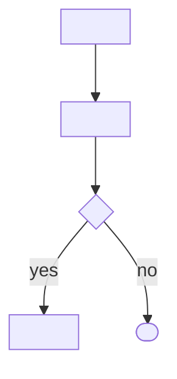
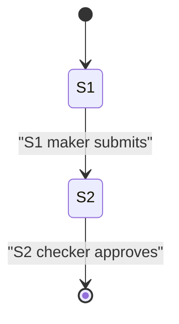
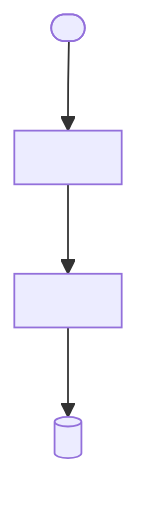
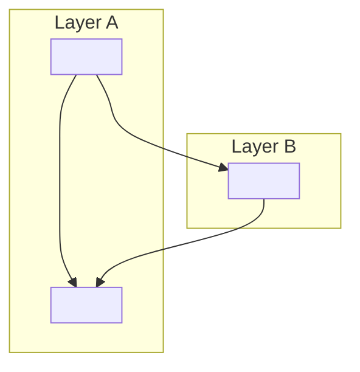

# 04 — Flows

> **TL;DR**: Step-by-step user flows, system flows, and per-flow Definition of Done. Organized **per type** according to PROJECT_SHAPE.
> **Audience**: Developers per layer (Mobile/FE/BE/Data), QA, UI/UX.
> **Read when**: you're building/testing a specific feature or need to see end-to-end behavior.

> **Note**: TL;DR placeholders shown in English. At runtime, render them in the PRD's language.

---

> Sub-sections below are derived from `PROJECT_SHAPE` (see [[00-index]] Vault Lock Status).
> Replace section headers with the relevant flow types.
>
> Common flow type sets:
> - mobile-app: User flows (mobile-facing), Backend / system flows, Cross-cutting flows
> - web-app: User flows (web), Backend / system flows, Cross-cutting flows
> - api-only: Backend / system flows, Consumer-facing flows
> - multi-platform: User flows (web), User flows (mobile), Backend / system flows, Cross-cutting flows
> - data-pipeline: Pipeline flows, Error/recovery flows, Operational flows
> - custom: flow categories per user description

## {Flow Type 1, e.g. "User flows (mobile-facing)" or "Pipeline flows"}

> Section description: e.g. "Flows triggered by the user from Mobile" or "Daily ETL processes from source to sink".

### F-{prefix}-001: <flow name>

> Prefix convention:
> - `F-U-` = User-facing flow
> - `F-S-` = System / backend flow
> - `F-C-` = Cross-cutting (multi-layer)
> - `F-P-` = Pipeline flow (for data-pipeline shape)
> - `F-X-` = Custom prefix per project shape

**Actor / Trigger**: <persona, or "scheduled cron at HH:MM", or "external API call">
<!-- full-only -->
**Preconditions**: <state required before flow starts>
<!-- /full-only -->

**Flow** — the flow body is a Mermaid diagram, never a prose numbered list (Mermaid-flows hard rule; quote every node text per `references/mermaid-emission-rules.md`):


<!-- staged-only: present ONLY when this flow collects inputs across multiple steps/pages/roles
     (wizard, maker→checker). Copy the `stages:` block from the source KB workflow §3a VERBATIM —
     do NOT re-flatten it. If the KB used the ENRICHED form (`input_fields` as objects
     with name/mutability/visibility/conditional, plus per-stage delta fields new_fields_vs_prior /
     hidden_fields_vs_prior / promoted_to_mutable_vs_prior / dynamic_disclosures), preserve THAT
     form; do NOT downgrade enriched objects to bare strings (AUDIT L8 — they carry the
     progressive-disclosure intent consumed at UI/bolt time per the ui-ux-design-intelligence
     integration). Then render the state diagram and stamp `_kb_source`. Omit all three
     blocks for single-step flows. validate-vault-flow-staging.sh follows `_kb_source` to prove the
     KB's staging was preserved here (a drop is an advisory `vault_flow_staging_drop`
     finding, surfaced via `analyze` — it does not block). -->
**Stages** (multi-step workflows only):
```yaml
stages:
  - stage_id: "S1"
    stage_name: "<step name>"
    actor_role: "<role>"
    input_fields: ["<field>", "..."]       # bare strings, OR enriched objects — preserve the KB's form (do NOT downgrade):
    #   input_fields: [{ name: "<field>", mutability: "[LOCKED]|[INTENT]|[ARTIFACT]", visibility: "always|conditional", conditional: "<rule>" }]
    # optional per-stage deltas (copy verbatim if the KB has them):
    #   new_fields_vs_prior: [...]   hidden_fields_vs_prior: [...]   promoted_to_mutable_vs_prior: [...]   dynamic_disclosures: [...]
    transitions: [{ to: "S2", trigger: "<event>", conditions: [] }]
    _source: ["<legacy file:line>"]
  # ... one entry per stage
```
**Workflow state diagram** (when Stages present):

**_kb_source**: [20-workflows/<workflow-file>.md]
<!-- /staged-only -->

<!-- full-only -->
**Postconditions**: <state after flow completes>
<!-- /full-only -->

**Definition of Done**:
- [ ] <observable behavior 1>
- [ ] <observable behavior 2>
- [ ] <data state change>

**Figma reference** (if applicable): <frame-name>
**Source**: PRD §<X.Y>

---

### F-{prefix}-002: <next flow>

<repeat>

---

## {Flow Type 2, e.g. "Backend / system flows" or "Error/recovery flows"}

### F-{prefix}-001: <flow name>

**Trigger**: <cron / event / manual>
**Inputs**: <what data the system reads>

**Flow** — Mermaid diagram (not a prose list):


**Outputs**: <what data is written / emitted>
<!-- full-only -->
**Failure handling**: <retry / DLQ / alert>
<!-- /full-only -->

**Definition of Done**:
- [ ] <observable behavior>
- [ ] <data outcome>

**Source**: PRD §<X.Y>

---

## {Flow Type 3, e.g. "Cross-cutting flows" — if applicable to PROJECT_SHAPE}

> Flows that involve multiple layers with explicit handoff points. Architects jump here.

### F-C-001: <flow name>

**Actor**: <persona>
**Layers involved**: <list layers per PROJECT_SHAPE>

**Flow with handoff points** — Mermaid diagram; group each layer in a `subgraph`, handoffs are edges labelled with the data/protocol passed:


**Definition of Done**:
- [ ] All handoff points succeed under happy path
- [ ] Failure at any handoff: appropriate error handling per layer
- [ ] Async events do not block sync response (if applicable)

**Source**: PRD §<X.Y>

---

## Sources

- PRD §<X.Y>
- Figma: <frame-set name>

## Out of Scope

- <e.g. "Bulk import flow — not in v1">
- <if unknown: "TBD - confirm with PO">

## Open Questions

- [ ] **OQ-FL-1** [P{1|2|3}]: <e.g. "PRD describes happy path only — what is the flow when payment fails after order creation?">
- [ ] **OQ-FL-2** [P{1|2|3}]: <e.g. "Email notifications mentioned but content/template not specified">
