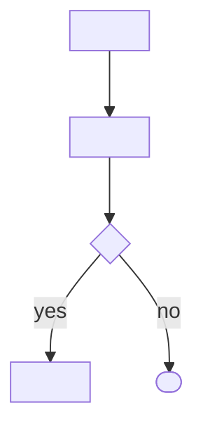
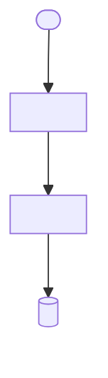

# <Project Name> — Context

> **TL;DR**: <what the product is · primary audience · one line>. The ONE vault doc of the v8 lite lane: flows (Mermaid + DoD), data model (DBML), constraints (NFR), open questions — every claim cites PRD §<X.Y>.
> **Read when**: you implement a unit (units cite `context_source: context.md#<anchor>`), review a flow, or resolve an OQ.

> **Note**: placeholders shown in English. At runtime, render prose in the PRD's language (Tier-1 tokens stay English).

<!-- HARD-HEADER CONTRACT (v8 layout-3): the four H2 anchors `## Flows`,
     `## Data model`, `## Constraints`, `## Open Questions` are EXACT strings —
     derive-vault-json.sh / derive-claims-ledger.sh exit 2 naming the missing
     one. `## Decisions` and `## Overview` are OPTIONAL: present ONLY when the
     source carries them (an architect's D-NNN record; a PRD Background). NEVER
     write `## Architecture`, `## Glossary`, `## Sources`, `## Last updated`,
     `## Phase context`, `## Source documents` — zero readers, killed in v8
     (spec 2026-09-10 §2). An H2 is a section BOUNDARY: any sub-grouping inside a
     section (flow types, entity descriptions, NFR classes) uses H3/H4, never H2.
     Section grammar is byte-identical to layout-2 (_lib/vault_md.py). -->

## Overview

> OPTIONAL — only when the PRD has a Background / Goals section, ≤ 10 lines,
> quoting the PRD (`PRD §<X>`). The DOCS lane (FSD §1/§2, PRD §1/§3) reads the
> PRD file directly, so this section is a courtesy, never a source of truth.
> Delete the whole section when the PRD has no such content.

## Flows

> Every user / system / cross-cutting flow, each ONE `### F-<prefix>-NNN:` H3
> (prefix decides the type: `F-U-` user · `F-S-` system · `F-C-` cross-cutting ·
> `F-P-` pipeline · `F-X-` custom — NO H2 sub-groups). Body = Mermaid diagram +
> Definition of Done + `**Source**: PRD §<X.Y>`; the flow body is NEVER a prose
> numbered list (Mermaid-flows hard rule; quote every node text per
> `plugins/mega-sdd/references/mermaid-emission-rules.md`). SIT/UAT derive 1:1
> from these — completeness matters more than terseness here.

### F-U-001: <flow name>

**Actor / Trigger**: <persona, or "scheduled cron at HH:MM", or "external API call">

**Flow**:


<!-- staged-only: multi-step workflows (wizard, maker→checker) keep the KB's
     `stages:` block VERBATIM + the stateDiagram-v2 + `**_kb_source**:` line —
     the layout-2 flows.md rules apply unchanged (validate-vault-flow-staging.sh). -->

**Definition of Done**:
- [ ] <observable behavior 1>
- [ ] <observable behavior 2>
- [ ] <data state change>

**Figma reference** (if applicable): <frame-name>
**Source**: PRD §<X.Y>

### F-S-001: <system flow name>

**Trigger**: <cron / event / manual>
**Inputs**: <what data the system reads>

**Flow**:


**Outputs**: <what data is written / emitted>

**Definition of Done**:
- [ ] <observable behavior>
- [ ] <data outcome>

**Source**: PRD §<X.Y>

## Data model

> DBML only. The `// Purpose:` comment above each `Table` is machine-read into
> vault.json `entities[].purpose` (derive-vault-json.sh). Entities the PRD
> names but does not define → one OQ (`[origin: context.md#Data-model]`),
> never an invented schema.

```dbml
// Purpose: <1 line — what this entity is for>
Table <entity_name> {
  id bigint [pk, increment]
  <field> <type> [<constraints>, note: '<purpose>']
  created_at timestamp [default: `now()`]
  updated_at timestamp
}

Ref: <table>.<fk_field> > <other_table>.id  // many-to-one
```

<!-- compact-skip -->
### <entity_name>

- **Purpose**: <1 line>
- **Key fields**: `<field>` — <type, why it exists>
- **Relations**: belongs to `<other_entity>` via `<fk>`
<!-- /compact-skip -->

### Schema constraints

- **Uniqueness**: `<table>.<field>` unique within `<scope>`
- **Indexes**: `<table>(<field>)` for `<query pattern>`

> Only constraints with an explicit source or a confirmed project convention.

## Constraints

> Technical / business / regulatory / NFR — every bullet and row cites its
> source. A target the PRD does not state is an OQ, never a defaulted SLO.

### Technical constraints

- **Stack lock-in**: <e.g. "Must use Laravel 11 — existing org standard"> — PRD §<X>
- **Integration boundaries**: <e.g. "Must consume legacy SOAP service at `<endpoint>`"> — PRD §<X>

### Business constraints

- **Timeline**: <hard deadlines and their reason> — PRD §<X>
- **Regulatory / compliance**: <e.g. "OJK transaction logging", "PDP Law data residency"> — PRD §<X>

### Non-functional requirements

| Category | Requirement | Source |
|----------|-------------|--------|
| Performance | <e.g. "p95 API response < 300ms"> | PRD §<X> |
| Security | <e.g. "All PII encrypted at rest"> | PRD §<X> |

### Design system

> CONDITIONAL — appears only when Step 2 detection sets `HAS_TOKENS` /
> `HAS_A11Y` / `HAS_VOICE_BRAND` from a SOURCE (Figma variables, tokens file,
> PRD). Sub-blocks (Tokens / Accessibility / Voice & brand) only for true
> flags; NEVER from shape inference or prior knowledge; never default WCAG.

## Decisions

> OPTIONAL — only when the PRD / architect record carries a decision. Delete
> the section otherwise. Grammar identical to layout-2 `vault.md ## Decisions`.

### D-001: <decision title>

**Status**: accepted · **Decision**: <what> · **Consequences**: <what follows> · **Source**: PRD §<X>.

## Open Questions

> THE ONE AUTHORED OQ SURFACE (layout-3). Every Open Question lives HERE —
> derive-vault-json exits 2 on an OQ checkbox line found in any other section.
> Rules (unchanged from layout-2, `../../../generate-intent/references/vault-core.md §OQ-conventions`):
> - Tag prefixes stay TOPIC markers (OV/AR/DM/FL/DC/CN — no ID churn).
> - Every OQ that arose elsewhere carries `[origin: context.md#<anchor>]`
>   (`#F-U-001`, `#Data-model`, `#Overview`, …); constraints-native OQs need none.
> - `[tech / <scan|recommend|blocking>]` or `[business]` bracket is MANDATORY
>   (bracket-first is the only category source); `[conf: high|medium|low]` on tech.
> - business ⇒ `resolution_mode: blocking`; P1 business OQs are the ONLY items
>   of the single batched ask at the end of PLAN (W1). On `project_scale: xs`,
>   medium-priority OQs are BORN `**Deferred (plan)**:` (never asked, resurfaced
>   in the final report). Sort P1 → P2 → P3.

- [ ] **OQ-CN-1** [P1] [business]: <e.g. "Performance targets not specified in PRD">
- [ ] **OQ-FL-1** [P2] [business] [origin: context.md#F-U-001]: <e.g. "PRD describes happy path only — what happens when payment fails?">
- [ ] **OQ-AR-1** [P2] [tech / scan] [conf: high] [origin: context.md#Overview]: <e.g. "which test framework?" — resolve: scan symbol-index §test_frameworks>
