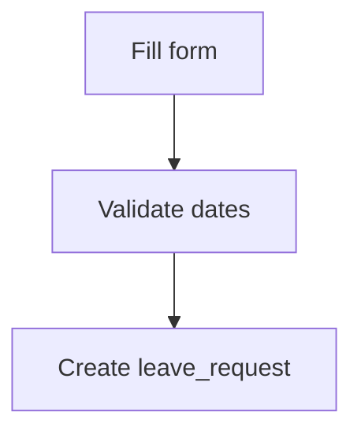
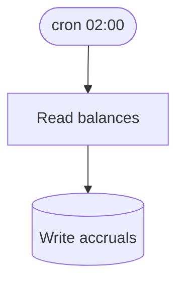

# Flows

## User flows

### F-U-001: Submit leave request

**Flow**:

**Definition of Done**:
- [ ] request row created
- [ ] manager notified
- [x] audit written

**Source**: PRD §3.1 (AC1-1, AC1-2, AC1-2)

## System flows

### F-S-002: Nightly accrual

**Flow**:

**Definition of Done**:
- [ ] balances updated

**_kb_source**: [20-workflows/accrual.md]
**Source**: PRD §4
