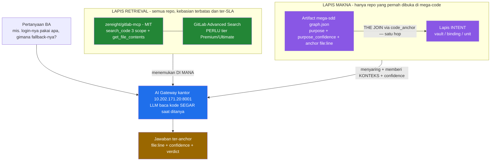

# Code intelligence untuk tim BA — riset kandidat, batas fundamental, dan arsitektur yang direkomendasikan

**Tanggal:** 2026-08-21

**Konteks bisnis (dari user):** *"data dari source code yg lewat mega-code dan mega-sdd akan menjadi bahan analisa oleh team BA ketika membuat PRD. jadi team BA tidak akan ngawang lagi — fungsinya udah ada atau belum, dan akan seperti apa implementasinya. ini nanti akan menjadi penghubung antara PRD dan skills mega-sdd."*

**Constraint keras:** jaringan **air-gapped** / internal bank — tidak ada SaaS, tidak ada kode keluar dari bank, tidak boleh bergantung paid key eksternal. SCM = **GitLab self-hosted**.

**Pertanyaan yang dijawab riset ini:**
1. Apakah data graph mega-sdd bisa jadi *source knowledge* untuk pertanyaan BA (mis. *"di BE ini login-nya pakai apa? LDAP kah?"*)?
2. Kalau belum cukup — apakah gateway baca langsung ke GitLab lebih feasible?
3. Adakah MCP server / tool self-hosted yang bisa baca repo Git dan ditanam ke AI?

---

## Provenance & keterbatasan dokumen ini

> **Cara riset:** 5 laporan riset paralel (2026-08-21) yang membaca dokumentasi resmi, file `LICENSE` upstream, source code di GitHub, dan satu paper akademis (PDF dibaca langsung). Dokumen ini adalah **rekonsiliasi verdict** dari laporan-laporan itu, dengan setiap angka ditarik ulang dari transkrip riset aslinya.
>
> **Yang HARUS diketahui pembaca:**
> - Semua fakta di bawah adalah kondisi per **Agustus 2026**. Versi, tier, dan lisensi berubah — verifikasi ulang sebelum jadi dasar pengadaan.
> - Tidak ada satu pun pengujian yang dilakukan **di instance GitLab kantor** — riset ini tidak punya akses ke sana. Semua yang menyangkut tier/kemampuan instance kalian berstatus **belum diuji**.
> - Item yang laporan aslinya tandai `UNVERIFIED` tetap ditandai di sini. Jangan naikkan statusnya diam-diam.

---

## 0. TL;DR — verdict

### Temuan utama yang mengubah cara memilih

> **Semua MCP server GitLab yang ada di lapangan adalah *thin proxy* di atas REST search API GitLab itu sendiri. Tidak ada satu pun yang mengindeks kode sendiri — tanpa embedding, tanpa index lokal, tanpa GPU.**
>
> **Konsekuensinya: kemampuan pencarian kode adalah properti dari TIER instance GitLab kalian, bukan properti dari MCP server yang kalian pilih.**

Ini membalik cara pengambilan keputusan. Pertanyaannya bukan *"MCP server mana yang paling bagus?"* tapi ***"instance GitLab kantor tier apa?"***

### Arsitektur yang direkomendasikan — tiga lapis, jangan pilih satu tool

| Lapis | Tugas | Rekomendasi | Status |
|---|---|---|---|
| **Retrieval** | menemukan *di mana* kodenya, untuk **semua** repo | `zereight/gitlab-mcp` (MIT) di atas **GitLab Advanced Search** | ⚠️ butuh tier **Premium/Ultimate** — **uji dulu** |
| **Makna** | *apa fungsinya, untuk apa, seberapa yakin* | artifact mega-sdd (`graph.json` layer `symbol`) | ✅ **sudah jalan (v6.20.0)** |
| **Jawaban** | LLM baca kode segar saat ditanya | AI gateway kantor (`10.202.171.20:8001`) | ✅ **sudah ada** |

**Prinsipnya:** ***pre-compute peta-nya, recompute makna-nya.***
Jangan menyimpan prosa jadi ("cara kerja fallback login adalah X") sebagai sumber kebenaran — prosa itu basi tanpa ketahuan (§1b, terukur). Simpan **peta + anchor + confidence**, biar LLM membaca kode aslinya saat ditanya.

### Satu tes yang harus dijalankan sebelum mendesain apa pun

> Di instance GitLab kantor: **apakah pencarian kode se-instance (`search_code`, scope `blobs`) mengembalikan hasil?**
>
> Kalau instance-nya **Free/CE**, Advanced Search tidak tersedia dan pencarian terbatas pada basic search di dalam project satu per satu — seluruh proposisi nilainya menyusut jadi *fetch file per-repo + tree walk*.

---

## 1. Batas fundamental — kenapa indexer mekanis tidak akan pernah cukup

Ini temuan paling penting dan paling sering diabaikan saat memilih tool.

### 1a. Analisis statik tidak sampai ke pertanyaan BA

**Sumber primer (PDF dibaca langsung):**
Antoniadis, Filippakis, Krishnan, Ramesh, Allen, Smaragdakis — **"Static Analysis of Java Enterprise Applications: Frameworks and Caches, the Elephants in the Room"**, *PLDI 2020*, hlm. 794–807.
📄 https://yanniss.github.io/enterprise-pldi20.pdf

Kutipan verbatim §1 dan §5.1:

> *"Running Soot, WALA, or Doop out of the box on a realistic Java enterprise application yields virtually zero coverage of the application code, or fails to scale."*

> *"JackEE's analysis averages in-app reachability of **58.04%**, while dropping to no less than 43.48% (for alfresco). In comparison, **Doop averages 14.48% in-app coverage** while dropping to approximately **1.8%** and **0.0%** coverage for two benchmarks (alfresco and pybbs respectively). Both alfresco and pybbs define entry points (and then further functionality) via framework-specific mechanisms—to which Doop is oblivious. Alfresco has both XML-configured entry points and a custom Spring-based REST API. **The entry points of pybbs are given using Spring annotations.** Both applications then use annotations for dependency injection."*

**Baca angkanya dengan benar** (ini sering salah dikutip):

| Analyzer | Rata-rata jangkauan kode aplikasi | Kasus terburuk |
|---|---|---|
| **Doop** (analyzer umum, state-of-the-art) | **14,48%** | **0,0%** (pybbs — entry point via anotasi Spring) |
| **JackEE** (kontribusi paper — sadar framework) | **58,04%** | 43,48% (alfresco) |
| Soot / WALA | ~nol tanpa definisi entry point manual | — |

**Implikasinya:**
- Analyzer generik **gagal total** pada aplikasi dengan entry point berbasis anotasi (Spring — dan secara analogi, routing/DI Laravel).
- Bahkan analyzer yang **sengaja dibuat sadar-framework** hanya mencapai **58%** — itu pun setelah memodelkan framework-nya satu per satu.
- Contoh yang dipakai paper itu literally `AuthenticationProvider` — kelas yang persis jadi jawaban pertanyaan *"login-nya pakai apa?"*

**Kesimpulan arsitektur:** pemahaman kode **wajib** melibatkan LLM yang membaca kode. Ini **memvalidasi** layer `purpose` + `purpose_confidence` di v6.20.0 — itu bukan hiasan, itu satu-satunya jalan menuju pertanyaan *"bagaimana"*.

### 1b. Prosa penjelasan basi tanpa terdeteksi

**Sumber primer:** arXiv:2212.01479 (studi >3.000 project) — https://arxiv.org/abs/2212.01479

| Metrik | Angka |
|---|---|
| Referensi elemen kode usang di dokumentasi bertahan rata-rata | **4,7 tahun** (top-1000 project GitHub) / **4,2 tahun** |
| Project populer yang **saat ini** membawa minimal satu referensi usang | **28,9%** |
| Project yang **pernah** membawa referensi usang | **82,3%** |

⚠️ **Dan itu adalah kasus deteksi paling mudah** — di mana elemen kode yang dirujuk sudah **dihapus seluruhnya**. Klaim prosa seperti *"LDAP adalah jalur auth utama, dengan fallback ke DB saat koneksi gagal"* tidak punya elemen yang bisa hilang, jadi kebasiannya **tidak terdeteksi sama sekali**.

**Asimetri yang menentukan:**

| Pendekatan | Sifat kebasian |
|---|---|
| **Prosa hasil analisa (pre-computed)** | **tak terbatas dan tak terlihat** |
| **Index mekanis** | **terbatas dan terukur** — bisa dimonitor, dialarmkan, dan ditulis di SLA |

**Konsekuensi:** kontrak `source_hashes` + `git_head` di artifact mega-sdd bukan formalitas — itu satu-satunya mekanisme yang membuat kebasian **terdeteksi**. Dan ini alasan kuat untuk **tidak** menyimpan prosa jadi sebagai jawaban.

### 1c. Tapi index tetap perlu — datanya jelas

Sisi index mempublikasikan angka; sisi anti-index mempublikasikan analogi:

| Bukti | Angka |
|---|---|
| Sourcegraph — Precision@5 | grep-only **0,140** vs indexed **0,478** |
| CoIR benchmark | BM25 **29,79** vs dense **56,26** |
| Cursor — akurasi agent pada repo 1.000+ file | **+12,5%** dengan semantic index |

Cursor sendiri membingkainya sebagai **pelengkap, bukan pengganti** — sama dengan posisi dokumen ini.

---

## 2. Peta kandidat

### 2a. MCP server GitLab (lapis retrieval)

| Server | Lisensi | Pencarian kode | Read-only mode | GPU / API eksternal | Verdict |
|---|---|---|---|---|---|
| **`zereight/gitlab-mcp`** | **MIT** | ✅ **tiga scope: instance / group / project** | ✅ `GITLAB_PERMISSION_MODE=readonly` | ❌ tidak ada — hanya butuh **GitLab PAT** | ⭐ **REKOMENDASI UTAMA** |
| `jmrplens/gitlab-mcp-server` | MIT | ⚠️ **UNVERIFIED** — arsitektur find/execute atas 850+ action terkonfirmasi, tapi action blob/code-search **tidak** terkonfirmasi | ✅ | ❌ | Cadangan; verifikasi dulu |
| **MCP server resmi GitLab** (`/api/v4/mcp`) | bundled | `semantic_code_search` ada | — | ⚠️ butuh stack inferensi | ❌ **GAGAL** — lihat §2b |
| `github/github-mcp-server` | MIT | ✅ | — | ❌ | Tidak relevan (GitHub-only) |

**Catatan kejujuran:** field pihak ketiga ini **sangat kecil**. Di luar `zereight` (~1.9k star), semuanya angka dua digit — jadi "terbaik berdasarkan star" itu melebih-lebihkan keadaan.

**Kenapa `zereight/gitlab-mcp` menang:**
- Satu-satunya dengan **pencarian kode tiga scope** (instance / group / project) di seluruh lapangan.
- Punya **read-only mode** — yang pasti diminta bank.
- Paling terawat di kelasnya (README menyebut 217 tool; perlakukan sebagai "200+", jumlah baris tidak dihitung ulang).
- MIT, tanpa key berbayar, tanpa GPU, tanpa panggilan keluar. Hanya bicara ke instance GitLab kalian.
- **what/where saja** — bukan how/why. (Itulah kenapa lapis makna & lapis jawaban tetap dibutuhkan.)

### 2b. Kenapa MCP server **resmi** GitLab gagal — ini koreksi penting

Sempat diperkirakan opsi ini akan mendominasi (ikut di dalam produk, tidak ada pihak ketiga yang perlu di-vet). Badge dokumentasinya juga menjanjikan: **`Tier: Free, Premium, Ultimate`**, `Offering: GitLab.com, Self-Managed, Dedicated`, `Status: Beta` — dengan 31 tool termasuk `get_repository_file`, `search`, `semantic_code_search`.

**Tapi prasyaratnya mematikan opsi ini untuk bank air-gapped.** Verbatim dari dokumentasi:
> *"Set GitLab Duo availability to **Always on** or **On by default**"*, *"Turn on beta and experimental features"*, *"Allow access to the MCP server."*

Lalu:

| Jalur | Konsekuensi |
|---|---|
| **Duo air-gapped** → butuh **GitLab Duo Self-Hosted** | Transfer manual **image AI Gateway + bobot model LLM + image server inferensi vLLM** ke infrastruktur internal, **DAN** butuh **GitLab Ultimate + add-on Duo Enterprise** |
| **Duo non-offline** | Butuh egress keluar ke `duo-workflow-svc.runway.gitlab.net:443` — **dilarang oleh air gap** |

Dan `semantic_code_search` sendiri di-gate di balik **`Add-on: GitLab Duo Core, Pro, atau Enterprise`**.

> **Verdict riset: add-on berbayar + stack inferensi GPU, atau internet keluar. Gagal di dua-duanya. Turunkan jadi catatan kaki — kecuali bank sudah memiliki Ultimate + Duo Enterprise.**

📌 **Catatan tambahan yang penting:** *pencarian semantik ("how/why") tidak tersedia dalam bentuk gratis, air-gapped, tanpa paid key — di seluruh lapangan.* Satu-satunya tool semantik yang ada adalah `semantic_code_search` milik GitLab, dan itu di balik Duo. **Kemampuan semantik harus datang dari agent yang membaca file**, bukan dari pencarian MCP server.

### 2c. Gate tier GitLab — angka yang menentukan

> **Pencarian kode se-instance (`search_code`, scope blob) membutuhkan GitLab Advanced Search**, yang ber-**`Tier: Premium, Ultimate`**.
> 📄 https://docs.gitlab.com/user/search/advanced_search/
>
> Pada **Free/CE**, dokumentasi mengindikasikan pencarian terbatas pada basic search **di dalam project individual**.

### 2d. Kandidat lain (lapis retrieval / Q&A)

| Tool | Lisensi | Air-gap | GPU / API eksternal | what-where vs how-why | Verdict |
|---|---|---|---|---|---|
| **Serena** | **MIT** (v1.7.0, 2026-08-09, ~28.289 star) | ✅ **sepenuhnya lokal** | ❌ berbasis **LSP** — tanpa embedding, tanpa vector DB, tanpa API key | **what/where** (level simbol: find symbol, refs, edit). "Semantik"-nya adalah semantik LSP, **bukan** natural language | ✅ **Layak** untuk navigasi simbol lokal |
| **Onyx** | core **MIT** (`ee/` terpisah) | ✅ | lihat §2f | punya chat UI sendiri | ⚠️ Layak **dengan 4 caveat** — §2f |
| **claude-context** (Zilliz) | MIT | ✅ dengan Milvus self-hosted | butuh endpoint embedding: `OPENAI_BASE_URL` ke gateway bank **atau** Ollama lokal (`nomic-embed-text`) | how/why (RAG) | ⚠️ **Risiko perawatan** — jeda commit ~5 minggu (push terakhir 2026-07-14). Default README pakai **Zilliz Cloud (SaaS)**, wajib diganti Milvus standalone |
| **Sourcebot** | root **FSL**; `ee/` Enterprise License | ✅ | Index+search: tidak. AI: butuh LLM (bisa endpoint internal) | **keduanya** | ❌ **DICORET** — §2e |
| **Khoj** | — | — | — | — | ❌ **DICORET** — nol dukungan GitLab; connector GitHub hardcoded ke `api.github.com`; upstream tidak dirawat |
| OpenGrok / GNU GLOBAL (GPL-3, v6.7) / cscope / SCIP / stack-graphs | beragam | ✅ | ❌ | **what/where saja** | Kena batas §1a. cscope mati sejak 2018; stack-graphs di-arsipkan; SCIP adalah format, bukan produk |

### 2e. Kenapa Sourcebot dicoret (koreksi dari rekomendasi awal)

Sourcebot sempat masuk kandidat serius karena integrasi GitLab-nya paling matang (v5.1.8, 2026-08-19; 3.896 star; Zoekt + Postgres + Redis; Docker Compose / Helm).

**Dua temuan yang mematikannya untuk pemakaian internal komersial tanpa paid key:**

1. **MCP server-nya ada di dalam `ee/`.** File-nya di `packages/web/src/ee/features/mcp/server.ts` — folder `ee` punya file lisensi terpisah (`ee/LICENSE`, Enterprise License). Root-nya FSL (boleh internal), **`ee/` tidak**. Fitur yang justru kita butuhkan — `ask`, `mcp`, `code-nav` — semuanya di sana.
2. **Mekanisme service ping.** Verbatim dari https://docs.sourcebot.dev/docs/activating-a-subscription:
   > *"**Your Sourcebot deployment must be able to send a Service Ping to validate your Activation Code. If your deployment is unable to send a service ping for 7 days it will downgrade to the free plan until a successul ping is sent.**"*

   Ping-nya ke `https://deployments.sourcebot.dev/ping` port 443 — **justru menyasar deployment tanpa egress**, persis kondisi jaringan bank.

Paket npm `@sourcebot/mcp` diperlakukan sebagai **ditinggalkan/digantikan** oleh MCP server `ee` di dalam aplikasi.

### 2f. Onyx — verifikasi lisensi lolos, tapi connector-nya punya 4 masalah nyata

**Kabar baik — lisensi `ee/` TIDAK memblokir kita (terverifikasi di source):**

Verbatim dari `billing/overview.mdx`:
> *"Onyx's core features — **connectors, AI chat, agents, search**, and more — are free and open-source."*

Mekanismenya (ini bagian yang load-bearing): `LICENSE_ENFORCEMENT_ENABLED` default `"true"`, jadi kode EE **ter-load** di deploy standar tapi fitur-nya di-gate saat runtime — *"Without a license this deployment behaves as Community Edition."* Instance yang **tidak pernah dilisensi** **tidak** diblokir:
> *"No license in cache OR database = never subscribed. … Here we just keep the request flowing — community-tier paths remain accessible."*

`GATED_ACCESS` (blokir semuanya) **hanya** berlaku untuk lisensi yang **kedaluwarsa**, tidak pernah untuk yang tanpa lisensi. Path yang di-gate (`PATH_PREFIX_MIN_TIER`) adalah `/admin/query-history`, `/analytics/admin`, `/admin/api-key`, `/admin/enterprise-settings`, `/manage/admin/user-group` (Business) dan `/scim`, `/admin/hooks`, `/admin/token-rate-limits`, `/admin/log-export`, `/evals`, `/gateway` (Enterprise).

> ✅ **`/admin/connectors`, `/chat`, `/search` tidak ada dalam daftar → "No match → pass."**
> Dan **SSO/SAML TIDAK berbayar** — *"SAML works on the standard Onyx images."* (kartu marketing EE-nya basi).

**Kabar buruk — connector GitLab-nya bermasalah untuk kasus kita (semua diverifikasi di source `gitlab/connector.py`):**

| Masalah | Dampak |
|---|---|
| `GITLAB_CONNECTOR_INCLUDE_CODE_FILES` **default `false`**, dibaca dari env saat import | **Env var global di container indexing, BUKAN toggle per-connector** → all-or-nothing untuk semua connector GitLab |
| **Per-project saja** (`project_owner`/`project_name`) | **Tidak ada crawl level group — satu connector per repo.** Ini masalah operasional besar untuk "semua repo" |
| Tanpa batas ukuran, tanpa filter biner (fallback decode `latin-1`) | Biner & direktori vendor terindeks jadi sampah |
| File kode diberi `doc_updated_at=datetime.now()` | **Merusak semantik polling inkremental untuk kode** |
| Dokumentasinya **tidak pernah menyebut file kode** | Docs hanya bilang *"picks up all of the Merge Requests and Issues"* — kemampuan kode ini efektif tidak terdokumentasi |

Hanya 4 exclude yang hardcoded: `logs`, `.github/`, `.gitlab/`, `.pre-commit-config.yaml`. GitLab self-hosted sendiri jalan (`gitlab.Gitlab(credentials["gitlab_url"], private_token=…)`).

> **Verdict Onyx:** pakai **hanya jika** kalian butuh **UI chat terpisah untuk BA** dan siap menerima biaya operasional "satu connector per repo". Kalau tidak, `zereight/gitlab-mcp` + gateway yang sudah ada lebih murah.

---

## 3. Kesegaran data — koreksi ekspektasi "update tiap commit"

| Sistem | Mekanisme | Kebasian realistis |
|---|---|---|
| **GitLab Zoekt** | **inkremental saat ada perubahan** | mendekati real-time |
| Sourcegraph | poll + fetch + poll indexserver + build | **45 detik – 8 jam** |
| SCIP | auto-index | **lantai 24 jam** |
| Cursor (sebagai pembanding desain) | **Merkle tree** hash file, cek divergensi tiap **~10 menit**, re-embed hanya file yang berubah | ~10 menit |

**Yang harus dikomunikasikan ke tim BA:** kebasian index itu **nyata, tapi terbatas dan bisa di-SLA-kan**. Bandingkan dengan kebasian prosa yang **tak terbatas dan tak terlihat** (§1b) — itulah alasan arsitekturnya seperti di §7.

**Cold start** juga nyata. Cursor mengakui: *"large repositories with tens of thousands of files can take hours to process if indexed naively, and semantic search isn't available until at least 80% of that work is finished."*

**Ukuran index** (untuk perencanaan kapasitas):

| Ukuran chunk | Multiplier terhadap ukuran source |
|---|---|
| ~1.500 token | **1,0 – 1,2×** |
| 300–500 token (tipikal chunking sadar-AST untuk kode) | **3 – 4×** |

Multiplier ini sensitif terhadap ukuran chunk — dan chunk kecil justru yang disukai retrieval kode.

---

## 4. Kelemahan pendekatan mega-sdd sendiri (harus dinyatakan terbuka)

> **Cakupan data kita bergantung pada aktivitas manusia.**
> Publisher berjalan di **Stop-hook** dari sesi yang dikelola mega-code. Repo yang **tidak pernah dibuka** di Claude Code menghasilkan **nol data**. BA yang bertanya soal backend yang belum pernah disentuh siapa pun akan mendapat jawaban kosong.

Ini argumen terkuat kenapa **artifact mega-sdd tidak bisa berdiri sendiri** untuk kebutuhan BA — dan kenapa lapis retrieval (§2a) wajib ada di sampingnya, karena lapis itu meng-cover **semua** repo tanpa menunggu ada orang membukanya.

Sebaliknya, lapis retrieval juga tidak bisa berdiri sendiri, karena kena batas §1a.

---

## 5. Apa yang **sudah** bisa dijawab hari ini (mega-sdd v6.20.0)

Dari uji nyata pada satu project Laravel yang baru tahap scan (belum punya vault):

- **0 node → 244 node / 154 symbol** setelah rilis v6.20.0.
- Artifact sampai ke gateway kantor (HTTP 200).

**Bisa menjawab (pertanyaan "apa & di mana"):**
- *"Login-nya pakai apa?"* → LDAP + OAuth + Fortify + Sanctum, lengkap dengan anchor `file:line`.
- 154 `purpose` fungsi, 130 route, 411 baris public interface.

**Belum bisa menjawab (pertanyaan "bagaimana & kenapa"):**
- *"Gimana logika fallback-nya kalau LDAP down?"*
- *"Server LDAP-nya dikonfigurasi ke mana?"*

**Dua gap yang teridentifikasi:**
1. Controller dan route **belum** menjadi node `symbol` — layer code baru mencakup kategori `helpers`, `model_api`, `services`, `commands`. *(Kandidat v6.21.0: tipe node `route` + `interface`, supaya pertanyaan BA "sudah ada endpoint approval belum?" jadi satu query.)*
2. Project itu belum punya KB/vault — jadi lapis *intent* masih kosong; yang ada baru lapis *code*.

### Kekuatan struktural yang sudah ada: THE JOIN

Layer vault (apa yang **dimaksud**) dan layer code (apa yang **ada**) bertemu di node `code_anchor` — **satu hop**. Ini yang membuat pertanyaan lintas-lapis seperti *"unit mana yang menyentuh file autentikasi ini?"* bisa dijawab.

> **Tidak ada satu pun kandidat pihak ketiga di §2 yang punya lapis *intent* sama sekali.** Itu bukan fitur yang bisa dibeli — itu keluaran proses SDD.

---

## 6. Rekomendasi arsitektur

**Kenapa bentuknya begini:**
- **Lapis retrieval** menutup kelemahan §4 (cakupan bergantung aktivitas manusia) — dia melihat semua repo.
- **Lapis makna** menutup batas §1a (index mekanis tidak sampai ke "bagaimana") — dia membawa `purpose` + `confidence` hasil bacaan LLM, plus lapis intent yang tidak dimiliki tool mana pun.
- **Lapis jawaban** menutup §1b (prosa jadi = basi tak terdeteksi) — jangan sajikan prosa yang ditulis duluan; biarkan agent membaca kode segar, pakai retrieval untuk menemukan tempatnya dan makna untuk menyaringnya.

---

## 7. Yang harus diuji / diputuskan dulu

| # | Item | Pemilik | Blocking? |
|---|---|---|---|
| 1 | **Tier instance GitLab kantor.** Uji langsung: apakah `search_code` scope `blobs` se-instance mengembalikan hasil? Kalau Free/CE → Advanced Search tidak ada, nilainya menyusut jadi fetch per-repo | tim infra / GitLab admin | ✅ **ya — menentukan seluruh arsitektur** |
| 2 | Apakah bank **sudah memiliki** Ultimate + add-on Duo Enterprise? Kalau tidak, MCP server resmi GitLab jadi catatan kaki | tim infra | ✅ ya |
| 3 | Deploy `zereight/gitlab-mcp` dengan `GITLAB_PERMISSION_MODE=readonly` + PAT scope terbatas; uji `search_code` tiga scope | tim gateway | tidak |
| 4 | Kalau butuh UI chat terpisah untuk BA: PoC **satu repo** dengan Onyx, sadar penuh 4 caveat connector di §2f (terutama **satu connector per repo**) | tim gateway + infra | tidak |
| 5 | Repo non-bank (`gitlab.com/sunny-go/laravel-recon-2026`) artifact-nya sekarang ada di dalam gateway bank — dibiarkan atau minta purge? | user | tidak |
| 6 | Sosialisasi ekspektasi kesegaran ke tim BA (§3) — kebasian index itu wajar, terbatas, dan bisa di-SLA-kan | user / tim gateway | tidak |
| 7 | Verifikasi ulang action code-search `jmrplens/gitlab-mcp-server` **sebelum** dijadikan cadangan (status `UNVERIFIED`) | tim gateway | hanya kalau #3 gagal |

---

## 8. Koreksi terbuka terhadap rekomendasi sebelumnya

Dicatat supaya tidak ada yang membangun di atas premis yang sudah dicabut:

| Pernyataan awal | Koreksi |
|---|---|
| *"GitLab MCP resmi = prioritas tertinggi untuk diuji; kalian mungkin sudah punya barangnya"* | **DIBALIK.** Riset aslinya **menolak** opsi ini: `semantic_code_search` di balik add-on Duo; Duo air-gapped butuh Ultimate + Duo Enterprise + transfer manual bobot model + vLLM; Duo non-offline butuh egress. **Turunkan jadi catatan kaki.** Yang naik jadi prioritas adalah **tier Advanced Search**, bukan MCP resminya. |
| *"Analisis statik terbaik hanya mencapai 14,48%"* | **DIKOREKSI.** 14,48% adalah rata-rata **Doop** (baseline). Analyzer sadar-framework (**JackEE**) mencapai **58,04%**. Angka **0,0%** adalah Doop pada pybbs (entry point anotasi Spring). Argumennya tetap berdiri, tapi angkanya harus benar. |
| *"Onyx membundel `nomic-embed-text-v1` di dalam image, tanpa GPU, 4 vCPU/16 GB"* | **DICABUT — salah atribusi.** `nomic-embed-text` berasal dari temuan **claude-context (Zilliz)** via Ollama, bukan Onyx. Angka 4 vCPU/16 GB tidak terverifikasi di sumber mana pun. **Jangan dipakai.** |
| *"Perlu pemeriksaan kebijakan terhadap `ee/` Onyx"* | **DIPERKUAT jadi hasil verifikasi.** Sudah diperiksa di source: `/chat`, `/search`, `/admin/connectors` **tidak** di-gate; instance tanpa lisensi = Community tier, tidak diblokir; SAML gratis. Yang justru jadi masalah adalah **connector GitLab-nya** (§2f), bukan lisensinya. |
| *"Sourcebot kandidat serius"* | **DICABUT.** MCP server-nya di `packages/web/src/ee/features/mcp/server.ts` = di dalam `ee/` (Enterprise License, bukan FSL root). Plus downgrade 7-hari tanpa service ping. |
| *"Semua kandidat polling ~1 jam"* | **DIKOREKSI.** GitLab Zoekt **inkremental saat ada perubahan**; Sourcegraph 45 detik–8 jam; SCIP lantai 24 jam. Rentangnya jauh lebih lebar dari "~1 jam". |
| *"Pilih satu tool"* | **DIREVISI.** Kemampuan pencarian kode adalah properti **tier GitLab**, bukan properti MCP server. Pilih tier dulu, tool belakangan. |
| *"Sajikan prosa penjelasan hasil analisa"* | **DIREVISI.** Prosa jadi = basi tanpa terdeteksi (4,7 tahun, dan itu kasus termudah). Simpan peta + anchor + confidence; recompute makna saat ditanya. |

---

## 9. Item yang laporan aslinya tandai UNVERIFIED

Jangan naikkan statusnya tanpa pengujian:

- Perilaku `search_project_code` pada GitLab **Free/CE** (pencarian blob dalam satu project).
- Action code/blob search pada `jmrplens/gitlab-mcp-server`.
- Keberadaan code search pada `yoda-digital`.
- Tanggal aktivitas terakhir `mcpland` dan `ttpears`.
- Semua jumlah star = perkiraan sebagaimana ditampilkan.
- Throughput embedding claude-context pada monorepo besar — tidak ada benchmark di dokumentasi.
- Metadata npm: `npmjs.com` mengembalikan HTTP 403; nama/versi/lisensi paket diambil dari registry API.

---

## 10. Non-goals riset ini

- Tidak mengevaluasi **biaya lisensi komersial** (GitLab Ultimate, Duo Enterprise, Sourcebot EE) — angka harga tidak diverifikasi.
- Tidak melakukan **benchmark kualitas jawaban** antar-tool — belum ada dataset pertanyaan BA nyata untuk diuji.
- Tidak menguji apa pun **di instance GitLab kantor** — tidak ada akses dari sisi riset ini.
- Tidak membahas **retensi / kebijakan data** artifact di sisi gateway — itu domain tim gateway.

---

## Lampiran — sumber primer

**Akademis**
- Antoniadis, Filippakis, Krishnan, Ramesh, Allen, Smaragdakis — *"Static Analysis of Java Enterprise Applications: Frameworks and Caches, the Elephants in the Room"*, **PLDI 2020**, hlm. 794–807 — https://yanniss.github.io/enterprise-pldi20.pdf
- Studi kebasian dokumentasi (>3.000 project) — **arXiv:2212.01479** — https://arxiv.org/abs/2212.01479

**GitLab**
- Advanced Search (tier Premium/Ultimate) — https://docs.gitlab.com/user/search/advanced_search/
- MCP server — https://docs.gitlab.com/user/model_context_protocol/mcp_server/
- MCP server tools (`semantic_code_search`, gate Duo) — https://docs.gitlab.com/user/model_context_protocol/mcp_server_tools/
- Duo Self-Hosted + deployment offline — https://docs.gitlab.com/administration/gitlab_duo_self_hosted/offline_deployment/

**MCP server**
- `zereight/gitlab-mcp` — https://github.com/zereight/gitlab-mcp
- `jmrplens/gitlab-mcp-server` — https://github.com/jmrplens/gitlab-mcp-server
- `github/github-mcp-server` — GHES: flag `--gh-host`; caveat `GET /search/code` (default branch saja, file < 384 KB, minimal satu search term)

**Tool**
- Onyx — https://github.com/onyx-dot-app/onyx (`backend/onyx/connectors/gitlab/connector.py`, `configs/app_configs.py`, `ee/onyx/configs/license_enforcement_config.py`)
- Serena — https://github.com/oraios/serena (MIT, v1.7.0 2026-08-09)
- Sourcebot — https://docs.sourcebot.dev/docs/activating-a-subscription · https://docs.sourcebot.dev/docs/misc/service-ping
- claude-context (Zilliz) — dokumentasi `docs/getting-started/environment-variables.md`

**Dokumen internal terkait**
- `docs/mega-sdd/gateway-mcp-guide.md`
- `docs/mega-sdd/keputusan-arsitek-gateway.md`
- `docs/superpowers/specs/2026-08-21-graph-code-layer.md`
