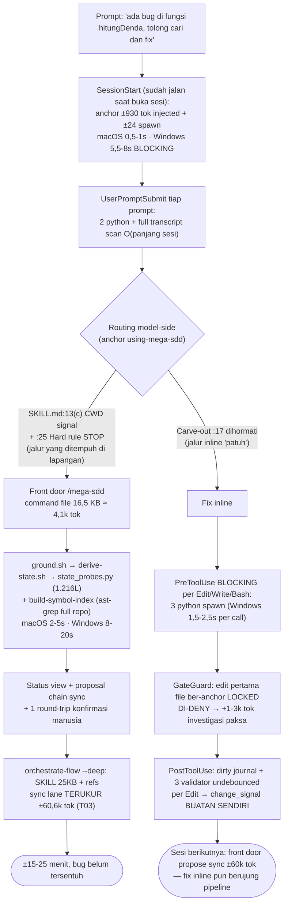

# v7 Diet Audit — Fase 0 (read-only baseline)

**Tanggal:** 2026-08-21 · **Versi diaudit:** v6.20.0 (`ae1fa3e`) · **Status:** MENUNGGU APPROVAL GATE FASE 0
**Prompt sesi:** [`research/2026-08-21-v7-diet-prompt.md`](2026-08-21-v7-diet-prompt.md)

**Metode.** Reachability map dihitung deterministik (grep basename per file, 132 target, search space = skills/commands/agents/hooks/scripts/references/tests/CLAUDE.md/README.md di dalam `plugins/mega-sdd/`), lalu 11 agent audit paralel membaca KONTEKS tiap mention (mention ≠ call) untuk memisahkan eksekusi nyata vs prose. Nol file diedit; nol script plugin dieksekusi. Data mentah: reachability.tsv + caller-detail.txt (scratchpad sesi) + hasil per-cluster JSON.

> **Caveat data (penting untuk Fase 2):** kolom test di reachability.tsv hanya menghitung `plugins/mega-sdd/tests/`. Repo punya **dua test tree** (root `tests/` + `plugins/mega-sdd/tests/`) — daftar hapus di §6 sudah di-re-grep terhadap root tree, tapi eksekusi Fase 2 wajib sweep KEDUANYA (standing lesson: main-CI-red).

---

## 0. Ringkasan eksekutif

| Dimensi | Baseline | Temuan |
|---|---|---|
| Script shell | **118 file / 36.341 baris** | 65 LOAD-BEARING · 41 CONVENIENCE · 7 ORPHAN · 5 DUPLICATE |
| Python `_lib` | **12 file / 3.905 baris** | 10/12 = shared-grammar moat (writer & gate wajib byte-identical); 1 DELETE (seeding_budget.py) |
| Hooks | **8 event + dispatcher / 4.073 baris** | Gate keyed ke **keberadaan `.mega-sdd/`**, bukan chain aktif; PostToolUse+Stop = early-warning layer (gate re-derive di PreToolUse tidak mempercayai state mereka) |
| Vault | **7 file** | 8 kelas duplikasi terpetakan; semua parser load-bearing ternyata pattern/fence-scoped, BUKAN filename-scoped → merge 7→3-4 mechanically feasible |
| Bug-hunt tax (BEFORE) | — | Jalur pipeline: **±30-65k token plugin + 15-25 menit** (match feedback lapangan ±20 mnt). Jalur inline "patuh" pun kena ±930 tok anchor + 9-14 dtk (macOS) / 1,5-3 mnt (Windows) spawn tax + GateGuard deny + sync tail ±60k tok |

**Rekomendasi angka (§6):** script 118 → **±85** (Tier A pasti) → **±78** (kalau Tier B disetujui); python 12 → **11**; vault 7 md → **3 md + vault.json** (varian 4-file diargumenkan); hooks tetap 8 event tapi internal dikurus + gate di-scope ke chain aktif (Fase 1).

**Temuan struktural terpenting (mengubah cara motong):**
1. **Masalahnya bukan dead code.** Hanya 7 orphan sejati dari 118. Jaringannya hidup tapi kegemukan — diet lewat merge mekanisme + demote prose + scope gate, bukan sapu orphan.
2. **PreToolUse aggregator me-recompute semua state gate di gate-time (S4/S5/S6)** — artinya fan-out validator PostToolUse dan scan Stop adalah *early-warning*, bukan penjaga moat. Mereka bisa dikurus/di-scope tanpa menyentuh satu pun jaminan anti-halu. Satu-satunya pengecualian: handoff-validation gate (state-nya HANYA ditulis Stop) — putuskan nasibnya sebelum motong Stop.
3. **Carve-out "fix this bug do NOT auto-trigger" kalah secara struktural** dari klausa CWD-signal (SKILL.md:13c) + Hard rule STOP (:25). Prose carve-out memang terbukti tidak reliabel (fork-measurement: prose-halt dibuldoser 1/4 run) — tier gate Fase 1 harus MEKANISME, bukan kalimat.

---

## 1. Reachability map script (118 `.sh`)

### 1.1 Agregat

| Rekomendasi | File | Baris |
|---|---:|---:|
| DELETE | 16 | 3259 |
| DEMOTE-TO-MARKDOWN | 3 | 583 |
| MERGE (→ −14 file net) | 17 | 4021 |
| KEEP | 82 | 28478 |
| **Total** | **118** | **36.341** |

### 1.2 DELETE — 16 file / 3259 baris

| File | L | Class | Rekomendasi | Alasan |
|---|---:|---|---|---|
| `scripts/validate-conflict-classification.sh` | 244 | CONVENIENCE | DELETE | Advisory WARN on missing conflict_class/resolution_complexity enrichment — never blocks; the binding-md-template can mandate the two fields in ~2 line… |
| `scripts/validate-vault-binding-coverage.sh` | 217 | CONVENIENCE | DELETE | Advisory-only coverage telemetry (exit 0 even on WARN, never blocks); slice-5 units→bolts duplicates the BLOCKING bolt-orphan/bolt-artifacts scans, sl… |
| `scripts/validate-kb-reengineering.sh` | 154 | CONVENIENCE | DELETE | Advisory-only presence/non-triviality check of Wave-5 synthesis artifacts (never blocks, WARN telemetry, hook is its only executor) — an LLM checklist… |
| `scripts/check-recursion-budget.sh` | 272 | ORPHAN | DELETE | references/telemetry-schema.md:26+173 explicitly states no skill body Bash-invokes it, 'Runtime SHIPPED' claim RETRACTED, hand-run advisory only; zero… |
| `scripts/classify-iter.sh` | 170 | ORPHAN | DELETE | PARKED by its own docs (chain-execution.md:105 'no skill body Bash-invokes it, not wired into any chain'; fork-a-recovery-map.md 'Not implemented; def… |
| `scripts/validate-pandoc-render.sh` | 83 | CONVENIENCE | DELETE | Telemetry-only: hook runs it (// true) when a failing Bash command contains 'pandoc', result feeds a halt_self_resolved event — never blocks anything;… |
| `scripts/verify-mermaid.sh` | 151 | ORPHAN | DELETE | No lane executes it — only prose in references/mermaid-emission-rules.md describing it as 'opt-in / CI-on-demand' plus its own test; the user's Mermai… |
| `scripts/build-project-index.sh` | 98 | CONVENIENCE | DELETE | DELETE: fire-and-forget from run-analyze.sh only (line 436, output suppressed, // true); its product .mega-sdd/project.md is consumed by nothing execu… |
| `scripts/memory-migrations/template-migration.sh` | 78 | ORPHAN | DELETE | A TEMPLATE scaffold for hypothetical future schema migrations that never happened (memory_schema is still v1); only caller is its own README prose — n… |
| `scripts/enrich-workflows-staging.sh` | 388 | CONVENIENCE | DELETE | Retro-fit helper for KBs extracted BEFORE v3.71.0 staged-input capture (walking-skeleton, staged-input dimension only, never expanded); modern extract… |
| `scripts/measure-fork-ab.sh` | 299 | ORPHAN | DELETE | Zero callers anywhere; driver for the stalled detect-drift fork A/B that memory records as blocked on user-interactive runs |
| `scripts/measure-fork-tokens.sh` | 126 | ORPHAN | DELETE | All callers dead or non-executing: measure-fork-ab.sh (itself orphan), CLAUDE.md prose (fork-adoption gate text), one test — the fork measurement deci… |
| `scripts/measure-seeds.sh` | 124 | ORPHAN | DELETE | Test-only caller; P7 baseline instrument whose baseline was already taken and shipped — DELETE, takes _lib/seeding_budget.py with it (measure-seeds is… |
| `scripts/replay.sh` | 400 | CONVENIENCE | DELETE | Read-only bolt-state snapshot + divergence classifier (no rollback logic despite SKILL prose); optional diagnostic reached from one reference lane, no… |
| `scripts/validate-starterkit-conformance.sh` | 324 | CONVENIENCE | DELETE | Hook-executed (post-tool-use x2) + run-analyze rung, but the feature is a stalled walking-skeleton (controller pattern only since inception) that SKIP… |
| `scripts/validate-starterkit-metrics.sh` | 131 | CONVENIENCE | DELETE | PostToolUse cross-check of a generate-units handoff metric vs starterkit partial flag — guards telemetry of the same stalled starterkit feature; dies … |

### 1.3 DEMOTE-TO-MARKDOWN — 3 file / 583 baris

| File | L | Class | Rekomendasi | Alasan |
|---|---:|---|---|---|
| `scripts/audit-domain-rules.sh` | 272 | DUPLICATE | DEMOTE-TO-MARKDOWN | KB regulatory-rule vs vault 06-constraints gap detection via keyword overlap = generated-prose-class script (RULE-GAP-REPORT.md); an LLM instruction i… |
| `scripts/copy-consumer-guide.sh` | 43 | DUPLICATE | DEMOTE-TO-MARKDOWN | Zero-token static copy is the goal, but the invoking SKILL already knows the plugin root — 'cp $PLUGIN_ROOT/skills/generate-intent/references/template… |
| `scripts/scaffold-pack.sh` | 268 | DUPLICATE | DEMOTE-TO-MARKDOWN | Author-time-only skeleton generator, README-mentioned only, pack authoring happens ~once per framework — demote to a short authoring instruction in fr… |

### 1.4 MERGE — 17 file / 4021 baris → −14 file net

Grup merge (guarantee tetap, mekanisme menyatu):
- **validate-kb.sh terpadu** ← kb-output + kb-markers + kb-citations + kb-flows + vault-flows (5→1; satu pasang spawn per KB write, bukan 4-5; constraint: certify-artifact call sites + nama state-file yang dibaca run-analyze dipertahankan/diupdate; `_lib/mermaid_syntax.py` & `_lib/citation_pattern.py` hidup terus)
- **pack-driven driver terpadu** ← sibling-consistency + cross-cutting-registration + fanout-parity (3→1; tiga lensa satu tabel pack; nama state-file & verdict per lensa dipertahankan — aggregator PreToolUse baca by filename)
- **validate-preflight.sh --chain** ← predictive-preflight (586L run kedua hilang, cek fatal unik pindah)
- **build-citation-map.sh --drift** ← check-citation-drift (grammar & resolution order sudah sama)
- **query-graph.sh --modules** ← list-modules (435L display rollup, 1 caller nyata)
- **secret-scan terpadu (--artifact/--diff)** ← scan-secrets-code (dua kind-list regex terduplikasi; dua guarantee blocking dua-duanya survive)
- **validate-new-deps.sh** ← check-dep-authorization (satu pass dep_manifest per bolt, bukan dua fork)
- **validate-ui-quality.sh** ← validate-ui-deferral (shared pack resolution; nutup bypass yang sama)
- **derive-binding-json.sh** ← stamp-binding-boilerplate (jalan back-to-back di bind Step 4.5)
- **sync-vendored.sh** ← sync-superpowers + sync-ui-ux (maintainer-only vendoring)

| File | L | Class | Rekomendasi | Alasan |
|---|---:|---|---|---|
| `scripts/stamp-binding-boilerplate.sh` | 100 | CONVENIENCE | MERGE → scripts/derive-binding-json.sh (both run back-to-back at bin… | A script that assembles static prose (banner + keterangan legend) — the flagged 'generated prose' class; keep the guaran… |
| `scripts/validate-cross-cutting-registration.sh` | 369 | LOAD-BEARING | MERGE → combine with scripts/validate-sibling-consistency.sh (same p… | Blocking execution-fidelity gate on GENERATED SOURCE (caught the 2bdfc1b silent cross-branch-leak class: declared scope … |
| `scripts/validate-sibling-consistency.sh` | 387 | LOAD-BEARING | MERGE → combine with scripts/validate-cross-cutting-registration.sh … | Blocking fan-out-divergence gate on unit SPECS (caught the real tradefinance Phase-2 defect); reads the SAME pack Cross-… |
| `scripts/validate-vault-flows.sh` | 184 | LOAD-BEARING | MERGE → scripts/validate-kb-flows.sh (one script, --surface=vault/kb… | User-mandated Mermaid hard-rule enforcement (deterministic syntax check); it and validate-kb-flows are two thin wrappers… |
| `scripts/validate-kb-citations.sh` | 268 | LOAD-BEARING | MERGE → unified validate-kb.sh (host: validate-kb-output.sh) | Citation RESOLUTION — §11 references must point to files that exist in the legacy codebase + orphaned-inline-cite detect… |
| `scripts/validate-kb-flows.sh` | 287 | CONVENIENCE | MERGE → unified validate-kb.sh (host: validate-kb-output.sh); keep _… | Mermaid syntax heuristics for KB §3/§8 — not anti-halu, but enforces the USER-MANDATED Mermaid-flows hard rule determini… |
| `scripts/validate-kb-markers.sh` | 190 | LOAD-BEARING | MERGE → unified validate-kb.sh (host: validate-kb-output.sh) | Per-[VERIFIED]-claim same-line citation requirement — core citation discipline (no borrowing a neighbor's citation, same… |
| `scripts/validate-kb-output.sh` | 263 | LOAD-BEARING | MERGE → unified validate-kb.sh (this file as host) | KB marker-count integrity (frontmatter verified/inferred/open/locked counts vs body) + 11-section schema + depends_on re… |
| `scripts/predictive-preflight.sh` | 586 | DUPLICATE | MERGE → scripts/validate-preflight.sh | Live-run (orchestrate-flow SKILL.md Step 5 mandates it, exit 3 → halt) but its blocking value is a re-check of what vali… |
| `scripts/validate-fanout-parity.sh` | 259 | CONVENIENCE | MERGE → scripts/validate-sibling-consistency.sh | Hook-spawned (post-tool-use:612) but ADVISORY ONLY — the hook comment states the PreToolUse aggregator does NOT read its… |
| `scripts/check-citation-drift.sh` | 132 | LOAD-BEARING | MERGE → scripts/build-citation-map.sh | Sanctioned reader of the citation map — model never Reads it; recomputes each source sha256 from bytes and prints only d… |
| `scripts/list-modules.sh` | 435 | DUPLICATE | MERGE → scripts/query-graph.sh (add a --modules rollup mode; DoD-che… | 435L display-only rollup with ONE real caller (on-demand diagnostics lane); the two script 'callers' (build-sit-evidence… |
| `scripts/sync-superpowers.sh` | 77 | CONVENIENCE | MERGE → scripts/sync-ui-ux.sh (one combined vendoring-sync script) | Maintainer-only release-time vendoring sync (CLAUDE.md 'Release: run scripts/sync-superpowers.sh'); KEEP as dev tooling … |
| `scripts/sync-ui-ux.sh` | 34 | CONVENIENCE | MERGE → scripts/sync-superpowers.sh (one combined vendoring-sync scr… | Maintainer-only distillation sync (34L wrapper around _lib/distill-ui-ux.py, run at vendoring time only); KEEP as dev to… |
| `scripts/check-dep-authorization.sh` | 114 | CONVENIENCE | MERGE → scripts/validate-new-deps.sh (single manifest-diff pass, two… | Gate 6, advisory-only (always exit 0) anti-scope-creep check vs unit allowed_new_deps — keep the check (user's no-over-e… |
| `scripts/scan-secrets-code.sh` | 106 | LOAD-BEARING | MERGE → scripts/secret-scan.sh (single secrets script with artifact-… | Blocking gate 3 of run-code-gates.sh on the bolt lane (gitleaks-preferred, regex fallback; exit 1 blocks the commit); gu… |
| `scripts/validate-ui-deferral.sh` | 230 | LOAD-BEARING | MERGE → scripts/validate-ui-quality.sh | Hook-executed postflight closing the sanctioned bypass of validate-ui-quality (bolt claims done while deferring its UI c… |

### 1.5 KEEP — LOAD-BEARING (56 file)

| File | L | Class | Rekomendasi | Alasan |
|---|---:|---|---|---|
| `scripts/compute-unit-staleness.sh` | 93 | LOAD-BEARING | KEEP | Deterministic sha256 staleness derivation the sync/reconcile lane gates on ('stale count MUST be 0' post-verif… |
| `scripts/derive-binding-json.sh` | 147 | LOAD-BEARING | KEEP | Deterministic binding.json generator from binding.md via shared binding_md.py (never model-emitted) — state de… |
| `scripts/derive-claims-ledger.sh` | 308 | LOAD-BEARING | KEEP | Deterministic claim-enumeration input for express bind (the default lane) — binding verdicts depend on it; cro… |
| `scripts/derive-vault-json.sh` | 438 | LOAD-BEARING | KEEP | vault.json deriver with anti-laundering PATCH lane (model cannot set derived keys) — state derivation the OQ u… |
| `scripts/make-bound.sh` | 167 | LOAD-BEARING | KEEP | THE deterministic CONFLICT refusal gate: any claims[].verdict==CONFLICT → exit 2, bound/ never written (moat i… |
| `scripts/validate-binding-json.sh` | 70 | LOAD-BEARING | KEEP | binding.md↔binding.json parity gate via shared _lib/binding_md.py grammar — the trust precondition for the CON… |
| `scripts/validate-flow-coverage.sh` | 956 | LOAD-BEARING | KEEP | Blocking decomposition-coverage gate (input-accepting flow steps must map to validation artifacts; dead-scaffo… |
| `scripts/validate-handoff-binding-units.sh` | 720 | LOAD-BEARING | KEEP | THE binding→units moat gate: CONFLICT-resolution blocking (invariant #2) + OQ/CONFLICT-ID propagation + B1-sty… |
| `scripts/validate-handoff-yaml.sh` | 651 | LOAD-BEARING | KEEP | Halt-taxonomy + anti-fabrication gate on chain handoffs (artifact_missing verifies claimed artifacts exist on … |
| `scripts/validate-unit-spec.sh` | 817 | LOAD-BEARING | KEEP | Unit-spec integrity moat: target_files presence, Hard-rule grammar via shared postflight_rules.py, verify-grou… |
| `scripts/validate-vault-oqs.sh` | 706 | LOAD-BEARING | KEEP | THE OQ/citation-discipline validator (oq_recommend_citation_invalid, oq_tech_missing_mode, design_source_oq_mi… |
| `scripts/build-locked-index.sh` | 83 | LOAD-BEARING | KEEP | State derivation the GateGuard deny gate depends on — pre-tool-use lazily rebuilds .locked-files-index.json fr… |
| `scripts/check-prd-markers.sh` | 156 | LOAD-BEARING | KEEP | Deterministic marker-preservation halt on emit-prd (MARKER_STRIPPED/UPGRADED/MISSING — an [INFERRED] KB claim … |
| `scripts/compute-lock-digests.sh` | 113 | LOAD-BEARING | KEEP | Deterministic per-ecosystem lock digests for the deep-scan cache-validity gate — a wrong digest silently reuse… |
| `scripts/validate-constitution-propagation.sh` | 211 | LOAD-BEARING | KEEP | Clause carry-over binding→units (same defect class as the OQ-ID drop) — guards the chain that lands constituti… |
| `scripts/validate-constitution.sh` | 272 | LOAD-BEARING | KEEP | Per-clause source-citation check on constitution.md — an uncited clause is an invented rule that becomes a BLO… |
| `scripts/build-dispatch-prompt.sh` | 3713 | LOAD-BEARING | KEEP | Deterministic assembler of the bolt dispatch prompt: target_files whitelist, verified anchors (+ staleness fla… |
| `scripts/certify-artifact.sh` | 465 | LOAD-BEARING | KEEP | Adoption gate for externally-authored artifacts (CERTIFIED/DEGRADED/DEMOTE/REJECTED) — DEMOTE is always a conf… |
| `scripts/resolve-review-tier.sh` | 186 | LOAD-BEARING | KEEP | Deterministic review-tier router (v6 P3, user-decided) live-run on the execute-bolts review-panel lane (review… |
| `scripts/run-acceptance-tests.sh` | 275 | LOAD-BEARING | KEEP | Sole sanctioned writer of B4 acceptance.json — re-executes acceptance_test entries + L0 syntax floor against t… |
| `scripts/run-code-gates.sh` | 431 | LOAD-BEARING | KEEP | Single-call L0 gate executor run by execute-bolts SKILL.md:75 (bash-invoked): sequences blocking secrets scan,… |
| `scripts/run-postflight-scan.sh` | 167 | LOAD-BEARING | KEEP | Sole sanctioned writer of B1 postflight.json — executes the unit's Hard rules against real git/fs state (share… |
| `scripts/run-preflight-scan.sh` | 383 | LOAD-BEARING | KEEP | Sole sanctioned writer of the B1 preflight.json Hard-rule BASELINE (hook write-guarded; hooks/pre-tool-use nam… |
| `scripts/uat-run.sh` | 237 | LOAD-BEARING | KEEP | SOLE sanctioned writer of hook-guarded UAT evidence result.json (anti execution_fabricated / ANNEX_FORGED — th… |
| `scripts/validate-bolt-artifacts.sh` | 1342 | LOAD-BEARING | KEEP | Core anti-halu gate battery: B1 recompute-at-gate (--postflight-scan --recompute), orphan-scan (bolt commits w… |
| `scripts/validate-dispatch-prompt.sh` | 420 | LOAD-BEARING | KEEP | Hook-executed (hooks/post-tool-use lines 461 + 682) enrichment-durability gate: makes the UI dispatch-prompt e… |
| `scripts/validate-factory-ledger.sh` | 164 | LOAD-BEARING | KEEP | Factory Line ledger gate executed by BOTH hooks (pre-tool-use:481 blocking aggregator input, post-tool-use:626… |
| `scripts/validate-preflight.sh` | 196 | LOAD-BEARING | KEEP | Hook-executed (hooks/pre-tool-use:342, 'Branch 0') fatal-precondition gate before bind/generate-units/execute-… |
| `scripts/build-citation-map.sh` | 323 | LOAD-BEARING | KEEP | Core citation-discipline moat: model only ever writes (sha256: pending); this script resolves cited paths and … |
| `scripts/build-fsd-core.sh` | 735 | LOAD-BEARING | KEEP | Deterministic FSD body builder: mechanical bytes (verbatim extractions, Mermaid, drift-callout old12/new12 has… |
| `scripts/build-prd-core.sh` | 433 | LOAD-BEARING | KEEP | Same seam as fsd-core: mechanical PRD slots pre-filled deterministically, marker-carrying claim harvest is DEL… |
| `scripts/build-sit-evidence.sh` | 700 | LOAD-BEARING | KEEP | The unfakeable SIT §4 column: only sanctioned producer of execution-evidence tables, reads hook-guarded accept… |
| `scripts/build-uat-e2e.sh` | 215 | LOAD-BEARING | KEEP | --check is the zero-invented-selector gate (every non-fixme action line must carry a resolving // source: path… |
| `scripts/build-uat-scaffold.sh` | 747 | LOAD-BEARING | KEEP | Sibling of sit-evidence: every scenario id/RTM row/berita-acara cell script-computed; execution-fabrication ga… |
| `scripts/check-anchor-freshness.sh` | 197 | LOAD-BEARING | KEEP | Pre-dispatch evidence-grounding gate: resolves every unit anchor file:line against git ground truth, halts anc… |
| `scripts/refresh-doc-stamps.sh` | 254 | LOAD-BEARING | KEEP | Script-owned doc-control stamp block the model never types; maturity/approved are human-set via --bump/--appro… |
| `scripts/validate-fsd-slots.sh` | 118 | LOAD-BEARING | KEEP | Hook-enforced PostToolUse gate (Validator 5, hooks/post-tool-use:904) — deterministic unfilled-{{slot}} detect… |
| `scripts/build-graph.sh` | 553 | LOAD-BEARING | KEEP | User-mandated source knowledge (v6.20.0 'graph = SOURCE KNOWLEDGE') with verified real consumers: lazily rebui… |
| `scripts/derive-codebase-map.sh` | 709 | LOAD-BEARING | KEEP | Deterministic assembler of codebase-map.md with 4 structural anti-hallucination rails (byte-copy carry-forward… |
| `scripts/query-graph.sh` | 118 | LOAD-BEARING | KEEP | The graph mandate's primary query surface — executed by skills/graph/SKILL.md (Run, line 24) and the sync comm… |
| `scripts/sync-intersect.sh` | 228 | LOAD-BEARING | KEEP | Fail-closed short-circuit gate deciding whether binding re-verification may be skipped on the sync lane (exit … |
| `scripts/validate-codebase-map.sh` | 294 | LOAD-BEARING | KEEP | Schema gate on the map the binding gate trusts — executed by pre-tool-use AND post-tool-use hooks, run-preflig… |
| `scripts/_lib/resolve-framework-pack.sh` | 401 | LOAD-BEARING | KEEP | Single chokepoint sourced by 9 validators (validate-unit-spec, flow-coverage, sibling-consistency, cross-cutti… |
| `scripts/_lib/resolve-project-root.sh` | 107 | LOAD-BEARING | KEEP | Sourced by all 8 hooks + 48 scripts (56 real callers); the phantom-root/substantive-root doctrine directly pro… |
| `scripts/_lib/resolve-python.sh` | 117 | LOAD-BEARING | KEEP | The Windows App-Execution-Alias stub detector — the documented root cause where `command -v python3` false-pos… |
| `scripts/build-advisor-bundle.sh` | 132 | LOAD-BEARING | KEEP | Advisor SEED builder executed by bind-codebase when the advisor scope gate fires; advisor findings materialize… |
| `scripts/derive-changed-paths.sh` | 168 | LOAD-BEARING | KEEP | Sync-lane changed-set producer that defines the VERIFICATION SCOPE of scoped re-bind (never-narrow union, jour… |
| `scripts/derive-delta-paths.sh` | 200 | LOAD-BEARING | KEEP | Delta-lane scope writer, executed by diff-vault SKILL ('Run: bash …derive-delta-paths.sh'); deliberately fail-… |
| `scripts/derive-state.sh` | 125 | LOAD-BEARING | KEEP | THE one-CWD state digest (state_probes.py wrapper) — routing, session-start staleness, ground, and validate-pr… |
| `scripts/ground.sh` | 57 | LOAD-BEARING | KEEP | Express-spine GROUND step executed by the front door (commands/mega-sdd.md Lane 0 'Run:'); its sync-pending de… |
| `scripts/resolve-plugin-root.sh` | 62 | LOAD-BEARING | KEEP | Infra re-anchor to the newest cached plugin version — without it a stale-version path leaked into a session si… |
| `scripts/run-full-suite.sh` | 260 | LOAD-BEARING | KEEP | B2 anti-fabrication moat: the ONLY sanctioned writer of <vault>/bolts/_batch-suite.json (pre-tool-use hook Wri… |
| `scripts/secret-scan.sh` | 81 | LOAD-BEARING | KEEP | Blocking credential-redaction gate structurally chained inside derive-codebase-map.sh (Step 10a — write path d… |
| `scripts/validate-new-deps.sh` | 78 | LOAD-BEARING | KEEP | Anti-hallucination moat class: blocks fabricated/slopsquatted package names (registry-existence check, definit… |
| `scripts/validate-scope-flag.sh` | 229 | LOAD-BEARING | KEEP | PreToolUse-Skill gate for the scope_not_declared_in_prd halt (a --scope not declared in the PRD = fabricated s… |
| `scripts/validate-ui-quality.sh` | 452 | LOAD-BEARING | KEEP | Hard-rule postflight family (referenced by execute-bolts hard-rule-scan.md), executed by BOTH pre-tool-use and… |

### 1.6 KEEP — CONVENIENCE dengan alasan (26 file; 1 baris per item sesuai mandat)

| File | L | Class | Rekomendasi | Alasan |
|---|---:|---|---|---|
| `scripts/validate-vault-flow-staging.sh` | 245 | CONVENIENCE | KEEP | Advisory-only since demotion (pre-tool-use line 434), BUT deterministic _kb_source-link check that caught the real trade-finance flattening regression… |
| `scripts/build-extract-static.sh` | 315 | CONVENIENCE | KEEP | Lane-mandatory deterministic builder of .dispatch-static.md (idiom slice parsed from the master table + glossary index) — KEEP: measured ~34K output-t… |
| `scripts/emit-claude-rules.sh` | 156 | CONVENIENCE | KEEP | Offer-only .claude/rules emission from constitution — KEEP: paths GROUNDED in citing units' target_files with zero glob inference (the script exists p… |
| `scripts/kb-leak-scan.sh` | 247 | CONVENIENCE | KEEP | 8-stack tech-leak token census (advisory GATE-1 check on the extract lane) — KEEP: user-directive tech-agnostic KB contract, and a deterministic multi… |
| `scripts/validate-extraction-scorecard.sh` | 234 | CONVENIENCE | KEEP | Forged/hidden-gap scorecard detector (claims PASS but principle not COVERED; PARTIAL with zero [OPEN] anywhere) — KEEP: anti-fabrication signal on the… |
| `scripts/analyze-parallelism.sh` | 551 | CONVENIENCE | KEEP | Advisory diagnostic (skipped on the default lean/express spine) but its JSON wave plan is functionally consumed by execute-bolts --all --parallel (cha… |
| `scripts/build-uat-xlsx.sh` | 223 | CONVENIENCE | KEEP | Deterministic render of assembled UAT.md into a real .xlsx (stdlib-only OOXML zip); KEEP — the tester fill-in workbook is the user-mandated SEOJK deli… |
| `scripts/capture-views.sh` | 131 | CONVENIENCE | KEEP | Design-lens live screenshots; KEEP — only non-Node screenshot path (system Chrome) for the office PHP/Laravel repos where the Playwright MCP rung is u… |
| `scripts/md2pdf.sh` | 132 | CONVENIENCE | KEEP | PDF render of the four human docs; KEEP — user-mandated PDF export standard (GitHub-style, never LaTeX) and office teammates need the plugin-shipped c… |
| `scripts/build-symbol-index.sh` | 290 | CONVENIENCE | KEEP | Self-declared advisory ('no gate trusts it') but it is the retrieval substrate for express bind evidence and sits on the DEFAULT express spine via gro… |
| `scripts/derive-transitive-impact.sh` | 122 | CONVENIENCE | KEEP | Advisory fail-open graph chain consumer — KEEP: fills a real verification blind spot on the sync lane (hash-deterministic reconcile is blind to a depe… |
| `scripts/detect-toolchain.sh` | 101 | CONVENIENCE | KEEP | KEEP: its JSON is consumed script-to-script by run-code-gates.sh (line 302) with no model in the loop — cannot be demoted to markdown without insertin… |
| `scripts/probe-scan-engine.sh` | 208 | CONVENIENCE | KEEP | Classic/on-demand scan lane only (Step 0 engine ladder) — KEEP while scan-codebase ships: makes the tree-sitter clang-OOM class (live incident 2026-08… |
| `scripts/probe-tool.sh` | 166 | CONVENIENCE | KEEP | install-deps bounded execution-probe ladder — KEEP: encodes field lessons (macOS no-timeout 127 class, MSYS2 SIGTERM overshoot, Windows alias-stub exi… |
| `scripts/query-symbol-index.sh` | 77 | CONVENIENCE | KEEP | 77-line pure-read filter paired with the builder; executed on the express bind lane (express-bind.md line 97 'Run') and execute-bolts context enrichme… |
| `scripts/run-code-scan.sh` | 64 | CONVENIENCE | KEEP | Blocking SAST gate (exit 2 on ERROR findings) inside execute-bolts L0 run-code-gates.sh gate 4 — KEEP: 64 lines, real blocking security value when sem… |
| `scripts/validate-reuse-duplication.sh` | 208 | CONVENIENCE | KEEP | Advisory never-blocks dup sweep — KEEP: serves the user-mandated reuse-first doctrine; deterministic 4-class name matching (exact/case-shape/suffix-ro… |
| `scripts/detect-os.sh` | 120 | CONVENIENCE | KEEP | OS + pkg-manager detection for install-deps Step 1; KEEP — script-owned detection was the v6.13.0 diet result (the skill says 'never transcribe it'), … |
| `scripts/fix-windows-path.sh` | 214 | CONVENIENCE | KEEP | Windows persisted-PATH probe/repair for install-deps verify; KEEP — the sanctioned ONLY PATH writer, replacing registry-write methods with documented … |
| `scripts/install-front-door.sh` | 63 | CONVENIENCE | KEEP | Installs the bare /mega-sdd user-level wrapper on every session-start (idempotent, ownership-marker-guarded); KEEP — the bare verb IS the plugin's pri… |
| `scripts/memory-write.sh` | 191 | CONVENIENCE | KEEP | Deterministic memory writer (mkdir lock + stale-steal + atomic write + secret-scan redaction rail); memory is a suggestion-only side lane, but IF the … |
| `scripts/migrate-paths.sh` | 262 | CONVENIENCE | KEEP | One-timer legacy→canonical layout migration; KEEP — its core is DESTRUCTIVE deterministic work (git mv + sed reference rewrites in vault.json/binding.… |
| `scripts/publish-artifacts.sh` | 297 | CONVENIENCE | KEEP | Office-gateway artifact publisher (Stop hook, fail-open by contract, never blocks the pipeline); KEEP — v6.19.x live rollout with the gateway team bui… |
| `scripts/run-analyze.sh` | 958 | CONVENIENCE | KEEP | Honest verdict: analyze is REPORT-ONLY by its own header ('no gate reads any of this') — 958L aggregating validator verdicts into CONSISTENCY-REPORT +… |
| `scripts/report-token-cost.sh` | 336 | CONVENIENCE | KEEP | Cost-weighted token telemetry roll-up; only real executor is run-analyze.sh (hooks just write the markers it consumes) — KEEP: user-mandated cost visi… |
| `scripts/validate-pack.sh` | 587 | CONVENIENCE | KEEP | Author/CI pack linter, never runtime — KEEP: CI-executed (.github/workflows/tests.yml --all + --check-registry) and it guards the pack schema that hoo… |

---

## 2. Python audit (12 file `_lib/*.py`)

Sikap default "hapus" DITOLAK oleh bukti untuk 10/12: `_lib` python adalah *mekanisme moat itu sendiri* — modul grammar/rule tunggal yang di-import in-process oleh writer DAN gate supaya tidak pernah drift (postflight_rules = B1 recompute-at-gate; binding_md = verdict CONFLICT; vault_md = disiplin OQ + claims ledger; uat_annex = ANNEX_FORGED; citation_pattern = disiplin sitasi; vault_layouts + state_probes = derivasi state yang dikonsumsi gate). **MERGE antar modul kecil juga ditolak**: tiap modul kecil justru kecil KARENA dia kontrak single-source-of-truth bernama dengan set importer berbeda; merge ≈ 0 baris hemat tapi memperlebar blast radius import tiap gate.

| File | L | Importer terverifikasi | Verdict | Alasan |
|---|---:|---|---|---|
| `postflight_rules.py` | 714 | python3-imported (verified) by run-postflight-scan.sh, run-preflight-scan.sh, validate-bolt-artifacts.sh (scan… | KEEP | LOAD-BEARING. This IS the B1 recompute-at-gate shared module (hard-rule pre/postflight, target_files whitelist, forged-artifact overwrite). Never dele… |
| `state_probes.py` | 1216 | python3-imported (verified) by derive-state.sh:60 (collect_state), validate-preflight.sh:77 (from state_probes… | KEEP | LOAD-BEARING. State derivation that validate-preflight (a blocking gate) and the session-start router consume; the halt taxonomy and phase gating key … |
| `binding_md.py` | 230 | python3-imported (verified) by derive-binding-json.sh:25 (parse_state_map/parse_confirmed_sources/parse_confli… | KEEP | LOAD-BEARING. Binding verdicts + CONFLICT blocking (the moat's core gate) all parse binding.md through this single grammar; STATE_REASON_ENUM is the c… |
| `vault_md.py` | 578 | python3-imported (verified) by derive-vault-json.sh:56 (full vault grammar incl. parse_open_questions/OQ_TAG_R… | KEEP | LOAD-BEARING. OQ discipline (human-decided business OQs) and claims-ledger citation grounding both hang off this one grammar; deleting or forking it r… |
| `vault_layouts.py` | 74 | python3-imported (verified) by validate-bolt-artifacts.sh (lines 94/120/1156 — find_unit_file, find_bolt_artif… | KEEP | LOAD-BEARING. Every hard-rule gate locates units/bolt artifacts through it (S6 EB-VAL-2); it is state derivation the gates depend on. Do NOT merge int… |
| `citation_pattern.py` | 37 | python3-imported (verified) by validate-kb-citations.sh:94 (SRC_EXT, PATH_REF_RE), validate-kb-markers.sh:58 (… | KEEP | LOAD-BEARING. Citation discipline is named moat. Merging into vault_md would make KB validators import a 578-line vault grammar for two regexes — no g… |
| `dep_manifest.py` | 106 | python3-imported (verified) by validate-new-deps.sh:31 and check-dep-authorization.sh:39 (both `from dep_manif… | KEEP | LOAD-BEARING. Gate 5 blocks hallucinated (non-existent) packages — that is anti-fabrication, part of the moat's hard-rule family, and it always runs. |
| `uat_annex.py` | 105 | python3-imported (verified) by build-uat-e2e.sh:198 (render_annex + ANNEX_HEADING) and build-uat-scaffold.sh:2… | KEEP | LOAD-BEARING. ANNEX_FORGED is the anti-fabrication gate for UAT execution evidence (SEOJK berita acara) — moat class, keep the shared renderer. |
| `mermaid_syntax.py` | 299 | python3-imported (verified) by validate-kb-flows.sh:66, validate-vault-flows.sh:50 (extract_mermaid_blocks/che… | KEEP | LOAD-BEARING (validator). Enforces the user-mandated "every flow must be Mermaid" hard rule fail-closed across KB and vault; an LLM self-check is what… |
| `windows_path.py` | 236 | python3-imported (verified) by exactly one script: fix-windows-path.sh:138 (`import windows_path as wp`). fix-… | KEEP | CONVENIENCE by category but with a hard keep-reason: it is the sole sanctioned, damage-proof Windows PATH writer for the office Windows fleet (Git Bas… |
| `distill-ui-ux.py` | 93 | python3-executed (verified) by sync-ui-ux.sh:22 (maintainer-run vendoring: distills the ui-ux-pro-max plugin's… | KEEP | CONVENIENCE, kept: 93 lines, test-pinned, and the only reproducible regeneration path for the shipped design-intelligence tables the /slice design len… |
| `seeding_budget.py` | 217 | Executed only by scripts/measure-seeds.sh:23 (the P7 measurement ruler) and tests/token-cost/test-seeding-budg… | DELETE | CONVENIENCE/measurement with no live consumer: the optimization campaigns it justified (P7, slice-first, token-lard) are shipped and closed; the numbe… |

**Net python:** 12 → 11 file (−217 baris). `__pycache__/` di disk tidak ke-track git (aman).

---

## 3. Hooks (8 event + `run-hook.sh`, 4.073 baris)

### 3.1 Per event

| Event | L | Yang dikerjakan | Jalan tanpa chain aktif? |
|---|---:|---|---|
| `/Users/farhanriuzaki/SunnyGo/2026/AIRND2026/Project/mega-sdd-github/plugins/mega-sdd/hooks/run-hook.sh (+ hooks.json)` | 44 | hooks.json wires 8 events through `bash run-hook.sh <name>` (Windows cmd.exe-safe dispatch, v4.37.0). run-hook.sh normalizes backslashes in $0 (L19), resolves the hook path, and on MINGW/MSYS/CYGWIN prefers a `.ps1` port if one ex… | N/A (dispatcher). Fires whenever the harness fires the event, in every project. |
| `/Users/farhanriuzaki/SunnyGo/2026/AIRND2026/Project/mega-sdd-github/plugins/mega-sdd/hooks/session-start` | 973 | Branches on source (startup/clear → FULL anchor core; compact → SLIM Hard-rule block; resume → no anchor, notices only; L145-170). Flow: (1) debug-log write when .mega-sdd exists (L65-89); (2) SDD-signal probe over 7 markers (L90-… | YES — and even without .mega-sdd: install-front-door.sh (L104) + the SLIM routing block (L118-128) run on every session in every CWD. With .mega-sdd present but no chain running, t… |
| `/Users/farhanriuzaki/SunnyGo/2026/AIRND2026/Project/mega-sdd-github/plugins/mega-sdd/hooks/pre-tool-use` | 1047 | THE moat enforcement hook, sync + blocking, on every Skill/Bash/Edit/Write. Order: pure-shell no-.mega-sdd short-circuit (L52-73) → python3 parse with shlex-quoted eval channel (L80-158, incl. fail-closed no-python fallback that s… | YES. The ONLY guards are (a) `.mega-sdd/` dir presence at resolved root (L71 short-circuit, L186 authoritative) and (b) telemetry:false opt-out (L191-195). No chain/session-activit… |
| `/Users/farhanriuzaki/SunnyGo/2026/AIRND2026/Project/mega-sdd-github/plugins/mega-sdd/hooks/post-tool-use` | 1015 | Async validator-dispatcher + telemetry writer on the widest matcher (Read/Skill/Bash/Write/Edit/Agent). Prologue: zero-fork shell short-circuit when no .mega-sdd ancestor (L54-84) → python parse (L96-148) → Windows separator norma… | YES, on nearly every tool call. Non-mega-sdd project: zero-fork short-circuit (L54-84) — genuinely free. Adopted project (.mega-sdd exists), ordinary Read in an unrelated task: pyt… |
| `/Users/farhanriuzaki/SunnyGo/2026/AIRND2026/Project/mega-sdd-github/plugins/mega-sdd/hooks/stop` | 546 | Async, every turn end, NO shell short-circuit (python parse always runs, L35-59). Flow: root resolve → telemetry opt-out (L100-105) → debug-log line when .mega-sdd exists (L111-118) → handoff validation: reads last assistant messa… | YES — every turn end in every project pays the python parse (~1-2 spawns; no shell short-circuit exists here, unlike pre/post/prompt-submit — a cheap v7 win is adding the same guar… |
| `/Users/farhanriuzaki/SunnyGo/2026/AIRND2026/Project/mega-sdd-github/plugins/mega-sdd/hooks/subagent-stop` | 171 | Async, fires when any subagent stops. Extracts cwd (python, no eval), resolves root, exits unless .mega-sdd exists (L45) and telemetry enabled (L48-51). Then one python pass: appends a hook-debug.log line ALWAYS, and — only if tel… | YES — every subagent stop in every project pays 2 python spawns before the .mega-sdd test (L29, L45). In adopted projects it appends a debug line per subagent even when nothing meg… |
| `/Users/farhanriuzaki/SunnyGo/2026/AIRND2026/Project/mega-sdd-github/plugins/mega-sdd/hooks/pre-compact` | 91 | Sync, fires only on manual/auto compaction (rare). Extracts cwd + trigger (2 python spawns), exits unless .mega-sdd exists + telemetry on, then one python pass snapshots pipeline position (newest vault, units total, bolt-reports d… | Effectively no-cost: fires only at compaction events; in a non-mega-sdd project exits after 1 python spawn; in an adopted project with no chain it still writes a snapshot (phase gu… |
| `/Users/farhanriuzaki/SunnyGo/2026/AIRND2026/Project/mega-sdd-github/plugins/mega-sdd/hooks/user-prompt-expansion` | 46 | Sync, matcher-scoped to typed execute-bolts / bare front-door verbs only (hooks.json L67). Extracts cwd (python or sed fallback), exits unless .mega-sdd exists, then: if .mega-sdd/.validation-blockers.json exists and does NOT cont… | Only on matcher-hit prompts (execute-bolts / front-door text), so effectively never outside mega-sdd usage; in a non-mega-sdd project a matcher-hit exits after ~2 spawns. When no c… |
| `/Users/farhanriuzaki/SunnyGo/2026/AIRND2026/Project/mega-sdd-github/plugins/mega-sdd/hooks/user-prompt-submit` | 140 | Sync, EVERY user prompt in every project. Pure-shell no-.mega-sdd short-circuit (L25-44, ~0 forks) → python parse (L49-55) → in adopted projects: (1) prints `mega-sdd-trace:turn` into context on EVERY prompt (gateway/Langfuse full… | YES — every prompt. Non-mega-sdd: free (shell short-circuit). Adopted project, unrelated task: trace-tag echo + full transcript read per prompt, keyed only on .mega-sdd presence (t… |

### 3.2 Gate scoping hari ini (jawaban presisi untuk Fase 1)

PRECISE ANSWER: today PreToolUse gates Edit/Write/Bash on PRESENCE of .mega-sdd/ at the resolved project root — never on chain activity. The exact guards: (1) pre-tool-use L52-73 pure-shell short-circuit `if [ ! -d "${SC_ROOT}/.mega-sdd" ]; then exit 0; fi` (L71); (2) authoritative `if [ ! -d "${PROJECT_ROOT}/.mega-sdd" ]; then exit 0; fi` (L186); (3) `telemetry: false` in .mega-sdd/config.yaml disables everything (L191-195); (4) plugin-dev-mode `[ -d "${CWD}/plugins/mega-sdd/hooks" ]` skips the Write/Edit forged-verdict guard (L770) and the Bash anti-self-bypass (L980). Nothing else. The Skill-branch gates are self-scoped (they fire only on mega-sdd:* skill names, which IS chain activity), so the active-chain question matters only for the Edit/Write/Bash lanes. EXISTING-STATE-FILE marker candidates for Phase 1 (path → writer → clearer): (a) `.mega-sdd/factory-ledger.json` — appended by every chain phase's handoff step (skills/orchestrate-flow/references/factory-ledger-contract.md: 'each phase appends its record as the final step of its handoff'); cleared only by manual `rm` (explicitly NOT anti-self-bypass protected, pre-tool-use L323-325 coaches the reset; rebuildable from handoffs). Presence = 'a chain has run phases in this project'; NOT cleared at chain end, so it arms gates permanently after first chain — which for the moat is arguably correct behavior across sessions. Best candidate for project-lifetime scoping. (b) `.mega-sdd/.plan-pending` — written by orchestrate-flow Plan mode, DELETED on Act completion (chain-execution.md L118-124) — the only genuinely transient chain marker, but exists only on --plan/MAJOR lanes; too narrow alone. (c) `.mega-sdd/.gateguard-state.json` — session_id-keyed (pre-tool-use L891-917), written by the hook itself on first LOCKED touch; demonstrates the existing SESSION-scoPED state pattern but is written too late to arm gates. (d) `.mega-sdd/memory/.turn-usage-cursor-<session_id>.json` — written by Stop every turn in telemetry-active sessions; session-keyed filename, exists from turn 1 of ANY session (not only chain sessions) — marks 'mega-sdd-adopted session', not 'chain active'. (e) `.mega-sdd/.handoff-validation-state.json` — written by Stop whenever a chain step emits 'handoff:'; carries skill_name; persists indefinitely. RECOMMENDATION: `factory-ledger.json` presence is the best no-new-mechanism marker for 'this project runs chains', optionally AND-ed with `.turn-usage-cursor-<current session_id>` presence for 'this session engaged mega-sdd' (the Stop hook mints it on the first mega-sdd-project turn). CRITICAL CAVEAT the maintainer must weigh: scoping the Bash/Write/Edit anti-self-bypass to 'chain active' reopens the exact hole the 2026-06-11 skill-scoped-hooks evaluation closed (plugin CLAUDE.md: the global gate must see Bash tamper + user edits OUTSIDE any skill lifecycle) — an agent could simply wait until the chain marker clears, then forge .validation-blockers.json ungated. Safe split: keep the forged-verdict guards (Write/Edit protected-list + Bash tamper verbs) presence-scoped as today (they are the moat), and chain-scope only GateGuard + the convenience validator dispatches. The gate-time re-derivation (S4/S5/S6) is the second safety net that makes even that split survivable.

### 3.3 Biaya per firing + temuan arsitektural

COST SUMMARY per always-on firing (the maintainer's question 2). Non-mega-sdd project: PreToolUse ~0-1 forks (shell short-circuit, L52-73), PostToolUse 0 forks (L54-84), UserPromptSubmit 0 forks (L25-44), Stop ~1-2 python spawns EVERY turn (NO short-circuit — cheapest v7 fix: add the same guard), SubagentStop ~2 spawns per subagent, SessionStart ~3 spawns + install-front-door.sh + the MANDATORY-workflow context block. Adopted project (.mega-sdd exists), ordinary Read in a non-mega-sdd task: PostToolUse pays python parse + date + config grep (~2-3 spawns) then usually exits without writing; a Read OF a mega-sdd path also wc's the file and appends a telemetry row. Ordinary source Write: + dirty-journal append + 3 unconditional validators + debounced find probe (~5-10 spawns, async). Ordinary Bash: PreToolUse ~3 python spawns + up to 12 grep pipelines (sync, blocking latency); PostToolUse read-verb mining python. Every prompt: trace-tag echo + FULL transcript read (O(session length) — worst always-on cost late in long sessions). Every turn end: Stop's debug append + git rev-parse + find probe + cursor python. ARCHITECTURAL FINDING for v7: the S4/S5/S6 gate-time re-derivation means the PreToolUse aggregator no longer TRUSTS any PostToolUse/Stop-written state — every gate-read state is overwritten at the gate before reading. Therefore the moat's actual minimum surface is: pre-tool-use (whole file) + user-prompt-expansion + the deterministic writer scripts + run-hook.sh/hooks.json. PostToolUse's validator fan-out, Stop's scans, and all telemetry are early-warning/observability layers that can be cut or thinned without touching any anti-hallucination guarantee — the one exception is the handoff-validation gate, whose state is produced ONLY by Stop (L125-226) and gates ALL mega-sdd skills; decide its fate (demote to advisory, or move its derivation to gate time like the others) before cutting Stop. Duplication flags: session-start's bash staleness fallback (L845-885) duplicates the derive-state python leg byte-for-byte in intent — collapse to the script; pre-tool-use's 12 Bash tamper grep patterns could fold into the existing GUARD_SKIP python pass; post-tool-use's dispatch-prompt validator has two legs (Bash L459-465 + Write L680-687) by design (idempotent) — fine. Unbounded files: hook-debug.log has no rotation (telemetry.jsonl does). All hook event scripts are LOAD-BEARING as files (wired in hooks.json, none orphan); the ORPHAN/DELETE candidates live in their internals as itemized per event. STRICTLY READ-ONLY audit honored: no files edited, no hooks/scripts executed.

### 3.4 Inventori state file (writer → reader → clearer)

Inventory (path → writer → reader → clearer): MOAT/GATE-READ: .mega-sdd/.validation-blockers.json (writer validate-handoff-binding-units.sh via PostToolUse unit/binding writes + PreToolUse gate re-derive L451; readers PreToolUse aggregator L499-519, user-prompt-expansion L40-45, no-python fallback L147-150; never deleted — overwritten PASS/FAIL; hook-guarded both write lanes). .unit-spec-state.json, .flow-coverage-state.json, .sibling-consistency-state.json, .ui-quality-blockers.json, .cross-cutting-state.json (writers: their validators via PostToolUse dispatch + gate re-derive; reader: PreToolUse aggregator; hook-guarded). .bolt-orphans-state.json, .batch-suite-gate-state.json, .bolt-postflight-state.json, .bolt-whitelist-state.json, .bolt-acceptance-state.json (writer validate-bolt-artifacts.sh via Stop debounced scan + gate re-derive with --recompute for B1; reader: aggregator; hook-guarded). .factory-ledger-state.json (writer validate-factory-ledger.sh; readers: backward-dispatch branch L295-329 + aggregator L625-629). .codebase-map-state.json (writer validate-codebase-map.sh; reader bind-codebase gate L721-733; custom-map snapshot/restore L709-743). .preflight-state.json (writer validate-preflight.sh, recomputed per invocation — self-clears; reader L349-366). .scope-flag-state.json (writer validate-scope-flag.sh; reader L260-270). .handoff-validation-state.json (writer Stop hook via validate-handoff-yaml.sh L185; reader PreToolUse Branch 1a L382-419; cleared by producer re-run overwrite or manual rm — deny text names the rm). EVIDENCE ARTIFACTS (vault-level, hook-guarded): <vault>/bolts/U-*/preflight.json|postflight.json|acceptance.json, <vault>/bolts/_batch-suite.json, <vault>/uat/evidence/**/result.json — writers run-preflight-scan.sh/run-postflight-scan.sh/run-acceptance-tests.sh/run-full-suite.sh/uat-run.sh only. CHAIN/SESSION STATE: factory-ledger.json (writer: each chain phase handoff append; reader: validate-factory-ledger.sh; clearer: manual rm, rebuildable). .plan-pending + .replan-budget + .iter-classifier.json (writers: orchestrate-flow skill body; .plan-pending deleted on Act completion; Bash-tamper-protected but Write/Edit-allowed by design). .gateguard-state.json (writer: pre-tool-use GateGuard L913-917; session_id-keyed, 500-entry LRU; superseded when session_id changes). .locked-files-index.json (writer build-locked-index.sh, lazy on binding.md mtime L855-859; reader GateGuard). DEBOUNCE STAMPS: .stop-scan-stamp (writer Stop L310), .ptu-scan-stamp (writer PostToolUse L944) — both hook-guarded, cleared never (sha comparison self-invalidates). DERIVED/TELEMETRY: state.json (writer derive-state.sh via SessionStart L786 + commands; reader staleness notice, routing, validate-preflight). .compaction-snapshot.json (writer PreCompact L85-89; reader SessionStart L893-907; never cleared). codebase/.dirty-paths.jsonl (writer PostToolUse Write/Edit L556-567, 1MB cap; readers sync/derive-changed-paths/derive-state; cleared by scan/sync). memory/telemetry.jsonl (writers: all hooks; rotated >20k rows by SessionStart L256-265). memory/hook-debug.log (writers SessionStart/Stop/SubagentStop; never rotated — unbounded growth, v7 flag). memory/.turn-usage-cursor-<sid>.json (writer Stop L451-456; per-session). .pandoc-render-state.json, .starterkit-metrics-state.json, .fanout-parity-state.json, .ui-deferral-state.json, .dispatch-prompt-state.json, .vault-binding-coverage-state.json, .vault-flow-staging-state.json, .vault-flows-state.json, .kb-{output,reengineering,markers,flows,citations}-state.json, .fsd-slots-state.json, .vault-oqs-state.json, .bolt-artifacts-state.json — all writer=their PostToolUse-dispatched validator, reader=analyze only (advisory, none gate-read). config.yaml — user-written master opt-out (telemetry/gateguard/instincts/trace_tag/compaction_notice/staleness_notice/dirty_journal/spine/profile).

---

## 4. Trace "cari bug" end-to-end — baseline BEFORE

Skenario: dev di project klien ber-`.mega-sdd/` lengkap (vault+map+binding+units), prompt: *"ada bug di fungsi hitungDenda, tolong cari dan fix"*. Analisis statis murni (hook tidak dieksekusi).



### 4.1 Langkah per langkah (bukti file:line)

**1. SessionStart hook (blocking, matcher startup|resume|clear|compact)**
- Mekanisme: hooks/hooks.json dispatches `bash run-hook.sh session-start` (async:false — blocks session start). In a populated client project (.mega-sdd/ present at hooks/session-start:90 signal loop): (a) python3 parses hook source (:23-30); (b) runs scripts/install-front-door.sh unconditionally (:104) to heal the ~/.claude bare-verb wrapper; (c) writes hook-debug.log diagnostic (date + python3 session-id parse, :78-93); (d) runs the 9-guard C1 self-resolve python block (:269-758 — mode_migrate, partial_state_corrupt, routing_outcome_corrupt, verify_unit_writable, pack cycle/missing/unparseable, dep_missing which does PATH probes for tree-sitter/ast-grep, deep_scan_cache_corrupt, model_tier_unknown incl. a glob over the plugin cache, memory_in_use stale-lock sweep) — this block WRITES vault.json/renames files even though the user asked nothing; (e) staleness notice: runs scripts/derive-state.sh --cwd (:785-787) → _lib/state_probes.py full probe sweep + one batched git subprocess → .mega-sdd/state.json, then a python render (:790-846) — in this scenario any prior edit/pull makes it print "mega-sdd: codebase moved since last scan (…) — `/mega-sdd:sync` reconciles map → drift → binding → units"; (f) instinct injection python (:920); (g) injects the FULL routing core of skills/using-mega-sdd/SKILL.md (awk extraction :161-166, frontmatter→ANCHOR-CORE marker) wrapped in <<EXTREMELY_IMPORTANT>> (:964-973). Also fires again on every /clear and (slim, 1,189 B) on every compaction.
- Bukti: hooks/hooks.json:3-14; hooks/session-start:23-30,90,104,152-166,269,785,920,964-973; skills/using-mega-sdd/SKILL.md:1-35 (ANCHOR-CORE marker at :35)
- Biaya: Injected context: full core 3,417 B + wrapper ~130 B + staleness line ~180 B ≈ 3.7 KB ≈ ~930 tokens per startup/clear (slim compact re-injection ≈ ~350 tok; + up to ~1.4 KB instincts when present). Spawns: ~22-26 forks incl. ~7 python3 cold-starts + 1 git subprocess + derive-state's full state_probes sweep. Wall: macOS ~0.5-1.0s; office-Windows (CrowdStrike ~220ms/spawn) ~24 spawns ≈ 5.5-8s of BLOCKING session-start latency.

**2. UserPromptSubmit hook (blocking, matcher: every prompt)**
- Mekanisme: hooks/user-prompt-submit fires on EVERY prompt. Fast shell short-circuit only saves non-mega-sdd projects (:25-44); here it falls through: python3 stdin parse via shlex/eval (:49-55), resolve project root, then (a) prints `mega-sdd-trace:turn` into context (:73-75), and (b) unless opted out, a second python3 READS THE ENTIRE TRANSCRIPT JSONL (:88-139) every prompt to compute context % for the compaction advisor (silent below 80%). The advisor leg is pure telemetry/advice — nothing the bug-fix needs.
- Bukti: hooks/hooks.json:63-72 (matcher ""); hooks/user-prompt-submit:49-55,73-75,88-139
- Biaya: Tokens: ~6 tok/prompt (trace tag). Spawns: 2 python3 + ~3 greps ≈ 6 forks per prompt, blocking; transcript scan grows O(session length). Wall: macOS ~0.1-0.25s/prompt; Windows ~1.3-1.8s/prompt. Over ~20 prompts of a bug-fix session: macOS ~2-5s, Windows ~26-36s blocking + ~120 tok of tags.

**3. UserPromptExpansion hook — DOES NOT FIRE**
- Mekanisme: Matcher regex `execute-bolts|mega-sdd:execute-bolts|^mega-sdd$|mega-sdd:mega-sdd|/mega-sdd($|[^:])` does not match "ada bug di fungsi hitungDenda, tolong cari dan fix". Zero cost on this prompt. (It WOULD fire, moat-checking .validation-blockers.json, the moment the model types `/mega-sdd` in step 5.)
- Bukti: hooks/hooks.json:52-62; hooks/user-prompt-expansion:15-46
- Biaya: 0 for this prompt; ~1 python3 + resolve-root (~3 forks, macOS ~50ms / Windows ~0.7s) once the front door is typed.

**4. Model-side routing — the anchor pulls the bug hunt in despite the carve-out**
- Mekanisme: The carve-out exists (SKILL.md:17: general questions, "fix this bug", debugging/refactoring unrelated to a vault "do NOT auto-trigger") but is structurally outvoted: (1) SKILL.md:13 says invoke a mega-sdd skill BEFORE responding when ANY of (a)(b)(c) hold, and clause (c) "the CWD shows SDD signals: a .mega-sdd/ dir" ALWAYS holds in this scenario — :17 only narrows the auto-PROPOSE, not the :13 invoke rule; (2) the Hard rule (SKILL.md:25) "For any trigger above: STOP, invoke the skill … default route when unsure: orchestrate-flow"; (3) hitungDenda is presumably vault-owned, so the model cannot cheaply prove "unrelated to a vault" — and :21 says "when unsure, ASK"; (4) the session-start staleness notice actively proposes /mega-sdd:sync in the same context window; (5) SKILL.md:59 makes even a compliant inline fix re-enter the pipeline at the tail: "after ANY out-of-pipeline change (manual edit, AI-prompted edit, hotfix, git pull), /mega-sdd:sync" — a bug fix IS a hotfix. Honest assessment: a well-behaved model will at minimum invoke using-mega-sdd (a Skill call → the PreToolUse Skill branch fires), then either ask a routing question or open the /mega-sdd front door / sync lane; the plugin's own fork-measurement record shows prose rules get bulldozed 1/4 runs, i.e. prose carve-outs are unreliable in BOTH directions. Field feedback confirms the pipeline path is what happens (~20 min).
- Bukti: skills/using-mega-sdd/SKILL.md:4 (description ends "…or the CWD shows .mega-sdd/ signals" — the census self-triggers on every prompt in the project),13,17,21,25,59,86-89 (red-flags table shames inline work); hooks/session-start:838-846 (sync nudge text); research/2026-08-21-v7-diet-prompt.md:14 (field: 20-min bug hunt)
- Biaya: Router invocation: using-mega-sdd full SKILL.md 8,788 B ≈ 2.2k tok loaded + announce line; if it ASKs first: +1 human round trip (minutes). This is the decision point where a ~3-file bug fix becomes a pipeline entry.

**5. Front door: commands/mega-sdd.md Lane 0 → ground.sh**
- Mekanisme: /mega-sdd with no arg loads the 129-line command file, then Lane 0 step 1 runs `scripts/ground.sh --cwd=<root>` (commands/mega-sdd.md:18): ground.sh (57 lines) → derive-state.sh (125 lines; python3 + _lib/state_probes.py 1,216 lines, full probe sweep: vaults, binding CONFLICT counts, units, bolts, OQ, git HEAD batch call, manifests, foreign-SDD detection, dirty journal) → position check python (ground.sh:39-46) → build-symbol-index.sh (290 lines; git ls-files + ONE bounded ast-grep pass over the whole client repo). If position=maintenance_sync (likely here — dirty journal or HEAD≠stamp) the index rebuild is deferred and the chain will render the SYNC lane. Then the model reads .mega-sdd/state.json.
- Bukti: commands/mega-sdd.md:14-25 (Lane 0), :18 (ground.sh), :22 ("Change signal present → surface it and prefer proposing /mega-sdd:sync"); scripts/ground.sh:21-57; scripts/derive-state.sh:58-125; scripts/_lib/state_probes.py:277-283 (batched git); scripts/build-symbol-index.sh:33,121-150
- Biaya: Tokens: command file 16,557 B ≈ 4.1k tok + state.json/digest read ~0.3-0.8k. Spawns: ~10-14 (2 bash wrappers, 3 python3, git ls-files, ast-grep, git rev-parse). Wall: macOS ~2-5s (ast-grep pass dominates on a big repo); Windows/CrowdStrike ~8-20s (EDR scans ast-grep + git binaries; IO-heavy).

**6. Status view + chain proposal + ONE confirmation round trip**
- Mekanisme: Lane 0 steps 2-3: model renders the Indonesian status view (position, vault docs, units/bolts counts, OQ P0/P1, binding CONFIRMED/CONFLICT counts, staleness, foreign-SDD, maintenance proposals) then proposes derived.proposed_next as a chain with ONE upfront Run/Edit/Cancel confirmation, then Skill-dispatches mega-sdd:orchestrate-flow --deep --auto. For this scenario the proposed chain is the sync/maintenance lane (changed-set derivation → drift detect → re-bind → unit reconcile) — none of which finds or fixes the hitungDenda bug. Dispatching orchestrate-flow loads its 25.1 KB SKILL.md + routing-rules.md 32.1 KB (+ chain-execution.md 27.5 KB on execution).
- Bukti: commands/mega-sdd.md:19-25; skills/orchestrate-flow/SKILL.md (25,102 B); skills/orchestrate-flow/references/routing-rules.md (32,141 B), chain-execution.md (27,478 B); measured lane cost: benchmarks/results/comparison/REPORT.md:44 (T03 sync lane, optimized arm = 60,641 est tok commanded load; T02 bind = 66,146)
- Biaya: Tokens: status view + proposal output ~0.7-1.2k; orchestrate-flow dispatch +6.3k (SKILL) +8.0k (routing-rules); full sync-lane commanded load MEASURED at ~60.6k est tok (T03, upper-bound static trace). Wall: one HUMAN confirmation round trip (minutes) + the chain itself — this is where the field-reported ~20 min goes. Total pipeline detour ≈ 25-60k tokens vs ~0 plugin tokens vanilla.

**7. DURING THE FIX — PreToolUse per Edit/Write/Bash (blocking)**
- Mekanisme: Chain-active-or-not is irrelevant: hooks/pre-tool-use guards key ONLY on `.mega-sdd/` existing (pre-tool-use:196 `[ ! -d .mega-sdd ] && exit 0` — it EXISTS here, so everything downstream runs on every matched tool call). Edit/Write branch (:748-936): python3 stdin parse (:83) + FP_GUARD python3 (forged-verdict path check, :772-849) + GateGuard: lazy build-locked-index.sh rebuild when binding.md is newer (:855-860) then a third python3 that checks the edited file against the LOCKED index (:862-931) — if hitungDenda's file is anchored to a [LOCKED] claim, the FIRST Edit is DENIED with a mandatory investigation prescription (read claim+verdict, grep importers, name the acceptance test) before the retry passes. Bash branch (:938-1040): 3 python3 spawns (parse, b64 decode, GUARD_SKIP scope check); a normal bug-fix command has no protected-file token so GUARD_SKIP=1 exits before the 12-grep elif chain. Read is NOT matched by PreToolUse.
- Bukti: hooks/hooks.json:16-26 (matcher Skill|Bash|Edit|Write, async:false); hooks/pre-tool-use:83-118,196,748-936 (Edit/Write), 938-1040 (Bash); GateGuard deny text :917-928; M-07 comment :893-896 (re-investigation ~1-3K tokens each)
- Biaya: See per_toolcall_overhead field. Headline: 3 python3 cold-starts BLOCKING before every Edit/Write and every Bash; one GateGuard deny on the target file = +1 blocked tool call + ~1-3k tokens of forced investigation.

**8. DURING THE FIX — PostToolUse per call + Stop per turn (async)**
- Mekanisme: post-tool-use (matcher Read|Skill|Bash|Write|Edit|Agent, async): every Edit/Write of the client source runs python3 parse, appends the dirty-paths journal (:549-570 — which then TRIPS the change_signal that makes session-start/front door propose sync next time: the plugin manufactures its own staleness from the bug fix), then ALWAYS runs 3 undebounced file-scoped validators — validate-unit-spec.sh (817 lines), validate-vault-oqs.sh (706), validate-fsd-slots.sh (118) — each bash+python, self-SKIPping but still spawning (:894-909); first firing per HEAD also runs the 4 project-wide scanners incl. validate-bolt-artifacts.sh (1,342 lines) before stamping .ptu-scan-stamp (:867-950); a Laravel-ish path (*/models/*, *.blade.php, *.vue, *.jsx, *.tsx) additionally triggers validate-cross-cutting-registration.sh (369 lines) or validate-ui-quality.sh (452 lines) PER MATCHING EDIT, undebounced (:637-662). Read of any .mega-sdd path appends ref_loaded telemetry. hooks/stop (async, every turn end): 4-6 python3 spawns (transcript turn-usage sum, skill inference), turn-gated bolt-artifact composite scan (:280-315), publisher leg runs EVERY turn in a vault-bearing project (:530-540, inert without gateway creds but still a spawn chain).
- Bukti: hooks/hooks.json:27-36 (async:true), 37-44 (Stop); hooks/post-tool-use:530-570 (journal), 637-662 (view/model globs), 867-950 (debounce + 3 undebounced validators); hooks/stop:280-315,495-540
- Biaya: Async ⇒ no model-visible wall on macOS (~10-18 background forks per Edit; ~2-4s CPU/turn on Stop). On office-Windows the same forks are ~220ms each of EDR-scanned CPU: ~15 forks × 0.22 ≈ 3.3s CPU per Edit + Stop ~10-20 forks ≈ 2-4s CPU per turn — background contention the fleet feels (the v5.8.0→5.9.0 ~96x regression lesson is exactly this class). Tokens: ~0 (logged_at_chat:false; confirmed ~0 by research/2026-07-30-token-audit-end-to-end.md:166).


### 4.2 Overhead per tool call

PreToolUse (BLOCKING, async:false) in a populated client project: Edit/Write = 3 python3 cold-starts + ~4 misc forks (parse :83, FP_GUARD :772, GateGuard :862; + config greps, ls -t binding glob) ≈ 7 forks → macOS ~0.2-0.4s, office-Windows ~7×220ms + heavier python starts ≈ 1.5-2.5s per call. Bash = 3 python3 + ~2 forks ≈ 5 forks → macOS ~0.15-0.3s, Windows ~1.1-1.8s per call. Read = 0 (not in PreToolUse matcher). PostToolUse (async): Edit/Write ≈ 10-18 background forks (journal append + 3 undebounced validators + path-glob validators; +4 project-wide scanners on first firing per HEAD); Bash/Read ≈ 2-4 forks. One-off: first Edit of a [LOCKED]-anchored file is DENIED by GateGuard → +1 wasted tool call + ~1-3k tokens of forced investigation (the hook's own M-07 comment quantifies it). Multiplied over a typical 30-60-tool-call bug-fix session (e.g. 20 Bash + 15 Edit/Write + 10 Read): macOS ≈ 20×0.25 + 15×0.3 ≈ 9-14s of blocking latency + ~4-6 min of background CPU-forks (invisible); office-Windows ≈ 20×1.4 + 15×2.0 ≈ 55-90s of BLOCKING latency + ~60-120s of EDR-scanned background CPU (PostToolUse + Stop per turn) — i.e. roughly 1.5-3 minutes of pure hook tax before any pipeline token is counted, plus the GateGuard deny round trip (~1-2 min + 1-3k tok) when the fix touches a LOCKED anchor.

### 4.3 Total BEFORE (angka yang harus dikalahkan Fase 1)

BEFORE-baseline vs vanilla Claude Code for \"ada bug di fungsi hitungDenda, tolong cari dan fix\" in a populated .mega-sdd/ project. Context tax that fires regardless of routing: ~930 tok anchor injection at session start (re-paid on every /clear; ~350 tok per compaction) + ~6 tok/prompt trace tags + ~2.2k tok if the router skill is invoked. If the model follows the anchor into the front door (the likely path per the text, and what field feedback reports): +4.1k tok command file + ~1k status/proposal + one human confirmation round trip, then the sync/maintenance lane whose commanded load is MEASURED at ~60.6k est tok (benchmarks T03, optimized arm, upper bound) — none of it aimed at the actual bug — totaling ≈ 30-65k plugin tokens and ~15-25 min wall (matches the field-reported ~20 min; vanilla: \"beberapa menit\", ~0 plugin tokens). Even on the best-behaved inline path (carve-out honored), the baseline still costs: ~930 tok anchor + ~9-14s (macOS) / ~1.5-3 min (Windows/CrowdStrike) of hook spawn tax over 30-60 tool calls + a probable GateGuard deny (+1-3k tok, +1-2 min) + the SKILL.md:59 hotfix→sync mandate and the dirty-journal-manufactured change_signal, which queue a full sync lane (~60k tok, ~10-15 min) as the \"required\" tail of the fix. Net: the pipeline adds roughly 10-60k tokens and 10-25 minutes to a bug hunt that vanilla Claude Code completes in a few minutes with ~0 overhead — this is the number Phase 1 (tier-S direct routing) must beat.

### 4.4 Kalimat routing yang "bersalah" + angka terukur sebelumnya

GUILTY ROUTING SENTENCES (verbatim, file:line): (1) skills/using-mega-sdd/SKILL.md:13 — \"Invoke a mega-sdd skill BEFORE responding when ANY hold: … (c) the CWD shows SDD signals: a `.mega-sdd/` dir\" — clause (c) alone pulls EVERY prompt in this scenario in; the :17 carve-out (\"'fix this bug' … do NOT auto-trigger\") only narrows auto-PROPOSE, not this invoke rule — the two sentences contradict for CWD-signal projects. (2) SKILL.md:25 — \"For any trigger above: STOP, invoke the skill via the Skill tool (default route when unsure: orchestrate-flow)\". (3) SKILL.md:17 (second half) — \"map+binding present + change signal … → propose /mega-sdd:sync --auto instead\" — the populated project + dirty journal/HEAD-drift makes the bug-hunt prompt a sync proposal. (4) SKILL.md:21 — \"Any SDD lane phrase → the /mega-sdd front door … when unsure, ASK\" (asking = a round trip that usually ends in the pipeline). (5) SKILL.md:59 — \"after ANY out-of-pipeline change (manual edit, AI-prompted edit, hotfix, git pull), /mega-sdd:sync\" — makes even a compliant inline bug fix re-enter the pipeline at the tail; post-tool-use:549-570's dirty journal then manufactures the change_signal that session-start (hooks/session-start:838-846: \"`/mega-sdd:sync` reconciles map → drift → binding → units\") and commands/mega-sdd.md:22 (\"Change signal present → … prefer proposing /mega-sdd:sync\") surface next session. (6) SKILL.md:4 — the always-loaded description itself ends \"…or the CWD shows .mega-sdd/ signals\", so the router self-triggers on every prompt in the project (the census has no \"fix\"/\"bug\", but \"sync (code changed…)\", \"kode berubah\", \"lanjut\", \"next\" cover the bug-fix aftermath). (7) hooks/session-start:119-125 (no-signal CWDs) states the design intent outright: \"mega-sdd is installed: it is the MANDATORY development workflow … BEFORE writing or modifying any production code, route through mega-sdd\". (8) SKILL.md:86-89 red-flags table frames inline work as a rationalization. PRIOR MEASURED NUMBERS: benchmarks/results/comparison/REPORT.md — per-lane commanded loads (T03 sync = 60,641 est tok optimized / 130,190 baseline; T02 bind = 66,146; aggregate −21.9%, tokens = chars/4, PROXY static trace, optimized = upper bound); research/2026-08-21-v7-diet-prompt.md:14 — field feedback \"bug hunt kecil bisa 20 menit, padahal tanpa skill cuma beberapa menit\" + inventory ±116 shell scripts/±36k lines, 12 _lib python/±4k lines; research/2026-07-30-token-audit-end-to-end.md:193-199 — anchor already dieted once (7,839→3,330 chars/injection, ~57%) and :166 — the 3,892 self-resolved halts cost ~0 tokens (hook-lane, logged_at_chat:false); research/2026-08-17-c1-batch-rescan-trace.md — the 220ms/spawn CrowdStrike oracle and the spawn-arithmetic method; research/2026-07-29-windows-portability-audit.md §pagerank/shallow-scan — fork-count-dominates evidence (0.22s/spawn projections); benchmarks/runbooks/velocity-live-ab.md + fork-measurement record — velocity honestly UNMEASURED, and prose-halt was bulldozed 1/4 headless runs (prose carve-outs are unreliable — the :17 carve-out is exactly that class, which is why Phase 1's tier gate must be a mechanism, not a sentence). Measured anchor bytes this audit: full core 3,417 B (~854 tok), slim 1,189 B, full SKILL.md 8,788 B; commands/mega-sdd.md 16,557 B; orchestrate-flow SKILL 25,102 B + references 205,929 B total.

---

## 5. Vault 7-file audit

### `00-index.md` — Vault front door: machine-read lock metadata (version/shape/mode/prd_status/output_mode/migration-trigger), Changelog (version history + resume detection), OQ roll-up (human triage view), reading paths, glossary, AI-consumer notes, anti-halu rules, source-doc provenance. Also the vault IDENTITY marker — a directory is a vault iff 00-index.md exists.

- **Sections:** frontmatter (type/doc_id/vault_version/aliases/tags) · ## Vault Lock Status (6 machine-read bullets, Tier-1 pinned) · Executive Summary · Project Readiness Status table · Reading paths by role · Reading order · Anti-hallucination rules · Implementation Notes for AI Consumers (+ per-vault notes + kb_module_graph pointer) · Glossary (product terms) · ## Open Questions (roll-up) with ### <free-text category> (PRIORITY-N) headers · ## Auto-Classification Review (contract §290) · Source documents · Changelog · Last updated
- **Konsumen (terverifikasi):** MACHINE: scripts/_lib/vault_md.py:114-166 parse_vault_lock (## Vault Lock Status section only) + :371-400 parse_rollup_categories (category fallback ONLY — the OQ universe itself is parsed from docs 01-06, NOT the roll-up); scripts/derive-vault-json.sh:46 (00-index mandatory = vault identity, exit 3), :146-151, :288; scripts/derive-claims-ledger.sh:103-112 (mode claim from Lock section); scripts/run-analyze.sh:558-566 (vault.json OQ count vs 00-index tag count), :572 (expected_files); scripts/certify-artifact.sh:22,283 (adoption rung: no 00-index = not a vault); scripts/build-project-index.sh:48 (status=intent iff 00-index exists); scripts/build-fsd-core.sh:647 (§10 OQ table). SKILLS: resolve-oq/SKILL.md:47-70 + references/interactive-walk.md:22-44 (lock check, Changelog resume, roll-up category cross-ref, version bump target); diff-vault/references/diff-procedure.md:92-96 (SINGLE OWNER of the bump grammar + Changelog append); detect-drift/SKILL.md:48,70 (Implementation mode gate, Changelog append); generate-units/references/decomposition-rails.md:64 (kb_module_graph pointer seed); bind-codebase/references/binding-contract.md:161,189 (Auto-Classification Review; patch-vs-regeneration test via Changelog); commands/mega-sdd.md:49 + orchestrate-flow/references/routing-rules.md:100 (delta-lane ownership signal greps the roll-up). TESTS: tests/graph/test-derive-vault-json-vault.sh + fixtures/derive-vault/00-index.md, tests/moat/test-make-bound-gate.sh:41-73, tests/state/test-certify-artifact.sh, tests/state/test-derive-state.sh, tests/token-cost/test-seeding-budget.sh.
- **Duplikasi:** OQ roll-up = 100% duplicate of the per-doc ## Open Questions entries (vault.json derives from docs 01-06, roll-up used only as category fallback when the [tech|business] bracket is absent — modern generation always writes the bracket). Readiness table P1/P2/P3 counts = derivable from vault.json summary. Executive Summary explicitly 'mirrors [[01-overview]]'. Anti-halu rules + standard glossary + consumer protocol = duplicated by static _meta/ai-consumer-guide.md (template itself forbids re-emitting them). Frontmatter vault_version duplicated in ALL 7 docs but machine-parsed only from the 00-index Lock bullet.
- **Nice-to-have saja:** Reading paths by role, Reading order, Executive Summary, Readiness table, the 4-rule anti-halu block (guide already carries it), per-doc frontmatter vault_version. Roll-up itself is derivable (render from vault.json on demand).
- **Verdict:** DELETE as a file; its load-bearing residue is NOT derivable and must move: Vault Lock Status + Changelog + Auto-Classification Review + kb_module_graph pointer + product glossary + source-doc provenance → head of vault.md (ideally YAML frontmatter for the 6 lock values — one parser change in vault_md.py). Vault identity check (derive-vault-json:46, certify-artifact, build-project-index, bind/resolve/detect 7-file probes) re-keys to vault.md. Delta-lane ownership signal re-keys to vault.json (better substrate anyway — it already lists flows/entities/oqs).

### `01-overview.md` — Product context: what/who/why, personas, problem, success criteria, out-of-scope. Primarily an emission substrate (PRD/FSD §1-2) and human onboarding.

- **Sections:** Product · Target users/personas · Problem · Why now · Success criteria · Sources · Out of Scope · ## Open Questions (OQ-OV-*)
- **Konsumen (terverifikasi):** scripts/build-fsd-core.sh:174,279-291,659 (§Purpose/§Goals/§Non-Goals slots + citations 'vault/01-overview.md'); scripts/build-prd-core.sh:150-152; scripts/build-project-index.sh:57; scripts/validate-vault-oqs.sh:512 (prose sweep for design-source rails); scripts/derive-vault-json.sh:64 (DOCS list — OQ parse); scripts/derive-claims-ledger.sh:42 (DOC_CODE OV); emit-prd/references/prd-sections.md:58-67; emit-fsd/references/section-mapping.md:61-72,200; emit-agents-md/SKILL.md:60; bind-codebase/references/binding-contract.md:22 (mode claims vs repo signals); detect-drift/SKILL.md:56 (full-scope read).
- **Duplikasi:** Product 1-liner mirrored in 00-index Executive Summary; mode overlaps 00-index Lock (binding-contract table row); OQ-OV-* duplicated in roll-up.
- **Nice-to-have saja:** TL;DR/audience/read-when ceremony block; Why now.
- **Verdict:** vault.md (opening section). All consumers are section/pattern-scoped or read-whole-file — merge is mechanically cheap; only builder paths + citation strings change.

### `02-architecture.md` — System components per layer, integrations, API contracts, UI components (conditional), operator-surface modeling for workflow vaults.

- **Sections:** System overview + diagram · By component layer (### per layer, component tables, tech stack, UI components & patterns conditional) · API contracts (#### METHOD /path per group) · Sources · Out of Scope · ## Open Questions (OQ-AR-*)
- **Konsumen (terverifikasi):** scripts/validate-vault-oqs.sh:289-291,426,512 (operator_surface_missing rail reads 02 for the operator surface the 04-flows workflow demands — LOAD-BEARING, hook-fired); scripts/derive-vault-json.sh:64 (OQ parse); scripts/derive-claims-ledger.sh:42 (DOC_CODE AR — components/endpoints claims); scripts/validate-vault-binding-coverage.sh:6 (vault→binding coverage per ## section headings); detect-drift/SKILL.md:56 (flows-only scope pairs 04+02); generate-units/references/decomposition-rails.md:63,83,103-122 (named components seed modules; layer routing from vault_source '02-architecture.md#backend'; UI contract grounding); bind-codebase/references/binding-contract.md:23; emit-agents-md/SKILL.md:60; generation-guide.md:21,41 (conditional emission + operator-surface rule).
- **Duplikasi:** Layer set is an echo of Project shape (00-index Lock); UI components cross-ref duplicates 06-constraints §Design system tokens; endpoint inventory partially re-derived into binding claims and units.
- **Nice-to-have saja:** full-mode JSON request/response blocks (compact mode already tables them); ASCII system diagram (Mermaid-flows hard rule already pushes Mermaid elsewhere — this is the one template still showing ASCII).
- **Verdict:** vault.md (middle section). Claim extraction and the operator-surface rail are text-sweep based, not filename-anchored (validate-vault-oqs reads it as 'the rest of the vault prose') — merge-safe; DOC_CODE AR and vault_source strings are the migration cost.

### `03-data-model.md` — Schema: DBML entity fences with // Purpose comments, entity descriptions (full mode), data constraints.

- **Sections:** ## Entities (DBML) — ```dbml fences, Table blocks, Ref lines · ## Entity descriptions (compact-skip) · ## Constraints · Sources · Out of Scope · ## Open Questions (OQ-DM-*)
- **Konsumen (terverifikasi):** scripts/_lib/vault_md.py:95,174-232 parse_data_model (fence-scoped DBML parser; emits doc:'03-data-model.md' hardcoded at :232); scripts/derive-vault-json.sh:123,168; scripts/derive-claims-ledger.sh:134-180 (entity claims, one-line-Table grammar guard); scripts/run-analyze.sh:539-556 (vault.json entities vs DBML block count); scripts/validate-vault-binding-coverage.sh:6; scripts/derive-delta-paths.sh:58-61 (vault_source '03-data-model.md:42' claim join — content-level identity); bind-codebase/references/binding-contract.md:24,116,214 (claims + bound/ annotation skip rule for §-style sources); detect-drift/SKILL.md:56 (schema-only scope); diff-vault/references/diff-procedure.md:35; tests/moat/test-make-bound-gate.sh:41-73 (B-gate byte-identity over 03).
- **Duplikasi:** Entity purpose appears twice inside the file itself (// Purpose comment + Entity descriptions prose — template already marks the prose compact-skip); entities mirrored into vault.json; OQ-DM-* duplicated in roll-up.
- **Nice-to-have saja:** Entity descriptions section (full mode only — the // Purpose comment is the machine-read source).
- **Verdict:** model.md. The DBML parser is fence-scoped, fully merge-safe; the fragile part is vault_source line numbers in binding.json (see merge_assessment).

### `04-flows.md` — The behavioral heart: F-* flows as mandatory Mermaid diagrams, staged-workflow stages: blocks with _kb_source back-refs, per-flow Definition of Done, Source-AC citations. The single most machine-parsed and most hook-guarded vault file.

- **Sections:** flow-type ## sections per shape · ### F-{U|S|C|P|X}-NNN headings · Actor/Trigger · Mermaid flow body (hard rule) · Stages yaml + stateDiagram + _kb_source (staged-only) · **Definition of Done** checklist · **Source** with ACn-m tokens · Sources · Out of Scope · ## Open Questions (OQ-FL-*)
- **Konsumen (terverifikasi):** GATES/HOOKS (load-bearing): hooks/post-tool-use:954 path-glob '*04-flows.md)' → scripts/validate-vault-flows.sh (Mermaid mandate; :77 basename check) and :919 _kb_source staging chain; scripts/validate-vault-flow-staging.sh:122-229 (KB staging preserved, advisory via analyze); scripts/validate-vault-oqs.sh:482-504 (ACTIVE-VAULT LOCATOR = dir holding 04-flows.md, largest-file fallback; workflow-shape detection source), :571-595; scripts/validate-flow-coverage.sh:317-355 (active vault = 04-flows.md + units/; per-step DoD coverage); scripts/enrich-workflows-staging.sh:361 glob vaults/*/04-flows.md. PARSERS: vault_md.py:84,260-292 parse_flows (### F- pattern; doc hardcoded :292); derive-vault-json.sh:124,169; derive-claims-ledger.sh:202 (FL claims); run-analyze.sh:111,153,460,593 (find -name 04-flows.md; flow-count parity). EMISSIONS: build-prd-core.sh:183-243 (§4 Mermaid VERBATIM); build-fsd-core.sh:404-475 (FR rows from F-* + DoD); build-sit-evidence.sh:257-487 (TS-NNN 1:1); build-uat-scaffold.sh:415-672 (UAT-NNN 1:1). SKILLS: generate-units/references/decomposition-rails.md:17,36,103-122 (input-accepting step enumeration = unit artifact set; UI contract required_states); emit-sit/uat/fsd/prd section mappings; detect-drift/SKILL.md:56; diff-vault diff-procedure.md:40. TESTS: tests/round3/test-moat-gates-wired.sh:97, blackbox pipeline, graph fixtures.
- **Duplikasi:** Flow ids/titles/AC tokens mirrored to vault.json flows[]; DoD re-emitted verbatim into SIT/UAT/FSD (derived, fine); flow-type sections echo Project shape; OQ-FL-* in roll-up.
- **Nice-to-have saja:** Preconditions/Postconditions (full-only), Figma reference line.
- **Verdict:** model.md per the maintainer's split — workable since every parser is pattern/fence-scoped — but this is the file I'd argue should stay a STANDALONE flows.md (see merge_assessment): it is the hottest write path (Mermaid-mandate hook fires per write), the active-vault locator key in 3 validators, and the whole-file read of 4 emission builders; gluing the DBML to it grows every one of those reads and fires flow validators on schema edits.

### `05-decisions.md` — ADR-lite log: ### D-NNN decisions with status/context/consequences; the Supersede target for diff-vault and resolve-oq promotions.

- **Sections:** ### D-NNN: title · Status/Date/Context/Decision/Consequences/Source (full-only; compact = 1 paragraph) · Sources · Out of Scope · ## Open Questions (OQ-DC-*)
- **Konsumen (terverifikasi):** scripts/_lib/vault_md.py:87,329-366 parse_adrs (### D- pattern; doc hardcoded :366); scripts/derive-vault-json.sh:125,170; scripts/derive-claims-ledger.sh:210 (DC claims — tech-stack); scripts/validate-vault-oqs.sh:516-521 (design-system ADOPTION decision sweep); resolve-oq/SKILL.md:90 (contradiction → supersede flow); diff-vault/references/diff-procedure.md:45 + binding-contract.md:182 (Supersede rewrites 05 → affected claims); generate-units/references/decomposition-rails.md:63 (D-* by domain cluster seeds modules); bind-codebase/references/binding-contract.md:26; emit-agents-md/SKILL.md:60; detect-drift decisions-only scope.
- **Duplikasi:** adrs[] mirrored to vault.json; tech-stack decisions overlap 06-constraints stack lock-in bullets and 02-architecture per-layer tech stack lines (3 possible homes for 'we use Laravel 11'); OQ-DC-* in roll-up.
- **Nice-to-have saja:** full-mode Context/Consequences ceremony (compact 1-paragraph form is the contract-preferred emission).
- **Verdict:** vault.md (closing section) — ### D- pattern parse is merge-safe if the parser gains a section fence (## Decisions) to avoid pattern collisions; low risk.

### `06-constraints.md` — Technical/business/regulatory constraints, NFR table (machine-routed into FSD §6), conditional Design system (tokens/a11y/voice — the design_system vault.json source).

- **Sections:** ## Technical constraints · ## Business constraints · ## Non-functional requirements (table — keyword-routed by build-fsd) · ## Design system (conditional; ### Tokens/Accessibility/Voice & brand) · Sources · Out of Scope · ## Open Questions (OQ-CN-*)
- **Konsumen (terverifikasi):** scripts/build-fsd-core.sh:485-539 (§6 NFR from the '## Non-functional requirements' table — section-regex); scripts/audit-domain-rules.sh:4+ (KB regulatory/operational rules vs 06 — the domain-rules gate surface); scripts/validate-vault-oqs.sh:516-522 (design-token sweep for design_source_oq_missing rail); scripts/derive-vault-json.sh:64 + derive-claims-ledger.sh:218 (CN claims — naming conventions); bind-codebase/references/binding-contract.md:27; generation-guide.md:22,56 (conditional emission + design_system block); emit-fsd/references/section-mapping.md:133-142; emit-agents-md/SKILL.md:60; tests via analyze family.
- **Duplikasi:** design_system duplicated into vault.json (authored patch) and cross-linked from 02-architecture UI components; stack lock-in overlaps 05 ADRs; compliance items re-emitted into FSD/UAT; OQ-CN-* in roll-up.
- **Nice-to-have saja:** Voice & brand sub-block; per-file Sources/Out-of-Scope tails (centralizable).
- **Verdict:** constraints.md — survives nearly as-is; add the centralized ## Open Questions home (all OQ-*-N entries, bracket-tagged) and the Auto-Classification Review block here, killing the 00-index roll-up and the 8-surface OQ scatter.


### 5.1 Peta duplikasi (ranked)

Ranked by wasted bytes/staleness risk: (1) OPEN QUESTIONS — each OQ is authored in its origin doc's ## Open Questions AND re-listed in the 00-index roll-up AND mirrored to vault.json; derive-vault-json.sh:127-146 provably builds the OQ universe from docs 01-06 (DOCS[1:]) and touches the roll-up ONLY for category fallback (vault_md.py:371 — 'legacy fallback', bracket-first precedence), so the roll-up is a pure human view that resolve-oq must keep in sync by hand (SKILL step 2: 'Update the roll-up to mirror the marker'). (2) VAULT VERSION — 00-index Lock bullet (the only machine-read copy, vault_md.py:117) + `vault_version:` frontmatter in all 7 docs (parsed nowhere — verified zero consumers) + vault.json; 7-way stale-prone duplication. (3) ANTI-HALU PROTOCOL — 00-index anti-hallucination rules + Implementation Notes largely restate the static _meta/ai-consumer-guide.md the template itself points to ('never restate the generic protocol'). (4) ENTITY PURPOSE — twice within 03 itself (// Purpose DBML comment = machine source; Entity descriptions prose = full-mode duplicate). (5) TECH STACK — can legitimately appear in 02 per-layer 'Tech stack', 05 D-NNN, and 06 'Stack lock-in'; binding claims it from 05 (DOC_CODE DC) so 02/06 copies are echo. (6) PROJECT SHAPE — 00-index Lock value structurally echoed as 02 layer-set and 04 flow-type-set choices. (7) DESIGN SYSTEM — 06 §Design system + vault.json design_system + 02 UI-components cross-refs. (8) PER-FILE TAILS — Sources / Out of Scope / TL;DR-audience-read-when blocks repeated 6-7×; Executive Summary mirrors 01 §Product; Readiness-table OQ counts derivable from vault.json summary. Consolidation to 3-4 files mechanically deletes classes 2 (one frontmatter), 3 (00-index dies), 6 (one shape value near its sections), 8 (one tail set), and lets class 1 collapse to doc-local-only + derived roll-up rendering.

### 5.2 Blast radius konsumen (daftar migrasi)

HARDCODED 7-FILE LISTS (must change atomically): scripts/derive-vault-json.sh:64-66 DOCS + :46 (00-index.md mandatory, exit 3) + :123-125,146-151,168-170,288; scripts/derive-claims-ledger.sh:39-44 DOCS + DOC_CODE {01→OV,02→AR,03→DM,04→FL,05→DC,06→CN} + :103-112,134-242 per-file claim branches; scripts/run-analyze.sh:572-574 expected_files (7 md + vault.json → vault_files_missing check). PATH-GLOB / LOCATOR MECHANISMS: hooks/post-tool-use:954 case '*04-flows.md)' → validate-vault-flows dispatch (+ :919 staging chain); scripts/validate-vault-flows.sh:77 basename endswith('04-flows.md'); scripts/enrich-workflows-staging.sh:361 glob vaults/*/04-flows.md; scripts/run-analyze.sh:111,153 find -name '04-flows.md'; scripts/validate-vault-oqs.sh:488-504 (active vault = dir with 04-flows.md, largest-04-flows fallback) + :512-522 (reads 01,02,03,05,06 by name); scripts/validate-flow-coverage.sh:317-355 (active vault = 04-flows.md + units/); scripts/certify-artifact.sh:22,283 (vault identity = 00-index.md); scripts/build-project-index.sh:48,57. SECTION-REGEX PARSERS (file-scoped by convention, pattern-scoped in code): scripts/_lib/vault_md.py:84 (### F-), :87 (### D-), :95 (dbml fence Table), :108-111 (DoD/Source/_kb_source labels), :114-124 (## Vault Lock Status bullets, Tier-1 pinned), :232/:292/:366 (doc name literals baked into emitted records), :371-400 (## Open Questions (roll-up) headers); scripts/build-fsd-core.sh:174,279-291,404-475,485-539 (## Non-functional requirements table),647-659; scripts/build-prd-core.sh:150-152,183-243; scripts/build-sit-evidence.sh:257,433-487; scripts/build-uat-scaffold.sh:415,560-672. VAULT.JSON-INDIRECTION CONSUMERS (filename-agnostic, migration-safe): bind gate OQ universe, generate-units, graph builder counts, derive-state/state_probes (verified: zero 0[0-6]- refs in state_probes.py — vault detection is via manifest/docs). CONTENT-LEVEL doc:line IDENTITY (not fixable by rename alone): binding.json claims[].vault_source '03-data-model.md:42' → scripts/derive-delta-paths.sh:58-61 delta join, scripts/build-graph.sh:394 vault_source nodes, bound/ inline annotations per binding-contract.md:214, scripts/validate-vault-binding-coverage.sh:6. SKILL/COMMAND PROSE CONSUMERS (repoint text): commands/mega-sdd.md:49 (roll-up ownership signal); skills/bind-codebase/SKILL.md:34 (7-file probe '00-index.md … 06-constraints.md') + references/binding-contract.md:22-27,116,161,182,189,214; skills/resolve-oq/SKILL.md:47-90 + references/interactive-walk.md:22-44,75,198-267; skills/detect-drift/SKILL.md:48,56,70; skills/diff-vault/references/diff-procedure.md:35-45,92-96 + report-format.md + auto-and-chain.md; skills/generate-units/references/decomposition-rails.md:17,36,63-64,83,103-122 + modules-schema.md + pbt-integration.md + templates/unit.md; skills/emit-prd/references/prd-sections.md:58-86; skills/emit-fsd/references/section-mapping.md:42-200; skills/emit-sit/references/sit-sections.md:57-110; skills/emit-uat/references/uat-sections.md:54-163; skills/emit-agents-md/SKILL.md:60 + references/agents-md-schema.md; skills/orchestrate-flow/references/routing-rules.md:100 + diagnostics-procedures.md + sync-digest.md; skills/generate-intent SKILL.md + 10 references + templates/* (the authored source of the layout); skills/execute-bolts/references/halt-recovery.md; skills/extract-intelligence/references/knowledge-base-schema.md; skills/scan-codebase/references/codebase-map-schema.md. TESTS TO CARRY ALONG: tests/graph/test-derive-vault-json-vault.sh + tests/graph/fixtures/derive-vault/* (7-file fixture) + fixtures/derive-full/ + fixtures/binding-*/binding.json + fixtures/project/.mega-sdd/vaults/sample-vault/*; tests/moat/test-make-bound-gate.sh:41-73; tests/moat/test-binding-recertify.sh; tests/moat/test-dispatch-prompt-cascade.sh; tests/moat/test-citation-map-script-owned.sh; tests/round3/test-moat-gates-wired.sh:97,135; tests/state/test-certify-artifact.sh; tests/state/test-derive-state.sh; tests/token-cost/test-seeding-budget.sh; tests/blackbox/test-blackbox-pipeline.sh (seeds a vault end-to-end).

### 5.3 Assessment merge 7 → 3-4

THE PROPOSED SPLIT MOSTLY HOLDS, WITH TWO AMENDMENTS. Mechanically it is feasible because every load-bearing parser is already pattern/fence/section-scoped, not filename-scoped: DBML fences (03), ### F- headings + DoD/Source/_kb_source labels (04), ### D- headings (05), ## Vault Lock Status bullets (00), ## Non-functional requirements table (06), ## Open Questions checklists (all). Filenames function only as (a) routing globs, (b) DOC_CODE claim prefixes, (c) vault-identity probes — all mechanical rewrites. AMENDMENT 1 — keep flows standalone (prefer the 4-file variant: vault.md / model.md / flows.md / constraints.md, or if 3 is mandated put the DBML in constraints… no — then model.md=03+04 as proposed and accept the cost): 04-flows is the hottest surface in the plugin — the Mermaid-mandate hook fires on every write (hooks/post-tool-use:954), three validators use '(the dir holding) 04-flows.md' as the active-vault locator, four emission builders read it whole, and generate-units derives its unit-artifact contract from its steps. Fusing the DBML into that file makes every schema edit fire the flow validators and grows every whole-file read; nothing binds 03 and 04 together except the word 'model'. If the maintainer insists on exactly 3 files, model.md=03+04 still WORKS (parsers stay scoped; validate-vault-flows is heading-scoped so DBML content is inert to it) — it is a cost, not a breakage. AMENDMENT 2 — 00-index is deletable as a FILE but not as CONTENT: the 6 Vault Lock values, the Changelog (resolve-oq resume detection + diff-vault bump grammar + binding-contract's patch-vs-regeneration test), the Auto-Classification Review, the kb_module_graph pointer, product glossary and PRD provenance are AUTHORED state, not derivable — they must move to the head of vault.md (recommend promoting the 6 lock values to real YAML frontmatter, one contained change in vault_md.parse_vault_lock; the roll-up dies because the bracket-first category contract already makes it a legacy fallback, and the delta-lane/orchestrate ownership signal re-keys to vault.json which is the richer substrate). Centralizing ALL OQs into constraints.md (maintainer's 'constraints + OQs') is a genuine simplification — it collapses today's 8 OQ surfaces to 2 (one authored section + vault.json), deletes the duplicate-tag-across-docs error class, and leaves the bind/OQ gates untouched since they consume the vault.json OQ universe; OQ tags keep their OV/AR/DM/FL/DC/CN prefixes as topic markers so no ID churn. WHAT BREAKS AND HOW TO ABSORB IT: (1) binding.json vault_source 'doc.md:line' identities and .citation-map.json line-range stamps go stale on merge because LINE NUMBERS shift — a pure path rewrite cannot fix this; the honest path already exists in the contract: a vault regeneration without a diff-vault patch record forces FULL RE-BIND (binding-contract.md:189), the graph rebuilds lazily, and re-emit surfaces citation drift as callouts — so the migration recipe is merge → derive-vault-json → forced full re-bind → let graph/emissions self-heal. (2) DOC_CODE in derive-claims-ledger must re-key from filename to section (## heading) — small, but it and the DOCS lists in derive-vault-json/run-analyze must ship in the same release as the templates, generation-guide, and the ~35 prose references, or the parity harness and moat tests go red (adversarial-rounds lesson: never let spec and code lanes drift). (3) Version-floor risk: office machines pin v5.9.0+ plugins against existing 7-file vaults — scripts need a dual-layout read (probe vault.md, fall back to 00-index.md) for at least one minor cycle, gated by a vault_layout marker in the lock block/frontmatter. CAN migrate-paths CARRY IT? Yes, and it is the right home: it is already the idempotent git-mv + reference-rewrite one-timer with dry-run preview; extend it with a vault-layout rung that (a) concatenates 01+02+05(+00 residue)→vault.md, 03(+04)→model.md, 06+OQs→constraints.md in template order with section fences, (b) git rm's the old files, (c) rewrites doc-name references inside the vault (VAULT-DIFF, units vault_source SECTION refs), (d) runs derive-vault-json, and (e) prints the mandatory next step 'full re-bind required — binding line anchors invalidated' rather than pretending to patch binding.json. What migrate-paths must NOT attempt: rewriting binding.json/citation-map line numbers (fabrication risk — regenerate instead). NET: 7→3-4 is a real diet — it deletes the 00-index ceremony (~8K template + per-vault duplication), one whole duplication class per merged tail, and the roll-up sync burden — while every anti-halu gate (Mermaid mandate, OQ rails, staging preservation, claim ledger, B-gate byte identity) keeps its guarantee with only its dispatch glob or section fence re-keyed.

---

## 6. Rekomendasi awal (keputusan di gate — angka dari grep, bukan perkiraan)

### 6.1 Target

| Dimensi | Sekarang | Target Tier A (audit-backed) | Target bila Tier B disetujui |
|---|---:|---:|---:|
| Script `.sh` | 118 / 36.341 L | **±85 file / ±30,5k L** (−16 delete, −3 demote, −14 merge-net, −1,5-2k L dedupe merge) | **±78 file** |
| Python `_lib` | 12 / 3.905 L | **11 / 3.688 L** | 11 |
| File vault (md) | 7 | **3 (+vault.json)** — atau 4 (flows.md standalone, lihat §5.3 Amendemen 1) | 3-4 |
| Hook event | 8 | 8 (wired semua) tapi internal −(rung validator terhapus + fallback duplikat session-start + short-circuit Stop) | idem |
| Baris hook | 4.073 | ±3,4k | ±3,2k |

Catatan jujur (mandat no-gimmick): pengurangan JUMLAH file dari delete murni hanya −16; penurunan signifikan datang dari merge (−14 file), demote (−3), dan — yang paling terasa untuk dev — **Fase 1 routing** + scoping hook, bukan dari jumlah file per se. Jangan kejar angka file dengan merge paksa yang mengaburkan kontrak.

### 6.2 Daftar DELETE (16 script + 1 python = 3476 baris) — dengan sweep test per item (KEDUA tree)

- `scripts/validate-vault-binding-coverage.sh` (217 L) — sweep: tests/god-review-s2/test-2d-correctness.sh (edit), tests/fixtures/sample-project/.mega-sdd/.vault-binding-coverage-state.json (hapus)
- `scripts/validate-conflict-classification.sh` (244 L) — sweep: tests/derived-artifacts/test-w2-contract-pins.sh (edit), tests/fixtures/code-delivery/conflict-classification/ (hapus), tests/god-review-s4/test-4b-validator-correctness.sh (edit), tests/skill-triggering/bind-codebase.test.md (edit)
- `scripts/validate-kb-reengineering.sh` (154 L) — sweep: tests/fixtures/code-delivery/kb-reengineering/verify.sh (hapus) + fix 2 prose site yang overclaim 'halt-enforces' (build-dispatch-prompt.sh:1394, context-enrichment.md:42)
- `scripts/check-recursion-budget.sh` (272 L) — sweep: tidak ada test; prune telemetry-schema.md paragraf advisory-scripts
- `scripts/classify-iter.sh` (170 L) — sweep: tidak ada test; prune chain-execution.md §EP1/EP2 + telemetry-schema.md rows + fork-a-recovery-map.md
- `scripts/validate-pandoc-render.sh` (83 L) — sweep: tidak ada test; hapus wiring hooks/post-tool-use (~65 baris)
- `scripts/verify-mermaid.sh` (151 L) — sweep: tests/mermaid-flows/test-render-correctness.sh (hapus) + _lib/mermaid_parse_oracle.mjs (hapus) + prune mermaid-emission-rules.md
- `scripts/build-project-index.sh` (98 L) — sweep: tests/multi-prd/test-multi-prd.sh (edit); hapus rung run-analyze.sh:436; prune 1 prose mention using-mega-sdd
- `scripts/memory-migrations/template-migration.sh` (78 L) — sweep: tidak ada test; prune README memory-migrations
- `scripts/replay.sh` (400 L) — sweep: tests/replay/test-replay.sh (hapus), tests/surface/test-p6-front-door.sh (edit); prune references/replay.md + SKILL pointer
- `scripts/measure-fork-ab.sh` (299 L) — sweep: tests/fork-measurement/test-measure-fork-ab.sh (hapus)
- `scripts/measure-fork-tokens.sh` (126 L) — sweep: tests/fork-measurement/test-measure-fork-tokens.sh (hapus), plugins tests/token-cost/test-token-cost-report.sh (EDIT, jangan hapus — juga mengcover report-token-cost); amend CLAUDE.md paragraf capability-adoption fork
- `scripts/measure-seeds.sh` (124 L) — sweep: tests/blackbox/test-blackbox-pipeline.sh (EDIT stage-nya, test ini load-bearing); ikut: _lib/seeding_budget.py + tests/token-cost/test-seeding-budget.sh
- `scripts/enrich-workflows-staging.sh` (388 L) — sweep: tests/fixtures/iter77-semantic-depth/verify.sh (hapus), tests/surface/test-p6-front-door.sh (edit); trim enrich-semantics di orchestrate-flow refs
- `scripts/validate-starterkit-conformance.sh` (324 L) — sweep: tests/god-review-s5/test-5c-flow-pack-gates.sh (edit), tests/surface/test-p4b-field-hardening.sh (edit); hapus 2 rung post-tool-use + rung run-analyze + mention build-dispatch-prompt + references/starterkit-context-schema.md (21.3K) — KOORDINASI dengan producer starterkit-context.yaml di scan-codebase/deep-scan-dispatch.md
- `scripts/validate-starterkit-metrics.sh` (131 L) — sweep: tidak ada test root; mati bareng conformance

### 6.3 DEMOTE-TO-MARKDOWN (3 file, 583 baris)

- `audit-domain-rules.sh` (272L) → instruksi 3-baris di analyze (semantic gap detection = kerjaan LLM, bukan keyword-overlap script)
- `copy-consumer-guide.sh` (43L) → satu baris `cp` di generate-intent SKILL (update tests/boilerplate-diet + blackbox stage)
- `scaffold-pack.sh` (268L) → instruksi authoring singkat di framework-conventions/README.md

### 6.4 Keputusan Tier B — proposal per item (moat-takeout amendment: evidence-based, USER yang putuskan)

| Item | L | Kasus | Rekomendasi gue |
|---|---:|---|---|
| Telemetry token-cost: `report-token-cost.sh` + leg token-cost `run-analyze.sh` + marker hooks | ±550 | User-mandated verb ("berapa cost token") tapi murni telemetry; nilai = visibilitas biaya | KEEP tapi kurus (satu report, hapus marker yang tak dibaca) — putuskan |
| `validate-vault-flow-staging.sh` | 245 | Advisory, TAPI pernah nangkep regresi trade-finance nyata | KEEP (fix header rot "Branch 14") — putuskan |
| Memory side lane (`memory-write.sh` + skill memory 1.272L md) | ±1,5k | Suggestion-only lane; dipakai? | Tanya pemakaian nyata di kantor; kalau tidak dipakai → hapus lane utuh di v7 |
| `analyze-parallelism.sh` | 551 | Advisory, tapi wave-plan JSON dikonsumsi `execute-bolts --all --parallel` | KEEP selama lane parallel dipakai — putuskan |
| Producer starterkit (`deep-scan-dispatch.md` + `starterkit-context-schema.md` 21,3K) | — | Konsumennya (2 validator) masuk daftar DELETE; produser yatim kalau validator mati | Ikut hapus (koordinasi scan-codebase) — putuskan |
| Handoff-validation via Stop | — | Satu-satunya gate ber-state yang HANYA ditulis Stop; menghalangi diet Stop | Pindahkan derivasinya ke gate-time (pola S4/S5/S6) di Fase 1/2 — putuskan |

### 6.5 Hooks diet (masuk Fase 1/2)

1. **Gate scoping (Fase 1):** split aman per §3.2 — guard anti-forge Write/Edit path-scoped (hanya nyala saat nulis path state mega-sdd; bug fix tier S tidak pernah nyentuh) TETAP always-on; **GateGuard LOCKED-check + fan-out validator + Bash-tamper greps di-scope ke chain aktif** (marker: `factory-ledger.json` presence, opsional AND `.turn-usage-cursor-<sid>`). Gate-time re-derivation = jaring pengaman kedua yang bikin split ini survivable.
2. Session-start: bash staleness fallback (L845-885) duplikat byte-for-byte niat derive-state → collapse ke script.
3. Stop: tambah short-circuit non-mega-sdd project (sekarang 1-2 python spawn TIAP turn di semua project!).
4. UserPromptSubmit: transcript scan O(panjang sesi) tiap prompt untuk compaction advisor → debounce/cut.
5. `hook-debug.log` tanpa rotasi (telemetry.jsonl sudah ada) → rotasi.
6. Rung hooks milik validator yang dihapus (pandoc ±65L, starterkit ×2, dst.) ikut hilang.

### 6.6 Rambu eksekusi Fase 2 (standing lessons)

- Sweep **kedua** test tree + `.github/workflows` sebelum klaim hijau (`gh run list` sesudah push).
- Zero-phantom sweep: grep ulang tiap nama file terhapus di seluruh repo (SKILL.md, references, README, hooks, CLAUDE.md, tests, fixtures) — nol referensi tersisa.
- Relocate-then-delete untuk yang demote; prose-rot yang ketahuan audit ikut dibetulkan (validate-kb-reengineering "halt-enforces" ×2; header vault-flow-staging "Branch 14"; comment-callers palsu di build-sit-evidence/build-uat-scaffold "mirrors list-modules").
- Merge tidak boleh mengubah nama state-file yang dibaca aggregator PreToolUse & run_family run-analyze — atau update keduanya se-release (adversarial-rounds: jangan biarkan spec & code lane drift).
- Ekstraksi parser bersama (frontmatter/yaml_lite 4 kopi: build-dispatch-prompt, analyze-parallelism, sync-intersect, list-modules → `_lib/unit_parse.py`) ter-gate dispatch parity harness (standing memory).
- `build-dispatch-prompt.sh` (3.713L): JANGAN demote script-nya (85-90% assembly deterministik = moat; LLM re-render = regresi 179k tok/run terukur). Yang keluar: ±350-500L prose statis → file template markdown yang DIBACA script.

### 6.7 Vault (Fase 3, gate sendiri)

Layout target per proposal user 3 md + vault.json JALAN (semua parser pattern/fence-scoped). Dua amendemen di §5.3 untuk diputuskan di gate Fase 3: (1) flows standalone (4-file) vs model.md=03+04 (3-file, biaya: tiap edit schema nge-trigger validator flow + whole-file read membesar) — preferensi user tercatat "jangan dipisah"; (2) residu 00-index (Lock values → YAML frontmatter vault.md, Changelog, Auto-Classification Review) WAJIB pindah, bukan hilang. Migrasi via `migrate-paths` existing + **full re-bind wajib** (line-anchor binding.json tidak boleh di-patch — regenerate, jangan fabricate). Dual-layout read satu minor cycle untuk floor v5.9.0 kantor.

---

## 7. Kriteria verifikasi akhir v7 (dari prompt sesi)

Ulangi trace §4 setelah Fase 1-3: prompt bug-hunt harus (a) terklasifikasi **tier S**, (b) **nol script mega-sdd** dieksekusi selain hook session-start yang ada, (c) jawaban setara Claude Code tanpa plugin, (d) PreToolUse tidak mem-block Edit/Write di tier S, (e) tidak ada sync tail yang di-manufacture dirty journal untuk edit tier S.
