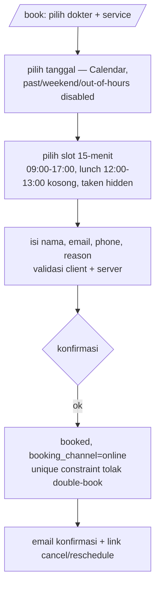

# v7 Fase 3 — contoh before/after vault (gate artifact)

**Status: CONTOH untuk keputusan gate — belum ada konsumen yang diubah.**
Sumber: `tests/scenarios/sample-prd-clinic.md` (PRD v2.0, 2026-06-12). Layout target = keputusan gate 2 ([gate2-close](2026-08-21-v7-gate2-close.md)): **4 file** — `vault.md` / `model.md` / `flows.md` / `constraints.md` + `vault.json` (flows standalone per Amendemen 1 audit §5.3: 04-flows = permukaan terpanas — hook Mermaid, 3 locator active-vault, 4 builder emisi).

Semua konten contoh diturunkan dari PRD klinik — tidak ada yang difabrikasi.

## BEFORE — layout sekarang (7 md + vault.json)

```
.mega-sdd/vaults/clinic-v1/
├── 00-index.md        # ±160 baris ceremony: Lock Status, Readiness, Reading paths,
│                      #   Reading order, Anti-halu rules, AI-consumer notes, Glossary,
│                      #   OQ roll-up (duplikat), Source documents, Changelog
├── 01-overview.md     # apa/siapa/kenapa + metrics (§1, §2, §3, §9)
├── 02-architecture.md # komponen + surfaces (§Clinic.3) + §8 UI/arch contract
├── 03-data-model.md   # DBML: Staff, Patient, Service, Appointment (§Clinic.4)
├── 04-flows.md        # F-U-001..004, F-S-001..002 (Mermaid) + DoD per flow
├── 05-decisions.md    # ADR-lite: D-001 Next.js full-stack, D-002 token tanpa login, ...
├── 06-constraints.md  # §6 compliance/perf/stack + NFR + Design System
└── vault.json         # manifest derived (derive-vault-json.sh)
```

00-index klinik hari ini (ringkas — inilah ceremony yang dibedah):

```markdown
# Clinic Appointment System — Grand Design

## Vault Lock Status
- **Vault version**: v1.0
- **Project shape**: web-app
- **Implementation mode**: new
- **Mode migration trigger**: first prod deploy
- **PRD status**: final
- **Output mode**: compact
- **PRD source**: sample-prd-clinic.md, v2.0, 2026-06-12 — FINAL

## Executive Summary          ← mirror 01-overview (duplikasi)
## Project Readiness Status   ← snapshot sekali-pakai
## Reading paths by role      ← ceremony navigasi 7-file
## Reading order (full)       ← idem
## Anti-hallucination rules   ← protokol generik (juga di ai-consumer-guide)
## Implementation Notes for AI Consumers
## Glossary                   ← Appointment, Slot, Service, Reminder, Booking channel (§4)
## Open Questions (roll-up)   ← DUPLIKAT dari 6 doc (kelas error: tag beda antar-doc)
## Source documents
## Changelog
### v1.0 (2026-06-12) — Initial vault generated from PRD v2.0.
```

OQ hari ini tersebar di **8 permukaan**: 6 doc (tag per-doc OV/AR/DM/FL/DC/CN) + roll-up 00-index + vault.json.

## AFTER — layout target (4 md + vault.json)

```
.mega-sdd/vaults/clinic-v1/
├── vault.md         # frontmatter YAML (residu 00-index) + Overview + Architecture + Decisions
├── model.md         # DBML data model (eks 03)
├── flows.md         # semua flow Mermaid + DoD (eks 04 — standalone, permukaan terpanas)
├── constraints.md   # constraints + SEMUA Open Questions (terpusat)
└── vault.json       # manifest derived — field `doc` repoint, + `vault_layout: 2`
```

### `vault.md` — head + kerangka (contoh nyata klinik)

```markdown
---
type: vault
doc_id: vault
vault_layout: 2                # marker dual-layout read (floor v5.9.0, satu minor cycle)
vault_version: "1.0"
project_shape: web-app
implementation_mode: new
mode_migration_trigger: "first prod deploy"
prd_status: final
output_mode: compact
locked_at: "2026-06-12 17:00 (WIB)"
locked_by: ["Product Team", "Engineering Lead"]
prd_source: "sample-prd-clinic.md, v2.0, 2026-06-12 — FINAL"
lock_status: "🔒 LOCKED for sprint 1 implementation"
sources:                       # eks "## Source documents"
  prd: "sample-prd-clinic.md / v2.0 / 2026-06"
changelog:                     # eks "## Changelog" — resume-detection resolve-oq + grammar bump diff-vault
  - version: "1.0"
    date: 2026-06-12
    notes: "Initial vault generated from PRD v2.0. Mode: new."
auto_classification_review:    # eks "## Auto-Classification Review" — data, bukan prosa
  - {oq: OQ-CLINIC-005, tag: tech, confidence: high, note: "deployment target — auto-resolve eligible"}
  - {oq: OQ-CLINIC-006, tag: tech, confidence: medium, note: "user reviews before binding"}
---

# Clinic Appointment System — Grand Design

> Booking appointment klinik: pasien self-book/reschedule/cancel via email token,
> staff (dokter/resepsionis) kelola jadwal. 1 klinik, 5 dokter, ±50 appointment/hari.

## Overview                    <!-- eks 01-overview · DOC_CODE OV -->
(§1 summary, §2 goals + §9 metrics: online share ≥50%, no-show <10%, staff time <30s, §3 roles)

## Architecture                <!-- eks 02-architecture · DOC_CODE AR -->
(§Clinic.3 surfaces table: /book, /api/appointments/[id]/cancel, /reschedule/[token],
 /staff/schedule, /staff/reception, /api/cron/reminders · §8 UI/arch contract)

## Decisions                   <!-- eks 05-decisions · DOC_CODE DC -->
### D-001 — Next.js 16 full-stack, satu app satu scope (accepted)
### D-002 — Pasien tanpa login: one-time signed email token (accepted)
### D-003 — Reminder = DB-backed sweep, bukan in-memory timer (accepted)
```

**Yang MATI (bukan pindah) dan kenapa:** Executive Summary (duplikat § Overview), Project Readiness (snapshot sekali-pakai, hidup di PLAN/report), Reading paths + Reading order (ceremony navigasi — 4 file tidak butuh peta baca 160 baris), OQ roll-up (kontrak bracket-first sudah menjadikannya legacy fallback; universe pindah ke constraints.md + vault.json), Anti-halu rules generik (tetap di `_meta/ai-consumer-guide.md`, satu sumber). **Glossary produk** (§4: Appointment, Slot, Service, Reminder, Booking channel) → section `## Glossary` kecil di vault.md — pindah, bukan hilang.

### `model.md` — eks 03 (DOC_CODE DM)

```markdown
# Data Model

```dbml
Table staff { id int [pk]  name varchar  email varchar  role varchar // doctor | receptionist
  specialty varchar  working_hours json  created_at timestamp }
Table patient { id int [pk]  name varchar  email varchar  phone varchar  created_at timestamp }
Table service { id int [pk]  name varchar  duration_minutes int  price int // display-only }
Table appointment { id int [pk]  patient_id int [ref: > patient.id]
  doctor_id int [ref: > staff.id]  service_id int [ref: > service.id]
  start_time timestamp  end_time timestamp
  status varchar // booked | cancelled | completed
  reason_for_visit text  booking_channel varchar // online | staff (BR-006)
  reminder_at timestamp  reminder_sent bool  created_at timestamp  updated_at timestamp
  indexes { (doctor_id, start_time) [unique, note: 'where status = booked — BR-002'] } }
```
```

### `flows.md` — eks 04, standalone (DOC_CODE FL)

```markdown
# Flows

## User flows

### F-U-001 — Patient books appointment



**DoD** (dari AC-001, AC-002, AC-007): appointment `booked` tercipta + email terkirim;
slot terisi tak bisa double-book (picker hide + constraint DB); halaman AA (aria-live konfirmasi).
**Source**: §Clinic.1 F-U-001, §Clinic.5 AC-001/002/007.

### F-U-002 — cancel via token · F-U-003 — reminder 24h · F-U-004 — reschedule atomik
## Staff flows
### F-S-001 — doctor schedule (own) · F-S-002 — receptionist conflicts (all + walk-in)
(masing-masing Mermaid + DoD, bentuk sama dengan F-U-001)
```

Hook Mermaid + 3 locator active-vault + 4 builder emisi re-key dari glob `04-flows.md` → `flows.md`. Isi & gate tidak berubah.

### `constraints.md` — eks 06 + SEMUA OQ terpusat (DOC_CODE CN)

```markdown
# Constraints & Open Questions

## Compliance      (§6.1: privasi data pasien → OQ-CLINIC-001; WCAG 2.2 AA)
## Performance     (§6.2: lookup <200ms, email ≤5 min, uptime 99%)
## Technology      (§6.3: Next.js 16 + Bun 1.3 + Postgres/Drizzle + shadcn/Tailwind v4 + Better Auth + Resend)
## NFR             (NFR-001 responsive 375px + AA, NFR-002 <200ms, NFR-003 email 5 min)
## Design System   (§8.2: --primary teal-700 5.36:1 AA, status text+icon+color)

## Open Questions

> SATU-SATUNYA permukaan OQ authored. Prefix tag (OV/AR/DM/FL/DC/CN/CLINIC) = penanda topik,
> BUKAN penanda file — tidak ada ID churn. vault.json tetap universe kedua (derived).

- [ ] **OQ-CLINIC-001** [P1] [business]: regulasi privasi data pasien yang berlaku (HIPAA/GDPR-equiv)?
- [ ] **OQ-CLINIC-002** [P1] [business]: pasien boleh lihat nama pasien lain di schedule view?
- [ ] **OQ-CLINIC-003** [P2] [business]: cancellation window — bebas atau N jam sebelum?
- [ ] **OQ-CLINIC-004** [P2] [business]: dokter sakit — auto-notify + reassign, atau manual?
- [ ] **OQ-CLINIC-005** [P2] [tech / high]: deploy Vercel (Bun beta + Cron) vs self-host (Node + croner)?
- [ ] **OQ-CLINIC-006** [P3] [tech / medium]: Schedule-X free-vs-premium acceptable, atau FullCalendar Premium?
```

Kolaps OQ: **8 permukaan → 2** (satu section authored + vault.json) — kelas error duplicate-tag-antar-doc terhapus; gate bind/OQ tak tersentuh (konsumsi vault.json).

### `vault.json` — delta

```json
{ "vault_layout": 2,
  "entities":       [{ "name": "appointment", "doc": "model.md", ... }],
  "flows":          [{ "id": "F-U-001", "doc": "flows.md", ... }],
  "adrs":           [{ "id": "D-001", "doc": "vault.md", ... }],
  "open_questions": [{ "tag": "OQ-CLINIC-001", "doc": "constraints.md", ... }] }
```

## Ringkas: residu 00-index (WAJIB pindah, bukan hilang)

| Konten 00-index | Tujuan |
|---|---|
| 6 Lock values + PRD source + locked_at/by | YAML frontmatter `vault.md` (parse: satu perubahan terkurung di `vault_md.parse_vault_lock`) |
| Changelog | frontmatter `changelog:` (resolve-oq resume + diff-vault bump grammar tetap punya input) |
| Auto-Classification Review | frontmatter `auto_classification_review:` (data terstruktur; override user = edit frontmatter/vault.json) |
| kb_module_graph pointer (KB sub-mode) | frontmatter `kb_module_graph:` |
| Glossary produk | section `## Glossary` di vault.md |
| Source documents | frontmatter `sources:` |
| Executive Summary / Readiness / Reading paths / OQ roll-up / anti-halu generik | MATI — duplikat atau ceremony (alasan per §5.3 Amendemen 2) |

## Rencana migrasi (per audit §5.3 — belum dieksekusi)

1. **`migrate-paths` rung `--vault-layout`** (one-timer idempotent yang sudah ada, dry-run dulu): (a) concat 00-residu→frontmatter + 01+02+05→`vault.md`, 03→`model.md`, 04→`flows.md`, 06+OQ→`constraints.md` dalam urutan template dengan section fence; (b) `git rm` file lama; (c) rewrite referensi nama-doc DI DALAM vault (VAULT-DIFF, unit `vault_source` section refs); (d) `derive-vault-json`; (e) cetak langkah wajib berikutnya.
2. **FULL RE-BIND WAJIB** — line-anchor `binding.json` + `.citation-map.json` TIDAK di-patch (fabrikasi); regenerate: merge → derive-vault-json → re-bind penuh → graph/emisi self-heal (kontrak binding-contract.md:189 sudah memaksa ini).
3. **Dual-layout read SATU minor cycle** — probe `vault.md` dulu, fallback `00-index.md`, gated marker `vault_layout` (floor kantor v5.9.0).
4. Blast radius konsumen lengkap (±35 prose refs + DOC_CODE re-key filename→section + DOCS list derive-vault-json/run-analyze/claims-ledger + glob `04-flows.md` → `flows.md` di 5 situs + test fixtures) = audit §5.2 — semua ship SATU release, spec & code lane tidak boleh drift.

**Angka**: 8 file → 5 file per vault; ceremony 00-index (~8K template + duplikasi per-vault) terhapus; setiap gate anti-halu (Mermaid mandate, OQ rails, staging preservation, claim ledger, B-gate) mempertahankan garansinya — hanya glob dispatch / section fence yang re-key.

**Berhenti di sini** — belum ada satu konsumen pun yang diubah; eksekusi menunggu keputusan gate Fase 3.
