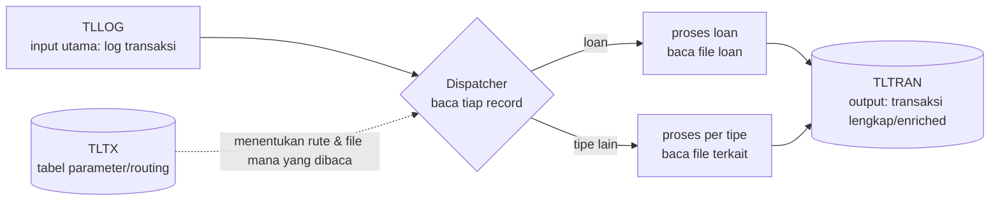

# Reverse engineering batch core banking (AS400 / RPG) — TLLOG → TLTRAN

> Paste ke Claude Code di folder yang berisi source AS400 (member RPG/RPGLE, CL, DDS) dan/atau ekspor data. Ini lane legacy mega-sdd (`extract-intelligence`) dengan briefing domain di depan — output akhirnya knowledge-base yang jadi dasar revamp. Berhenti di KB; rebuild adalah gate berikutnya.

## Model mental yang sudah kami pegang (verifikasi, jangan telan mentah)

Proses batch ini murni **input → output**. Hipotesis arsitekturnya — pola *dispatcher berparameter*:

- **TLLOG** = file input utama (transactional log). Tiap record dipecah/dirutekan berdasarkan tipe transaksinya.
- **TLTX** = tabel parameter (DB juga): dari sinilah dispatcher tahu record tipe X harus diproses bagaimana dan file mana yang perlu dibaca.
- **TLTRAN** = hasil akhir yang "sudah lengkap".

Status hipotesis ini = **[INFERRED]** dari diskusi manusia, bukan dari kode. Tugas pertama lo: menaikkan atau membatalkannya dengan bukti source, member per member.

## Langkah 0 — inventaris & pertanyaan akses (sebelum analisis apa pun)

1. Daftar semua yang ada di folder: member RPG/RPGLE/SQLRPGLE, CL/CLP (job stream), DDS (PF/LF), COPY member, ekspor data (kalau ada). Laporkan yang TIDAK ada — kalau CL job stream tidak ikut diekspor, urutan eksekusi batch = [OPEN], jangan direka.
2. Identifikasi file fisik vs logical: TLLOG/TLTX/TLTRAN itu PF apa, logical/index apa saja di atasnya (kunci akses = petunjuk pola baca).
3. Kalau ada akses data (ekspor CSV/DB2): catat, karena semantik TLTX paling cepat diverifikasi dari isinya, bukan hanya dari kode.

## Metode (per artefak, dengan disiplin marker mega-sdd)

Setiap klaim diberi marker: **[VERIFIED]** = ada di source, sitasi `member:baris` di baris yang sama; **[INFERRED]** = disimpulkan dari pola, sebut dasar simpulannya; **[OPEN]** = tidak bisa dipastikan dari artefak yang ada → jadi Open Question, jangan pernah ditebak. Kekhasan RPG yang sering bikin salah baca — perlakukan hati-hati: fixed-format kolom, indicator (*INxx, resulting indicators) yang mengatur alur secara implisit, MOVE/MOVEL yang memotong/menyalin sebagian field, packed decimal, CHAIN/SETLL/READE terhadap logical file (kuncinya menentukan subset data), dan O-spec/EXCPT untuk output. Kalau sebuah keputusan alur bergantung pada indicator yang di-set jauh di atas, telusuri sampai sumbernya — jangan simpulkan dari satu blok.

Deliverable KB (pakai struktur extract-intelligence, satu file per domain):

1. **Peta dispatcher** — member mana yang membaca TLLOG, field apa yang jadi kunci routing, dan bagaimana TLTX dikonsultasikan (CHAIN by apa). Ini jantungnya; kerjakan pertama.
2. **Kamus TLTX** — tabel: nilai/kolom parameter → arti → efek di kode (member:baris) → file yang dibuka karenanya. Kolom yang tidak pernah dibaca kode mana pun → catat "dormant [VERIFIED-oleh-absennya-pembaca]". Kalau ada ekspor datanya, cross-check nilai yang benar-benar terpakai vs yang mati.
3. **Field mapping TLLOG → TLTRAN** — per tipe transaksi: field asal → transformasi (verbatim RPG-nya kalau pendek) → field tujuan; enrichment dari file lain disebut sumbernya. Yang tidak jelas = [OPEN], bukan "diasumsikan copy".
4. **Flow per tipe transaksi** (loan dulu — itu yang disebut di diskusi) — Mermaid per tipe: baca apa, validasi apa, tulis apa, error path ke mana (record ditolak masuk file apa? di-skip? job abend?). Error path hampir selalu tempat pengetahuan bisnis tersembunyi.
5. **Rantai batch** (kalau CL ada) — urutan program, dependency file antar step, restart point. Kalau tidak ada CL: [OPEN] besar, tulis eksplisit.
6. **Aturan bisnis yang menumpang** — hard-coded value, tanggal cutoff, pembulatan, GL account mapping di dalam kode — daftar terpisah karena inilah yang paling mahal hilang saat revamp.

## Rambu

- Read-only. Jangan "merapikan" source. Jangan menulis kode baru — revamp itu fase berikutnya, setelah KB di-review manusia.
- Jangan pakai pengetahuan umum core banking untuk mengisi lubang — sistem bank ini punya keputusannya sendiri; lubang = [OPEN].
- Sampling data (kalau ada): sebutkan ukuran sampel; jangan klaim "semua transaksi tipe X begini" dari 10 baris.
- Bahasa: Indonesia + istilah teknis English; semua sitasi `member:baris`.
- Tutup dengan: ringkasan hipotesis dispatcher (terbukti/terbantah/dimodifikasi), hitungan marker (VERIFIED/INFERRED/OPEN per domain), dan daftar [OPEN] yang butuh orang AS400 kantor — itu bahan meeting berikutnya.

Kalau folder ini punya mega-sdd ter-install, jalankan lewat `/mega-sdd <dir-source> --out=.mega-sdd/` supaya KB-nya langsung berbentuk knowledge-base standar (marker + citation validator jalan); briefing di atas jadi konteks tambahan untuk domain-extractor. Kalau tidak, kerjakan manual dengan struktur yang sama.
