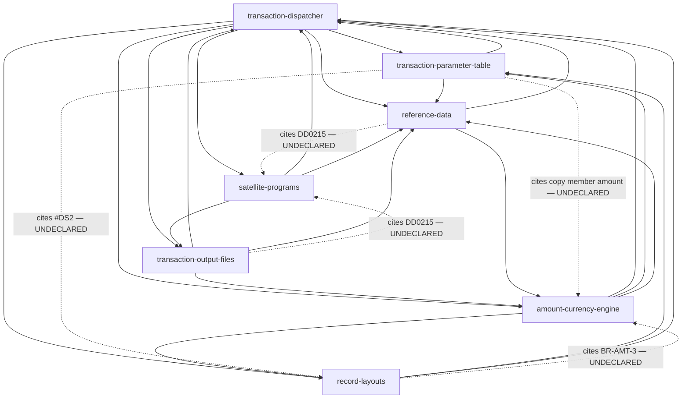

# Audit KB PRD — Host-AS400-Batch (TLTRAN)

**Tanggal:** 2026-09-05 · **Scope:** `Host-AS400-Batch/.mega-sdd/knowledge-base/` (7 modul PRD + README + census + data-mutation-policy) vs seluruh source (`TLTRAN/` 86 member, 19.115 baris + `FILE REF/` 11 DDS).
**Metode:** 6 lane audit paralel (inventory independen, 4 lane per-modul, 1 lane cross-module) + verifikasi tangan-sendiri untuk semua temuan kelas berat. Detail per lane: [`research/2026-09-05-hostas400-kb-audit/`](2026-09-05-hostas400-kb-audit/) (A–F).
**Rail:** tree Host-AS400-Batch read-only; sesuai mandat audit, **tidak ada PRD yang di-rewrite** — ini laporan + rencana, eksekusinya nunggu keputusan owner.

---

## 1. Executive Summary

**KB ini layak dipercaya sebagai peta, belum layak dipercaya sebagai kontrak implementasi 1:1.**

Yang kuat (dan ini bukan basa-basi — diukur):

- **Zero fabrication.** 88 sitasi di-spot-check line-exact lintas 7 modul: 62 EXACT (70%), 18 imprecise, 8 WRONG (9%) — dan tidak ada satu pun sitasi fiktif. Klaim negatif ("field X tidak dibaca") umumnya disertai metode verifikasinya dan bisa direplikasi.
- **Census CLEAN 100%**: 86 member, 19.115 baris, sha256 spot-check 15/15 match, tiap member tepat satu modul, nol drift disk↔census.
- **Nol konflik fakta bisnis antar modul** (888, 250/251, 151, 222, 360/365, suspense 9999999999 — konsisten semua).
- Disiplin marker `[INFERRED] (dasar: …)` nyata dan umumnya jujur.

Yang bikin belum siap jadi kontrak:

1. **8 klaim WRONG**, beberapa di antaranya arah-uang: semantik `TLXGTN` kebalik, arah negasi float (`BR-FLT-3`) kebalik, "RPV closeout di-skip" salah, arah `TLBNXT='X'` kebalik, gotcha #5 record-layouts kebalik terhadap sumber.
2. **Kelas perilaku paling mahal justru yang lolos**: matriks IBT 4-leg (WRTGL:184-255) tidak terdokumentasi, state basi antar panggilan di CD0215/DD0215 (uang nasabah), silent-skip baris non-NDP beda tanggal, plumbing kurs FNDCUR yang ternyata mati.
3. **"Pembulatan harian" pada rumus bunga [LOCKED] sebenarnya truncation** (`DIV` tanpa half-adjust) — untuk item yang wajib direplikasi 1:1, salah kata ini saja sudah menghasilkan angka regresi beda.
4. **`FILE REF/` (masuk 2026-09-04, sehari setelah ekstraksi) belum diserap**: 8 DDS field-reference baru (~4.289 definisi field) menjawab 3 OQ P1 penuh + ~6 partial, dan bikin beberapa bagian KB (reference-data §1, README "yang TIDAK ada") **stale**.
5. **Lapisan roll-up drift**: LOCKED 5-vs-4, split prioritas OQ salah, frontmatter counts tidak bisa direkonsiliasi ke body di 4 modul.

Kesimpulan satu kalimat: substansi ekstraksi bagus dan jujur; yang perlu dikerjakan adalah **patch akurasi (8 WRONG + kelas undocumented HIGH), serap FILE REF, dan naikkan grammar satu tingkat** (decision table + kontrak operasional + acceptance layer) — bukan rebuild KB dari nol.

---

## 2. System Understanding (independen dari KB)

[VERIFIED via lane A + baca langsung] Ini **pure batch RPG III/RPGLE di AS/400** (nol WORKSTN), pola SilverLake/Jack Henry "4700 interface — transaction file generation":

- **1 program utama** `qrpgsrc.tltran` (2.546 baris): terima window RRN via `*ENTRY PLIST` (BRRNIN/ERRNIN), baca teller log **TLLOG (mode update)**, filter record monetary, CHAIN tabel parameter **TLTX** per transaction code, pecah tiap record jadi maks 20 baris posting, route per application code (DD/CD/LN/SR/GL/CS/RC), tulis **9 file output** per produk + hold + float + third-party name + recon, generate jurnal interbranch (IBT) + revaluasi valas (RPV), update TLLOG untuk item next-day.
- **6 program satelit** yang di-CALL: JHDATI/JHDATO (konversi tanggal), DD0215/CD0215 (backdated interest adjustment — **stateful antar panggilan**, ditutup via `'*CLOSE'` di EOD), DM91028/DM91033 (resolusi akun GL/status rekening).
- **35 copy member**: 15 subroutine (AMTSR kalkulator formula 8-char, WRTGL, PUTIBT, CRTFLT, GETAM2/3, dst.) + 20 data-structure overlay (keluarga #DS2-#DS29 = peta slot-20 buffer).
- **44 DDS** (41 PF, 3 LF) — mayoritas field bertipe referenced (`R`) ke file *FREF.
- Komposisi cross-check: 7 + 44 + 35 = 86 ✓.
- **Yang tidak ada di source set** (dan menentukan bentuk PRD idealnya): CL/job-stream (orkestrasi & restart = [UNKNOWN]), data produksi (semua klaim nilai = [OPEN]), program konsumen downstream, JHDATC, data area **TLMAST** (±25 field kontrol — temuan baru audit ini), PF DDS **DDFLOT**.

`FILE REF/` (11 file, 16.365 baris): 8 baru untuk KB (TLFREF/GLFREF/JHFREF/CFFREF/RMFREF/BIFREF/RCFREF/SRFREF, ~4.289 field defs), 3 duplikat byte-identik dari TLTRAN (CD/DD/LNFREF, dicek `cmp`). Catatan operasional: **BIFREF bukan UTF-8** — konversi dulu sebelum diproses.

---

## 3. Module Inventory & Coverage Matrix

Skor per dimensi = hasil lane audit (PASS/PARTIAL/FAIL), spot-check = sitasi line-exact.

| Modul | Spot-check (E/I/W) | PASS | PARTIAL | FAIL | Temuan terberat |
|---|---|---|---|---|---|
| transaction-dispatcher | 11/3/2 (n=16) | 4 | 6 | 0 | 2 key KLIST salah; RPV-closeout & arah TLBNXT kebalik; 4 perilaku HIGH tak terdokumentasi |
| transaction-parameter-table | 7/2/3 (n=12) | 6 | 4 | 0 | **TLXGTN kebalik** ('Y'=bypass); gugus TLXADn hilang; 3 gugus salah cap dormant |
| amount-currency-engine | 8/2/2 (n=12) | 3 | 6 | **1** | **BR-FLT-3 arah float kebalik**; matriks IBT (s.d. 4×PUTIBT = 8 record) hilang → Impl readiness FAIL |
| satellite-programs | 11/1/0 (n=12) | 4 | 6 | 0 | **State basi CD0215/DD0215** lolos; "pembulatan" = truncation; NEXTDT vs posting date |
| record-layouts | 5/6/1 (n=12) | 5 | 5 | 0 | Gotcha #5 kebalik terhadap sumber; gugus EDT/TCY/#DS29 bolong; #DS10 mematahkan "pola identik" |
| transaction-output-files | 9/3/0 (n=12) | 6 | 4 | 0 | BR-OUT-4 (sell hilang); dimensi on-us float + 4 write-site hilang |
| reference-data | 11/1/0 (n=12) | 4 | 6 | 0 | **BR-REF-13 basis salah** — DD0215/CD0215 CHAIN DDMAST/CDMAST; §1 "FREF hilang" stale |

Agregat: **88 sitasi → 62 EXACT · 18 IMPRECISE · 8 WRONG · 0 fabricated.** Dimensi yang PASS merata: **Traceability (7/7)** dan **AI-readability (7/7)**. Dimensi yang paling lemah merata: **Testability (0/7 PASS penuh — tidak ada acceptance criteria di rule mana pun)** dan Implementation readiness (0 PASS).

---

## 4. Missing Information (prioritas severity)

### CRITICAL — salah arah uang / wajib sebelum ada yang berani port

1. **BR-FLT-3 (amount) kebalik**: negasi float berlaku untuk **debit-NORMAL dan kredit-KOREKSI** (`#CRTFLT:28-35`), bukan "koreksi+debit". Diverifikasi ulang tangan-sendiri.
2. **TLXGTN (param-table §4.1) kebalik**: `'Y'` = bypass generation (`tltran:456 IFNE 'Y'` + TLFREF:141 'Bypass Tx Generation'). PRD dispatcher (BR-DSPTCH-5) benar → sekaligus konflik antar-modul.
3. **Matriks IBT tidak terdokumentasi** (WRTGL:184-255 + blok inline tltran:874-909, 1181-1217): kondisi region RGN1/RGN2 × TLMSBR × tipe cabang M/S × exclusion 888 × patch MEDAN (SAVTY1) menentukan 1–4× PUTIBT (2–8 record jurnal); plus override amount IBT via `TLF,TLMMCA` (WRTGL:186-189). PRD mereduksi jadi "cabang beda → IBT".
4. **State basi satelit** (uang nasabah): CD0215 tanpa `*INLR` — cek tier `CDRTT2` + RATE/METHOD/YRBASE dievaluasi **sebelum** CHAIN CDMAST (chain cuma di ELSE) → keputusan pakai record panggilan sebelumnya; DD0215 SAVDT/SAVRAT tidak di-reset per call → adjustment bisa ke-skip diam-diam. BR-SAT-10 versi CD menggambarkan intent, bukan eksekusi.
5. **"Pembulatan tiap hari" = TRUNCATION**: `DIV 360/365` tanpa half-adjust `H` (diverifikasi DD0215:243-267). Untuk BR-SAT-1 [LOCKED] "replikasi 1:1", beda round-vs-truncate = beda angka regresi. Plus unit rate (persen vs fraksi) = [UNKNOWN] (definisi field RATE tidak di source set).

### HIGH — hilang dari KB, menentukan kebenaran rebuild

6. **Silent-skip baris non-NDP dengan TLBTDT≠POSTDT** (tltran:503-505, 547-548) — tidak pernah diproses, tanpa jejak; BR-HARD-9 cuma bahas NDP Y/L. Ditambah **arah TLBNXT='X' kebalik** di PRD (stamp terjadi saat item DIPROSES).
7. **IBT fail-silent saat TLBRN1 miss** (#PUTIBT:6-7): kedua leg GLTELS tidak ditulis, leg produk sudah terbit → clearing sepihak, tanpa error.
8. **Hold threshold**: hold hanya ditulis bila amount > TLMLAV/TLMNAV, dan **jumlah hold = selisihnya** (tltran:921-923, 964-966) — tak terdokumentasi.
9. **FNDCUR mati** (tltran:482 di-comment) → TRCDEC/TRCVRT **selalu 0** di semua output GL/CS/RC/IBT; flow mermaid modul amount masih menggambar FNDCUR hidup (dokumen menyangkal dirinya sendiri — BR-CUR-6 bilang mati). Perlu konfirmasi downstream memang expect 0.
10. **Data area TLMAST** — ±25 field kontrol (TLMLDY/TLMLAV/TLMSBR/TLIBDR/TLSR*…) dipakai sebagai kontrol utama hold/float/IBT/SR, kontainer runtime-nya `tltran:234, 394-395`, DDS-nya tidak ada, **dan tidak diangkat jadi OQ oleh KB**. Layak OQ P1 baru.
11. **DDMAST/CDMAST ternyata DIKONSULTASI batch** via satelit (DD0215:119 CHAIN RDDMAST; CD0215:72 CHAIN RCDMAST) — BR-REF-13/gotcha-6/OQ-REF-5 menyatakan sebaliknya, dan fakta ini absen dari seluruh KB. Data area **JHAPAR** (sumber JHICUR base currency) juga tidak ter-cover modul mana pun.
12. **Gugus TLXADn hilang total** dari kamus TLTX (dibaca batch: tltran:2464-2467, LEAMT4); TLXALn/TLXOGn/TLAMM-TLAB-TLAC salah cap "dormant" padahal dibaca (573-575, 2416-2427, 2486).
13. **Parm mismatch CD0215**: `ADJST2(11,2)` caller vs `ADJ(15,2)` callee (call by-reference) + parm "posting date" sebenarnya dikirimi **NEXTDT** — dua-duanya kelas korupsi/off-by-one klasik AS/400. [NEEDS_VALIDATION di mesin]

### MEDIUM

- 2 key KLIST salah di dispatcher §4: IBCKEY = PUTIBC+**TLBAFT**+CURRCY; SRMKEY = ACCTNO+CCTYPE. DDPAR2 key kurang kolom (SCCODE+DP2CUR).
- BR-OUT-4: STVALU diisi untuk **sell DAN purchase**; BR-OUT-9/10: site CFTPNT ke-4 + 6 varian float ({local,foreign,on-us}×{avail,accrual}) tidak lengkap; BR-OUT-5 framing TRSYS='TL' menyesatkan.
- Gotcha #5 record-layouts kebalik (pasangan DCK↔TLXDP justru konsisten; anomali riil = `TLTRn` tanpa padanan & tak terpakai) → OQ-LAYOUT-1 dibangun di atas premis keliru.
- Guard branch-type 'M' inkonsisten CS/RC (masih TLITYP, belum SAVTY1 seperti patch YP1/MEDAN di jalur lain) — bug-atau-intended perlu diputuskan.
- LODEXC tanpa bound check (>60 currency = crash); GLGREF lookup **dua tingkat** (branch aktual → branch 0 → suspense) cuma terdokumentasi tingkat terakhirnya.
- Roll-up drift: LOCKED 5 (README) vs 4 (policy + body); split OQ P1/P2/P3 salah (riil 12/18/10); OQ-DSPTCH-2 [P1] hilang dari roll-up; frontmatter counts (inferred/artifact/locked) tak bisa direkonsiliasi ke body di ≥4 modul.
- data-mutation-policy tidak menyentuh Critical #2 (pembulatan 19,2) sama sekali — keputusan lock-vs-fix menggantung di OQ-AMT-1 tanpa baris policy.

### LOW

Referensi dangling `OQ-AMT-...` (OQ-LAYOUT-2); pointer TLMBLn nyasar (OQ-TLTX-6 → harusnya -5); "87 field header" riil 85; TLBID 4 digit (bukan 5); alias RTTRCD/RTRCNO ↔ RTTXCD/RTRECN tidak dijelaskan; jembatan rename #DS24 (GLFREF→TL*) tidak disebut; gotcha tanpa ID (rujukan ordinal rapuh); komentar-usang di source yang layak dicatat sebagai jebakan (DDHISTLA "169" vs riil 151 — separuh sudah tertangkap KB).

---

## 5. Dampak FILE REF (lever terbesar, belum diserap)

| OQ | Prio | Status pasca FILE REF |
|---|---|---|
| OQ-DSPTCH-3, OQ-TLTX-3, OQ-REF-1 | P1 ×3 | **RESOLVED** — semua FREF yang diminta ada di disk (7/7 + RMFREF bonus) |
| OQ-TLTX-5 | P2 | Largely answerable (COLHDG lengkap: TLXBED/TLXDAY/TLXMBL VALUES dst.) |
| OQ-OUT-2 | P2 | Tinggal PF DDS **DDFLOT** (tipe field float sudah ada di DDFREF:1802-1830 **sejak ekstraksi** — bukti terlewat; komposisi/urutan format tetap [OPEN]) |
| OQ-DSPTCH-5/9, OQ-REF-6, OQ-LAYOUT-1 | P2-P3 | Partial (tipe pasti, semantik bisnis tetap butuh manusia) |
| Sisanya (31) | — | Tetap open — butuh data/program/keputusan bisnis, bukan DDS |

P1 efektif tersisa **9 dari 12**, dan setelah dedup (DSPTCH-2≈TLTX-1, DSPTCH-7≈SAT-1) **ask unik yang benar-benar memblokir ≈ 8**: (1) CL/job-stream + kontrak restart; (2) ekspor data TLTX + kode aktif; (3) pemakai lain TLTX; (4) program konsumen downstream; (5) source JHDATC; (6) konfirmasi akuntansi bunga harian (kini + truncation + unit rate); (7) keputusan pembulatan (19,2); (8) kejadian produksi float hilang. Tambahan baru dari audit: **layout TLMAST** + keputusan atas dua bug state-basi satelit + apakah TRCDEC/TRCVRT=0 memang di-expect downstream.

Bonus temuan kelas yang sama: **STATUS rekening 0-9 lengkap dengan artinya sudah ada di DDFREF:81-92 sejak awal** (OQ-REF-6 sisi DDMAST overshoot — ekstraktor kelewat).

---

## 6. Dependency map (riil, dari lane F)

`depends_on` penuh cycle → klaim README "urutan rebuild ikut depends_on" tidak derivable; urutan 1-7 di README adalah keputusan editorial (masuk akal, tapi harus diakui begitu). 5 edge riil belum dideklarasi (dashed).

---

## 7. Recommended PRD Schema (project-specific)

**Verdict skema: grammar 6-section yang ada TERBUKTI bekerja** — Traceability & AI-readability PASS 7/7, zero fabrication di 88 sampel. Jangan diganti template generik; yang dibutuhkan **7 upgrade tertarget** untuk kelas sistem "batch finansial legacy tanpa job-stream":

1. **§7 baru (conditional, modul workflow): Kontrak Operasional / Run & Recovery.** Isi: trigger & pemanggil, parameter entry (window RRN), semantik restart/rerun (temuan: rerun window yang sama bisa re-proses item NDP ber-stamp 'X' → risiko double-posting), siklus open/`*CLOSE` satelit, state antar panggilan. Kenapa: sistem ini batch — perilaku "per-run" (bukan per-record) sekarang tercecer di BR/OQ; tanpa section ini AI agent tidak tahu apa yang terjadi saat job mati di tengah. Kalau [UNKNOWN] (karena CL tidak ada), section tetap wajib hadir dengan [UNKNOWN] eksplisit — absence yang dinyatakan ≠ omission.
2. **Decision table wajib untuk rule multi-kondisi.** Kandidat yang sudah ketahuan: matriks IBT (kolom TLMSBR/RGN1=RGN2/TLITYP/SAVTY1/888 → baris leg terbit), state machine NDP (NDP-flag × TLBTDT × business-day → diproses?/TLLOG di-update?), presedensi override branch (AXF→USB→OSB × guard RPVMOD), ladder LE. Kenapa: 4 dari 10 rule paling load-bearing dinilai "tidak implementable tanpa baca RPG" justru karena prosa.
3. **Acceptance layer per BR kritis** (`AC-<BR-ID>-n`): fixture given/when/then dengan oracle **golden-master dari legacy** (pola yang sama dengan pilot multifinance). Testability sekarang 0/7 PASS — ini gap dimensi terbesar. Sebagian AC terblokir data (ekspor TLTX) — tandai blocked-by-OQ, jangan dikarang.
4. **Field dictionary per modul di-generate deterministik dari FREF DDS** (nama, tipe, panjang, desimal, COLHDG/TEXT, VALUES) — bukan ditulis tangan. FILE REF membuat ini mungkin sekarang; cross-proof lebar DS ↔ FREF sudah terbukti jalan di audit (lane D).
5. **`depends_on` dipecah dua field**: `references` (boleh cycle — memang saling rujuk) vs `rebuild_after` (DAG, derivable). Deklarasikan 5 edge yang hilang.
6. **Gotcha diberi ID** (`G-<MOD>-n`) — rujukan ordinal ("gotcha #7") rapuh terhadap sisipan.
7. **Frontmatter counts di-generate, bukan diketik** — drift verified/inferred/locked terjadi di ≥4 modul. Kalau tidak bisa digenerate, hapus dari frontmatter dan biarkan README roll-up yang menghitung (satu sumber kebenaran).

Yang secara sadar TIDAK direkomendasikan: skema REQ-/AC-/DEP- bureaucracy penuh ala IEEE 29148 — konvensi BR/OQ/[LOCKED] yang ada sudah lebih tajam untuk KB reverse-engineering; NFR/security section per modul (sistem batch internal single-tenant — cukup satu catatan level KB); memaksa section kosong (grammar sudah benar: "explicit absence allowed, omission not").

---

## 8. Migration / Improvement Plan

Urut ketat — tiap fase punya definisi selesai yang bisa dicek. **Eksekusi di worktree Host-AS400-Batch (sesi yang pegang KB itu), bukan dari sini.**

**Fase 0 — Patch akurasi (tanpa bukti baru, semua sitasi sudah di laporan ini).**
8 WRONG + kontradiksi: TLXGTN, BR-FLT-3, gotcha-7 RPV, arah BR-HARD-9, IBCKEY, SRMKEY, gotcha #5 layouts (+OQ-LAYOUT-1 ditulis ulang → provenance TLTRn), BR-OUT-4 sell, BR-REF-13 + gotcha-6 (akui DD0215/CD0215), TLXBEn→TLXBMn, sitasi TLXAA, BR-CUR-3, flow amount (FNDCUR mati), flow satelit (CD tanpa error parm), "pembulatan"→"truncation" di BR-SAT-1/gotcha-3/OQ-SAT-2 + policy. Roll-up: LOCKED=4 (atau tambah item ke-5 eksplisit), split OQ 12/18/10, OQ-DSPTCH-2 masuk roll-up, dangling refs, dedup-table OQ. Selesai = zero klaim yang diketahui-salah tersisa.

**Fase 1 — Serap FILE REF (delta re-extraction).**
Census scope diperluas (86 → 94 member; 3 duplikat dicatat sebagai duplikat, BIFREF dikonversi encoding dulu); field dictionary di-generate; tutup 3 OQ P1 + rescope 6 partial; un-stale reference-data §1 + README "Yang TIDAK ada"; angkat BR-TLTX-3 dan kawan-kawan dari [INFERRED]; DDFLOT di-rescope ("tipe field VERIFIED via DDFREF; komposisi format [OPEN]"); jawab OQ-REF-6 sisi DDMAST dari DDFREF:81-92. Selesai = tidak ada OQ yang jawabannya sudah ada di disk.

**Fase 2 — Dokumentasikan yang undocumented (bukti sudah ada di source).**
Item CRITICAL/HIGH №3-№13 di §4 laporan ini: matriks IBT + override TLMMCA (decision table), state-basi CD0215/DD0215 (+ OQ P1 baru: replikasi-bug-atau-fix), NDP state table + silent-skip non-NDP, hold threshold, FNDCUR-mati sebagai konsekuensi output (TRCDEC/TRCVRT=0), TLMAST OQ P1 baru, JHAPAR dikasih rumah modul, TLXADn + koreksi dormant, 6 varian float + site ke-4 CFTPNT, guard M CS/RC, LODEXC bound, GLGREF dua-tingkat, parm mismatch CD0215 + NEXTDT.

**Fase 3 — Upgrade grammar** (§7 rekomendasi 1-2, 5-7) + **acceptance layer** (rekomendasi 3-4) untuk BR yang tidak blocked-by-OQ. Golden-master harness nyusul begitu ekspor TLTX + fixture TLLOG ada.

**Fase 4 — Meeting tim AS400** dengan daftar ask final: 8 ask unik P1 lama (sudah dikurangi 3 yang tuntas) + 3 ask baru audit (TLMAST, state-basi decision, TRCDEC=0 expectation) + DDFLOT PF + konfirmasi guard-M.

Catatan untuk mega-sdd (repo ini): temuan kelas "frontmatter counts drift", "OQ answerable-from-disk tidak ke-detect", dan "flow diagram kontradiksi dengan BR di dokumen yang sama" adalah kandidat validator baru — dicatat sebagai backlog terpisah, bukan bagian audit ini.

---

## 9. Metodologi & kejujuran audit

- 6 lane paralel; **semua temuan kelas berat diverifikasi ulang tangan-sendiri** sebelum masuk laporan (TLXGTN, BR-FLT-3, RPV-closeout, truncation, WRITERDDFLOT, DDFLOT-di-DDFREF).
- **Auditor juga bisa salah — dua kali ketangkep**: lane A memvonis F-spec DDTFLT dead ("tidak ada WRITE") karena grep "WRITE RDDFLOT" pakai spasi — RPG III fixed-format menulis `WRITERDDFLOT` nempel; erratum ditambahkan di file lane A. Lane F menyebut "layout DDFLOT ada di DDFREF" — separuh benar (kamus field ya, komposisi format tidak). Keduanya diputus dengan baca source langsung.
- Pelajaran metodologi yang berlaku umum untuk audit RPG fixed-format: verifikasi naif berbasis grep berspasi/regex modern akan menghasilkan false negative; kolom-7 `*` (dead code) dan I-spec overlay adalah dua jebakan klaim-palsu terbesar.
- Semua label [VERIFIED]/[INFERRED]/[UNKNOWN]/[NEEDS_VALIDATION] di laporan lane dipertahankan; tidak ada requirement yang dikarang untuk mengisi bolong.
