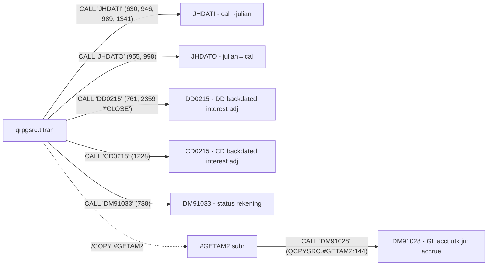

# Lane A — Independent System Inventory (Host-AS400-Batch)

> **ERRATUM (ditambah saat sintesis, 2026-09-05):** klaim di file ini bahwa DDTFLT
> "open O tapi tanpa WRITE terdeteksi / possible dead F-spec" adalah **SALAH** —
> `WRITERDDFLOT` ada di `QCPYSRC.#CRTFLT:67, 87, 125, 144, 182, 201` (RPG III menulis
> opcode+factor nempel tanpa spasi, jadi grep "WRITE RDDFLOT" tidak nemu). F-spec DDTFLT
> hidup; PRD dispatcher yang benar. Lihat laporan utama §Metodologi.

Audit date: 2026-09-05. Semua path relatif ke `/Users/farhanriuzaki/SunnyGo/2026/AIRND2026/Project/Host-AS400-Batch/`. Inventory ini diturunkan langsung dari source, BUKAN dari KB — KB baru dipakai di §Census verification dan mapping FILE REF.

## System type

Ini **batch program, bukan interactive**: tidak ada display file (WORKSTN) sama sekali di 86 member — semua F-spec berjenis DISK (`TLTRAN/qrpgsrc.tltran:64-96`). TLTRAN adalah **satu program utama + 6 program satelit yang di-CALL**, jadi bentuknya lebih ke "single main program dengan helper", bukan job-stream banyak step — walau [INFERRED] dia sendiri kemungkinan satu step di dalam job-stream RUNMEGA yang lebih besar (header menyebut "RMG SilverLake and InHouse from RUNMEGA", `qrpgsrc.tltran:6`; CL/job source-nya tidak ada di folder ini, jadi orkestrasinya [UNKNOWN]). Data flow shape-nya klasik teller-batch SilverLake: program menerima range RRN via `*ENTRY PLIST` (BRRNIN/ERRNIN, `qrpgsrc.tltran:239-241`), CHAIN ke record pertama TLLOG (`qrpgsrc.tltran:417`), lalu loop `READ RTLLOG` sampai end-range (`qrpgsrc.tltran:2353`), skip record non-monetary (`qrpgsrc.tltran:424-427`), dan per record teller log men-generate record transaksi ke file interface per produk — DD/CD/LN/GL/SR/RC/CFTPNT/float (semua `WRITE R*TELT`-family, lihat call graph di bawah) — konsumsi downstream-nya sistem posting per produk [INFERRED dari nama file "transaction record"/"interface", `QDDSSRC.CDTELT` TEXT('C/D transaction record')]. Di akhir run dia CALL `DD0215` dengan OPTION `'*CLOSE'` lalu SETON LR (`qrpgsrc.tltran:2358-2362`). Komentar banner menyebut "4700 INTERFACE — TRANSACTION FILE GENERATION" (`qrpgsrc.tltran:28-29`).

## Program inventory

7 program RPG/RPGLE (semua purpose dari header/komentar/struktur source):

| Program | Type | Lines | Purpose (1 baris) | Evidence |
|---|---|---|---|---|
| `TLTRAN/qrpgsrc.tltran` | RPG III | 2546 | Main batch: baca teller log (TLLOG) per RRN range, generate transaction/interface file per produk (4700 interface) | `qrpgsrc.tltran:2-6,28-29` |
| `TLTRAN/Qrpgsrc.CD0215` | RPG III | 195 | Time deposit (CD) backdated interest adjustment — hitung ulang accrued interest dari CDMAST+CDHIST | `Qrpgsrc.CD0215:2,10-11` |
| `TLTRAN/Qrpgsrc.DD0215` | RPG III | 270 | Deposit (DD) backdated interest adjustment — ACCRUX subr "CALC ACCRUED INTEREST" atas DDMAST/DDTNEW + rate JHRATE; juga dipanggil mode `'*CLOSE'` di end-of-run | `Qrpgsrc.DD0215:33-39,230`; caller `qrpgsrc.tltran:2357-2359` |
| `TLTRAN/Qrpgsrc.JHDATI` | RPG III | 122 | Date conversion subprogram: calendar (system date format) → Julian YYYYDDD | `Qrpgsrc.JHDATI:19-22` |
| `TLTRAN/Qrpgsrc.JHDATO` | RPG III | 79 | Date conversion subprogram: Julian YYYYDDD → calendar MMDDYY | `Qrpgsrc.JHDATO:2-5` |
| `TLTRAN/Qrpglesrc.DM91028` | RPGLE | 79 | Helper jurnal adjust accrue interest (MR 0218/VIII/2019) — baca DDMAST/DDTNEW/GLINT1, return GL account/cost/product + deskripsi via PLIST PD9128 | `Qrpglesrc.DM91028:15-16,27-29`; PLIST `qrpgsrc.tltran:257-262`; dipanggil dari `QCPYSRC.#GETAM2:144` |
| `TLTRAN/Qrpglesrc.DM91033` | RPGLE | 46 | Helper "Status Rek HOST & Enhan Close by System" (MR 26/5 V2.16.T) — terima account+type, return status (OACST) dari DDMAST/DDTNEW/DDPAR3 [INFERRED dari PLIST & F-spec; body tidak berkomentar] | `Qrpglesrc.DM91033:14-20`; PLIST `qrpgsrc.tltran:296-299`; CALL `qrpgsrc.tltran:738` |

## DDS inventory

44 member `QDDSSRC.*` di TLTRAN/ (41 PF, 3 LF). Field count = jumlah baris A berdefinisi field (mayoritas referenced `R`, tipe fisiknya ada di file *FREF).

| Member | Kind | Record fmt | Fields | Keys | Purpose / TEXT |
|---|---|---|---|---|---|
| QDDSSRC.TLLOG | PF | RTLLOG | 213 | TLBAPM,TLBID,TLBSEQ,TLBTMI | 'TELLER LOG FORMAT' — input utama batch |
| QDDSSRC.TLTX | PF | RTLTX | 1272 | TLTXCD | Parameter per transaction code ('App code #01' dst.) |
| QDDSSRC.TLTXRM | PF | RTLTXRM | 10 | RTTRCD,RTRCNO | 'TLTX Description Remark' |
| QDDSSRC.TLTEL | PF | RTLTEL | 15 | TLNUM | 'Teller master format' |
| QDDSSRC.TLBRN1 | PF | RTLBRN1 | 14 | TLIBRN,TLIAFT,TLICUR | 'Interbranch clearing control' |
| QDDSSRC.TLBRN2 | PF | RTLBRN2 | 3 | TLCTLB,TLLOGB | 'Logical branch' |
| QDDSSRC.TLFLTC | PF | RTLFLTC | 6 | TLFBRN,TLDAY | 'Float control file' |
| QDDSSRC.TLFLTCL1 | LF | RTLFLTC | — | TLFBRN,TLEXP7 | 'TELLER FLOAT FILE' (logical atas TLFLTC) |
| QDDSSRC.DDMAST | PF | RDDMAST | 244 | ACCTNO,ACTYPE | 'Deposit master format' |
| QDDSSRC.DDTNEW | PF | RDDTNEW | 238 | ACCTNO,ACTYPE | 'Deposit new account format' |
| QDDSSRC.DDHIST | PF | RDDHIST | 35 | TRACCT,TRATYP,TRDATE,SERIAL | 'Deposit history format' |
| QDDSSRC.DDHISTLA | LF | RDDHIST | — | TRACCT,TRATYP,TRDATE | Logical atas DDHIST |
| QDDSSRC.DDPAR1 | PF | RDDPAR1 | 16 | (none) | Parameter kontrol DD (single-record) [INFERRED dari nama+dibaca sekali `READ DDPAR1`] |
| QDDSSRC.DDPAR2 | PF | RDDPAR2 | 218 | SCCODE,DP2CUR | Parameter service charge/currency DD [INFERRED dari keys] |
| QDDSSRC.DDPAR3 | PF | RDDPAR3 | 20 | TRANCD | Parameter per transaction code DD |
| QDDSSRC.DDTELT | PF | RDDTELT | 30 | BATCH,SEQ | DD teller transaction output |
| QDDSSRC.DDTELS | PF | RDDTELS | 23 | ACCTNO,ACTYPE | DD teller summary/status output [INFERRED dari nama & WRITE target] |
| QDDSSRC.DDTFLT | PF | RDDFLOT | 0 (borrowed) | ACCTNO,ACTYPE,FLDDA7,FLDBAT,FLDSEQ,FLEXP7 | Float record — `FORMAT(DDFLOT)` pinjam format dari file DDFLOT yang TIDAK ada di source set (`QDDSSRC.DDTFLT:3`) |
| QDDSSRC.CDMAST | PF | RCDMAST | 181 | ACCTNO,ACTYPE | CD (time deposit) master |
| QDDSSRC.CDHIST | PF | RCDHIST | 26 | CHACCT,CHATYP,CHPSTD | CD history |
| QDDSSRC.CDTELT | PF | RCDTELT | 25 | CHBAT#,CHSEQ# | 'C/D transaction record' output |
| QDDSSRC.LNHIST | PF | RLNHIST | 39 | LHACCT,LHPSTD,LHTRAN | 'LOAN HISTORY PHYSICAL FILE' |
| QDDSSRC.LNHISTL3 | LF | RLNHIST | — | LHACCT,LHATYP,LHEFDT,… | Logical atas LNHIST |
| QDDSSRC.LNPAR3 | PF | RLNPAR3 | 11 | L3TRAN | 'LOAN TRANSACTION PARAMETER' |
| QDDSSRC.LNTELT | PF | RLNTELT | 31 | LTBAT#,LTSEQ# | 'Loan Transaction File' output |
| QDDSSRC.GLGREF | PF | RGLGREF | 9 | GLBRNI,GLGRF#,GLGCUR | GL account reference per branch/currency [INFERRED dari fields+CHAIN usage] |
| QDDSSRC.GLGRPV | PF | RGLGRPV | 4 | GLDUBN,GLCURR | GL RPV mapping (dipakai GENRPV subr, `qrpgsrc.tltran:2381`) |
| QDDSSRC.GLINT1 | PF | RGLINT1 | 17 | BRANCH,APPCDE,GROUP,… | GL interface account table (dibaca DM91028) |
| QDDSSRC.GLPAR3 | PF | RGLPAR3 | 4 | G3TRAN | GL parameter per transaction code |
| QDDSSRC.GLTELT | PF | RGLTELT | 37 | TRBR,TRBAT,TRSEQ | 'G/L REM TX RECORD' output detail |
| QDDSSRC.GLTELS | PF | RGLTELS | 37 | THSRC,THTELL,… (8 keys) | 'G/L REM SUMMARIZED TX' output ringkasan |
| QDDSSRC.SRMAST | PF | RSRMAST | 21 | SXACCT,SXACTP | Share master |
| QDDSSRC.SRTELT | PF | RSRTELT | 16 | (none) | Share transaction output |
| QDDSSRC.RCTELL | PF | RRCTELL | 10 | RTBCH#,RTSEQ# | Account recon teller output [INFERRED dari RCFREF 'ACCOUNT RECON REFERENCE FILE'] |
| QDDSSRC.CFTPNT | PF | RCFTPNT | 8 | CFATYP,CFACC#,SEQ,TRDAT6 | 'Third party names format' output |
| QDDSSRC.JHDATA | PF | RJHDATA | 38 | JDBANK,JDBR | Bank/branch control data (JH = SilverLake system files) |
| QDDSSRC.JHFXRT | PF | RJHFXRT | 25 | JFXCOD | Foreign exchange rate table |
| QDDSSRC.JHRATE | PF | RJHRATE | 13 | JRRAT#,JRRCUR | 'MASTER RATE FORMAT' |
| QDDSSRC.JHYDAT | PF | RJHYDAT | 18 | JYBRAN | Branch year/date data [INFERRED dari nama & keys] |
| QDDSSRC.UM90005PF | PF | RUM9005 | 4 | UMREF,UMCHR,UMNUM | Generic reference table ('REFERENCE', 'MODULE CODE') |
| QDDSSRC.UM90005I | LF | RUM9005 | — | UMREF,UMCHR,UMNUM | Logical atas UM90005PF (di-CHAIN via KU9005) |
| QDDSSRC.CDFREF | PF (fld-ref) | RCDFREF | 674 | — | CD field reference file |
| QDDSSRC.DDFREF | PF (fld-ref) | RDDFREF | 1486 | — | DD field reference file ('Aggregate ledger balance' dst.) |
| QDDSSRC.LNFREF | PF (fld-ref) | RLNFREF | 3000 | — | 'Loan field reference file' |

## Copy member inventory

35 member `QCPYSRC.#*`. Dua kelas: **subroutine** (punya BEGSR) dan **data-structure/definisi** (I-spec / *LIKE DEFN, tanpa BEGSR).

| Member | Class | Role |
|---|---|---|
| #AMTSR | SR `AMTSR` | Bentuk field amount dari input record; catatan legacy: rounding diasumsikan format (19,2) (`#AMTSR:19-23`) |
| #CALLE | SR `CALLE` | Kalkulasi amount usage: apply OPCODE `- + * /` ke ACTAMT (`#CALLE:29-41`) |
| #CODES | SR `CODES` | "FIND SPECIAL CODES" (`#CODES:2`) |
| #CRTFLT | SR `CRTFLT` | Susun record float (deposit amt, trace#, branch, servicing branch; negate untuk debit) (`#CRTFLT:2-35`) |
| #FNDBOP | SR `FNDBOP` | "FIND BOP CODE" — Balance of Payment (`#FNDBOP:2`) |
| #FNDCUR | SR `FNDCUR` | "FIND CURRENCY" — resolve kode currency (CRU) (`#FNDCUR:2-4`) |
| #GETAM2 | SR `GETAM2` | Resolve account+amount per aux type (E-wallet 'W', BYMHD 'B'); satu-satunya copy member yang CALL program eksternal (`CALL 'DM91028'`, `#GETAM2:144`) |
| #GETAM3 | SR `GETAM3` | Hitung TEAMT1-4 dari usage TLXCA1-4 via AMTSR (`#GETAM3:22-40`) |
| #LBRUSE | SR `LBRUSE` | Logical-branch substitution: kalau TLMLBR/TLXULB 'Y', CHAIN TLBRN2 dan ganti TLBRN# (`#LBRUSE:8-14`) |
| #LODEXC | SR `LODEXC` | "LOAD ALL EXCHANGE RATES" ke array (`#LODEXC:2-4`) |
| #MFTO2 | SR `MFTO2` | "Move input fields to array" (`#MFTO2:2`) |
| #MOVETH | SR `MOVETH` | Copy field TR* → TH* (detail → summarized GL buffer) (`#MOVETH:4-20`) |
| #MOVETR | SR `MOVETR` | Kebalikan MOVETH: TH* → TR* (`#MOVETR:4-20`) |
| #PUTIBT | SR `PUTIBT` | Tulis inter-branch transaction: CHAIN TLBRN1, isi default (TRSYS='TL' dst.) (`#PUTIBT:4-25`) |
| #WRTGL | SR `WRTGL` | Tulis record GL (GLTELT/GLTELS); banyak MODIF IBT/aux-branch/RPV (`#WRTGL:28-40`) |
| #DEFN2 | DEFN | Deklarasi `*LIKE DEFN` field kerja (X*-mirror dari field TR*/TL*) (`#DEFN2:1-30`) |
| #DS2 | DS | "DEFINE ERROR USAGE" / error display usage |
| #DS3 | DS | "DEFINE USAGE FIELD" — parser usage string NO1/OP1/NO2… (`#DS3:25-32`) |
| #DS4 | DS | "DEFINE BATCH TRANSACTION CODE" — array TLCD1-.. (`#DS4:19-32`) |
| #DS5 | DS | "DEFINE BATCH ACCT USAGE" / FD acct usage |
| #DS6 | DS | "DEFINE BATCH AMT USAGE" (`#DS6:19`) |
| #DS7 | DS | "DEFINE BATCH SERIAL# USAGE" (`#DS7:19`) |
| #DS8 | DS | "DEFINE BATCH IN-TOWN FOREIGN AMOUNT" (`#DS8:19`) |
| #DS10 | DS | "ACCOUNT BRANCH" — array XLBB01.. (`#DS10:19`) |
| #DS11 | DS | "EFFECTIVE DATE" |
| #DS12 | DS | "DEFINE VERIFY PAYMENT FLAG" / loan-closed flag |
| #DS13 | DS | "REASON CODE" / output remark atau third-party name |
| #DS14 | DS | "SHARE UNIT LOCATION" |
| #DS19 | DS | "DEFINE NDP CODES" |
| #DS22 | DS | Usage flags TLXUS1..T1XUS0.. (breakdown string USB) (`#DS22:1-15`) |
| #DS23 | DS | "DEFINE HOLD DESCRIPTION" |
| #DS24 | I-rename | "RENAME FIELDS IN GLFREF TO MATCH ORIGINAL NAMES IN TLGREF" — GLGREF GL* → TL* (`#DS24:19-30`) |
| #DS25 | DS | "MISCELLANEOUS CHARGE TYPE" |
| #DS28 | DS | "BOP CODE LOCATIONS" |
| #DS29 | DS | "GENERATE RPV (LE)" — flags per-position TLXLE*/T1XLE* dkk., member DS terbesar (518 lines) (`#DS29:19-40`) |

Semua 35 copy member di-`/COPY` oleh qrpgsrc.tltran (I-spec DS di `qrpgsrc.tltran:164-201,237`; C-spec subroutine di `qrpgsrc.tltran:2516-2546`) — tidak ada copy member orphan.

## TLTRAN call graph & file opens

### CALLs (semua ada di `qrpgsrc.tltran` kecuali dicatat)

Catatan: `DM91028` TIDAK dipanggil langsung dari body tltran — satu-satunya call site ada di copy member `QCPYSRC.#GETAM2:144`, yang ter-include ke TLTRAN saat compile.

### File opens (F-specs, `qrpgsrc.tltran:64-96`)

| File | Mode | Notes |
|---|---|---|
| TLTX | I (keyed) | Parameter per txn code — CHAIN by TLTXCD |
| TLLOG | **U** (update, arrival-seq) | Driver file: CHAIN by RRN (417), READ loop (2353), **UPDAT RTLLOG (542)** — satu-satunya file yang di-update; +INFDS (66) |
| GLGREF | I (keyed) | CHAIN ×4 |
| TLTEL | I (keyed) | CHAIN teller master |
| DDPAR1 | I | READ sekali (parameter) |
| DDTELT | **O** | WRITE RDDTELT ×3 |
| CDTELT | **O** | WRITE RCDTELT ×2 |
| LNTELT | **O** | WRITE RLNTELT ×2 |
| GLTELT | I + **A** (add) | READ ×1 (dummy block 2364-2368) + WRITE RGLTELT ×2 |
| GLTELS | I keyed + **A** | READ ×1 + WRITE RGLTELS ×2 |
| RCTELL | **O** | WRITE RRCTELL ×1 |
| DDTELS | **O** | WRITE RDDTELS ×2 |
| CFTPNT | **O** | WRITE RCFTPNT ×4 |
| JHFXRT | I (keyed) | FX rate lookup |
| TLBRN1 | I (keyed) | CHAIN ×10 (interbranch) |
| TLBRN2 | I (keyed) | CHAIN via #LBRUSE |
| DDTFLT | **O** | Float output; F-spec ada tapi TIDAK ditemukan WRITE/EXCPT ke RDDFLOT di C-spec body tltran maupun copy member — [UNKNOWN] apakah output-nya lewat mekanisme lain atau dead F-spec (record fmt di-RENAME? tidak — rename yang ada hanya RTLFLTC→RFLTC, line 85) |
| JHDATA | I (keyed) | CHAIN ×1 |
| TLFLTC | I (keyed) | Float control |
| TLFLTCL1 | I (keyed) | Logical float, RENAME RTLFLTC→RFLTC (85) |
| LNHISTL3 | I (keyed) | CHAIN ×1 |
| LNPAR3 | I (keyed) | CHAIN ×2 |
| SRTELT | **O** | WRITE RSRTELT ×1 |
| SRMAST | I (keyed) | CHAIN ×1 |
| JHYDAT | I (keyed, cond N0003) | |
| GLGRPV | I (keyed, cond FC) | CHAIN RGLGRPV (RPV) |
| GLPAR3 | I (keyed, cond R003) | |
| TLTXRM | I (keyed, cond YS01) | CHAIN ×2 (remark) |
| UM90005I | I (keyed, cond YS02) | CHAIN RUM9005 ×1 |

Ringkas: **1 file update (TLLOG)**, **9 write target** (DDTELT, DDTELS, CDTELT, LNTELT, GLTELT, GLTELS, RCTELL, SRTELT, CFTPNT — plus DDTFLT yang open O tapi tanpa write terdeteksi), sisanya input lookup. Tidak ada EXCPT — semua output pakai opcode WRITE ke record format eksternal (verified: scan kolom opcode 28-32 seluruh C-spec).

## Census verification

Source of truth: `.mega-sdd/knowledge-base/census.json` vs disk `TLTRAN/`.

| Check | Verdict |
|---|---|
| `file_count` 86 (census.json:7) vs disk | ✅ MATCH — `ls TLTRAN | wc -l` = 86 |
| `total_lines` 19115 (census.json:8) vs `wc -l TLTRAN/*` | ✅ MATCH — Σ 19115 |
| Per-file `lines` (86 file) vs `wc -l` aktual | ✅ MATCH semua — 0 mismatch |
| Member di disk tapi tidak di census | ✅ NONE |
| Member di census tapi tidak di disk | ✅ NONE |
| Setiap member muncul di tepat 1 module list | ✅ PASS — 0 duplikat lintas-module, 0 member tanpa module, 0 module member hantu |
| Per-module `lines` (7 module) vs Σ per-file | ✅ MATCH semua 7 (2899/2997/1505/1606/711/8606/791) |
| sha256 spot-check 15 file acak (seed 42) | ✅ 15/15 MATCH (a.l. qrpgsrc.tltran-family via CD0215, QDDSSRC.TLTX, QCPYSRC.#DS29) |

**Verdict census: CLEAN 100%.** Tidak ada temuan. Satu catatan konteks (bukan defect): `legacy_root` di census (census.json:5) adalah path Windows `C:\Users\igt.nia\...` — census di-generate di mesin kantor; isi file-nya tetap identik dengan tree macOS ini (dibuktikan sha256 15/15).

Program count breakdown independen (cross-check komposisi): 7 RPG/RPGLE + 44 DDS + 35 copy = 86. ✓

## FILE REF inventory

11 file `FILE REF/qddssrc.*FREF`, ditambahkan 2026-09-04 SETELAH ekstraksi KB (KB README.md:157,177 dan reference-data.prd.md:44 mencatat 7 di antaranya "TIDAK ADA"). Field count = baris A berdefinisi field (approx, parser DDS kolom 17/19-28); keys 0 di semua file — memang wajar untuk field-reference file.

| File | Lines | Record fmt | Fields | Konsumen / KB module ([INFERRED] dari REF()/REFFLD di DDS TLTRAN + prefix field) |
|---|---|---|---|---|
| qddssrc.TLFREF | 1476 | RTLFREF | ~570 | **TL teller domain — gap terbesar KB, sekarang tertutup**: TLLOG, TLTX, TLTEL, TLBRN1, TLBRN2, TLFLTC semua `REF(TLFREF)` → module transaction-dispatcher + transaction-parameter-table |
| qddssrc.GLFREF | 1800 | RGLFREF | ~759 | GL ledger: GLTELT, GLTELS, GLGREF, GLINT1, GLPAR3 `REF(GLFREF)` → transaction-output-files + reference-data |
| qddssrc.JHFREF | 1857 | RJHFREF | ~1043 | JH system/bank control: JHDATA, JHFXRT, JHRATE, JHYDAT `REF(JHFREF)` → reference-data |
| qddssrc.CFFREF | 2368 | RCFFREF | ~1256 | CF customer/central information file (field ZIP/address/customer): CFTPNT `REF(CFFREF)` → transaction-output-files; mayoritas field-nya untuk sistem CIF di luar batch ini [INFERRED] |
| qddssrc.RMFREF | 1045 | RRMFREF | ~446 | Remittance ("Remittance field reference file", RMFREF:1): field RM* di TLLOG via `REFFLD(RRMFREF/... *LIBL/RMFREF)` (QDDSSRC.TLLOG:78-85) → transaction-dispatcher |
| qddssrc.BIFREF | 92 | RBIFREF | ~36 | Bank Indonesia reporting ('BI RECORD', TEXT 'PEMILIK/DEBITUR' dsb.): BIPEMI di CDMAST:216, DDMAST:265, DDTNEW:255 via REFFLD → reference-data |
| qddssrc.RCFREF | 107 | RRCFREF | ~74 | Account recon ("ACCOUNT RECON REFERENCE FILE", RCFREF:1): RCTELL `REF(RCFREF)` → transaction-output-files |
| qddssrc.SRFREF | 117 | RSRFREF | ~105 | Share system ('Share Field Reference File'): SRMAST, SRTELT `REF(SRFREF)` → reference-data + transaction-output-files |
| qddssrc.CDFREF | 893 | RCDFREF | ~674 | **DUPLIKAT byte-identik** dengan `TLTRAN/QDDSSRC.CDFREF` (sha256 sama) — sudah tercakup KB reference-data |
| qddssrc.DDFREF | 3007 | RDDFREF | ~1486 | **DUPLIKAT byte-identik** dengan `TLTRAN/QDDSSRC.DDFREF` — sudah tercakup KB reference-data |
| qddssrc.LNFREF | 3603 | RLNFREF | ~3000 | **DUPLIKAT byte-identik** dengan `TLTRAN/QDDSSRC.LNFREF` — sudah tercakup KB reference-data |

Headline: total 11 file, 16.365 lines, ~9.449 field definitions. Yang benar-benar BARU untuk KB = **8 file / 8.862 lines / ~4.289 fields** (TLFREF, GLFREF, JHFREF, CFFREF, RMFREF, BIFREF, RCFREF, SRFREF); 3 sisanya duplikat identik dari TLTRAN. Kedelapan file baru itu persis menjawab **OQ-REF-1 [P1], OQ-DSPTCH-3 [P1], OQ-TLTX-3 [P1], OQ-OUT-2 (sebagian)** di KB — termasuk RMFREF yang di KB hanya disebut di OQ-DSPTCH-3. Yang MASIH hilang setelah FILE REF masuk: **DDFLOT** (dipinjam `QDDSSRC.DDTFLT:3 FORMAT(DDFLOT)`) — bagian OQ-OUT-2 itu belum terjawab.
