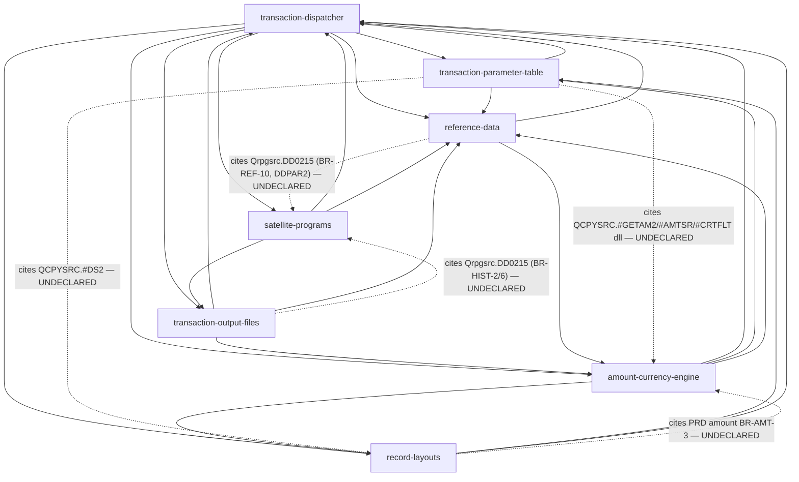

# F — Cross-Module Audit (KB TLTRAN as one system)

Lane F dari audit PRD knowledge-base `Host-AS400-Batch/.mega-sdd/knowledge-base/`. Semua klaim di bawah dicek langsung ke 7 PRD + README + data-mutation-policy + census.json, dan sebagian di-ground-truth ke source `TLTRAN/` + `FILE REF/` (read-only). Label: [VERIFIED] = dicek langsung; [INFERRED] = disimpulkan dari bukti; [NEEDS_VALIDATION] = butuh cek lanjutan; [UNKNOWN] = tidak bisa ditentukan dari artifact yang ada.

---

## 1. Verdict ringkas

KB ini **secara substansi sangat konsisten** — 139 BR, 51 gotcha, 40 OQ, 86 file census semuanya recount PASS, dan hampir semua cross-reference antar modul resolve. Yang bermasalah ada di **lapisan roll-up dan metadata**, bukan di isi:

1. **LOCKED count pecah tiga arah**: README bilang 5, data-mutation-policy cuma punya 4, marker `[LOCKED]` di body PRD juga 4 — dan distribusi per modulnya saling silang (dispatcher klaim 2 tapi nge-mark 1; TLTX klaim 1 tapi nge-mark 0; satellite klaim 1 tapi nge-mark 2). [VERIFIED]
2. **Prioritas OQ di README salah hitung**: klaim P1=9 / P2=20 / P3=11; recount dari tag [P1]/[P2]/[P3] di PRD = **P1=12 / P2=18 / P3=10**. OQ-DSPTCH-2 [P1] malah hilang total dari roll-up README. [VERIFIED]
3. **depends_on penuh cycle** — setiap modul ↔ dispatcher saling depends, plus amount↔reference-data. Klaim README "urutan rebuild mengikuti depends_on" tidak bisa diturunkan topologically dari graph yang dideklarasi. [VERIFIED]
4. **FILE REF/ (2026-09-04) mementahkan 3 OQ P1 penuh + ~6 partial** — TLFREF/GLFREF/RCFREF/CFFREF/SRFREF/JHFREF/BIFREF/RMFREF sekarang ada di disk (CDFREF/DDFREF/LNFREF duplikat byte-identik dengan yang di TLTRAN/ — dicek `cmp`). KB belum di-update untuk ini. [VERIFIED]
5. Satu temuan bukti-terlewat: layout **DDFLOT sebenarnya sudah ada** sebagai blok field di DDFREF:1802+ ("A* DDFLOT - FLOAT", field FLSTAT/FLTYPE/FLCATG/FLDDA7/FLDBAT/…) sejak ekstraksi — OUT gotcha #7 menandainya [OPEN] "tidak ada di source set". PF DDS-nya memang absen, tapi definisi field-nya recoverable. [VERIFIED]

Tidak ditemukan **konflik fakta bisnis** antar modul (angka 888, 250/251, 151, 222, basis 360/365, 8 slot kurs, 60 currency, suspense 9999999999 — semuanya konsisten lintas PRD dan cocok dengan source).

---

## 2. Conflicts (antar-dokumen)

| # | Topik | Dok A | Dok B | Sifat | Label |
|---|---|---|---|---|---|
| C1 | Total LOCKED | README §Mutability: **5** (dispatcher 2, TLTX 1, OUT 1, SAT 1) | data-mutation-policy: **4** field locked (accrued 2, IBT 1, hold 1); body markers PRD juga 4 (dispatcher 1 = BR-IBT-2; SAT 2 = BR-SAT-1/2; OUT 1 = BR-OUT-8; TLTX 0) | Frontmatter salah distribusi: SAT locked_count=1 padahal body 2; dispatcher=2 padahal body 1; TLTX=1 padahal body 0. Totalnya "kebetulan" 5 vs 4 | [VERIFIED] |
| C2 | Split prioritas OQ | README Stats: P1 9 / P2 20 / P3 11 | Tag di PRD: P1 **12** / P2 **18** / P3 **10** (total tetap 40) | README menghitung baris tabel (9 baris, salah satunya memuat 3 OQ) sebagai jumlah OQ; list P2/P3-nya sendiri cuma memuat 18/10 ID | [VERIFIED] |
| C3 | OQ-DSPTCH-2 [P1] | PRD dispatcher: ada, P1 (minta ekspor isi TLTX) | README roll-up: **tidak muncul di P1 maupun P2/P3** — satu-satunya OQ yang hilang dari roll-up | Kemungkinan dianggap duplikat OQ-TLTX-1, tapi tidak dinyatakan | [VERIFIED] |
| C4 | Daftar FREF yang "hilang" | README + OQ-REF-1: 7 file (TLFREF GLFREF RCFREF CFFREF SRFREF JHFREF BIFREF) | OQ-DSPTCH-3 minta "TLFREF/DDFREF/LNFREF/CDFREF/GLFREF/RCFREF/CFFREF/**RMFREF**"; OQ-TLTX-3 & OQ-OUT-2 juga menyebut DDFREF/LNFREF/CDFREF | DDFREF/LNFREF/CDFREF **sudah ada di folder** saat ekstraksi (reference-data §1 sudah mengoreksi ini, tapi OQ modul lain tidak di-sync); RMFREF disebut dispatcher tapi absen dari daftar README | [VERIFIED] |
| C5 | Layout DDFLOT | OUT gotcha #7 + OQ-OUT-2: "definisi field DDFLOT tidak ada di source set [OPEN]" | DDFREF:1802-1830 (file yang ADA di census) memuat blok `A* DDFLOT - FLOAT` dengan FLSTAT/FLTYPE/FLCIF#/FLBRAN/FLCATG/FLDDA7/FLDBAT — persis field key DDTFLT di BR-OUT-10 | Bukti terlewat saat ekstraksi; klaim [OPEN] terlalu keras (PF absen, field defs ada) | [VERIFIED] |
| C6 | JHDATC — prioritas ganda | OQ-SAT-1 **[P1]**: minta source JHDATC | OQ-DSPTCH-7 **[P2]**: pertanyaan yang sama (JHDATC) | Ask sama, prioritas beda; README menempatkan keduanya (SAT-1 di P1, DSPTCH-7 di P2) tanpa menandai duplikat | [VERIFIED] |
| C7 | Sitasi OQ-DSPTCH-7 | "qrpgsrc.tltran:138 via Qrpgsrc.DD0215:138" | tltran:138 adalah area definisi array aux (§BR-HARD-11), bukan call JHDATC; SAT §4 benar: DD0215:138, 204 | Bagian "tltran:138" tampak sitasi nyasar; juga JHDATC disebut "File" di sini vs "Program" di README & SAT | [NEEDS_VALIDATION] (baca tltran:138 utk pastikan) |
| C8 | Titik cabang 888 | BR-IBT-2: 10 baris tltran + #WRTGL:212,224 (12 titik) | data-mutation-policy: "10 titik di qrpgsrc.tltran; QCPYSRC.#WRTGL:212" — **:224 tidak disebut** | Ground truth grep: persis 10 di tltran + 2 di #WRTGL → BR-IBT-2 yang lengkap, policy kurang 1 sitasi | [VERIFIED] |
| C9 | Range sitasi rumus bunga | mutation-policy: DD0215:233-269 / CD0215:150-194 | BR-SAT-1: DD0215:243-267 / CD0215:161-191 | Overlap, blok sama, range beda — tidak fatal tapi dua "sumber kebenaran" untuk item LOCKED paling kritis sebaiknya identik | [VERIFIED] |
| C10 | Pointer OQ salah arah | TLTX §4.2 baris TLMBLn: `[OPEN→OQ-TLTX-6]` | TLMBLn dibahas di **OQ-TLTX-5**; OQ-TLTX-6 = gugus TEST | Pointer nyasar satu nomor | [VERIFIED] |
| C11 | Referensi dangling | record-layouts OQ-LAYOUT-2: "Silang ke **OQ-AMT-...**" (ellipsis literal) | Tidak ada OQ-AMT yang membahas gugus TEST; yang benar OQ-TLTX-6 | Satu-satunya referensi ID yang tidak resolve di seluruh KB | [VERIFIED] |

Bukan konflik (dicek, konsisten): kode 250/251 (dispatcher/OUT/SAT), kode 151 (SAT/OUT/DDHISTLA), batch recon 222, basis tahun 360/365, 8 slot kurs & 60 currency (BR-CUR-1 vs BR-REF-9), suspense 9999999999/999/999 (BR-HARD-3 vs BR-GL-1), SEQ3=0, "~200 baris" GL mati (≈ :1663-1858), dua-lapis parameter TLTX vs DDPAR3/LNPAR3/GLPAR3 (malah diwanti-wanti eksplisit di reference-data gotcha #2). [VERIFIED]

---

## 3. Terminology variants

| Konsep | Varian ditemukan | Lokasi | Status |
|---|---|---|---|
| Key TLTXRM | `RTTRCD`+`RTRCNO` (DDS) vs `RTTXCD`+`RTRECN` (KLIST program) | TLTX PRD §4.3 vs dispatcher PRD §4 | **Keduanya benar** — ground truth: DDS key = RTTRCD/RTRCNO (TLTXRM:33-34), program Z-ADD ke RTTXCD/RTRECN (tltran:711-712). Tidak ada PRD yang menjelaskan aliasnya → pembaca bisa mengira dua tabel [VERIFIED] |
| Servicing branch | `TLSVBR` vs `TLBSOV` ("TLBSOV→TLSVBR") | dispatcher §4 | Didokumentasikan sebagai mapping, konsisten [VERIFIED] |
| Cabang 888 | "self-service", "kanal", "DO IT", "kanal non-cabang", "cabang kanal" | dispatcher, README, policy | Merujuk hal yang sama; belum ada nama kanonik [VERIFIED] |
| TLTRAN | nama **program** vs anggapan awal nama file | README verdict + dispatcher §1 | Sudah dikoreksi eksplisit dua kali — bagus [VERIFIED] |
| DDFLOT vs DDTFLT | file donor format vs file output | OUT PRD | Dibedakan konsisten [VERIFIED] |
| Kapitalisasi member | `qrpgsrc.tltran` vs `Qrpgsrc.DD0215` vs `Qrpglesrc.DM91028` vs `QDDSSRC.*` vs `QCPYSRC.*` | semua PRD | **Sesuai nama file di disk** (disk-nya memang campur case) — KB faithful, bukan error [VERIFIED] |
| FREF baru | KB: `TLFREF` dst. vs disk: `FILE REF/qddssrc.TLFREF` (lowercase prefix, folder ber-spasi) | FILE REF/ | Perlu konvensi path saat KB di-update [VERIFIED] |
| "Kode transaksi" | teller (`TLTXCD`/`TLBTCD`, 4,0) vs produk (`TLCDn`/`TRANCD`/`L3TRAN`/`G3TRAN`) vs internal (151/222/250/251) | lintas modul | Tiga keluarga berbeda; reference-data gotcha #2 sudah memperingatkan — pertahankan [VERIFIED] |
| RMFREF | Dikira "remark FREF"? — aslinya "**Remittance** field reference file" | FILE REF/qddssrc.RMFREF:1 | Jangan sampai tim mengira ini referensi TLTXRM (field TLTXRM define inline, tidak butuh FREF) [VERIFIED] |

---

## 4. Roll-up recount (README claim vs hitung ulang)

| Item | README claim | Recount | Verdict |
|---|---|---|---|
| Member 86 / 19.115 baris | 86 / 19.115 | census 86 file ✓, Σ lines modul = 19.115 ✓, disk `ls TLTRAN` = 86 ✓ | PASS [VERIFIED] |
| Files per modul (19/20/2/16/6/16/7) | idem | census.json per modul cocok semua, Σ=86 | PASS [VERIFIED] |
| BR per modul 6/14/10/16/24/32/37 = 139 | 139 | Hitung ID per PRD: LAYOUT 6, REF 14, TLTX 10, OUT 10+6, SAT 13+6+5, DSPTCH 8+6+4+11+3, AMT 11+6+6+9+5 → **139** | PASS [VERIFIED] |
| Gotcha 5/6/6/7/9/9/9 = 51 | 51 | Hitung item §5 per PRD → **51** | PASS [VERIFIED] |
| OQ total 40 | 40 | 9+7+6+5+6+5+2 = **40**, ID unik semua | PASS [VERIFIED] |
| OQ split P1 9 / P2 20 / P3 11 | — | Tag PRD: **P1 12 / P2 18 / P3 10** | **FAIL** — lihat C2/C3 [VERIFIED] |
| Marker V 279 / I 62 / O 40 | — | Σ frontmatter per modul = 279/62/40 ✓; OPEN per modul = jumlah OQ per modul ✓ (9/7/6/2/5/6/5). VERIFIED/INFERRED tidak bisa di-recount independen dari body (konvensi "Confidence kosong = VERIFIED" tidak meninggalkan marker yang bisa di-grep) | PASS-terhadap-frontmatter; angka 279/62 sendiri [NEEDS_VALIDATION] |
| Mutability 5/334/12 | — | Σ frontmatter = 5/334/12 ✓ TAPI body `[LOCKED]` = **4** dan policy = **4** | **FAIL untuk LOCKED** — lihat C1 [VERIFIED] |
| "census gate PASS, 100% diklaim" | — | source_files frontmatter tiap PRD = persis daftar census modulnya (7/2/16/19/16/20/6) | PASS [VERIFIED] |
| Verdict hipotesis (4 klaim) | — | Sitasi kunci di-spot-check: TLTX chain :439-440 ✓, 888 ✓, KYTLRM :711-724 ✓ | PASS (sampling) [VERIFIED] |

---

## 5. ID audit

- **BR IDs**: 139 unik, 13 keluarga prefix (DSPTCH, ERR, IBT, HARD, RPV, TLTX, AMT, CUR, FLT, GL, MSC, OUT, HIST, REF, SAT, DATE, DM, LAYOUT), sekuensial tanpa gap, **tidak ada duplikat lintas modul**. [VERIFIED]
- **OQ IDs**: 40 unik, sekuensial per modul tanpa gap. [VERIFIED]
- **Gotcha**: tidak ber-ID — dirujuk lintas-dokumen sebagai "gotcha #N" (README critical #1/#3/#6/#7, opp #9). Semua rujukan ordinal resolve hari ini, tapi rapuh: sisipan satu gotcha menggeser semua rujukan. Rekomendasi: beri ID (G-SAT-3 dst.). [VERIFIED]
- **Referensi rusak**: hanya 1 — `OQ-AMT-...` di OQ-LAYOUT-2 (C11). **Referensi nyasar**: 1 — TLMBLn → OQ-TLTX-6 seharusnya OQ-TLTX-5 (C10). Semua rujukan BR lintas modul lainnya (BR-TLTX-5, BR-AMT-3/4/5/6/11, BR-IBT-2, BR-REF-12, BR-ERR-1, BR-DATE-2/3, BR-SAT-1/12, BR-DM-1, BR-GL-1, BR-DSPTCH-1/8, BR-CUR-1, BR-TLTX-4/6) resolve ke ID yang ada. [VERIFIED]
- **OQ duplikat-substansi** (ID beda, ask sama): OQ-DSPTCH-2 ≈ OQ-TLTX-1 (ekspor TLTX); OQ-DSPTCH-7 ≈ OQ-SAT-1 (JHDATC, beda prio); OQ-DSPTCH-3 ≈ OQ-TLTX-3 ≈ OQ-REF-1 (FREF — README sendiri menggabungkan bertiga dalam satu baris). Wajar untuk KB per-modul, tapi perlu tabel dedup saat dibawa ke meeting AS400. [VERIFIED]

---

## 6. Dependency map

Edge = `depends_on` frontmatter. Panah putus-putus merah = konsumsi nyata di body (sitasi file modul lain) yang **tidak dideklarasikan**.

Temuan:

1. **Cycle di mana-mana** [VERIFIED]: dispatcher↔{semua 6}, amount↔reference-data. `depends_on` di KB ini semantiknya "saling-merujuk", bukan build-order — sah untuk cross-reference, tapi README §Module quick reference mengklaim "urutan rebuild mengikuti depends_on (fondasi dulu)". Itu **tidak derivable** dari graph ini; urutan 1-7 di README adalah keputusan editorial (masuk akal, tapi harus diakui sebagai itu, atau depends_on dipecah jadi dua field: `references` vs `rebuild_after`).
2. **5 edge hilang** (dashed di atas). Paling material: TLTX→amount (kamus §4.2 TLTX menyandarkan kolom "Batch ✔" pada 9 copy-member milik amount) dan {REF, OUT}→satellite (klaim BR mereka disitasi dari DD0215). [VERIFIED]
3. Tidak ada edge fiktif (semua declared edge punya konsumsi nyata di body). [VERIFIED]

---

## 7. OQ triage — status setelah FILE REF/ (11 file, 2026-09-04)

Fakta dasar [VERIFIED]: `FILE REF/` berisi 11 DDS — **8 baru** (TLFREF 1476 baris, GLFREF, RCFREF, CFFREF, SRFREF, JHFREF, BIFREF, RMFREF) + **3 duplikat byte-identik** dari TLTRAN/ (CDFREF/DDFREF/LNFREF, dicek `cmp`). Catatan: **BIFREF bukan UTF-8** (kemungkinan EBCDIC/encoding lain) — perlu konversi sebelum dipakai. Spot-check TLFREF: TLTXCD 4,0 · TLBID 4S0 · TLXAFT ('Transaction Type') · TLXGTN · TLXGDD/GCD/GLN/GGL/GRC/GFL (COLHDG 'Generate * File') · TLXBED='Bypass Edits' · TLXSBL='Send F5 Response' · TLXDAY='Hold Days Field#' · TLXSEQ='Hold Seq# Field#' · TLMLDY 2S0 — semua ketemu.

| OQ | Prio (PRD) | Status pasca FILE REF | Catatan |
|---|---|---|---|
| OQ-DSPTCH-1 | P1 | still-open | Job stream/CL tetap tidak ada |
| OQ-DSPTCH-2 | P1 | still-open | Ekspor data TLTX; dup OQ-TLTX-1; hilang dari README roll-up (C3) |
| OQ-DSPTCH-3 | P1 | **answerable-from-FILE-REF** | Semua FREF yang diminta ada (TLFREF dst. + RMFREF) [VERIFIED] |
| OQ-DSPTCH-4 | P2 | still-open | Konfirmasi bisnis 888 |
| OQ-DSPTCH-5 | P2 | partially | TLXAFT terdefinisi (TLFREF:58, 2 char) tapi daftar nilai sah TIDAK ada VALUES di DDS [NEEDS_VALIDATION baca blok penuh] |
| OQ-DSPTCH-6 | P2 | still-open | Nasib record gagal validasi = proses lain |
| OQ-DSPTCH-7 | P2 | still-open | JHDATC = program, bukan FREF; dup OQ-SAT-1 (C6) |
| OQ-DSPTCH-8 | P3 | still-open | Butuh program lain pemakai copy member |
| OQ-DSPTCH-9 | P3 | partially | TLBID 4S0 'Teller ID' kini pasti (TLFREF:558); keunikan lintas cabang tetap pertanyaan bisnis |
| OQ-TLTX-1 | P1 | still-open | Ekspor isi tabel = data, bukan DDS |
| OQ-TLTX-2 | P1 | still-open | Pemakai lain TLTX |
| OQ-TLTX-3 | P1 | **answerable-from-FILE-REF** | TLFREF on disk — panjang/tipe ratusan field TLTX/TLLOG kini derivable [VERIFIED] |
| OQ-TLTX-4 | P2 | still-open | RTCPTP/RTBCAC define inline di TLTXRM (bukan referenced); RMFREF = remittance, tidak membantu [VERIFIED] |
| OQ-TLTX-5 | P2 | **largely answerable** | TLXBED/TLXSBL/TLXDAY/TLXSEQ punya COLHDG di TLFREF [VERIFIED]; sisa pertanyaan "masih dipakai siapa" tetap open |
| OQ-TLTX-6 | P3 | still-open | Butuh program lain + data |
| OQ-TLTX-7 | P3 | still-open | Kebijakan remark paralel |
| OQ-AMT-1 | P1 | still-open | Keputusan akuntansi pembulatan (19,2) |
| OQ-AMT-2 | P1 | still-open | Kejadian produksi float hilang |
| OQ-AMT-3 | P2 | still-open | FNDCUR pensiun? butuh program lain |
| OQ-AMT-4 | P2 | still-open | Arti bisnis slot kurs 6-8 (JHFREF tak menjawab makna bisnis) |
| OQ-AMT-5 | P2 | still-open | Prosedur monitoring akun buntu |
| OQ-AMT-6 | P3 | still-open | Kebijakan float LC→IB |
| OQ-OUT-1 | P1 | still-open | Program konsumen downstream tetap absen |
| OQ-OUT-2 | P2 | **partially** | Semua FREF diminta → ada; DDFLOT PF tetap absen TAPI field block-nya sudah ada di DDFREF:1802+ sejak awal (C5) |
| OQ-OUT-3 | P2 | still-open | Kamus kode internal 151/169/222/250/251 |
| OQ-OUT-4 | P3 | still-open | Pola baca konsumen SRTELT |
| OQ-OUT-5 | P3 | still-open | Mekanisme force-balance |
| OQ-REF-1 | P1 | **answerable-from-FILE-REF** | 7 file yang diminta lengkap; catat BIFREF perlu konversi encoding [VERIFIED] |
| OQ-REF-2 | P2 | still-open | Pemakai GLINT1 |
| OQ-REF-3 | P2 | still-open | Makna bisnis slot rate cadangan |
| OQ-REF-4 | P2 | still-open | Ownership UM90005 |
| OQ-REF-5 | P3 | still-open | Validasi rekening di online? |
| OQ-REF-6 | P3 | partially | SRFREF kini ada → daftar VALUES status SR bisa dicek [NEEDS_VALIDATION]; DDMAST via DDFREF sudah ada dari awal |
| OQ-SAT-1 | P1 | still-open | JHDATC (program) tetap absen |
| OQ-SAT-2 | P1 | still-open | Konfirmasi akuntansi bunga harian |
| OQ-SAT-3 | P2 | still-open | Produk basis 360 |
| OQ-SAT-4 | P2 | still-open | Kebijakan multiple-tier bypass |
| OQ-SAT-5 | P2 | still-open | Arti interface 23/30 |
| OQ-LAYOUT-1 | P2 | partially | TLFREF mendefinisikan TLXDCK/TLXRTN/TLXDP* → dugaan tukar-nama #DS7 bisa diadjudikasi dari COLHDG [NEEDS_VALIDATION] |
| OQ-LAYOUT-2 | P3 | still-open | Butuh program luar source set (+ perbaiki ref dangling C11) |

**Skor**: 3 P1 tuntas (DSPTCH-3, TLTX-3, REF-1), ~6 partial (DSPTCH-5, DSPTCH-9, TLTX-5, OUT-2, REF-6, LAYOUT-1), 31 tetap open. P1 efektif tersisa **9 dari 12** — dan itu pun 2 pasang duplikat (DSPTCH-2/TLTX-1, DSPTCH-7≈SAT-1 beda prio), jadi ask unik yang benar-benar memblokir ≈ 8. KB butuh pass update: tutup 3 OQ, downgrade/rescope 6, ubah baris "Yang TIDAK ada di folder" di README (baris DDS FREF sudah tidak berlaku).

---

## 8. Mutation-policy audit

**Traceability 5 → 4 item LOCKED** (lihat C1 — cuma 4 yang nyata):

| Policy row | Bukti | Verdict |
|---|---|---|
| accrued-interest.calculation-method (DD0215:233-269, CD0215:150-194) | BR-SAT-1 [LOCKED] cites DD0215:243-267 / CD0215:161-191 — blok sama, range beda (C9) | TRACES [VERIFIED] |
| accrued-interest.year-basis (YEARCD=2→360 else 365) | BR-SAT-2 [LOCKED], DD0215:249-253/263-267 — cocok persis | TRACES [VERIFIED] |
| interbranch-clearing.excluded-branch (TLSVBR≠888) | Ground truth grep: 10 titik tltran + #WRTGL:212,224 — policy kurang sitasi :224 (C8) | TRACES (sitasi minus 1) [VERIFIED] |
| deposit-hold-record.seq3 (SEQ3=0) | BR-OUT-8 [LOCKED], DDTELS:6 + tltran:931/974 | TRACES [VERIFIED] |
| *(item ke-5 versi README)* | Tidak ada di policy, tidak ada marker body | **TIDAK ADA** — frontmatter drift [VERIFIED] |

**Kelengkapan vs Critical Findings README** (harusnya money-math kritis ⊆ policy):

- Critical #1 (bunga harian) → covered LOCKED ✓.
- Critical #2 — **pembulatan (19,2) BR-AMT-6/7 tidak disentuh policy sama sekali** [VERIFIED]. PRD menandainya do-not-replicate (departure), tapi OQ-AMT-1 (P1) belum dijawab — artinya keputusan lock-vs-fix masih menggantung di stakeholder. Policy seharusnya punya baris "departure-pending-OQ" untuk ini; sekarang seorang rebuilder bisa membaca policy dan tidak tahu ada isu pembulatan uang. Ini gap paling material di policy. [INFERRED]
- Critical #4 (suspense 9999999999) & #6 (BR-DM-1 huruf-pertama→akun GL) — perilaku routing uang, tidak ada di policy; PRD konsisten menyarankan keep-with-alert / do-not-replicate, jadi bukan konflik, tapi policy diam. [VERIFIED]
- loan-payment-reversal INTENT "DORC-terbaru-dulu setara" selaras dengan BR-HIST-1/OUT gotcha #3 (DESCEND) ✓.
- ARTIFACT: policy 3 baris discardable (memo-post, TEST groups, error-slots) vs frontmatter total ARTIFACT **12** — 9 kolom artifact lain (mis. TLTXRM filler, #DS23/#DS24, BR-ERR-6 EDT buffer, BR-CUR-6 FNDCUR) tidak masuk policy. Policy memang entity-level, tapi "How rebuild teams use this file" butir 4 menyuruh konfirmasi `[ARTIFACT]` per kolom — daftarnya tidak lengkap di satu tempat. [VERIFIED]

**Rekomendasi policy**: (a) rekonsiliasi angka LOCKED jadi 4 (atau tambah item ke-5 yang eksplisit); (b) tambah baris BR-AMT-6/7 sebagai departure-gated-by-OQ-AMT-1; (c) samakan range sitasi dengan BR-SAT-1; (d) lengkapi sitasi #WRTGL:224; (e) lampirkan daftar lengkap 12 ARTIFACT atau tunjuk ke PRD-nya.

---

*Lane F selesai 2026-09-05. Ground-truth checks: census vs disk (86 ✓), cmp 3 FREF duplikat, grep 888/KYTLRM/TLFREF/RMFREF/DDFLOT, baca TLTXRM DDS penuh.*
