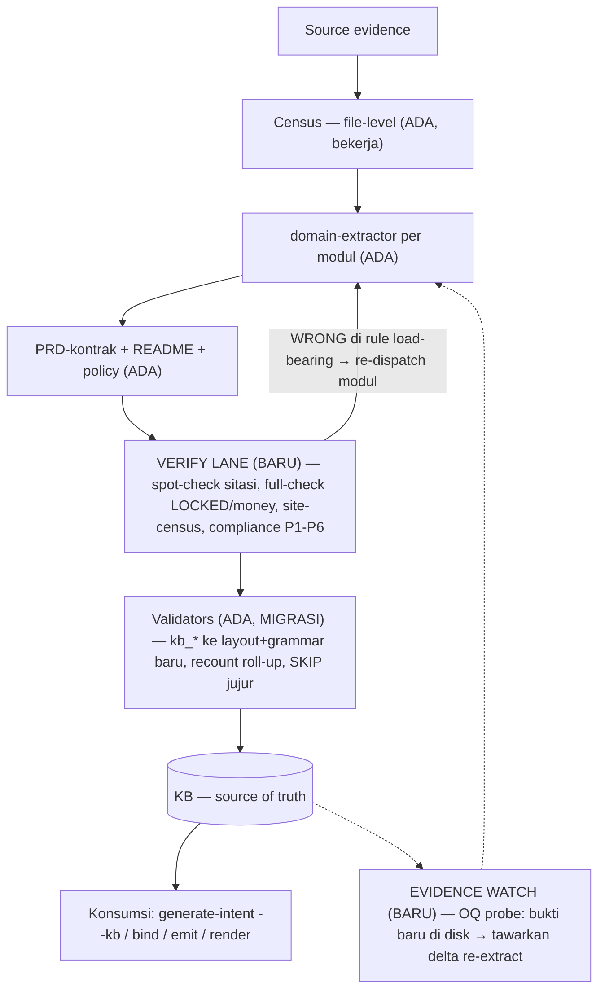

# Mega-SDD Skill-Gap Analysis — dari audit KB Host-AS400-Batch

**Tanggal:** 2026-09-05 · **Input:** `research/2026-09-05-hostas400-kb-audit.md` (+ 6 lane di `2026-09-05-hostas400-kb-audit/`) · **Objek:** pipeline mega-sdd (extract → analyze → KB → konsumsi SDD), BUKAN sekadar KB-nya.
**Status:** analisis + backlog. Belum ada implementasi — per kebiasaan repo: research → spec → phased ship, tiap fase di-gate owner.

---

## 0. Dua fakta pembuka (diukur, bukan kesan)

1. **Audit adversarial itu murah.** 6 lane audit = **±1,12M token subagent** (130k+198k+183k+202k+222k+188k), ~13 menit wall (paralel). **KOREKSI (2026-09-05, setelah baca `.token-cost-state.json` Host):** angka 13,0M cost-weighted yang sempat gue sebut "biaya chain extraction" itu SALAH — breakdown `by_skill`-nya = `(main-thread)` 4,6M + `generate-intent` 4,1M + `resolve-oq` ×6 turn 3,4M + `enrich-semantics` 0,9M, `subagent_turns: 0` → window itu fase INTENT+OQ pasca-extraction, bukan extraction. **Biaya extraction sendiri tidak terekam** (`TOKEN-COST-REPORT.md` di Host = 0 byte — bug report-writer, masuk backlog). Klaim yang tetap berdiri: verifikasi read-only per modul itu kelas ±150-220k token/modul (terukur dari lane audit) — affordable; klaim rasio "<10% biaya extraction" DITARIK sampai extraction di-instrument. Pelajaran ronde adversarial repo ini berlaku ke gue sendiri: *measure the number LAST*.
2. **KB yang diaudit TIDAK PERNAH tervalidasi, dan report bilang PASS.** `CONSISTENCY-REPORT.md` Host: "Overall PASS — 1 PASS / 0 FAIL / 9 SKIP of 26"; `kb_output`/`kb_citations`/`kb_flows`/`kb_markers` semua SKIP "no applicable files found" — padahal ada 7 PRD. Direproduksi di sandbox: validator jalan → **FAIL keras** (marker-count drift + schema mismatch). Detail di §V.

---

## A. Current PRD Health (ringkas — detail di laporan audit)

Substansi kuat: 88 sitasi spot-check → 70% EXACT, **0 fabricated**; census file-level CLEAN 100%; nol konflik fakta bisnis antar modul; disiplin `[INFERRED] (dasar:)` nyata. Cacatnya terkonsentrasi di 4 kelas: (1) 8 klaim WRONG — beberapa arah-uang (TLXGTN & BR-FLT-3 kebalik; "pembulatan" harian ternyata truncation); (2) perilaku termahal justru lolos (matriks IBT 4-leg, state-basi CD0215/DD0215, silent-skip, FNDCUR mati); (3) `FILE REF/` (bukti baru) tidak terdeteksi + 2 jawaban OQ ternyata sudah ada di disk sejak ekstraksi; (4) lapisan roll-up/metadata drift (LOCKED 5-vs-4, split OQ salah, frontmatter counts). Testability 0/7 PASS (tidak ada acceptance layer). Traceability & AI-readability 7/7 PASS.

## B–D. System Knowledge Model, PRD Schema, Entity Model

**Schema per-proyek** sudah dijawab di laporan audit §7 (grammar 6-section KEPT + 7 upgrade tertarget). Di level mega-sdd, model entitas PRD-kontrak hari ini = `Module → BR / gotcha / OQ / flow / data-in-out / marker / tier` — dan audit menunjukkan itu **cukup** untuk hampir semua isi; yang bolong bukan tipe entitas eksotis, tapi **empat relasi + dua entitas**:

| Kebutuhan (dari temuan riil) | Status di mega-sdd | Bukti |
|---|---|---|
| Entitas **AC (acceptance criteria)** per BR, dengan status `blocked-by-OQ` | Tidak ada di grammar | Testability 0/7; mandat golden-master pilot multifinance sudah searah |
| Entitas **Kontrak operasional run-level** (trigger, window, restart, state antar panggilan) | Tidak ada section-nya — info tercecer di BR/OQ | Silent re-process NDP saat rerun window; `*CLOSE`; CD0215 stateful |
| Relasi **BR → site** (semua lokasi WRITE/CALL/read yang mengimplementasikan rule) | Prosa P2 di agent, tanpa obligasi mesin | Site CFTPNT ke-4 & 4 site CRTFLT lolos |
| Relasi **OQ → evidence-probe** (pola yang, kalau match di disk, artinya OQ answerable) | Tidak ada | FILE REF nganggur 1 hari; DDFLOT & STATUS 0-9 sudah ada sejak awal, kelewat |
| Relasi **references vs rebuild_after** (dua semantik dipaksa satu field `depends_on`) | Satu field, cycle di mana-mana | Klaim "urutan rebuild ikut depends_on" tidak derivable |
| Relasi **flow-node → BR/marker** (node flow yang menyebut komponen [ARTIFACT]-mati) | Tidak dicek | Flow amount menggambar FNDCUR hidup, BR-CUR-6 di dokumen yang sama bilang mati |

ID scheme yang ada (BR-/OQ- per modul, unik lintas KB — diverifikasi lane F) **dipertahankan**; jangan tambah birokrasi REQ-. Tambahan minimal: gotcha ber-ID (`G-<MOD>-n`), AC ber-ID (`AC- -n`).

## E. Extraction Gaps (informasi yang gagal tertangkap)

Dipetakan ke lapisan §22-nya prompt:

- **Struktural: NYARIS SEMPURNA.** Census file-level bekerja (86/86, sha256). Gap struktural satu-satunya: file yang DIKLAIM modul tapi tidak DIMINING isinya (DDFREF diklaim reference-data, blok DDFLOT:1802+ & STATUS:81-92 tidak dikonsumsi) — census menjamin *membership*, bukan *konsultasi*.
- **Behavioral: gap terbesar.** Yang lolos semuanya satu keluarga: *perilaku yang baru kelihatan kalau semua cabang/site dijalankan sistematis* — matriks IBT (4 blok kondisi region×tipe×888), state antar panggilan (RETRN tanpa LR), silent-skip non-NDP, threshold hold, guard asimetris loop-1 vs loop-2 DD0215. Disiplin P1-P3/P6 di `agents/domain-extractor.md` SUDAH memerintahkan ini — pelanggarannya tidak terdeteksi karena tidak ada verifikasi kepatuhan. **Ini doktrin kita sendiri kena di kandang sendiri: prose enforces nothing.**
- **Bisnis: bagus** (139 BR, vocabulary domain, mutability tier) — dengan 8 salah-baca semantik (kelas dominan: **kondisional negatif** `IFNE`/inversi, dan **intent-vs-executed**).
- **Operasional: strukturnya belum ada rumah** (lihat B–D) — sebagian memang [UNKNOWN] (CL absen) tapi absence-nya tidak dinyatakan di satu tempat.
- **Integrasi: jujur di-OQ-kan** (downstream consumers) — benar, bukan gap.

Perkiraan kasar survival rate informasi relevan → PRD: struktural ~98%, bisnis ~90% (dengan 9% salah-arah di sampel), behavioral bercabang-dalam mungkin ~60-70%, operasional run-level ~30%.

## F. Reasoning / Transformation Gaps (terekstrak tapi rusak di jalan)

1. **Flow §3 dikarang terpisah dari BR §2** — FNDCUR: BR-CUR-6 benar ([ARTIFACT], mati), flow menggambar hidup. Ekstraksi TAHU faktanya; generator flow tidak membacanya.
2. **README roll-up dihitung tangan dari frontmatter yang juga diketik tangan** — drift dobel (LOCKED 5-vs-4; split P1 salah; OQ-DSPTCH-2 hilang dari roll-up).
3. **REPORT BACK counts (verified:/inferred:/…) diketik agent** → frontmatter tidak bisa direkonsiliasi di 4+ modul. Konvensi "tanpa marker = verified-by-citation" membuat angka ini *tidak mungkin* diverifikasi dari body — angka yang tidak bisa diverifikasi seharusnya tidak diklaim.
4. **Scoping legalistik menyamarkan fakta**: BR-REF-13 "tidak di-CHAIN oleh tltran/copy member" — benar per huruf, salah per semangat (satelit CHAIN DDMAST/CDMAST). Transformasi "temuan → kalimat rule" butuh rail "klaim negatif wajib menyebut scope ATAU di-sweep seluruh source set".

## G + V. Validation Gaps (yang paling material — dan sudah direproduksi)

**Temuan pusat: extract revamp v7.6.0 mengganti layout (`knowledge-base/modules/*.prd.md`) + grammar (6 section, implicit-verified) — dan validator KB tidak ikut dimigrasi.** Direproduksi hari ini di sandbox (copy KB Host, jalankan manual):

- `run-analyze.sh` menemukan file KB HANYA di `10-domains/ | 20-workflows/ | 40-business-rules/` (layout pensiun) → 4 surface `validate-kb.sh` SKIP "no applicable files found" pada tree yang punya 7 PRD.
- Dijalankan paksa pada PRD dispatcher: **FAIL** — `kb_marker_count_mismatch` ×4 (persis drift yang audit temukan) + `kb_sections_incomplete` "missing 5 of 11" (validator masih meng-expect grammar 11-section lama; PRD 6-section yang VALID divonis salah).
- Aggregate menampilkan SKIP netral dan **Overall: PASS** → KB tak tervalidasi dilaporkan sehat. "SKIP karena memang tidak ada subjek" vs "SKIP karena saya tidak bisa melihat subjeknya" tidak terbedakan.

Konsekuensi: sebagian temuan audit (counts drift, [VERIFIED]-tanpa-sitasi-kelas, mermaid §3) itu **defect yang validator-nya sudah ada dan akan menangkap** — kalau saja jalan. Ini bukan gap desain; ini **gap migrasi konsumen** — kelas pelajaran yang sudah ada di repo (pins-both-trees, relocate-then-delete) tapi belum jadi checklist rilis: *perubahan grammar/layout produser wajib menyapu SEMUA konsumen (validator, glob analyze, renderer, reader downstream)*.

Gap validasi lain (belum pernah ada, bukan rusak): claim-verification (§H-1), site-census (§H-2), roll-up recount, OQ evidence-probe, flow↔BR lint, citation-derived depends_on check.

## H. Mega-SDD Skill Gaps → matriks issue → gap

| # | Issue (audit) | Dampak | Stage | Root cause | Gap skill/mekanisme | Sev |
|---|---|---|---|---|---|---|
| 1 | 8 klaim WRONG (2 arah-uang) | AI port salah arah uang | Extraction-interpretasi | Single-pass, single-author; tak ada re-check | **Tidak ada claim-verification lane** (spot-check sitasi + full-check untuk [LOCKED]/money-class) | **P0** |
| 2 | Analyze PASS di KB tak tervalidasi | Rasa aman palsu sistemik | Validation | Revamp producer tanpa migrasi consumer | Glob `run-analyze.sh` + schema `validate-kb.sh` stale; SKIP tidak jujur | **P0** |
| 3 | IBT matrix / state-basi / silent-skip lolos | Loss pemahaman materiil | Extraction-depth | Disiplin P1-P3/P6 = prosa tanpa verifikasi | Tidak ada obligasi mesin per-site/per-branch; tak ada compliance check | **P1** |
| 4 | Frontmatter counts & README roll-up drift | Metadata tak bisa dipercaya | Generation | Angka diketik tangan (agent + controller) | Counts tidak machine-derived; tidak ada recount gate | **P1** |
| 5 | FILE REF nganggur; DDFLOT/STATUS sudah ada tapi [OPEN] | OQ P1 palsu-buka | Maintenance + Extraction-konsumsi | OQ tanpa probe mesin; census = membership bukan konsultasi | **OQ evidence-probe** + deteksi "answerable-from-disk" di analyze | **P1** |
| 6 | Kelas salah-baca RPG (IFNE, kolom-7, opcode-nempel, indicator, data area, RETRN-stateful) | Sumber #1 dan #3 | Extraction | Tidak ada pack AS400/RPG — stack idiom table belum punya barisnya | **Pack `rpg-as400`** (framework-conventions + MASTER STACK IDIOM rows) | **P1** |
| 7 | depends_on cycle + 5 edge tak dideklarasi | Rebuild order tak derivable | Modeling | Satu field dua semantik | Split `references`/`rebuild_after` + validator edge-dari-sitasi | P2 |
| 8 | Flow §3 kontradiksi BR §2 (FNDCUR) | Pembaca flow-only mem-port kode mati | Generation | Flow tidak membaca marker BR | Lint flow-node vs [ARTIFACT]/mati (advisory) | P2 |
| 9 | Testability 0/7 | AI tak bisa self-verify hasil port | Grammar | Tak ada AC layer | Section AC + golden-master + `blocked-by-OQ` | P2 |
| 10 | Rule multi-kondisi = prosa | 4/10 rule top tak implementable | Grammar + agent | Tak ada mandat bentuk | Decision-table mandate (≥3 kondisi) + lint advisory | P2 |
| 11 | Klaim negatif scoping legalistik (BR-REF-13) | Salah keputusan arsitektur | Extraction-transformasi | Rail klaim-negatif belum ada | Rail: negative claim = full-sweep atau scope eksplisit di kalimat | P2 |
| 12 | Gotcha tanpa ID; OQ duplikat lintas modul; BIFREF non-UTF8 | Friksi kecil | Grammar / census | — | ID gotcha; tabel dedup OQ di roll-up; probe encoding di census | P3 |

**Pembelaan yang jujur atas yang SUDAH benar** (jangan dirusak saat memperbaiki): census file-level (bekerja sempurna, satu-satunya gate deterministik extraction — perluas, jangan ganti); disiplin sitasi inline (70% EXACT, 0 fabricated — moat #5 terbukti hidup); `[INFERRED] (dasar:)`; mutability tiers; kb-leak-scan; halt taxonomy.

## I. Proposed Skill Architecture

Pipeline konseptual §28 prompt ≈ yang sudah ada. Yang hilang **satu layer + satu loop**, bukan rearsitektur:

Bentuk implementasi verify lane = **subagent read-only kelas reviewer** (pola panel execute-bolts yang sudah ada — blind, findings-only, severity-graded), BUKAN skill baru di surface publik: nempel sebagai fase dalam `extract-intelligence` setelah quality gate per-modul. Enforcement-nya: hasil verify ditulis deterministik (`verify-state.json` per modul) dan **census gate diperluas** membacanya — sejalan doktrin gates > rules > hooks (ini gate dalam skill, bukan hook baru; tidak menambah hot-path PreToolUse).

## J. Validation Gates (definisi ringkas per gate)

| Gate | Purpose | Input | Logic | Fail | Sev |
|---|---|---|---|---|---|
| **kb-migrated** (perbaikan #2) | KB modules/ tervalidasi lagi | `knowledge-base/modules/*.prd.md` | glob baru + schema 6-section + konvensi implicit-verified (hitung [INFERRED]/[OPEN]/tier saja; verified = klaim tersitasi tanpa marker) | schema/citation/mermaid rusak | BLOCK di extract handoff; FAIL di analyze |
| **skip-honesty** | SKIP ≠ tak terlihat | daftar validator + subject-glob deklaratif | subjek ADA tapi validator 0 applicable → `validator_misconfigured` | mismatch subjek-vs-applicable | FAIL (bukan SKIP) |
| **claim-verify** | klaim salah ketangkep sebelum jadi source of truth | PRD + source | sample N sitasi/modul (grade EXACT/IMPRECISE/WRONG) + 100% untuk [LOCKED] & BR uang | WRONG pada load-bearing → re-dispatch modul (1×), lalu halt | BLOCK |
| **site-census** | relasi BR→site lengkap | idiom table per stack (WRITE/CALL/read sites) | tiap site hasil derivasi mesin harus muncul ≥1 sitasi di KB | site tak tersitasi | FAIL→[OPEN] jujur |
| **rollup-recount** | README/frontmatter = fakta | PRD + README + policy | recount BR/OQ/gotcha/tier/prioritas dari body; bandingkan | drift angka | FAIL |
| **oq-probe** | OQ tidak palsu-buka | OQ + `probe:` (glob/grep) | probe match di tree → `oq_answerable_from_disk` | match | ADVISORY (tawarkan delta) |
| **flow-br-lint** | flow tidak menghidupkan yang mati | §3 nodes + marker body | node menyebut item ber-[ARTIFACT]/mati | match | ADVISORY |
| **deps-derived** | depends_on jujur | sitasi lintas-modul | edge dari sitasi ⊆ declared references | edge tak dideklarasi | ADVISORY |

## K. Improvement Backlog (prioritas)

**P0 — AI bisa salah materiil / rasa aman palsu:**
1. **Migrasi validator KB** ke layout `modules/` + grammar 6-section + implicit-verified (`run-analyze.sh` globs, `validate-kb.sh` 4 surface). *Validation method:* jalankan pada copy KB Host → wajib menangkap counts-drift & TIDAK memvonis 6-section valid sebagai incomplete. (Sekalian sapu glob legacy lain — memory doc-audit sudah mencatat "GROUND globs" sekelas.)
2. **SKIP-honesty di aggregate analyze** (subject-glob deklaratif per validator). *Validation:* CONSISTENCY-REPORT Host tidak boleh lagi PASS dengan 4 kb_* SKIP.
3. **Claim-verify lane di extract-intelligence** (subagent reviewer read-only per modul; 100% [LOCKED]+money-class, sample sisanya; state deterministik dibaca census gate). *Validation:* re-run pada fixture ber-seeded-error (tanam TLXGTN-class inversion) → wajib ketangkep; biaya diukur ≤15% extraction.

**P1 — loss pemahaman signifikan:**
4. Counts machine-derived (script hitung dari body; REPORT BACK agent tidak lagi memuat angka yang tak bisa diverifikasi) + rollup-recount gate.
5. Site-census (perluasan `validate-extract-census.sh`): derivasi WRITE/CALL-site per idiom stack → obligasi sitasi. 
6. OQ `probe:` + deteksi answerable-from-disk (analyze advisory + tawaran delta re-extract — nyambung lane delta 6.7.0 yang sudah ada).
7. **Pack `rpg-as400`** — baris idiom: fixed-format opcode-nempel (grep naif = false negative), kolom-7 `*` dead-code, `IFNE`-inversion checklist, indicator double-duty, external data-area (`*NAMVAR`/`IN`), RETRN-tanpa-LR = stateful antar panggilan, `REF()/REFFLD` chasing ke *FREF, probe encoding non-UTF8. (Mekanisme pack SUDAH ada — ini isi, bukan infrastruktur baru.)
8. Rail compliance P2/P3 di verify lane (checklist: site-enumeration & as-executed untuk program stateful).

**P2 — kualitas/konsistensi:**
9. `depends_on` → `references` + `rebuild_after` (+ deps-derived advisory).
10. Grammar: decision-table mandate; AC layer (`AC- -n`, golden-master, `blocked-by-OQ`); section kontrak operasional (conditional, workflow modules); rail klaim-negatif.
11. flow-br-lint advisory.

**P3:** gotcha IDs; tabel dedup OQ di roll-up; encoding probe census; kalibrasi kata "pembulatan/truncation" di glossary output-language (istilah finansial presisi); **fix TOKEN-COST-REPORT.md kosong** (state JSON terisi, report 0 byte — dan tanpa report, biaya per-fase chain ga bisa diaudit; prasyarat kerja cost apa pun = instrument dulu, potong belakangan).

**Standing policy (release checklist):** perubahan grammar/layout producer ⇒ sweep konsumen terdaftar (validator + glob + renderer + reader `generate-intent --kb`/`bind`) sebelum rilis — tambah baris di CLAUDE.md release section.

## L. Target State

KB hasil extract berstatus *source of truth* hanya bila: (1) census file-level PASS **dan** claim-verify PASS (zero WRONG di load-bearing); (2) semua angka roll-up hasil hitung mesin; (3) setiap OQ punya probe atau alasan kenapa tidak bisa; (4) analyze tidak pernah menampilkan PASS bila ada validator yang tidak bisa melihat subjeknya; (5) benchmark regresi: KB Host-AS400 + audit ini jadi golden — pipeline baru di-re-run di fixture yang sama, diaudit dengan rubrik 10-dimensi yang sama, dan wajib menang di Accuracy/Completeness tanpa mengorbankan Traceability (yang sudah 7/7).

## Split anti-overfitting (§27)

- **Universal:** semua P0; counts machine-derived; site-census (mekanisme — idiom per stack dari pack); OQ probe; deps split; decision-table & AC grammar; rail klaim-negatif; standing policy sweep konsumen; flow-br lint.
- **Domain (AS400/batch/legacy):** SELURUHNYA masuk pack `rpg-as400` + baris MASTER STACK IDIOM — tidak ada satu pun yang boleh masuk skill body (kontrak tech-agnosticism CLAUDE.md). Kelas "program stateful antar panggilan" sebenarnya setengah-universal (singleton/DI-cache di stack modern) — taruh disiplinnya universal, idiom deteksinya per-pack.
- **Project-specific (tinggal di KB Host):** TLMAST, 888, keputusan state-basi, guard-M CS/RC, semua isi Fase 0-2 laporan audit.

## Jawaban 16 pertanyaan sukses (§32)

1-6 → laporan audit §2-§4 (isi sistem, yang diketahui/tidak/salah/ambigu/undocumented). 7 → §E-G di sini (single-pass tanpa verify; disiplin prosa tanpa enforcement; validator tak termigrasi; angka diketik tangan; OQ tanpa probe). 8 → matriks §H (per issue → stage → skill). 9-10 → §B-D. 11 → §G+J. 12 → laporan audit §7. 13-14 → §Split di atas. 15 → P0-1..3 (urutan: migrasi validator dulu — termurah, mengaktifkan kembali deteksi yang sudah dibangun; lalu SKIP-honesty; lalu verify lane). 16 → §L butir 5: fixture Host + rubrik audit = harness eval; seeded-error fixture untuk verify lane; ukur EXACT-rate & WRONG-count sebelum/sesudah.

---

*Metode: temuan audit + baca langsung `run-analyze.sh` / `validate-kb.sh` / `validate-extract-census.sh` / `agents/domain-extractor.md` / `prd-kontrak-template.md` + reproduksi validator di sandbox scratchpad (bukan di worktree Host). Klaim biaya dari usage subagent sesi ini + TOKEN-COST report chain Host.*
