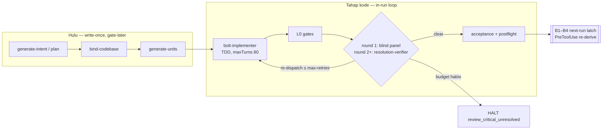

# Agent loop, `/goal`, dan run-bounding — posisi mega-sdd (2026-09-20)

**Pertanyaan owner:** (1) apakah skills mega-sdd udah pakai *agent loop*? (2) `/goal` itu apa dan kepake nggak buat kita? (3) gimana bikin mega-sdd secepat + sehemat token mungkin, **tanpa over-run / over-usage**?

**Metode:** 2 agent riset docs resmi (klaim kunci di-fetch ulang + dikutip verbatim di bawah), 1 sweep codebase (35 tool call, semua `file:line`), spot-check manual atas cap/hook yang load-bearing. Path relatif ke `plugins/mega-sdd/` kecuali disebut lain.

**Verdict singkat:** loop = **YA di tahap kode, TIDAK di hulu** (dan itu sebagian besar by design). Risiko over-run yang nyata bukan "kurang loop" tapi **cap yang cuma prosa** — cuma 1 dari ±10 cap yang dihitung ulang script. `/goal` berguna sebagai **resep pemakaian**, bukan fitur plugin.

## Contents

- [1. Agent loop menurut Anthropic](#1-agent-loop-menurut-anthropic)
- [2. `/goal` — fakta terverifikasi](#2-goal--fakta-terverifikasi)
- [3. Peta loop mega-sdd](#3-peta-loop-mega-sdd)
- [4. Run-bounding — apa yang beneran nahan over-run](#4-run-bounding--apa-yang-beneran-nahan-over-run)
- [5. Lever efisiensi — diranking pakai evidence](#5-lever-efisiensi--diranking-pakai-evidence)
- [6. Koreksi atas klaim riset](#6-koreksi-atas-klaim-riset)

## 1. Agent loop menurut Anthropic

Sumber: `code.claude.com/docs/en/how-claude-code-works` §The agentic loop (verbatim):

> "When you give Claude a task, it works through three phases: **gather context**, **take action**, and **verify results**. These phases blend together." … "Each tool use returns information that feeds back into the loop, informing Claude's next decision."

Yang bikin loop *sehat* (best-practices §Give Claude a way to verify its work): sinyal pass/fail yang bisa dibaca di percakapan ("a test suite, a build exit code, a linter…"), lalu pilih seberapa keras check itu nahan stop — 4 tingkat, verbatim:

> "**In one prompt** … **Across a session**: set the check as a `/goal` condition … **As a deterministic gate**: a Stop hook runs your check as a script and blocks the turn from ending until it passes. Claude Code overrides the hook and ends the turn after 8 consecutive blocks. **By a second opinion**: a verification subagent … has a fresh model try to refute the result, so the agent doing the work isn't the one grading it."

Pola "second opinion" = *evaluator-optimizer* di "Building effective agents". Peringatan resmi yang relevan buat panel kita: "A reviewer prompted to find gaps will usually report some, even when the work is sound … Chasing every finding leads to over-engineering" → persis alasan ledger kita misahin `open` (Critical / spec ❌) dari `advisory`.

## 2. `/goal` — fakta terverifikasi

Sumber: `code.claude.com/docs/en/goal` (di-fetch 2026-09-20).

| Aspek | Fakta (verbatim / ringkas) |
|---|---|
| Apa | "sets a completion condition and Claude keeps working toward it without you prompting each step." Satu goal aktif per session; `/goal` (status), `/goal clear` (+alias `stop|off|reset|none|cancel`); kondisi ≤ 4.000 char. |
| Mekanisme | "`/goal` is a wrapper around a session-scoped prompt-based Stop hook." Tiap akhir turn, kondisi + percakapan dikirim ke *small fast model* (default Haiku) → verdict **Not yet met / Met / Impossible**. |
| Evaluator buta tool | "It does not call tools, so it can only judge what Claude has already surfaced in the conversation." → kondisi harus sesuatu yang **output Claude sendiri bisa buktiin**. |
| Biaya | "typically negligible compared to main-turn spend" (ditagih di small fast model). |
| Berhenti | Met · Impossible · error yang harus user fix (auth, kredit habis, context overflow, model unavailable) · `/goal clear` · **no-progress**: "no tool use for several turns in a row" → loop distop, goal tetap ke-set. |
| Batas durasi | **Tidak ada cap bawaan.** "To bound how long a goal runs, include a turn or time clause in the condition, such as `or stop after 20 turns`." |
| Background work | Subagent / background shell masih jalan → evaluasi turn itu di-skip; check-in tiap 30 m (backoff), maks 3 idle check-in. |
| Headless | `claude -p "/goal <kondisi>"` jalan sampai selesai dalam satu invocation. |
| Programatik | **User-typed only** — nggak ada frontmatter / settings / API buat plugin nge-set goal. |
| Syarat | Ikut aturan trust hooks; mati kalau `disableAllHooks: true` / `allowManagedHooksOnly`. |

**Implikasi buat mega-sdd:**

1. **Bukan fitur plugin.** Nggak bisa di-set dari skill/hook → jalurnya cuma **resep pemakaian** (docs), nol surface baru.
2. **Bahaya spesifik kita: goal vs halt.** Halt always-stop artinya session *memang harus* berhenti nunggu manusia. Evaluator yang cuma lihat "belum selesai" bakal nyuruh Claude lanjut → tekanan buat nge-bulldoze halt prosa (udah terukur: prose-halt ke-bulldoze 1/4 run headless, `research/2026-07-20-fork-ab-headless-attempt.md`). Gate PreToolUse tetep nahan (deterministik), tapi token kebakar di percobaan yang ditolak. **Kondisi goal WAJIB nyebut halt sebagai terminal state.**
3. **Kondisi harus nempel ke output script**, bukan penilaian: evaluator cuma baca transcript, jadi sinyalnya = output `derive-state.sh` / handoff YAML `status:` / `CONSISTENCY-REPORT` verdict yang ke-print.

Bentuk resep (draft — masuk `references/ci-recipe.md` kalau owner setuju, docs-only):

```text
/goal /mega-sdd --deep selesai: handoff terakhir `status: completed` dengan `blockers: []`
DAN `bash scripts/derive-state.sh` nge-print posisi pipeline-end;
ATAU pipeline emit `status: halted` dengan blocker always-stop (saat itu STOP dan laporkan blocker-nya, jangan dilanjut);
ATAU stop after 60 turns. Jangan edit state file / artefak gate mana pun.
```

Headless + plafon biaya keras (flag terverifikasi di `cli-reference`, **print mode only**): `claude -p "/goal …" --max-budget-usd 60 --max-turns 200 --output-format stream-json --verbose`. `--max-budget-usd`: "Spend from subagents counts toward the cap … spawning another subagent fails with `Budget limit reached`" — ini satu-satunya **plafon dolar deterministik** yang ada, dan cuma ada di headless.

## 3. Peta loop mega-sdd

Tiga hal beda yang sama-sama kena grep "retry/re-run/until": **(1) in-run loop** (feedback dikonsumsi otomatis di invocation yang sama, ada cap) · **(2) next-run latch** (gate nyatet FAIL, nge-block invocation *berikutnya*; feedback nggak balik otomatis) · **(3) prosa `next_action: "re-run X"`** (instruksi ke manusia).



**In-run loop beneran (3):**

| Loop | Verifier independen? | Ground truth | Cap | Cap enforced? |
|---|---|---|---|---|
| `execute-bolts` panel → fix → verifier (`references/review-panel.md:103-148`) | Ya — lens buta ke laporan implementer; verifier wajib evidence `file:line` di head baru | test run, L0 (lint/type/secret/SAST/dep), git diff base..head | `--max-retries` 3 (`SKILL.md:30`); lite+xs = 1 | **prosa** |
| `extract-intelligence` claim-verify (`SKILL.md:114-123,168`) | Ya — `claim-verifier` buta, re-derive dari source legacy; 100% `[LOCKED]` + money-class | source legacy | 1 repair round, 2× gagal → `quality_gate_failed` | prosa (coverage di-recompute `validate-extract-census.sh`) |
| `orchestrate-flow` factory routing, `--deep` (`references/factory-routing.md:5-32`) | n/a (state-driven re-routing) | `factory-ledger.json` append-only, `unresolved[]` wajib ber-anchor | 3 + `anti_spin` | **HOOK** (`scripts/validate-factory-ledger.sh:13,122,127`; `hooks/pre-tool-use:674,937`) |

Plus loop kecil: acceptance auto-retry 1× di dalam `run-acceptance-tests.sh` (deterministik), convergence `--max-cycles` 3 (4 halt cycle-eligible doang), partial-resume 3×, model escalation 1×/unit — **semuanya prosa**.

**Single-pass (by design):** `bind-codebase` (re-bind otomatis di KEEP_VAULT = loop abadi, `resolve-oq/references/binding-mode.md:79`), `generate-units` (1 adversarial pass, hasil merge nggak di-review ulang), `plan` (validator battery linear, "fix the unit, re-run" tanpa cap), `generate-intent`, `detect-drift`, `analyze`, lane `sync`, semua `emit-*`. Hook `Stop` = async + `exit 0` selalu (`hooks/stop:8`) → **nggak pernah** block-to-continue.

**Fasilitas native yang nggak dipakai:** `/loop`, ScheduleWakeup, Monitor, Workflow, background agent, SubagentStop (dihapus 7.3.0), Stop-hook block. Wajar — loop kita intra-invocation, bukan polling antar-sesi.

## 4. Run-bounding — apa yang beneran nahan over-run

| Lapisan | Mekanisme | Deterministik? | Status |
|---|---|---|---|
| Per agent | `maxTurns` di 9/9 agent (80/60/40/30/25) | Ya (platform) | ✅ ada |
| Per fase (vertikal) | factory ledger cap 3 + `anti_spin` | Ya (hook) | ✅ ada |
| Per unit (fix round) | `--max-retries` | **Tidak** | ❌ → spec `docs/superpowers/specs/2026-09-20-hook-enforced-attempt-cap-design.md` |
| Per chain | `--max-cycles`, default chain depth 3 | Tidak | prosa; 0 breach tercatat → biarin |
| Per run ($) | `--max-budget-usd` | Ya (platform) | headless only; belum ada di `ci-recipe.md` |
| Per run (turn) | `--max-turns` / klausa `/goal` | Ya / evaluator | headless only / resep |
| Per session (interaktif) | — | — | **nggak ada plafon dolar native**; yang ada cuma statusline + `/goal` status (token spend) |

Bukti cap prosa jebol: `research/2026-09-10-v8-p0-baseline.md:110` — U-008 **×4** fix round lawan budget 3; `research/2026-09-11-v8-p2-report.md:25` — fix round = **25 % wall**. Run terpanjang yang bersih = 176 turn dalam satu turn 89,7 m → counter di kepala controller nggak bakal selamat lewat compaction/`--resume`.

## 5. Lever efisiensi — diranking pakai evidence

Konteks: repo udah lewat 4+ ronde efisiensi terukur (18/18 temuan token-efficiency shipped, token-lard P1–P3, hook cost doctrine 0-fork). Aturan owner *evidence-first* melarang "token optimization tanpa measured gain". Jadi daftar ini sengaja pendek.

| # | Lever | Evidence | Kelas | Biaya bangun |
|---|---|---|---|---|
| 1 | **Ukur lever klinik L1–L3 yang udah BUILT di 8.3.0** | PRE-CODE 1h05m, idle 25 %, in-flight 2,38/4 (`research/2026-09-15-v8-p3-report.md §2f`) — lever-nya ada, angkanya belum | MUST (measurement) | ≈ $500 run, 0 kode |
| 2 | **Hook-enforced attempt cap** | §4 di atas | SHOULD | kecil, 0 fork baru — spec siap |
| 3 | **OQ = business-only; teknis diputus AI** (mandat owner 2026-09-20) | lihat spec `2026-09-20-oq-business-only-design.md` | MUST (mandat) | sedang — spec terpisah |
| 4 | **Resep budget headless + `/goal`** di `references/ci-recipe.md` | `--max-budget-usd` / `--max-turns` terverifikasi; P0 klinik $259,66 tanpa plafon | SHOULD | docs-only |
| 5 | Flip `context: fork` di `scan-codebase` / `bind-codebase` | fork-ready sejak v5.15; A/B token belum pernah jalan (butuh sesi interaktif) | UNKNOWN sampai diukur | 2 run interaktif |
| 6 | Anti-spin buat bolt loop (id-set open identik 2 round → halt) | U-008 ngulang finding yang sama 4× | PARK (Phase 2 spec cap) | kecil |
| — | Loop auto-repair di hulu (`plan`, `bind`) | **nol** defect terukur; fix round = context burner termahal | NOT-NEEDED | — |
| — | Stop-hook block-to-continue | bakal ngelawan halt taxonomy; Stop kita sengaja async | OVERENGINEERING | — |

## 6. Koreksi atas klaim riset

- Laporan agent pertama: "Stop hook blocks with exit code 1, retried up to 8 times". **Exit code-nya salah** (yang nge-block = **exit 2**, `hooks` reference). **Angka 8 ternyata BENAR** — best-practices: "Claude Code overrides the hook and ends the turn after 8 consecutive blocks." (Sempat gue tandai "tidak terverifikasi" sebelum halaman best-practices di-fetch.)
- "Gates > Rules > Hooks" = doktrin mega-sdd sendiri, bukan framework Anthropic.
- `stop_hook_active` dan skema JSON SubagentStop: **NOT FOUND** di halaman yang ke-fetch (halaman hooks kepotong) — jangan diandalkan tanpa cek ulang.
